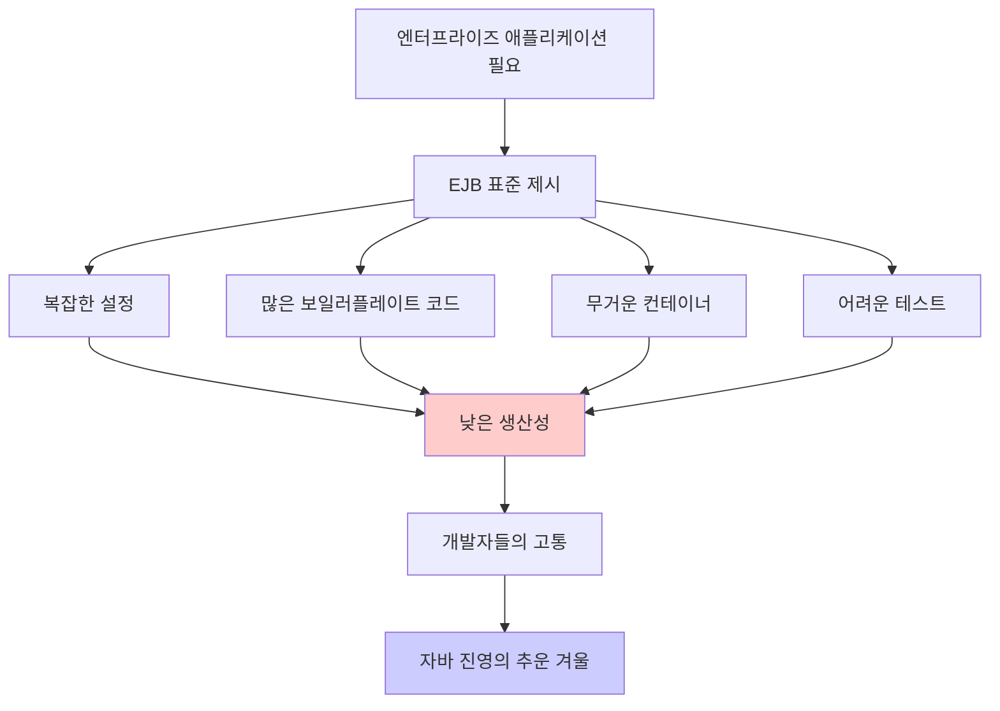
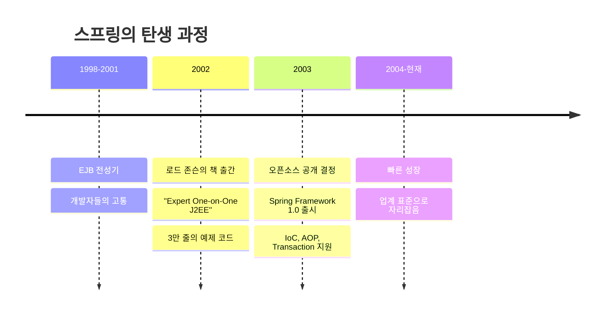
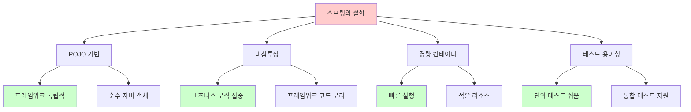

# 1-1. 자바 진영의 추운 겨울과 스프링의 탄생

**출처**: 인프런 - 스프링 핵심 원리 기본편
**강의 시간**: 15:22
**작성일**: 2025-10-23

## 학습 목표
이 챕터를 학습한 후 다음을 할 수 있습니다:
- [ ] EJB의 문제점과 한계를 이해하고 설명할 수 있습니다
- [ ] 스프링 프레임워크가 탄생하게 된 역사적 배경을 설명할 수 있습니다
- [ ] 스프링의 핵심 철학(POJO, 경량 컨테이너)을 이해할 수 있습니다
- [ ] EJB와 스프링의 차이점을 설명할 수 있습니다

## 🔗 연관 개념
- **선행 학습 권장**: 자바 기본 문법, 엔터프라이즈 애플리케이션 개념
- **후속 학습**: 1-2. 스프링이란?
- **관련 챕터**: 1-5. 객체 지향 설계와 스프링

---

## 목차
1. [EJB의 시대 - 추운 겨울](#1-ejb의-시대---추운-겨울)
2. [스프링의 탄생](#2-스프링의-탄생)
3. [스프링의 철학과 목표](#3-스프링의-철학과-목표)

---

## 1. EJB의 시대 - 추운 겨울

> 📌 **TL;DR (Too Long; Didn't Read)**
> - EJB는 1990년대 후반 자바 엔터프라이즈 개발의 표준이었습니다
> - 복잡한 설정, 낮은 생산성, 무거운 컨테이너로 개발자들이 고통받았습니다
> - 간단한 기능도 많은 코드와 설정이 필요했습니다

### 핵심 개념
- **EJB (Enterprise JavaBeans)**: 자바 기반 서버 사이드 컴포넌트 모델
- **J2EE**: Java 2 Platform, Enterprise Edition (현재 Jakarta EE)
- **무거운 컨테이너**: EJB 컨테이너는 설정과 실행이 복잡하고 무거웠음
- **복잡한 개발 프로세스**: 인터페이스, 구현체, 설정 파일 등 많은 파일 필요

### 상세 설명

#### EJB란?
1990년대 후반, 자바 진영은 엔터프라이즈 애플리케이션 개발을 위해 **EJB(Enterprise JavaBeans)**를 표준으로 제시했습니다.

EJB의 목표:
- 분산 트랜잭션 처리
- 보안
- 동시성 제어
- 영속성 관리
- 원격 호출(RMI)

이론적으로는 훌륭했지만, 실제 사용에는 많은 문제가 있었습니다.

#### EJB의 주요 문제점

**1. 복잡한 설정**
```xml
<!-- EJB 설정 파일 예시 (ejb-jar.xml) -->
<ejb-jar>
    <enterprise-beans>
        <session>
            <ejb-name>UserService</ejb-name>
            <home>com.example.UserServiceHome</home>
            <remote>com.example.UserServiceRemote</remote>
            <ejb-class>com.example.UserServiceBean</ejb-class>
            <session-type>Stateless</session-type>
            <transaction-type>Container</transaction-type>
        </session>
    </enterprise-beans>
</ejb-jar>

<!-- 추가로 weblogic-ejb-jar.xml, jboss-ejb.xml 등 서버별 설정 파일도 필요 -->
```

**2. 많은 코드**
간단한 기능을 만들기 위해 여러 클래스와 인터페이스가 필요했습니다:

```java
// 1. Home 인터페이스
public interface UserServiceHome extends EJBHome {
    UserServiceRemote create() throws CreateException, RemoteException;
}

// 2. Remote 인터페이스
public interface UserServiceRemote extends EJBObject {
    User findUser(Long id) throws RemoteException;
}

// 3. Bean 구현체
public class UserServiceBean implements SessionBean {
    private SessionContext ctx;

    public void ejbCreate() { }
    public void ejbRemove() { }
    public void ejbActivate() { }
    public void ejbPassivate() { }
    public void setSessionContext(SessionContext ctx) {
        this.ctx = ctx;
    }

    // 실제 비즈니스 로직
    public User findUser(Long id) {
        // 사용자 조회 로직
        return user;
    }
}

// 4. 추가로 배포 디스크립터(XML) 파일들...
```

비즈니스 로직은 단 몇 줄인데, 이를 위해 수십 줄의 보일러플레이트 코드가 필요했습니다.

**3. 낮은 생산성**
- 코드 작성에 시간이 오래 걸림
- 배포할 때마다 전체 애플리케이션 서버 재시작 필요
- 간단한 수정에도 많은 시간 소요

**4. 어려운 테스트**
```java
// EJB는 컨테이너 밖에서 테스트할 수 없음
public class UserServiceTest {
    @Test
    public void testFindUser() {
        // EJB 컨테이너가 필요함!
        // 단위 테스트가 거의 불가능
        InitialContext ctx = new InitialContext();
        UserServiceHome home = (UserServiceHome) ctx.lookup("UserService");
        UserServiceRemote service = home.create();
        User user = service.findUser(1L);
        // ...
    }
}
```

**5. 무거운 컨테이너**
- WebLogic, WebSphere 등의 WAS가 필요
- 시작 시간이 오래 걸림 (수 분)
- 메모리를 많이 사용
- 라이선스 비용이 비쌈

#### 개발자들의 고통
이러한 문제들로 인해:
- 개발 생산성이 극도로 낮았습니다
- 학습 곡선이 매우 가파랐습니다
- 대부분의 프로젝트가 복잡도를 감당하지 못했습니다
- "자바 진영의 추운 겨울"이라고 불렸습니다

### 다이어그램



### 주요 포인트
- EJB는 이론적으로는 훌륭했지만, 실용성이 매우 떨어졌습니다
- 복잡성이 너무 높아 대부분의 프로젝트에서 오버스펙이었습니다
- 개발자들은 더 간단하고 가벼운 솔루션을 원했습니다
- 이것이 스프링 탄생의 배경이 됩니다

### 예제

**EJB vs 현대적인 방식 비교:**

```java
// EJB 방식 (2000년대 초)
@Stateless
public class OrderServiceBean implements OrderServiceRemote {
    @EJB
    private UserServiceRemote userService;

    @Resource
    private SessionContext ctx;

    public Order createOrder(Long userId, String item) {
        try {
            User user = userService.findUser(userId);
            Order order = new Order(user, item);
            // 복잡한 처리...
            return order;
        } catch (RemoteException e) {
            ctx.setRollbackOnly();
            throw new EJBException(e);
        }
    }
}

// 현대적인 방식 (스프링)
@Service
public class OrderService {
    private final UserRepository userRepository;

    public OrderService(UserRepository userRepository) {
        this.userRepository = userRepository;
    }

    @Transactional
    public Order createOrder(Long userId, String item) {
        User user = userRepository.findById(userId);
        Order order = new Order(user, item);
        return order;
    }
}
```

차이점:
- 특별한 인터페이스 상속 불필요
- 예외 처리가 간단
- POJO 기반으로 테스트 용이
- 코드가 훨씬 간결

### 💡 Tip
- EJB가 나쁜 기술은 아니었습니다. 당시의 기술적 한계와 과도한 목표가 문제였습니다
- 현재는 Jakarta EE로 발전하여 많이 개선되었지만, 스프링의 점유율이 압도적입니다
- 역사를 이해하면 왜 스프링이 필요했는지 더 명확히 알 수 있습니다

### ⚠️ 주의사항
- EJB를 비판하기 위한 것이 아닙니다. 역사적 맥락을 이해하는 것이 중요합니다
- 당시에는 최선의 선택이었지만, 실용성 측면에서 한계가 있었습니다

### 💡 심화 내용
<details>
<summary>더 알아보기</summary>

#### EJB가 복잡했던 기술적 이유

**1. 분산 시스템 고려**
EJB는 원격 호출(RMI)을 기본으로 설계되었습니다:
```java
// 원격 호출을 위한 인터페이스
public interface UserService extends EJBObject {
    User findUser(Long id) throws RemoteException;  // RemoteException 필수
}
```

문제:
- 대부분의 애플리케이션은 단일 서버에서 실행
- 분산 시스템의 복잡성을 모든 애플리케이션이 감당
- 불필요한 네트워크 오버헤드

**2. 엔터프라이즈 기능의 강제**
EJB는 트랜잭션, 보안, 동시성 등을 모두 제공:
```java
@TransactionAttribute(TransactionAttributeType.REQUIRES_NEW)
@RolesAllowed({"ADMIN", "USER"})
public class OrderServiceBean { }
```

문제:
- 필요하지 않은 기능도 포함
- 컨테이너가 무거워짐
- 학습 비용 증가

**3. 컨테이너 종속성**
```java
public class UserServiceBean implements SessionBean {
    private SessionContext ctx;  // EJB 컨테이너에 종속

    public void setSessionContext(SessionContext ctx) {
        this.ctx = ctx;  // 컨테이너가 주입
    }
}
```

문제:
- 컨테이너 없이는 실행 불가능
- 단위 테스트 어려움
- 코드 재사용성 낮음

#### EJB의 버전별 발전

**EJB 1.x (1998)**
- 초기 버전, 매우 복잡

**EJB 2.x (2001)**
- Local Interface 추가
- 여전히 복잡함

**EJB 3.0 (2006)**
- 어노테이션 도입
- 많이 개선되었지만 이미 스프링이 대세

**EJB 3.2 (2013, Jakarta EE)**
- 현대적으로 개선
- 하지만 시장은 이미 스프링이 장악

#### 당시의 대안들

**1. Struts**
- 웹 프레임워크
- EJB보다 가벼웠지만 웹 계층만 담당

**2. Hibernate**
- ORM 프레임워크
- EJB Entity Bean의 대안
- 현재도 널리 사용됨

**3. Spring**
- 포괄적인 경량 프레임워크
- POJO 기반
- 결국 업계 표준이 됨

</details>

### 정리
- EJB는 자바 엔터프라이즈 개발의 첫 번째 표준이었습니다
- 복잡성, 낮은 생산성, 무거운 컨테이너로 인해 개발자들이 고통받았습니다
- 이러한 문제점들이 스프링 프레임워크 탄생의 배경이 되었습니다
- "실용성"과 "개발자 경험"의 중요성을 일깨워준 사례입니다

---

## 2. 스프링의 탄생

> 📌 **TL;DR (Too Long; Didn't Read)**
> - 2002년 로드 존슨이 EJB 없이도 고품질 애플리케이션 개발이 가능함을 증명
> - 약 3만 줄의 예제 코드가 스프링의 기원이 되었습니다
> - 2003년 Spring Framework 1.0 정식 출시

### 핵심 개념
- **로드 존슨 (Rod Johnson)**: 스프링의 창시자
- **Expert One-on-One J2EE Design and Development**: 스프링의 모태가 된 책
- **오픈소스**: 커뮤니티의 요청으로 코드를 공개
- **Spring 1.0**: 2003년 6월 정식 출시

### 상세 설명

#### 로드 존슨과 그의 책

**2002년, 운명의 책 출간**
로드 존슨(Rod Johnson)은 "Expert One-on-One J2EE Design and Development"라는 책을 출간했습니다.

이 책의 핵심 주장:
- **EJB 없이도** 고품질의 엔터프라이즈 애플리케이션을 개발할 수 있다
- **POJO**만으로 충분하다
- **실용적인 접근**이 필요하다

**책의 구성:**
- EJB의 문제점 분석
- 대안적인 아키텍처 제시
- 약 **3만 줄의 예제 코드** 포함

이 예제 코드가 바로 **스프링 프레임워크의 기원**이 되었습니다.

#### 커뮤니티의 반응

책이 출간되자 개발자들의 반응:
- "이 코드가 바로 우리가 원하던 것이다!"
- "오픈소스로 공개해달라!"
- "함께 개발하고 싶다!"

로드 존슨은 이러한 요청을 받아들여 코드를 오픈소스로 공개하기로 결정했습니다.

#### Spring Framework의 탄생

**2003년 6월**
- Spring Framework 1.0 정식 출시
- 핵심 기능:
  - IoC/DI 컨테이너
  - AOP 지원
  - 트랜잭션 추상화
  - JDBC 추상화

**프로젝트 이름의 유래**
"Spring"이라는 이름은 **"겨울(EJB) 이후에 오는 봄"**을 의미합니다.
- EJB의 "추운 겨울"이 끝나고
- 새로운 "봄"이 시작된다는 의미

#### 스프링의 초기 핵심 멤버

**로드 존슨 (Rod Johnson)**
- 스프링의 창시자
- Interface21 회사 설립 (후에 SpringSource로 변경)

**유르겐 휠러 (Juergen Hoeller)**
- 스프링의 공동 창시자
- 현재까지도 스프링 프로젝트 리드

**초기 커뮤니티**
- 전 세계 개발자들이 참여
- 빠르게 성장하는 생태계

### 다이어그램



### 주요 포인트
- 스프링은 한 개인의 문제 인식에서 시작되었습니다
- 커뮤니티의 힘으로 성장한 오픈소스 프로젝트입니다
- EJB의 복잡성을 해결하는 것이 초기 목표였습니다
- "실용성"을 최우선으로 하는 철학

### 예제

**초기 Spring 1.0의 Bean 설정 (2003년)**
```xml
<?xml version="1.0" encoding="UTF-8"?>
<!DOCTYPE beans PUBLIC "-//SPRING//DTD BEAN//EN"
    "http://www.springframework.org/dtd/spring-beans.dtd">

<beans>
    <!-- Bean 정의 -->
    <bean id="userService" class="com.example.UserServiceImpl">
        <property name="userRepository">
            <ref bean="userRepository"/>
        </property>
    </bean>

    <bean id="userRepository" class="com.example.UserRepositoryImpl"/>
</beans>
```

**Java 코드 (POJO)**
```java
// EJB와 달리 특별한 인터페이스 상속 불필요
public class UserServiceImpl {
    private UserRepository userRepository;

    // Setter를 통한 의존성 주입
    public void setUserRepository(UserRepository userRepository) {
        this.userRepository = userRepository;
    }

    public User findUser(Long id) {
        return userRepository.findById(id);
    }
}
```

차이점:
- 순수한 자바 객체 (POJO)
- EJB 특유의 인터페이스 불필요
- XML로 의존관계 설정
- 컨테이너 없이도 테스트 가능

### 💡 Tip
- 스프링의 성공 요인은 "실용성"입니다
- 개발자의 문제를 해결하는 것에 집중했습니다
- 오픈소스 커뮤니티의 힘을 보여주는 사례입니다

### 💡 심화 내용
<details>
<summary>더 알아보기</summary>

#### 로드 존슨에 대하여

**배경:**
- 음악학 박사 출신 (컴퓨터 공학 전공 아님!)
- J2EE 컨설턴트로 활동
- 많은 프로젝트에서 EJB의 문제점 경험

**철학:**
- "Keep it simple"
- "Pragmatic approach"
- "Developer experience matters"

**현재:**
- Spring 프로젝트를 떠남
- 다양한 스타트업 자문
- 기술 리더로 활동

#### Spring 1.0의 핵심 기능

**1. IoC 컨테이너**
```java
// BeanFactory: 가장 기본적인 컨테이너
BeanFactory factory = new XmlBeanFactory(
    new FileSystemResource("beans.xml")
);
UserService service = (UserService) factory.getBean("userService");
```

**2. AOP 지원**
```xml
<bean id="transactionInterceptor"
      class="org.springframework.transaction.interceptor.TransactionInterceptor">
    <property name="transactionManager" ref="transactionManager"/>
</bean>
```

**3. 트랜잭션 추상화**
```java
// 다양한 트랜잭션 매니저 지원
PlatformTransactionManager txManager = ...;
TransactionTemplate template = new TransactionTemplate(txManager);
template.execute(new TransactionCallback() {
    public Object doInTransaction(TransactionStatus status) {
        // 트랜잭션 코드
    }
});
```

#### 초기 Spring vs EJB 비교

| 특징 | EJB 2.x | Spring 1.0 |
|------|---------|-----------|
| 컨테이너 | 무거움 (WAS 필요) | 가벼움 (Tomcat도 가능) |
| 코드 스타일 | 인터페이스 상속 필수 | POJO |
| 설정 | 여러 XML 파일 | 단일 XML 파일 |
| 테스트 | 어려움 | 쉬움 |
| 학습 곡선 | 가파름 | 완만함 |

#### Spring이 받아들인 EJB의 좋은 아이디어

스프링은 EJB를 전면 부정한 것이 아니라, 좋은 아이디어는 수용했습니다:

**1. 선언적 트랜잭션**
```java
// EJB의 아이디어
@TransactionAttribute(TransactionAttributeType.REQUIRED)
public void businessMethod() { }

// Spring에서 수용
@Transactional
public void businessMethod() { }
```

**2. 의존성 주입**
```java
// EJB
@EJB
private UserService userService;

// Spring
@Autowired
private UserService userService;
```

**3. AOP 개념**
- EJB의 인터셉터 개념을 더 발전시킴

#### Spring 생태계의 확장

**2004년:** Spring 1.1 출시
**2006년:** Spring 2.0 출시 (Java 5 지원)
**2009년:** Spring 3.0 출시 (Java Config)
**2013년:** Spring 4.0 출시 (Java 8 지원)
**2014년:** **Spring Boot 1.0** 출시 (혁명적 변화)
**2017년:** Spring 5.0 출시 (Reactive 지원)
**현재:** Spring 6.0 이상 (Java 17+)

</details>

### 정리
- 스프링은 로드 존슨의 책에서 시작된 오픈소스 프로젝트입니다
- 2003년 정식 출시 이후 빠르게 성장하여 자바 진영의 표준이 되었습니다
- EJB의 대안으로 시작했지만, 더 나은 방향을 제시했습니다
- 실용성과 개발자 경험을 중시하는 철학이 성공의 핵심이었습니다

---

## 3. 스프링의 철학과 목표

> 📌 **TL;DR (Too Long; Didn't Read)**
> - POJO 기반 개발: 프레임워크에 종속되지 않는 순수 자바 객체
> - 비침투성: 비즈니스 로직에 프레임워크 코드가 침투하지 않음
> - 경량 컨테이너: 가볍고 빠른 실행 환경

### 핵심 개념
- **POJO (Plain Old Java Object)**: 특정 프레임워크에 종속되지 않는 순수한 자바 객체
- **비침투성 (Non-invasive)**: 프레임워크가 애플리케이션 코드에 침투하지 않음
- **경량 컨테이너**: EJB 컨테이너에 비해 가볍고 빠름
- **테스트 용이성**: 단위 테스트가 쉬운 구조

### 상세 설명

#### 1. POJO 기반 개발

**POJO란?**
Plain Old Java Object의 약자로, 특별한 제약이 없는 평범한 자바 객체를 의미합니다.

**POJO의 조건:**
- 특정 클래스를 상속받지 않음
- 특정 인터페이스를 구현하지 않음 (선택적으로는 가능)
- 특정 어노테이션을 필수로 사용하지 않음

**POJO 예시:**
```java
// POJO - 순수한 자바 객체
public class User {
    private Long id;
    private String name;
    private String email;

    public User(String name, String email) {
        this.name = name;
        this.email = email;
    }

    // getter, setter...
}

// POJO - 비즈니스 로직
public class OrderService {
    private final OrderRepository orderRepository;
    private final DiscountPolicy discountPolicy;

    public OrderService(OrderRepository orderRepository,
                        DiscountPolicy discountPolicy) {
        this.orderRepository = orderRepository;
        this.discountPolicy = discountPolicy;
    }

    public Order createOrder(Member member, String itemName, int price) {
        int discount = discountPolicy.discount(member, price);
        return new Order(member, itemName, price, discount);
    }
}
```

**POJO가 아닌 예 (EJB):**
```java
// EJB - 프레임워크에 종속됨
public class OrderServiceBean implements SessionBean {
    private SessionContext ctx;  // EJB 프레임워크에 종속

    public void ejbCreate() { }
    public void ejbRemove() { }
    public void ejbActivate() { }
    public void ejbPassivate() { }
    public void setSessionContext(SessionContext ctx) {
        this.ctx = ctx;
    }

    // 비즈니스 로직
    public Order createOrder(...) { }
}
```

**POJO의 장점:**
1. **테스트 용이**: 프레임워크 없이 단위 테스트 가능
2. **재사용성**: 다른 환경에서도 사용 가능
3. **가독성**: 비즈니스 로직에 집중
4. **유지보수**: 프레임워크 변경에 영향 적음

#### 2. 비침투성 (Non-invasive)

**비침투성이란?**
프레임워크 코드가 애플리케이션 코드에 침투하지 않는 것을 의미합니다.

**침투적 프레임워크 (EJB):**
```java
// 프레임워크 코드가 비즈니스 로직에 침투
public class OrderServiceBean implements SessionBean {  // ← 프레임워크 인터페이스
    private SessionContext ctx;  // ← 프레임워크 타입

    // 프레임워크가 강제하는 메서드들
    public void ejbCreate() { }
    public void ejbRemove() { }
    // ...

    // 비즈니스 로직
    public Order createOrder(...) { }
}
```

**비침투적 프레임워크 (Spring):**
```java
// 순수 자바 코드, 프레임워크 독립적
public class OrderService {
    private final OrderRepository orderRepository;

    public OrderService(OrderRepository orderRepository) {
        this.orderRepository = orderRepository;
    }

    public Order createOrder(...) {
        // 순수한 비즈니스 로직
    }
}

// 프레임워크 설정은 별도로 (XML 또는 Java Config)
@Configuration
public class AppConfig {
    @Bean
    public OrderService orderService() {
        return new OrderService(orderRepository());
    }
}
```

**비침투성의 장점:**
- 비즈니스 로직이 명확함
- 프레임워크 교체가 쉬움
- 도메인 모델이 깨끗함

#### 3. 경량 컨테이너

**경량 컨테이너란?**
EJB 컨테이너에 비해 가볍고, 실행이 빠른 컨테이너입니다.

**EJB 컨테이너 vs Spring 컨테이너:**

| 비교 항목 | EJB 컨테이너 | Spring 컨테이너 |
|----------|-------------|----------------|
| WAS | WebLogic, WebSphere 필요 | Tomcat만으로도 충분 |
| 시작 시간 | 수 분 | 수 초 |
| 메모리 | 많이 사용 | 적게 사용 |
| 배포 | 복잡 | 간단 |
| 비용 | 라이선스 비용 높음 | 무료 (오픈소스) |

**Spring 컨테이너의 특징:**
```java
// 간단한 컨테이너 생성 및 사용
ApplicationContext context =
    new AnnotationConfigApplicationContext(AppConfig.class);

OrderService orderService = context.getBean(OrderService.class);
orderService.createOrder(...);
```

**경량 컨테이너의 장점:**
- 개발 속도 향상 (빠른 재시작)
- 낮은 진입 장벽
- 적은 리소스 사용
- 비용 절감

#### 4. 테스트 용이성

**스프링의 테스트 철학:**
테스트하기 쉬운 코드가 좋은 코드입니다.

**POJO로 인한 테스트 용이성:**
```java
// 스프링 없이 순수 자바로 테스트 가능
@Test
void createOrder() {
    // given
    OrderRepository mockRepository = new MemoryOrderRepository();
    DiscountPolicy mockPolicy = new FixDiscountPolicy();
    OrderService orderService = new OrderService(mockRepository, mockPolicy);

    Member member = new Member(1L, "memberA", Grade.VIP);

    // when
    Order order = orderService.createOrder(member, "itemA", 10000);

    // then
    assertThat(order.getDiscountPrice()).isEqualTo(1000);
}
```

**스프링 테스트 지원:**
```java
// 스프링 컨텍스트를 이용한 통합 테스트도 지원
@SpringBootTest
class OrderServiceIntegrationTest {
    @Autowired
    OrderService orderService;

    @Test
    void createOrder() {
        // 실제 스프링 빈으로 테스트
    }
}
```

### 다이어그램



### 주요 포인트
- **POJO 기반**: 특정 프레임워크에 종속되지 않는 순수 자바 객체 사용
- **비침투성**: 프레임워크가 비즈니스 로직에 침투하지 않음
- **경량**: 가볍고 빠른 컨테이너, Tomcat만으로도 실행 가능
- **테스트**: 단위 테스트가 쉬운 구조

### 예제

**스프링의 철학이 반영된 코드:**

```java
// 1. POJO - 도메인 모델
public class Order {
    private final Member member;
    private final String itemName;
    private final int itemPrice;
    private final int discountPrice;

    public Order(Member member, String itemName,
                 int itemPrice, int discountPrice) {
        this.member = member;
        this.itemName = itemName;
        this.itemPrice = itemPrice;
        this.discountPrice = discountPrice;
    }

    public int calculatePrice() {
        return itemPrice - discountPrice;
    }
}

// 2. POJO - 서비스 계층 (비침투성)
public class OrderService {
    private final MemberRepository memberRepository;
    private final DiscountPolicy discountPolicy;

    // 생성자 주입
    public OrderService(MemberRepository memberRepository,
                        DiscountPolicy discountPolicy) {
        this.memberRepository = memberRepository;
        this.discountPolicy = discountPolicy;
    }

    public Order createOrder(Long memberId, String itemName, int itemPrice) {
        Member member = memberRepository.findById(memberId);
        int discountPrice = discountPolicy.discount(member, itemPrice);

        return new Order(member, itemName, itemPrice, discountPrice);
    }
}

// 3. 테스트 용이성
@Test
void pureJavaTest() {
    // 스프링 없이 테스트 가능
    MemberRepository repository = new MemoryMemberRepository();
    repository.save(new Member(1L, "memberA", Grade.VIP));

    DiscountPolicy policy = new FixDiscountPolicy();
    OrderService service = new OrderService(repository, policy);

    Order order = service.createOrder(1L, "itemA", 10000);

    assertThat(order.getDiscountPrice()).isEqualTo(1000);
}

// 4. 경량 컨테이너 - 설정
@Configuration
public class AppConfig {
    @Bean
    public OrderService orderService() {
        return new OrderService(
            memberRepository(),
            discountPolicy()
        );
    }

    @Bean
    public MemberRepository memberRepository() {
        return new MemoryMemberRepository();
    }

    @Bean
    public DiscountPolicy discountPolicy() {
        return new RateDiscountPolicy();
    }
}
```

### 💡 Tip
- POJO를 유지하려 노력하세요. 프레임워크 의존성은 최소화하세요
- 비즈니스 로직과 프레임워크 코드를 분리하세요
- 테스트를 먼저 생각하고 코드를 작성하세요 (TDD)

### ⚠️ 주의사항
- 어노테이션을 사용한다고 POJO가 아닌 것은 아닙니다
- 스프링의 어노테이션(@Service, @Repository 등)은 메타데이터일 뿐, 코드 침투는 아닙니다
- 하지만 과도한 어노테이션 사용은 가독성을 해칠 수 있습니다

### 💡 심화 내용
<details>
<summary>더 알아보기</summary>

#### POJO의 다양한 레벨

**Level 1: 순수 POJO**
```java
public class User {
    private String name;
    // getter, setter, 비즈니스 메서드
}
```

**Level 2: 스프링 어노테이션 POJO**
```java
@Entity  // JPA 어노테이션
public class User {
    @Id
    private Long id;
    private String name;
}
```
- 여전히 POJO로 간주됨
- 어노테이션은 메타데이터
- 코드 동작에 직접적 영향 없음

**Level 3: 프레임워크 종속**
```java
public class UserBean extends FrameworkBaseClass {
    // 프레임워크 메서드 오버라이드 필수
    @Override
    public void frameworkMethod() { }
}
```
- POJO가 아님
- 프레임워크에 강하게 결합

#### 스프링의 비침투성 구현 방식

**1. 인터페이스 기반 프로그래밍**
```java
// 도메인 계층은 스프링을 모름
public interface OrderService {
    Order createOrder(...);
}

// 구현체도 순수 자바
public class OrderServiceImpl implements OrderService {
    private final OrderRepository repository;

    public OrderServiceImpl(OrderRepository repository) {
        this.repository = repository;
    }

    @Override
    public Order createOrder(...) {
        // 비즈니스 로직
    }
}

// 스프링 설정은 분리
@Configuration
public class AppConfig {
    @Bean
    public OrderService orderService() {
        return new OrderServiceImpl(orderRepository());
    }
}
```

**2. AOP를 통한 관심사 분리**
```java
// 비즈니스 로직 (트랜잭션 코드 없음)
public class OrderService {
    public Order createOrder(...) {
        // 순수 비즈니스 로직만
    }
}

// 트랜잭션은 AOP로 분리
@Configuration
@EnableTransactionManagement
public class AppConfig {
    @Bean
    public TransactionInterceptor transactionInterceptor() {
        // 트랜잭션 로직 분리
    }
}
```

#### 경량 컨테이너의 기술적 구현

**스프링 컨테이너의 핵심:**
```java
// BeanFactory: 가장 기본적인 컨테이너
public interface BeanFactory {
    Object getBean(String name);
    <T> T getBean(String name, Class<T> requiredType);
    boolean containsBean(String name);
}

// ApplicationContext: 확장된 컨테이너
public interface ApplicationContext extends BeanFactory {
    String getApplicationName();
    AutowireCapableBeanFactory getAutowireCapableBeanFactory();
    // 추가 기능들...
}
```

**가벼운 이유:**
1. 필요한 기능만 로드
2. Lazy Initialization 지원
3. 효율적인 빈 관리

#### 실무에서의 POJO 유지 전략

**도메인 주도 설계 (DDD)와의 결합:**
```java
// Domain Layer - 순수 POJO
public class Order {
    private OrderStatus status;
    private List<OrderItem> items;

    public void cancel() {
        if (status == OrderStatus.DELIVERED) {
            throw new IllegalStateException("배송 완료된 주문은 취소할 수 없습니다");
        }
        this.status = OrderStatus.CANCELED;
    }
}

// Application Layer - 스프링 사용
@Service
@Transactional
public class OrderService {
    private final OrderRepository orderRepository;

    public void cancelOrder(Long orderId) {
        Order order = orderRepository.findById(orderId);
        order.cancel();  // 도메인 로직 호출
    }
}
```

**헥사고날 아키텍처:**
```
[Domain Core - POJO]
       ↕
[Port - Interface]
       ↕
[Adapter - Spring]
```

**클린 아키텍처:**
- 내부 원: 순수 도메인 (POJO)
- 외부 원: 프레임워크 (Spring)
- 의존성 방향: 외부 → 내부

</details>

### 정리
- 스프링의 핵심 철학은 **POJO, 비침투성, 경량, 테스트 용이성**입니다
- POJO 기반 개발로 프레임워크에 종속되지 않는 코드를 작성합니다
- 비침투적 설계로 비즈니스 로직에 집중할 수 있습니다
- 경량 컨테이너로 빠르고 효율적인 개발 환경을 제공합니다
- 이러한 철학이 스프링을 성공으로 이끈 핵심 요인입니다

---

## 전체 요약
- EJB는 복잡하고 무거워 개발 생산성이 매우 낮았습니다 ("추운 겨울")
- 2002년 로드 존슨이 EJB 없이도 고품질 애플리케이션 개발이 가능함을 증명했습니다
- 2003년 Spring Framework 1.0이 출시되어 "봄"이 시작되었습니다
- 스프링의 핵심 철학은 POJO, 비침투성, 경량 컨테이너, 테스트 용이성입니다
- 실용성과 개발자 경험을 중시하는 철학이 스프링 성공의 핵심이었습니다

## 학습 체크리스트
- [ ] EJB의 문제점을 3가지 이상 설명할 수 있다
- [ ] 스프링이 탄생하게 된 배경과 역사를 설명할 수 있다
- [ ] POJO가 무엇인지 설명하고 예시를 들 수 있다
- [ ] 비침투성의 의미와 중요성을 설명할 수 있다
- [ ] EJB와 스프링의 차이점을 설명할 수 있다
- [ ] 면접 질문에 답할 수 있다

## 다음 학습
다음 챕터에서는 "스프링이란?"을 통해 스프링의 구체적인 기능과 생태계를 학습합니다.

---

## 면접 질문

### 초급 개발자 (Junior)

**Q1. EJB의 주요 문제점을 3가지 설명해주세요.**
<details>
<summary>답안 보기</summary>

1. **복잡한 설정**
   - 많은 XML 설정 파일이 필요
   - Home, Remote 인터페이스 등 여러 파일 작성 필요
   - 간단한 기능도 많은 보일러플레이트 코드 필요

2. **낮은 생산성**
   - 개발 시간이 오래 걸림
   - 배포할 때마다 WAS 재시작 필요
   - 테스트가 어려움

3. **무거운 컨테이너**
   - WebLogic, WebSphere 같은 무거운 WAS 필요
   - 시작 시간이 오래 걸림 (수 분)
   - 많은 메모리 사용
   - 높은 라이선스 비용

</details>

**Q2. POJO가 무엇인지 설명해주세요.**
<details>
<summary>답안 보기</summary>

**POJO (Plain Old Java Object)는:**
- 특정 프레임워크에 종속되지 않는 순수한 자바 객체입니다

**POJO의 특징:**
1. 특정 클래스를 상속받지 않음
2. 특정 인터페이스를 필수로 구현하지 않음
3. 프레임워크 어노테이션에 의존하지 않음 (선택적 사용은 가능)

**예시:**
```java
// POJO
public class User {
    private String name;
    private String email;

    public User(String name, String email) {
        this.name = name;
        this.email = email;
    }
    // getter, setter
}

// POJO가 아닌 예 (EJB)
public class UserBean extends EJBObject {
    // 프레임워크 클래스 상속 - 종속적
}
```

**POJO의 장점:**
- 테스트하기 쉬움
- 다른 환경에서도 재사용 가능
- 비즈니스 로직에 집중 가능

</details>

### 중급 개발자 (Mid-Level)

**Q3. 스프링의 비침투성(Non-invasive) 개념과 그 중요성을 설명해주세요.**
<details>
<summary>답안 보기</summary>

**비침투성이란:**
프레임워크 코드가 애플리케이션 코드(특히 비즈니스 로직)에 침투하지 않는 것을 의미합니다.

**침투적 vs 비침투적:**

```java
// 침투적 (EJB)
public class OrderServiceBean implements SessionBean {
    private SessionContext ctx;  // 프레임워크 타입

    // 프레임워크가 강제하는 메서드들
    public void ejbCreate() { }
    public void ejbRemove() { }

    // 비즈니스 로직이 프레임워크 코드와 섞임
    public Order createOrder(...) {
        try {
            // 비즈니스 로직
        } catch (Exception e) {
            ctx.setRollbackOnly();  // 프레임워크 코드
        }
    }
}

// 비침투적 (Spring)
public class OrderService {
    private final OrderRepository repository;

    public OrderService(OrderRepository repository) {
        this.repository = repository;
    }

    // 순수한 비즈니스 로직만
    public Order createOrder(...) {
        // 프레임워크 코드 없음
    }
}
```

**중요성:**
1. **비즈니스 로직 명확화**
   - 도메인 로직에 집중 가능
   - 코드 가독성 향상

2. **테스트 용이성**
   - 프레임워크 없이 단위 테스트 가능
   - Mock 객체 사용 쉬움

3. **유지보수성**
   - 프레임워크 변경에 영향 적음
   - 비즈니스 로직 재사용 가능

4. **설계 개선**
   - 관심사의 분리
   - 높은 응집도, 낮은 결합도

**실무 적용:**
- 도메인 모델은 순수하게 유지
- 프레임워크 설정은 별도 분리 (@Configuration)
- AOP로 공통 관심사 분리 (트랜잭션, 로깅 등)

</details>

**Q4. 스프링이 "경량 컨테이너"라고 불리는 이유를 EJB와 비교하여 설명해주세요.**
<details>
<summary>답안 보기</summary>

**경량 컨테이너의 의미:**
EJB 컨테이너에 비해 가볍고, 빠르고, 사용하기 쉬운 컨테이너를 의미합니다.

**EJB 컨테이너 vs Spring 컨테이너 비교:**

| 항목 | EJB 컨테이너 | Spring 컨테이너 |
|------|-------------|----------------|
| **필요 환경** | WebLogic, WebSphere 등 무거운 WAS | Tomcat 같은 경량 서블릿 컨테이너만으로 충분 |
| **시작 시간** | 수 분 (느림) | 수 초 (빠름) |
| **메모리** | 많이 사용 (GB 단위) | 적게 사용 (MB 단위) |
| **설정** | 복잡한 XML, 여러 파일 | 간단한 설정, Java Config 가능 |
| **배포** | 복잡하고 느림 | 간단하고 빠름 (JAR 실행) |
| **비용** | 라이선스 비용 높음 | 무료 (오픈소스) |
| **개발 사이클** | 재시작 오래 걸림 | 빠른 재시작, Hot Reload 지원 |

**기술적 차이:**

```java
// EJB - 복잡한 설정
@Stateless
@TransactionAttribute(TransactionAttributeType.REQUIRED)
public class OrderServiceBean implements OrderServiceLocal {
    @Resource
    private SessionContext ctx;

    @PersistenceContext
    private EntityManager em;

    // 복잡한 라이프사이클 메서드들
    @PostConstruct
    public void init() { }
}

// Spring - 간단한 설정
@Service
@Transactional
public class OrderService {
    private final OrderRepository repository;

    public OrderService(OrderRepository repository) {
        this.repository = repository;
    }

    // 비즈니스 로직만
}
```

**경량의 핵심 요소:**
1. **선택적 기능 로드**: 필요한 기능만 사용
2. **POJO 기반**: 특별한 인터페이스 불필요
3. **빠른 실행**: 최소한의 초기화
4. **유연한 배포**: JAR 파일만으로 실행 가능

**실무 영향:**
- 개발 생산성 향상 (빠른 재시작)
- 낮은 인프라 비용
- 빠른 피드백 사이클
- 마이크로서비스 아키텍처에 적합

</details>

### 고급 개발자 (Senior)

**Q5. 스프링의 POJO 철학이 현대 아키텍처(DDD, 헥사고날, 클린 아키텍처)와 어떻게 연결되는지 설명하고, 실무 적용 전략을 제시해주세요.**
<details>
<summary>답안 보기</summary>

**POJO 철학과 현대 아키텍처의 연결:**

**1. 도메인 주도 설계 (DDD)**

POJO는 DDD의 핵심인 도메인 모델을 순수하게 유지하는 데 필수적입니다.

```java
// Domain Layer - 순수 POJO (스프링 독립적)
@Entity  // JPA는 허용 (비침투적)
public class Order {
    @Id
    private Long id;
    private OrderStatus status;
    private Money totalAmount;

    // 도메인 로직 - 프레임워크 코드 없음
    public void cancel() {
        if (status == OrderStatus.DELIVERED) {
            throw new IllegalStateException("배송 완료된 주문은 취소 불가");
        }
        this.status = OrderStatus.CANCELED;
    }

    public void pay(PaymentMethod method) {
        if (totalAmount.isLessThan(Money.ZERO)) {
            throw new IllegalArgumentException("금액 오류");
        }
        // 결제 로직
    }
}

// Application Layer - 스프링 활용
@Service
@Transactional
public class OrderService {
    private final OrderRepository orderRepository;
    private final PaymentGateway paymentGateway;

    public void cancelOrder(Long orderId) {
        Order order = orderRepository.findById(orderId);
        order.cancel();  // 순수 도메인 로직 호출
        // 스프링이 트랜잭션 처리
    }
}
```

**2. 헥사고날 아키텍처 (Ports and Adapters)**

```
     [Core Domain - POJO]
            ↕
      [Port - Interface]
            ↕
    [Adapter - Spring Implementation]
```

구체적 구현:
```java
// Core Domain (Inner) - POJO
public class OrderProcessor {
    private final PaymentPort paymentPort;
    private final NotificationPort notificationPort;

    public OrderProcessor(PaymentPort paymentPort,
                         NotificationPort notificationPort) {
        this.paymentPort = paymentPort;
        this.notificationPort = notificationPort;
    }

    public Order process(OrderRequest request) {
        // 순수 비즈니스 로직
        PaymentResult result = paymentPort.process(request.getPayment());
        Order order = createOrder(request, result);
        notificationPort.send(order);
        return order;
    }
}

// Port (Interface) - 도메인 독립적
public interface PaymentPort {
    PaymentResult process(Payment payment);
}

// Adapter (Outer) - 스프링 구현
@Component
public class TossPaymentAdapter implements PaymentPort {
    private final RestTemplate restTemplate;

    @Override
    public PaymentResult process(Payment payment) {
        // 외부 API 호출
        return restTemplate.postForObject(...);
    }
}

// Spring Configuration
@Configuration
public class DomainConfig {
    @Bean
    public OrderProcessor orderProcessor(
            PaymentPort paymentPort,
            NotificationPort notificationPort) {
        return new OrderProcessor(paymentPort, notificationPort);
    }
}
```

**3. 클린 아키텍처**

의존성 규칙: 외부(프레임워크) → 내부(도메인)

```
[Frameworks & Drivers - Spring]
         ↓
[Interface Adapters]
         ↓
[Use Cases - Application Services]
         ↓
[Entities - Domain POJO]
```

**실무 적용 전략:**

**전략 1: 계층별 POJO 적용 수준**

```java
// 1. 엔티티/도메인 - 엄격한 POJO
public class Product {
    private Long id;
    private Money price;
    private Stock stock;

    public void decreaseStock(int quantity) {
        stock.decrease(quantity);
    }
}

// 2. 서비스 - 스프링 활용 (여전히 POJO 정신)
@Service
@Transactional
public class OrderService {
    private final OrderRepository orderRepository;

    // 비즈니스 로직은 순수하게
    public Order createOrder(...) { }
}

// 3. 컨트롤러/어댑터 - 스프링 적극 활용
@RestController
@RequestMapping("/api/orders")
public class OrderController {
    private final OrderService orderService;

    @PostMapping
    public ResponseEntity<OrderResponse> createOrder(@RequestBody OrderRequest request) {
        // 스프링 기능 활용
    }
}
```

**전략 2: 패키지 구조**

```
com.example
├── domain            # 순수 POJO, 스프링 독립
│   ├── order
│   │   ├── Order.java
│   │   ├── OrderItem.java
│   │   └── OrderStatus.java
│   └── payment
│       └── Payment.java
├── application       # 유스케이스, 최소한의 스프링
│   ├── port          # 인터페이스
│   │   ├── OrderRepository.java
│   │   └── PaymentGateway.java
│   └── service       # @Service
│       └── OrderService.java
└── infrastructure    # 스프링 적극 활용
    ├── persistence   # @Repository
    │   └── JpaOrderRepository.java
    └── external      # @Component
        └── TossPaymentGateway.java
```

**전략 3: 테스트 전략**

```java
// 1. 도메인 - 순수 단위 테스트
class OrderTest {
    @Test
    void cancelOrder() {
        Order order = new Order(...);
        order.cancel();
        assertThat(order.getStatus()).isEqualTo(OrderStatus.CANCELED);
    }
}

// 2. 서비스 - Mock 활용
class OrderServiceTest {
    @Test
    void createOrder() {
        OrderRepository mockRepo = mock(OrderRepository.class);
        OrderService service = new OrderService(mockRepo);
        // 스프링 없이 테스트
    }
}

// 3. 통합 - 스프링 컨텍스트
@SpringBootTest
class OrderIntegrationTest {
    @Autowired
    OrderService orderService;
    // 전체 통합 테스트
}
```

**전략 4: 프레임워크 마이그레이션 대비**

```java
// 도메인은 프레임워크 독립적으로 유지
public class OrderDomainService {
    // Spring, Jakarta, Micronaut 어디서든 사용 가능
    public Order createOrder(Customer customer, List<OrderItem> items) {
        // 순수 자바 로직
    }
}

// 프레임워크별 어댑터
// Spring용
@Service
public class SpringOrderService {
    private final OrderDomainService domainService;
    // Spring 특화 기능
}

// Micronaut용 (마이그레이션 시)
@Singleton
public class MicronautOrderService {
    private final OrderDomainService domainService;
    // Micronaut 특화 기능
}
```

**트레이드오프 고려:**

**장점:**
- 프레임워크 독립적 도메인
- 높은 테스트 용이성
- 유지보수성 향상

**단점:**
- 초기 구조 설계 복잡
- 개발자 학습 곡선
- 단순 CRUD에는 오버엔지니어링

**실무 권장:**
- 복잡한 비즈니스 로직 → 엄격한 POJO 적용
- 단순 CRUD → 실용적 접근 (Spring Data JPA 적극 활용)
- 프로젝트 초기 → 간단하게 시작
- 복잡도 증가 → 점진적 리팩토링

</details>

---

## 📚 참고자료

- [Expert One-on-One J2EE Design and Development - Rod Johnson](https://www.amazon.com/Expert-One-One-Design-Development/dp/0764543857)
- [Spring Framework 공식 문서](https://spring.io/projects/spring-framework)
- [Spring Framework 역사](https://spring.io/projects/spring-framework#history)
- [EJB vs Spring 비교](https://www.baeldung.com/spring-vs-ejb)
- 토비의 스프링 3.1 - 이일민 저

---

## 네비게이션
- [➡️ 다음: 1-2. 스프링이란?](./1-2-스프링이란.md)
- [🏠 홈으로: 1. 객체 지향 설계와 스프링 목차](../README.md)
