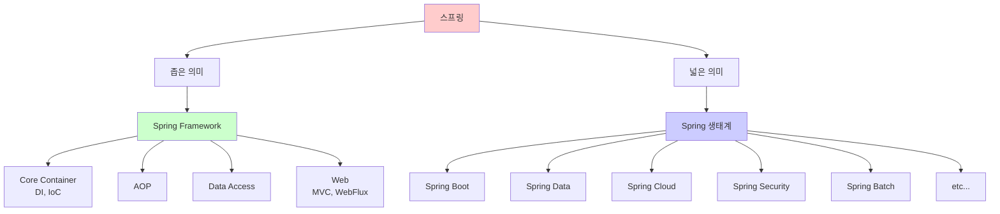
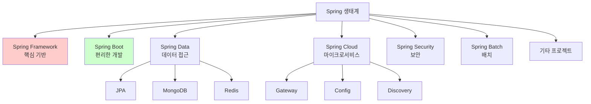
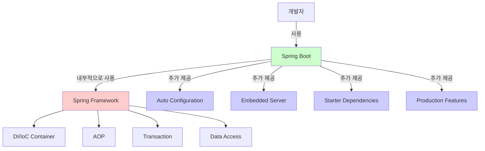

# 1-2. 스프링이란?

**출처**: 인프런 - 스프링 핵심 원리 기본편
**강의 시간**: 14:30
**작성일**: 2025-10-23

## 학습 목표
이 챕터를 학습한 후 다음을 할 수 있습니다:
- [ ] 스프링 프레임워크의 정의와 특징을 설명할 수 있습니다
- [ ] 스프링 생태계의 주요 프로젝트들을 나열하고 설명할 수 있습니다
- [ ] Spring Framework와 Spring Boot의 차이점을 설명할 수 있습니다
- [ ] DI와 IoC의 개념을 이해하고 설명할 수 있습니다

## 🔗 연관 개념
- **선행 학습 권장**: 1-1. 자바 진영의 추운 겨울과 스프링의 탄생
- **후속 학습**: 1-3. 좋은 객체 지향 프로그래밍이란?
- **관련 챕터**: 2. 스프링 핵심 원리 이해1 - 예제 만들기

---

## 목차
1. [스프링의 정의](#1-스프링의-정의)
2. [스프링 생태계](#2-스프링-생태계)
3. [Spring Framework vs Spring Boot](#3-spring-framework-vs-spring-boot)
4. [스프링의 핵심 개념 - DI와 IoC](#4-스프링의-핵심-개념---di와-ioc)

---

## 1. 스프링의 정의

> 📌 **TL;DR (Too Long; Didn't Read)**
> - 스프링은 자바 기반의 엔터프라이즈 애플리케이션 개발 프레임워크입니다
> - 좁은 의미로는 Spring Framework, 넓은 의미로는 스프링 생태계 전체를 의미합니다
> - 핵심 가치는 좋은 객체 지향 애플리케이션을 쉽게 개발할 수 있도록 돕는 것입니다

### 핵심 개념
- **프레임워크**: 애플리케이션 개발을 위한 기본 구조와 규칙을 제공
- **엔터프라이즈 애플리케이션**: 대규모 비즈니스 애플리케이션
- **Spring Framework**: 스프링의 핵심 프레임워크
- **Spring 생태계**: Spring Framework 외 다양한 프로젝트들의 집합

### 상세 설명

#### 스프링이란?

스프링은 두 가지 의미로 사용됩니다:

**1. 좁은 의미의 스프링**
- **Spring Framework** 자체를 의미
- 핵심 기술을 제공하는 프레임워크
- 버전: Spring Framework 6.x (2024년 기준)

**2. 넓은 의미의 스프링**
- **스프링 생태계** 전체를 의미
- Spring Framework를 포함한 다양한 프로젝트들
- Spring Boot, Spring Data, Spring Cloud, Spring Security 등

일반적으로 "스프링"이라고 하면 넓은 의미의 스프링 생태계를 의미합니다.

#### 스프링의 공식 정의

스프링 공식 홈페이지(spring.io)의 설명:
> "Spring makes Java simple, modern, productive, and reactive"

- **Simple**: 복잡한 엔터프라이즈 개발을 단순하게
- **Modern**: 현대적인 개발 방식 지원
- **Productive**: 생산성 향상
- **Reactive**: 리액티브 프로그래밍 지원

#### 스프링의 목표

1. **좋은 객체 지향 애플리케이션 개발 지원**
   - SOLID 원칙을 쉽게 적용
   - 다형성을 극대화

2. **비즈니스 로직에 집중**
   - 반복적인 기술적 문제를 프레임워크가 해결
   - 개발자는 비즈니스 로직에만 집중

3. **엔터프라이즈 급 기능 제공**
   - 트랜잭션 관리
   - 보안
   - 데이터 접근
   - 메시징
   - 등등...

### 다이어그램



### 주요 포인트
- 스프링은 자바 엔터프라이즈 개발의 사실상 표준입니다
- 좁은 의미로는 Spring Framework, 넓은 의미로는 생태계 전체
- 핵심 가치는 좋은 객체 지향 프로그래밍을 쉽게 할 수 있도록 돕는 것

### 예제

**스프링이 해결하는 문제:**

```java
// 스프링 없이 직접 관리 (복잡함)
public class OrderApplication {
    public static void main(String[] args) {
        // 1. 객체 생성
        MemberRepository memberRepository = new MemoryMemberRepository();
        DiscountPolicy discountPolicy = new RateDiscountPolicy();
        OrderService orderService = new OrderServiceImpl(
            memberRepository,
            discountPolicy
        );

        // 2. 트랜잭션 관리
        TransactionManager txManager = new TransactionManager();
        try {
            txManager.begin();
            Order order = orderService.createOrder(1L, "itemA", 10000);
            txManager.commit();
        } catch (Exception e) {
            txManager.rollback();
        }

        // 3. 리소스 정리
        // ...
    }
}

// 스프링 사용 (간단함)
@SpringBootApplication
public class OrderApplication {
    public static void main(String[] args) {
        SpringApplication.run(OrderApplication.class, args);
        // 스프링이 모든 것을 관리
    }
}

@Service
@Transactional  // 선언적 트랜잭션
public class OrderService {
    private final MemberRepository memberRepository;
    private final DiscountPolicy discountPolicy;

    // 생성자 주입 - 스프링이 자동으로 주입
    public OrderService(MemberRepository memberRepository,
                        DiscountPolicy discountPolicy) {
        this.memberRepository = memberRepository;
        this.discountPolicy = discountPolicy;
    }

    public Order createOrder(Long memberId, String itemName, int itemPrice) {
        // 비즈니스 로직만 작성
        Member member = memberRepository.findById(memberId);
        int discountPrice = discountPolicy.discount(member, itemPrice);
        return new Order(memberId, itemName, itemPrice, discountPrice);
    }
}
```

### 💡 Tip
- "스프링"이라고 하면 보통 Spring Boot를 포함한 생태계 전체를 의미합니다
- 하지만 내부적으로는 Spring Framework가 동작하므로 기본을 이해하는 것이 중요합니다

### ⚠️ 주의사항
- 스프링은 자바 전용 프레임워크입니다 (Kotlin도 지원하지만 기본은 자바)
- 스프링을 사용한다고 자동으로 좋은 설계가 되는 것은 아닙니다

---

## 2. 스프링 생태계

> 📌 **TL;DR (Too Long; Didn't Read)**
> - 스프링 생태계는 다양한 프로젝트들의 집합입니다
> - 각 프로젝트는 특정 영역의 문제를 해결합니다
> - 필요한 프로젝트를 선택해서 사용할 수 있습니다

### 핵심 개념
- **Spring Framework**: 핵심 프레임워크
- **Spring Boot**: 스프링을 쉽게 사용하게 해주는 도구
- **Spring Data**: 데이터 접근 기술 통합
- **Spring Cloud**: 마이크로서비스 아키텍처 지원
- **Spring Security**: 보안 프레임워크
- **Spring Batch**: 배치 처리 프레임워크

### 상세 설명

#### 주요 스프링 프로젝트

**1. Spring Framework (핵심)**

스프링의 기반이 되는 핵심 프레임워크입니다.

주요 기능:
- **Core Container**: DI/IoC 컨테이너
- **AOP**: 관점 지향 프로그래밍
- **Data Access**: JDBC, ORM, 트랜잭션
- **Web**: Spring MVC, Spring WebFlux
- **Test**: 테스트 지원

```java
// Spring Framework의 기본 사용
@Configuration
public class AppConfig {
    @Bean
    public OrderService orderService() {
        return new OrderServiceImpl(
            memberRepository(),
            discountPolicy()
        );
    }

    @Bean
    public MemberRepository memberRepository() {
        return new MemoryMemberRepository();
    }

    @Bean
    public DiscountPolicy discountPolicy() {
        return new RateDiscountPolicy();
    }
}
```

**2. Spring Boot (필수)**

스프링을 더 쉽게 사용하게 해주는 도구입니다.

주요 기능:
- **Auto Configuration**: 자동 설정
- **Embedded Server**: 내장 톰캣
- **Starter Dependencies**: 의존성 간편 관리
- **Production Ready**: 운영 기능 (Actuator)

```java
// Spring Boot 사용 (훨씬 간단)
@SpringBootApplication
public class Application {
    public static void main(String[] args) {
        SpringApplication.run(Application.class, args);
    }
}

// application.properties에 설정만 추가
spring.datasource.url=jdbc:mysql://localhost:3306/mydb
spring.datasource.username=user
spring.datasource.password=pass
// 스프링 부트가 자동으로 DataSource, EntityManager 등을 설정
```

**3. Spring Data (데이터 접근)**

다양한 데이터 저장소에 대한 일관된 접근 방법을 제공합니다.

하위 프로젝트:
- **Spring Data JPA**: JPA 기반 데이터 접근
- **Spring Data MongoDB**: MongoDB 연동
- **Spring Data Redis**: Redis 연동
- **Spring Data Elasticsearch**: Elasticsearch 연동

```java
// Spring Data JPA 사용
public interface MemberRepository extends JpaRepository<Member, Long> {
    // 메서드 이름으로 쿼리 자동 생성
    List<Member> findByName(String name);
    Optional<Member> findByEmail(String email);

    // 쿼리 메서드로 복잡한 쿼리도 가능
    @Query("select m from Member m where m.age > :age")
    List<Member> findMembersOlderThan(@Param("age") int age);
}

// 사용
@Service
public class MemberService {
    private final MemberRepository memberRepository;

    public List<Member> findByName(String name) {
        return memberRepository.findByName(name);
        // 구현체를 작성하지 않아도 Spring Data가 자동 생성
    }
}
```

**4. Spring Cloud (마이크로서비스)**

마이크로서비스 아키텍처를 위한 도구들을 제공합니다.

주요 기능:
- **Service Discovery**: Eureka, Consul
- **API Gateway**: Spring Cloud Gateway
- **Config Server**: 중앙 설정 관리
- **Circuit Breaker**: Resilience4j

```java
// Service Discovery 예시
@SpringBootApplication
@EnableEurekaClient
public class OrderServiceApplication {
    public static void main(String[] args) {
        SpringApplication.run(OrderServiceApplication.class, args);
    }
}

@FeignClient("member-service")  // 다른 마이크로서비스 호출
public interface MemberClient {
    @GetMapping("/members/{id}")
    Member getMember(@PathVariable Long id);
}
```

**5. Spring Security (보안)**

인증과 인가를 처리하는 보안 프레임워크입니다.

주요 기능:
- 인증 (Authentication)
- 인가 (Authorization)
- CSRF 방어
- 세션 관리
- OAuth 2.0 지원

```java
// Spring Security 설정
@Configuration
@EnableWebSecurity
public class SecurityConfig {
    @Bean
    public SecurityFilterChain filterChain(HttpSecurity http) throws Exception {
        http
            .authorizeHttpRequests(auth -> auth
                .requestMatchers("/public/**").permitAll()
                .requestMatchers("/admin/**").hasRole("ADMIN")
                .anyRequest().authenticated()
            )
            .formLogin(Customizer.withDefaults())
            .logout(Customizer.withDefaults());

        return http.build();
    }
}
```

**6. Spring Batch (배치 처리)**

대용량 배치 처리를 위한 프레임워크입니다.

주요 기능:
- Job, Step 기반 처리
- Chunk 단위 처리
- 재시작, 재시도 기능
- 트랜잭션 관리

```java
// Spring Batch Job 정의
@Configuration
public class BatchJobConfig {
    @Bean
    public Job userImportJob(JobRepository jobRepository, Step step) {
        return new JobBuilder("userImportJob", jobRepository)
            .start(step)
            .build();
    }

    @Bean
    public Step step(JobRepository jobRepository,
                     PlatformTransactionManager transactionManager) {
        return new StepBuilder("step", jobRepository)
            .<User, User>chunk(100, transactionManager)
            .reader(itemReader())
            .processor(itemProcessor())
            .writer(itemWriter())
            .build();
    }
}
```

**7. 기타 주요 프로젝트**

- **Spring Integration**: 시스템 통합, 메시징
- **Spring Session**: 세션 관리
- **Spring AMQP**: RabbitMQ 연동
- **Spring Kafka**: Kafka 연동
- **Spring REST Docs**: API 문서 자동 생성

### 다이어그램



### 주요 포인트
- 스프링 생태계는 매우 다양하고 방대합니다
- 각 프로젝트는 특정 영역의 문제를 해결합니다
- 필요한 것만 선택해서 사용할 수 있습니다 (모듈화)
- 실무에서는 Spring Boot + 필요한 프로젝트 조합으로 사용합니다

### 예제

**일반적인 웹 애플리케이션 구성:**

```xml
<!-- pom.xml 또는 build.gradle -->
<dependencies>
    <!-- Spring Boot Starter -->
    <dependency>
        <groupId>org.springframework.boot</groupId>
        <artifactId>spring-boot-starter-web</artifactId>
    </dependency>

    <!-- Spring Data JPA -->
    <dependency>
        <groupId>org.springframework.boot</groupId>
        <artifactId>spring-boot-starter-data-jpa</artifactId>
    </dependency>

    <!-- Spring Security -->
    <dependency>
        <groupId>org.springframework.boot</groupId>
        <artifactId>spring-boot-starter-security</artifactId>
    </dependency>

    <!-- Spring Boot Actuator (모니터링) -->
    <dependency>
        <groupId>org.springframework.boot</groupId>
        <artifactId>spring-boot-starter-actuator</artifactId>
    </dependency>
</dependencies>
```

```java
// 위 의존성으로 만든 애플리케이션
@SpringBootApplication
public class Application {
    public static void main(String[] args) {
        SpringApplication.run(Application.class, args);
    }
}

@RestController
@RequestMapping("/api/members")
public class MemberController {
    private final MemberService memberService;

    @GetMapping("/{id}")
    public Member getMember(@PathVariable Long id) {
        return memberService.findById(id);
    }
}

@Service
@Transactional
public class MemberService {
    private final MemberRepository memberRepository;

    public Member findById(Long id) {
        return memberRepository.findById(id)
            .orElseThrow(() -> new EntityNotFoundException());
    }
}

@Repository
public interface MemberRepository extends JpaRepository<Member, Long> {
    // Spring Data JPA가 자동으로 구현
}
```

### 💡 Tip
- 실무에서는 Spring Boot + 필요한 프로젝트를 조합해서 사용합니다
- spring.io 사이트에서 각 프로젝트의 문서를 확인할 수 있습니다
- 처음에는 Spring Boot + Spring Data JPA 정도만 사용해도 충분합니다

### 💡 심화 내용
<details>
<summary>더 알아보기</summary>

#### Spring Initializr

스프링 프로젝트를 빠르게 시작할 수 있는 도구입니다.

**웹사이트**: https://start.spring.io

사용 방법:
1. 프로젝트 메타데이터 입력
2. 필요한 의존성 선택
3. Generate 버튼 클릭
4. 다운로드한 프로젝트 압축 해제 후 개발 시작

선택 가능한 주요 의존성:
- Spring Web (RESTful API)
- Spring Data JPA (데이터베이스)
- Spring Security (보안)
- Lombok (보일러플레이트 코드 제거)
- H2 Database (인메모리 DB)
- MySQL Driver
- PostgreSQL Driver
- 등등...

#### 스프링 생태계의 버전 관리

**Spring Boot BOM (Bill of Materials)**
Spring Boot를 사용하면 의존성 버전을 자동으로 관리합니다:

```xml
<!-- Spring Boot 부모 POM -->
<parent>
    <groupId>org.springframework.boot</groupId>
    <artifactId>spring-boot-starter-parent</artifactId>
    <version>3.2.0</version>
</parent>

<!-- 버전을 명시하지 않아도 호환되는 버전 자동 선택 -->
<dependencies>
    <dependency>
        <groupId>org.springframework.boot</groupId>
        <artifactId>spring-boot-starter-web</artifactId>
        <!-- 버전 생략 -->
    </dependency>
</dependencies>
```

#### 각 프로젝트별 학습 우선순위

**필수 (반드시 학습)**
1. Spring Framework (Core, DI/IoC, AOP)
2. Spring Boot
3. Spring Data JPA

**중요 (실무에서 자주 사용)**
4. Spring Security
5. Spring MVC / WebFlux

**선택 (필요시 학습)**
6. Spring Cloud (마이크로서비스)
7. Spring Batch (배치 처리)
8. 기타 프로젝트

</details>

---

## 3. Spring Framework vs Spring Boot

> 📌 **TL;DR (Too Long; Didn't Read)**
> - Spring Framework는 핵심 기능을 제공하는 프레임워크입니다
> - Spring Boot는 Spring Framework를 쉽게 사용하게 해주는 도구입니다
> - Spring Boot = Spring Framework + 자동 설정 + 내장 서버 + 편의 기능

### 핵심 개념
- **Spring Framework**: 핵심 프레임워크, 직접 설정 필요
- **Spring Boot**: 스프링 사용을 간편하게 해주는 도구
- **Auto Configuration**: 자동 설정
- **Starter Dependencies**: 의존성 간편 관리
- **Embedded Server**: 내장 톰캣

### 상세 설명

#### Spring Framework

**특징:**
- 스프링의 핵심 기능을 제공
- 직접 설정해야 할 것이 많음
- 학습 곡선이 높음
- 유연하지만 복잡함

**설정 방식:**
```xml
<!-- applicationContext.xml -->
<?xml version="1.0" encoding="UTF-8"?>
<beans xmlns="http://www.springframework.org/schema/beans">

    <!-- DataSource 설정 -->
    <bean id="dataSource" class="org.apache.commons.dbcp.BasicDataSource">
        <property name="driverClassName" value="com.mysql.cj.jdbc.Driver"/>
        <property name="url" value="jdbc:mysql://localhost:3306/mydb"/>
        <property name="username" value="user"/>
        <property name="password" value="pass"/>
    </bean>

    <!-- EntityManagerFactory 설정 -->
    <bean id="entityManagerFactory"
          class="org.springframework.orm.jpa.LocalContainerEntityManagerFactoryBean">
        <property name="dataSource" ref="dataSource"/>
        <property name="packagesToScan" value="com.example.entity"/>
        <property name="jpaVendorAdapter">
            <bean class="org.springframework.orm.jpa.vendor.HibernateJpaVendorAdapter"/>
        </property>
    </bean>

    <!-- TransactionManager 설정 -->
    <bean id="transactionManager"
          class="org.springframework.orm.jpa.JpaTransactionManager">
        <property name="entityManagerFactory" ref="entityManagerFactory"/>
    </bean>

    <!-- 기타 수많은 설정들... -->
</beans>
```

#### Spring Boot

**특징:**
- Spring Framework를 쉽게 사용
- 자동 설정으로 복잡한 설정 불필요
- 빠른 개발 가능
- 학습 곡선이 낮음

**설정 방식:**
```properties
# application.properties (단 3줄!)
spring.datasource.url=jdbc:mysql://localhost:3306/mydb
spring.datasource.username=user
spring.datasource.password=pass

# Spring Boot가 자동으로:
# - DataSource 생성
# - EntityManagerFactory 생성
# - TransactionManager 생성
# - 기타 필요한 빈들 생성
```

#### Spring Boot의 핵심 기능

**1. Auto Configuration (자동 설정)**

Spring Boot는 classpath에 있는 라이브러리를 보고 자동으로 설정합니다.

```java
// Spring Boot가 자동으로 수행하는 작업
@ConditionalOnClass(DataSource.class)
@ConditionalOnMissingBean(DataSource.class)
@EnableConfigurationProperties(DataSourceProperties.class)
public class DataSourceAutoConfiguration {
    @Bean
    public DataSource dataSource(DataSourceProperties properties) {
        // application.properties의 설정을 읽어 DataSource 생성
        return DataSourceBuilder.create()
            .url(properties.getUrl())
            .username(properties.getUsername())
            .password(properties.getPassword())
            .build();
    }
}
```

자동 설정 조건:
- `@ConditionalOnClass`: 특정 클래스가 classpath에 있을 때
- `@ConditionalOnMissingBean`: 해당 타입의 빈이 없을 때
- `@ConditionalOnProperty`: 특정 프로퍼티가 설정되어 있을 때

**2. Starter Dependencies**

관련된 의존성을 하나로 묶어서 제공합니다.

```xml
<!-- Spring Boot Starter Web 하나로 -->
<dependency>
    <groupId>org.springframework.boot</groupId>
    <artifactId>spring-boot-starter-web</artifactId>
</dependency>

<!-- 다음이 모두 포함됨: -->
<!-- - spring-web -->
<!-- - spring-webmvc -->
<!-- - spring-boot-starter-tomcat -->
<!-- - spring-boot-starter-json -->
<!-- - hibernate-validator -->
<!-- 등등... 총 수십 개의 라이브러리가 자동으로 추가됨 -->
```

주요 Starter:
- `spring-boot-starter-web`: 웹 애플리케이션
- `spring-boot-starter-data-jpa`: JPA 사용
- `spring-boot-starter-security`: 보안 기능
- `spring-boot-starter-test`: 테스트
- `spring-boot-starter-thymeleaf`: 템플릿 엔진

**3. Embedded Server (내장 서버)**

별도의 WAS 설치 없이 애플리케이션 실행 가능합니다.

```java
@SpringBootApplication
public class Application {
    public static void main(String[] args) {
        SpringApplication.run(Application.class, args);
        // 내장 톰캣이 자동으로 시작됨
    }
}

// JAR 파일로 빌드 후 실행
// java -jar myapp.jar
// 톰캣 설치 불필요!
```

장점:
- 별도의 WAS 설정 불필요
- JAR 파일 하나로 배포 가능
- 버전 관리 용이
- 클라우드 배포에 최적

**4. Production Ready Features (운영 기능)**

Actuator를 통해 운영에 필요한 기능을 제공합니다.

```xml
<dependency>
    <groupId>org.springframework.boot</groupId>
    <artifactId>spring-boot-starter-actuator</artifactId>
</dependency>
```

제공하는 엔드포인트:
- `/actuator/health`: 애플리케이션 상태 확인
- `/actuator/metrics`: 메트릭 정보
- `/actuator/env`: 환경 변수
- `/actuator/loggers`: 로거 설정
- 등등...

```json
// GET /actuator/health
{
  "status": "UP",
  "components": {
    "db": { "status": "UP" },
    "diskSpace": { "status": "UP" }
  }
}
```

### 다이어그램



### 주요 포인트
- **Spring Framework**: 핵심 기능 제공, 직접 설정 필요
- **Spring Boot**: Spring Framework + 편의 기능
- **실무에서는 Spring Boot 사용이 표준**
- Spring Boot를 사용해도 내부는 Spring Framework가 동작

### 예제

**비교표:**

| 기능 | Spring Framework | Spring Boot |
|------|-----------------|-------------|
| **설정 방식** | XML 또는 Java Config (복잡) | application.properties (간단) |
| **의존성 관리** | 개별 라이브러리 버전 직접 관리 | Starter로 일괄 관리 |
| **서버** | 톰캣 설치 및 WAR 배포 | 내장 톰캣, JAR 실행 |
| **자동 설정** | 없음, 모두 직접 설정 | Auto Configuration |
| **운영 기능** | 직접 구현 | Actuator 제공 |
| **개발 시간** | 느림 | 빠름 |
| **학습 곡선** | 가파름 | 완만함 |

**실제 코드 비교:**

```java
// Spring Framework
@Configuration
@EnableWebMvc
@ComponentScan
public class WebConfig implements WebMvcConfigurer {
    @Bean
    public ViewResolver viewResolver() {
        InternalResourceViewResolver resolver = new InternalResourceViewResolver();
        resolver.setPrefix("/WEB-INF/views/");
        resolver.setSuffix(".jsp");
        return resolver;
    }

    @Bean
    public DataSource dataSource() {
        BasicDataSource dataSource = new BasicDataSource();
        dataSource.setDriverClassName("com.mysql.cj.jdbc.Driver");
        dataSource.setUrl("jdbc:mysql://localhost:3306/mydb");
        dataSource.setUsername("user");
        dataSource.setPassword("pass");
        return dataSource;
    }

    // 수많은 빈 설정...
}

// Spring Boot
@SpringBootApplication
public class Application {
    public static void main(String[] args) {
        SpringApplication.run(Application.class, args);
        // 끝!
    }
}

// application.properties
spring.datasource.url=jdbc:mysql://localhost:3306/mydb
spring.datasource.username=user
spring.datasource.password=pass
```

### 💡 Tip
- 초보자는 Spring Boot부터 시작하세요
- 하지만 내부적으로는 Spring Framework가 동작하므로 원리를 이해해야 합니다
- Auto Configuration을 맹신하지 말고, 필요할 때는 직접 설정하세요

### ⚠️ 주의사항
- Spring Boot가 편하다고 Spring Framework를 무시하면 안 됩니다
- 문제가 생겼을 때 내부 동작을 이해해야 해결할 수 있습니다

### 💡 심화 내용
<details>
<summary>더 알아보기</summary>

#### Auto Configuration 동작 원리

```java
@SpringBootApplication
// 내부에 @EnableAutoConfiguration이 포함
public class Application {
    public static void main(String[] args) {
        SpringApplication.run(Application.class, args);
    }
}

// @EnableAutoConfiguration의 동작
@Target(ElementType.TYPE)
@Retention(RetentionPolicy.RUNTIME)
@Documented
@Inherited
@AutoConfigurationPackage
@Import(AutoConfigurationImportSelector.class)
public @interface EnableAutoConfiguration {
}
```

AutoConfigurationImportSelector가 하는 일:
1. `META-INF/spring/org.springframework.boot.autoconfigure.AutoConfiguration.imports` 파일 읽기
2. 파일에 나열된 모든 Auto Configuration 클래스 로드
3. `@Conditional` 어노테이션으로 조건 체크
4. 조건이 맞으면 해당 설정 적용

#### Auto Configuration 커스터마이징

```java
// 자동 설정 비활성화
@SpringBootApplication(exclude = {
    DataSourceAutoConfiguration.class,
    DataSourceTransactionManagerAutoConfiguration.class
})
public class Application { }

// 직접 설정
@Configuration
public class CustomDataSourceConfig {
    @Bean
    public DataSource dataSource() {
        // 커스텀 DataSource 설정
        return new HikariDataSource();
    }
}
```

#### Spring Boot Starter 만들기

자체적인 Starter를 만들 수도 있습니다:

```java
// 1. Auto Configuration 클래스
@Configuration
@ConditionalOnClass(MyService.class)
@EnableConfigurationProperties(MyProperties.class)
public class MyAutoConfiguration {
    @Bean
    @ConditionalOnMissingBean
    public MyService myService(MyProperties properties) {
        return new MyService(properties);
    }
}

// 2. Properties 클래스
@ConfigurationProperties(prefix = "my.service")
public class MyProperties {
    private String url;
    private int timeout;
    // getter, setter
}

// 3. META-INF/spring/org.springframework.boot.autoconfigure.AutoConfiguration.imports
com.example.MyAutoConfiguration

// 4. 다른 프로젝트에서 사용
<dependency>
    <groupId>com.example</groupId>
    <artifactId>my-spring-boot-starter</artifactId>
    <version>1.0.0</version>
</dependency>
```

</details>

---

## 4. 스프링의 핵심 개념 - DI와 IoC

> 📌 **TL;DR (Too Long; Didn't Read)**
> - DI(의존관계 주입)는 객체 간의 의존관계를 외부에서 주입하는 것입니다
> - IoC(제어의 역전)는 객체의 생명주기를 프레임워크가 관리하는 것입니다
> - 이 두 가지가 스프링의 핵심 기술입니다

### 핵심 개념
- **DI (Dependency Injection)**: 의존관계 주입
- **IoC (Inversion of Control)**: 제어의 역전
- **DI Container**: 객체를 생성하고 의존관계를 주입해주는 컨테이너
- **Bean**: 스프링 컨테이너가 관리하는 객체

### 상세 설명

#### DI (Dependency Injection) - 의존관계 주입

**의존관계란?**
A 객체가 B 객체를 사용하면, A는 B에 의존한다고 말합니다.

```java
public class OrderService {
    private final MemberRepository memberRepository = new MemoryMemberRepository();
    // OrderService가 MemberRepository에 의존
}
```

**DI란?**
의존관계를 내부에서 생성하지 않고, 외부에서 주입받는 것입니다.

```java
// DI가 없을 때
public class OrderService {
    private final MemberRepository memberRepository = new MemoryMemberRepository();
    // 직접 생성 - 결합도 높음
}

// DI 사용
public class OrderService {
    private final MemberRepository memberRepository;

    // 생성자를 통해 외부에서 주입
    public OrderService(MemberRepository memberRepository) {
        this.memberRepository = memberRepository;
    }
}
```

**DI의 장점:**
1. **결합도 감소**: 구현체 변경 시 OrderService 코드 수정 불필요
2. **테스트 용이**: Mock 객체로 쉽게 교체
3. **유연성**: 런타임에 다양한 구현체 사용 가능

**DI 방법 3가지:**

```java
// 1. 생성자 주입 (권장)
@Service
public class OrderService {
    private final MemberRepository memberRepository;

    @Autowired  // 생성자가 1개면 생략 가능
    public OrderService(MemberRepository memberRepository) {
        this.memberRepository = memberRepository;
    }
}

// 2. 세터 주입
@Service
public class OrderService {
    private MemberRepository memberRepository;

    @Autowired
    public void setMemberRepository(MemberRepository memberRepository) {
        this.memberRepository = memberRepository;
    }
}

// 3. 필드 주입 (비권장)
@Service
public class OrderService {
    @Autowired
    private MemberRepository memberRepository;
}
```

**생성자 주입을 권장하는 이유:**
- 불변성 보장 (final 사용 가능)
- 필수 의존관계 명확
- 순환 참조 방지
- 테스트 용이

#### IoC (Inversion of Control) - 제어의 역전

**제어의 역전이란?**
프로그램의 제어 흐름을 개발자가 아닌 프레임워크가 가져가는 것입니다.

```java
// 일반적인 제어 흐름 (개발자가 제어)
public class Main {
    public static void main(String[] args) {
        MemberRepository repository = new MemoryMemberRepository();
        OrderService service = new OrderService(repository);

        // 개발자가 직접 객체를 생성하고 호출
        Order order = service.createOrder(...);
    }
}

// IoC (프레임워크가 제어)
@SpringBootApplication
public class Application {
    public static void main(String[] args) {
        SpringApplication.run(Application.class, args);
        // 스프링이 객체를 생성하고 관리
    }
}

@Service
public class OrderService {
    // 스프링이 자동으로 주입
    private final MemberRepository memberRepository;

    public OrderService(MemberRepository memberRepository) {
        this.memberRepository = memberRepository;
    }
}
```

**IoC의 장점:**
- 객체 생명주기를 프레임워크가 관리
- 개발자는 비즈니스 로직에만 집중
- 객체 간 결합도 감소

#### DI Container (IoC Container)

**DI 컨테이너란?**
객체를 생성하고, 의존관계를 주입해주는 컨테이너입니다.

스프링의 DI 컨테이너:
- **BeanFactory**: 가장 기본적인 컨테이너
- **ApplicationContext**: BeanFactory를 확장한 컨테이너 (실무에서 사용)

```java
// ApplicationContext 사용
ApplicationContext ac = new AnnotationConfigApplicationContext(AppConfig.class);

// 컨테이너에서 빈 꺼내기
OrderService orderService = ac.getBean("orderService", OrderService.class);

// 사용
Order order = orderService.createOrder(...);
```

**컨테이너가 하는 일:**
1. 빈 설정 정보 읽기
2. 빈 객체 생성
3. 의존관계 주입
4. 빈 생명주기 관리
5. 빈 초기화/종료 메서드 호출

#### Bean

**Bean이란?**
스프링 컨테이너가 관리하는 객체를 Bean이라고 합니다.

**Bean 등록 방법:**

```java
// 1. @Component 계열 어노테이션
@Component  // 컴포넌트 스캔 대상
public class MemoryMemberRepository implements MemberRepository {
}

@Service  // @Component를 포함
public class OrderService {
}

@Repository  // @Component를 포함
public class JpaMemberRepository implements MemberRepository {
}

@Controller  // @Component를 포함
public class OrderController {
}

// 2. @Bean 어노테이션
@Configuration
public class AppConfig {
    @Bean
    public OrderService orderService() {
        return new OrderService(memberRepository());
    }

    @Bean
    public MemberRepository memberRepository() {
        return new MemoryMemberRepository();
    }
}
```

### 다이어그램

```mermaid
graph TB
    A[DI Container<br/>ApplicationContext] -->|관리| B[Bean 1<br/>OrderService]
    A -->|관리| C[Bean 2<br/>MemberRepository]
    A -->|관리| D[Bean 3<br/>DiscountPolicy]

    B -->|의존| C
    B -->|의존| D

    E[개발자] -->|@Component<br/>@Bean 등록| A
    E -->|사용| B

    A -->|생성 및 주입| B
    A -->|IoC| F[제어의 역전<br/>프레임워크가 제어]

    style A fill:#ccffcc
    style F fill:#ffcccc
```

### 주요 포인트
- **DI**: 의존관계를 외부에서 주입, 결합도 감소
- **IoC**: 프레임워크가 객체 생명주기 관리
- **DI Container**: 객체 생성 및 의존관계 주입
- **Bean**: 스프링이 관리하는 객체

### 예제

**전체 예제:**

```java
// 1. 인터페이스 정의
public interface MemberRepository {
    void save(Member member);
    Member findById(Long id);
}

public interface DiscountPolicy {
    int discount(Member member, int price);
}

// 2. 구현체 - Bean 등록
@Repository
public class MemoryMemberRepository implements MemberRepository {
    private Map<Long, Member> store = new HashMap<>();

    @Override
    public void save(Member member) {
        store.put(member.getId(), member);
    }

    @Override
    public Member findById(Long id) {
        return store.get(id);
    }
}

@Component
public class RateDiscountPolicy implements DiscountPolicy {
    private int discountPercent = 10;

    @Override
    public int discount(Member member, int price) {
        if (member.getGrade() == Grade.VIP) {
            return price * discountPercent / 100;
        }
        return 0;
    }
}

// 3. 서비스 - DI 사용
@Service
public class OrderService {
    private final MemberRepository memberRepository;
    private final DiscountPolicy discountPolicy;

    // 생성자 주입 - 스프링이 자동으로 주입
    public OrderService(MemberRepository memberRepository,
                        DiscountPolicy discountPolicy) {
        this.memberRepository = memberRepository;
        this.discountPolicy = discountPolicy;
    }

    public Order createOrder(Long memberId, String itemName, int itemPrice) {
        Member member = memberRepository.findById(memberId);
        int discountPrice = discountPolicy.discount(member, itemPrice);

        return new Order(memberId, itemName, itemPrice, discountPrice);
    }
}

// 4. 애플리케이션 실행
@SpringBootApplication
public class Application {
    public static void main(String[] args) {
        ApplicationContext ac = SpringApplication.run(Application.class, args);

        // 스프링 컨테이너에서 빈 꺼내기
        OrderService orderService = ac.getBean(OrderService.class);

        // 사용
        Order order = orderService.createOrder(1L, "itemA", 10000);
        System.out.println("order = " + order);
    }
}
```

### 💡 Tip
- 생성자 주입을 기본으로 사용하세요
- @Autowired는 생성자가 1개일 때 생략 가능합니다
- Lombok의 @RequiredArgsConstructor를 사용하면 더 간편합니다

### ⚠️ 주의사항
- 필드 주입은 테스트하기 어려우므로 피하세요
- 순환 참조에 주의하세요 (A → B → A)

### 💡 심화 내용
<details>
<summary>더 알아보기</summary>

#### Bean 스코프

Bean의 생존 범위를 지정할 수 있습니다:

```java
// 1. Singleton (기본값)
@Component
@Scope("singleton")
public class SingletonBean {
    // 스프링 컨테이너와 같은 생명주기
    // 컨테이너당 하나의 인스턴스만 생성
}

// 2. Prototype
@Component
@Scope("prototype")
public class PrototypeBean {
    // 요청할 때마다 새로운 인스턴스 생성
}

// 3. Request (웹 환경)
@Component
@Scope("request")
public class RequestBean {
    // HTTP 요청당 하나의 인스턴스
}

// 4. Session (웹 환경)
@Component
@Scope("session")
public class SessionBean {
    // HTTP 세션당 하나의 인스턴스
}
```

#### Bean 생명주기 콜백

```java
@Component
public class MyBean {
    // 1. 생성자 호출
    public MyBean() {
        System.out.println("Constructor");
    }

    // 2. 의존관계 주입 완료 후
    @PostConstruct
    public void init() {
        System.out.println("PostConstruct");
        // 초기화 작업
    }

    // 3. 빈 소멸 직전
    @PreDestroy
    public void destroy() {
        System.out.println("PreDestroy");
        // 종료 작업
    }
}
```

#### @Autowired의 옵션

```java
@Service
public class MyService {
    // 1. required = true (기본값)
    @Autowired
    private MyBean myBean;  // 빈이 없으면 에러

    // 2. required = false
    @Autowired(required = false)
    private MyOptionalBean myOptionalBean;  // 빈이 없어도 OK

    // 3. Optional 사용
    @Autowired
    public void setMyBean(Optional<MyBean> myBean) {
        myBean.ifPresent(bean -> {
            // 빈이 있을 때만 실행
        });
    }

    // 4. @Nullable 사용
    @Autowired
    public void setMyBean(@Nullable MyBean myBean) {
        // myBean이 null일 수 있음
    }
}
```

#### 같은 타입의 빈이 여러 개일 때

```java
// 1. @Primary 사용
@Component
@Primary
public class RateDiscountPolicy implements DiscountPolicy {
}

@Component
public class FixDiscountPolicy implements DiscountPolicy {
}

// RateDiscountPolicy가 우선 주입됨

// 2. @Qualifier 사용
@Component
@Qualifier("mainDiscountPolicy")
public class RateDiscountPolicy implements DiscountPolicy {
}

@Service
public class OrderService {
    private final DiscountPolicy discountPolicy;

    public OrderService(@Qualifier("mainDiscountPolicy") DiscountPolicy discountPolicy) {
        this.discountPolicy = discountPolicy;
    }
}

// 3. List, Map으로 모두 받기
@Service
public class DiscountService {
    private final Map<String, DiscountPolicy> policyMap;
    private final List<DiscountPolicy> policies;

    public DiscountService(Map<String, DiscountPolicy> policyMap,
                          List<DiscountPolicy> policies) {
        this.policyMap = policyMap;
        this.policies = policies;
        // 모든 DiscountPolicy 빈을 받음
    }
}
```

</details>

---

## 전체 요약
- 스프링은 자바 기반의 엔터프라이즈 애플리케이션 개발 프레임워크입니다
- 스프링 생태계는 Spring Framework, Spring Boot 등 다양한 프로젝트로 구성됩니다
- Spring Boot는 Spring Framework를 쉽게 사용하게 해주는 도구이며, 실무 표준입니다
- 스프링의 핵심은 DI(의존관계 주입)와 IoC(제어의 역전)입니다
- DI Container가 객체를 생성하고 의존관계를 주입하여 관리합니다

## 학습 체크리스트
- [ ] 스프링의 정의와 목표를 설명할 수 있다
- [ ] 스프링 생태계의 주요 프로젝트들을 나열할 수 있다
- [ ] Spring Framework와 Spring Boot의 차이를 설명할 수 있다
- [ ] DI와 IoC의 개념을 이해하고 코드로 구현할 수 있다
- [ ] Bean의 개념과 등록 방법을 설명할 수 있다
- [ ] 면접 질문에 답할 수 있다

## 다음 학습
다음 챕터에서는 "좋은 객체 지향 프로그래밍이란?"을 통해 객체 지향의 핵심 개념을 학습합니다.

---

## 면접 질문

### 초급 개발자 (Junior)

**Q1. 스프링 프레임워크란 무엇이며, 왜 사용하나요?**
<details>
<summary>답안 보기</summary>

스프링은 자바 기반의 엔터프라이즈 애플리케이션 개발 프레임워크입니다.

**사용하는 이유:**

1. **DI(의존관계 주입)**
   - 객체 간의 결합도를 낮출 수 있습니다
   - 테스트와 유지보수가 쉬워집니다

2. **AOP(관점 지향 프로그래밍)**
   - 공통 관심사를 분리할 수 있습니다
   - 트랜잭션, 로깅 등을 비즈니스 로직과 분리

3. **PSA(이식 가능한 서비스 추상화)**
   - 특정 기술에 종속되지 않습니다
   - 다양한 기술을 쉽게 변경 가능

4. **풍부한 생태계**
   - Spring Boot, Spring Data 등 다양한 프로젝트
   - 활발한 커뮤니티와 문서

**결론:**
스프링을 사용하면 좋은 객체 지향 설계를 쉽게 적용할 수 있고, 생산성이 향상됩니다.

</details>

**Q2. DI(의존관계 주입)이 무엇이며 왜 필요한가요?**
<details>
<summary>답안 보기</summary>

**DI(Dependency Injection)란:**
객체 간의 의존관계를 외부에서 주입해주는 것입니다.

**예시:**
```java
// DI 없이
public class OrderService {
    private DiscountPolicy discountPolicy = new RateDiscountPolicy();
    // 직접 생성 - 결합도 높음
}

// DI 사용
public class OrderService {
    private final DiscountPolicy discountPolicy;

    public OrderService(DiscountPolicy discountPolicy) {
        this.discountPolicy = discountPolicy;  // 외부에서 주입
    }
}
```

**필요한 이유:**

1. **결합도 감소**
   - 구현체 변경 시 OrderService 코드 수정 불필요
   - 유연한 설계 가능

2. **테스트 용이**
   - Mock 객체로 쉽게 교체하여 단위 테스트 가능

3. **OCP 원칙 준수**
   - 확장에는 열려있고, 변경에는 닫혀있음

4. **DIP 원칙 준수**
   - 추상화(인터페이스)에 의존, 구체화에 의존하지 않음

</details>

### 중급 개발자 (Mid-Level)

**Q3. Spring Framework와 Spring Boot의 차이점을 설명하고, Spring Boot의 주요 기능을 설명해주세요.**
<details>
<summary>답안 보기</summary>

**차이점:**

| 항목 | Spring Framework | Spring Boot |
|------|-----------------|-------------|
| **설정** | 복잡 (XML, Java Config) | 간단 (자동 설정) |
| **의존성** | 개별 관리 | Starter로 일괄 관리 |
| **서버** | 톰캣 별도 설치 | 내장 톰캣 |
| **배포** | WAR 파일 | JAR 파일 |
| **개발 속도** | 느림 | 빠름 |

**Spring Boot의 주요 기능:**

**1. Auto Configuration (자동 설정)**
```java
// application.properties만 설정
spring.datasource.url=jdbc:mysql://localhost:3306/mydb

// Spring Boot가 자동으로:
// - DataSource 생성
// - EntityManagerFactory 생성
// - TransactionManager 생성
```

조건:
- `@ConditionalOnClass`: 클래스가 있을 때
- `@ConditionalOnMissingBean`: 빈이 없을 때
- `@ConditionalOnProperty`: 프로퍼티가 있을 때

**2. Starter Dependencies**
```xml
<dependency>
    <groupId>org.springframework.boot</groupId>
    <artifactId>spring-boot-starter-web</artifactId>
</dependency>
<!-- spring-web, spring-webmvc, tomcat 등 자동 포함 -->
```

**3. Embedded Server**
```bash
java -jar myapp.jar
# 톰캣 설치 불필요, JAR 파일만으로 실행
```

**4. Production Features (Actuator)**
- `/actuator/health`: 상태 확인
- `/actuator/metrics`: 메트릭
- `/actuator/env`: 환경 변수

**실무 적용:**
- 현재는 거의 모든 프로젝트에서 Spring Boot 사용
- 설정 시간 단축으로 생산성 향상
- 클라우드 배포에 최적화

</details>

**Q4. 생성자 주입을 권장하는 이유와 다른 주입 방식과의 차이를 설명해주세요.**
<details>
<summary>답안 보기</summary>

**주입 방식 3가지:**

```java
// 1. 생성자 주입 (권장)
@Service
public class OrderService {
    private final DiscountPolicy discountPolicy;

    public OrderService(DiscountPolicy discountPolicy) {
        this.discountPolicy = discountPolicy;
    }
}

// 2. 세터 주입
@Service
public class OrderService {
    private DiscountPolicy discountPolicy;

    @Autowired
    public void setDiscountPolicy(DiscountPolicy discountPolicy) {
        this.discountPolicy = discountPolicy;
    }
}

// 3. 필드 주입 (비권장)
@Service
public class OrderService {
    @Autowired
    private DiscountPolicy discountPolicy;
}
```

**생성자 주입을 권장하는 이유:**

**1. 불변성 보장**
```java
private final DiscountPolicy discountPolicy;  // final 사용 가능
// 한번 주입되면 변경 불가능 - 안전함
```

**2. 필수 의존관계 명확**
```java
public OrderService(DiscountPolicy discountPolicy) {
    // 생성자 파라미터로 필수 의존관계가 명확
    // 의존관계가 누락되면 컴파일 오류
}
```

**3. 순환 참조 방지**
```java
// A → B → A 순환 참조 시
// 생성자 주입: 애플리케이션 시작 시점에 오류 발생 (빠른 발견)
// 필드 주입: 런타임에 오류 발생 (늦게 발견)
```

**4. 테스트 용이**
```java
@Test
void test() {
    // 스프링 없이 순수 자바로 테스트 가능
    DiscountPolicy mockPolicy = new MockDiscountPolicy();
    OrderService service = new OrderService(mockPolicy);
    // 테스트 수행
}
```

**5. 프레임워크 독립적**
```java
// new 키워드로 객체 생성 가능
OrderService service = new OrderService(new RateDiscountPolicy());
// 스프링 없이도 사용 가능
```

**다른 방식의 사용 케이스:**

- **세터 주입**: 선택적 의존관계, 변경 가능한 의존관계
- **필드 주입**: 테스트 코드에서만 사용 (실제 코드에서는 비권장)

**실무 권장사항:**
```java
@Service
@RequiredArgsConstructor  // Lombok
public class OrderService {
    private final MemberRepository memberRepository;
    private final DiscountPolicy discountPolicy;
    // Lombok이 생성자 자동 생성
}
```

</details>

### 고급 개발자 (Senior)

**Q5. 스프링의 DI Container가 어떻게 동작하는지 Bean 생명주기와 함께 상세히 설명하고, 실무에서의 최적화 전략을 제시해주세요.**
<details>
<summary>답안 보기</summary>

**DI Container의 동작 원리:**

**1. 스프링 컨테이너 생성 과정**

```java
@SpringBootApplication
public class Application {
    public static void main(String[] args) {
        ApplicationContext ac = SpringApplication.run(Application.class, args);
    }
}
```

내부 동작:
1. **설정 정보 로드**
   - `@ComponentScan`으로 `@Component` 계열 어노테이션 스캔
   - `@Configuration` 클래스의 `@Bean` 메서드 찾기

2. **BeanDefinition 생성**
   - Bean의 메타데이터를 BeanDefinition 객체로 저장
   - 클래스 정보, 스코프, 생성자 정보 등 포함

3. **Bean 인스턴스 생성**
   - BeanDefinition 기반으로 실제 객체 생성
   - 기본은 Singleton 스코프

4. **의존관계 주입**
   - 생성자 주입, 세터 주입, 필드 주입 수행
   - 순환 참조 체크

5. **초기화 콜백**
   - `@PostConstruct` 메서드 호출
   - InitializingBean 인터페이스의 afterPropertiesSet() 호출

**Bean 생명주기:**

```java
@Component
public class MyBean {
    // 1. 생성자 호출
    public MyBean() {
        System.out.println("1. Constructor");
    }

    // 2. 의존관계 주입
    @Autowired
    private MyDependency dependency;

    // 3. 초기화 콜백
    @PostConstruct
    public void init() {
        System.out.println("3. PostConstruct");
        // DB 연결, 네트워크 소켓 열기 등
    }

    // 4. 사용
    public void businessLogic() {
        System.out.println("4. Using Bean");
    }

    // 5. 소멸 전 콜백
    @PreDestroy
    public void destroy() {
        System.out.println("5. PreDestroy");
        // 리소스 정리, 연결 종료 등
    }
}
```

**Singleton Registry 동작:**

```java
// 스프링 컨테이너는 싱글톤 레지스트리
public class SingletonRegistry {
    private static Map<String, Object> singletonObjects = new ConcurrentHashMap<>();

    public static Object getSingleton(String beanName) {
        Object singletonObject = singletonObjects.get(beanName);

        if (singletonObject == null) {
            synchronized (singletonObjects) {
                singletonObject = singletonObjects.get(beanName);
                if (singletonObject == null) {
                    // 싱글톤 객체 생성
                    singletonObject = createBean(beanName);
                    singletonObjects.put(beanName, singletonObject);
                }
            }
        }

        return singletonObject;
    }
}
```

**실무 최적화 전략:**

**1. Lazy Initialization**

```java
// 기본: 애플리케이션 시작 시 모든 싱글톤 빈 생성
// 문제: 시작 시간 증가, 메모리 사용 증가

// 해결: Lazy 초기화
@Component
@Lazy
public class HeavyBean {
    public HeavyBean() {
        // 무거운 초기화 작업
        // 실제로 사용될 때 생성됨
    }
}

// 전역 설정
spring.main.lazy-initialization=true
```

트레이드오프:
- 장점: 시작 시간 단축, 메모리 절약
- 단점: 첫 요청 시 지연, 오류 발견이 늦어짐

**2. Bean 스코프 최적화**

```java
// 1. Singleton (기본) - 대부분의 경우
@Component
public class UserService {
    // 상태를 가지지 않음 (Stateless)
    // 컨테이너당 하나의 인스턴스
}

// 2. Prototype - 상태를 가져야 할 때
@Component
@Scope("prototype")
public class ShoppingCart {
    private List<Item> items = new ArrayList<>();
    // 요청마다 새 인스턴스
}

// 3. Request - 웹 요청마다
@Component
@Scope("request")
public class RequestContext {
    private String requestId;
    // HTTP 요청마다 새 인스턴스
}
```

**3. Conditional Bean Loading**

```java
// 환경별로 다른 빈 로드
@Configuration
public class DataSourceConfig {
    @Bean
    @Profile("local")
    public DataSource localDataSource() {
        return new H2DataSource();
    }

    @Bean
    @Profile("prod")
    public DataSource prodDataSource() {
        return new MySQLDataSource();
    }
}

// 조건부 빈 생성
@Configuration
@ConditionalOnProperty(name = "feature.cache.enabled", havingValue = "true")
public class CacheConfig {
    @Bean
    public CacheManager cacheManager() {
        // 캐시 기능이 활성화된 경우에만 생성
    }
}
```

**4. BeanPostProcessor 활용**

```java
// 모든 빈 생성 과정에 개입
@Component
public class PerformanceMonitorBeanPostProcessor implements BeanPostProcessor {
    @Override
    public Object postProcessAfterInitialization(Object bean, String beanName) {
        if (bean instanceof MyService) {
            // 프록시로 감싸서 성능 모니터링
            return Proxy.newProxyInstance(
                bean.getClass().getClassLoader(),
                bean.getClass().getInterfaces(),
                (proxy, method, args) -> {
                    long start = System.currentTimeMillis();
                    Object result = method.invoke(bean, args);
                    long end = System.currentTimeMillis();
                    log.info("Method {} took {}ms", method.getName(), end - start);
                    return result;
                }
            );
        }
        return bean;
    }
}
```

**5. 순환 참조 해결**

```java
// 문제: A → B → A
@Service
public class AService {
    private final BService bService;

    public AService(BService bService) {
        this.bService = bService;
    }
}

@Service
public class BService {
    private final AService aService;

    public BService(AService aService) {
        this.aService = aService;
    }
}
// 애플리케이션 시작 실패!

// 해결 1: 설계 개선 (권장)
// A와 B의 공통 로직을 C로 추출

// 해결 2: Setter 주입 (차선책)
@Service
public class AService {
    private BService bService;

    @Autowired
    public void setBService(BService bService) {
        this.bService = bService;
    }
}

// 해결 3: @Lazy 사용 (임시방편)
@Service
public class AService {
    private final BService bService;

    public AService(@Lazy BService bService) {
        this.bService = bService;
    }
}
```

**6. 모니터링 및 디버깅**

```java
// Bean 정보 확인
@Component
public class BeanMonitor implements ApplicationListener<ContextRefreshedEvent> {
    @Autowired
    private ApplicationContext applicationContext;

    @Override
    public void onApplicationEvent(ContextRefreshedEvent event) {
        String[] beanNames = applicationContext.getBeanDefinitionNames();
        log.info("Total beans: {}", beanNames.length);

        for (String beanName : beanNames) {
            log.debug("Bean: {}", beanName);
        }
    }
}

// Actuator 활용
management.endpoints.web.exposure.include=beans,mappings
// /actuator/beans: 모든 빈 정보
// /actuator/mappings: 모든 매핑 정보
```

**프로덕션 베스트 프랙티스:**

1. **생성자 주입 사용** (불변, 테스트 용이)
2. **Lazy 초기화는 신중하게** (오류 발견 늦어짐)
3. **순환 참조 금지** (설계 개선)
4. **Singleton 기본 사용** (상태를 가지지 않도록)
5. **프로파일 활용** (환경별 설정)
6. **Actuator로 모니터링** (빈 상태 확인)

</details>

---

## 📚 참고자료

- [Spring Framework 공식 문서](https://spring.io/projects/spring-framework)
- [Spring Boot 공식 문서](https://spring.io/projects/spring-boot)
- [Spring Ecosystem](https://spring.io/projects)
- [Dependency Injection - Martin Fowler](https://martinfowler.com/articles/injection.html)
- 토비의 스프링 3.1 - 이일민 저

---

## 네비게이션
- [⬅️ 이전: 1-1. 자바 진영의 추운 겨울과 스프링의 탄생](./1-1-자바진영의추운겨울과스프링의탄생.md)
- [➡️ 다음: 1-3. 좋은 객체 지향 프로그래밍이란?](./1-3-좋은객체지향프로그래밍이란.md)
- [🏠 홈으로: 1. 객체 지향 설계와 스프링 목차](../README.md)
