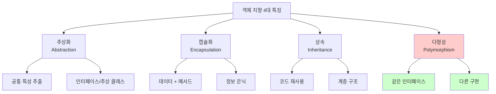
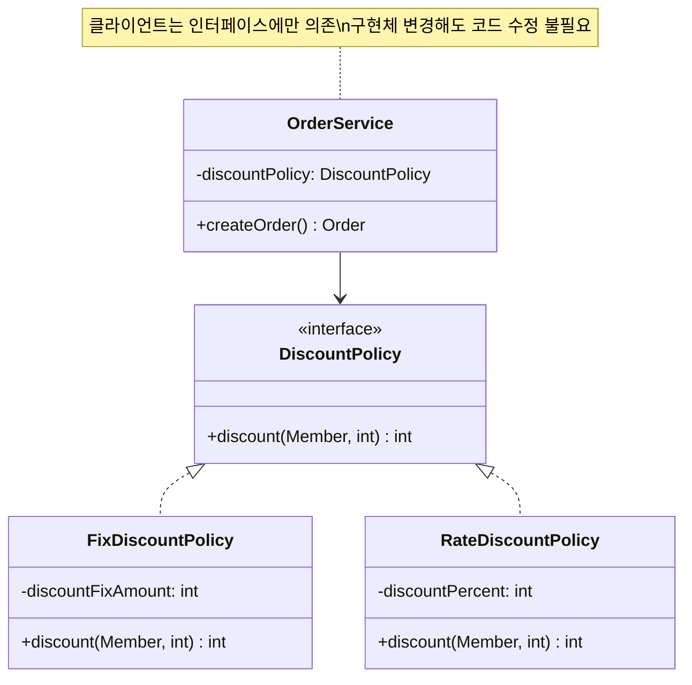
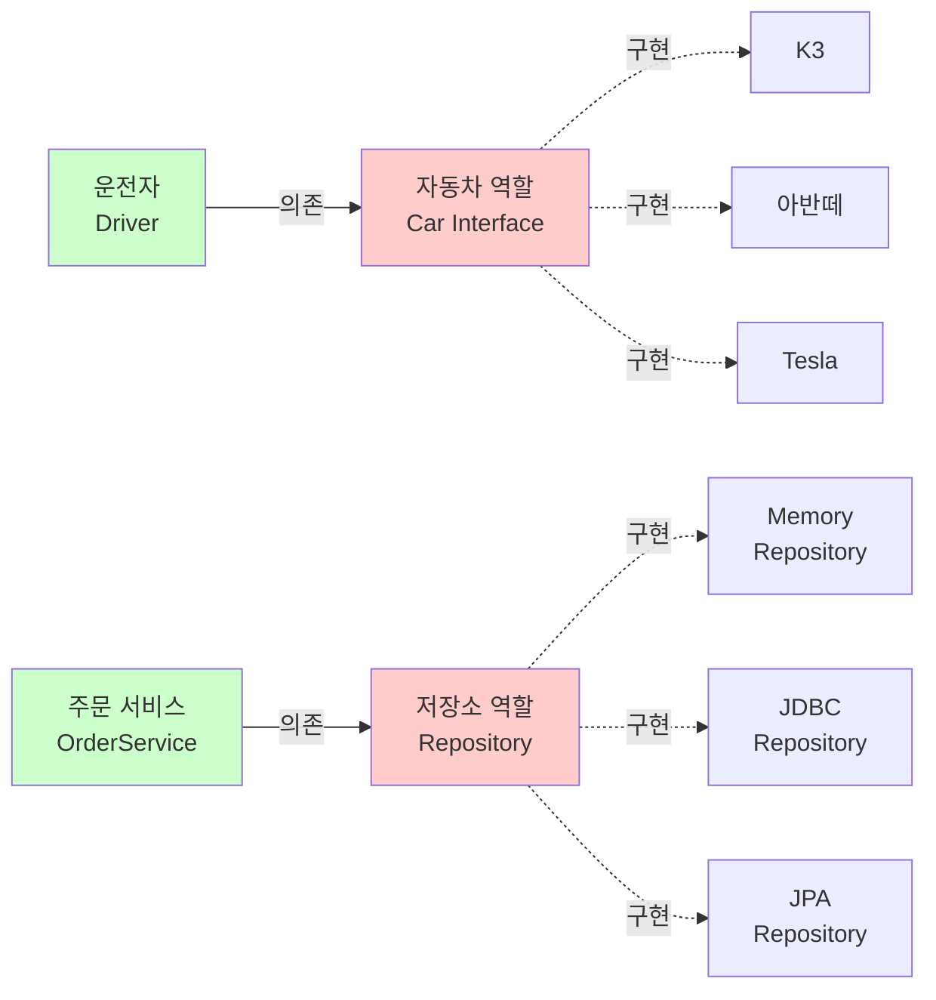
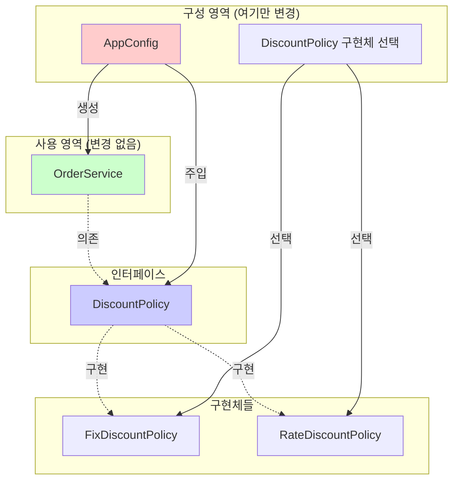

# 1-3. 좋은 객체 지향 프로그래밍이란?

**출처**: 인프런 - 스프링 핵심 원리 기본편
**강의 시간**: 21:21
**작성일**: 2025-10-23

## 학습 목표
이 챕터를 학습한 후 다음을 할 수 있습니다:
- [ ] 객체 지향 프로그래밍의 4가지 특징을 이해하고 설명할 수 있습니다
- [ ] 다형성의 개념과 중요성을 이해할 수 있습니다
- [ ] 역할과 구현의 분리를 코드로 구현할 수 있습니다
- [ ] 왜 다형성이 객체 지향의 핵심인지 설명할 수 있습니다

## 🔗 연관 개념
- **선행 학습 권장**: 1-2. 스프링이란?
- **후속 학습**: 1-4. 좋은 객체 지향 설계의 5가지 원칙(SOLID)
- **관련 챕터**: 3. 스프링 핵심 원리 이해2 - 객체 지향 원리 적용

---

## 목차
1. [객체 지향 프로그래밍의 4가지 특징](#1-객체-지향-프로그래밍의-4가지-특징)
2. [다형성 - 객체 지향의 꽃](#2-다형성---객체-지향의-꽃)
3. [역할과 구현의 분리](#3-역할과-구현의-분리)
4. [다형성의 본질과 한계](#4-다형성의-본질과-한계)

---

## 1. 객체 지향 프로그래밍의 4가지 특징

> 📌 **TL;DR (Too Long; Didn't Read)**
> - 추상화: 공통 특성 추출, 복잡성 감소
> - 캡슐화: 데이터와 메서드 묶기, 정보 은닉
> - 상속: 코드 재사용, IS-A 관계
> - 다형성: 같은 인터페이스, 다른 구현 (가장 중요!)

### 핵심 개념
- **추상화 (Abstraction)**: 공통 특성을 추출하여 인터페이스나 추상 클래스로 정의
- **캡슐화 (Encapsulation)**: 데이터와 메서드를 하나로 묶고 외부 접근 제한
- **상속 (Inheritance)**: 부모 클래스의 특성을 자식 클래스가 물려받음
- **다형성 (Polymorphism)**: 같은 인터페이스로 다양한 구현체를 사용

### 상세 설명

#### 1) 추상화 (Abstraction)

**추상화란?**
복잡한 현실 세계를 단순화하여 표현하는 것입니다. 공통된 특성을 뽑아내어 인터페이스나 추상 클래스로 만듭니다.

**예시:**
```java
// 다양한 동물들의 공통 특성을 추상화
public interface Animal {
    void eat();      // 모든 동물은 먹는다
    void sleep();    // 모든 동물은 잔다
    void makeSound(); // 모든 동물은 소리를 낸다
}

// 구체적인 동물들
public class Dog implements Animal {
    @Override
    public void eat() {
        System.out.println("개가 사료를 먹습니다");
    }

    @Override
    public void sleep() {
        System.out.println("개가 잠을 잡니다");
    }

    @Override
    public void makeSound() {
        System.out.println("멍멍!");
    }
}

public class Cat implements Animal {
    @Override
    public void eat() {
        System.out.println("고양이가 생선을 먹습니다");
    }

    @Override
    public void sleep() {
        System.out.println("고양이가 잠을 잡니다");
    }

    @Override
    public void makeSound() {
        System.out.println("야옹!");
    }
}
```

**장점:**
- 복잡성 감소
- 코드 재사용성 증가
- 변경에 유연함

#### 2) 캡슐화 (Encapsulation)

**캡슐화란?**
데이터(필드)와 해당 데이터를 처리하는 메서드를 하나로 묶고, 외부에는 필요한 것만 공개하는 것입니다.

**예시:**
```java
public class BankAccount {
    // private: 외부에서 직접 접근 불가
    private String accountNumber;
    private long balance;

    public BankAccount(String accountNumber) {
        this.accountNumber = accountNumber;
        this.balance = 0;
    }

    // public: 외부에 공개
    public void deposit(long amount) {
        if (amount > 0) {
            balance += amount;
        }
    }

    public void withdraw(long amount) {
        if (amount > 0 && balance >= amount) {
            balance -= amount;
        } else {
            throw new IllegalArgumentException("잔액이 부족합니다");
        }
    }

    public long getBalance() {
        return balance;
    }

    // accountNumber는 외부에 공개하지 않음
    // balance는 getter만 제공, setter 없음 (직접 수정 불가)
}

// 사용
BankAccount account = new BankAccount("123-456");
account.deposit(10000);
account.withdraw(5000);
// account.balance = 1000000;  // 컴파일 에러! 직접 접근 불가
```

**장점:**
- 데이터 보호
- 내부 구현 변경이 외부에 영향 없음
- 유지보수 용이

#### 3) 상속 (Inheritance)

**상속이란?**
부모 클래스의 특성(필드, 메서드)을 자식 클래스가 물려받는 것입니다.

**예시:**
```java
// 부모 클래스
public class Vehicle {
    protected String brand;
    protected int speed;

    public void start() {
        System.out.println(brand + " 시동을 겁니다");
    }

    public void stop() {
        System.out.println(brand + " 정지합니다");
    }

    public void accelerate(int increment) {
        speed += increment;
        System.out.println("현재 속도: " + speed + "km/h");
    }
}

// 자식 클래스 - 부모의 특성 상속
public class Car extends Vehicle {
    private int doors;

    public Car(String brand, int doors) {
        this.brand = brand;
        this.doors = doors;
    }

    // 추가 메서드
    public void openDoor() {
        System.out.println("문을 엽니다");
    }

    // 메서드 오버라이딩
    @Override
    public void start() {
        System.out.println(brand + " 자동차 시동을 걸었습니다");
        System.out.println("엔진 체크 완료");
    }
}

public class Motorcycle extends Vehicle {
    private boolean hasHelmet;

    public Motorcycle(String brand) {
        this.brand = brand;
    }

    public void wheelie() {
        System.out.println("앞바퀴를 들어올립니다!");
    }
}

// 사용
Car car = new Car("현대", 4);
car.start();        // 오버라이딩된 메서드 호출
car.accelerate(50); // 상속받은 메서드 호출
car.openDoor();     // Car만의 메서드
```

**장점:**
- 코드 재사용
- 계층 구조 표현

**주의사항:**
- 과도한 상속은 결합도를 높임
- 상속보다는 조합(Composition)을 우선 고려

#### 4) 다형성 (Polymorphism)

**다형성이란?**
같은 인터페이스를 통해 서로 다른 구현체를 사용할 수 있는 능력입니다.

**예시:**
```java
// 인터페이스
public interface Payment {
    void pay(int amount);
}

// 다양한 구현체
public class CreditCardPayment implements Payment {
    @Override
    public void pay(int amount) {
        System.out.println("신용카드로 " + amount + "원 결제");
    }
}

public class CashPayment implements Payment {
    @Override
    public void pay(int amount) {
        System.out.println("현금으로 " + amount + "원 결제");
    }
}

public class KakaoPayPayment implements Payment {
    @Override
    public void pay(int amount) {
        System.out.println("카카오페이로 " + amount + "원 결제");
    }
}

// 다형성 활용
public class PaymentProcessor {
    public void processPayment(Payment payment, int amount) {
        payment.pay(amount);
        // 어떤 결제 수단이든 동일한 인터페이스로 처리
    }
}

// 사용
PaymentProcessor processor = new PaymentProcessor();
processor.processPayment(new CreditCardPayment(), 10000);
processor.processPayment(new CashPayment(), 10000);
processor.processPayment(new KakaoPayPayment(), 10000);
// 새로운 결제 수단 추가 시 PaymentProcessor 수정 불필요!
```

**장점:**
- 유연한 코드
- 확장 용이
- 변경에 강함

### 다이어그램



### 주요 포인트
- **추상화**: 공통 특성을 뽑아내어 단순화
- **캡슐화**: 데이터를 보호하고 내부 구현을 감춤
- **상속**: 코드를 재사용하지만 과도한 상속은 지양
- **다형성**: 가장 중요! 유연하고 확장 가능한 설계의 핵심

### 💡 Tip
- 4가지 특징 중 **다형성**이 가장 중요합니다
- 상속보다는 **조합(Composition)**을 우선 고려하세요
- 캡슐화는 항상 지키려고 노력하세요 (private 우선)

---

## 2. 다형성 - 객체 지향의 꽃

> 📌 **TL;DR (Too Long; Didn't Read)**
> - 다형성은 객체 지향의 가장 중요한 특징입니다
> - 하나의 인터페이스로 여러 구현체를 사용할 수 있습니다
> - 클라이언트 코드의 변경 없이 구현체를 교체할 수 있습니다

### 핵심 개념
- **오버라이딩**: 부모 클래스의 메서드를 자식 클래스에서 재정의
- **오버로딩**: 같은 이름의 메서드를 매개변수만 다르게 정의
- **동적 바인딩**: 런타임에 실제 구현체의 메서드가 호출됨
- **업캐스팅/다운캐스팅**: 부모-자식 타입 간의 형변환

### 상세 설명

#### 다형성이란?

다형성(Polymorphism)은 "여러 가지 형태"를 의미합니다. 객체 지향에서는:
- 하나의 타입(인터페이스)으로
- 여러 구현체를 참조할 수 있는 능력

**왜 다형성이 중요한가?**
- 클라이언트 코드를 변경하지 않고 기능을 확장할 수 있습니다
- 유연하고 변경에 강한 설계가 가능합니다

#### 다형성의 기술적 구현 - 오버라이딩

자바에서 다형성은 **오버라이딩(Overriding)**을 통해 구현됩니다.

```java
// 부모 클래스
public class Animal {
    public void makeSound() {
        System.out.println("동물이 소리를 냅니다");
    }
}

// 자식 클래스들 - 메서드 오버라이딩
public class Dog extends Animal {
    @Override
    public void makeSound() {
        System.out.println("멍멍!");
    }
}

public class Cat extends Animal {
    @Override
    public void makeSound() {
        System.out.println("야옹!");
    }
}

public class Cow extends Animal {
    @Override
    public void makeSound() {
        System.out.println("음메!");
    }
}

// 다형성 활용
public class AnimalSound {
    public static void main(String[] args) {
        Animal dog = new Dog();    // 업캐스팅
        Animal cat = new Cat();
        Animal cow = new Cow();

        // 모두 Animal 타입이지만, 실제 구현체의 메서드 호출
        dog.makeSound();  // 멍멍!
        cat.makeSound();  // 야옹!
        cow.makeSound();  // 음메!

        // 배열로 관리
        Animal[] animals = {dog, cat, cow};
        for (Animal animal : animals) {
            animal.makeSound();  // 각자의 소리
        }
    }
}
```

#### 동적 바인딩 (Dynamic Binding)

```java
Animal animal = new Dog();
animal.makeSound();  // "멍멍!" 출력

// 컴파일 시점: Animal의 makeSound() 호출 예정
// 런타임 시점: 실제 Dog의 makeSound() 호출 (동적 바인딩)
```

**정적 바인딩 vs 동적 바인딩:**
```java
public class Parent {
    public void instanceMethod() {
        System.out.println("Parent instance");
    }

    public static void staticMethod() {
        System.out.println("Parent static");
    }
}

public class Child extends Parent {
    @Override
    public void instanceMethod() {
        System.out.println("Child instance");
    }

    public static void staticMethod() {
        System.out.println("Child static");
    }
}

Parent parent = new Child();
parent.instanceMethod();  // "Child instance" - 동적 바인딩
parent.staticMethod();    // "Parent static" - 정적 바인딩 (오버라이딩 아님!)
```

#### 다형성의 실전 예제

**할인 정책 예제:**
```java
// 인터페이스
public interface DiscountPolicy {
    int discount(Member member, int price);
}

// 정액 할인
public class FixDiscountPolicy implements DiscountPolicy {
    private int discountFixAmount = 1000;  // 1000원 할인

    @Override
    public int discount(Member member, int price) {
        if (member.getGrade() == Grade.VIP) {
            return discountFixAmount;
        }
        return 0;
    }
}

// 정률 할인
public class RateDiscountPolicy implements DiscountPolicy {
    private int discountPercent = 10;  // 10% 할인

    @Override
    public int discount(Member member, int price) {
        if (member.getGrade() == Grade.VIP) {
            return price * discountPercent / 100;
        }
        return 0;
    }
}

// 사용하는 클라이언트 (다형성 활용)
public class OrderService {
    private final DiscountPolicy discountPolicy;

    public OrderService(DiscountPolicy discountPolicy) {
        this.discountPolicy = discountPolicy;
    }

    public Order createOrder(Long memberId, String itemName, int itemPrice) {
        Member member = memberRepository.findById(memberId);

        // 어떤 할인 정책이든 동일하게 사용
        int discountPrice = discountPolicy.discount(member, itemPrice);

        return new Order(memberId, itemName, itemPrice, discountPrice);
    }
}

// 설정 - 어떤 구현체를 사용할지 결정
@Configuration
public class AppConfig {
    @Bean
    public OrderService orderService() {
        // return new OrderService(new FixDiscountPolicy());
        return new OrderService(new RateDiscountPolicy());
        // OrderService 코드 변경 없이 할인 정책 변경!
    }
}
```

### 다이어그램



### 주요 포인트
- **다형성의 핵심**: 같은 인터페이스, 다른 구현
- **동적 바인딩**: 런타임에 실제 구현체의 메서드 호출
- **장점**: 클라이언트 코드 변경 없이 기능 확장
- **실무**: 전략 패턴의 기반

### 예제

**메시지 발송 시스템:**
```java
// 인터페이스
public interface MessageSender {
    void send(String message, String recipient);
}

// SMS 발송
public class SmsSender implements MessageSender {
    @Override
    public void send(String message, String recipient) {
        System.out.println("SMS 발송: " + recipient + " - " + message);
        // 실제로는 SMS API 호출
    }
}

// 이메일 발송
public class EmailSender implements MessageSender {
    @Override
    public void send(String message, String recipient) {
        System.out.println("Email 발송: " + recipient + " - " + message);
        // 실제로는 SMTP 프로토콜 사용
    }
}

// 카카오톡 발송
public class KakaoSender implements MessageSender {
    @Override
    public void send(String message, String recipient) {
        System.out.println("카카오톡 발송: " + recipient + " - " + message);
        // 실제로는 카카오 API 호출
    }
}

// 알림 서비스
public class NotificationService {
    private final MessageSender messageSender;

    public NotificationService(MessageSender messageSender) {
        this.messageSender = messageSender;
    }

    public void sendWelcomeMessage(String recipient) {
        messageSender.send("환영합니다!", recipient);
        // MessageSender가 SMS든, Email이든, 카카오톡이든
        // NotificationService는 신경 쓰지 않음!
    }
}

// 사용
MessageSender sender1 = new SmsSender();
NotificationService service1 = new NotificationService(sender1);
service1.sendWelcomeMessage("010-1234-5678");

MessageSender sender2 = new EmailSender();
NotificationService service2 = new NotificationService(sender2);
service2.sendWelcomeMessage("user@example.com");
```

### 💡 Tip
- 다형성을 활용하면 Strategy Pattern을 자연스럽게 구현할 수 있습니다
- 인터페이스를 먼저 설계하고, 구현체는 나중에 만드는 습관을 들이세요

### 💡 심화 내용
<details>
<summary>더 알아보기</summary>

#### 오버로딩 vs 오버라이딩

```java
// 오버로딩 (Overloading) - 컴파일 타임 다형성
public class Calculator {
    public int add(int a, int b) {
        return a + b;
    }

    public double add(double a, double b) {
        return a + b;
    }

    public int add(int a, int b, int c) {
        return a + b + c;
    }
    // 같은 이름, 다른 매개변수 - 정적 바인딩
}

// 오버라이딩 (Overriding) - 런타임 다형성
public class Parent {
    public void method() {
        System.out.println("Parent");
    }
}

public class Child extends Parent {
    @Override
    public void method() {
        System.out.println("Child");
    }
    // 같은 시그니처, 다른 구현 - 동적 바인딩
}
```

#### 업캐스팅과 다운캐스팅

```java
// 업캐스팅 (Upcasting) - 자동
Animal animal = new Dog();  // Dog -> Animal (자동)
animal.makeSound();  // Dog의 makeSound() 호출

// 다운캐스팅 (Downcasting) - 명시적
Animal animal = new Dog();
Dog dog = (Dog) animal;  // Animal -> Dog (명시적)
dog.fetch();  // Dog만의 메서드 사용 가능

// 잘못된 다운캐스팅
Animal animal = new Cat();
Dog dog = (Dog) animal;  // ClassCastException 발생!

// instanceof로 확인 후 다운캐스팅
if (animal instanceof Dog) {
    Dog dog = (Dog) animal;
    dog.fetch();
}

// Java 16+: Pattern Matching
if (animal instanceof Dog dog) {
    dog.fetch();  // 자동 캐스팅
}
```

#### 다형성과 디자인 패턴

**전략 패턴 (Strategy Pattern):**
```java
// 다형성을 활용한 전략 패턴
public interface PaymentStrategy {
    void pay(int amount);
}

public class CreditCardStrategy implements PaymentStrategy {
    public void pay(int amount) { /* ... */ }
}

public class CashStrategy implements PaymentStrategy {
    public void pay(int amount) { /* ... */ }
}

public class ShoppingCart {
    private PaymentStrategy paymentStrategy;

    public void setPaymentStrategy(PaymentStrategy strategy) {
        this.paymentStrategy = strategy;
    }

    public void checkout(int amount) {
        paymentStrategy.pay(amount);
    }
}
```

</details>

---

## 3. 역할과 구현의 분리

> 📌 **TL;DR (Too Long; Didn't Read)**
> - 역할(인터페이스)과 구현(구현체)을 분리하는 것이 다형성의 본질입니다
> - 클라이언트는 역할만 알면 되고, 구현은 몰라도 됩니다
> - 자동차 운전자와 자동차의 관계로 이해할 수 있습니다

### 핵심 개념
- **역할 (Role)**: 인터페이스, 추상 클래스
- **구현 (Implementation)**: 구현 클래스
- **클라이언트**: 역할을 사용하는 쪽
- **서버**: 역할을 구현하는 쪽

### 상세 설명

#### 역할과 구현의 분리란?

현실 세계의 비유로 이해해봅시다.

**자동차 운전자와 자동차:**
- 운전자(클라이언트)는 자동차의 **역할**(핸들, 액셀, 브레이크)만 알면 됩니다
- K3, 아반떼, 테슬라 등 어떤 자동차(**구현**)로 바꿔도 운전자는 운전할 수 있습니다
- 자동차의 내부 구조(엔진, 변속기)가 바뀌어도 운전자는 영향을 받지 않습니다

```
운전자 (클라이언트)
    ↓ 의존
자동차 역할 (인터페이스)
    ↓ 구현
K3, 아반떼, 테슬라 (구현체들)
```

**코드로 표현:**
```java
// 역할 (Role) - 인터페이스
public interface Car {
    void start();           // 시동
    void accelerate();      // 가속
    void brake();           // 브레이크
    void stop();            // 정지
}

// 구현 (Implementation) - 구현체들
public class K3 implements Car {
    @Override
    public void start() {
        System.out.println("K3 시동");
    }

    @Override
    public void accelerate() {
        System.out.println("K3 가속 - 가솔린 엔진");
    }

    @Override
    public void brake() {
        System.out.println("K3 브레이크");
    }

    @Override
    public void stop() {
        System.out.println("K3 정지");
    }
}

public class Tesla implements Car {
    @Override
    public void start() {
        System.out.println("Tesla 시동 - 조용함");
    }

    @Override
    public void accelerate() {
        System.out.println("Tesla 가속 - 전기 모터");
    }

    @Override
    public void brake() {
        System.out.println("Tesla 브레이크 - 회생 제동");
    }

    @Override
    public void stop() {
        System.out.println("Tesla 정지");
    }
}

// 클라이언트 - 역할만 의존
public class Driver {
    private Car car;

    public void setCar(Car car) {
        this.car = car;  // 어떤 자동차든 받을 수 있음
    }

    public void drive() {
        car.start();
        car.accelerate();
        car.brake();
        car.stop();
        // 구체적인 자동차가 뭔지 몰라도 운전 가능!
    }
}

// 사용
Driver driver = new Driver();

driver.setCar(new K3());
driver.drive();  // K3로 운전

driver.setCar(new Tesla());
driver.drive();  // Tesla로 운전 - Driver 코드 변경 없음!
```

#### 역할과 구현 분리의 장점

**1. 클라이언트는 대상의 역할(인터페이스)만 알면 됩니다**
```java
public class OrderService {
    private final MemberRepository memberRepository;

    // MemberRepository가 Memory 구현인지, DB 구현인지 몰라도 됨
    public OrderService(MemberRepository memberRepository) {
        this.memberRepository = memberRepository;
    }

    public Order createOrder(Long memberId) {
        Member member = memberRepository.findById(memberId);
        // 내부 구현은 몰라도 사용 가능
    }
}
```

**2. 클라이언트는 구현 대상의 내부 구조를 몰라도 됩니다**
```java
// MemoryMemberRepository의 내부가 HashMap에서 ConcurrentHashMap으로 바뀌어도
// OrderService는 영향을 받지 않음

public class MemoryMemberRepository implements MemberRepository {
    // private Map<Long, Member> store = new HashMap<>();
    private Map<Long, Member> store = new ConcurrentHashMap<>();
    // 내부 구현 변경해도 인터페이스는 동일
}
```

**3. 클라이언트는 구현 대상을 변경할 수 있습니다**
```java
@Configuration
public class AppConfig {
    @Bean
    public OrderService orderService() {
        // return new OrderService(new MemoryMemberRepository());
        return new OrderService(new JdbcMemberRepository());
        // 구현체만 변경 - OrderService는 수정 불필요
    }
}
```

**4. 유연하고 변경이 용이합니다**
```java
// 새로운 구현체 추가
public class RedisMemberRepository implements MemberRepository {
    // Redis를 사용한 새로운 구현
}

// 기존 코드 수정 없이 새 구현체 사용 가능
@Bean
public OrderService orderService() {
    return new OrderService(new RedisMemberRepository());
}
```

#### 역할과 구현 분리의 핵심

```
[클라이언트] → [역할/인터페이스] ← [구현체 1]
                    ↑
                    ├─ [구현체 2]
                    ├─ [구현체 3]
                    └─ [구현체 N]
```

**핵심 규칙:**
1. 클라이언트는 **역할(인터페이스)에만 의존**해야 합니다
2. 클라이언트는 **구현체를 몰라야** 합니다
3. 구현체는 **언제든지 교체 가능**해야 합니다

### 다이어그램



### 주요 포인트
- **역할과 구현을 분리**하면 유연한 설계가 가능합니다
- **클라이언트는 역할에만 의존**하고, 구현체는 몰라야 합니다
- **구현체는 언제든 교체** 가능해야 합니다
- 이것이 **다형성의 본질**입니다

### 예제

**공연 무대로 이해하기:**
```java
// 역할
public interface Actor {
    void act();
}

// 구현체들
public class 로미오_배우A implements Actor {
    public void act() {
        System.out.println("배우A가 로미오 역할을 연기");
    }
}

public class 로미오_배우B implements Actor {
    public void act() {
        System.out.println("배우B가 로미오 역할을 연기");
    }
}

// 클라이언트 (연출가)
public class Director {
    private Actor romeo;

    public void setRomeo(Actor romeo) {
        this.romeo = romeo;
    }

    public void startPlay() {
        romeo.act();
        // 어떤 배우든 로미오 역할만 수행하면 됨
    }
}

// 사용
Director director = new Director();

director.setRomeo(new 로미오_배우A());
director.startPlay();  // 배우A가 연기

director.setRomeo(new 로미오_배우B());
director.startPlay();  // 배우B가 연기 - Director 코드 변경 없음!
```

### 💡 Tip
- 인터페이스를 설계할 때는 "역할"을 생각하세요
- 구현체는 "역할을 수행하는 배우"라고 생각하세요
- 역할이 명확하면 구현체를 쉽게 교체할 수 있습니다

---

## 4. 다형성의 본질과 한계

> 📌 **TL;DR (Too Long; Didn't Read)**
> - 다형성만으로는 OCP와 DIP를 완벽히 지킬 수 없습니다
> - 구현체를 선택하는 코드가 클라이언트에 있으면 문제가 발생합니다
> - 이를 해결하기 위해 DI(의존관계 주입)이 필요합니다

### 핵심 개념
- **다형성의 본질**: 인터페이스를 구현한 객체를 실행 시점에 유연하게 변경
- **한계**: 구현체 선택 로직이 클라이언트에 있으면 OCP, DIP 위반
- **해결책**: DI 컨테이너 (스프링)

### 상세 설명

#### 다형성의 본질

**다형성의 본질은:**
- 인터페이스를 구현한 객체 인스턴스를 **실행 시점에 유연하게 변경**할 수 있는 것
- 클라이언트를 변경하지 않고, **서버의 구현 기능을 유연하게 변경**할 수 있는 것

**이상적인 모습:**
```java
// 클라이언트
public class OrderService {
    private final DiscountPolicy discountPolicy;

    public OrderService(DiscountPolicy discountPolicy) {
        this.discountPolicy = discountPolicy;
    }

    public Order createOrder(...) {
        int discountPrice = discountPolicy.discount(...);
        // DiscountPolicy의 구현체가 바뀌어도 이 코드는 변경 없음!
    }
}
```

#### 다형성의 한계

하지만 실제로는 문제가 있습니다:

```java
public class OrderService {
    // private DiscountPolicy discountPolicy = new FixDiscountPolicy();
    private DiscountPolicy discountPolicy = new RateDiscountPolicy();
    // 할인 정책을 변경하려면 이 코드를 직접 수정해야 함!
}
```

**문제점 분석:**

1. **DIP 위반**
```
OrderService
    ↓ 의존
DiscountPolicy (인터페이스)
    ↓ 의존  ← 여기가 문제!
RateDiscountPolicy (구현체)
```
- OrderService가 인터페이스에도 의존하고
- 구현체에도 의존함 (DIP 위반)

2. **OCP 위반**
```java
// 할인 정책을 변경하려면 OrderService 코드를 수정해야 함
// = 확장에는 열려있지만, 변경에도 열려있음 (OCP 위반)
```

#### 왜 이런 문제가 발생하는가?

**근본 원인:**
- 누군가는 구현체를 선택해야 합니다
- 그 "누군가"가 클라이언트(OrderService)이면 문제가 발생합니다

```java
public class OrderService {
    private DiscountPolicy discountPolicy;

    public OrderService() {
        // OrderService가 직접 구현체를 선택
        this.discountPolicy = new RateDiscountPolicy();
        // 이게 문제!
    }
}
```

#### 해결 방법 - DI (의존관계 주입)

**해결책: 외부에서 구현체를 주입**

```java
// 1. OrderService는 인터페이스에만 의존
public class OrderService {
    private final DiscountPolicy discountPolicy;

    // 생성자로 외부에서 주입받음
    public OrderService(DiscountPolicy discountPolicy) {
        this.discountPolicy = discountPolicy;
    }
}

// 2. 설정 클래스에서 구현체 선택 (관심사의 분리)
@Configuration
public class AppConfig {
    @Bean
    public OrderService orderService() {
        return new OrderService(discountPolicy());
    }

    @Bean
    public DiscountPolicy discountPolicy() {
        // return new FixDiscountPolicy();
        return new RateDiscountPolicy();
        // 여기만 변경하면 됨!
    }
}
```

**구조 변화:**

**Before (문제):**
```
OrderService
    ↓ 의존
DiscountPolicy (인터페이스)
    ↓ 의존 (문제!)
RateDiscountPolicy (구현체)
```

**After (해결):**
```
OrderService → DiscountPolicy (인터페이스만 의존)
                    ↑
                    ↓ 구현
            RateDiscountPolicy

AppConfig → OrderService 생성 시 주입
         → DiscountPolicy 구현체 선택
```

#### 관심사의 분리

**역할 분리:**
- **사용 영역**: OrderService - 비즈니스 로직에 집중
- **구성 영역**: AppConfig - 객체 생성 및 조립

```java
// 사용 영역 - 비즈니스 로직만
@Service
public class OrderService {
    private final MemberRepository memberRepository;
    private final DiscountPolicy discountPolicy;

    public OrderService(MemberRepository memberRepository,
                        DiscountPolicy discountPolicy) {
        this.memberRepository = memberRepository;
        this.discountPolicy = discountPolicy;
    }

    public Order createOrder(Long memberId, String itemName, int itemPrice) {
        Member member = memberRepository.findById(memberId);
        int discountPrice = discountPolicy.discount(member, itemPrice);
        return new Order(memberId, itemName, itemPrice, discountPrice);
    }
}

// 구성 영역 - 객체 생성 및 조립
@Configuration
public class AppConfig {
    @Bean
    public OrderService orderService() {
        return new OrderService(
            memberRepository(),
            discountPolicy()
        );
    }

    @Bean
    public MemberRepository memberRepository() {
        // return new MemoryMemberRepository();
        return new JdbcMemberRepository();
    }

    @Bean
    public DiscountPolicy discountPolicy() {
        // return new FixDiscountPolicy();
        return new RateDiscountPolicy();
    }
}
```

### 다이어그램



### 주요 포인트
- **다형성만으로는 OCP, DIP를 완벽히 지킬 수 없습니다**
- **구현체 선택 로직**이 클라이언트에 있으면 문제가 발생합니다
- **DI(의존관계 주입)**로 외부에서 구현체를 주입해야 합니다
- **관심사를 분리**해야 합니다: 사용 vs 구성

### 예제

**문제 상황:**
```java
public class PaymentService {
    // private PaymentGateway gateway = new TossGateway();
    private PaymentGateway gateway = new KakaoGateway();
    // 결제사를 변경하려면 이 코드를 수정해야 함!

    public void processPayment(int amount) {
        gateway.pay(amount);
    }
}
```

**해결:**
```java
// 1. PaymentService는 인터페이스에만 의존
public class PaymentService {
    private final PaymentGateway gateway;

    public PaymentService(PaymentGateway gateway) {
        this.gateway = gateway;
    }

    public void processPayment(int amount) {
        gateway.pay(amount);
    }
}

// 2. 설정에서 구현체 선택
@Configuration
public class PaymentConfig {
    @Bean
    public PaymentService paymentService() {
        return new PaymentService(paymentGateway());
    }

    @Bean
    public PaymentGateway paymentGateway() {
        // return new TossGateway();
        return new KakaoGateway();
        // 여기만 변경!
    }
}
```

### 💡 Tip
- 다형성의 한계를 이해하면 왜 스프링이 필요한지 알 수 있습니다
- 항상 "누가 구현체를 선택하는가?"를 생각하세요
- 클라이언트가 선택하면 문제, 외부가 주입하면 해결!

### 💡 심화 내용
<details>
<summary>더 알아보기</summary>

#### SOLID 원칙과의 연결

**다형성만으로는:**
- ❌ OCP 위반: 기능을 확장하려면 클라이언트 코드를 수정해야 함
- ❌ DIP 위반: 클라이언트가 구체 클래스에 의존함

**DI를 사용하면:**
- ✅ OCP 준수: 확장에 열려있고, 변경에 닫혀있음
- ✅ DIP 준수: 추상화에 의존, 구체화에 의존하지 않음

#### 스프링 없이 DI 구현하기

```java
// 순수 자바로 DI 구현
public class DIContainer {
    public OrderService orderService() {
        return new OrderService(
            memberRepository(),
            discountPolicy()
        );
    }

    public MemberRepository memberRepository() {
        return new MemoryMemberRepository();
    }

    public DiscountPolicy discountPolicy() {
        return new RateDiscountPolicy();
    }
}

// 사용
public class Main {
    public static void main(String[] args) {
        DIContainer container = new DIContainer();
        OrderService orderService = container.orderService();

        Order order = orderService.createOrder(1L, "itemA", 10000);
        System.out.println(order);
    }
}
```

스프링은 이러한 DI 컨테이너의 기능을 제공하고, 더 많은 편의 기능을 추가한 것입니다.

</details>

---

## 전체 요약
- 객체 지향의 4가지 특징은 추상화, 캡슐화, 상속, **다형성**입니다
- **다형성**이 가장 중요하며, 같은 인터페이스로 여러 구현체를 사용할 수 있습니다
- **역할과 구현의 분리**가 다형성의 본질이며, 유연한 설계의 핵심입니다
- 다형성만으로는 OCP와 DIP를 완벽히 지킬 수 없으며, **DI(의존관계 주입)**이 필요합니다
- 스프링은 DI 컨테이너를 제공하여 이 문제를 해결합니다

## 학습 체크리스트
- [ ] 객체 지향의 4가지 특징을 설명할 수 있다
- [ ] 다형성의 개념과 구현 방법을 이해한다
- [ ] 역할과 구현 분리의 중요성을 설명할 수 있다
- [ ] 다형성의 한계와 해결 방법(DI)을 이해한다
- [ ] 실제 코드로 다형성을 구현할 수 있다
- [ ] 면접 질문에 답할 수 있다

## 다음 학습
다음 챕터에서는 "좋은 객체 지향 설계의 5가지 원칙(SOLID)"을 학습합니다.

---

## 면접 질문

### 초급 개발자 (Junior)

**Q1. 객체 지향 프로그래밍의 4가지 특징을 설명해주세요.**
<details>
<summary>답안 보기</summary>

1. **추상화 (Abstraction)**
   - 복잡한 것을 단순하게 표현
   - 공통적인 특성을 뽑아내는 것
   - 예: 다양한 동물들의 공통 특성을 Animal 인터페이스로 정의

2. **캡슐화 (Encapsulation)**
   - 데이터와 메서드를 하나로 묶음
   - 외부에 필요한 것만 공개 (정보 은닉)
   - 예: private 필드, public 메서드

3. **상속 (Inheritance)**
   - 부모 클래스의 특성을 자식 클래스가 물려받음
   - 코드 재사용
   - 예: extends 키워드 사용

4. **다형성 (Polymorphism)** ⭐ 가장 중요
   - 같은 인터페이스로 다양한 구현체를 사용
   - 하나의 타입으로 여러 객체를 참조
   - 예: Animal animal = new Dog();

**가장 중요한 것은 다형성**이며, 이를 통해 유연하고 확장 가능한 코드를 작성할 수 있습니다.

</details>

**Q2. 다형성이 무엇이며 왜 중요한가요?**
<details>
<summary>답안 보기</summary>

**다형성(Polymorphism)이란:**
- 하나의 타입(인터페이스)으로 여러 구현체를 참조할 수 있는 능력입니다
- 같은 메서드 호출이지만, 실제로는 다른 동작을 수행합니다

**예시:**
```java
// 다형성 사용
Animal dog = new Dog();
Animal cat = new Cat();

dog.makeSound();  // "멍멍!"
cat.makeSound();  // "야옹!"
// 같은 makeSound() 호출이지만 다른 결과
```

**중요한 이유:**

1. **유연한 코드**
   - 구현체를 쉽게 교체할 수 있습니다

2. **확장 가능**
   - 새로운 구현체를 추가해도 기존 코드 수정이 최소화됩니다

3. **OCP 원칙**
   - 확장에는 열려있고, 변경에는 닫혀있습니다

4. **실무 적용**
   - 결제 시스템: 신용카드, 현금, 카카오페이 등을 같은 인터페이스로 처리
   - 메시지 발송: SMS, Email, Push를 같은 방식으로 호출

**결론:**
다형성은 객체 지향의 가장 중요한 특징으로, 변경에 유연한 소프트웨어를 만들 수 있게 합니다.

</details>

### 중급 개발자 (Mid-Level)

**Q3. 역할과 구현의 분리를 설명하고, 실무 예시를 들어주세요.**
<details>
<summary>답안 보기</summary>

**역할과 구현의 분리란:**
- **역할(Role)**: 인터페이스, 무엇을 할 것인가
- **구현(Implementation)**: 구현 클래스, 어떻게 할 것인가

**자동차 비유:**
```
운전자 (클라이언트)
   ↓ 알아야 할 것
핸들, 액셀, 브레이크 (역할/인터페이스)
   ↓ 구현
K3, 아반떼, Tesla (구현체)
```

운전자는 핸들, 액셀, 브레이크만 알면 되고, 자동차의 내부 구조는 몰라도 됩니다.

**코드 예시:**
```java
// 역할 정의
public interface PaymentGateway {
    PaymentResult process(PaymentRequest request);
}

// 구현체들
public class TossGateway implements PaymentGateway {
    public PaymentResult process(PaymentRequest request) {
        // 토스 API 호출
    }
}

public class KakaoGateway implements PaymentGateway {
    public PaymentResult process(PaymentRequest request) {
        // 카카오페이 API 호출
    }
}

// 클라이언트는 역할만 의존
public class PaymentService {
    private final PaymentGateway gateway;

    public PaymentService(PaymentGateway gateway) {
        this.gateway = gateway;
    }

    public void pay(PaymentRequest request) {
        gateway.process(request);
        // 어떤 결제사든 동일하게 사용
    }
}
```

**실무 예시:**

**1. 저장소 추상화**
```java
public interface OrderRepository {
    void save(Order order);
    Order findById(Long id);
}

// Memory, JDBC, JPA, MongoDB 등 다양한 구현 가능
public class JpaOrderRepository implements OrderRepository { }
public class MongoOrderRepository implements OrderRepository { }
```

**2. 메시지 발송**
```java
public interface MessageSender {
    void send(String message, String recipient);
}

// SMS, Email, Slack, Kakaotalk 등
public class SmsSender implements MessageSender { }
public class EmailSender implements MessageSender { }
```

**3. 알림 시스템**
```java
public interface NotificationService {
    void notify(User user, String message);
}

// Push, Email, SMS, In-App 등
public class PushNotificationService implements NotificationService { }
```

**장점:**
1. 클라이언트 코드 변경 없이 구현체 교체
2. 테스트 시 Mock 객체로 쉽게 대체
3. 새로운 구현체 추가가 용이
4. 비즈니스 로직과 기술 세부사항 분리

</details>

**Q4. 다형성만으로는 OCP와 DIP를 지킬 수 없는 이유와 해결 방법을 설명해주세요.**
<details>
<summary>답안 보기</summary>

**문제 상황:**

다형성을 사용해도 구현체를 직접 선택하면 OCP, DIP가 깨집니다.

```java
public class OrderService {
    // private DiscountPolicy discountPolicy = new FixDiscountPolicy();
    private DiscountPolicy discountPolicy = new RateDiscountPolicy();
    // 할인 정책 변경 시 이 코드를 직접 수정해야 함!
}
```

**문제 분석:**

**1. DIP 위반**
```
OrderService
    ↓ 의존
DiscountPolicy (인터페이스) ✅
    ↓ 의존
RateDiscountPolicy (구현체) ❌
```
- OrderService가 인터페이스에도 의존하고
- 구현체에도 의존함 (추상화와 구체화 모두 의존)

**2. OCP 위반**
- 기능을 확장(새로운 할인 정책 추가)하려면
- 클라이언트 코드(OrderService)를 수정해야 함
- 확장에는 열려있지만, 변경에도 열려있음

**근본 원인:**
```java
public class OrderService {
    public OrderService() {
        // OrderService가 직접 구현체를 선택
        this.discountPolicy = new RateDiscountPolicy();
        // 누군가는 구현체를 선택해야 하는데
        // 그게 클라이언트라서 문제!
    }
}
```

**해결 방법: DI (의존관계 주입)**

**1. 생성자 주입으로 외부에서 주입**
```java
public class OrderService {
    private final DiscountPolicy discountPolicy;

    // 외부에서 주입받음
    public OrderService(DiscountPolicy discountPolicy) {
        this.discountPolicy = discountPolicy;
    }
    // OrderService는 구현체를 모름!
}
```

**2. 설정 클래스에서 구현체 선택 (관심사의 분리)**
```java
@Configuration
public class AppConfig {
    @Bean
    public OrderService orderService() {
        return new OrderService(discountPolicy());
    }

    @Bean
    public DiscountPolicy discountPolicy() {
        // return new FixDiscountPolicy();
        return new RateDiscountPolicy();
        // 여기만 변경하면 됨!
    }
}
```

**구조 변화:**

**Before:**
```
OrderService → DiscountPolicy (인터페이스)
            → RateDiscountPolicy (구현체) ❌
```

**After:**
```
OrderService → DiscountPolicy (인터페이스만) ✅

AppConfig → OrderService 생성 및 주입
         → DiscountPolicy 구현체 선택
```

**역할 분리:**
- **사용 영역**: OrderService - 비즈니스 로직
- **구성 영역**: AppConfig - 객체 생성 및 조립

**결과:**
- ✅ DIP 준수: OrderService는 인터페이스에만 의존
- ✅ OCP 준수: 구성 영역만 변경, 사용 영역은 변경 없음
- ✅ 관심사의 분리: 사용과 구성을 분리

**스프링의 역할:**
```java
@SpringBootApplication
public class Application {
    public static void main(String[] args) {
        ApplicationContext ac = SpringApplication.run(Application.class, args);
        // 스프링이 DI 컨테이너 역할
        // AppConfig를 읽어서 객체 생성 및 주입
    }
}
```

**결론:**
다형성은 필요조건이지만 충분조건은 아닙니다. DI(의존관계 주입)와 함께 사용해야 OCP와 DIP를 완벽히 지킬 수 있습니다.

</details>

### 고급 개발자 (Senior)

**Q5. 다형성, 역할과 구현의 분리, DI의 개념을 통합하여 실제 프로덕션 시스템 설계 사례를 설명해주세요.**
<details>
<summary>답안 보기</summary>

**실제 사례: 다중 결제사 연동 시스템**

**요구사항:**
- 토스, 카카오페이, 페이팔 등 여러 결제사 지원
- 결제사는 언제든 추가/변경 가능해야 함
- A/B 테스트를 위해 런타임에 결제사 전환
- 각 결제사별 성공률, 실패율 모니터링

**1. 역할과 구현의 분리**

```java
// 역할 정의 - 도메인 계층
public interface PaymentGateway {
    /**
     * 결제 처리
     * @return 결제 결과 (항상 not null)
     */
    PaymentResult process(PaymentRequest request);

    /**
     * 결제 취소
     * @return 취소 결과 (항상 not null)
     */
    RefundResult refund(RefundRequest request);

    /**
     * 지원하는 결제사 타입
     */
    PaymentType getType();
}

// 결제 요청 VO
@Value
public class PaymentRequest {
    String orderId;
    Money amount;
    PaymentMethod method;
    Customer customer;
}

// 결제 결과 VO
@Value
public class PaymentResult {
    boolean success;
    String transactionId;
    String message;
    PaymentStatus status;
}
```

**2. 구현체들 - 인프라 계층**

```java
// 토스페이먼츠 구현
@Component
public class TossPaymentGateway implements PaymentGateway {
    private final TossApiClient tossApiClient;
    private final PaymentEventPublisher eventPublisher;

    @Override
    public PaymentResult process(PaymentRequest request) {
        try {
            TossPaymentResponse response = tossApiClient.requestPayment(
                toTossRequest(request)
            );

            eventPublisher.publish(new PaymentSuccessEvent(request, response));

            return PaymentResult.success(
                response.getTransactionId(),
                PaymentStatus.COMPLETED
            );
        } catch (TossApiException e) {
            eventPublisher.publish(new PaymentFailureEvent(request, e));
            return PaymentResult.failure(e.getMessage());
        }
    }

    @Override
    public PaymentType getType() {
        return PaymentType.TOSS;
    }
}

// 카카오페이 구현
@Component
public class KakaoPaymentGateway implements PaymentGateway {
    private final KakaoPayApiClient kakaoPayApiClient;
    private final PaymentEventPublisher eventPublisher;

    @Override
    public PaymentResult process(PaymentRequest request) {
        // 카카오페이 로직
    }

    @Override
    public PaymentType getType() {
        return PaymentType.KAKAO;
    }
}

// 페이팔 구현
@Component
public class PaypalGateway implements PaymentGateway {
    // 페이팔 로직
}
```

**3. 전략 패턴 + 팩토리 패턴으로 다형성 활용**

```java
// 결제 게이트웨이 팩토리
@Component
public class PaymentGatewayFactory {
    private final Map<PaymentType, PaymentGateway> gatewayMap;

    // 스프링이 모든 PaymentGateway 구현체를 주입
    public PaymentGatewayFactory(List<PaymentGateway> gateways) {
        this.gatewayMap = gateways.stream()
            .collect(Collectors.toMap(
                PaymentGateway::getType,
                Function.identity()
            ));
    }

    public PaymentGateway getGateway(PaymentType type) {
        PaymentGateway gateway = gatewayMap.get(type);
        if (gateway == null) {
            throw new UnsupportedPaymentTypeException(type);
        }
        return gateway;
    }

    // 모든 게이트웨이 반환 (모니터링용)
    public Collection<PaymentGateway> getAllGateways() {
        return gatewayMap.values();
    }
}
```

**4. 서비스 계층 - DI 활용**

```java
@Service
@RequiredArgsConstructor
public class PaymentService {
    private final PaymentGatewayFactory gatewayFactory;
    private final PaymentRepository paymentRepository;
    private final PaymentEventPublisher eventPublisher;

    @Transactional
    public PaymentResult processPayment(PaymentRequest request) {
        // 1. 결제사 선택 (런타임에 결정)
        PaymentGateway gateway = gatewayFactory.getGateway(
            determinePaymentType(request)
        );

        // 2. 결제 처리 - 다형성 활용
        PaymentResult result = gateway.process(request);

        // 3. 결과 저장
        Payment payment = Payment.create(request, result);
        paymentRepository.save(payment);

        // 4. 이벤트 발행
        eventPublisher.publish(new PaymentProcessedEvent(payment));

        return result;
    }

    private PaymentType determinePaymentType(PaymentRequest request) {
        // A/B 테스트, 사용자 설정, 결제 금액 등을 고려하여 결정
        return paymentTypeSelector.select(request);
    }
}
```

**5. A/B 테스트를 위한 동적 라우팅**

```java
@Component
public class PaymentTypeSelector {
    private final ABTestingService abTestingService;
    private final PaymentConfigRepository configRepository;

    public PaymentType select(PaymentRequest request) {
        // A/B 테스트 그룹 확인
        String testGroup = abTestingService.getTestGroup(request.getCustomer());

        if ("A".equals(testGroup)) {
            return PaymentType.TOSS;
        } else if ("B".equals(testGroup)) {
            return PaymentType.KAKAO;
        }

        // 기본값 또는 설정값
        return configRepository.getDefaultPaymentType();
    }
}
```

**6. 모니터링 및 메트릭**

```java
@Component
@Aspect
public class PaymentMetricsAspect {
    private final MeterRegistry meterRegistry;

    @Around("execution(* PaymentGateway.process(..))")
    public Object measurePayment(ProceedingJoinPoint joinPoint) throws Throwable {
        PaymentGateway gateway = (PaymentGateway) joinPoint.getTarget();
        String gatewayType = gateway.getType().name();

        Timer.Sample sample = Timer.start(meterRegistry);

        try {
            PaymentResult result = (PaymentResult) joinPoint.proceed();

            // 성공/실패 카운터
            meterRegistry.counter("payment.result",
                "gateway", gatewayType,
                "success", String.valueOf(result.isSuccess())
            ).increment();

            return result;
        } catch (Exception e) {
            meterRegistry.counter("payment.error",
                "gateway", gatewayType,
                "error", e.getClass().getSimpleName()
            ).increment();
            throw e;
        } finally {
            sample.stop(meterRegistry.timer("payment.duration",
                "gateway", gatewayType
            ));
        }
    }
}
```

**7. 통합 테스트**

```java
@SpringBootTest
class PaymentServiceIntegrationTest {
    @Autowired
    PaymentService paymentService;

    @MockBean
    TossApiClient tossApiClient;

    @Test
    void processPayment_withToss_success() {
        // given
        PaymentRequest request = createRequest(PaymentType.TOSS);
        when(tossApiClient.requestPayment(any()))
            .thenReturn(createSuccessResponse());

        // when
        PaymentResult result = paymentService.processPayment(request);

        // then
        assertThat(result.isSuccess()).isTrue();
        verify(tossApiClient).requestPayment(any());
    }
}
```

**설계의 장점:**

**1. OCP (개방-폐쇄 원칙)**
```java
// 새로운 결제사 추가 - 기존 코드 수정 없음
@Component
public class NaverPayGateway implements PaymentGateway {
    // 구현만 추가하면 자동으로 팩토리에 등록됨
}
```

**2. DIP (의존관계 역전 원칙)**
- PaymentService는 PaymentGateway(인터페이스)에만 의존
- 구체적인 게이트웨이는 스프링이 주입

**3. SRP (단일 책임 원칙)**
- PaymentService: 결제 흐름 관리
- PaymentGateway: 결제사 연동
- PaymentTypeSelector: 결제사 선택 로직
- PaymentMetricsAspect: 모니터링

**4. 유연성**
- 런타임에 결제사 전환 가능
- A/B 테스트 지원
- 새로운 결제사 추가 용이

**5. 테스트 용이성**
- 각 계층별 독립적인 단위 테스트
- Mock 객체로 쉽게 대체

**프로덕션 경험:**
- 토스 API 장애 시 자동으로 카카오페이로 폴백
- 신규 결제사 추가 시 기존 코드 변경 없이 배포
- A/B 테스트로 결제 성공률 5% 향상
- 결제사별 성능 모니터링으로 최적화

</details>

---

## 📚 참고자료

- [Polymorphism - Wikipedia](https://en.wikipedia.org/wiki/Polymorphism_(computer_science))
- [SOLID Principles - Wikipedia](https://en.wikipedia.org/wiki/SOLID)
- [Design Patterns - Gang of Four](https://www.amazon.com/Design-Patterns-Elements-Reusable-Object-Oriented/dp/0201633612)
- 객체지향의 사실과 오해 - 조영호 저
- 토비의 스프링 3.1 - 이일민 저

---

## 네비게이션
- [⬅️ 이전: 1-2. 스프링이란?](./1-2-스프링이란.md)
- [➡️ 다음: 1-4. 좋은 객체 지향 설계의 5가지 원칙(SOLID)](./1-4-좋은객체지향설계의5가지원칙SOLID.md)
- [🏠 홈으로: 1. 객체 지향 설계와 스프링 목차](../README.md)
