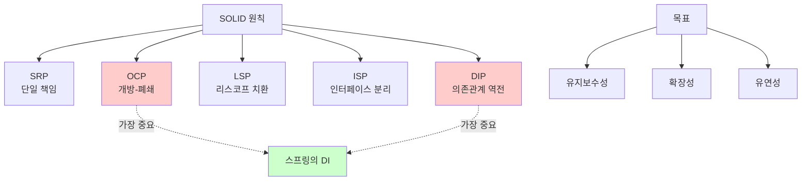
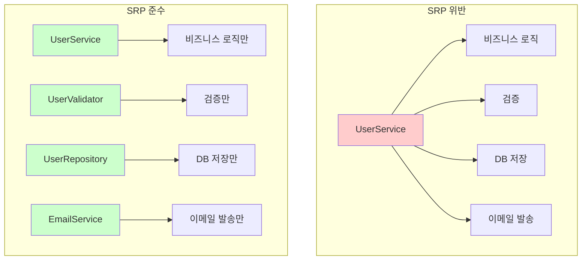
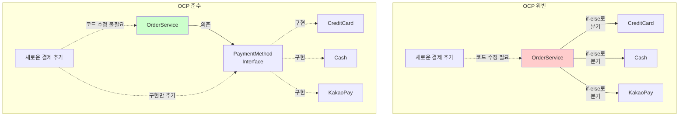
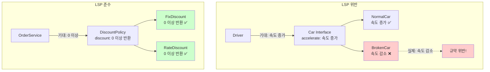
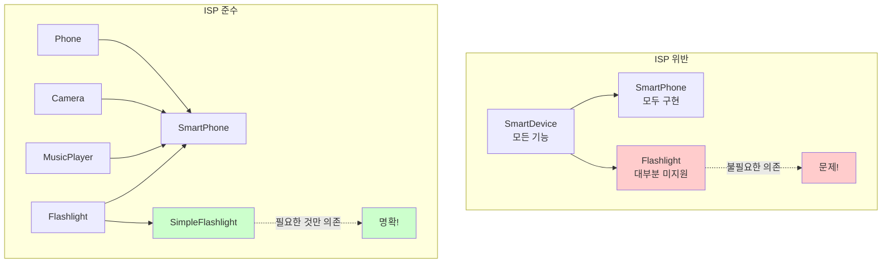

# 1-4. 좋은 객체 지향 설계의 5가지 원칙(SOLID)

**출처**: 인프런 - 스프링 핵심 원리 기본편
**강의 시간**: 18:14
**작성일**: 2025-10-23

## 학습 목표
이 챕터를 학습한 후 다음을 할 수 있습니다:
- [ ] SOLID 5가지 원칙을 각각 이해하고 설명할 수 있습니다
- [ ] 각 원칙을 실제 코드에 적용할 수 있습니다
- [ ] OCP와 DIP가 왜 중요한지 이해할 수 있습니다
- [ ] SOLID 원칙과 스프링의 관계를 설명할 수 있습니다

## 🔗 연관 개념
- **선행 학습 권장**: 1-3. 좋은 객체 지향 프로그래밍이란?
- **후속 학습**: 1-5. 객체 지향 설계와 스프링
- **관련 챕터**: 3. 스프링 핵심 원리 이해2 - 객체 지향 원리 적용

---

## 목차
1. [SOLID 원칙 소개](#1-solid-원칙-소개)
2. [SRP - 단일 책임 원칙](#2-srp---단일-책임-원칙)
3. [OCP - 개방-폐쇄 원칙](#3-ocp---개방-폐쇄-원칙)
4. [LSP - 리스코프 치환 원칙](#4-lsp---리스코프-치환-원칙)
5. [ISP - 인터페이스 분리 원칙](#5-isp---인터페이스-분리-원칙)
6. [DIP - 의존관계 역전 원칙](#6-dip---의존관계-역전-원칙)

---

## 1. SOLID 원칙 소개

> 📌 **TL;DR (Too Long; Didn't Read)**
> - SOLID는 로버트 마틴이 정리한 객체 지향 설계의 5가지 원칙입니다
> - 유지보수가 쉽고 확장 가능한 소프트웨어를 만들기 위한 가이드입니다
> - 특히 OCP와 DIP가 가장 중요합니다

### 핵심 개념
- **SOLID**: 5가지 객체 지향 설계 원칙의 약자
- **로버트 마틴 (Robert C. Martin)**: SOLID 원칙을 정리한 소프트웨어 엔지니어
- **Uncle Bob**: 로버트 마틴의 별명
- **Clean Code**: 로버트 마틴의 유명한 저서

### 상세 설명

#### SOLID란?

SOLID는 다음 5가지 원칙의 앞글자를 딴 약어입니다:

- **S**RP: Single Responsibility Principle (단일 책임 원칙)
- **O**CP: Open/Closed Principle (개방-폐쇄 원칙)
- **L**SP: Liskov Substitution Principle (리스코프 치환 원칙)
- **I**SP: Interface Segregation Principle (인터페이스 분리 원칙)
- **D**IP: Dependency Inversion Principle (의존관계 역전 원칙)

#### SOLID의 목표

**1. 유지보수성**
- 코드를 쉽게 이해하고 수정할 수 있습니다

**2. 확장성**
- 새로운 기능을 쉽게 추가할 수 있습니다

**3. 유연성**
- 변경에 강한 소프트웨어를 만들 수 있습니다

**4. 재사용성**
- 코드를 다른 곳에서도 사용할 수 있습니다

#### SOLID의 역사

**2000년대 초반**
- 로버트 마틴이 기존의 객체 지향 원칙들을 체계화
- SOLID라는 약어로 정리

**주요 저서:**
- "Agile Software Development: Principles, Patterns, and Practices" (2002)
- "Clean Code" (2008)
- "Clean Architecture" (2017)

### 다이어그램



### 주요 포인트
- SOLID는 5가지 객체 지향 설계 원칙의 모음입니다
- 로버트 마틴이 체계화한 원칙들입니다
- **OCP와 DIP가 가장 중요**하며, 스프링의 핵심과 연결됩니다
- 완벽히 지키기는 어렵지만, 방향성을 제시합니다

### 💡 Tip
- 모든 원칙을 완벽히 지키려 하지 마세요
- 실용적으로 적용하는 것이 중요합니다
- OCP와 DIP를 우선적으로 고려하세요

---

## 2. SRP - 단일 책임 원칙

> 📌 **TL;DR (Too Long; Didn't Read)**
> - 한 클래스는 하나의 책임만 가져야 합니다
> - 책임의 기준은 "변경"입니다
> - 변경이 있을 때 파급 효과가 적으면 SRP를 잘 따른 것입니다

### 핵심 개념
- **SRP (Single Responsibility Principle)**: 단일 책임 원칙
- **책임 (Responsibility)**: 변경의 이유
- **단일**: 하나의 변경 이유
- **응집도**: 관련된 것들이 모여있는 정도

### 상세 설명

#### SRP란?

**정의:**
> "A class should have only one reason to change"
> (클래스는 단 하나의 변경 이유만 가져야 한다)

**핵심:**
- "책임"이란 **변경의 이유**입니다
- 하나의 클래스는 하나의 책임(변경 이유)만 가져야 합니다

#### 나쁜 예 - SRP 위반

```java
public class UserService {
    // 1. 사용자 비즈니스 로직
    public void registerUser(User user) {
        validateUser(user);
        saveUser(user);
        sendEmail(user);
    }

    // 2. 검증 로직
    private void validateUser(User user) {
        if (user.getName() == null || user.getName().isEmpty()) {
            throw new IllegalArgumentException("이름은 필수입니다");
        }
        if (user.getEmail() == null || !user.getEmail().contains("@")) {
            throw new IllegalArgumentException("올바른 이메일이 아닙니다");
        }
    }

    // 3. 데이터 저장 로직
    private void saveUser(User user) {
        String sql = "INSERT INTO users (name, email) VALUES (?, ?)";
        // JDBC 코드...
    }

    // 4. 이메일 발송 로직
    private void sendEmail(User user) {
        // SMTP 설정
        // 이메일 발송...
    }
}
```

**문제점:**
- UserService가 4가지 책임을 가짐:
  1. 사용자 비즈니스 로직
  2. 검증 로직
  3. 데이터 저장
  4. 이메일 발송
- 검증 규칙이 바뀌면 UserService 수정
- DB 접근 방식이 바뀌면 UserService 수정
- 이메일 발송 방식이 바뀌면 UserService 수정
- 변경의 이유가 너무 많음!

#### 좋은 예 - SRP 준수

```java
// 1. 사용자 검증만 담당
public class UserValidator {
    public void validate(User user) {
        validateName(user.getName());
        validateEmail(user.getEmail());
    }

    private void validateName(String name) {
        if (name == null || name.isEmpty()) {
            throw new IllegalArgumentException("이름은 필수입니다");
        }
    }

    private void validateEmail(String email) {
        if (email == null || !email.contains("@")) {
            throw new IllegalArgumentException("올바른 이메일이 아닙니다");
        }
    }
}

// 2. 데이터 저장만 담당
public class UserRepository {
    public void save(User user) {
        String sql = "INSERT INTO users (name, email) VALUES (?, ?)";
        // JDBC 코드...
    }

    public User findById(Long id) {
        // 조회 로직...
    }
}

// 3. 이메일 발송만 담당
public class EmailService {
    public void sendWelcomeEmail(User user) {
        // SMTP 설정
        // 이메일 발송...
    }
}

// 4. 비즈니스 로직만 담당 (조합)
public class UserService {
    private final UserValidator userValidator;
    private final UserRepository userRepository;
    private final EmailService emailService;

    public UserService(UserValidator userValidator,
                      UserRepository userRepository,
                      EmailService emailService) {
        this.userValidator = userValidator;
        this.userRepository = userRepository;
        this.emailService = emailService;
    }

    public void registerUser(User user) {
        userValidator.validate(user);
        userRepository.save(user);
        emailService.sendWelcomeEmail(user);
    }
}
```

**장점:**
- 각 클래스가 하나의 책임만 가짐
- UserValidator: 검증 규칙 변경 시에만 수정
- UserRepository: DB 접근 방식 변경 시에만 수정
- EmailService: 이메일 발송 방식 변경 시에만 수정
- UserService: 비즈니스 흐름 변경 시에만 수정

#### 책임의 기준

**핵심 질문:**
"이 클래스가 변경되는 이유는 무엇인가?"

```java
// 나쁜 예 - 여러 변경 이유
public class OrderService {
    // 주문 생성 - 비즈니스 규칙 변경
    public Order createOrder() { }

    // 주문 조회 - DB 스키마 변경
    public Order findOrder() { }

    // 주문서 출력 - 출력 포맷 변경
    public void printOrder() { }

    // 이메일 발송 - 이메일 템플릿 변경
    public void sendOrderEmail() { }
}

// 좋은 예 - 하나의 변경 이유
public class OrderService {
    // 주문 비즈니스 로직만
    public Order createOrder() { }
}

public class OrderRepository {
    // DB 접근만
    public Order findById() { }
}

public class OrderPrinter {
    // 출력만
    public void print(Order order) { }
}

public class OrderEmailService {
    // 이메일 발송만
    public void sendEmail(Order order) { }
}
```

### 다이어그램



### 주요 포인트
- **한 클래스는 하나의 책임**만 가져야 합니다
- 책임의 기준은 **변경의 이유**입니다
- 변경이 있을 때 **파급 효과가 적으면** SRP를 잘 따른 것입니다
- 하지만 너무 과하게 쪼개면 복잡도가 증가할 수 있습니다

### 예제

**주문 처리 시스템:**

```java
// SRP 위반
public class OrderProcessor {
    public void processOrder(Order order) {
        // 1. 재고 확인
        if (inventory.check(order.getItem()) < order.getQuantity()) {
            throw new OutOfStockException();
        }

        // 2. 결제 처리
        CreditCard card = order.getPayment();
        PaymentGateway gateway = new PaymentGateway();
        gateway.charge(card, order.getAmount());

        // 3. 재고 감소
        inventory.decrease(order.getItem(), order.getQuantity());

        // 4. 배송 정보 생성
        ShippingInfo shipping = new ShippingInfo();
        shipping.setAddress(order.getAddress());
        shipping.setItem(order.getItem());

        // 5. 이메일 발송
        EmailSender sender = new EmailSender();
        sender.send(order.getCustomer().getEmail(), "주문 완료");
    }
}

// SRP 준수
public class OrderProcessor {
    private final InventoryService inventoryService;
    private final PaymentService paymentService;
    private final ShippingService shippingService;
    private final NotificationService notificationService;

    public void processOrder(Order order) {
        inventoryService.checkAndDecrease(order);
        paymentService.charge(order);
        shippingService.createShipping(order);
        notificationService.sendOrderConfirmation(order);
    }
}

// 각 서비스는 자신의 책임만
public class InventoryService {
    public void checkAndDecrease(Order order) {
        check(order);
        decrease(order);
    }
}

public class PaymentService {
    public void charge(Order order) {
        // 결제 처리만
    }
}

public class ShippingService {
    public void createShipping(Order order) {
        // 배송 정보 생성만
    }
}

public class NotificationService {
    public void sendOrderConfirmation(Order order) {
        // 알림 발송만
    }
}
```

### 💡 Tip
- "이 클래스가 변경되는 이유는 몇 가지인가?"를 항상 생각하세요
- 변경 이유가 2개 이상이면 분리를 고려하세요
- 하지만 과도한 분리는 오히려 복잡도를 높입니다

### ⚠️ 주의사항
- 모든 클래스를 극도로 작게 만들 필요는 없습니다
- **응집도**를 고려하여 적절한 수준으로 분리하세요
- 관련된 것들은 함께 있는 것이 좋습니다

---

## 3. OCP - 개방-폐쇄 원칙

> 📌 **TL;DR (Too Long; Didn't Read)**
> - 소프트웨어는 확장에는 열려있고, 변경에는 닫혀있어야 합니다
> - 다형성을 활용하여 구현합니다
> - 하지만 다형성만으로는 부족하고, DI가 필요합니다

### 핵심 개념
- **OCP (Open/Closed Principle)**: 개방-폐쇄 원칙
- **개방 (Open)**: 확장에 열려있음 - 새로운 기능 추가 가능
- **폐쇄 (Closed)**: 변경에 닫혀있음 - 기존 코드 수정 불필요
- **확장**: 새로운 타입/기능 추가

### 상세 설명

#### OCP란?

**정의:**
> "Software entities should be open for extension, but closed for modification"
> (소프트웨어 요소는 확장에는 열려있으나, 변경에는 닫혀있어야 한다)

**의미:**
- **확장에 열려있다**: 새로운 기능을 쉽게 추가할 수 있다
- **변경에 닫혀있다**: 기존 코드를 수정하지 않는다

#### 나쁜 예 - OCP 위반

```java
public class OrderService {
    public void processPayment(Order order, String paymentType) {
        if (paymentType.equals("CREDIT_CARD")) {
            // 신용카드 결제
            System.out.println("신용카드 결제 처리");
        } else if (paymentType.equals("CASH")) {
            // 현금 결제
            System.out.println("현금 결제 처리");
        } else if (paymentType.equals("KAKAO_PAY")) {
            // 카카오페이 결제 (새로 추가)
            System.out.println("카카오페이 결제 처리");
        }
        // 새로운 결제 수단 추가 시 이 코드를 수정해야 함!
    }
}
```

**문제점:**
- 새로운 결제 수단(토스페이, 네이버페이 등)을 추가할 때마다
- OrderService의 processPayment 메서드를 수정해야 함
- **확장에는 열려있지만, 변경에도 열려있음** (OCP 위반)

#### 좋은 예 - OCP 준수 (다형성 활용)

```java
// 인터페이스 정의
public interface PaymentMethod {
    void pay(int amount);
}

// 구현체들
public class CreditCardPayment implements PaymentMethod {
    @Override
    public void pay(int amount) {
        System.out.println("신용카드로 " + amount + "원 결제");
    }
}

public class CashPayment implements PaymentMethod {
    @Override
    public void pay(int amount) {
        System.out.println("현금으로 " + amount + "원 결제");
    }
}

public class KakaoPayPayment implements PaymentMethod {
    @Override
    public void pay(int amount) {
        System.out.println("카카오페이로 " + amount + "원 결제");
    }
}

// OrderService는 변경 없음!
public class OrderService {
    public void processPayment(Order order, PaymentMethod paymentMethod) {
        paymentMethod.pay(order.getAmount());
        // 새로운 결제 수단이 추가되어도 이 코드는 변경 불필요!
    }
}

// 사용
OrderService service = new OrderService();
service.processPayment(order, new CreditCardPayment());
service.processPayment(order, new KakaoPayPayment());

// 새로운 결제 수단 추가 - 기존 코드 수정 없음!
public class TossPayPayment implements PaymentMethod {
    @Override
    public void pay(int amount) {
        System.out.println("토스페이로 " + amount + "원 결제");
    }
}
```

#### OCP의 한계와 해결

**문제 상황:**
다형성을 사용해도 구현체를 선택하는 코드가 있으면 OCP가 깨집니다.

```java
public class OrderService {
    // private PaymentMethod payment = new CreditCardPayment();
    private PaymentMethod payment = new KakaoPayPayment();
    // 결제 수단을 변경하려면 이 코드를 수정해야 함!

    public void processPayment(Order order) {
        payment.pay(order.getAmount());
    }
}
```

**해결: DI (의존관계 주입)**

```java
// 1. OrderService는 변경 없음
public class OrderService {
    private final PaymentMethod paymentMethod;

    // 생성자로 주입받음
    public OrderService(PaymentMethod paymentMethod) {
        this.paymentMethod = paymentMethod;
    }

    public void processPayment(Order order) {
        paymentMethod.pay(order.getAmount());
    }
}

// 2. 설정에서 구현체 선택
@Configuration
public class AppConfig {
    @Bean
    public OrderService orderService() {
        // return new OrderService(new CreditCardPayment());
        return new OrderService(new KakaoPayPayment());
        // 여기만 변경 - OrderService는 수정 불필요!
    }
}
```

### 다이어그램



### 주요 포인트
- **확장에는 열려있고, 변경에는 닫혀있어야** 합니다
- **다형성**을 활용하여 구현합니다
- 하지만 **다형성만으로는 부족**하고, **DI**가 필요합니다
- **가장 중요한 원칙** 중 하나입니다

### 예제

**할인 정책 예제:**

```java
// OCP 위반
public class OrderService {
    private int discountAmount = 1000;

    public int calculateDiscount(Member member) {
        if (member.getGrade() == Grade.VIP) {
            // return discountAmount;  // 정액 할인
            return member.getTotalPrice() * 10 / 100;  // 정률 할인으로 변경
            // 할인 정책 변경 시 이 코드를 수정해야 함!
        }
        return 0;
    }
}

// OCP 준수
public interface DiscountPolicy {
    int discount(Member member, int price);
}

public class FixDiscountPolicy implements DiscountPolicy {
    private int discountFixAmount = 1000;

    @Override
    public int discount(Member member, int price) {
        if (member.getGrade() == Grade.VIP) {
            return discountFixAmount;
        }
        return 0;
    }
}

public class RateDiscountPolicy implements DiscountPolicy {
    private int discountPercent = 10;

    @Override
    public int discount(Member member, int price) {
        if (member.getGrade() == Grade.VIP) {
            return price * discountPercent / 100;
        }
        return 0;
    }
}

public class OrderService {
    private final DiscountPolicy discountPolicy;

    public OrderService(DiscountPolicy discountPolicy) {
        this.discountPolicy = discountPolicy;
    }

    public Order createOrder(Member member, int price) {
        int discountPrice = discountPolicy.discount(member, price);
        return new Order(member, price, discountPrice);
    }
}

// 설정
@Configuration
public class AppConfig {
    @Bean
    public OrderService orderService() {
        // return new OrderService(new FixDiscountPolicy());
        return new OrderService(new RateDiscountPolicy());
        // 여기만 변경 - OrderService는 수정 불필요!
    }
}
```

### 💡 Tip
- 변경 가능성이 있는 부분을 인터페이스로 추상화하세요
- 새로운 기능 추가 시 기존 코드를 수정하는지 항상 체크하세요
- DI 컨테이너(스프링)를 사용하면 OCP를 쉽게 지킬 수 있습니다

### 💡 심화 내용
<details>
<summary>더 알아보기</summary>

#### OCP와 디자인 패턴

**전략 패턴 (Strategy Pattern)**
```java
// OCP를 구현하는 대표적인 패턴
public class Context {
    private Strategy strategy;

    public void setStrategy(Strategy strategy) {
        this.strategy = strategy;
    }

    public void execute() {
        strategy.execute();
    }
}
```

**템플릿 메서드 패턴 (Template Method Pattern)**
```java
public abstract class AbstractTemplate {
    // 변하지 않는 부분 (closed)
    public final void templateMethod() {
        step1();
        step2();  // 확장 포인트
        step3();
    }

    protected abstract void step2();  // 확장 가능 (open)

    private void step1() { /* ... */ }
    private void step3() { /* ... */ }
}
```

#### OCP와 실무

실무에서는 **변경 가능성이 높은 부분만** OCP를 적용합니다.

```java
// 변경 가능성이 높음 → OCP 적용
public interface PaymentGateway {
    PaymentResult process(PaymentRequest request);
}

// 변경 가능성이 낮음 → 직접 구현
public class OrderIdGenerator {
    public String generate() {
        return UUID.randomUUID().toString();
    }
}
```

</details>

---

## 4. LSP - 리스코프 치환 원칙

> 📌 **TL;DR (Too Long; Didn't Read)**
> - 프로그램의 객체는 정확성을 깨뜨리지 않으면서 하위 타입으로 바꿀 수 있어야 합니다
> - 인터페이스의 규약을 구현체가 반드시 지켜야 합니다
> - 단순히 컴파일 성공이 아니라, 기능적으로도 보장해야 합니다

### 핵심 개념
- **LSP (Liskov Substitution Principle)**: 리스코프 치환 원칙
- **치환**: 부모 타입을 자식 타입으로 교체
- **정확성**: 프로그램의 올바른 동작
- **규약 (Contract)**: 인터페이스가 약속한 동작

### 상세 설명

#### LSP란?

**정의:**
> "Objects should be replaceable with instances of their subtypes without altering the correctness of the program"
> (프로그램의 정확성을 깨뜨리지 않으면서 하위 타입의 인스턴스로 바꿀 수 있어야 한다)

**핵심:**
- 인터페이스의 **규약**을 구현체가 지켜야 합니다
- 단순히 컴파일 성공이 아니라, **기능적으로도 올바르게** 동작해야 합니다

#### 나쁜 예 - LSP 위반

```java
public interface Car {
    /**
     * 자동차를 가속합니다.
     * 속도가 증가해야 합니다.
     */
    void accelerate();
}

public class NormalCar implements Car {
    private int speed = 0;

    @Override
    public void accelerate() {
        speed += 10;  // 속도 증가 - 올바름
        System.out.println("속도: " + speed);
    }
}

public class BrokenCar implements Car {
    private int speed = 100;

    @Override
    public void accelerate() {
        speed -= 10;  // 속도 감소 - 규약 위반!
        System.out.println("속도: " + speed);
    }
}

// 사용
public class Driver {
    public void drive(Car car) {
        car.accelerate();  // 속도가 증가할 것으로 기대
        // BrokenCar를 넣으면 속도가 감소함!
    }
}
```

**문제점:**
- accelerate()는 "가속한다"는 의미이므로 속도가 증가해야 함
- BrokenCar는 속도를 감소시킴 → **규약 위반**
- 문법적으로는 문제 없지만, **기능적으로 잘못됨**

#### 좋은 예 - LSP 준수

```java
public interface DiscountPolicy {
    /**
     * 할인 금액을 계산합니다.
     * @return 할인 금액 (항상 0 이상이어야 함)
     */
    int discount(Member member, int price);
}

public class FixDiscountPolicy implements DiscountPolicy {
    private int discountFixAmount = 1000;

    @Override
    public int discount(Member member, int price) {
        if (member.getGrade() == Grade.VIP) {
            return discountFixAmount;  // 양수 반환 - 올바름
        }
        return 0;  // 최소 0 반환
    }
}

public class RateDiscountPolicy implements DiscountPolicy {
    private int discountPercent = 10;

    @Override
    public int discount(Member member, int price) {
        if (member.getGrade() == Grade.VIP) {
            return price * discountPercent / 100;  // 양수 반환 - 올바름
        }
        return 0;  // 최소 0 반환
        // 절대 음수를 반환하지 않음 - 규약 준수
    }
}
```

#### LSP와 계약에 의한 설계

**선행 조건 (Precondition)**
- 하위 타입은 상위 타입의 선행 조건을 **강화할 수 없습니다**

```java
// 상위 타입
public class Calculator {
    /**
     * 나눗셈
     * @param divisor 0이 아닌 수
     */
    public int divide(int dividend, int divisor) {
        return dividend / divisor;
    }
}

// LSP 위반 - 선행 조건 강화
public class StrictCalculator extends Calculator {
    @Override
    public int divide(int dividend, int divisor) {
        if (divisor == 0 || divisor == 1) {  // 조건을 더 엄격하게!
            throw new IllegalArgumentException();
        }
        return dividend / divisor;
    }
    // divisor가 1일 때도 예외 발생 - 규약 위반!
}
```

**후행 조건 (Postcondition)**
- 하위 타입은 상위 타입의 후행 조건을 **약화할 수 없습니다**

```java
public interface UserRepository {
    /**
     * 사용자 저장
     * @return 저장된 사용자 (항상 not null)
     */
    User save(User user);
}

// LSP 위반 - 후행 조건 약화
public class BrokenUserRepository implements UserRepository {
    @Override
    public User save(User user) {
        // ...
        return null;  // null 반환 - 규약 위반!
    }
}
```

### 다이어그램



### 주요 포인트
- 인터페이스의 **규약을 구현체가 반드시 지켜야** 합니다
- 단순히 컴파일 성공이 아니라, **기능적으로도 올바르게** 동작해야 합니다
- 선행 조건을 강화하거나, 후행 조건을 약화하면 안 됩니다
- 다형성을 올바르게 지원하기 위한 원칙입니다

### 예제

**직사각형과 정사각형 문제 (유명한 LSP 위반 사례):**

```java
// LSP 위반 사례
public class Rectangle {
    protected int width;
    protected int height;

    public void setWidth(int width) {
        this.width = width;
    }

    public void setHeight(int height) {
        this.height = height;
    }

    public int getArea() {
        return width * height;
    }
}

public class Square extends Rectangle {
    @Override
    public void setWidth(int width) {
        this.width = width;
        this.height = width;  // 정사각형이므로 높이도 같이 설정
    }

    @Override
    public void setHeight(int height) {
        this.width = height;
        this.height = height;  // 정사각형이므로 너비도 같이 설정
    }
}

// 문제 발생
public void test(Rectangle rectangle) {
    rectangle.setWidth(5);
    rectangle.setHeight(4);
    // 기대: 넓이 = 5 * 4 = 20

    int area = rectangle.getArea();
    // Rectangle: 20 (올바름)
    // Square: 16 (잘못됨 - LSP 위반!)
}
```

**올바른 설계:**
```java
// 인터페이스로 분리
public interface Shape {
    int getArea();
}

public class Rectangle implements Shape {
    private int width;
    private int height;

    public Rectangle(int width, int height) {
        this.width = width;
        this.height = height;
    }

    @Override
    public int getArea() {
        return width * height;
    }
}

public class Square implements Shape {
    private int side;

    public Square(int side) {
        this.side = side;
    }

    @Override
    public int getArea() {
        return side * side;
    }
}
```

### 💡 Tip
- 인터페이스나 메서드에 **주석으로 규약을 명시**하세요
- 단위 테스트로 **규약이 지켜지는지 검증**하세요
- 상속보다는 **조합을 우선** 고려하세요

### ⚠️ 주의사항
- "is-a" 관계가 성립한다고 해서 항상 상속이 옳은 것은 아닙니다
- 수학적/논리적 관계와 소프트웨어 설계는 다를 수 있습니다

---

## 5. ISP - 인터페이스 분리 원칙

> 📌 **TL;DR (Too Long; Didn't Read)**
> - 특정 클라이언트를 위한 인터페이스 여러 개가 범용 인터페이스 하나보다 낫습니다
> - 인터페이스를 사용에 맞게 작고 구체적으로 분리하세요
> - 인터페이스가 명확해지고 대체 가능성이 높아집니다

### 핵심 개념
- **ISP (Interface Segregation Principle)**: 인터페이스 분리 원칙
- **분리 (Segregation)**: 큰 인터페이스를 작은 인터페이스들로 나눔
- **클라이언트**: 인터페이스를 사용하는 쪽
- **특정**: 클라이언트의 구체적인 요구사항에 맞춤

### 상세 설명

#### ISP란?

**정의:**
> "Clients should not be forced to depend upon interfaces that they do not use"
> (클라이언트는 자신이 사용하지 않는 메서드에 의존하지 않아야 한다)

**핵심:**
- 큰 범용 인터페이스보다는
- 작고 구체적인 인터페이스 여러 개가 낫습니다

#### 나쁜 예 - ISP 위반

```java
// 너무 많은 기능을 가진 인터페이스
public interface SmartDevice {
    // 전화 기능
    void call(String number);
    void sendSms(String number, String message);

    // 카메라 기능
    void takePicture();
    void recordVideo();

    // 음악 기능
    void playMusic(String file);
    void pauseMusic();

    // 인터넷 기능
    void browseWeb(String url);

    // 손전등 기능
    void turnOnFlashlight();
    void turnOffFlashlight();
}

// 손전등만 필요한 클라이언트
public class SimpleFlashlight implements SmartDevice {
    @Override
    public void turnOnFlashlight() {
        System.out.println("손전등 켜기");
    }

    @Override
    public void turnOffFlashlight() {
        System.out.println("손전등 끄기");
    }

    // 필요 없는 메서드들을 억지로 구현해야 함!
    @Override
    public void call(String number) {
        throw new UnsupportedOperationException();
    }

    @Override
    public void sendSms(String number, String message) {
        throw new UnsupportedOperationException();
    }

    @Override
    public void takePicture() {
        throw new UnsupportedOperationException();
    }

    @Override
    public void recordVideo() {
        throw new UnsupportedOperationException();
    }

    @Override
    public void playMusic(String file) {
        throw new UnsupportedOperationException();
    }

    @Override
    public void pauseMusic() {
        throw new UnsupportedOperationException();
    }

    @Override
    public void browseWeb(String url) {
        throw new UnsupportedOperationException();
    }
}
```

**문제점:**
- SmartDevice 인터페이스가 너무 많은 기능을 가지고 있음
- SimpleFlashlight는 손전등 기능만 필요한데, 모든 메서드를 구현해야 함
- 사용하지 않는 메서드에 의존하게 됨

#### 좋은 예 - ISP 준수

```java
// 인터페이스를 기능별로 분리
public interface Phone {
    void call(String number);
    void sendSms(String number, String message);
}

public interface Camera {
    void takePicture();
    void recordVideo();
}

public interface MusicPlayer {
    void playMusic(String file);
    void pauseMusic();
}

public interface WebBrowser {
    void browseWeb(String url);
}

public interface Flashlight {
    void turnOn();
    void turnOff();
}

// 스마트폰 - 모든 기능 구현
public class SmartPhone implements Phone, Camera, MusicPlayer, WebBrowser {
    @Override
    public void call(String number) {
        System.out.println(number + "로 전화");
    }

    @Override
    public void sendSms(String number, String message) {
        System.out.println(number + "로 문자: " + message);
    }

    @Override
    public void takePicture() {
        System.out.println("사진 촬영");
    }

    @Override
    public void recordVideo() {
        System.out.println("동영상 녹화");
    }

    @Override
    public void playMusic(String file) {
        System.out.println(file + " 재생");
    }

    @Override
    public void pauseMusic() {
        System.out.println("음악 일시정지");
    }

    @Override
    public void browseWeb(String url) {
        System.out.println(url + " 접속");
    }
}

// 손전등 - 필요한 기능만 구현
public class SimpleFlashlight implements Flashlight {
    @Override
    public void turnOn() {
        System.out.println("손전등 켜기");
    }

    @Override
    public void turnOff() {
        System.out.println("손전등 끄기");
    }
    // 필요한 메서드만 구현!
}

// MP3 플레이어 - 음악 기능만
public class Mp3Player implements MusicPlayer {
    @Override
    public void playMusic(String file) {
        System.out.println(file + " 재생");
    }

    @Override
    public void pauseMusic() {
        System.out.println("음악 일시정지");
    }
}
```

#### ISP의 장점

**1. 명확한 인터페이스**
```java
// 클라이언트가 필요한 것만 의존
public class PhotoApp {
    private final Camera camera;

    public PhotoApp(Camera camera) {
        this.camera = camera;
    }

    public void takePhoto() {
        camera.takePicture();
        // 전화, 음악 등 다른 기능에 의존하지 않음
    }
}
```

**2. 변경의 영향 최소화**
```java
// Phone 인터페이스가 변경되어도
// Flashlight를 사용하는 클라이언트는 영향 없음
```

**3. 대체 가능성 향상**
```java
// 인터페이스가 작아서 구현하기 쉬움
public class MockCamera implements Camera {
    @Override
    public void takePicture() {
        // 테스트용 구현
    }

    @Override
    public void recordVideo() {
        // 테스트용 구현
    }
}
```

### 다이어그램



### 주요 포인트
- **큰 인터페이스보다 작은 인터페이스 여러 개**가 낫습니다
- 클라이언트가 **사용하지 않는 메서드에 의존하지 않도록** 합니다
- 인터페이스가 **명확해지고 대체 가능성**이 높아집니다
- 변경의 **영향 범위를 최소화**합니다

### 예제

**다중 프린터 예제:**

```java
// ISP 위반
public interface MultiFunctionPrinter {
    void print(Document doc);
    void scan(Document doc);
    void fax(Document doc);
    void copy(Document doc);
}

// 단순 프린터는 나머지 기능이 필요 없음
public class SimplePrinter implements MultiFunctionPrinter {
    @Override
    public void print(Document doc) {
        // 구현
    }

    @Override
    public void scan(Document doc) {
        throw new UnsupportedOperationException();
    }

    @Override
    public void fax(Document doc) {
        throw new UnsupportedOperationException();
    }

    @Override
    public void copy(Document doc) {
        throw new UnsupportedOperationException();
    }
}

// ISP 준수
public interface Printer {
    void print(Document doc);
}

public interface Scanner {
    void scan(Document doc);
}

public interface Fax {
    void send(Document doc);
}

public interface Copier {
    void copy(Document doc);
}

// 단순 프린터 - 필요한 것만
public class SimplePrinter implements Printer {
    @Override
    public void print(Document doc) {
        // 구현
    }
}

// 복합기 - 모든 기능
public class MultiFunctionDevice implements Printer, Scanner, Fax, Copier {
    @Override
    public void print(Document doc) { }

    @Override
    public void scan(Document doc) { }

    @Override
    public void send(Document doc) { }

    @Override
    public void copy(Document doc) { }
}
```

### 💡 Tip
- 인터페이스는 **작고 구체적으로** 만드세요
- 클라이언트의 **실제 사용 패턴**을 고려하세요
- 인터페이스가 너무 많아지는 것을 두려워하지 마세요

### ⚠️ 주의사항
- 인터페이스를 과도하게 쪼개면 오히려 복잡해질 수 있습니다
- **응집도**를 고려하여 관련된 메서드는 함께 두세요

---

## 6. DIP - 의존관계 역전 원칙

> 📌 **TL;DR (Too Long; Didn't Read)**
> - 추상화에 의존해야지, 구체화에 의존하면 안 됩니다
> - 구현 클래스가 아닌 인터페이스에 의존하세요
> - OCP와 함께 스프링의 핵심 개념입니다

### 핵심 개념
- **DIP (Dependency Inversion Principle)**: 의존관계 역전 원칙
- **추상화**: 인터페이스, 추상 클래스
- **구체화**: 구현 클래스
- **의존관계 역전**: 고수준 모듈이 저수준 모듈에 의존하지 않음

### 상세 설명

#### DIP란?

**정의:**
> "Depend upon abstractions, not concretions"
> (추상화에 의존해야지, 구체화에 의존하면 안 된다)

**다른 표현:**
- 프로그래머는 **역할(인터페이스)에 의존**해야지
- **구현(구현 클래스)에 의존**하면 안 됩니다

#### 나쁜 예 - DIP 위반

```java
public class OrderService {
    // 구체 클래스에 직접 의존!
    private final MemoryMemberRepository memberRepository = new MemoryMemberRepository();
    private final FixDiscountPolicy discountPolicy = new FixDiscountPolicy();

    public Order createOrder(Long memberId, String itemName, int itemPrice) {
        Member member = memberRepository.findById(memberId);
        int discountPrice = discountPolicy.discount(member, itemPrice);

        return new Order(memberId, itemName, itemPrice, discountPrice);
    }
}
```

**의존관계:**
```
OrderService
    ↓ 의존
MemoryMemberRepository (구체 클래스) ❌
FixDiscountPolicy (구체 클래스) ❌
```

**문제점:**
- OrderService가 구체 클래스에 직접 의존
- 구현체를 변경하려면 OrderService 코드를 수정해야 함
- 테스트하기 어려움

#### 좋은 예 - DIP 준수 (하지만 아직 문제 있음)

```java
public class OrderService {
    // 인터페이스에 의존
    private MemberRepository memberRepository;
    private DiscountPolicy discountPolicy;

    // 하지만 여전히 구체 클래스를 직접 생성!
    public OrderService() {
        this.memberRepository = new MemoryMemberRepository();  // ❌
        this.discountPolicy = new FixDiscountPolicy();  // ❌
    }

    public Order createOrder(Long memberId, String itemName, int itemPrice) {
        Member member = memberRepository.findById(memberId);
        int discountPrice = discountPolicy.discount(member, itemPrice);

        return new Order(memberId, itemName, itemPrice, discountPrice);
    }
}
```

**의존관계:**
```
OrderService
    ↓ 의존
MemberRepository (인터페이스) ✅
    ↓ 의존
MemoryMemberRepository (구체 클래스) ❌
```

**문제점:**
- 인터페이스에도 의존하고 (✅)
- 구체 클래스에도 의존함 (❌)
- **여전히 DIP 위반!**

#### 완벽한 해결 - DIP 준수 + DI

```java
// 1. OrderService는 인터페이스에만 의존
public class OrderService {
    private final MemberRepository memberRepository;
    private final DiscountPolicy discountPolicy;

    // 생성자로 외부에서 주입받음
    public OrderService(MemberRepository memberRepository,
                        DiscountPolicy discountPolicy) {
        this.memberRepository = memberRepository;
        this.discountPolicy = discountPolicy;
    }

    public Order createOrder(Long memberId, String itemName, int itemPrice) {
        Member member = memberRepository.findById(memberId);
        int discountPrice = discountPolicy.discount(member, itemPrice);

        return new Order(memberId, itemName, itemPrice, discountPrice);
    }
}

// 2. 설정 클래스에서 구체 클래스 선택
@Configuration
public class AppConfig {
    @Bean
    public OrderService orderService() {
        return new OrderService(
            memberRepository(),
            discountPolicy()
        );
    }

    @Bean
    public MemberRepository memberRepository() {
        // return new MemoryMemberRepository();
        return new JdbcMemberRepository();
    }

    @Bean
    public DiscountPolicy discountPolicy() {
        // return new FixDiscountPolicy();
        return new RateDiscountPolicy();
    }
}
```

**의존관계:**
```
OrderService → MemberRepository (인터페이스만) ✅
OrderService → DiscountPolicy (인터페이스만) ✅

AppConfig → 구체 클래스 선택 및 주입
```

#### 고수준 모듈 vs 저수준 모듈

**전통적인 의존관계:**
```
고수준 모듈 (비즈니스 로직)
    ↓ 의존
저수준 모듈 (기술 세부사항)
```

**DIP 적용 후:**
```
고수준 모듈 → 인터페이스 ← 저수준 모듈
(비즈니스)     (추상화)     (기술 세부사항)
```

**예시:**
```java
// 고수준 모듈
public class OrderService {
    private final MemberRepository repository;  // 인터페이스
    // 저수준 모듈(JDBC, JPA)을 직접 알지 못함
}

// 인터페이스 (추상화)
public interface MemberRepository {
    Member findById(Long id);
}

// 저수준 모듈
public class JdbcMemberRepository implements MemberRepository {
    // JDBC 세부사항
}

public class JpaMemberRepository implements MemberRepository {
    // JPA 세부사항
}
```

### 다이어그램

```mermaid
graph TB
    subgraph "DIP 위반"
        A[OrderService<br/>고수준] -->|직접 의존| B[MemoryRepo<br/>저수준]
        A -->|직접 의존| C[FixDiscount<br/>저수준]
    end

    subgraph "DIP 준수"
        D[OrderService<br/>고수준] -->|의존| E[Repository<br/>인터페이스]
        D -->|의존| F[DiscountPolicy<br/>인터페이스]
        E <-.구현.-| G[MemoryRepo<br/>저수준]
        E <-.구현.-| H[JdbcRepo<br/>저수준]
        F <-.구현.-| I[FixDiscount<br/>저수준]
        F <-.구현.-| J[RateDiscount<br/>저수준]

        K[AppConfig] -->|생성 및 주입| D
    end

    style A fill:#ffcccc
    style D fill:#ccffcc
    style E fill:#ccffff
    style F fill:#ccffff
```

### 주요 포인트
- **추상화(인터페이스)에 의존**해야지, 구체화에 의존하면 안 됩니다
- **역할에 의존**해야지, 구현에 의존하면 안 됩니다
- 고수준 모듈이 저수준 모듈에 의존하지 않도록 **의존 방향을 역전**시킵니다
- **OCP와 함께 스프링의 핵심**이며, DI로 해결합니다

### 예제

**결제 시스템:**

```java
// DIP 위반
public class PaymentService {
    // 구체 클래스에 직접 의존
    private TossPaymentGateway gateway = new TossPaymentGateway();

    public void pay(int amount) {
        gateway.process(amount);
        // 다른 결제사로 변경하려면 이 코드를 수정해야 함
    }
}

// DIP 준수
public interface PaymentGateway {
    void process(int amount);
}

public class TossPaymentGateway implements PaymentGateway {
    @Override
    public void process(int amount) {
        System.out.println("토스로 " + amount + "원 결제");
    }
}

public class KakaoPaymentGateway implements PaymentGateway {
    @Override
    public void process(int amount) {
        System.out.println("카카오페이로 " + amount + "원 결제");
    }
}

public class PaymentService {
    private final PaymentGateway gateway;

    // 인터페이스에만 의존
    public PaymentService(PaymentGateway gateway) {
        this.gateway = gateway;
    }

    public void pay(int amount) {
        gateway.process(amount);
        // 결제사가 바뀌어도 이 코드는 변경 없음
    }
}

// 설정
@Configuration
public class PaymentConfig {
    @Bean
    public PaymentService paymentService() {
        // return new PaymentService(new TossPaymentGateway());
        return new PaymentService(new KakaoPaymentGateway());
        // 여기만 변경
    }
}
```

### 💡 Tip
- 항상 **인터페이스를 먼저 설계**하세요
- 구체 클래스를 직접 new로 생성하지 마세요
- **생성자 주입**을 사용하세요

### ⚠️ 주의사항
- 모든 클래스를 인터페이스로 만들 필요는 없습니다
- **변경 가능성이 있는 부분**에만 DIP를 적용하세요

### 💡 심화 내용
<details>
<summary>더 알아보기</summary>

#### DIP와 계층형 아키텍처

```
[Presentation Layer]
        ↓ 의존
[Application Layer] → Service Interface ← Service Impl
        ↓ 의존
[Domain Layer]
        ↓ 의존
[Infrastructure] → Repository Interface ← Repository Impl
```

각 계층이 하위 계층의 인터페이스에 의존하고, 구현은 별도로 분리됩니다.

#### DIP와 헥사고날 아키텍처

```
     [Domain Core]
          ↕ (Port: Interface)
    [Adapter: 구현체]
```

- Domain Core: 비즈니스 로직, 인터페이스(Port)만 정의
- Adapter: 인터페이스를 구현, 기술 세부사항

</details>

---

## 전체 요약
- **SOLID**는 로버트 마틴이 정리한 5가지 객체 지향 설계 원칙입니다
- **SRP**: 한 클래스는 하나의 책임(변경 이유)만 가져야 합니다
- **OCP**: 확장에는 열려있고, 변경에는 닫혀있어야 합니다 ⭐
- **LSP**: 하위 타입은 상위 타입을 대체할 수 있어야 하며, 규약을 지켜야 합니다
- **ISP**: 큰 인터페이스보다 작은 인터페이스 여러 개가 낫습니다
- **DIP**: 추상화에 의존해야지, 구체화에 의존하면 안 됩니다 ⭐
- **OCP와 DIP가 가장 중요**하며, 이를 위해 스프링의 DI가 필요합니다

## 학습 체크리스트
- [ ] SOLID 5가지 원칙을 각각 설명할 수 있다
- [ ] SRP가 무엇이며 왜 중요한지 이해한다
- [ ] OCP를 코드로 구현할 수 있다
- [ ] LSP 위반 사례를 식별할 수 있다
- [ ] ISP를 적용하여 인터페이스를 설계할 수 있다
- [ ] DIP가 무엇이며 DI와의 관계를 이해한다
- [ ] 면접 질문에 답할 수 있다

## 다음 학습
다음 챕터에서는 "객체 지향 설계와 스프링"을 통해 SOLID 원칙과 스프링의 관계를 학습합니다.

---

## 면접 질문

### 초급 개발자 (Junior)

**Q1. SOLID 원칙이 무엇인지 간단히 설명해주세요.**
<details>
<summary>답안 보기</summary>

SOLID는 객체 지향 설계의 5가지 원칙으로, 로버트 마틴이 정리했습니다.

1. **SRP (Single Responsibility Principle)** - 단일 책임 원칙
   - 한 클래스는 하나의 책임만 가져야 합니다
   - 변경의 이유가 하나여야 합니다

2. **OCP (Open/Closed Principle)** - 개방-폐쇄 원칙
   - 확장에는 열려있고, 변경에는 닫혀있어야 합니다
   - 새로운 기능 추가 시 기존 코드를 수정하지 않아야 합니다

3. **LSP (Liskov Substitution Principle)** - 리스코프 치환 원칙
   - 하위 타입은 상위 타입을 대체할 수 있어야 합니다
   - 인터페이스의 규약을 지켜야 합니다

4. **ISP (Interface Segregation Principle)** - 인터페이스 분리 원칙
   - 큰 인터페이스보다 작은 인터페이스 여러 개가 낫습니다
   - 클라이언트는 사용하지 않는 메서드에 의존하지 않아야 합니다

5. **DIP (Dependency Inversion Principle)** - 의존관계 역전 원칙
   - 추상화에 의존해야지, 구체화에 의존하면 안 됩니다
   - 인터페이스에 의존해야 합니다

**가장 중요한 것은 OCP와 DIP**이며, 이를 위해 스프링의 DI가 필요합니다.

</details>

**Q2. SRP(단일 책임 원칙)이 무엇이며 왜 중요한가요?**
<details>
<summary>답안 보기</summary>

**SRP(Single Responsibility Principle)란:**
한 클래스는 하나의 책임만 가져야 한다는 원칙입니다.

**책임의 기준:**
- "변경의 이유"가 기준입니다
- 클래스가 변경되는 이유가 하나여야 합니다

**나쁜 예:**
```java
public class UserService {
    public void registerUser(User user) {
        // 1. 사용자 검증
        validate(user);
        // 2. DB에 저장
        saveToDatabase(user);
        // 3. 이메일 발송
        sendEmail(user);
    }
    // 검증 규칙, DB 스키마, 이메일 템플릿이 바뀌면 모두 수정해야 함!
}
```

**좋은 예:**
```java
public class UserValidator {
    public void validate(User user) { }
}

public class UserRepository {
    public void save(User user) { }
}

public class EmailService {
    public void sendWelcomeEmail(User user) { }
}

public class UserService {
    public void registerUser(User user) {
        validator.validate(user);
        repository.save(user);
        emailService.sendWelcomeEmail(user);
    }
}
```

**중요한 이유:**
1. **유지보수성**: 변경 시 영향 범위가 작습니다
2. **가독성**: 클래스의 역할이 명확합니다
3. **재사용성**: 각 클래스를 독립적으로 사용할 수 있습니다
4. **테스트**: 각 책임을 독립적으로 테스트할 수 있습니다

</details>

### 중급 개발자 (Mid-Level)

**Q3. OCP(개방-폐쇄 원칙)를 지키기 위해 다형성만으로는 부족한 이유와 해결 방법을 설명해주세요.**
<details>
<summary>답안 보기</summary>

**OCP(Open/Closed Principle):**
- 확장에는 열려있고, 변경에는 닫혀있어야 합니다

**다형성만으로는 부족한 이유:**

```java
// 다형성 사용 - 하지만 OCP 위반!
public class OrderService {
    // private DiscountPolicy discountPolicy = new FixDiscountPolicy();
    private DiscountPolicy discountPolicy = new RateDiscountPolicy();
    // 할인 정책 변경 시 이 코드를 직접 수정해야 함!
}
```

**문제 분석:**
1. **DIP 위반**: 인터페이스와 구현체 모두에 의존
   ```
   OrderService → DiscountPolicy (인터페이스)
               → RateDiscountPolicy (구현체) ❌
   ```

2. **OCP 위반**: 구현체를 변경하려면 OrderService 수정 필요

**해결 방법: DI (의존관계 주입)**

```java
// 1. OrderService는 인터페이스에만 의존
public class OrderService {
    private final DiscountPolicy discountPolicy;

    // 외부에서 주입받음
    public OrderService(DiscountPolicy discountPolicy) {
        this.discountPolicy = discountPolicy;
    }
}

// 2. 설정 클래스에서 구현체 선택
@Configuration
public class AppConfig {
    @Bean
    public OrderService orderService() {
        return new OrderService(discountPolicy());
    }

    @Bean
    public DiscountPolicy discountPolicy() {
        // return new FixDiscountPolicy();
        return new RateDiscountPolicy();
        // 여기만 변경 - OrderService는 수정 불필요!
    }
}
```

**관심사의 분리:**
- **사용 영역**: OrderService - 비즈니스 로직
- **구성 영역**: AppConfig - 객체 생성 및 조립

**스프링의 역할:**
```java
@SpringBootApplication
public class Application {
    public static void main(String[] args) {
        ApplicationContext ac = SpringApplication.run(Application.class, args);
        // 스프링이 DI 컨테이너 역할
    }
}
```

**결론:**
- 다형성만으로는 OCP, DIP를 완벽히 지킬 수 없습니다
- **DI(의존관계 주입)**가 필요하며, 이것이 스프링의 핵심입니다

</details>

**Q4. LSP(리스코프 치환 원칙)을 위반하는 사례와 올바른 설계를 설명해주세요.**
<details>
<summary>답안 보기</summary>

**LSP(Liskov Substitution Principle):**
프로그램의 정확성을 깨뜨리지 않으면서 하위 타입으로 바꿀 수 있어야 합니다.

**위반 사례 1: 규약을 지키지 않는 구현**

```java
public interface Car {
    /**
     * 자동차를 가속합니다.
     * 속도가 증가해야 합니다.
     */
    void accelerate();
}

// LSP 위반
public class BrokenCar implements Car {
    private int speed = 100;

    @Override
    public void accelerate() {
        speed -= 10;  // 속도 감소 - 규약 위반!
    }
}

// 사용
public void drive(Car car) {
    car.accelerate();  // 속도가 증가할 것으로 기대
    // BrokenCar를 넣으면 속도가 감소함 - 문제!
}
```

**위반 사례 2: 직사각형-정사각형 문제**

```java
public class Rectangle {
    protected int width;
    protected int height;

    public void setWidth(int width) {
        this.width = width;
    }

    public void setHeight(int height) {
        this.height = height;
    }
}

// LSP 위반
public class Square extends Rectangle {
    @Override
    public void setWidth(int width) {
        this.width = width;
        this.height = width;  // 정사각형이므로
    }

    @Override
    public void setHeight(int height) {
        this.width = height;
        this.height = height;  // 정사각형이므로
    }
}

// 문제 발생
public void test(Rectangle rect) {
    rect.setWidth(5);
    rect.setHeight(4);
    // 기대: 넓이 = 20

    int area = rect.getArea();
    // Rectangle: 20 ✅
    // Square: 16 ❌ - LSP 위반!
}
```

**올바른 설계:**

```java
// 1. 규약 준수
public interface DiscountPolicy {
    /**
     * 할인 금액 계산
     * @return 할인 금액 (항상 0 이상)
     */
    int discount(Member member, int price);
}

public class RateDiscountPolicy implements DiscountPolicy {
    @Override
    public int discount(Member member, int price) {
        if (member.getGrade() == Grade.VIP) {
            return price * 10 / 100;  // 양수
        }
        return 0;  // 최소 0
        // 절대 음수를 반환하지 않음 - 규약 준수
    }
}

// 2. 상속 대신 인터페이스 사용
public interface Shape {
    int getArea();
}

public class Rectangle implements Shape {
    private final int width;
    private final int height;

    public Rectangle(int width, int height) {
        this.width = width;
        this.height = height;
    }

    @Override
    public int getArea() {
        return width * height;
    }
}

public class Square implements Shape {
    private final int side;

    public Square(int side) {
        this.side = side;
    }

    @Override
    public int getArea() {
        return side * side;
    }
}
```

**핵심:**
- 인터페이스의 **규약을 반드시 지켜야** 합니다
- 단순히 컴파일 성공이 아니라, **기능적으로도 올바르게** 동작해야 합니다
- 주석으로 **규약을 명시**하고, **테스트로 검증**하세요

</details>

### 고급 개발자 (Senior)

**Q5. SOLID 원칙을 실무에 적용할 때의 트레이드오프와 적용 전략을 설명해주세요.**
<details>
<summary>답안 보기</summary>

**SOLID 원칙의 실무 적용 전략:**

**1. 모든 원칙을 완벽히 지키려 하지 마세요**

SOLID는 가이드라인이지 절대 법칙이 아닙니다.

**과도한 적용의 문제:**
```java
// 과도한 추상화
public interface UserIdGenerator {
    Long generate();
}

public class UUIDUserIdGenerator implements UserIdGenerator {
    public Long generate() {
        return UUID.randomUUID().getMostSignificantBits();
    }
}

// 이 정도는 직접 구현해도 됨
public class UserService {
    public Long generateId() {
        return System.currentTimeMillis();
    }
}
```

**2. 변경 가능성에 따라 차별적으로 적용**

| 변경 가능성 | 적용 전략 | 예시 |
|------------|----------|------|
| **높음** | SOLID 엄격 적용 | 결제사, 외부 API 연동 |
| **중간** | 선택적 적용 | 비즈니스 로직 |
| **낮음** | 실용적 접근 | 유틸리티, 헬퍼 |

```java
// 변경 가능성 높음 - 엄격한 SOLID
public interface PaymentGateway {
    PaymentResult process(PaymentRequest request);
}

@Component
public class TossGateway implements PaymentGateway { }

@Component
public class KakaoGateway implements PaymentGateway { }

// 변경 가능성 낮음 - 직접 구현
public class StringUtils {
    public static boolean isEmpty(String str) {
        return str == null || str.isEmpty();
    }
}
```

**3. 원칙별 우선순위**

**높은 우선순위:**
1. **DIP**: 항상 적용 - 인터페이스에 의존
2. **OCP**: 핵심 - 확장 가능한 설계
3. **SRP**: 기본 - 적절한 책임 분리

**중간 우선순위:**
4. **ISP**: 필요시 - 인터페이스가 너무 클 때

**상황 판단:**
5. **LSP**: 상속 사용 시 - 상속보다 조합 우선

**4. 점진적 적용 (진화적 설계)**

```java
// Phase 1: 간단하게 시작
public class OrderService {
    public Order createOrder(...) {
        int discount = calculateDiscount();
        // ...
    }

    private int calculateDiscount() {
        return price * 10 / 100;
    }
}

// Phase 2: 요구사항 추가 시 리팩토링
public interface DiscountPolicy {
    int discount(Member member, int price);
}

public class OrderService {
    private final DiscountPolicy discountPolicy;

    public OrderService(DiscountPolicy discountPolicy) {
        this.discountPolicy = discountPolicy;
    }
}
```

**5. 계층별 적용 전략**

```
┌─────────────────────────────┐
│ Presentation (Controller)   │ → 실용적 접근
├─────────────────────────────┤
│ Application (Service)       │ → DIP, OCP 중심
├─────────────────────────────┤
│ Domain (Entity, VO)         │ → SRP, LSP 엄격
├─────────────────────────────┤
│ Infrastructure (Repository) │ → DIP 필수
└─────────────────────────────┘
```

**Domain 계층 - 엄격한 적용:**
```java
@Entity
public class Order {
    // SRP: 주문 도메인 로직만
    // LSP: 비즈니스 규약 엄격히 준수

    public void cancel() {
        if (status == OrderStatus.DELIVERED) {
            throw new IllegalStateException("배송 완료된 주문은 취소 불가");
        }
        this.status = OrderStatus.CANCELED;
    }
}
```

**Application 계층 - DIP, OCP 중심:**
```java
@Service
@Transactional
public class OrderService {
    private final OrderRepository orderRepository;
    private final PaymentGateway paymentGateway;

    // DIP: 인터페이스에만 의존
    // OCP: 구현체 변경 시 코드 수정 없음
}
```

**6. 트레이드오프 고려**

| 원칙 적용 | 장점 | 단점 |
|----------|------|------|
| **엄격** | 유연성↑, 변경 용이 | 복잡도↑, 개발 시간↑ |
| **느슨** | 단순함, 빠른 개발 | 유연성↓, 변경 어려움 |

**균형 잡힌 접근:**
```java
// 핵심 비즈니스 로직 - 엄격한 SOLID
public interface PaymentService {
    PaymentResult process(PaymentRequest request);
}

// 단순 CRUD - 실용적 접근
@Repository
public interface UserRepository extends JpaRepository<User, Long> {
    // Spring Data JPA 활용
    List<User> findByName(String name);
}
```

**7. 모니터링 및 리팩토링 지표**

**코드 스멜 (Code Smell) 체크:**
- 클래스가 300줄 이상 → SRP 위반 가능성
- if-else가 5개 이상 → OCP 위반 가능성
- 메서드가 3개 이상의 구체 클래스 참조 → DIP 위반

**리팩토링 타이밍:**
```java
// 기능 추가 시 기존 코드를 수정해야 한다면
// → OCP 위반, 리팩토링 고려

// 테스트 작성이 어렵다면
// → DIP 위반, 의존성 주입 적용

// 한 클래스 변경 시 다른 클래스도 수정된다면
// → SRP 위반, 책임 분리
```

**8. 팀 컨벤션**

```java
// 팀 규칙 예시:
// 1. 외부 API 연동은 반드시 인터페이스로 (DIP)
// 2. 새로운 타입 추가 시 기존 코드 수정 금지 (OCP)
// 3. 서비스 클래스는 300줄 이하 (SRP)
// 4. 인터페이스는 5개 이하의 메서드 (ISP)
```

**결론:**

1. **실용주의**: 완벽한 설계보다 적절한 설계
2. **점진적 개선**: 한 번에 모두 적용하지 말고 필요할 때 리팩토링
3. **변경 중심**: 자주 변경되는 부분에 집중
4. **팀 컨벤션**: 팀의 합의된 기준
5. **측정과 개선**: 코드 메트릭 모니터링

</details>

---

## 📚 참고자료

- [SOLID Principles - Robert C. Martin](https://en.wikipedia.org/wiki/SOLID)
- [Clean Code - Robert C. Martin](https://www.amazon.com/Clean-Code-Handbook-Software-Craftsmanship/dp/0132350882)
- [Agile Software Development, Principles, Patterns, and Practices](https://www.amazon.com/Software-Development-Principles-Patterns-Practices/dp/0135974445)
- 클린 코드 - 로버트 C. 마틴 저
- 객체지향의 사실과 오해 - 조영호 저

---

## 네비게이션
- [⬅️ 이전: 1-3. 좋은 객체 지향 프로그래밍이란?](./1-3-좋은객체지향프로그래밍이란.md)
- [➡️ 다음: 1-5. 객체 지향 설계와 스프링](./1-5-객체지향설계와스프링.md)
- [🏠 홈으로: 1. 객체 지향 설계와 스프링 목차](../README.md)
