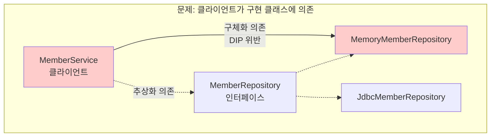
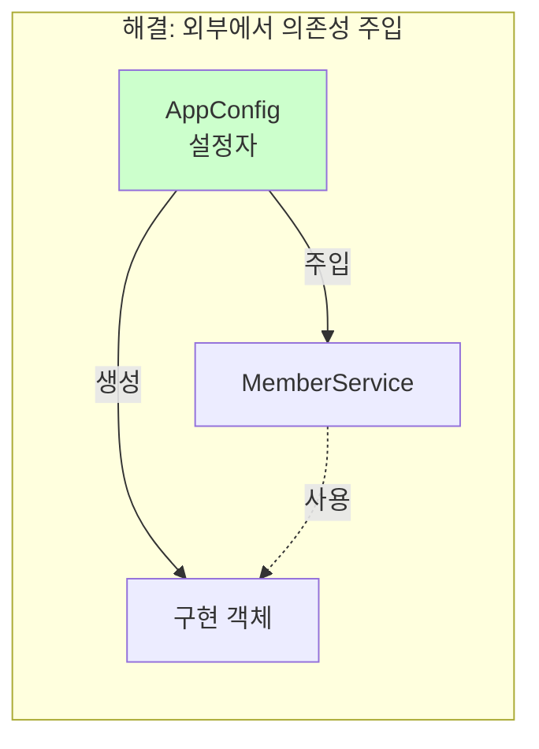
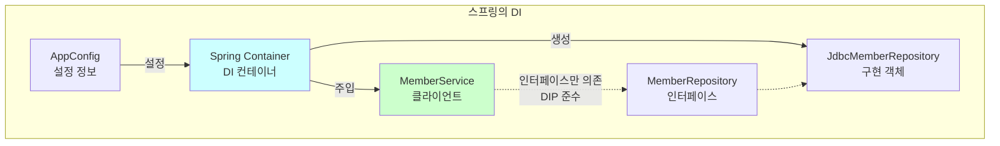
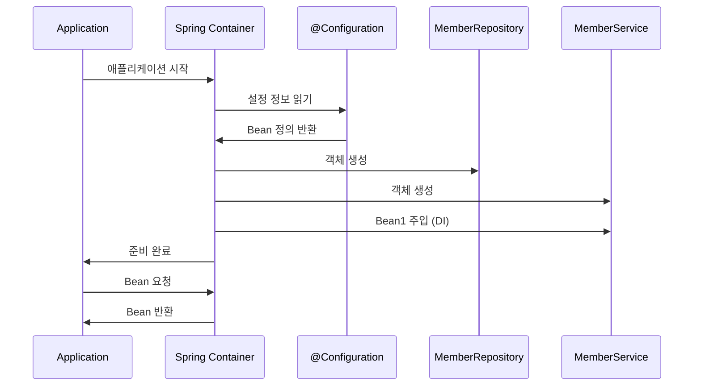
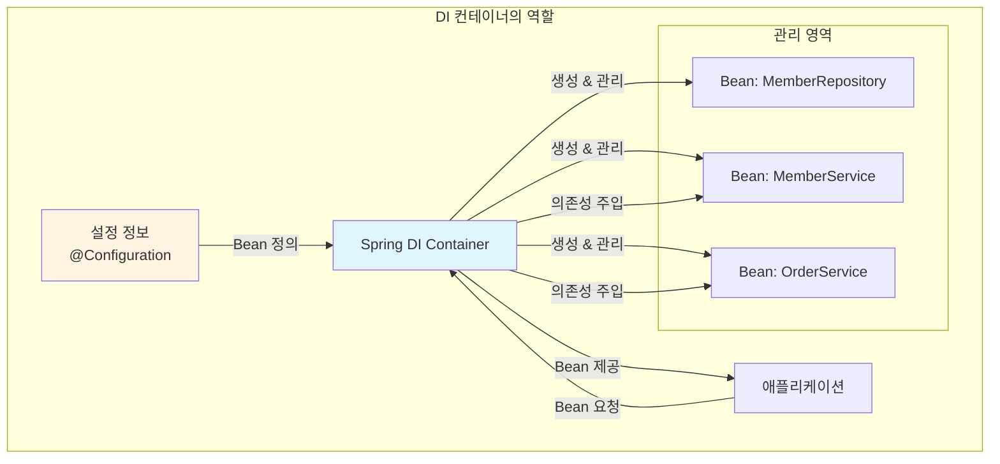
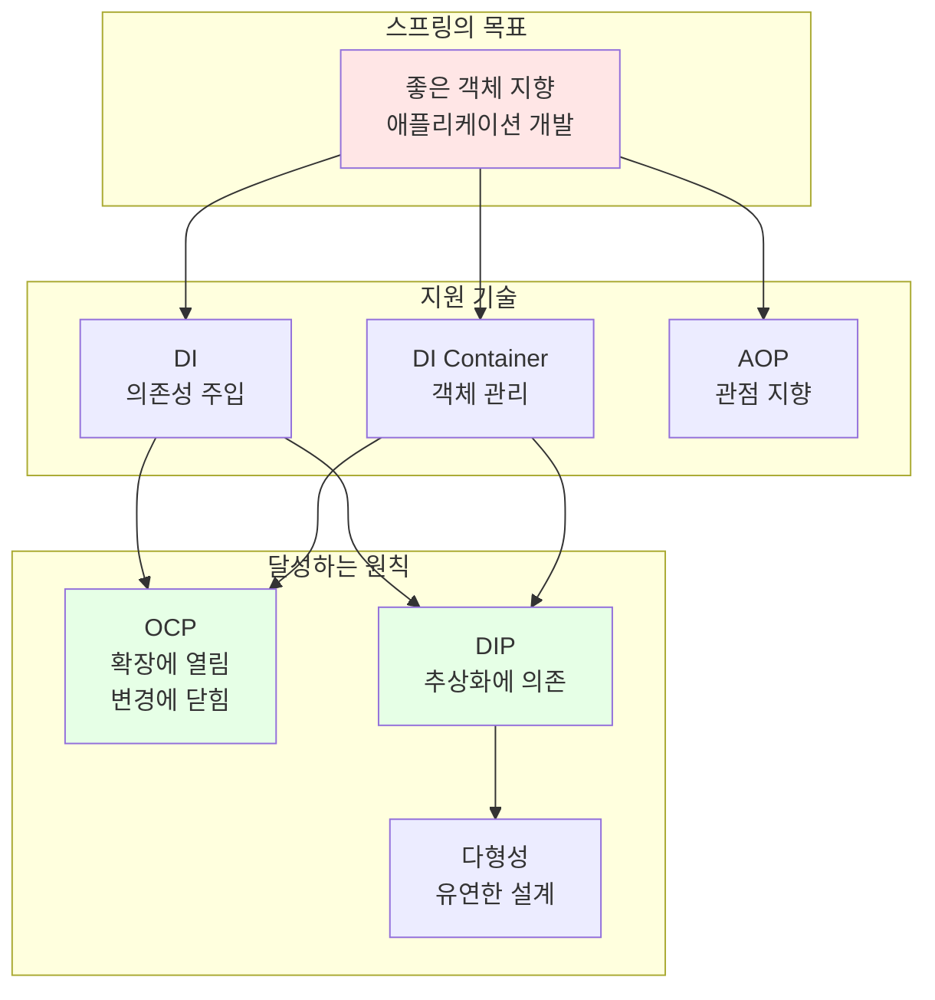
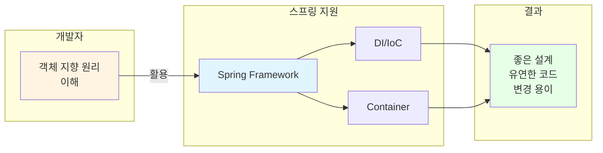
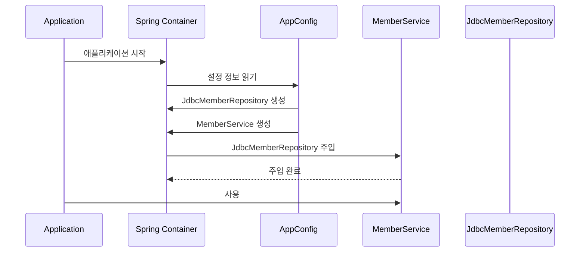
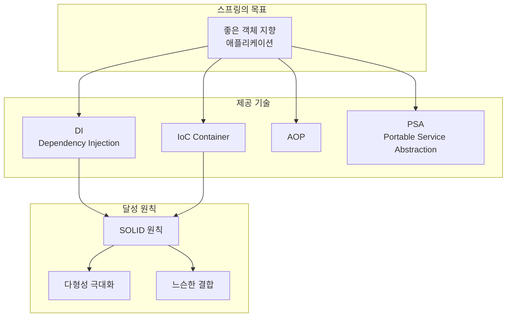

# 1-5. 객체 지향 설계와 스프링

**출처**: 인프런 - 스프링 핵심 원리 기본편
**강의 시간**: 08:29
**작성일**: 2025-01-23

---

## 📚 목차
1. [학습 목표](#학습-목표)
2. [연관 개념](#-연관-개념)
3. [다형성만으로는 부족하다](#다형성만으로는-부족하다)
4. [스프링과 객체 지향](#스프링과-객체-지향)
5. [DI 컨테이너의 역할](#di-컨테이너의-역할)
6. [정리](#정리)
7. [면접 질문](#면접-질문)

---

## 학습 목표

이 챕터를 학습한 후 다음을 할 수 있습니다:
- [ ] 다형성만으로 OCP, DIP를 지킬 수 없는 이유를 설명할 수 있다
- [ ] 스프링이 어떻게 객체 지향 설계 원칙을 지원하는지 이해한다
- [ ] DI 컨테이너의 필요성과 역할을 설명할 수 있다
- [ ] 스프링의 핵심 가치가 무엇인지 이해한다

---

## 🔗 연관 개념

- **선행 학습 권장**:
  - [1-3. 좋은 객체 지향 프로그래밍이란?](./1-3-좋은객체지향프로그래밍이란.md) - 다형성과 역할/구현 분리
  - [1-4. 좋은 객체 지향 설계의 5가지 원칙(SOLID)](./1-4-좋은객체지향설계의5가지원칙SOLID.md) - OCP, DIP

- **후속 학습 추천**:
  - 스프링 컨테이너와 스프링 빈
  - 의존관계 자동 주입

- **관련 개념**:
  - 제어의 역전(IoC, Inversion of Control)
  - 의존성 주입(DI, Dependency Injection)
  - 프레임워크 vs 라이브러리

---

## 다형성만으로는 부족하다

> 📌 **TL;DR**
> - 다형성만으로는 OCP와 DIP를 완전히 지킬 수 없다
> - 구현 클래스를 변경하면 클라이언트 코드도 함께 변경된다
> - 별도의 설정자(조립자)가 필요하다

### 핵심 개념

앞서 배운 **다형성**과 **SOLID 원칙**을 조합하면 좋은 객체 지향 설계가 가능할 것 같지만, 실제로는 **한계**가 있습니다.

### 상세 설명

#### 문제 상황 재검토

```java
public class MemberService {
    // private MemberRepository memberRepository = new MemoryMemberRepository();
    private MemberRepository memberRepository = new JdbcMemberRepository();
}
```

위 코드의 문제점:
1. **OCP 위반**: 확장에는 열려있지만, 변경에는 닫혀있지 않다
   - `MemoryMemberRepository`에서 `JdbcMemberRepository`로 변경하려면 클라이언트 코드를 수정해야 함

2. **DIP 위반**: 추상화에 의존해야 하지만, 구체화에도 의존한다
   - `MemberRepository` (추상화) 뿐만 아니라
   - `JdbcMemberRepository` (구체화)에도 의존

#### 근본 원인

```java
MemberRepository m = new JdbcMemberRepository();
```

- **기대**: 인터페이스만 의존
- **현실**: 구현 클래스도 의존
- **결과**: 구현 클래스 변경 시 클라이언트 코드 수정 필요

### 다이어그램



### 해결 방법

**누군가**가 클라이언트인 `MemberService`에 `MemberRepository`의 구현 객체를 대신 생성하고 주입해주어야 합니다.



### 주요 포인트

- 다형성만으로는 OCP, DIP를 지킬 수 없다
- 구현 객체를 변경하려면 클라이언트 코드를 변경해야 한다
- 별도의 조립자(설정자)가 구현 객체를 생성하고 주입해야 한다

---

## 스프링과 객체 지향

> 📌 **TL;DR**
> - 스프링은 DI 컨테이너를 제공하여 OCP, DIP를 가능하게 한다
> - 클라이언트 코드 변경 없이 기능을 확장할 수 있다
> - 스프링의 핵심은 좋은 객체 지향 애플리케이션 개발을 돕는 것이다

### 핵심 개념

**스프링**은 다음 기술로 다형성과 OCP, DIP를 가능하게 지원합니다:
- **DI(Dependency Injection)**: 의존관계, 의존성 주입
- **DI 컨테이너**: 의존성을 관리하고 주입하는 컨테이너

### 상세 설명

#### 스프링의 해결책

스프링은 **DI 컨테이너**를 통해 다음과 같이 문제를 해결합니다:

1. **의존성 주입(DI)**
   ```java
   @Service
   public class MemberService {
       private final MemberRepository memberRepository;

       // 생성자를 통한 의존성 주입
       @Autowired
       public MemberService(MemberRepository memberRepository) {
           this.memberRepository = memberRepository;
       }
   }
   ```
   - 클라이언트 코드는 인터페이스만 의존
   - 구현 객체는 외부(스프링)에서 주입

2. **설정 정보 분리**
   ```java
   @Configuration
   public class AppConfig {
       @Bean
       public MemberRepository memberRepository() {
           // return new MemoryMemberRepository();
           return new JdbcMemberRepository();
       }

       @Bean
       public MemberService memberService() {
           return new MemberService(memberRepository());
       }
   }
   ```
   - 구현 클래스 변경은 설정 파일에서만 수정
   - 클라이언트 코드는 변경 불필요

#### OCP와 DIP 준수



**결과**:
- ✅ **DIP 준수**: 클라이언트는 인터페이스에만 의존
- ✅ **OCP 준수**: 설정 정보만 변경하면 기능 확장 가능
- ✅ **클라이언트 코드 변경 없음**: 구현체 변경 시 클라이언트 수정 불필요

### 예제: 구현체 변경

#### Before (스프링 없이)
```java
public class MemberService {
    // 구현체 변경하려면 이 코드를 직접 수정해야 함
    // private MemberRepository repo = new MemoryMemberRepository();
    private MemberRepository repo = new JdbcMemberRepository();
}
```

#### After (스프링 사용)
```java
// MemberService.java - 변경 없음!
@Service
public class MemberService {
    private final MemberRepository memberRepository;

    @Autowired
    public MemberService(MemberRepository memberRepository) {
        this.memberRepository = memberRepository;
    }
}

// AppConfig.java - 여기만 변경
@Configuration
public class AppConfig {
    @Bean
    public MemberRepository memberRepository() {
        // return new MemoryMemberRepository();  // 메모리 버전
        return new JdbcMemberRepository();        // DB 버전
    }
}
```

### 주요 포인트

- 스프링은 DI 컨테이너 기술을 제공한다
- DI를 통해 OCP, DIP를 가능하게 한다
- 클라이언트 코드 변경 없이 기능 확장이 가능하다
- 설정 정보만 변경하면 된다

---

## DI 컨테이너의 역할

> 📌 **TL;DR**
> - DI 컨테이너는 객체를 생성하고 관리한다
> - 의존관계를 자동으로 주입한다
> - 애플리케이션 조립과 구성의 책임을 담당한다

### 핵심 개념

**DI 컨테이너**(또는 **IoC 컨테이너**, **스프링 컨테이너**)는 객체의 생명주기와 의존관계를 관리하는 컨테이너입니다.

### 상세 설명

#### DI 컨테이너의 주요 역할

1. **객체 생성과 관리**
   - 애플리케이션에 필요한 객체(빈)를 생성
   - 객체의 생명주기 관리 (생성 → 초기화 → 소멸)

2. **의존관계 주입**
   - 객체 간의 의존관계를 자동으로 연결
   - 생성자, 세터, 필드를 통한 주입

3. **설정과 구성의 분리**
   - 애플리케이션 로직과 객체 구성 로직 분리
   - 변경에 유연한 구조

#### DI 컨테이너 동작 과정



#### 제어의 역전(IoC)

```java
// 전통적인 방식: 내가 직접 제어
public class MemberService {
    private MemberRepository repository;

    public MemberService() {
        this.repository = new MemoryMemberRepository(); // 내가 생성
    }
}

// IoC 방식: 컨테이너가 제어
public class MemberService {
    private final MemberRepository repository;

    public MemberService(MemberRepository repository) {
        this.repository = repository; // 외부에서 주입받음
    }
}
```

**제어의 역전(IoC)**이란:
- 프로그램의 제어 흐름을 **개발자가 아닌 프레임워크가 제어**
- 객체의 생성, 생명주기 관리를 프레임워크에 위임
- 개발자는 비즈니스 로직에만 집중

### 다이어그램



### 💡 심화 내용

<details>
<summary>DI의 3가지 방법 더 알아보기</summary>

#### 1. 생성자 주입 (권장)
```java
@Service
public class MemberService {
    private final MemberRepository memberRepository;

    @Autowired // 생성자가 1개면 생략 가능
    public MemberService(MemberRepository memberRepository) {
        this.memberRepository = memberRepository;
    }
}
```
**장점**:
- 불변성 보장 (`final` 사용 가능)
- 필수 의존성을 명확히 표현
- 테스트 코드 작성 용이

#### 2. 세터 주입
```java
@Service
public class MemberService {
    private MemberRepository memberRepository;

    @Autowired
    public void setMemberRepository(MemberRepository memberRepository) {
        this.memberRepository = memberRepository;
    }
}
```
**단점**:
- 의존성이 변경될 수 있음
- NPE(NullPointerException) 가능성

#### 3. 필드 주입
```java
@Service
public class MemberService {
    @Autowired
    private MemberRepository memberRepository;
}
```
**단점**:
- 테스트하기 어려움
- 프레임워크 의존적
- 불변성 보장 불가

**결론**: **생성자 주입**을 사용하는 것이 가장 좋은 방법입니다.

</details>

<details>
<summary>스프링 없이 DI 구현하기</summary>

스프링을 사용하지 않고도 DI 패턴을 직접 구현할 수 있습니다:

```java
// AppConfig.java - 수동 DI 컨테이너
public class AppConfig {

    public MemberRepository memberRepository() {
        return new MemoryMemberRepository();
    }

    public MemberService memberService() {
        return new MemberService(memberRepository());
    }

    public OrderService orderService() {
        return new OrderService(memberRepository(), discountPolicy());
    }

    public DiscountPolicy discountPolicy() {
        return new RateDiscountPolicy();
    }
}

// 사용
public class Main {
    public static void main(String[] args) {
        AppConfig appConfig = new AppConfig();
        MemberService memberService = appConfig.memberService();
        // 사용
    }
}
```

이 방식의 장점:
- DI 원리를 이해하는 데 도움
- 간단한 프로젝트에서는 충분

단점:
- 객체 생성 코드를 직접 작성해야 함
- 싱글톤 보장 어려움
- 빈 생명주기 관리 수동 처리

</details>

### 주요 포인트

- DI 컨테이너는 객체의 생성과 생명주기를 관리한다
- 의존관계를 자동으로 주입한다
- IoC(제어의 역전) 원칙을 구현한다
- 개발자는 비즈니스 로직에 집중할 수 있다

---

## 전체 요약

> 📌 **TL;DR**
> - 스프링의 핵심은 좋은 객체 지향 설계를 지원하는 것이다
> - DI 컨테이너를 통해 다형성 + OCP + DIP를 가능하게 한다
> - 모든 설계의 중심에는 객체 지향 원리가 있다

### 핵심 개념

**스프링의 진정한 가치**는 단순히 기술을 제공하는 것이 아니라, **좋은 객체 지향 애플리케이션을 개발할 수 있도록 돕는 것**입니다.

### 상세 설명

#### 스프링의 핵심 가치



#### 결론

1. **모든 설계의 기초는 객체 지향 원리**
   - 다형성이 가장 중요
   - SOLID 원칙을 지켜야 함
   - 역할과 구현의 분리

2. **스프링은 이를 편리하게 해주는 도구**
   - DI 컨테이너로 OCP, DIP 가능
   - 다형성을 극대화할 수 있도록 지원
   - 레거시 코드도 유연하게 변경 가능

3. **결국 객체 지향 프로그래밍**
   - 스프링을 잘 사용하려면 객체 지향 원리를 이해해야 함
   - 기술보다 원리가 먼저
   - 좋은 객체 지향 개발자가 되어야 스프링도 잘 사용할 수 있음

### 다이어그램: 전체 구조



### 주요 포인트

- **스프링의 핵심**: 좋은 객체 지향 애플리케이션을 개발할 수 있게 돕는다
- **핵심 기술**: DI 컨테이너로 다형성 + OCP + DIP를 가능하게 한다
- **본질**: 객체 지향 원리를 이해해야 스프링을 제대로 사용할 수 있다

### 💡 Tip

- 스프링을 학습할 때 "어떻게"보다 "왜"를 먼저 이해하자
- 객체 지향 설계 원칙을 먼저 공부하면 스프링이 쉬워진다
- 스프링은 도구일 뿐, 중요한 건 좋은 설계 능력

### ⚠️ 주의사항

- 스프링이 모든 문제를 해결해주지는 않는다
- 잘못된 설계는 스프링을 사용해도 나쁜 코드가 된다
- 객체 지향 원리를 무시하면 스프링의 장점을 활용할 수 없다

---

## 면접 질문

### 초급 개발자 (Junior)

**Q1. 다형성만으로 OCP와 DIP를 지킬 수 없는 이유는 무엇인가요?**

<details>
<summary>답안 보기</summary>

#### 답안
다형성만으로는 OCP와 DIP를 완전히 지킬 수 없습니다. 그 이유는:

1. **DIP 위반**:
   ```java
   public class MemberService {
       private MemberRepository memberRepository = new MemoryMemberRepository();
   }
   ```
   - `MemberRepository` 인터페이스(추상화)에 의존하지만
   - `MemoryMemberRepository` 구체 클래스(구체화)에도 동시에 의존합니다
   - DIP는 "추상화에만 의존"해야 한다고 말합니다

2. **OCP 위반**:
   ```java
   // 구현 클래스를 변경하려면
   // private MemberRepository memberRepository = new MemoryMemberRepository();
   private MemberRepository memberRepository = new JdbcMemberRepository();
   ```
   - 기능을 확장(구현 클래스 변경)하려면 클라이언트 코드를 수정해야 합니다
   - OCP는 "확장에는 열려있고, 변경에는 닫혀있어야" 한다고 말합니다

따라서 **별도의 설정자(조립자)**가 구현 객체를 생성하고 주입해야 OCP와 DIP를 지킬 수 있습니다.

</details>

**Q2. 스프링의 DI 컨테이너는 무엇이며, 왜 필요한가요?**

<details>
<summary>답안 보기</summary>

#### 답안
**DI 컨테이너**는 스프링에서 객체의 생성과 의존관계 관리를 담당하는 컨테이너입니다.

**주요 역할**:
1. **객체 생성**: 애플리케이션에 필요한 객체(빈)를 생성
2. **생명주기 관리**: 객체의 초기화부터 소멸까지 관리
3. **의존관계 주입**: 객체 간의 의존관계를 자동으로 연결

**필요한 이유**:
```java
// DI 컨테이너 없이는
MemberRepository repo = new JdbcMemberRepository();
MemberService service = new MemberService(repo);  // 직접 생성하고 주입

// DI 컨테이너 사용 시
@Autowired
public MemberService(MemberRepository memberRepository) {
    this.memberRepository = memberRepository;  // 자동 주입
}
```

1. **OCP, DIP 준수**: 클라이언트 코드 변경 없이 구현 객체 변경 가능
2. **관심사 분리**: 비즈니스 로직과 객체 생성 로직 분리
3. **싱글톤 관리**: 객체를 싱글톤으로 관리하여 메모리 효율 증대
4. **생산성 향상**: 반복적인 객체 생성 코드 제거

</details>

---

### 중급 개발자 (Mid-Level)

**Q3. 제어의 역전(IoC)이란 무엇이며, 일반적인 프로그램 흐름과 어떻게 다른가요?**

<details>
<summary>답안 보기</summary>

#### 답안
**제어의 역전(IoC, Inversion of Control)**은 프로그램의 제어 흐름을 개발자가 아닌 프레임워크가 제어하는 것을 의미합니다.

**일반적인 프로그램 흐름** (개발자가 제어):
```java
public class MemberService {
    private MemberRepository repository;

    public MemberService() {
        // 내가 직접 어떤 구현체를 사용할지 결정하고 생성
        this.repository = new MemoryMemberRepository();
    }

    public void join(Member member) {
        repository.save(member);
    }
}
```
- 개발자가 직접 객체를 생성
- 개발자가 메서드 호출 시점 결정
- 개발자가 프로그램 흐름 제어

**IoC가 적용된 흐름** (프레임워크가 제어):
```java
@Service
public class MemberService {
    private final MemberRepository repository;

    // 프레임워크가 어떤 구현체를 주입할지 결정
    @Autowired
    public MemberService(MemberRepository repository) {
        this.repository = repository;
    }

    public void join(Member member) {
        repository.save(member);
    }
}
```
- 프레임워크(스프링)가 객체 생성
- 프레임워크가 메서드 호출 (생성자, 초기화 등)
- 프레임워크가 프로그램 흐름 제어

**차이점**:
| 구분 | 일반적인 흐름 | IoC |
|------|--------------|-----|
| 객체 생성 | 개발자가 직접 `new` | 프레임워크가 생성 |
| 의존성 관리 | 개발자가 직접 주입 | 프레임워크가 자동 주입 |
| 제어권 | 개발자 | 프레임워크 |
| 코드 결합도 | 높음 | 낮음 |

**장점**:
- 개발자는 비즈니스 로직에만 집중
- 객체 간 결합도 감소
- 코드 재사용성 증가
- 테스트 용이

**프레임워크 vs 라이브러리**:
- **프레임워크**: IoC 개념이 적용되어 있음 (스프링, Django)
- **라이브러리**: 개발자가 직접 호출 (JQuery, Lombok)

</details>

**Q4. 스프링을 사용하면 어떻게 OCP와 DIP를 지킬 수 있나요? 구체적인 예제로 설명해주세요.**

<details>
<summary>답안 보기</summary>

#### 답안

스프링의 **DI(의존성 주입)** 기능을 통해 OCP와 DIP를 지킬 수 있습니다.

**문제 상황**: 메모리 저장소에서 DB 저장소로 변경

#### 스프링 없이 (OCP, DIP 위반)
```java
public class MemberService {
    // 구현 클래스를 직접 생성 → DIP 위반
    // private MemberRepository repo = new MemoryMemberRepository();

    // 변경하려면 이 코드를 직접 수정해야 함 → OCP 위반
    private MemberRepository repo = new JdbcMemberRepository();
}
```

**문제점**:
- ✗ DIP 위반: 추상화(`MemberRepository`)와 구체화(`JdbcMemberRepository`) 모두에 의존
- ✗ OCP 위반: 기능 확장(저장소 변경) 시 클라이언트 코드 수정 필요

#### 스프링 사용 (OCP, DIP 준수)

**1단계: 클라이언트 코드 (변경 없음!)**
```java
@Service
public class MemberService {
    private final MemberRepository memberRepository;

    // 생성자 주입: 인터페이스만 의존 → DIP 준수 ✓
    @Autowired
    public MemberService(MemberRepository memberRepository) {
        this.memberRepository = memberRepository;
    }

    public void join(Member member) {
        memberRepository.save(member);
    }
}
```

**2단계: 설정 파일 (여기만 변경)**
```java
@Configuration
public class AppConfig {

    @Bean
    public MemberRepository memberRepository() {
        // 메모리 버전 사용
        // return new MemoryMemberRepository();

        // DB 버전으로 변경 → OCP 준수 ✓
        return new JdbcMemberRepository();
    }

    @Bean
    public MemberService memberService() {
        return new MemberService(memberRepository());
    }
}
```

**동작 과정**:


**결과**:
- ✓ **DIP 준수**: `MemberService`는 `MemberRepository` 인터페이스만 의존
- ✓ **OCP 준수**: 구현체 변경 시 `AppConfig`만 수정, 클라이언트 코드는 변경 없음
- ✓ **유연한 확장**: 새로운 저장소 구현체 추가 시에도 클라이언트 코드 변경 불필요

**실무 예시**:
```java
// 개발 환경
@Profile("dev")
@Bean
public MemberRepository memberRepository() {
    return new MemoryMemberRepository();  // 메모리 사용
}

// 운영 환경
@Profile("prod")
@Bean
public MemberRepository memberRepository() {
    return new JdbcMemberRepository();  // DB 사용
}
```
- 환경에 따라 다른 구현체 사용
- 클라이언트 코드는 전혀 변경 없음

</details>

---

### 고급 개발자 (Senior)

**Q5. 스프링의 핵심 가치는 무엇이며, 이것이 애플리케이션 설계에 어떤 영향을 미치나요?**

<details>
<summary>답안 보기</summary>

#### 답안

스프링의 핵심 가치는 **"좋은 객체 지향 애플리케이션을 개발할 수 있도록 돕는 것"**입니다. 단순히 기술을 제공하는 것이 아니라, 객체 지향 설계 원칙을 실현할 수 있는 환경을 제공하는 것이 본질입니다.

#### 1. 핵심 가치와 철학

**"스프링은 객체 지향의 강력한 장점인 다형성을 극대화할 수 있게 도와준다"**



#### 2. 애플리케이션 설계에 미치는 영향

**A. 역할과 구현의 분리 강제**
```java
// 인터페이스(역할) 정의
public interface PaymentService {
    void pay(int amount);
}

// 구현체들
@Service("cardPayment")
public class CardPaymentService implements PaymentService {
    public void pay(int amount) { /* 카드 결제 */ }
}

@Service("kakaoPayment")
public class KakaoPaymentService implements PaymentService {
    public void pay(int amount) { /* 카카오페이 결제 */ }
}

// 클라이언트
@Controller
public class OrderController {
    private final PaymentService paymentService;

    @Autowired
    public OrderController(@Qualifier("cardPayment") PaymentService paymentService) {
        this.paymentService = paymentService;
    }
}
```

**설계 영향**:
- 자연스럽게 인터페이스 기반 설계
- 구현체 교체가 자유로움
- 테스트 시 Mock 객체 주입 용이

**B. 단일 책임 원칙(SRP) 적용 용이**
```java
// 나쁜 예: 하나의 클래스가 여러 책임
public class UserService {
    public void register(User user) { }
    public void sendEmail(String email) { }
    public void log(String message) { }
}

// 좋은 예: 책임 분리
@Service
public class UserService {
    private final EmailService emailService;
    private final LogService logService;

    @Autowired
    public UserService(EmailService emailService, LogService logService) {
        this.emailService = emailService;
        this.logService = logService;
    }

    public void register(User user) {
        // 사용자 등록 로직만
        emailService.send(user.getEmail());
        logService.log("User registered: " + user.getId());
    }
}

@Service
public class EmailService {
    public void send(String email) { /* 이메일 발송 책임 */ }
}

@Service
public class LogService {
    public void log(String message) { /* 로깅 책임 */ }
}
```

**설계 영향**:
- 각 클래스가 하나의 명확한 책임
- 변경 시 영향 범위가 작음
- 재사용성 증가

**C. 계층 구조(Layered Architecture) 자연스러운 적용**
```java
// Presentation Layer
@RestController
@RequestMapping("/api/users")
public class UserController {
    private final UserService userService;

    @Autowired
    public UserController(UserService userService) {
        this.userService = userService;
    }
}

// Business Logic Layer
@Service
public class UserService {
    private final UserRepository userRepository;

    @Autowired
    public UserService(UserRepository userRepository) {
        this.userRepository = userRepository;
    }
}

// Data Access Layer
@Repository
public interface UserRepository extends JpaRepository<User, Long> {
}
```

**설계 영향**:
- 각 계층의 책임이 명확
- 상위 계층이 하위 계층에 의존 (DIP)
- 계층 간 느슨한 결합

#### 3. 실무 설계 패턴에 미치는 영향

**A. 전략 패턴 구현 용이**
```java
// 전략 인터페이스
public interface DiscountPolicy {
    int discount(int price);
}

// 전략 구현체들
@Component
public class FixDiscountPolicy implements DiscountPolicy {
    public int discount(int price) { return price - 1000; }
}

@Component
public class RateDiscountPolicy implements DiscountPolicy {
    public int discount(int price) { return price * 10 / 100; }
}

// 컨텍스트
@Service
public class OrderService {
    private final DiscountPolicy discountPolicy;

    @Autowired
    public OrderService(DiscountPolicy discountPolicy) {
        this.discountPolicy = discountPolicy;  // 런타임에 전략 주입
    }
}
```

**B. 템플릿 메서드 패턴 (JdbcTemplate, RestTemplate)**
```java
@Repository
public class MemberRepository {
    private final JdbcTemplate jdbcTemplate;

    public Member findById(Long id) {
        // 반복적인 JDBC 코드는 템플릿이 처리
        return jdbcTemplate.queryForObject(
            "SELECT * FROM member WHERE id = ?",
            memberRowMapper(),
            id
        );
    }
}
```

#### 4. 테스트 용이성

```java
// 단위 테스트
@Test
void orderTest() {
    // Mock 객체 주입으로 테스트 용이
    MemberRepository mockRepo = mock(MemberRepository.class);
    DiscountPolicy mockPolicy = mock(DiscountPolicy.class);

    OrderService orderService = new OrderService(mockRepo, mockPolicy);
    // 테스트 로직
}

// 통합 테스트
@SpringBootTest
class OrderServiceIntegrationTest {
    @Autowired
    private OrderService orderService;  // 실제 빈 주입

    @Test
    void integrationTest() {
        // 실제 환경과 동일하게 테스트
    }
}
```

#### 5. 결론

스프링의 핵심 가치가 설계에 미치는 영향:

1. **자연스러운 객체 지향 설계**
   - 인터페이스 기반 설계 유도
   - 역할과 구현의 명확한 분리

2. **SOLID 원칙 준수**
   - DI를 통한 DIP 자동 준수
   - 확장에 열려있고 변경에 닫힌 구조

3. **유지보수성 향상**
   - 변경 영향 범위 최소화
   - 코드 재사용성 증가

4. **테스트 용이성**
   - 의존성을 쉽게 교체 가능
   - 단위 테스트 작성 편리

5. **협업 효율성**
   - 계층 구조가 명확
   - 역할 분담이 쉬움

**핵심 메시지**: 스프링은 단순한 프레임워크가 아니라 **좋은 설계를 강제하고 지원하는 도구**이며, 이를 통해 개발자는 자연스럽게 좋은 객체 지향 설계 원칙을 따르게 됩니다. 따라서 스프링을 잘 사용하려면 기술보다 **객체 지향 원리를 먼저 이해**해야 합니다.

</details>

---

## 학습 체크리스트
- [ ] 다형성만으로 OCP, DIP를 지킬 수 없는 이유를 설명할 수 있다
- [ ] 스프링의 DI 컨테이너가 하는 역할을 설명할 수 있다
- [ ] IoC(제어의 역전)의 개념을 이해하고 설명할 수 있다
- [ ] 스프링이 어떻게 OCP와 DIP를 지원하는지 코드로 설명할 수 있다
- [ ] 스프링의 핵심 가치가 무엇인지 이해하고 설명할 수 있다
- [ ] 면접 질문에 답할 수 있다

## 다음 학습
이것으로 "1. 객체 지향 설계와 스프링" 챕터의 모든 학습을 완료했습니다.

다음 챕터에서는 스프링 컨테이너와 빈의 실제 동작 방식, 의존관계 자동 주입 등 스프링의 핵심 기능을 더 깊이 학습하게 됩니다.

---

## 📚 참고자료

- [Spring Framework 공식 문서](https://spring.io/projects/spring-framework)
- [Inversion of Control Containers and the Dependency Injection pattern - Martin Fowler](https://martinfowler.com/articles/injection.html)
- 토비의 스프링 3.1 - 이일민 저
- 객체지향의 사실과 오해 - 조영호 저

---

## 네비게이션

⬅️ [이전: 1-4. 좋은 객체 지향 설계의 5가지 원칙(SOLID)](./1-4-좋은객체지향설계의5가지원칙SOLID.md)

---

**작성 완료일**: 2025-01-23
**문서 버전**: 1.0
