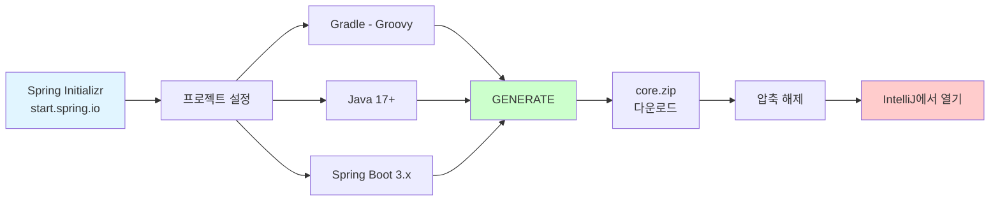
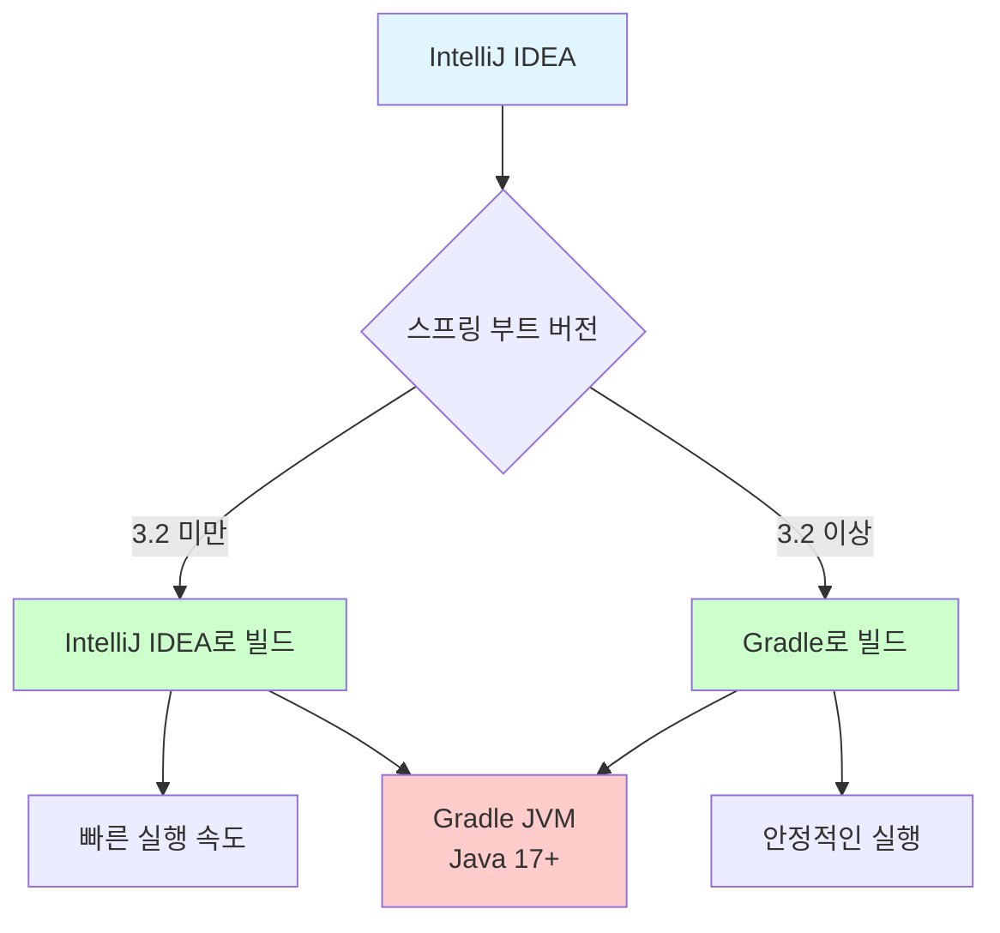
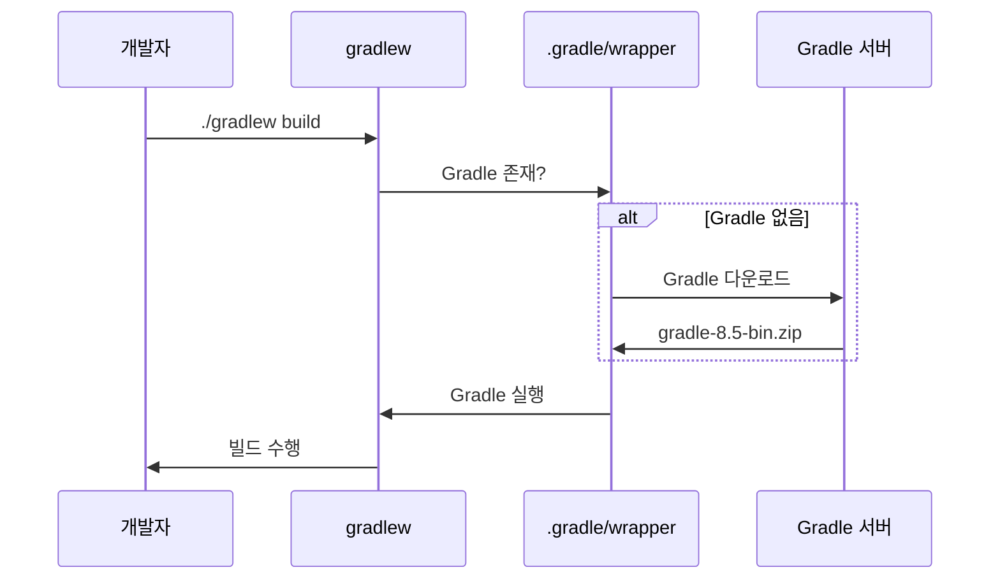
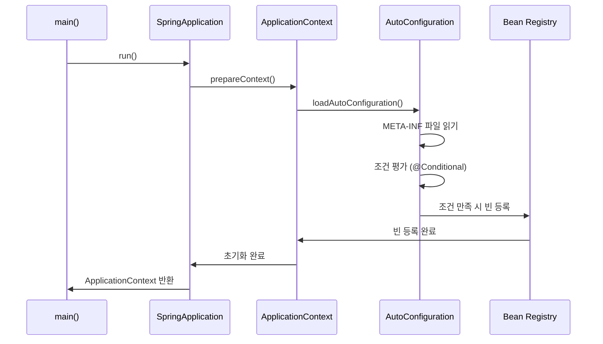

# 2-1. 프로젝트 생성

**출처**: 인프런 - 스프링 핵심 원리 기본편
**강의 시간**: 약 10분
**작성일**: 2025-01-23

---

## 📚 목차
1. [학습 목표](#학습-목표)
2. [연관 개념](#-연관-개념)
3. [사전 준비물](#사전-준비물)
4. [스프링 부트 프로젝트 생성](#스프링-부트-프로젝트-생성)
5. [프로젝트 설정](#프로젝트-설정)
6. [IntelliJ 설정](#intellij-설정)
7. [정리](#정리)
8. [면접 질문](#면접-질문)

---

## 학습 목표

이 챕터를 학습한 후 다음을 할 수 있습니다:
- [ ] Spring Initializr를 사용하여 스프링 부트 프로젝트를 생성할 수 있다
- [ ] Gradle 프로젝트의 기본 구조를 이해한다
- [ ] IntelliJ에서 스프링 부트 프로젝트를 실행할 수 있다
- [ ] 스프링 부트 3.x와 Java 17 이상의 관계를 이해한다

---

## 🔗 연관 개념

- **선행 학습 권장**:
  - Java 기본 문법
  - Gradle 또는 Maven 기초

- **후속 학습**:
  - [2-2. 비즈니스 요구사항과 설계](./2-2-비즈니스요구사항과설계.md)

- **관련 개념**:
  - Spring Initializr
  - Gradle 빌드 도구
  - Spring Boot Auto Configuration

---

## 사전 준비물

> 📌 **TL;DR**
> - Java 17 이상 필수 설치
> - IntelliJ IDEA 또는 Eclipse IDE 설치
> - 스프링 부트 3.0 이상 사용

### 핵심 개념

스프링 부트 프로젝트를 시작하기 위한 최소 요구사항을 확인합니다.

### 상세 설명

#### 필수 설치 항목

**1. Java 17 이상**
```bash
# Java 버전 확인
java -version

# 출력 예시
java version "17.0.8" 2023-07-18 LTS
```

**중요**: 스프링 부트 3.0부터는 Java 17이 최소 요구사항입니다.

**2. IDE 선택**
- **IntelliJ IDEA** (권장)
  - Ultimate 버전 또는 Community 버전
  - 스프링 지원이 우수함

- **Eclipse**
  - Spring Tools Suite(STS) 플러그인 설치 필요

### 주요 포인트

- Java 17 이상 필수
- IntelliJ IDEA 권장
- 스프링 부트 3.x 사용

---

## 스프링 부트 프로젝트 생성

> 📌 **TL;DR**
> - Spring Initializr 사이트에서 프로젝트 생성
> - Gradle, Java, Jar 패키징 선택
> - Dependencies는 선택하지 않음 (순수 Java로 시작)

### 핵심 개념

**Spring Initializr**는 스프링 부트 프로젝트를 쉽게 생성해주는 웹 도구입니다.

### 상세 설명

#### 1. Spring Initializr 접속

웹 브라우저에서 https://start.spring.io 접속

#### 2. 프로젝트 설정

**Project 선택**:
```
Project: Gradle - Groovy
```
- Gradle: 빌드 자동화 도구
- Groovy: Gradle DSL 스크립트 언어

**Language 선택**:
```
Language: Java
```

**Spring Boot 버전**:
```
Spring Boot: 3.x.x (최신 안정 버전)
```

**Packaging**:
```
Packaging: Jar
```
- Jar: 내장 톰캣 포함, 실행 가능한 JAR 파일
- War: 외부 톰캣에 배포 시 사용

**Java 버전**:
```
Java: 17 또는 21
```

#### 3. Project Metadata 설정

```
Group: hello
Artifact: core
```

- **Group**: 보통 회사 도메인 역순 (예: com.example)
- **Artifact**: 프로젝트 이름

#### 4. Dependencies

```
Dependencies: 선택하지 않음
```

**이유**: 순수 자바로 객체 지향 설계를 먼저 학습하기 위함

#### 5. 프로젝트 생성

**GENERATE** 버튼 클릭 → ZIP 파일 다운로드 → 압축 해제

### 다이어그램



### 예제

**생성된 프로젝트 구조**:
```
core/
├── src/
│   ├── main/
│   │   ├── java/
│   │   │   └── hello/
│   │   │       └── core/
│   │   │           └── CoreApplication.java
│   │   └── resources/
│   │       └── application.properties
│   └── test/
│       └── java/
│           └── hello/
│               └── core/
│                   └── CoreApplicationTests.java
├── build.gradle
├── settings.gradle
└── gradlew
```

### 💡 Tip

- Spring Initializr는 프로젝트 초기 설정을 빠르게 해줍니다
- 나중에 필요한 의존성은 build.gradle에 추가할 수 있습니다
- Gradle Wrapper(gradlew)가 포함되어 Gradle 설치 불필요

### ⚠️ 주의사항

- 스프링 부트 2.x는 지원 종료되었으므로 3.x 사용 필수
- Java 17 미만 버전은 스프링 부트 3.x와 호환되지 않음

---

## 프로젝트 설정

> 📌 **TL;DR**
> - build.gradle 파일에 프로젝트 설정이 정의됨
> - javax 패키지가 jakarta로 변경됨 (Java EE → Jakarta EE)
> - 의존성은 자동으로 관리됨

### 핵심 개념

**build.gradle** 파일은 Gradle 빌드 설정을 정의하는 파일입니다.

### 상세 설명

#### Gradle 설정 파일 분석

**build.gradle**:
```groovy
plugins {
    id 'java'
    id 'org.springframework.boot' version '3.2.0'
    id 'io.spring.dependency-management' version '1.1.4'
}

group = 'hello'
version = '0.0.1-SNAPSHOT'
sourceCompatibility = '17'

repositories {
    mavenCentral()
}

dependencies {
    implementation 'org.springframework.boot:spring-boot-starter'
    testImplementation 'org.springframework.boot:spring-boot-starter-test'
}

tasks.named('test') {
    useJUnitPlatform()
}
```

**주요 설정 설명**:

1. **plugins**: 사용할 Gradle 플러그인
   - `java`: Java 프로젝트 지원
   - `spring-boot`: 스프링 부트 플러그인
   - `dependency-management`: 의존성 버전 관리

2. **sourceCompatibility**: Java 컴파일 버전

3. **repositories**: 의존성을 다운로드할 저장소
   - `mavenCentral()`: Maven 중앙 저장소

4. **dependencies**: 프로젝트 의존성
   - `spring-boot-starter`: 스프링 부트 기본 의존성
   - `spring-boot-starter-test`: 테스트 의존성 (JUnit 포함)

#### 스프링 부트 3.x 주요 변경사항

**1. javax → jakarta 패키지 변경**

| 기존 (javax) | 변경 (jakarta) |
|--------------|----------------|
| javax.persistence.Entity | jakarta.persistence.Entity |
| javax.annotation.PostConstruct | jakarta.annotation.PostConstruct |
| javax.validation | jakarta.validation |

**이유**: Oracle과 Java 라이센스 문제로 Jakarta EE로 이관

**2. Java 17 최소 요구**
```
Java 17 이상 필수
```

**3. H2 데이터베이스 버전**
```
H2 Database: 2.1.214 이상 사용
```

### 💡 심화 내용

<details>
<summary>Gradle Wrapper란?</summary>

#### Gradle Wrapper의 역할

**Gradle Wrapper**는 Gradle을 별도로 설치하지 않아도 프로젝트를 빌드할 수 있게 해주는 스크립트입니다.

**파일 구성**:
```
core/
├── gradle/
│   └── wrapper/
│       ├── gradle-wrapper.jar
│       └── gradle-wrapper.properties
├── gradlew        # Unix/Linux/Mac용 실행 스크립트
└── gradlew.bat    # Windows용 실행 스크립트
```

**사용 방법**:
```bash
# Unix/Linux/Mac
./gradlew build
./gradlew test

# Windows
gradlew.bat build
gradlew.bat test
```

**장점**:
- Gradle 설치 불필요
- 프로젝트별로 다른 Gradle 버전 사용 가능
- 팀 전체가 동일한 Gradle 버전 사용 보장

</details>

<details>
<summary>Spring Boot Starter의 역할</summary>

#### Spring Boot Starter

**Starter**는 관련된 의존성을 묶어서 제공하는 의존성 디스크립터입니다.

**예시: spring-boot-starter-web**
```xml
<dependency>
    <groupId>org.springframework.boot</groupId>
    <artifactId>spring-boot-starter-web</artifactId>
</dependency>
```

이 하나로 다음이 자동 포함됩니다:
- spring-web
- spring-webmvc
- tomcat (내장 서버)
- jackson (JSON 변환)
- validation
- 기타 웹 개발에 필요한 라이브러리

**장점**:
- 의존성을 일일이 추가할 필요 없음
- 호환되는 버전 자동 관리
- 설정 간소화

</details>

### 주요 포인트

- build.gradle에 모든 빌드 설정이 정의됨
- javax 패키지는 jakarta로 변경됨
- Gradle Wrapper로 Gradle 설치 없이 빌드 가능

---

## IntelliJ 설정

> 📌 **TL;DR**
> - 스프링 부트 3.2 이상: Gradle로 빌드 설정
> - 스프링 부트 3.2 미만: IntelliJ IDEA로 빌드 설정 (더 빠름)
> - Gradle JVM은 Java 17 이상으로 설정

### 핵심 개념

IntelliJ에서 Gradle 빌드 방식을 설정하여 실행 속도를 최적화할 수 있습니다.

### 상세 설명

#### 1. 프로젝트 열기

1. IntelliJ IDEA 실행
2. **Open** 클릭
3. 압축 해제한 프로젝트 폴더 선택
4. **build.gradle** 파일이 있는 폴더 선택

#### 2. Gradle 설정 (스프링 부트 버전별)

**스프링 부트 3.2 미만**:

**경로**:
- Windows: `File → Settings (Ctrl+Alt+S)`
- Mac: `IntelliJ IDEA → Preferences (⌘,)`

**설정**:
```
Preferences → Build, Execution, Deployment → Build Tools → Gradle
```

**변경사항**:
```
Build and run using: Gradle → IntelliJ IDEA
Run tests using: Gradle → IntelliJ IDEA
```

**이유**: IntelliJ IDEA로 직접 실행하면 더 빠름

**스프링 부트 3.2 이상**:

**설정**:
```
Build and run using: Gradle (유지)
Run tests using: Gradle (유지)
Gradle JVM: Java 17 이상 선택
```

**이유**: 스프링 부트 3.2부터 IntelliJ IDEA 직접 실행 시 오류 발생 가능

#### 3. Gradle JVM 설정

```
Gradle JVM: 새로 설치한 Java 17 또는 그 이상
```

### 다이어그램



#### 4. 프로젝트 실행

**메인 클래스 실행**:
```java
// CoreApplication.java
package hello.core;

import org.springframework.boot.SpringApplication;
import org.springframework.boot.autoconfigure.SpringBootApplication;

@SpringBootApplication
public class CoreApplication {
    public static void main(String[] args) {
        SpringApplication.run(CoreApplication.class, args);
    }
}
```

**실행 방법**:
1. `CoreApplication.java` 파일 열기
2. `main()` 메서드 옆의 실행 버튼 클릭
3. 또는 클래스명에서 우클릭 → Run 'CoreApplication'

**실행 성공 로그**:
```
  .   ____          _            __ _ _
 /\\ / ___'_ __ _ _(_)_ __  __ _ \ \ \ \
( ( )\___ | '_ | '_| | '_ \/ _` | \ \ \ \
 \\/  ___)| |_)| | | | | || (_| |  ) ) ) )
  '  |____| .__|_| |_|_| |_\__, | / / / /
 =========|_|==============|___/=/_/_/_/
 :: Spring Boot ::                (v3.2.0)

[main] Started CoreApplication in 2.345 seconds
```

### 💡 Tip

- 첫 실행 시 의존성 다운로드로 시간이 소요됩니다
- 인터넷 연결 필요 (Maven Central에서 다운로드)
- 실행 단축키: `Shift + F10` (Windows), `Ctrl + R` (Mac)

### ⚠️ 주의사항

- Gradle JVM 버전이 Java 17 미만이면 오류 발생
- 프록시 환경에서는 Gradle 설정에 프록시 정보 추가 필요

---

## 정리

> 📌 **TL;DR**
> - Spring Initializr로 프로젝트 생성
> - Gradle 빌드 도구 사용
> - IntelliJ 설정 후 프로젝트 실행

### 핵심 개념

스프링 부트 프로젝트는 다음 단계로 생성하고 실행합니다:

1. **Spring Initializr**에서 프로젝트 생성
2. **build.gradle** 설정 확인
3. **IntelliJ** 설정 (Gradle 빌드 방식)
4. **CoreApplication** 실행

### 주요 포인트

- 스프링 부트 3.x + Java 17 이상 조합 필수
- Dependencies 없이 순수 Java로 시작
- Gradle Wrapper로 Gradle 설치 불필요
- IntelliJ 설정은 스프링 부트 버전에 따라 다름

---

## 전체 요약

- Spring Initializr를 사용하면 스프링 부트 프로젝트를 쉽게 생성할 수 있습니다
- 스프링 부트 3.x는 Java 17 이상, jakarta 패키지를 사용합니다
- Gradle은 빌드 자동화 도구이며, Gradle Wrapper로 별도 설치 불필요합니다
- IntelliJ 설정은 스프링 부트 버전에 따라 다르게 적용합니다
- 순수 Java로 시작하여 객체 지향 설계를 먼저 학습합니다

## 학습 체크리스트
- [ ] Spring Initializr에서 프로젝트를 생성할 수 있다
- [ ] build.gradle 파일의 기본 구조를 이해한다
- [ ] IntelliJ에서 Gradle 설정을 변경할 수 있다
- [ ] 스프링 부트 애플리케이션을 실행할 수 있다
- [ ] 스프링 부트 3.x와 javax → jakarta 변경사항을 이해한다

## 다음 학습
다음 챕터에서는 "비즈니스 요구사항과 설계"를 통해 예제 프로젝트의 요구사항을 분석하고 도메인을 설계합니다.

---

## 📚 참고자료

- [Spring Initializr](https://start.spring.io)
- [Spring Boot 공식 문서](https://spring.io/projects/spring-boot)
- [Spring Boot 3.0 마이그레이션 가이드](https://github.com/spring-projects/spring-boot/wiki/Spring-Boot-3.0-Migration-Guide)
- [Gradle 공식 문서](https://docs.gradle.org)

---

## 면접 질문

### 초급 개발자 (Junior)

**Q1. 스프링 부트 프로젝트를 생성하는 방법을 설명해주세요.**

<details>
<summary>답안 보기</summary>

#### 답안

스프링 부트 프로젝트는 **Spring Initializr**를 사용하여 쉽게 생성할 수 있습니다.

**생성 방법**:

1. **웹 브라우저**로 https://start.spring.io 접속

2. **프로젝트 설정**:
   - Project: Gradle 또는 Maven 선택
   - Language: Java
   - Spring Boot: 3.x 최신 버전
   - Packaging: Jar (내장 톰캣 포함)
   - Java: 17 이상

3. **Project Metadata 입력**:
   - Group: 회사 도메인 역순 (예: com.example)
   - Artifact: 프로젝트 이름

4. **Dependencies 선택**:
   - 필요한 라이브러리 추가 (Spring Web, JPA 등)

5. **GENERATE** 버튼 클릭하여 ZIP 파일 다운로드

6. **압축 해제** 후 IDE에서 열기

**장점**:
- 복잡한 설정 없이 빠르게 프로젝트 시작 가능
- 의존성 버전 관리 자동
- 표준화된 프로젝트 구조

</details>

**Q2. Gradle과 Maven의 차이점은 무엇인가요?**

<details>
<summary>답안 보기</summary>

#### 답안

**Gradle**과 **Maven**은 모두 빌드 자동화 도구입니다.

| 특징 | Gradle | Maven |
|------|--------|-------|
| **설정 파일** | build.gradle (Groovy/Kotlin) | pom.xml (XML) |
| **성능** | 빠름 (증분 빌드) | 상대적으로 느림 |
| **유연성** | 높음 (스크립트 기반) | 낮음 (규칙 기반) |
| **가독성** | 좋음 (간결) | 보통 (XML 장황함) |
| **Android** | 공식 빌드 도구 | 지원 약함 |

**Gradle 예시**:
```groovy
dependencies {
    implementation 'org.springframework.boot:spring-boot-starter-web'
}
```

**Maven 예시**:
```xml
<dependency>
    <groupId>org.springframework.boot</groupId>
    <artifactId>spring-boot-starter-web</artifactId>
</dependency>
```

**선택 기준**:
- **Gradle**: 빠른 빌드 속도, 유연한 설정 필요 시
- **Maven**: 안정성, 표준화된 프로세스 선호 시

**현재 트렌드**: 신규 프로젝트는 대부분 Gradle 사용

</details>

---

### 중급 개발자 (Mid-Level)

**Q3. 스프링 부트 3.x의 주요 변경사항과 그 이유를 설명해주세요.**

<details>
<summary>답안 보기</summary>

#### 답안

스프링 부트 3.x는 여러 중요한 변경사항이 있습니다.

**주요 변경사항**:

**1. Java 17 최소 요구 버전**
```
Spring Boot 2.x: Java 8+
Spring Boot 3.x: Java 17+
```

**이유**:
- Java 17은 LTS(Long Term Support) 버전
- 최신 언어 기능 활용 (Records, Pattern Matching 등)
- 성능 개선

**2. javax → jakarta 패키지 변경**

**변경 전 (javax)**:
```java
import javax.persistence.Entity;
import javax.annotation.PostConstruct;
import javax.validation.Valid;
```

**변경 후 (jakarta)**:
```java
import jakarta.persistence.Entity;
import jakarta.annotation.PostConstruct;
import jakarta.validation.Valid;
```

**이유**:
- Oracle과 Java EE 라이센스 문제
- Eclipse Foundation으로 이관 → Jakarta EE
- 모든 javax 패키지를 jakarta로 변경

**3. Native Image 지원 강화**

GraalVM Native Image 지원으로:
- 빠른 시작 시간
- 낮은 메모리 사용
- 클라우드 네이티브 환경에 최적

**4. Spring Native 통합**
```java
@SpringBootApplication
public class Application {
    public static void main(String[] args) {
        SpringApplication.run(Application.class, args);
    }
}
// AOT(Ahead-Of-Time) 컴파일 지원
```

**5. 관찰 기능(Observability) 개선**
- Micrometer Observation API 통합
- 분산 추적(Distributed Tracing) 개선
- 메트릭 수집 표준화

**마이그레이션 고려사항**:
1. Java 버전 업그레이드 (17+)
2. 모든 javax → jakarta 일괄 변경
3. 의존 라이브러리 호환성 확인
4. H2 데이터베이스 버전 업그레이드 (2.1.214+)

</details>

**Q4. Gradle Wrapper의 역할과 사용 이유를 설명해주세요.**

<details>
<summary>답안 보기</summary>

#### 답안

**Gradle Wrapper**는 Gradle을 별도로 설치하지 않고도 프로젝트를 빌드할 수 있게 해주는 스크립트입니다.

**구성 요소**:
```
project/
├── gradle/
│   └── wrapper/
│       ├── gradle-wrapper.jar      # Wrapper 실행 파일
│       └── gradle-wrapper.properties # Gradle 버전 설정
├── gradlew          # Unix/Linux/Mac 실행 스크립트
└── gradlew.bat      # Windows 실행 스크립트
```

**gradle-wrapper.properties 예시**:
```properties
distributionUrl=https\://services.gradle.org/distributions/gradle-8.5-bin.zip
```

**사용 방법**:
```bash
# Unix/Linux/Mac
./gradlew build
./gradlew test
./gradlew bootRun

# Windows
gradlew.bat build
gradlew.bat test
gradlew.bat bootRun
```

**사용 이유**:

**1. 환경 독립성**
- Gradle 설치 불필요
- 개발자마다 다른 환경에서도 동일하게 빌드

**2. 버전 관리**
```properties
# 프로젝트별로 다른 Gradle 버전 사용 가능
distributionUrl=gradle-7.6-bin.zip  # 프로젝트 A
distributionUrl=gradle-8.5-bin.zip  # 프로젝트 B
```

**3. 팀 협업**
- 모든 팀원이 동일한 Gradle 버전 사용 보장
- CI/CD 환경에서도 일관성 유지

**4. 호환성**
- 프로젝트와 호환되는 Gradle 버전 자동 다운로드
- 버전 충돌 방지

**동작 과정**:


**실무 활용**:
```bash
# 의존성 업데이트 확인
./gradlew dependencyUpdates

# 프로젝트 빌드 및 테스트
./gradlew clean build

# 스프링 부트 실행
./gradlew bootRun

# Wrapper 버전 업그레이드
./gradlew wrapper --gradle-version 8.5
```

**CI/CD 설정 예시**:
```yaml
# GitHub Actions
- name: Build with Gradle
  run: ./gradlew build
  # Gradle 설치 단계 불필요!
```

</details>

---

### 고급 개발자 (Senior)

**Q5. 스프링 부트의 AutoConfiguration 원리와 프로젝트 초기화 과정을 설명해주세요.**

<details>
<summary>답안 보기</summary>

#### 답안

스프링 부트의 가장 큰 특징인 **AutoConfiguration**은 조건에 따라 자동으로 빈을 등록하는 기능입니다.

**AutoConfiguration 동작 원리**:

**1. @SpringBootApplication 분석**
```java
@SpringBootApplication
public class CoreApplication {
    public static void main(String[] args) {
        SpringApplication.run(CoreApplication.class, args);
    }
}
```

**@SpringBootApplication의 구성**:
```java
@Target(ElementType.TYPE)
@Retention(RetentionPolicy.RUNTIME)
@Documented
@Inherited
@SpringBootConfiguration    // @Configuration과 동일
@EnableAutoConfiguration   // 자동 설정 활성화 ⭐
@ComponentScan             // 컴포넌트 스캔
public @interface SpringBootApplication {
}
```

**2. @EnableAutoConfiguration 동작**

```java
@Target(ElementType.TYPE)
@Retention(RetentionPolicy.RUNTIME)
@Import(AutoConfigurationImportSelector.class)  // ⭐ 핵심
public @interface EnableAutoConfiguration {
}
```

**AutoConfigurationImportSelector**가 다음 파일을 읽습니다:
```
META-INF/spring/org.springframework.boot.autoconfigure.AutoConfiguration.imports
```

**3. AutoConfiguration 파일 예시**

```
org.springframework.boot.autoconfigure.web.servlet.DispatcherServletAutoConfiguration
org.springframework.boot.autoconfigure.web.servlet.ServletWebServerFactoryAutoConfiguration
org.springframework.boot.autoconfigure.jdbc.DataSourceAutoConfiguration
...
```

**4. 조건부 자동 설정**

```java
@Configuration
@ConditionalOnClass(DataSource.class)  // DataSource 클래스가 있으면
@ConditionalOnMissingBean(DataSource.class)  // DataSource 빈이 없으면
@EnableConfigurationProperties(DataSourceProperties.class)
public class DataSourceAutoConfiguration {

    @Bean
    @ConditionalOnProperty(name = "spring.datasource.url")
    public DataSource dataSource(DataSourceProperties properties) {
        return properties.initializeDataSourceBuilder().build();
    }
}
```

**주요 Conditional 어노테이션**:

| 어노테이션 | 조건 |
|-----------|------|
| @ConditionalOnClass | 특정 클래스가 classpath에 있을 때 |
| @ConditionalOnMissingBean | 특정 빈이 등록되지 않았을 때 |
| @ConditionalOnProperty | 특정 프로퍼티가 있을 때 |
| @ConditionalOnWebApplication | 웹 애플리케이션일 때 |
| @ConditionalOnBean | 특정 빈이 등록되어 있을 때 |

**5. 프로젝트 초기화 과정**



**6. 실행 과정 상세**

```java
public class SpringApplication {
    public ConfigurableApplicationContext run(String... args) {
        // 1. StopWatch 시작
        StopWatch stopWatch = new StopWatch();
        stopWatch.start();

        // 2. ApplicationContext 생성
        ConfigurableApplicationContext context = createApplicationContext();

        // 3. 환경 준비 (프로퍼티, 프로파일)
        prepareEnvironment(listeners, applicationArguments);

        // 4. Context 준비
        prepareContext(context, environment, listeners, applicationArguments);

        // 5. Context 갱신 (빈 등록, AutoConfiguration 적용)
        refreshContext(context);

        // 6. 초기화 완료 후 처리
        afterRefresh(context, applicationArguments);

        stopWatch.stop();
        return context;
    }
}
```

**7. AutoConfiguration 우선순위 제어**

```java
// 특정 AutoConfiguration보다 먼저 실행
@AutoConfigureBefore(DataSourceAutoConfiguration.class)
public class CustomAutoConfiguration {
}

// 특정 AutoConfiguration보다 나중에 실행
@AutoConfigureAfter(DataSourceAutoConfiguration.class)
public class AnotherAutoConfiguration {
}

// 특정 순서 지정
@AutoConfigureOrder(Ordered.HIGHEST_PRECEDENCE)
public class HighPriorityAutoConfiguration {
}
```

**8. AutoConfiguration 비활성화**

```java
// 1. 어노테이션으로 제외
@SpringBootApplication(exclude = {
    DataSourceAutoConfiguration.class,
    JpaRepositoriesAutoConfiguration.class
})
public class Application {
}

// 2. application.properties로 제외
spring.autoconfigure.exclude=\
  org.springframework.boot.autoconfigure.jdbc.DataSourceAutoConfiguration,\
  org.springframework.boot.autoconfigure.data.jpa.JpaRepositoriesAutoConfiguration
```

**9. 커스텀 AutoConfiguration 만들기**

**Step 1**: AutoConfiguration 클래스 작성
```java
@Configuration
@ConditionalOnClass(MyService.class)
@EnableConfigurationProperties(MyProperties.class)
public class MyAutoConfiguration {

    @Bean
    @ConditionalOnMissingBean
    public MyService myService(MyProperties properties) {
        return new MyService(properties);
    }
}
```

**Step 2**: META-INF 파일 등록
```
# src/main/resources/META-INF/spring/org.springframework.boot.autoconfigure.AutoConfiguration.imports
com.example.MyAutoConfiguration
```

**Step 3**: Properties 클래스
```java
@ConfigurationProperties(prefix = "my.service")
public class MyProperties {
    private String url;
    private int timeout = 5000;
    // getter, setter
}
```

**10. 실무 활용 및 주의사항**

**장점**:
- 설정 코드 최소화
- 컨벤션에 따른 자동 설정
- 쉬운 확장성

**주의사항**:
```java
// 명시적 빈 등록이 우선
@Configuration
public class MyConfig {
    @Bean
    public DataSource dataSource() {
        // AutoConfiguration보다 우선 적용됨
        return new HikariDataSource();
    }
}
```

**디버깅 방법**:
```properties
# application.properties
# AutoConfiguration 리포트 출력
debug=true

# 또는 실행 시
java -jar app.jar --debug
```

**출력 예시**:
```
============================
CONDITIONS EVALUATION REPORT
============================

Positive matches: (조건 만족, 적용됨)
-----------------
   DataSourceAutoConfiguration matched:
      - @ConditionalOnClass found required classes 'DataSource' (OnClassCondition)

Negative matches: (조건 불만족, 적용 안됨)
-----------------
   MongoAutoConfiguration:
      - @ConditionalOnClass did not find required class 'MongoClient' (OnClassCondition)
```

**결론**:

스프링 부트의 AutoConfiguration은:
1. META-INF 파일에 정의된 설정 클래스 로드
2. @Conditional 어노테이션으로 조건 평가
3. 조건 만족 시 자동으로 빈 등록
4. 개발자의 명시적 설정이 항상 우선

이를 통해 **"설정보다 관습"(Convention over Configuration)** 철학을 구현합니다.

</details>

---

## 네비게이션

➡️ [다음: 2-2. 비즈니스 요구사항과 설계](./2-2-비즈니스요구사항과설계.md)

---

**작성 완료일**: 2025-01-23
**문서 버전**: 1.0
