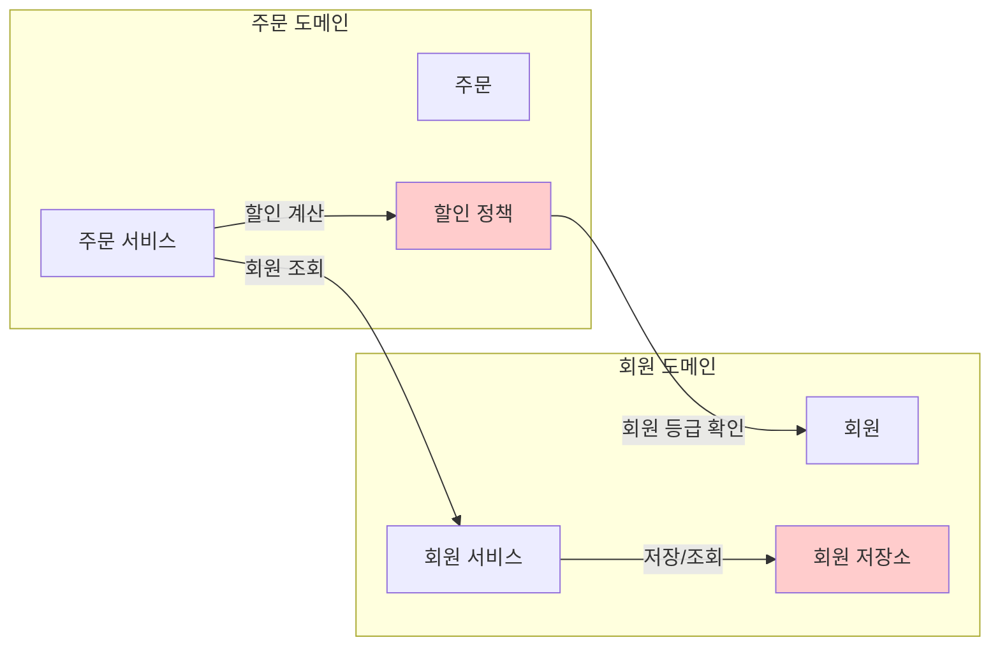
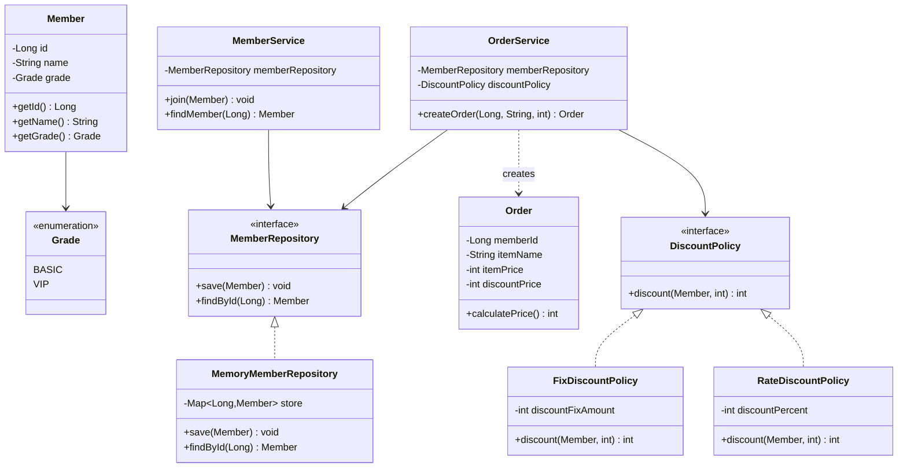
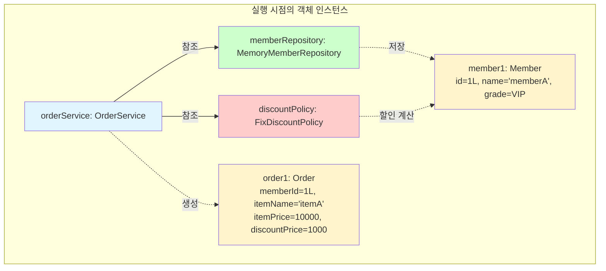
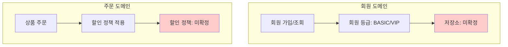
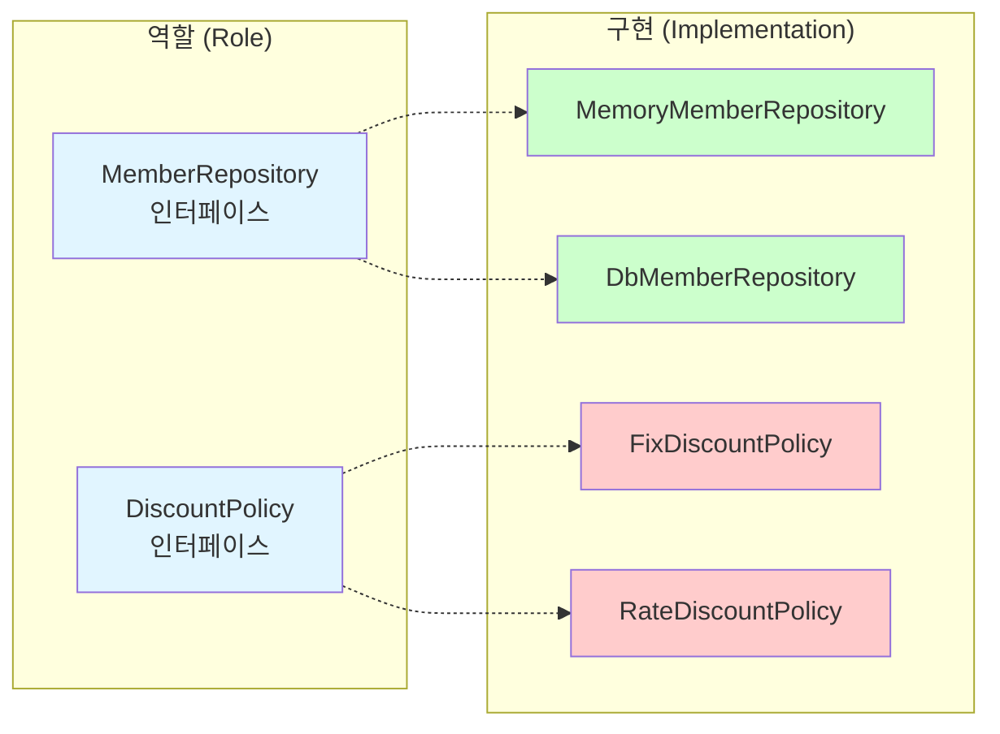
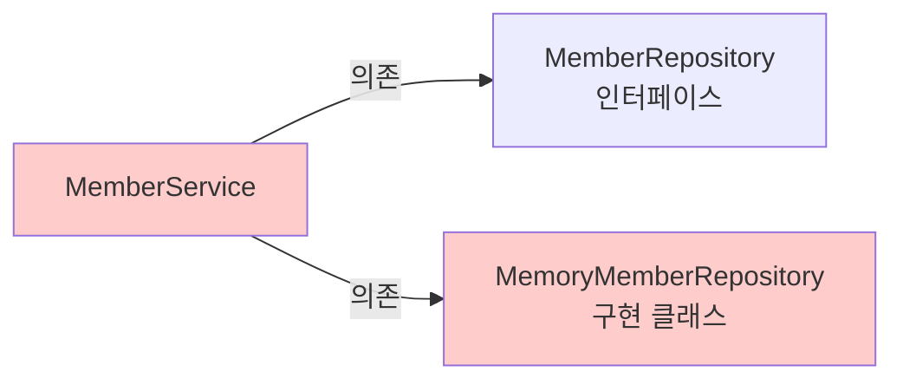
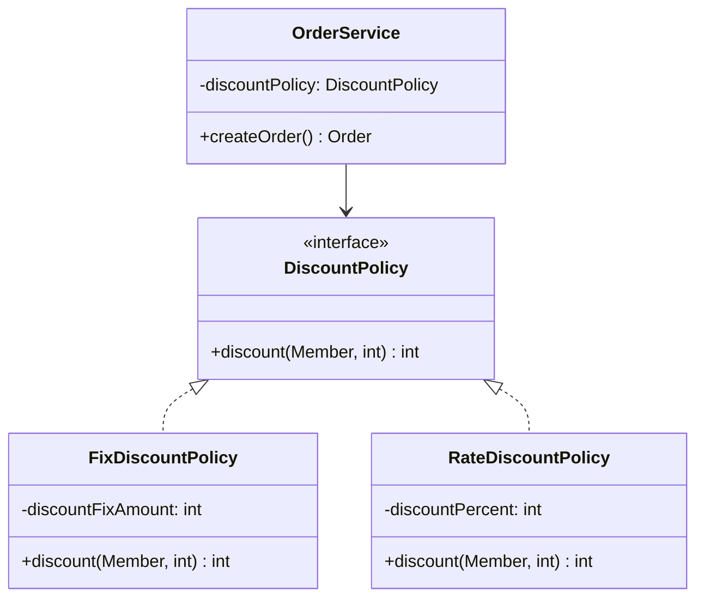

# 2-2. 비즈니스 요구사항과 설계

**출처**: 인프런 - 스프링 핵심 원리 기본편
**강의 시간**: 약 5분
**작성일**: 2025-01-23

---

## 📚 목차
1. [학습 목표](#학습-목표)
2. [연관 개념](#-연관-개념)
3. [비즈니스 요구사항](#비즈니스-요구사항)
4. [요구사항의 특징](#요구사항의-특징)
5. [설계 전략](#설계-전략)
6. [정리](#정리)
7. [면접 질문](#면접-질문)

---

## 학습 목표

이 챕터를 학습한 후 다음을 할 수 있습니다:
- [ ] 예제 프로젝트의 비즈니스 요구사항을 이해한다
- [ ] 불확실한 요구사항을 다루는 설계 전략을 이해한다
- [ ] 인터페이스를 사용한 유연한 설계의 필요성을 설명할 수 있다
- [ ] 역할과 구현을 분리하는 이유를 이해한다

---

## 🔗 연관 개념

- **선행 학습 권장**:
  - [2-1. 프로젝트 생성](./2-1-프로젝트생성.md)
  - [1-3. 좋은 객체 지향 프로그래밍이란?](./1-3-좋은객체지향프로그래밍이란.md)
  - [1-4. 좋은 객체 지향 설계의 5가지 원칙(SOLID)](./1-4-좋은객체지향설계의5가지원칙SOLID.md)

- **후속 학습**:
  - [2-3. 회원 도메인 설계](./2-3-회원도메인설계.md)
  - [2-6. 주문과 할인 도메인 설계](./2-6-주문과할인도메인설계.md)

- **관련 개념**:
  - 도메인 주도 설계(DDD)
  - 인터페이스와 다형성
  - OCP(개방-폐쇄 원칙)
  - DIP(의존관계 역전 원칙)

---

## 비즈니스 요구사항

> 📌 **TL;DR**
> - 회원: 가입, 조회, 일반/VIP 등급
> - 주문: 회원 등급별 할인 정책 적용
> - 할인: 정책이 아직 미확정 (변경 가능성 높음)

### 핵심 개념

온라인 쇼핑몰의 **회원 관리**와 **주문 및 할인 정책**을 구현하는 예제입니다.

### 상세 설명

#### 1. 회원 도메인 요구사항

**회원 기능**:
- 회원을 가입하고 조회할 수 있다

**회원 등급**:
- 회원은 **일반(BASIC)**과 **VIP** 두 가지 등급이 있다

**회원 데이터**:
- 회원 데이터는 자체 DB를 구축할 수 있고, 외부 시스템과 연동할 수 있다. **(미확정)**

#### 2. 주문과 할인 정책 요구사항

**주문 기능**:
- 회원은 상품을 주문할 수 있다

**할인 정책**:
- 회원 등급에 따라 할인 정책을 적용할 수 있다
- 할인 정책은 모든 VIP는 **1000원을 할인**해주는 고정 금액 할인을 적용해달라. **(나중에 변경 될 수 있다)**
- 할인 정책은 **변경 가능성이 높다**. 회사의 기본 할인 정책을 아직 정하지 못했고, 오픈 직전까지 고민을 미루고 싶다. 최악의 경우 할인을 적용하지 않을 수도 있다. **(미확정)**

### 다이어그램

#### 1. 도메인 협력 관계 (Domain Collaboration)

도메인 협력 관계는 **비즈니스 관점**에서 각 도메인이 어떻게 협력하는지 보여줍니다.



**협력 흐름**:
1. 주문 서비스가 주문을 처리하려면 회원 정보가 필요
2. 회원 서비스를 통해 회원을 조회
3. 할인 정책에 회원 등급을 전달하여 할인 금액 계산
4. 최종 주문 금액 확정

#### 2. 클래스 다이어그램 (Class Diagram)

클래스 다이어그램은 **설계 관점**에서 클래스 간의 관계를 보여줍니다.



**주요 관계**:
- `MemberService`는 `MemberRepository` **인터페이스에 의존**
- `OrderService`는 `DiscountPolicy` **인터페이스에 의존**
- 구현체(`MemoryMemberRepository`, `FixDiscountPolicy` 등)는 언제든 교체 가능
- 인터페이스를 통한 **느슨한 결합(Loose Coupling)** 구현

#### 3. 객체 다이어그램 (Object Diagram)

객체 다이어그램은 **런타임 관점**에서 실제 객체 간의 관계를 보여줍니다.



**실행 예시**:

```java
// 1. 객체 생성
MemberRepository memberRepository = new MemoryMemberRepository();
DiscountPolicy discountPolicy = new FixDiscountPolicy();
OrderService orderService = new OrderService(memberRepository, discountPolicy);

// 2. 회원 생성 및 저장
Member member = new Member(1L, "memberA", Grade.VIP);
memberRepository.save(member);

// 3. 주문 생성
Order order = orderService.createOrder(1L, "itemA", 10000);
// → member: id=1L, name='memberA', grade=VIP
// → order: memberId=1L, itemName='itemA', itemPrice=10000, discountPrice=1000
```

**객체 간 메시지 흐름**:
1. `orderService`가 `memberRepository`에 회원 조회 요청
2. `memberRepository`가 `member1` 객체 반환
3. `orderService`가 `discountPolicy`에 할인 계산 요청 (member1, 10000원)
4. `discountPolicy`가 1000원 할인 금액 반환
5. `orderService`가 `order1` 객체 생성 및 반환

#### 다이어그램 비교

| 다이어그램 | 관점 | 목적 | 표현 대상 |
|-----------|------|------|----------|
| **도메인 협력 관계** | 비즈니스 | 도메인 간 협력 이해 | 도메인 영역, 협력 흐름 |
| **클래스 다이어그램** | 설계 | 정적 구조 설계 | 클래스, 인터페이스, 관계 |
| **객체 다이어그램** | 런타임 | 실행 시 동작 이해 | 객체 인스턴스, 실제 값 |

#### 요구사항 요약



### 주요 포인트

- 회원은 가입/조회 가능
- 회원 등급: BASIC, VIP
- 회원 저장소: **미확정** ⚠️
- 할인 정책: **미확정** ⚠️
- 할인 정책은 **변경 가능성 높음**

---

## 요구사항의 특징

> 📌 **TL;DR**
> - 요구사항이 불확실하고 변경 가능성이 높음
> - 결정이 늦어진다고 개발을 미룰 수 없음
> - 유연한 설계가 필수

### 핵심 개념

**불확실성**이 높은 요구사항을 다루는 것이 실무의 현실입니다.

### 상세 설명

#### 1. 미확정 요소들

**회원 데이터 저장소**:
```
❓ 자체 DB를 구축할 것인가?
❓ 외부 시스템과 연동할 것인가?
❓ MySQL? MongoDB? Redis?
```

**할인 정책**:
```
❓ 고정 금액 할인? (예: 1000원)
❓ 정률 할인? (예: 10%)
❓ 복합 정책?
❓ 할인 없음?
```

#### 2. 실무에서의 문제

**일반적인 상황**:
1. 비즈니스 팀: "할인 정책을 좀 더 고민해보고 결정하겠습니다"
2. 개발 팀: "그럼 언제 결정되나요?"
3. 비즈니스 팀: "오픈 직전에..."
4. 개발 팀: "그럼 개발은 언제 시작하죠?"

**딜레마**:
- ❌ 정책 결정까지 기다리면 개발 일정 지연
- ❌ 잘못된 가정으로 개발하면 나중에 큰 수정 필요

#### 3. 해결 방법

**객체 지향 설계를 활용**:
```java
// 나쁜 설계: 구체 클래스에 의존
public class OrderService {
    private FixDiscountPolicy discountPolicy = new FixDiscountPolicy();
    // 정책 변경 시 코드 수정 필요!
}

// 좋은 설계: 인터페이스에 의존
public class OrderService {
    private DiscountPolicy discountPolicy;  // 인터페이스
    // 정책 변경 시 코드 수정 불필요!
}
```

### 예제: 저장소 변경 시나리오

**초기 구현**: 메모리 저장소
```java
public interface MemberRepository {
    void save(Member member);
    Member findById(Long memberId);
}

public class MemoryMemberRepository implements MemberRepository {
    private static Map<Long, Member> store = new HashMap<>();
    // 메모리에 저장
}
```

**나중에 변경**: DB 저장소
```java
public class DbMemberRepository implements MemberRepository {
    private DataSource dataSource;
    // DB에 저장
}
```

**서비스 코드는 변경 불필요**:
```java
public class MemberService {
    private final MemberRepository memberRepository;
    // 인터페이스만 의존 → 구현체 변경해도 OK!
}
```

### 💡 심화 내용

<details>
<summary>전략 패턴(Strategy Pattern) 더 알아보기</summary>

#### 전략 패턴

**정의**: 알고리즘을 정의하고, 각각을 캡슐화하여 교환 가능하게 만드는 패턴

**구조**:
```java
// 전략 인터페이스
public interface DiscountPolicy {
    int discount(Member member, int price);
}

// 구체적 전략 1
public class FixDiscountPolicy implements DiscountPolicy {
    private int discountFixAmount = 1000;

    @Override
    public int discount(Member member, int price) {
        if (member.getGrade() == Grade.VIP) {
            return discountFixAmount;
        }
        return 0;
    }
}

// 구체적 전략 2
public class RateDiscountPolicy implements DiscountPolicy {
    private int discountPercent = 10;

    @Override
    public int discount(Member member, int price) {
        if (member.getGrade() == Grade.VIP) {
            return price * discountPercent / 100;
        }
        return 0;
    }
}

// 컨텍스트 (전략 사용자)
public class OrderService {
    private final DiscountPolicy discountPolicy;

    public OrderService(DiscountPolicy discountPolicy) {
        this.discountPolicy = discountPolicy;
    }

    public Order createOrder(Long memberId, String itemName, int itemPrice) {
        // 전략 실행
        int discountPrice = discountPolicy.discount(member, itemPrice);
        return new Order(memberId, itemName, itemPrice, discountPrice);
    }
}
```

**사용**:
```java
// 고정 금액 할인 정책 사용
OrderService orderService1 = new OrderService(new FixDiscountPolicy());

// 정률 할인 정책 사용
OrderService orderService2 = new OrderService(new RateDiscountPolicy());

// 런타임에 전략 변경 가능!
```

**장점**:
- 알고리즘을 독립적으로 변경 가능
- OCP(개방-폐쇄 원칙) 준수
- 새로운 전략 추가 시 기존 코드 수정 불필요

**실무 활용**:
- 결제 수단 전략 (신용카드, 계좌이체, 간편결제)
- 정렬 알고리즘 전략
- 압축 알고리즘 전략
- 로깅 전략

</details>

<details>
<summary>도메인 주도 설계(DDD)와의 연관성</summary>

#### DDD의 핵심 개념

**유비쿼터스 언어(Ubiquitous Language)**:
- 개발자와 비즈니스 전문가가 공통으로 사용하는 언어
- 도메인 용어를 코드에 그대로 반영

**예제에서의 적용**:
```java
// 비즈니스 용어 그대로 사용
public enum Grade {
    BASIC,   // 비즈니스: "일반 회원"
    VIP      // 비즈니스: "VIP 회원"
}

public interface DiscountPolicy {
    // 비즈니스: "할인 정책"
    int discount(Member member, int price);
}

public class Order {
    // 비즈니스: "주문"
    private Long memberId;
    private String itemName;
    private int itemPrice;
    private int discountPrice;
}
```

**경계 컨텍스트(Bounded Context)**:
```
┌─────────────────────┐
│  회원 컨텍스트        │
│  - Member           │
│  - MemberService    │
│  - MemberRepository │
└─────────────────────┘

┌─────────────────────┐
│  주문 컨텍스트        │
│  - Order            │
│  - OrderService     │
│  - DiscountPolicy   │
└─────────────────────┘
```

**애그리거트(Aggregate)**:
- 연관된 객체들의 묶음
- 트랜잭션 일관성 경계

```java
// Order 애그리거트
public class Order {
    private Long memberId;      // 회원 참조
    private String itemName;
    private int itemPrice;
    private int discountPrice;

    // 애그리거트 내부 일관성 유지
    public int calculatePrice() {
        return itemPrice - discountPrice;
    }
}
```

**리포지토리(Repository)**:
```java
public interface MemberRepository {
    void save(Member member);
    Member findById(Long memberId);
    // 컬렉션처럼 사용
}
```

</details>

### 주요 포인트

- 요구사항은 항상 변경됨
- 변경에 유연한 설계가 필수
- 인터페이스로 역할과 구현을 분리
- 나중에 구현체만 교체 가능

### ⚠️ 주의사항

- 미확정 요소 때문에 개발을 미루면 안 됨
- 과도한 추상화는 오히려 복잡도 증가
- 실제로 변경이 일어날 때 리팩토링하는 것도 전략

---

## 설계 전략

> 📌 **TL;DR**
> - 인터페이스를 만들고 구현체를 언제든 교체 가능하게 설계
> - 역할(인터페이스)과 구현(구현 클래스) 분리
> - 객체 지향 설계 원칙(SOLID) 적용

### 핵심 개념

**"인터페이스를 만들고 구현체를 언제든지 갈아끼울 수 있도록 설계하면 된다"**

### 상세 설명

#### 1. 역할과 구현의 분리



#### 2. 설계 원칙 적용

**OCP (개방-폐쇄 원칙)**:
```java
// 확장에는 열려있고 (새로운 정책 추가 가능)
public class NoDiscountPolicy implements DiscountPolicy {
    @Override
    public int discount(Member member, int price) {
        return 0;  // 할인 없음
    }
}

// 변경에는 닫혀있음 (OrderService 코드 수정 불필요)
public class OrderService {
    private final DiscountPolicy discountPolicy;
    // 어떤 정책이 와도 동작함!
}
```

**DIP (의존관계 역전 원칙)**:
```java
// 나쁜 예: 구체 클래스에 의존
public class OrderService {
    private FixDiscountPolicy discountPolicy = new FixDiscountPolicy();
    // 구체 클래스에 직접 의존 → DIP 위반
}

// 좋은 예: 추상화에 의존
public class OrderService {
    private final DiscountPolicy discountPolicy;  // 인터페이스에 의존
    // 추상화에 의존 → DIP 준수
}
```

#### 3. 실무 적용 단계

**Step 1**: 요구사항 분석
```
회원 저장소가 필요하다
→ 하지만 어떤 저장소를 쓸지 미확정
```

**Step 2**: 인터페이스 정의
```java
public interface MemberRepository {
    void save(Member member);
    Member findById(Long memberId);
}
```

**Step 3**: 임시 구현체 작성
```java
public class MemoryMemberRepository implements MemberRepository {
    // 일단 메모리로 개발 시작
}
```

**Step 4**: 서비스는 인터페이스에만 의존
```java
public class MemberService {
    private final MemberRepository memberRepository;
    // 인터페이스만 의존!
}
```

**Step 5**: 나중에 구현체 교체
```java
// 정책 확정 후
public class JdbcMemberRepository implements MemberRepository {
    // DB로 변경
}
// MemberService 코드는 수정 불필요!
```

### 예제: 할인 정책 시나리오

**초기 요구사항**: VIP에게 1000원 고정 할인
```java
public class FixDiscountPolicy implements DiscountPolicy {
    private int discountFixAmount = 1000;

    @Override
    public int discount(Member member, int price) {
        if (member.getGrade() == Grade.VIP) {
            return discountFixAmount;
        }
        return 0;
    }
}
```

**변경 요구사항**: VIP에게 10% 정률 할인으로 변경
```java
public class RateDiscountPolicy implements DiscountPolicy {
    private int discountPercent = 10;

    @Override
    public int discount(Member member, int price) {
        if (member.getGrade() == Grade.VIP) {
            return price * discountPercent / 100;
        }
        return 0;
    }
}
```

**서비스 코드는 변경 불필요**:
```java
public class OrderService {
    private final DiscountPolicy discountPolicy;

    public OrderService(DiscountPolicy discountPolicy) {
        this.discountPolicy = discountPolicy;
    }

    public Order createOrder(Long memberId, String itemName, int itemPrice) {
        // 어떤 할인 정책이 와도 동일하게 동작
        Member member = memberRepository.findById(memberId);
        int discountPrice = discountPolicy.discount(member, itemPrice);
        return new Order(memberId, itemName, itemPrice, discountPrice);
    }
}
```

#### 4. 주의할 점

**문제 상황**: 구현 클래스 직접 생성
```java
public class MemberService {
    // 문제: 인터페이스와 구현 클래스 모두에 의존
    private final MemberRepository memberRepository = new MemoryMemberRepository();
}
```

**의존관계 다이어그램**:


**DIP 위반**:
- `MemberRepository` (추상화)에 의존
- `MemoryMemberRepository` (구체화)에도 의존

**해결책은?**
→ 다음 챕터에서 학습!

### 💡 Tip

- 처음부터 완벽한 설계는 불가능
- 인터페이스로 분리하면 나중에 변경 용이
- "지금 확정된 것"과 "나중에 변경될 것" 구분

### 주요 포인트

- 역할(인터페이스)과 구현(클래스) 분리
- 인터페이스에만 의존하도록 설계
- 구현체는 언제든 교체 가능
- OCP, DIP 원칙 준수

---

## 정리

> 📌 **TL;DR**
> - 불확실한 요구사항은 실무의 현실
> - 인터페이스로 유연한 설계 가능
> - 객체 지향 설계 원칙 활용

### 핵심 개념

**비즈니스 요구사항**:
- 회원: 가입, 조회, 등급(BASIC/VIP)
- 주문: 등급별 할인 정책
- 미확정: 저장소, 할인 정책

**설계 전략**:
- 인터페이스로 역할과 구현 분리
- 구현체를 언제든 교체 가능하게
- 객체 지향 원칙(OCP, DIP) 적용

### 주요 포인트

- 요구사항에 불확실성이 있어도 개발 가능
- 인터페이스 기반 설계로 변경에 유연
- 임시 구현체로 시작 → 나중에 교체
- 순수 자바로 먼저 개발 (스프링 없이)

---

## 전체 요약

- 예제 프로젝트는 회원 관리와 주문/할인 기능을 구현합니다
- 저장소와 할인 정책이 미확정 상태입니다 (실무의 현실)
- 인터페이스를 사용하여 구현체를 언제든 교체할 수 있게 설계합니다
- 객체 지향 설계 원칙(OCP, DIP)을 적용하여 유연한 설계를 만듭니다
- 우선 순수 자바로 개발하여 객체 지향 설계를 학습합니다

## 학습 체크리스트
- [ ] 회원 도메인 요구사항을 설명할 수 있다
- [ ] 주문과 할인 도메인 요구사항을 설명할 수 있다
- [ ] 미확정 요구사항을 다루는 설계 전략을 이해한다
- [ ] 인터페이스를 사용한 유연한 설계의 장점을 설명할 수 있다
- [ ] 역할과 구현을 분리하는 이유를 이해한다

## 다음 학습
다음 챕터에서는 "회원 도메인 설계"를 통해 실제로 역할과 구현을 분리하여 설계하는 방법을 학습합니다.

---

## 📚 참고자료

- [도메인 주도 설계(DDD) - Eric Evans](https://www.amazon.com/Domain-Driven-Design-Tackling-Complexity-Software/dp/0321125215)
- [클린 아키텍처 - Robert C. Martin](https://www.amazon.com/Clean-Architecture-Craftsmans-Software-Structure/dp/0134494164)
- [디자인 패턴 - GoF](https://www.amazon.com/Design-Patterns-Elements-Reusable-Object-Oriented/dp/0201633612)
- 객체지향의 사실과 오해 - 조영호 저

---

## 면접 질문

### 초급 개발자 (Junior)

**Q1. 인터페이스를 사용하는 이유를 설명해주세요.**

<details>
<summary>답안 보기</summary>

#### 답안

인터페이스를 사용하는 주요 이유는 **유연성**과 **확장성**입니다.

**1. 역할과 구현의 분리**:
```java
// 역할 정의 (무엇을 할 것인가)
public interface MemberRepository {
    void save(Member member);
    Member findById(Long memberId);
}

// 구현 (어떻게 할 것인가) - 메모리
public class MemoryMemberRepository implements MemberRepository {
    // 메모리에 저장
}

// 구현 (어떻게 할 것인가) - DB
public class DbMemberRepository implements MemberRepository {
    // DB에 저장
}
```

**2. 구현체 교체 가능**:
```java
public class MemberService {
    private final MemberRepository memberRepository;

    public MemberService(MemberRepository memberRepository) {
        this.memberRepository = memberRepository;
    }
    // 메모리든 DB든 동일하게 동작
}
```

**3. 테스트 용이성**:
```java
// 테스트용 Mock 객체
public class MockMemberRepository implements MemberRepository {
    @Override
    public void save(Member member) {
        // 테스트용 간단한 구현
    }
}

// 테스트 코드
@Test
void test() {
    MemberService service = new MemberService(new MockMemberRepository());
    // 실제 DB 없이 테스트 가능
}
```

**4. 다형성 활용**:
```java
MemberRepository repo1 = new MemoryMemberRepository();
MemberRepository repo2 = new DbMemberRepository();
// 동일한 인터페이스로 다양한 구현체 사용
```

**장점 요약**:
- 결합도 감소
- 확장성 증가
- 테스트 용이
- 변경에 유연

</details>

**Q2. OCP(개방-폐쇄 원칙)가 무엇인지 설명하고, 왜 중요한지 말해주세요.**

<details>
<summary>답안 보기</summary>

#### 답안

**OCP (Open-Closed Principle)**는 "소프트웨어는 **확장에는 열려있고, 변경에는 닫혀있어야** 한다"는 원칙입니다.

**의미**:
- **확장에 열려있다**: 새로운 기능을 추가할 수 있다
- **변경에 닫혀있다**: 기존 코드를 수정하지 않는다

**예시: 할인 정책**

**OCP 위반 (나쁜 예)**:
```java
public class OrderService {
    public int calculateDiscount(Member member, int price) {
        if (할인정책 == "고정금액") {
            return 1000;
        } else if (할인정책 == "정률") {
            return price * 10 / 100;
        } else if (할인정책 == "신규추가정책") {
            // 새 정책 추가 시 이 코드 수정 필요! ← 변경에 열려있음 (나쁨)
            return ...;
        }
    }
}
```

**OCP 준수 (좋은 예)**:
```java
// 인터페이스
public interface DiscountPolicy {
    int discount(Member member, int price);
}

// 기존 정책
public class FixDiscountPolicy implements DiscountPolicy {
    @Override
    public int discount(Member member, int price) {
        return 1000;
    }
}

// 새 정책 추가 (기존 코드 수정 없음)
public class RateDiscountPolicy implements DiscountPolicy {
    @Override
    public int discount(Member member, int price) {
        return price * 10 / 100;
    }
}

// OrderService는 수정 불필요!
public class OrderService {
    private final DiscountPolicy discountPolicy;

    public int calculateDiscount(Member member, int price) {
        return discountPolicy.discount(member, price);
        // 어떤 정책이 추가되어도 이 코드는 변경 없음 ← 변경에 닫혀있음 (좋음)
    }
}
```

**중요한 이유**:
1. **유지보수성**: 기존 코드 수정 최소화
2. **안정성**: 기존 기능 영향 없음
3. **확장성**: 새 기능 추가 용이
4. **테스트**: 기존 테스트 재사용

**실무 적용**:
- 새로운 결제 수단 추가
- 새로운 알림 방식 추가
- 새로운 파일 포맷 지원

</details>

---

### 중급 개발자 (Mid-Level)

**Q3. 전략 패턴(Strategy Pattern)과 이 예제의 할인 정책 설계가 어떻게 연관되는지 설명해주세요.**

<details>
<summary>답안 보기</summary>

#### 답안

예제의 할인 정책 설계는 **전략 패턴(Strategy Pattern)**을 구현한 것입니다.

**전략 패턴의 구성 요소**:

**1. Strategy (전략 인터페이스)**:
```java
public interface DiscountPolicy {
    int discount(Member member, int price);
}
```

**2. ConcreteStrategy (구체적 전략)**:
```java
// 전략 1: 고정 금액 할인
public class FixDiscountPolicy implements DiscountPolicy {
    private int discountFixAmount = 1000;

    @Override
    public int discount(Member member, int price) {
        if (member.getGrade() == Grade.VIP) {
            return discountFixAmount;
        }
        return 0;
    }
}

// 전략 2: 정률 할인
public class RateDiscountPolicy implements DiscountPolicy {
    private int discountPercent = 10;

    @Override
    public int discount(Member member, int price) {
        if (member.getGrade() == Grade.VIP) {
            return price * discountPercent / 100;
        }
        return 0;
    }
}

// 전략 3: 할인 없음
public class NoDiscountPolicy implements DiscountPolicy {
    @Override
    public int discount(Member member, int price) {
        return 0;
    }
}
```

**3. Context (전략 사용자)**:
```java
public class OrderService {
    private final DiscountPolicy discountPolicy;  // 전략 보유

    public OrderService(DiscountPolicy discountPolicy) {
        this.discountPolicy = discountPolicy;
    }

    public Order createOrder(Long memberId, String itemName, int itemPrice) {
        Member member = memberRepository.findById(memberId);

        // 전략 실행 (위임)
        int discountPrice = discountPolicy.discount(member, itemPrice);

        return new Order(memberId, itemName, itemPrice, discountPrice);
    }
}
```

**전략 패턴의 장점**:

**1. 런타임 전략 변경**:
```java
// 고정 금액 할인으로 주문 서비스 생성
OrderService orderService1 = new OrderService(new FixDiscountPolicy());

// 나중에 정률 할인으로 변경
OrderService orderService2 = new OrderService(new RateDiscountPolicy());

// 클라이언트가 전략 선택
DiscountPolicy policy = selectPolicy();  // 동적 선택
OrderService orderService3 = new OrderService(policy);
```

**2. 새로운 전략 추가 용이**:
```java
// 새로운 전략: VIP는 20% 할인, 일반 회원은 5% 할인
public class TieredDiscountPolicy implements DiscountPolicy {
    @Override
    public int discount(Member member, int price) {
        if (member.getGrade() == Grade.VIP) {
            return price * 20 / 100;
        } else {
            return price * 5 / 100;
        }
    }
}
// OrderService 코드 수정 불필요!
```

**3. 조건문 제거**:
```java
// 전략 패턴 사용 전 (나쁨)
public int calculateDiscount(...) {
    if (type.equals("FIX")) {
        return 1000;
    } else if (type.equals("RATE")) {
        return price * 0.1;
    } else if (type.equals("TIERED")) {
        // ...
    }
    // 새 정책 추가 시마다 if문 추가
}

// 전략 패턴 사용 후 (좋음)
public int calculateDiscount(...) {
    return discountPolicy.discount(member, price);
    // 조건문 없음, 전략만 실행
}
```

**UML 다이어그램**:


**실무 활용 사례**:
- **결제 전략**: 신용카드, 계좌이체, 간편결제
- **정렬 전략**: 가격순, 인기순, 최신순
- **압축 전략**: ZIP, RAR, TAR
- **로깅 전략**: File, Console, DB

**전략 패턴 vs if-else**:

| 비교 | if-else | 전략 패턴 |
|------|---------|----------|
| 확장성 | 낮음 (코드 수정) | 높음 (새 클래스 추가) |
| 테스트 | 어려움 | 쉬움 (전략별 독립) |
| 가독성 | 낮음 (복잡한 조건문) | 높음 (명확한 클래스명) |
| 유지보수 | 어려움 | 쉬움 |

</details>

**Q4. 실무에서 요구사항이 불확실할 때 어떻게 대응하는 것이 좋을까요?**

<details>
<summary>답안 보기</summary>

#### 답안

실무에서 요구사항 불확실성은 매우 흔하며, 다음과 같은 전략으로 대응합니다.

**1. 인터페이스 기반 설계**

**원칙**:
- 확실한 것: 인터페이스로 정의
- 불확실한 것: 구현체로 분리

**예시**:
```java
// 확실: "할인 정책이 필요하다"
public interface DiscountPolicy {
    int discount(Member member, int price);
}

// 불확실: "어떤 할인 정책?"
// → 임시 구현체로 시작
public class FixDiscountPolicy implements DiscountPolicy {
    // 일단 고정 금액으로 시작
}
```

**2. MVP (Minimum Viable Product) 접근**

**단계별 개발**:
```
1단계: 가장 간단한 구현
   → MemoryMemberRepository (메모리 저장소)

2단계: 정책 확정 시 교체
   → JdbcMemberRepository (DB 저장소)

3단계: 성능 최적화
   → CachedMemberRepository (캐시 추가)
```

**3. 피처 플래그(Feature Flag)**

```java
@Configuration
public class DiscountConfig {
    @Value("${discount.policy.type}")
    private String policyType;

    @Bean
    public DiscountPolicy discountPolicy() {
        if ("RATE".equals(policyType)) {
            return new RateDiscountPolicy();
        } else if ("FIX".equals(policyType)) {
            return new FixDiscountPolicy();
        }
        return new NoDiscountPolicy();  // 기본값
    }
}
```

**application.properties**:
```properties
# 개발 환경: 할인 없음
discount.policy.type=NONE

# 운영 환경: 정률 할인
discount.policy.type=RATE
```

**4. 어댑터 패턴 활용**

```java
// 외부 시스템이 확정되지 않음
public interface ExternalMemberSystem {
    Member getMember(Long id);
}

// 임시 구현
public class MockExternalSystem implements ExternalMemberSystem {
    @Override
    public Member getMember(Long id) {
        // 테스트용 더미 데이터
        return new Member(id, "testUser", Grade.BASIC);
    }
}

// 나중에 실제 시스템 연동
public class RealExternalSystemAdapter implements ExternalMemberSystem {
    private ExternalApiClient apiClient;

    @Override
    public Member getMember(Long id) {
        // 실제 API 호출
        return apiClient.fetchMember(id);
    }
}
```

**5. 문서화 및 커뮤니케이션**

**TODO 주석**:
```java
public class OrderService {
    private final DiscountPolicy discountPolicy;

    // TODO: 할인 정책 확정 후 변경 필요
    // 현재: 고정 금액 1000원
    // 예정: 정률 10% (확정 대기 중)
    public OrderService() {
        this.discountPolicy = new FixDiscountPolicy();
    }
}
```

**설계 문서**:
```markdown
## 불확실한 요구사항

### 회원 저장소
- 현재: MemoryMemberRepository (임시)
- 대안:
  - JdbcMemberRepository (자체 DB)
  - ApiMemberRepository (외부 시스템)
- 결정 예정일: 2024-03-01

### 할인 정책
- 현재: FixDiscountPolicy (VIP 1000원 할인)
- 대안:
  - RateDiscountPolicy (VIP 10% 할인)
  - TieredDiscountPolicy (등급별 차등 할인)
- 결정 예정일: 오픈 1주일 전
```

**6. 테스트 주도 개발(TDD)**

```java
// 인터페이스 기반 테스트
@Test
void VIP회원은_할인을_받는다() {
    // given
    Member vipMember = new Member(1L, "vip", Grade.VIP);
    DiscountPolicy policy = new FixDiscountPolicy();  // 구현체는 언제든 변경 가능

    // when
    int discount = policy.discount(vipMember, 10000);

    // then
    assertThat(discount).isGreaterThan(0);  // 구체적 금액은 확정 전
}
```

**7. 점진적 리팩토링**

```java
// Phase 1: 하드코딩 (빠른 개발)
public class OrderService {
    public int getDiscount() {
        return 1000;  // 일단 고정값
    }
}

// Phase 2: 조건문 (요구사항 파악)
public class OrderService {
    public int getDiscount(Member member) {
        if (member.getGrade() == Grade.VIP) {
            return 1000;
        }
        return 0;
    }
}

// Phase 3: 전략 패턴 (확장 가능한 설계)
public class OrderService {
    private final DiscountPolicy discountPolicy;
    // 인터페이스 기반 설계
}
```

**8. 실무 권장사항**

**DO**:
- ✅ 인터페이스로 역할 먼저 정의
- ✅ 가장 간단한 구현체로 시작
- ✅ 요구사항 변경 이력 문서화
- ✅ 정기적으로 비즈니스 팀과 동기화

**DON'T**:
- ❌ 완벽한 설계를 기다리며 개발 지연
- ❌ 추측으로 복잡한 구조 미리 구현
- ❌ 불확실한 부분 하드코딩
- ❌ 문서화 없이 임시 구현 방치

**핵심 원칙**:
> "YAGNI (You Aren't Gonna Need It)"
> - 지금 필요한 것만 구현
> - 미래를 위한 과도한 추상화 지양
> - 필요할 때 리팩토링

</details>

---

### 고급 개발자 (Senior)

**Q5. 도메인 주도 설계(DDD)의 관점에서 이 예제의 설계를 평가하고, 개선 방안을 제시해주세요.**

<details>
<summary>답안 보기</summary>

#### 답안

DDD 관점에서 예제를 분석하고 개선 방안을 제시하겠습니다.

**현재 설계 분석**:

**1. 유비쿼터스 언어 (Ubiquitous Language)**

**✅ 잘된 점**:
```java
public enum Grade {
    BASIC,  // "일반 회원" (비즈니스 용어)
    VIP     // "VIP 회원" (비즈니스 용어)
}

public interface DiscountPolicy {
    int discount(...);  // "할인 정책" (비즈니스 용어)
}

public class Order {  // "주문" (비즈니스 용어)
    private String itemName;    // "상품명"
    private int discountPrice;  // "할인 금액"
}
```

**2. 경계 컨텍스트 (Bounded Context)**

**현재 구조**:
```
[회원 컨텍스트]
- Member
- MemberService
- MemberRepository

[주문 컨텍스트]
- Order
- OrderService
- DiscountPolicy
```

**⚠️ 개선 필요**: 컨텍스트 간 의존관계가 명확하지 않음

**3. 애그리거트 (Aggregate)**

**현재**:
```java
public class Order {
    private Long memberId;      // 회원 ID만 참조
    private String itemName;
    private int itemPrice;
    private int discountPrice;
}
```

**⚠️ 문제점**:
- Order 내부 일관성 부족
- 비즈니스 로직이 서비스에 집중됨

**개선 방안**:

**1. 도메인 모델 강화**

**Before (빈약한 도메인 모델)**:
```java
public class Order {
    private Long memberId;
    private String itemName;
    private int itemPrice;
    private int discountPrice;

    // getter, setter만 존재
    // 비즈니스 로직 없음 → 빈약한 도메인 모델
}

// 비즈니스 로직이 서비스에 집중됨
public class OrderService {
    public Order createOrder(Long memberId, String itemName, int itemPrice) {
        Member member = memberRepository.findById(memberId);
        int discountPrice = discountPolicy.discount(member, itemPrice);

        // 계산 로직이 서비스에 있음
        return new Order(memberId, itemName, itemPrice, discountPrice);
    }
}
```

**After (풍부한 도메인 모델)**:
```java
public class Order {
    private OrderId id;                    // 값 객체
    private MemberId memberId;             // 값 객체
    private OrderLine orderLine;           // 주문 항목 (값 객체)
    private Money discountAmount;          // 값 객체
    private OrderStatus status;            // 주문 상태

    // 정적 팩토리 메서드
    public static Order create(MemberId memberId,
                               OrderLine orderLine,
                               DiscountPolicy discountPolicy) {
        Money totalPrice = orderLine.getPrice();
        Money discountAmount = discountPolicy.calculate(memberId, totalPrice);

        return new Order(
            OrderId.generate(),
            memberId,
            orderLine,
            discountAmount,
            OrderStatus.CREATED
        );
    }

    // 비즈니스 로직이 도메인 객체에 있음
    public Money calculateFinalPrice() {
        return orderLine.getPrice().subtract(discountAmount);
    }

    public void cancel() {
        if (status == OrderStatus.SHIPPED) {
            throw new IllegalStateException("배송 완료된 주문은 취소할 수 없습니다");
        }
        this.status = OrderStatus.CANCELED;
    }

    // 불변성 보장
    private Order(OrderId id, MemberId memberId,
                  OrderLine orderLine, Money discountAmount,
                  OrderStatus status) {
        this.id = Objects.requireNonNull(id);
        this.memberId = Objects.requireNonNull(memberId);
        this.orderLine = Objects.requireNonNull(orderLine);
        this.discountAmount = Objects.requireNonNull(discountAmount);
        this.status = status;
    }
}
```

**2. 값 객체 (Value Object) 도입**

```java
// Money 값 객체
public class Money {
    private final int amount;

    private Money(int amount) {
        if (amount < 0) {
            throw new IllegalArgumentException("금액은 음수일 수 없습니다");
        }
        this.amount = amount;
    }

    public static Money of(int amount) {
        return new Money(amount);
    }

    public Money subtract(Money other) {
        return new Money(this.amount - other.amount);
    }

    public Money multiply(double rate) {
        return new Money((int) (this.amount * rate));
    }

    // 값 객체는 불변
    @Override
    public boolean equals(Object o) {
        if (this == o) return true;
        if (!(o instanceof Money)) return false;
        Money money = (Money) o;
        return amount == money.amount;
    }

    @Override
    public int hashCode() {
        return Objects.hash(amount);
    }
}

// OrderLine 값 객체
public class OrderLine {
    private final String itemName;
    private final Money price;
    private final int quantity;

    public OrderLine(String itemName, Money price, int quantity) {
        this.itemName = Objects.requireNonNull(itemName);
        this.price = Objects.requireNonNull(price);

        if (quantity <= 0) {
            throw new IllegalArgumentException("수량은 1 이상이어야 합니다");
        }
        this.quantity = quantity;
    }

    public Money getTotalPrice() {
        return price.multiply(quantity);
    }
}
```

**3. 도메인 서비스 분리**

```java
// 도메인 서비스: 여러 애그리거트를 조율
public class OrderDomainService {
    public Order createOrder(Member member,
                             OrderLine orderLine,
                             DiscountPolicy discountPolicy) {
        // 도메인 로직
        Money discountAmount = discountPolicy.calculate(
            member.getId(),
            orderLine.getTotalPrice()
        );

        return Order.create(
            member.getId(),
            orderLine,
            discountAmount
        );
    }
}

// 응용 서비스: 트랜잭션, 인프라 조율
@Service
@Transactional
public class OrderApplicationService {
    private final MemberRepository memberRepository;
    private final OrderRepository orderRepository;
    private final OrderDomainService orderDomainService;
    private final DiscountPolicy discountPolicy;

    public OrderId createOrder(CreateOrderCommand command) {
        // 1. 애그리거트 조회
        Member member = memberRepository.findById(command.getMemberId())
            .orElseThrow(() -> new MemberNotFoundException());

        // 2. 도메인 서비스 호출
        Order order = orderDomainService.createOrder(
            member,
            new OrderLine(command.getItemName(),
                         Money.of(command.getPrice()),
                         command.getQuantity()),
            discountPolicy
        );

        // 3. 저장
        orderRepository.save(order);

        // 4. 이벤트 발행 (선택사항)
        domainEventPublisher.publish(new OrderCreatedEvent(order.getId()));

        return order.getId();
    }
}
```

**4. 리포지토리 인터페이스 개선**

```java
// Before
public interface MemberRepository {
    void save(Member member);
    Member findById(Long memberId);
}

// After
public interface MemberRepository {
    void save(Member member);
    Optional<Member> findById(MemberId memberId);  // 값 객체 사용
    Optional<Member> findByEmail(Email email);
    List<Member> findByGrade(Grade grade);
    boolean existsByEmail(Email email);
}

// 구현체는 인프라 계층
@Repository
public class JpaMemberRepository implements MemberRepository {
    @PersistenceContext
    private EntityManager em;

    @Override
    public void save(Member member) {
        em.persist(member);
    }

    @Override
    public Optional<Member> findById(MemberId memberId) {
        Member member = em.find(Member.class, memberId.getValue());
        return Optional.ofNullable(member);
    }
}
```

**5. 계층 구조 명확화**

```
┌─────────────────────────────────────┐
│  Presentation Layer                 │
│  - Controller (REST API)            │
└─────────────────────────────────────┘
             ↓
┌─────────────────────────────────────┐
│  Application Layer                  │
│  - ApplicationService               │
│  - Command/Query                    │
│  - DTO                              │
└─────────────────────────────────────┘
             ↓
┌─────────────────────────────────────┐
│  Domain Layer ⭐                     │
│  - Aggregate (Order, Member)        │
│  - Value Object (Money, OrderLine)  │
│  - Domain Service                   │
│  - Domain Event                     │
│  - Repository Interface             │
└─────────────────────────────────────┘
             ↓
┌─────────────────────────────────────┐
│  Infrastructure Layer               │
│  - Repository Implementation        │
│  - External API Client              │
│  - Message Queue                    │
└─────────────────────────────────────┘
```

**6. 도메인 이벤트 도입**

```java
// 도메인 이벤트
public class OrderCreatedEvent {
    private final OrderId orderId;
    private final MemberId memberId;
    private final LocalDateTime occurredOn;

    public OrderCreatedEvent(OrderId orderId, MemberId memberId) {
        this.orderId = orderId;
        this.memberId = memberId;
        this.occurredOn = LocalDateTime.now();
    }
}

// 애그리거트에서 이벤트 발행
public class Order {
    private List<DomainEvent> domainEvents = new ArrayList<>();

    public static Order create(...) {
        Order order = new Order(...);
        order.addDomainEvent(new OrderCreatedEvent(order.getId(), order.getMemberId()));
        return order;
    }

    private void addDomainEvent(DomainEvent event) {
        this.domainEvents.add(event);
    }

    public List<DomainEvent> getDomainEvents() {
        return Collections.unmodifiableList(domainEvents);
    }

    public void clearDomainEvents() {
        this.domainEvents.clear();
    }
}
```

**7. 패키지 구조**

```
com.example.order
├── domain
│   ├── model
│   │   ├── order
│   │   │   ├── Order.java           (애그리거트 루트)
│   │   │   ├── OrderId.java         (값 객체)
│   │   │   ├── OrderLine.java       (값 객체)
│   │   │   ├── OrderStatus.java     (Enum)
│   │   │   └── OrderRepository.java (인터페이스)
│   │   ├── member
│   │   │   ├── Member.java
│   │   │   ├── MemberId.java
│   │   │   ├── Grade.java
│   │   │   └── MemberRepository.java
│   │   └── shared
│   │       └── Money.java           (공유 값 객체)
│   └── service
│       └── OrderDomainService.java  (도메인 서비스)
├── application
│   ├── service
│   │   └── OrderApplicationService.java
│   └── dto
│       ├── CreateOrderCommand.java
│       └── OrderResponse.java
└── infrastructure
    ├── persistence
    │   ├── JpaOrderRepository.java
    │   └── JpaMemberRepository.java
    └── external
        └── ExternalApiClient.java
```

**8. 최종 비교**

| 항목 | Before | After (DDD) |
|------|--------|-------------|
| 도메인 모델 | 빈약함 | 풍부함 |
| 비즈니스 로직 | 서비스에 집중 | 도메인 객체에 분산 |
| 값 객체 | 원시 타입 사용 | Money, OrderLine 등 |
| 불변성 | 보장 안됨 | 보장됨 |
| 계층 분리 | 불명확 | 명확 (Domain, Application) |
| 이벤트 | 없음 | 도메인 이벤트 |

**핵심 개선 효과**:
1. **비즈니스 로직 집중**: 도메인 객체에 로직 위치
2. **불변성 보장**: 값 객체로 안정성 향상
3. **명확한 책임**: 도메인 서비스 vs 응용 서비스
4. **확장성**: 이벤트 기반으로 느슨한 결합

</details>

---

## 네비게이션

⬅️ [이전: 2-1. 프로젝트 생성](./2-1-프로젝트생성.md)
➡️ [다음: 2-3. 회원 도메인 설계](./2-3-회원도메인설계.md)

---

**작성 완료일**: 2025-01-23
**문서 버전**: 1.0
