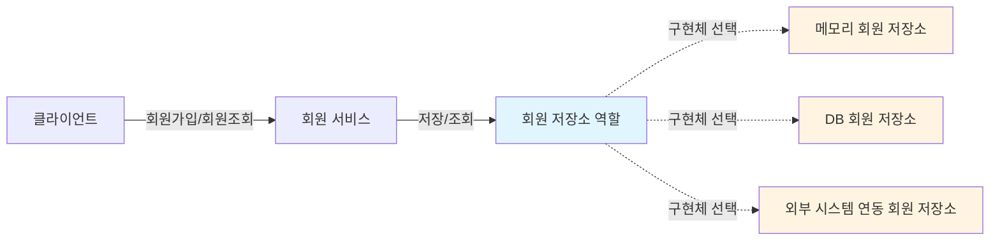
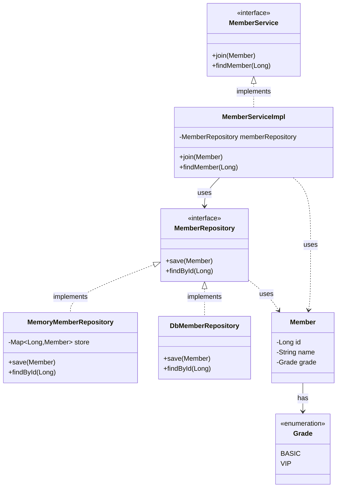
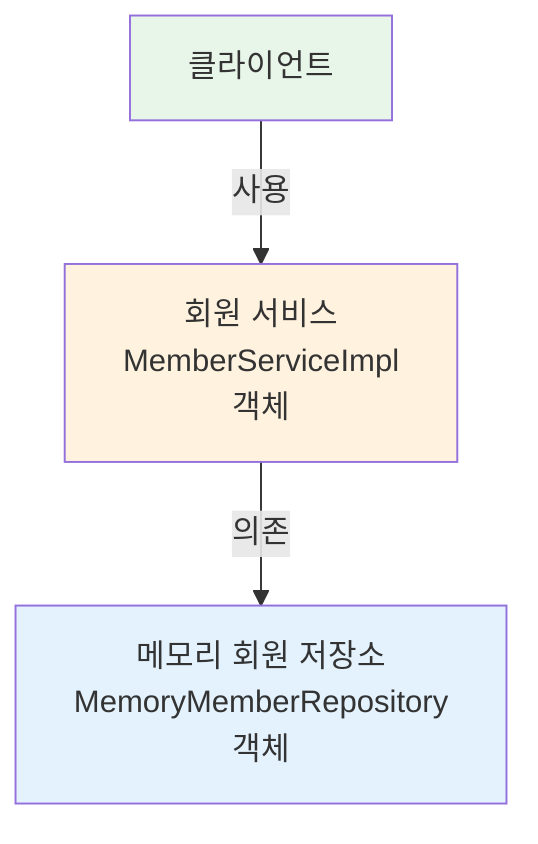

# 2-3. 회원 도메인 설계

## 학습 목표
- 회원 도메인의 요구사항을 분석하고 설계 방법을 이해한다
- 협력 관계, 클래스 다이어그램, 객체 다이어그램의 차이를 이해한다
- 인터페이스 기반 설계를 통한 유연한 구조를 학습한다
- 역할과 구현을 분리하는 객체지향 설계 원칙을 적용한다

## 연관 개념
- **협력 관계 다이어그램**: 기획자도 볼 수 있는 도메인 협력 관계 (역할 중심)
- **클래스 다이어그램**: 개발자가 구체화한 설계 다이어그램 (정적 구조)
- **객체 다이어그램**: 실제 런타임에 생성된 객체 인스턴스 간의 관계 (동적 구조)
- **인터페이스 분리**: 구현체 변경 가능성에 대비한 설계 전략

---

## TL;DR (간단 요약)

### 회원 도메인 요구사항
- 회원 가입 및 조회 기능
- 회원 등급: BASIC, VIP
- 회원 저장소: 자체 DB 또는 외부 시스템 연동 (미확정)

### 설계 전략
인터페이스를 도입하여 구현체를 쉽게 교체할 수 있도록 설계:
- `MemberService` 인터페이스 → `MemberServiceImpl` 구현체
- `MemberRepository` 인터페이스 → `MemoryMemberRepository`, `DbMemberRepository` 등 구현체

### 3단계 다이어그램
1. **협력 관계**: 클라이언트 → 회원 서비스 → 회원 저장소
2. **클래스 다이어그램**: 인터페이스와 구현 클래스의 관계
3. **객체 다이어그램**: 실제 메모리에 생성된 객체 인스턴스

---

## 회원 도메인 요구사항

### 기능 요구사항
```
1. 회원을 가입하고 조회할 수 있다
2. 회원은 일반과 VIP 두 가지 등급이 있다
3. 회원 데이터는 자체 DB를 구축할 수 있고, 외부 시스템과 연동할 수 있다 (미확정)
```

### 불확실성 대응
요구사항 중 **회원 저장소**가 아직 확정되지 않았지만, 개발은 진행해야 하는 상황입니다.

> **해결책**: 인터페이스를 만들고 구현체를 언제든지 갈아끼울 수 있도록 설계

---

## 회원 도메인 협력 관계



### 협력 관계 설명
- **클라이언트**: 회원 서비스를 사용하는 주체 (웹 컨트롤러, 테스트 등)
- **회원 서비스**: 회원 가입과 조회 기능을 제공하는 비즈니스 로직
- **회원 저장소 역할**: 추상화된 저장소 인터페이스
- **구현체들**: 실제 저장소 구현 (메모리, DB, 외부 시스템)

### 특징
- 기획자도 이해할 수 있는 수준의 다이어그램
- **역할** 중심으로 표현 (구체적인 클래스명 X)
- 요구사항의 불확실성을 인터페이스로 해결

---

## 회원 클래스 다이어그램



### 클래스 다이어그램 설명

#### 인터페이스
- **MemberService**: 회원 서비스의 역할 정의
  - `join()`: 회원 가입
  - `findMember()`: 회원 조회

- **MemberRepository**: 회원 저장소의 역할 정의
  - `save()`: 회원 저장
  - `findById()`: ID로 회원 조회

#### 구현체
- **MemberServiceImpl**: 회원 서비스 구현 클래스
  - MemberRepository에 의존 (의존성 주입 필요)

- **MemoryMemberRepository**: 메모리 기반 저장소 (개발 초기용)
- **DbMemberRepository**: 데이터베이스 기반 저장소 (추후 구현)

#### 엔티티
- **Member**: 회원 엔티티 (id, name, grade)
- **Grade**: 회원 등급 열거형 (BASIC, VIP)

### 설계의 핵심
```
인터페이스를 통한 역할과 구현의 분리
→ 구현체를 자유롭게 변경 가능
→ OCP(개방-폐쇄 원칙) 준수
```

---

## 회원 객체 다이어그램



### 객체 다이어그램의 의미

#### 런타임 관점
- **회원 서비스 객체**: `new MemberServiceImpl()` 로 생성된 인스턴스
- **메모리 회원 저장소 객체**: `new MemoryMemberRepository()` 로 생성된 인스턴스
- 실제 JVM 메모리에 올라간 객체들의 관계

#### 클래스 다이어그램과의 차이
| 구분 | 클래스 다이어그램 | 객체 다이어그램 |
|------|------------------|----------------|
| 관점 | 정적 설계 | 동적 실행 |
| 내용 | 클래스 구조와 관계 | 실제 인스턴스 관계 |
| 시점 | 컴파일 타임 | 런타임 |
| 표현 | 모든 가능성 표현 | 특정 시점의 객체 상태 |

---

## 심화 내용

### 1. 역할과 구현의 분리

#### 왜 인터페이스를 사용하는가?

```java
// ❌ 나쁜 예: 직접 구현체에 의존
public class MemberServiceImpl {
    private MemoryMemberRepository memberRepository = new MemoryMemberRepository();
    // DB로 변경하려면 코드 수정 필요
}

// ✅ 좋은 예: 인터페이스에 의존
public class MemberServiceImpl implements MemberService {
    private MemberRepository memberRepository;
    // 생성자나 setter로 주입받으면 구현체 변경 용이
}
```

#### 인터페이스 설계의 장점
1. **유연성**: 구현체를 자유롭게 교체 가능
2. **테스트 용이성**: Mock 객체로 대체 가능
3. **병렬 개발**: 인터페이스만 정의하면 각자 구현 가능
4. **변경에 닫혀있음**: 클라이언트 코드 수정 없이 구현체 변경

### 2. 다이어그램별 사용 목적

#### 협력 관계 다이어그램
```
사용 시점: 요구사항 분석 단계
대상: 기획자, 도메인 전문가, 개발자
목적: 비즈니스 흐름과 역할 파악
수준: 추상적, 개념적
```

#### 클래스 다이어그램
```
사용 시점: 설계 단계
대상: 개발자
목적: 구현할 클래스와 인터페이스 정의
수준: 구체적, 기술적
```

#### 객체 다이어그램
```
사용 시점: 구현/디버깅 단계
대상: 개발자
목적: 실제 객체 생성과 의존관계 확인
수준: 매우 구체적, 런타임 중심
```

---

## Tip

### 설계 순서
1. **도메인 협력 관계** 먼저 그리기 (비즈니스 관점)
2. **클래스 다이어그램** 작성 (개발 관점)
3. **객체 다이어그램** 으로 검증 (실행 관점)

### 인터페이스 네이밍
- Repository 인터페이스: `MemberRepository`
- Repository 구현체: `MemoryMemberRepository`, `DbMemberRepository`
- Service 인터페이스: `MemberService`
- Service 구현체: `MemberServiceImpl` (Impl 접미사 사용)

### 도메인 엔티티 설계
```java
// 도메인 엔티티는 순수한 비즈니스 로직만 포함
public class Member {
    private Long id;
    private String name;
    private Grade grade;

    // 비즈니스 로직 메서드 추가 가능
    public boolean isVip() {
        return this.grade == Grade.VIP;
    }
}
```

---

## 주의사항

### 1. 과도한 인터페이스 사용 지양
- 변경 가능성이 없는 곳에 무분별한 인터페이스 사용은 복잡도만 증가
- 실제 변경이 필요하거나 다형성이 필요한 곳에만 인터페이스 도입

### 2. 현재 설계의 문제점 (스포일러)
```java
public class MemberServiceImpl implements MemberService {
    // ⚠️ 문제: 인터페이스와 구현체 모두에 의존
    private final MemberRepository memberRepository = new MemoryMemberRepository();
    // DIP(의존관계 역전 원칙) 위반!
}
```
→ 주문 도메인 설계 후 다시 다룰 예정

### 3. 다이어그램은 수단일 뿐
- 다이어그램 자체가 목적이 아님
- 커뮤니케이션 도구로 활용
- 코드와 다이어그램의 동기화 유지 노력

---

## 면접 질문

### 초급 - 개념 이해

**Q1. 회원 도메인 설계에서 인터페이스를 사용한 이유는 무엇인가요?**

A: 회원 저장소의 구현 방식이 아직 확정되지 않았기 때문입니다. MemberRepository 인터페이스를 만들고 MemoryMemberRepository, DbMemberRepository 등 다양한 구현체로 교체할 수 있도록 설계했습니다. 이렇게 하면 나중에 저장소 방식이 변경되어도 MemberService의 코드를 수정하지 않아도 됩니다.

**Q2. 클래스 다이어그램과 객체 다이어그램의 차이는 무엇인가요?**

A: 클래스 다이어그램은 정적인 설계 구조를 나타내며, 클래스 간의 관계와 가능한 모든 구현체를 표현합니다. 반면 객체 다이어그램은 런타임에 실제로 생성된 객체 인스턴스들의 관계를 보여줍니다. 예를 들어 클래스 다이어그램에는 MemoryMemberRepository와 DbMemberRepository가 모두 표현되지만, 객체 다이어그램에는 실제 사용 중인 MemoryMemberRepository 인스턴스만 표현됩니다.

### 중급 - 설계 원칙

**Q3. 현재 회원 도메인 설계가 DIP를 위반하는 이유를 설명하고, 어떻게 개선할 수 있나요?**

A: MemberServiceImpl에서 `private final MemberRepository memberRepository = new MemoryMemberRepository();` 처럼 구현하면, MemberRepository 인터페이스뿐만 아니라 MemoryMemberRepository 구현체에도 직접 의존하게 됩니다. 이는 DIP(의존관계 역전 원칙)를 위반합니다.

개선 방법은 생성자 주입을 사용하는 것입니다:
```java
public class MemberServiceImpl implements MemberService {
    private final MemberRepository memberRepository;

    // 생성자로 주입받기 (외부에서 결정)
    public MemberServiceImpl(MemberRepository memberRepository) {
        this.memberRepository = memberRepository;
    }
}
```
이렇게 하면 MemberServiceImpl은 인터페이스에만 의존하고, 실제 구현체는 외부에서 주입받게 됩니다.

**Q4. 회원 서비스 설계에서 인터페이스를 두는 것과 두지 않는 것의 장단점을 비교해주세요.**

A:
**인터페이스를 사용하는 경우:**
- 장점: 구현체 교체 용이, 테스트 시 Mock 객체 사용 가능, OCP 준수, 다형성 활용
- 단점: 클래스 수 증가로 인한 복잡도 증가, 초기 설계 비용 상승

**인터페이스를 사용하지 않는 경우:**
- 장점: 구조가 단순하고 직관적, 개발 속도 빠름
- 단점: 구현체 변경 시 클라이언트 코드 수정 필요, 테스트 어려움, 확장성 부족

일반적으로 변경 가능성이 있는 저장소나 외부 시스템 연동 부분에는 인터페이스를 사용하고, 단순한 유틸리티성 클래스에는 구체 클래스만 사용하는 것이 좋습니다.

### 고급 - 아키텍처 설계

**Q5. 회원 도메인을 헥사고날 아키텍처(Hexagonal Architecture)로 재설계한다면 어떻게 구성하시겠습니까?**

A: 헥사고날 아키텍처는 포트와 어댑터 패턴으로도 불리며, 비즈니스 로직을 외부 의존성으로부터 완전히 분리하는 아키텍처입니다.

#### 재설계 구조

```
[Domain Core - 비즈니스 로직]
├─ Member (엔티티)
├─ Grade (값 객체)
└─ MemberService (도메인 서비스)

[Port - 인터페이스]
├─ Inbound Port (유스케이스)
│  └─ MemberUseCase
│     ├─ registerMember()
│     └─ findMember()
│
└─ Outbound Port (저장소 인터페이스)
   └─ MemberPort
      ├─ save()
      └─ findById()

[Adapter - 구현체]
├─ Inbound Adapter (외부에서 들어오는 요청)
│  ├─ MemberController (Web)
│  ├─ MemberCLI (Console)
│  └─ MemberMessageListener (Message Queue)
│
└─ Outbound Adapter (외부로 나가는 요청)
   ├─ MemoryMemberAdapter
   ├─ JpaMemberAdapter
   └─ RedisMemberAdapter
```

#### 코드 예시

```java
// Domain Core
public class Member {
    private final MemberId id;
    private final MemberName name;
    private final Grade grade;

    // 비즈니스 로직만 포함
    public boolean isEligibleForDiscount() {
        return grade.isVip();
    }
}

// Inbound Port (유스케이스)
public interface MemberUseCase {
    MemberId registerMember(RegisterMemberCommand command);
    MemberInfo findMember(MemberId memberId);
}

// Outbound Port
public interface MemberPort {
    void save(Member member);
    Optional<Member> findById(MemberId memberId);
}

// Inbound Adapter
@RestController
public class MemberController {
    private final MemberUseCase memberUseCase;

    @PostMapping("/members")
    public ResponseEntity<MemberResponse> register(@RequestBody RegisterRequest request) {
        var command = new RegisterMemberCommand(request.getName(), request.getGrade());
        var memberId = memberUseCase.registerMember(command);
        return ResponseEntity.ok(new MemberResponse(memberId));
    }
}

// Outbound Adapter
@Repository
public class JpaMemberAdapter implements MemberPort {
    private final MemberJpaRepository jpaRepository;

    @Override
    public void save(Member member) {
        var entity = MemberEntity.from(member);
        jpaRepository.save(entity);
    }

    @Override
    public Optional<Member> findById(MemberId memberId) {
        return jpaRepository.findById(memberId.getValue())
            .map(MemberEntity::toDomain);
    }
}
```

#### 헥사고날 아키텍처의 장점
1. **비즈니스 로직의 독립성**: 프레임워크나 DB에 의존하지 않음
2. **테스트 용이성**: 포트만 모킹하면 도메인 로직 테스트 가능
3. **유연한 확장**: 새로운 어댑터 추가만으로 기능 확장
4. **명확한 의존성 방향**: 항상 외부에서 내부로 (어댑터 → 포트 → 도메인)

#### 현재 설계와의 차이점
- 현재: Service가 비즈니스 로직과 저장소 호출을 모두 담당
- 헥사고날: 도메인 로직(Core), 포트(인터페이스), 어댑터(구현)를 명확히 분리
- 현재: Repository 인터페이스가 도메인과 같은 레이어
- 헥사고날: Port와 Adapter가 명확히 분리되어 의존성 방향이 단방향

#### 적용 시 고려사항
- 소규모 프로젝트에서는 과도한 설계일 수 있음
- 도메인 복잡도가 높고 장기 유지보수가 필요한 프로젝트에 적합
- 초기 러닝커브가 있지만 장기적으로 유지보수 비용 절감

---

## 전체 요약

회원 도메인 설계는 **인터페이스 기반 설계**를 통해 요구사항의 불확실성에 대응합니다.

### 핵심 포인트
1. **협력 관계 다이어그램**: 기획자와 소통하기 위한 역할 중심 다이어그램
2. **클래스 다이어그램**: 실제 구현할 인터페이스와 클래스 설계
3. **객체 다이어그램**: 런타임에 생성된 실제 객체들의 관계

### 설계 전략
- MemberService와 MemberRepository를 인터페이스로 정의
- 구현체는 쉽게 교체 가능하도록 분리
- 역할과 구현을 나누어 OCP 준수

### 아직 해결되지 않은 문제
현재 설계는 구현체를 직접 생성하므로 DIP를 위반합니다. 이는 다음 섹션에서 Spring의 DI(의존성 주입)를 통해 해결할 예정입니다.

---

## 학습 체크리스트
- [ ] 회원 도메인의 요구사항을 설명할 수 있다
- [ ] 협력 관계, 클래스, 객체 다이어그램의 차이를 이해했다
- [ ] 왜 인터페이스를 사용하는지 설명할 수 있다
- [ ] 역할과 구현의 분리가 주는 이점을 이해했다
- [ ] 현재 설계의 DIP 위반 문제를 인식했다

---

## 다음 학습
다음 섹션에서는 설계한 회원 도메인을 **실제 코드로 구현**합니다.
- Member 엔티티 작성
- MemberRepository 인터페이스와 MemoryMemberRepository 구현
- MemberService 인터페이스와 MemberServiceImpl 구현

**[2-4. 회원 도메인 개발](2-4-회원도메인개발.md)** 에서 계속됩니다.

---

## 📚 참고자료
- [UML 클래스 다이어그램 작성법](https://www.uml-diagrams.org/class-diagrams-overview.html)
- [객체지향의 사실과 오해 - 조영호](http://www.yes24.com/Product/Goods/18249021) - 역할, 책임, 협력 개념
- [Clean Architecture - Robert C. Martin](http://www.yes24.com/Product/Goods/77283734) - 의존성 규칙과 경계
- [도메인 주도 설계 - 에릭 에반스](http://www.yes24.com/Product/Goods/5312881) - 도메인 모델링
- [Hexagonal Architecture - Alistair Cockburn](https://alistair.cockburn.us/hexagonal-architecture/)
