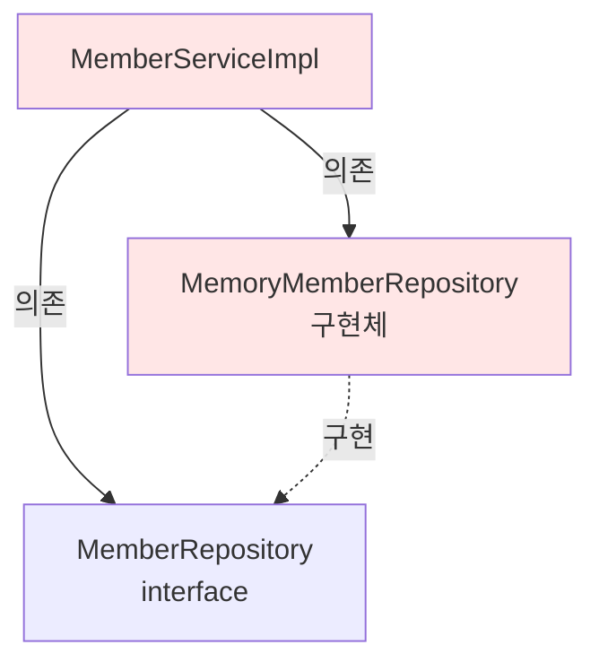
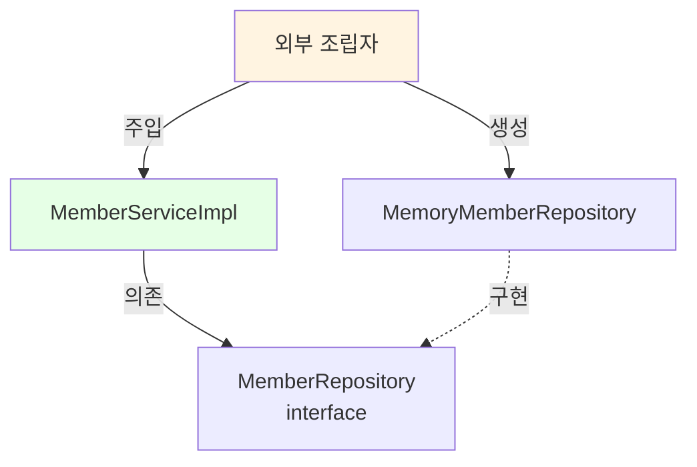

# 2-4. 회원 도메인 개발

## 학습 목표
- 회원 도메인의 실제 구현 코드를 작성한다
- 엔티티, 리포지토리, 서비스의 역할을 이해한다
- 인터페이스와 구현체를 분리하여 코드를 작성한다
- Java의 enum, HashMap, 인터페이스 구현 방법을 학습한다

## 연관 개념
- **엔티티(Entity)**: 도메인의 핵심 비즈니스 데이터를 담는 객체
- **리포지토리(Repository)**: 데이터 저장과 조회를 담당하는 계층
- **서비스(Service)**: 비즈니스 로직을 수행하는 계층
- **enum**: 고정된 상수 집합을 표현하는 Java 타입

---

## TL;DR (간단 요약)

### 구현할 컴포넌트
1. **Grade (enum)**: 회원 등급 (BASIC, VIP)
2. **Member**: 회원 엔티티 (id, name, grade)
3. **MemberRepository**: 저장소 인터페이스
4. **MemoryMemberRepository**: 메모리 기반 저장소 구현체
5. **MemberService**: 서비스 인터페이스
6. **MemberServiceImpl**: 서비스 구현체

### 구현 순서
```
엔티티 → 리포지토리 → 서비스
(데이터 → 저장 → 비즈니스 로직)
```

---

## 회원 엔티티 구현

### Grade - 회원 등급

```java
package hello.core.member;

public enum Grade {
    BASIC,
    VIP
}
```

**파일 위치**: `src/main/java/hello/core/member/Grade.java`

#### enum 사용 이유
- 회원 등급은 제한된 값만 가능 (BASIC, VIP)
- 문자열 사용 시 오타 가능성 제거
- 타입 안정성 확보
- IDE의 자동완성 지원

```java
// ❌ 문자열 사용 시 문제점
String grade = "VPI";  // 오타 발생, 컴파일 타임에 발견 불가

// ✅ enum 사용
Grade grade = Grade.VIP;  // 타입 안전, 오타 불가능
```

---

### Member - 회원 엔티티

```java
package hello.core.member;

public class Member {

    private Long id;
    private String name;
    private Grade grade;

    // 생성자
    public Member(Long id, String name, Grade grade) {
        this.id = id;
        this.name = name;
        this.grade = grade;
    }

    // Getter & Setter
    public Long getId() {
        return id;
    }

    public void setId(Long id) {
        this.id = id;
    }

    public String getName() {
        return name;
    }

    public void setName(String name) {
        this.name = name;
    }

    public Grade getGrade() {
        return grade;
    }

    public void setGrade(Grade grade) {
        this.grade = grade;
    }
}
```

**파일 위치**: `src/main/java/hello/core/member/Member.java`

#### Member 클래스 설명
- **필드**: id (식별자), name (이름), grade (등급)
- **생성자**: 객체 생성 시 모든 필드 초기화
- **Getter/Setter**: 필드 접근 및 수정 메서드

#### 설계 특징
```java
// 순수한 Java 객체 (POJO - Plain Old Java Object)
// Spring, JPA 등의 프레임워크 의존성 없음
// 도메인의 핵심 비즈니스 로직만 포함
```

---

## 회원 리포지토리 구현

### MemberRepository - 인터페이스

```java
package hello.core.member;

public interface MemberRepository {

    void save(Member member);

    Member findById(Long memberId);
}
```

**파일 위치**: `src/main/java/hello/core/member/MemberRepository.java`

#### 인터페이스 메서드
- `save()`: 회원 저장
- `findById()`: ID로 회원 조회

#### 추상화 수준
```
구체적인 저장 방식은 명시하지 않음
→ 메모리, DB, 파일 등 다양한 구현 가능
→ OCP(개방-폐쇄 원칙) 준수
```

---

### MemoryMemberRepository - 구현체

```java
package hello.core.member;

import java.util.HashMap;
import java.util.Map;

public class MemoryMemberRepository implements MemberRepository {

    private static Map<Long, Member> store = new HashMap<>();

    @Override
    public void save(Member member) {
        store.put(member.getId(), member);
    }

    @Override
    public Member findById(Long memberId) {
        return store.get(memberId);
    }
}
```

**파일 위치**: `src/main/java/hello/core/member/MemoryMemberRepository.java`

#### 구현 세부사항

##### static 사용 이유
```java
private static Map<Long, Member> store = new HashMap<>();
```
- 모든 인스턴스가 같은 저장소를 공유
- 싱글톤처럼 동작 (하나의 저장소만 존재)

##### HashMap 사용
- Key: memberId (Long)
- Value: Member 객체
- O(1) 시간복잡도로 빠른 조회

---

## 심화 내용

### 1. 동시성 문제

#### 현재 코드의 문제점
```java
private static Map<Long, Member> store = new HashMap<>();
```

HashMap은 **thread-safe하지 않음**:
- 여러 스레드가 동시에 접근하면 데이터 손실 가능
- 실무에서는 동시성 이슈 발생

#### 해결 방법

**방법 1: ConcurrentHashMap 사용**
```java
private static Map<Long, Member> store = new ConcurrentHashMap<>();
```
- Thread-safe한 HashMap 구현체
- 내부적으로 락 분할(Lock Striping) 사용
- 성능과 안전성 모두 확보

**방법 2: Collections.synchronizedMap 사용**
```java
private static Map<Long, Member> store =
    Collections.synchronizedMap(new HashMap<>());
```
- 모든 메서드에 synchronized 적용
- ConcurrentHashMap보다 성능이 낮음

**방법 3: 불변 객체 사용**
```java
public Member findById(Long memberId) {
    Member member = store.get(memberId);
    // 방어적 복사
    return new Member(member.getId(), member.getName(), member.getGrade());
}
```

### 2. ID 생성 전략

현재는 클라이언트가 ID를 직접 생성:
```java
Member member = new Member(1L, "memberA", Grade.VIP);
```

#### 실무 ID 생성 전략

**AUTO_INCREMENT (DB 생성)**
```java
public class MemoryMemberRepository implements MemberRepository {
    private static AtomicLong sequence = new AtomicLong(0);
    private static Map<Long, Member> store = new ConcurrentHashMap<>();

    @Override
    public void save(Member member) {
        // ID가 없으면 자동 생성
        if (member.getId() == null) {
            member.setId(sequence.incrementAndGet());
        }
        store.put(member.getId(), member);
    }
}
```

**UUID 사용**
```java
public class Member {
    private String id;  // UUID는 String으로
    private String name;
    private Grade grade;

    public Member(String name, Grade grade) {
        this.id = UUID.randomUUID().toString();
        this.name = name;
        this.grade = grade;
    }
}
```

**Snowflake 알고리즘 (분산 환경)**
```java
// Twitter의 Snowflake 알고리즘
// 64bit: 1bit(예약) + 41bit(timestamp) + 10bit(machine) + 12bit(sequence)
public class SnowflakeIdGenerator {
    private long workerId;
    private long sequence = 0L;
    private long lastTimestamp = -1L;

    public synchronized long nextId() {
        long timestamp = System.currentTimeMillis();
        // ... Snowflake 알고리즘 구현
        return id;
    }
}
```

---

## 회원 서비스 구현

### MemberService - 인터페이스

```java
package hello.core.member;

public interface MemberService {

    void join(Member member);

    Member findMember(Long memberId);
}
```

**파일 위치**: `src/main/java/hello/core/member/MemberService.java`

#### 비즈니스 메서드
- `join()`: 회원 가입
- `findMember()`: 회원 조회

#### 네이밍 철학
```
save/find (리포지토리 용어)
vs
join/findMember (비즈니스 용어)

서비스 계층은 비즈니스 용어 사용
→ 도메인 전문가와의 소통 개선
```

---

### MemberServiceImpl - 구현체

```java
package hello.core.member;

public class MemberServiceImpl implements MemberService {

    private final MemberRepository memberRepository = new MemoryMemberRepository();

    @Override
    public void join(Member member) {
        memberRepository.save(member);
    }

    @Override
    public Member findMember(Long memberId) {
        return memberRepository.findById(memberId);
    }
}
```

**파일 위치**: `src/main/java/hello/core/member/MemberServiceImpl.java`

#### 구현 설명
- MemberRepository를 통해 회원 저장/조회
- 현재는 단순히 리포지토리 메서드 호출
- 향후 비즈니스 로직 추가 가능 (중복 검증 등)

---

## 심화 내용

### 1. 현재 설계의 문제점 - DIP 위반

```java
private final MemberRepository memberRepository = new MemoryMemberRepository();
```

#### 문제점 분석
```java
// MemberServiceImpl은 두 가지에 의존
1. MemberRepository (인터페이스 - 추상)
2. MemoryMemberRepository (구현체 - 구체)

→ DIP 위반: "추상화에 의존해야지, 구체화에 의존하면 안된다"
```

#### 의존관계 다이어그램


#### 개선 방법 (DI - 의존성 주입)
```java
public class MemberServiceImpl implements MemberService {

    private final MemberRepository memberRepository;

    // 생성자 주입 - 외부에서 구현체 결정
    public MemberServiceImpl(MemberRepository memberRepository) {
        this.memberRepository = memberRepository;
    }

    @Override
    public void join(Member member) {
        memberRepository.save(member);
    }

    @Override
    public Member findMember(Long memberId) {
        return memberRepository.findById(memberId);
    }
}

// 사용
MemberRepository repository = new MemoryMemberRepository();
MemberService service = new MemberServiceImpl(repository);
```

이제 MemberServiceImpl은 인터페이스에만 의존:


### 2. 서비스 계층의 책임

#### 현재 상태
```java
@Override
public void join(Member member) {
    memberRepository.save(member);  // 단순 위임
}
```

#### 실무 예시 - 비즈니스 로직 추가
```java
@Override
public void join(Member member) {
    // 1. 중복 회원 검증
    validateDuplicateMember(member);

    // 2. 비즈니스 규칙 검증
    validateBusinessRules(member);

    // 3. 저장
    memberRepository.save(member);

    // 4. 이벤트 발행 (가입 축하 이메일 등)
    publishMemberJoinedEvent(member);
}

private void validateDuplicateMember(Member member) {
    Member existMember = memberRepository.findById(member.getId());
    if (existMember != null) {
        throw new IllegalStateException("이미 존재하는 회원입니다.");
    }
}

private void validateBusinessRules(Member member) {
    if (member.getName() == null || member.getName().trim().isEmpty()) {
        throw new IllegalArgumentException("회원 이름은 필수입니다.");
    }
    if (member.getName().length() > 20) {
        throw new IllegalArgumentException("회원 이름은 20자를 초과할 수 없습니다.");
    }
}

private void publishMemberJoinedEvent(Member member) {
    // 이벤트 발행 로직
    eventPublisher.publish(new MemberJoinedEvent(member));
}
```

---

## Tip

### 패키지 구조
```
hello.core
└── member
    ├── Grade.java              (enum)
    ├── Member.java             (엔티티)
    ├── MemberRepository.java   (인터페이스)
    ├── MemoryMemberRepository.java  (구현체)
    ├── MemberService.java      (인터페이스)
    └── MemberServiceImpl.java  (구현체)
```

### 인터페이스 구현 단축키 (IntelliJ)
```
1. 인터페이스 작성 후
2. Alt + Enter → Implement interface
3. 자동으로 @Override 메서드 생성
```

### Getter/Setter 생성 (IntelliJ)
```
1. 필드 선언 후
2. Alt + Insert → Getter and Setter
3. 필드 선택 → 자동 생성
```

---

## 주의사항

### 1. HashMap vs ConcurrentHashMap
```java
// ❌ 실무 사용 금지
private static Map<Long, Member> store = new HashMap<>();

// ✅ 멀티스레드 환경에서 사용
private static Map<Long, Member> store = new ConcurrentHashMap<>();
```

### 2. static 필드 사용 주의
```java
private static Map<Long, Member> store = new HashMap<>();
```
- static은 모든 인스턴스가 공유
- 테스트 시 데이터 초기화 필요
- 실무에서는 Spring Bean으로 관리 (싱글톤)

### 3. null 체크
```java
@Override
public Member findById(Long memberId) {
    return store.get(memberId);  // null 반환 가능
}

// 개선
@Override
public Member findById(Long memberId) {
    Member member = store.get(memberId);
    if (member == null) {
        throw new MemberNotFoundException("회원을 찾을 수 없습니다: " + memberId);
    }
    return member;
}

// Java 8+ Optional 사용
public Optional<Member> findById(Long memberId) {
    return Optional.ofNullable(store.get(memberId));
}
```

---

## 면접 질문

### 초급 - 코드 이해

**Q1. Grade를 enum으로 정의한 이유는 무엇인가요?**

A: 회원 등급은 BASIC과 VIP로 제한된 값만 가질 수 있기 때문입니다. enum을 사용하면:
1. 타입 안정성 확보 - 잘못된 값 입력 방지
2. 컴파일 타임 오류 검증 - String 사용 시 오타를 런타임에 발견하지만 enum은 컴파일 시 발견
3. IDE 자동완성 지원
4. 코드 가독성 향상

```java
// ❌ String 사용 시
String grade = "VIIP";  // 오타, 런타임 오류

// ✅ enum 사용
Grade grade = Grade.VIP;  // 컴파일 타임 검증
```

**Q2. MemoryMemberRepository에서 HashMap을 static으로 선언한 이유는 무엇인가요?**

A: static으로 선언하면 모든 MemoryMemberRepository 인스턴스가 같은 저장소를 공유합니다. 이렇게 하면:
1. 여러 곳에서 repository를 생성해도 같은 데이터 접근
2. 싱글톤과 유사한 동작
3. 메모리 효율성

다만 실무에서는 static보다 Spring의 싱글톤 빈으로 관리하는 것이 더 안전합니다.

### 중급 - 설계 원칙

**Q3. MemberServiceImpl이 DIP를 위반하는 이유와 해결 방법을 설명해주세요.**

A:
**위반 이유:**
```java
private final MemberRepository memberRepository = new MemoryMemberRepository();
```
이 코드는 MemberRepository 인터페이스와 MemoryMemberRepository 구현체 모두에 의존합니다. DIP는 "추상화에 의존하고 구체화에 의존하지 말라"는 원칙이므로 이를 위반합니다.

**해결 방법: 생성자 주입**
```java
public class MemberServiceImpl implements MemberService {
    private final MemberRepository memberRepository;

    public MemberServiceImpl(MemberRepository memberRepository) {
        this.memberRepository = memberRepository;
    }
}
```

이렇게 하면 MemberServiceImpl은 인터페이스에만 의존하고, 실제 구현체는 외부에서 주입받습니다. 나중에 Spring을 사용하면 @Autowired나 생성자 주입으로 자동화할 수 있습니다.

**Q4. HashMap의 동시성 문제와 해결 방법을 설명해주세요.**

A:
**문제점:**
HashMap은 thread-safe하지 않습니다. 멀티스레드 환경에서 동시에 put/get 작업을 하면:
1. 데이터 손실 가능
2. ConcurrentModificationException 발생 가능
3. 무한 루프 발생 가능 (Java 7 이하)

**해결 방법:**

1. **ConcurrentHashMap 사용 (권장)**
```java
private static Map<Long, Member> store = new ConcurrentHashMap<>();
```
- Lock Striping 기법으로 성능과 안전성 모두 확보
- 읽기 작업은 락 없이 수행
- 쓰기 작업만 부분적으로 락

2. **Collections.synchronizedMap**
```java
private static Map<Long, Member> store =
    Collections.synchronizedMap(new HashMap<>());
```
- 모든 메서드에 synchronized 적용
- 성능이 ConcurrentHashMap보다 낮음

3. **synchronized 블록 직접 사용**
```java
public synchronized void save(Member member) {
    store.put(member.getId(), member);
}
```
- 가장 단순하지만 성능이 가장 낮음

### 고급 - 아키텍처 설계

**Q5. 현재 Member 엔티티가 빈혈 도메인 모델(Anemic Domain Model)인 이유와 개선 방법을 설명해주세요.**

A:
**빈혈 도메인 모델이란:**
데이터(필드)만 있고 비즈니스 로직이 없는 도메인 객체를 말합니다. 현재 Member 클래스는 Getter/Setter만 있고 행위가 없습니다.

```java
// ❌ 빈혈 도메인 모델
public class Member {
    private Long id;
    private String name;
    private Grade grade;

    // Getter/Setter만 존재
}

// 비즈니스 로직이 서비스 계층에 집중
public class MemberServiceImpl {
    public void upgradeMember(Long memberId) {
        Member member = memberRepository.findById(memberId);
        if (member.getGrade() == Grade.BASIC) {
            member.setGrade(Grade.VIP);  // 서비스가 등급 변경 로직 담당
        }
    }
}
```

**문제점:**
1. 객체지향의 캡슐화 위반
2. 도메인 로직이 서비스 계층에 분산되어 응집도 저하
3. 중복 코드 발생 가능

**개선: 풍부한 도메인 모델(Rich Domain Model)**

```java
// ✅ 풍부한 도메인 모델
public class Member {
    private Long id;
    private String name;
    private Grade grade;
    private LocalDateTime joinedAt;
    private int purchaseCount;

    // 생성자
    private Member(Long id, String name, Grade grade) {
        validateName(name);
        this.id = id;
        this.name = name;
        this.grade = grade;
        this.joinedAt = LocalDateTime.now();
        this.purchaseCount = 0;
    }

    // 정적 팩토리 메서드
    public static Member createBasicMember(Long id, String name) {
        return new Member(id, name, Grade.BASIC);
    }

    // 비즈니스 로직 - 등급 업그레이드
    public void upgradeToVip() {
        if (this.grade == Grade.VIP) {
            throw new IllegalStateException("이미 VIP 회원입니다.");
        }
        if (!canUpgradeToVip()) {
            throw new IllegalStateException("VIP 승급 조건을 만족하지 않습니다.");
        }
        this.grade = Grade.VIP;
    }

    // 비즈니스 규칙
    private boolean canUpgradeToVip() {
        return this.purchaseCount >= 10
            && ChronoUnit.MONTHS.between(joinedAt, LocalDateTime.now()) >= 6;
    }

    // 비즈니스 로직 - 구매 기록
    public void recordPurchase() {
        this.purchaseCount++;
    }

    // 비즈니스 로직 - VIP 여부 확인
    public boolean isVip() {
        return this.grade == Grade.VIP;
    }

    // 비즈니스 로직 - 이름 변경
    public void changeName(String newName) {
        validateName(newName);
        this.name = newName;
    }

    // 검증 로직
    private void validateName(String name) {
        if (name == null || name.trim().isEmpty()) {
            throw new IllegalArgumentException("회원 이름은 필수입니다.");
        }
        if (name.length() > 20) {
            throw new IllegalArgumentException("회원 이름은 20자를 초과할 수 없습니다.");
        }
    }

    // 필요한 Getter만 제공 (Setter 제거)
    public Long getId() { return id; }
    public String getName() { return name; }
    public Grade getGrade() { return grade; }
    public int getPurchaseCount() { return purchaseCount; }
}
```

**서비스 계층 개선:**
```java
public class MemberServiceImpl implements MemberService {
    private final MemberRepository memberRepository;

    public void upgradeMemberToVip(Long memberId) {
        Member member = memberRepository.findById(memberId);
        member.upgradeToVip();  // 도메인 객체가 스스로 처리
        memberRepository.save(member);
    }

    public void recordMemberPurchase(Long memberId) {
        Member member = memberRepository.findById(memberId);
        member.recordPurchase();  // 도메인 객체의 메서드 호출
        memberRepository.save(member);
    }
}
```

**Value Object 도입 (더 나아가기):**
```java
// 회원 이름을 값 객체로
public class MemberName {
    private final String value;

    public MemberName(String value) {
        validate(value);
        this.value = value;
    }

    private void validate(String value) {
        if (value == null || value.trim().isEmpty()) {
            throw new IllegalArgumentException("회원 이름은 필수입니다.");
        }
        if (value.length() > 20) {
            throw new IllegalArgumentException("회원 이름은 20자를 초과할 수 없습니다.");
        }
    }

    public String getValue() {
        return value;
    }
}

// Member 엔티티에서 사용
public class Member {
    private Long id;
    private MemberName name;  // String → MemberName
    private Grade grade;

    // 생성자
    public Member(Long id, MemberName name, Grade grade) {
        this.id = id;
        this.name = name;  // 검증은 MemberName에서 수행
        this.grade = grade;
    }
}
```

**장점:**
1. **캡슐화**: 비즈니스 로직이 데이터와 함께 응집
2. **재사용성**: 도메인 로직을 여러 곳에서 안전하게 재사용
3. **테스트 용이성**: 도메인 객체만 단독으로 테스트 가능
4. **변경 용이성**: 비즈니스 규칙 변경 시 도메인 객체만 수정
5. **불변성**: Setter 제거로 객체 상태 보호

**적용 시 고려사항:**
- JPA 사용 시 기본 생성자와 Setter가 필요할 수 있음 → protected로 제한
- 과도한 비즈니스 로직은 도메인 서비스로 분리
- 영속성 관련 로직은 리포지토리에 유지

---

## 전체 요약

회원 도메인 개발은 **엔티티 → 리포지토리 → 서비스** 순서로 진행됩니다.

### 구현한 컴포넌트
1. **Grade**: BASIC, VIP 열거형
2. **Member**: id, name, grade를 가진 회원 엔티티
3. **MemberRepository**: save/findById 메서드를 정의한 인터페이스
4. **MemoryMemberRepository**: HashMap을 사용한 메모리 저장소
5. **MemberService**: join/findMember 메서드를 정의한 인터페이스
6. **MemberServiceImpl**: 리포지토리를 활용한 비즈니스 로직 구현

### 핵심 포인트
- 인터페이스와 구현체를 분리하여 유연한 구조 구축
- enum으로 타입 안전성 확보
- HashMap으로 간단한 메모리 저장소 구현

### 남은 문제
- DIP 위반: 구현체를 직접 생성
- 동시성 이슈: HashMap은 thread-safe하지 않음
- 빈혈 도메인: 비즈니스 로직이 서비스에 집중

→ 다음 섹션에서 테스트를 작성하며 동작 확인

---

## 학습 체크리스트
- [ ] 회원 엔티티(Member)와 등급(Grade)을 구현할 수 있다
- [ ] 리포지토리 인터페이스와 구현체를 작성할 수 있다
- [ ] 서비스 인터페이스와 구현체를 작성할 수 있다
- [ ] HashMap의 동시성 문제를 이해했다
- [ ] 현재 코드의 DIP 위반 문제를 인식했다

---

## 다음 학습
다음 섹션에서는 작성한 회원 도메인을 **테스트 코드로 검증**합니다.
- main 메서드로 간단한 실행 테스트
- JUnit을 사용한 단위 테스트 작성
- AssertJ를 활용한 검증

**[2-5. 회원 도메인 실행과 테스트](2-5-회원도메인실행과테스트.md)** 에서 계속됩니다.

---

## 📚 참고자료
- [Effective Java 3/E - Joshua Bloch](http://www.yes24.com/Product/Goods/65551284) - Item 34: enum 사용
- [Java Concurrency in Practice](http://www.yes24.com/Product/Goods/2496346) - ConcurrentHashMap 설명
- [도메인 주도 설계 - 에릭 에반스](http://www.yes24.com/Product/Goods/5312881) - 빈혈 vs 풍부한 도메인 모델
- [오브젝트 - 조영호](http://www.yes24.com/Product/Goods/74219491) - 도메인 객체의 책임
- [Java HashMap Documentation](https://docs.oracle.com/javase/8/docs/api/java/util/HashMap.html)
