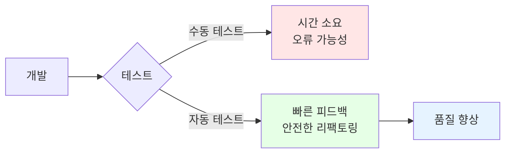

# 2-5. 회원 도메인 실행과 테스트

## 학습 목표
- main 메서드로 간단한 실행 테스트를 수행한다
- JUnit을 사용한 단위 테스트 작성 방법을 학습한다
- AssertJ를 활용한 검증 방법을 이해한다
- 테스트 코드의 중요성과 작성 방법을 익힌다

## 연관 개념
- **JUnit**: Java 표준 테스트 프레임워크
- **AssertJ**: 가독성 높은 assertion 라이브러리
- **Given-When-Then**: 테스트 코드 작성 패턴
- **단위 테스트(Unit Test)**: 개별 컴포넌트를 독립적으로 테스트

---

## TL;DR (간단 요약)

### main 메서드 테스트
```java
public static void main(String[] args) {
    MemberService memberService = new MemberServiceImpl();
    Member member = new Member(1L, "memberA", Grade.VIP);
    memberService.join(member);

    Member findMember = memberService.findMember(1L);
    System.out.println("회원 조회 성공");
}
```

### JUnit 테스트
```java
@Test
void join() {
    // given
    Member member = new Member(1L, "memberA", Grade.VIP);

    // when
    memberService.join(member);
    Member findMember = memberService.findMember(1L);

    // then
    Assertions.assertThat(member).isEqualTo(findMember);
}
```

### 핵심 메시지
**애플리케이션 로직으로 테스트하는 것은 좋은 방법이 아니다. JUnit 테스트를 사용하자.**

---

## 회원 도메인 - 회원 가입 main

### MemberApp - 실행 클래스

```java
package hello.core;

import hello.core.member.Grade;
import hello.core.member.Member;
import hello.core.member.MemberService;
import hello.core.member.MemberServiceImpl;

public class MemberApp {

    public static void main(String[] args) {
        MemberService memberService = new MemberServiceImpl();
        Member member = new Member(1L, "memberA", Grade.VIP);
        memberService.join(member);

        Member findMember = memberService.findMember(1L);
        System.out.println("new member = " + member.getName());
        System.out.println("find Member = " + findMember.getName());
    }
}
```

**파일 위치**: `src/main/java/hello/core/MemberApp.java`

### 실행 결과
```
new member = memberA
find Member = memberA
```

### 코드 설명
1. MemberServiceImpl 인스턴스 생성
2. VIP 등급의 회원 생성 (id: 1L, name: "memberA")
3. `join()` 메서드로 회원 가입
4. `findMember()` 메서드로 회원 조회
5. 콘솔에 결과 출력

---

## 심화 내용

### 1. main 메서드 테스트의 문제점

#### 단점
```
1. 수동 검증: 사람이 눈으로 결과를 확인해야 함
2. 재사용 불가: 매번 main을 실행해야 함
3. 여러 케이스 테스트 어려움
4. 자동화 불가능: CI/CD 파이프라인에 포함 불가
5. 실패 감지 어려움: 성공/실패가 명확하지 않음
```

#### 예시
```java
public static void main(String[] args) {
    // ...
    System.out.println("new member = " + member.getName());
    System.out.println("find Member = " + findMember.getName());

    // ❌ 이게 맞는지 사람이 직접 확인해야 함
    // ❌ 자동으로 성공/실패 판단 불가
}
```

### 2. 테스트 자동화의 필요성



---

## 회원 도메인 - 회원 가입 테스트

### MemberServiceTest - JUnit 테스트

```java
package hello.core.member;

import org.assertj.core.api.Assertions;
import org.junit.jupiter.api.Test;

class MemberServiceTest {

    MemberService memberService = new MemberServiceImpl();

    @Test
    void join() {
        // given
        Member member = new Member(1L, "memberA", Grade.VIP);

        // when
        memberService.join(member);
        Member findMember = memberService.findMember(1L);

        // then
        Assertions.assertThat(member).isEqualTo(findMember);
    }
}
```

**파일 위치**: `src/test/java/hello/core/member/MemberServiceTest.java`

### 테스트 성공 화면
```
✅ MemberServiceTest > join() PASSED
```

---

## 심화 내용

### 1. Given-When-Then 패턴

#### 패턴 설명
```java
@Test
void join() {
    // given - 테스트 준비 (데이터 준비)
    Member member = new Member(1L, "memberA", Grade.VIP);

    // when - 테스트 실행 (실제 동작)
    memberService.join(member);
    Member findMember = memberService.findMember(1L);

    // then - 검증 (결과 확인)
    Assertions.assertThat(member).isEqualTo(findMember);
}
```

#### 왜 사용하는가?
1. **가독성**: 테스트 의도가 명확해짐
2. **구조화**: 일관된 테스트 작성
3. **유지보수**: 테스트 수정이 쉬워짐

#### 변형 패턴들
```java
// Arrange-Act-Assert (AAA)
// given → Arrange
// when → Act
// then → Assert

// Setup-Exercise-Verify
// given → Setup
// when → Exercise
// then → Verify
```

### 2. AssertJ vs JUnit Assertions

#### JUnit 기본 Assertions
```java
import static org.junit.jupiter.api.Assertions.*;

@Test
void joinWithJUnit() {
    // given
    Member member = new Member(1L, "memberA", Grade.VIP);

    // when
    memberService.join(member);
    Member findMember = memberService.findMember(1L);

    // then
    assertEquals(member, findMember);  // JUnit
    assertTrue(findMember.getGrade() == Grade.VIP);
}
```

#### AssertJ Assertions (권장)
```java
import static org.assertj.core.api.Assertions.*;

@Test
void joinWithAssertJ() {
    // given
    Member member = new Member(1L, "memberA", Grade.VIP);

    // when
    memberService.join(member);
    Member findMember = memberService.findMember(1L);

    // then
    assertThat(findMember)
        .isEqualTo(member)
        .extracting("name", "grade")
        .containsExactly("memberA", Grade.VIP);
}
```

#### AssertJ의 장점
```java
// 1. 메서드 체이닝으로 가독성 향상
assertThat(findMember)
    .isNotNull()
    .hasFieldOrPropertyWithValue("name", "memberA")
    .hasFieldOrPropertyWithValue("grade", Grade.VIP);

// 2. 풍부한 assertion 메서드
assertThat(findMember.getName())
    .isNotEmpty()
    .startsWith("member")
    .endsWith("A")
    .hasSize(7);

// 3. 명확한 실패 메시지
assertThat(findMember.getGrade())
    .as("회원 등급은 VIP여야 합니다")
    .isEqualTo(Grade.VIP);
```

### 3. 다양한 테스트 케이스

#### 정상 케이스
```java
@Test
@DisplayName("VIP 회원 가입 성공")
void joinVipMember() {
    // given
    Member member = new Member(1L, "memberA", Grade.VIP);

    // when
    memberService.join(member);
    Member findMember = memberService.findMember(1L);

    // then
    assertThat(findMember)
        .isNotNull()
        .extracting("id", "name", "grade")
        .containsExactly(1L, "memberA", Grade.VIP);
}

@Test
@DisplayName("BASIC 회원 가입 성공")
void joinBasicMember() {
    // given
    Member member = new Member(2L, "memberB", Grade.BASIC);

    // when
    memberService.join(member);
    Member findMember = memberService.findMember(2L);

    // then
    assertThat(findMember.getGrade()).isEqualTo(Grade.BASIC);
}
```

#### 예외 케이스
```java
@Test
@DisplayName("존재하지 않는 회원 조회 시 null 반환")
void findMemberNotFound() {
    // when
    Member findMember = memberService.findMember(999L);

    // then
    assertThat(findMember).isNull();
}

// 예외 발생 테스트 (서비스 개선 후)
@Test
@DisplayName("존재하지 않는 회원 조회 시 예외 발생")
void findMemberThrowException() {
    // when & then
    assertThatThrownBy(() -> memberService.findMember(999L))
        .isInstanceOf(MemberNotFoundException.class)
        .hasMessage("회원을 찾을 수 없습니다: 999");
}

@Test
@DisplayName("중복 회원 가입 시 예외 발생")
void joinDuplicateMember() {
    // given
    Member member1 = new Member(1L, "memberA", Grade.VIP);
    memberService.join(member1);

    Member member2 = new Member(1L, "memberB", Grade.BASIC);

    // when & then
    assertThatThrownBy(() -> memberService.join(member2))
        .isInstanceOf(IllegalStateException.class)
        .hasMessage("이미 존재하는 회원입니다.");
}
```

### 4. 테스트 격리 (Isolation)

#### 문제 상황
```java
@Test
void test1() {
    Member member = new Member(1L, "memberA", Grade.VIP);
    memberService.join(member);
    // ...
}

@Test
void test2() {
    Member member = new Member(1L, "memberB", Grade.BASIC);
    memberService.join(member);  // ❌ ID 중복! test1의 영향
}
```

#### 해결: @BeforeEach, @AfterEach
```java
class MemberServiceTest {

    MemberService memberService;
    MemoryMemberRepository memberRepository;

    @BeforeEach
    void beforeEach() {
        memberRepository = new MemoryMemberRepository();
        memberService = new MemberServiceImpl(memberRepository);
    }

    @AfterEach
    void afterEach() {
        memberRepository.clearStore();  // 저장소 초기화
    }

    @Test
    void join() {
        // 테스트 코드
    }
}
```

#### clearStore() 메서드 추가
```java
public class MemoryMemberRepository implements MemberRepository {
    private static Map<Long, Member> store = new HashMap<>();

    // ...

    public void clearStore() {
        store.clear();
    }
}
```

---

## Tip

### IntelliJ 테스트 실행 단축키
```
- 현재 테스트 메서드 실행: Ctrl + Shift + F10 (Win/Linux)
- 현재 테스트 메서드 실행: Ctrl + Shift + R (Mac)
- 이전 테스트 재실행: Shift + F10 (Win/Linux)
- 이전 테스트 재실행: Ctrl + R (Mac)
```

### 테스트 메서드 네이밍
```java
// 방법 1: 한글 사용 (권장)
@Test
void 회원가입() { }

@Test
void 중복_회원_예외() { }

// 방법 2: 영어 + 언더스코어
@Test
void join_success() { }

@Test
void join_duplicate_member_exception() { }

// 방법 3: @DisplayName 사용
@Test
@DisplayName("회원 가입 성공")
void test1() { }
```

### AssertJ static import
```java
import static org.assertj.core.api.Assertions.*;

// assertThat을 바로 사용 가능
assertThat(member).isEqualTo(findMember);
```

---

## 주의사항

### 1. 테스트 메서드는 독립적이어야 함
```java
// ❌ 나쁜 예: 테스트 순서에 의존
class BadTest {
    static Member savedMember;

    @Test
    void test1_join() {
        savedMember = new Member(1L, "memberA", Grade.VIP);
        memberService.join(savedMember);
    }

    @Test
    void test2_find() {
        // test1에 의존 - 순서가 바뀌면 실패!
        Member findMember = memberService.findMember(savedMember.getId());
    }
}

// ✅ 좋은 예: 각 테스트 독립적
class GoodTest {
    @Test
    void join() {
        Member member = new Member(1L, "memberA", Grade.VIP);
        memberService.join(member);
        // ...
    }

    @Test
    void find() {
        Member member = new Member(2L, "memberB", Grade.BASIC);
        memberService.join(member);
        Member findMember = memberService.findMember(2L);
        // ...
    }
}
```

### 2. 프로덕션 코드에 테스트 코드 의존 금지
```java
// ❌ 나쁜 예
public class MemberServiceImpl {
    // 테스트를 위한 메서드 추가
    public void clearMembers() {  // 프로덕션에 불필요
        // ...
    }
}

// ✅ 좋은 예: 테스트 전용 클래스 사용
class MemberServiceTest {
    @BeforeEach
    void setup() {
        // 테스트마다 새로운 인스턴스 생성
        memberService = new MemberServiceImpl();
    }
}
```

### 3. assertEquals vs assertThat
```java
// JUnit의 assertEquals - 순서 주의!
assertEquals(expected, actual);  // 기대값, 실제값 순서

// AssertJ의 assertThat - 직관적
assertThat(actual).isEqualTo(expected);  // 실제값, 기대값
```

---

## 면접 질문

### 초급 - 테스트 기본

**Q1. main 메서드 테스트와 JUnit 테스트의 차이점은 무엇인가요?**

A:
**main 메서드 테스트:**
- 사람이 직접 콘솔 출력을 확인해야 함
- 성공/실패 자동 판단 불가
- 여러 케이스 테스트가 어려움
- 자동화(CI/CD) 불가능

**JUnit 테스트:**
- `assertThat`으로 자동 검증
- 성공/실패가 명확하게 표시됨
- 여러 테스트 케이스를 메서드로 분리 가능
- CI/CD 파이프라인에 통합 가능
- 빠른 피드백과 안전한 리팩토링 가능

```java
// main - 수동 검증
System.out.println(member.getName());  // 사람이 확인

// JUnit - 자동 검증
assertThat(member.getName()).isEqualTo("memberA");  // 자동 판단
```

**Q2. Given-When-Then 패턴을 설명하고 사용하는 이유는 무엇인가요?**

A: Given-When-Then은 테스트 코드를 구조화하는 패턴입니다.

- **Given**: 테스트에 필요한 데이터나 상태를 준비
- **When**: 테스트할 동작을 실행
- **Then**: 결과를 검증

```java
@Test
void join() {
    // given - 회원 데이터 준비
    Member member = new Member(1L, "memberA", Grade.VIP);

    // when - 회원 가입 실행
    memberService.join(member);
    Member findMember = memberService.findMember(1L);

    // then - 결과 검증
    assertThat(member).isEqualTo(findMember);
}
```

**사용 이유:**
1. 테스트 의도가 명확해짐
2. 일관된 구조로 가독성 향상
3. 유지보수가 쉬워짐
4. 팀 협업 시 통일된 스타일 유지

### 중급 - 테스트 격리

**Q3. 테스트 격리(Test Isolation)란 무엇이고 왜 중요한가요?**

A: 테스트 격리란 각 테스트가 다른 테스트의 영향을 받지 않고 독립적으로 실행되는 것을 의미합니다.

**문제 상황:**
```java
// static HashMap을 사용하는 경우
private static Map<Long, Member> store = new HashMap<>();

@Test
void test1() {
    Member member = new Member(1L, "memberA", Grade.VIP);
    memberService.join(member);  // store에 저장
}

@Test
void test2() {
    Member member = new Member(1L, "memberB", Grade.BASIC);
    memberService.join(member);  // test1의 데이터가 남아있음!
}
```

**해결 방법:**

1. **@BeforeEach, @AfterEach 사용**
```java
@BeforeEach
void setup() {
    memberRepository = new MemoryMemberRepository();
    memberService = new MemberServiceImpl(memberRepository);
}

@AfterEach
void cleanup() {
    memberRepository.clearStore();
}
```

2. **각 테스트마다 새로운 인스턴스 생성**
```java
@BeforeEach
void setup() {
    // 매번 새로운 저장소와 서비스 생성
    memberService = new MemberServiceImpl(new MemoryMemberRepository());
}
```

**중요한 이유:**
1. 테스트 순서에 관계없이 항상 같은 결과
2. 병렬 테스트 실행 가능
3. 테스트 실패 원인 파악이 쉬움
4. 안정적인 CI/CD 파이프라인 구축

**Q4. AssertJ를 사용하는 이유와 JUnit Assertions와의 차이점을 설명해주세요.**

A:
**JUnit Assertions:**
```java
assertEquals(expected, actual);
assertTrue(condition);
assertNotNull(object);
```

**AssertJ:**
```java
assertThat(actual).isEqualTo(expected);
assertThat(condition).isTrue();
assertThat(object).isNotNull();
```

**AssertJ의 장점:**

1. **가독성 향상**
```java
// JUnit - 순서 헷갈림
assertEquals("memberA", member.getName());

// AssertJ - 자연스러운 흐름
assertThat(member.getName()).isEqualTo("memberA");
```

2. **메서드 체이닝**
```java
assertThat(member)
    .isNotNull()
    .extracting("name", "grade")
    .containsExactly("memberA", Grade.VIP);
```

3. **풍부한 assertion**
```java
assertThat(member.getName())
    .isNotEmpty()
    .startsWith("member")
    .endsWith("A")
    .hasSize(7);
```

4. **명확한 에러 메시지**
```java
assertThat(member.getGrade())
    .as("회원 등급 검증")  // 실패 시 메시지에 표시
    .isEqualTo(Grade.VIP);
```

5. **다양한 타입 지원**
```java
// 컬렉션
assertThat(memberList)
    .hasSize(3)
    .contains(member1, member2)
    .extracting("name")
    .containsExactly("memberA", "memberB", "memberC");

// 예외
assertThatThrownBy(() -> memberService.findMember(999L))
    .isInstanceOf(MemberNotFoundException.class)
    .hasMessage("회원을 찾을 수 없습니다");
```

### 고급 - 테스트 전략

**Q5. 현재 테스트 코드의 문제점을 개선한 고급 테스트 전략을 제시해주세요.**

A: 현재 테스트에는 여러 개선점이 있습니다.

#### 1. 테스트 픽스처(Fixture) 관리

**현재 문제:**
```java
@Test
void test1() {
    Member member = new Member(1L, "memberA", Grade.VIP);
    // ...
}

@Test
void test2() {
    Member member = new Member(1L, "memberA", Grade.VIP);  // 중복
    // ...
}
```

**개선: 빌더 패턴 또는 팩토리 메서드**
```java
class MemberServiceTest {

    // 테스트 데이터 팩토리
    private Member createVipMember(Long id, String name) {
        return new Member(id, name, Grade.VIP);
    }

    private Member createBasicMember(Long id, String name) {
        return new Member(id, name, Grade.BASIC);
    }

    @Test
    void joinVipMember() {
        // given
        Member member = createVipMember(1L, "memberA");

        // when & then
        // ...
    }
}

// 또는 Builder 패턴
class MemberBuilder {
    private Long id = 1L;
    private String name = "memberA";
    private Grade grade = Grade.BASIC;

    public MemberBuilder id(Long id) {
        this.id = id;
        return this;
    }

    public MemberBuilder name(String name) {
        this.name = name;
        return this;
    }

    public MemberBuilder vip() {
        this.grade = Grade.VIP;
        return this;
    }

    public Member build() {
        return new Member(id, name, grade);
    }
}

@Test
void joinWithBuilder() {
    // given
    Member member = new MemberBuilder()
        .id(1L)
        .name("memberA")
        .vip()
        .build();

    // when & then
    // ...
}
```

#### 2. 파라미터화 테스트 (Parameterized Test)

```java
@ParameterizedTest
@CsvSource({
    "1, memberA, VIP",
    "2, memberB, BASIC",
    "3, memberC, VIP"
})
@DisplayName("다양한 회원 등급으로 가입 테스트")
void joinWithDifferentGrades(Long id, String name, Grade grade) {
    // given
    Member member = new Member(id, name, grade);

    // when
    memberService.join(member);
    Member findMember = memberService.findMember(id);

    // then
    assertThat(findMember)
        .extracting("id", "name", "grade")
        .containsExactly(id, name, grade);
}

@ParameterizedTest
@MethodSource("provideInvalidMembers")
@DisplayName("잘못된 회원 정보로 가입 시 예외 발생")
void joinWithInvalidMember(Member member, String expectedMessage) {
    // when & then
    assertThatThrownBy(() -> memberService.join(member))
        .isInstanceOf(IllegalArgumentException.class)
        .hasMessage(expectedMessage);
}

private static Stream<Arguments> provideInvalidMembers() {
    return Stream.of(
        Arguments.of(new Member(null, "memberA", Grade.VIP), "회원 ID는 필수입니다"),
        Arguments.of(new Member(1L, null, Grade.VIP), "회원 이름은 필수입니다"),
        Arguments.of(new Member(1L, "", Grade.VIP), "회원 이름은 필수입니다")
    );
}
```

#### 3. 테스트 더블(Test Double) 사용

**Mock을 사용한 의존성 제거:**
```java
class MemberServiceTest {

    @Test
    @DisplayName("리포지토리 호출 검증 - Mockito 사용")
    void joinCallsRepository() {
        // given
        MemberRepository memberRepository = mock(MemberRepository.class);
        MemberService memberService = new MemberServiceImpl(memberRepository);
        Member member = new Member(1L, "memberA", Grade.VIP);

        // when
        memberService.join(member);

        // then
        verify(memberRepository, times(1)).save(member);
    }

    @Test
    @DisplayName("리포지토리 동작 모킹")
    void findMemberWithMock() {
        // given
        MemberRepository memberRepository = mock(MemberRepository.class);
        MemberService memberService = new MemberServiceImpl(memberRepository);
        Member member = new Member(1L, "memberA", Grade.VIP);

        when(memberRepository.findById(1L)).thenReturn(member);

        // when
        Member findMember = memberService.findMember(1L);

        // then
        assertThat(findMember).isEqualTo(member);
        verify(memberRepository).findById(1L);
    }
}
```

#### 4. BDD 스타일 테스트

```java
// BDD Mockito 사용
import static org.mockito.BDDMockito.*;

@Test
@DisplayName("BDD 스타일 테스트")
void joinBddStyle() {
    // given
    MemberRepository memberRepository = mock(MemberRepository.class);
    MemberService memberService = new MemberServiceImpl(memberRepository);
    Member member = new Member(1L, "memberA", Grade.VIP);

    given(memberRepository.findById(1L)).willReturn(member);

    // when
    Member findMember = memberService.findMember(1L);

    // then
    then(memberRepository).should().findById(1L);
    assertThat(findMember).isEqualTo(member);
}
```

#### 5. 테스트 컨테이너를 활용한 통합 테스트

```java
@SpringBootTest
@Testcontainers
class MemberServiceIntegrationTest {

    @Container
    static MySQLContainer<?> mysql = new MySQLContainer<>("mysql:8.0")
        .withDatabaseName("testdb");

    @Autowired
    private MemberService memberService;

    @Test
    @DisplayName("실제 DB를 사용한 통합 테스트")
    void joinWithRealDatabase() {
        // given
        Member member = new Member(1L, "memberA", Grade.VIP);

        // when
        memberService.join(member);
        Member findMember = memberService.findMember(1L);

        // then
        assertThat(findMember).isEqualTo(member);
    }
}
```

#### 6. 성능 테스트

```java
@Test
@DisplayName("1만명 회원 가입 성능 테스트")
@Timeout(value = 5, unit = TimeUnit.SECONDS)
void performanceTest() {
    // given
    int memberCount = 10000;

    // when
    StopWatch stopWatch = new StopWatch();
    stopWatch.start();

    for (int i = 0; i < memberCount; i++) {
        Member member = new Member((long) i, "member" + i, Grade.BASIC);
        memberService.join(member);
    }

    stopWatch.stop();

    // then
    System.out.println("실행 시간: " + stopWatch.getTotalTimeMillis() + "ms");
    assertThat(stopWatch.getTotalTimeMillis()).isLessThan(5000);
}
```

#### 테스트 전략 요약
1. **테스트 픽스처**: Builder 패턴으로 재사용
2. **파라미터화 테스트**: 여러 케이스를 한 번에 테스트
3. **Mock 사용**: 의존성 제거하여 단위 테스트 순수성 유지
4. **BDD 스타일**: 비즈니스 언어로 테스트 작성
5. **통합 테스트**: 실제 환경과 유사한 테스트
6. **성능 테스트**: 응답 시간 검증

---

## 전체 요약

회원 도메인의 테스트는 **main 메서드 테스트**와 **JUnit 테스트** 두 가지 방식으로 진행됩니다.

### main 메서드 테스트
- 간단하게 동작 확인 가능
- 사람이 직접 결과를 확인해야 함
- 자동화 불가능

### JUnit 테스트 (권장)
- Given-When-Then 패턴으로 구조화
- AssertJ로 자동 검증
- CI/CD 파이프라인에 통합 가능
- 빠른 피드백과 안전한 리팩토링

### 핵심 원칙
```
1. 각 테스트는 독립적이어야 한다 (Test Isolation)
2. Given-When-Then으로 구조화한다
3. AssertJ로 가독성 높은 검증을 작성한다
4. @BeforeEach/@AfterEach로 테스트 환경을 초기화한다
```

---

## 학습 체크리스트
- [ ] main 메서드로 간단한 실행 테스트를 수행할 수 있다
- [ ] JUnit 테스트를 작성할 수 있다
- [ ] Given-When-Then 패턴을 이해하고 적용할 수 있다
- [ ] AssertJ를 사용한 검증을 작성할 수 있다
- [ ] 테스트 격리의 중요성을 이해했다

---

## 다음 학습
다음 섹션에서는 **주문과 할인 도메인을 설계**합니다.
- 주문 도메인 요구사항 분석
- 할인 정책 설계
- 역할과 책임 분리
- 협력 관계 다이어그램

**[2-6. 주문과 할인 도메인 설계](2-6-주문과할인도메인설계.md)** 에서 계속됩니다.

---

## 📚 참고자료
- [JUnit 5 User Guide](https://junit.org/junit5/docs/current/user-guide/)
- [AssertJ Documentation](https://assertj.github.io/doc/)
- [테스트 주도 개발 - Kent Beck](http://www.yes24.com/Product/Goods/12246033)
- [Effective Unit Testing - Lasse Koskela](http://www.yes24.com/Product/Goods/11221304)
- [xUnit Test Patterns - Gerard Meszaros](http://xunitpatterns.com/) - Given-When-Then 패턴
