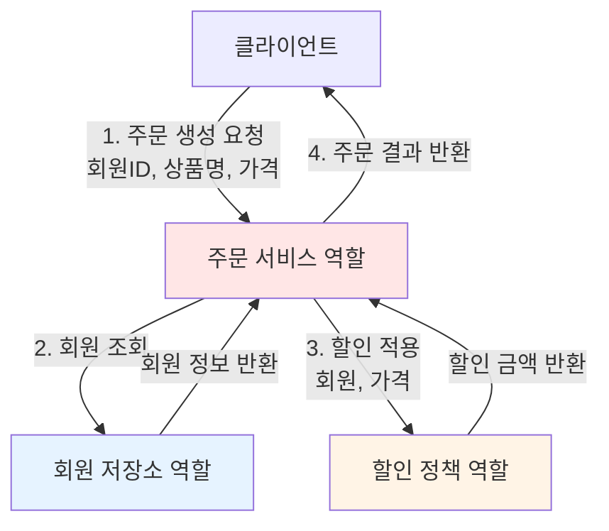
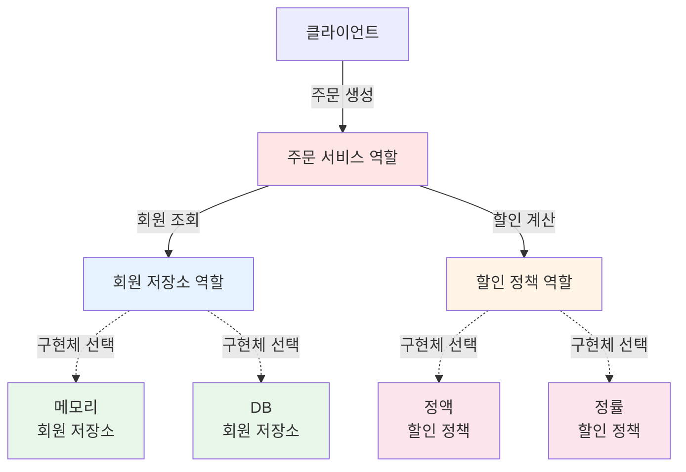
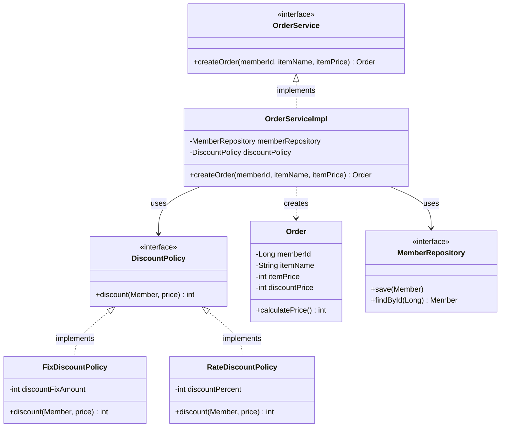
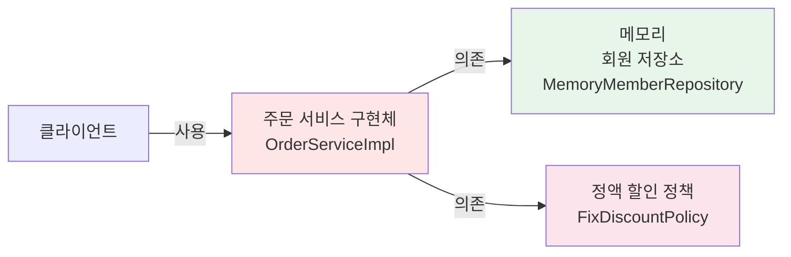
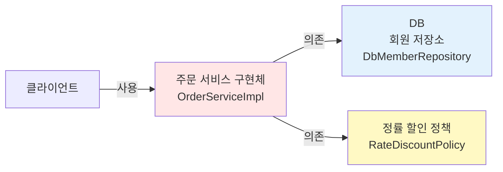
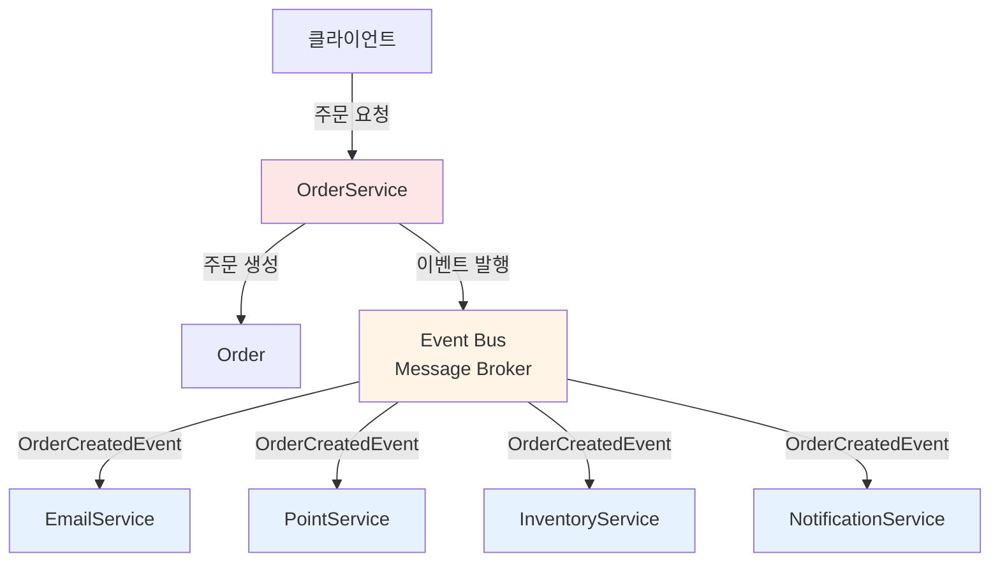

# 2-6. 주문과 할인 도메인 설계

## 학습 목표
- 주문과 할인 도메인의 요구사항을 분석한다
- 역할과 구현을 분리한 유연한 설계를 학습한다
- 할인 정책의 다형성을 이해한다
- 협력, 역할, 책임 관점에서 도메인을 설계한다

## 연관 개념
- **Strategy Pattern**: 알고리즘을 캡슐화하여 교체 가능하게 만드는 패턴
- **다형성(Polymorphism)**: 하나의 인터페이스로 여러 구현체 사용
- **SRP(단일 책임 원칙)**: 각 클래스는 하나의 책임만 가짐
- **OCP(개방-폐쇄 원칙)**: 확장에는 열려있고 변경에는 닫혀있음

---

## TL;DR (간단 요약)

### 주문과 할인 요구사항
- 회원은 상품을 주문할 수 있다
- 회원 등급에 따라 할인 정책 적용
- **고정 금액 할인**: VIP는 1000원 할인 (현재 정책)
- **할인 정책은 변경 가능성 높음** (미확정)

### 설계 전략
```
1. 주문 서비스: 주문 생성 및 할인 적용
2. 할인 정책: 인터페이스로 추상화
3. 구현체: FixDiscountPolicy(고정), RateDiscountPolicy(정률)
4. 역할 분리: 주문 서비스는 할인 정책 인터페이스에만 의존
```

### 협력 흐름
```
클라이언트 → 주문 서비스 → 회원 저장소 (회원 조회)
                      ↓
                  할인 정책 (할인 금액 계산)
                      ↓
                  주문 결과 반환
```

---

## 주문과 할인 정책 요구사항

### 기능 요구사항
```
1. 회원은 상품을 주문할 수 있다
2. 회원 등급에 따라 할인 정책을 적용할 수 있다
3. 할인 정책은 모든 VIP는 1000원을 할인해주는 고정 금액 할인을 적용 (변경 가능)
4. 할인 정책은 변경 가능성이 높다
   - 회사의 기본 할인 정책을 아직 정하지 못했음
   - 오픈 직전까지 고민을 미루고 싶음
   - 최악의 경우 할인을 적용하지 않을 수도 있음 (미확정)
```

### 불확실성 대응 전략
```
미확정 사항:
- 할인 정책이 확정되지 않음
- 고정 금액 할인? 정률 할인? 할인 없음?

해결책:
인터페이스를 만들고 구현체를 언제든지 갈아끼울 수 있도록 설계
→ 정책이 결정될 때까지 개발을 기다리지 않음!
```

---

## 주문 도메인 협력, 역할, 책임



### 협력 흐름 상세 설명

#### 1. 주문 생성
```
클라이언트가 주문 서비스에 주문 생성 요청
- 회원 ID
- 상품명
- 상품 가격
```

#### 2. 회원 조회
```
할인을 위해서는 회원 등급이 필요
→ 주문 서비스가 회원 저장소에서 회원 조회
```

#### 3. 할인 적용
```
주문 서비스가 회원 등급에 따른 할인 여부를 할인 정책에 위임
→ 할인 정책이 할인 금액 계산
```

#### 4. 주문 결과 반환
```
주문 서비스가 할인 결과를 포함한 주문 결과 반환
→ 실제로는 DB 저장이 필요하지만 예제에서는 생략
```

---

## 주문 도메인 전체 구조



### 역할과 구현의 분리

**역할 (인터페이스)**
- 주문 서비스: `OrderService`
- 회원 저장소: `MemberRepository`
- 할인 정책: `DiscountPolicy`

**구현 (구현체)**
- 회원 저장소: `MemoryMemberRepository`, `DbMemberRepository`
- 할인 정책: `FixDiscountPolicy`, `RateDiscountPolicy`

**장점**
```
회원 저장소는 물론이고, 할인 정책도 유연하게 변경할 수 있다
→ 주문 서비스 코드 변경 없이 구현체만 교체
→ OCP(개방-폐쇄 원칙) 준수
```

---

## 주문 도메인 클래스 다이어그램



### 클래스 다이어그램 설명

#### 핵심 인터페이스
1. **OrderService**: 주문 생성 역할
2. **DiscountPolicy**: 할인 정책 역할
3. **MemberRepository**: 회원 저장소 역할 (재사용)

#### 구현 클래스
1. **OrderServiceImpl**: 주문 서비스 구현
2. **FixDiscountPolicy**: 고정 금액 할인 (1000원)
3. **RateDiscountPolicy**: 정률 할인 (10%)
4. **Order**: 주문 결과 엔티티

---

## 주문 도메인 객체 다이어그램

### 객체 다이어그램 1 - 메모리 저장소 + 정액 할인



**특징**
- 메모리에서 회원 조회
- 정액 할인 정책 (VIP는 1000원 할인)
- 주문 서비스는 변경 없음

---

### 객체 다이어그램 2 - DB 저장소 + 정률 할인



**특징**
- 실제 DB에서 회원 조회
- 정률 할인 정책 (VIP는 10% 할인)
- **주문 서비스 코드는 변경하지 않음!**
- 역할들의 협력 관계를 그대로 재사용

---

## 심화 내용

### 1. Strategy Pattern (전략 패턴)

할인 정책은 전략 패턴의 대표적인 예입니다.

```java
// 전략 인터페이스
public interface DiscountPolicy {
    int discount(Member member, int price);
}

// 전략 1: 고정 금액 할인
public class FixDiscountPolicy implements DiscountPolicy {
    private int discountFixAmount = 1000;

    @Override
    public int discount(Member member, int price) {
        if (member.getGrade() == Grade.VIP) {
            return discountFixAmount;
        }
        return 0;
    }
}

// 전략 2: 정률 할인
public class RateDiscountPolicy implements DiscountPolicy {
    private int discountPercent = 10;

    @Override
    public int discount(Member member, int price) {
        if (member.getGrade() == Grade.VIP) {
            return price * discountPercent / 100;
        }
        return 0;
    }
}

// 컨텍스트 (전략을 사용하는 클래스)
public class OrderServiceImpl implements OrderService {
    private final DiscountPolicy discountPolicy;

    // 전략 주입
    public OrderServiceImpl(DiscountPolicy discountPolicy) {
        this.discountPolicy = discountPolicy;
    }

    @Override
    public Order createOrder(Long memberId, String itemName, int itemPrice) {
        // ...
        int discountPrice = discountPolicy.discount(member, itemPrice);
        // ...
    }
}
```

### 2. 단일 책임 원칙 (SRP)

각 클래스는 하나의 책임만 가집니다.

```
OrderService: 주문 생성 책임
  - 회원 조회는 MemberRepository에 위임
  - 할인 계산은 DiscountPolicy에 위임
  - 자신은 주문 생성 로직만 담당

DiscountPolicy: 할인 계산 책임
  - 회원 등급에 따른 할인 금액 계산
  - 할인 정책 변경 시 이 클래스만 수정

MemberRepository: 회원 데이터 관리 책임
  - 회원 저장과 조회만 담당
```

### 3. 개방-폐쇄 원칙 (OCP)

```java
// ✅ 확장에는 열려있음 - 새로운 할인 정책 추가
public class SeasonDiscountPolicy implements DiscountPolicy {
    @Override
    public int discount(Member member, int price) {
        // 계절별 할인 로직
        return price * 20 / 100;
    }
}

// ✅ 변경에는 닫혀있음 - OrderServiceImpl 코드는 변경 없음
OrderService orderService = new OrderServiceImpl(
    new MemberRepository(),
    new SeasonDiscountPolicy()  // 새로운 정책으로 교체
);
```

---

## Tip

### 역할과 구현 분리 기준
```
인터페이스를 만들어야 하는 경우:
1. 변경 가능성이 있는 경우 (할인 정책, 저장소)
2. 다형성이 필요한 경우
3. 테스트 시 Mock이 필요한 경우

구체 클래스만 사용하는 경우:
1. 변경 가능성이 거의 없는 경우
2. 단순한 VO(Value Object)나 엔티티
```

### 객체 다이어그램 활용
```
- 클래스 다이어그램: 모든 가능성 표현
- 객체 다이어그램: 특정 시점의 실제 인스턴스
→ 객체 다이어그램으로 런타임 동작 이해
```

### 협력 설계 시 고려사항
```
1. 역할 먼저 정의 (인터페이스)
2. 책임 분리 (SRP)
3. 의존 방향 고려 (DIP)
4. 확장 가능성 (OCP)
```

---

## 주의사항

### 1. 과도한 추상화 지양
```java
// ❌ 불필요한 인터페이스
public interface Order {
    int calculatePrice();
}

public class OrderImpl implements Order {
    // Order 엔티티는 변경 가능성이 거의 없음
    // 인터페이스가 불필요
}

// ✅ 간단한 엔티티는 구체 클래스만
public class Order {
    private Long memberId;
    private String itemName;
    private int itemPrice;
    private int discountPrice;

    public int calculatePrice() {
        return itemPrice - discountPrice;
    }
}
```

### 2. 할인 정책의 null 처리
```java
// 할인을 적용하지 않는 경우
public class NoDiscountPolicy implements DiscountPolicy {
    @Override
    public int discount(Member member, int price) {
        return 0;  // 할인 없음
    }
}

// null을 반환하지 말 것!
public class BadDiscountPolicy implements DiscountPolicy {
    @Override
    public int discount(Member member, int price) {
        return null;  // ❌ NullPointerException 발생 위험
    }
}
```

### 3. 할인 정책 변경 시 주의
```
현재 설계의 문제점 (다음 챕터에서 해결):
OrderServiceImpl이 구체 클래스를 직접 생성
→ DIP 위반
→ OCP 위반 (할인 정책 변경 시 OrderServiceImpl 수정 필요)
```

---

## 면접 질문

### 초급 - 개념 이해

**Q1. 주문 서비스에서 할인 정책을 인터페이스로 설계한 이유는 무엇인가요?**

A: 할인 정책은 변경 가능성이 매우 높기 때문입니다. 요구사항에서 "할인 정책이 확정되지 않았고, 오픈 직전까지 고민을 미루고 싶다"고 명시되어 있습니다.

DiscountPolicy 인터페이스를 만들면:
1. 고정 금액 할인 (FixDiscountPolicy)
2. 정률 할인 (RateDiscountPolicy)
3. 할인 없음 (NoDiscountPolicy)
등 다양한 구현체로 쉽게 교체할 수 있습니다.

```java
// 인터페이스에 의존
public class OrderServiceImpl implements OrderService {
    private final DiscountPolicy discountPolicy;

    // 구현체는 외부에서 주입 (유연성)
    public OrderServiceImpl(DiscountPolicy discountPolicy) {
        this.discountPolicy = discountPolicy;
    }
}
```

**Q2. 주문 도메인의 협력 흐름을 설명해주세요.**

A: 주문 도메인은 4단계로 협력합니다:

1. **주문 생성 요청**: 클라이언트가 주문 서비스에 회원ID, 상품명, 가격 전달
2. **회원 조회**: 주문 서비스가 회원 저장소에서 회원 정보 조회 (할인을 위해 등급 필요)
3. **할인 적용**: 주문 서비스가 할인 정책에 회원과 가격을 전달하여 할인 금액 계산
4. **주문 결과 반환**: 주문 서비스가 할인이 적용된 주문 결과를 클라이언트에 반환

핵심은 **주문 서비스가 직접 할인을 계산하지 않고 할인 정책에 위임**한다는 것입니다.

### 중급 - 설계 원칙

**Q3. 현재 설계가 어떻게 OCP(개방-폐쇄 원칙)를 준수하나요?**

A: OCP는 "확장에는 열려있고, 변경에는 닫혀있어야 한다"는 원칙입니다.

**확장에 열려있음:**
```java
// 새로운 할인 정책 추가 가능
public class SeasonDiscountPolicy implements DiscountPolicy {
    @Override
    public int discount(Member member, int price) {
        // 계절별 할인 로직
        return price * 20 / 100;
    }
}

public class VipOnlyDiscountPolicy implements DiscountPolicy {
    @Override
    public int discount(Member member, int price) {
        if (member.getGrade() == Grade.VIP) {
            return price * 15 / 100;
        }
        return 0;
    }
}
```

**변경에 닫혀있음:**
```java
// OrderServiceImpl 코드는 수정하지 않아도 됨
public class OrderServiceImpl implements OrderService {
    private final DiscountPolicy discountPolicy;

    // 생성 시점에 어떤 정책을 사용할지 결정
    public OrderServiceImpl(DiscountPolicy discountPolicy) {
        this.discountPolicy = discountPolicy;
    }

    @Override
    public Order createOrder(...) {
        // 이 코드는 할인 정책이 추가되어도 변경 불필요
        int discountPrice = discountPolicy.discount(member, itemPrice);
        return new Order(memberId, itemName, itemPrice, discountPrice);
    }
}
```

다만 현재 코드에는 문제가 있습니다. `new FixDiscountPolicy()`처럼 구현체를 직접 생성하면 OCP를 위반합니다. 이는 Spring의 DI로 해결할 예정입니다.

**Q4. 주문 서비스가 SRP(단일 책임 원칙)를 어떻게 준수하나요?**

A: OrderServiceImpl은 "주문 생성"이라는 하나의 책임만 가집니다.

**책임 분리:**
```java
public class OrderServiceImpl implements OrderService {
    private final MemberRepository memberRepository;
    private final DiscountPolicy discountPolicy;

    @Override
    public Order createOrder(Long memberId, String itemName, int itemPrice) {
        // 1. 회원 조회 - MemberRepository에 위임
        Member member = memberRepository.findById(memberId);

        // 2. 할인 계산 - DiscountPolicy에 위임
        int discountPrice = discountPolicy.discount(member, itemPrice);

        // 3. 주문 생성 - OrderServiceImpl의 책임
        return new Order(memberId, itemName, itemPrice, discountPrice);
    }
}
```

**각 클래스의 책임:**
- `OrderServiceImpl`: 주문 로직 조율
- `MemberRepository`: 회원 데이터 관리
- `DiscountPolicy`: 할인 금액 계산
- `Order`: 주문 데이터 보관

만약 할인 정책이 변경되어도 `DiscountPolicy` 구현체만 수정하면 되고, `OrderServiceImpl`은 수정하지 않아도 됩니다. 이것이 SRP의 핵심입니다.

**SRP 위반 예시:**
```java
// ❌ SRP 위반: OrderServiceImpl이 할인 계산까지 담당
public class BadOrderServiceImpl implements OrderService {
    @Override
    public Order createOrder(Long memberId, String itemName, int itemPrice) {
        Member member = memberRepository.findById(memberId);

        // 할인 로직이 OrderServiceImpl에 직접 구현됨
        int discountPrice = 0;
        if (member.getGrade() == Grade.VIP) {
            discountPrice = 1000;  // 할인 정책 변경 시 여기를 수정해야 함
        }

        return new Order(memberId, itemName, itemPrice, discountPrice);
    }
}
```

### 고급 - 아키텍처 설계

**Q5. 주문 도메인을 이벤트 기반 아키텍처로 재설계한다면 어떻게 구성하시겠습니까?**

A: 이벤트 기반 아키텍처(Event-Driven Architecture)로 재설계하면 각 도메인 간의 결합도를 낮추고, 확장성과 유연성을 높일 수 있습니다.

#### 현재 설계의 문제점

```java
// 동기식 호출 - 강한 결합
public class OrderServiceImpl implements OrderService {
    private final MemberRepository memberRepository;
    private final DiscountPolicy discountPolicy;
    private final EmailService emailService;  // 이메일 발송
    private final PointService pointService;  // 포인트 적립
    private final InventoryService inventoryService;  // 재고 차감

    @Override
    public Order createOrder(Long memberId, String itemName, int itemPrice) {
        // 1. 회원 조회
        Member member = memberRepository.findById(memberId);

        // 2. 할인 계산
        int discountPrice = discountPolicy.discount(member, itemPrice);

        // 3. 주문 생성
        Order order = new Order(memberId, itemName, itemPrice, discountPrice);

        // 4. 이메일 발송 (동기)
        emailService.sendOrderConfirmation(order);

        // 5. 포인트 적립 (동기)
        pointService.addPoints(memberId, itemPrice);

        // 6. 재고 차감 (동기)
        inventoryService.decreaseStock(itemName);

        return order;  // 모든 처리가 끝나야 반환
    }
}
```

**문제점:**
1. 모든 처리가 동기식으로 진행 → 느린 응답 시간
2. 한 서비스 장애 시 전체 주문 실패
3. 새로운 기능 추가 시 OrderServiceImpl 수정 필요 (OCP 위반)

#### 이벤트 기반 설계



#### 코드 구현

**1. 이벤트 정의**
```java
// 도메인 이벤트
public class OrderCreatedEvent {
    private final Long orderId;
    private final Long memberId;
    private final String itemName;
    private final int itemPrice;
    private final int discountPrice;
    private final LocalDateTime createdAt;

    public OrderCreatedEvent(Order order) {
        this.orderId = order.getId();
        this.memberId = order.getMemberId();
        this.itemName = order.getItemName();
        this.itemPrice = order.getItemPrice();
        this.discountPrice = order.getDiscountPrice();
        this.createdAt = LocalDateTime.now();
    }

    // Getters...
}
```

**2. 이벤트 발행자 (Publisher)**
```java
public class OrderServiceImpl implements OrderService {
    private final MemberRepository memberRepository;
    private final DiscountPolicy discountPolicy;
    private final OrderRepository orderRepository;
    private final EventPublisher eventPublisher;  // 이벤트 발행

    @Override
    public Order createOrder(Long memberId, String itemName, int itemPrice) {
        // 1. 회원 조회
        Member member = memberRepository.findById(memberId);

        // 2. 할인 계산
        int discountPrice = discountPolicy.discount(member, itemPrice);

        // 3. 주문 생성 및 저장
        Order order = new Order(memberId, itemName, itemPrice, discountPrice);
        orderRepository.save(order);

        // 4. 이벤트 발행 (비동기)
        eventPublisher.publish(new OrderCreatedEvent(order));

        return order;  // 즉시 반환 (다른 처리를 기다리지 않음)
    }
}
```

**3. 이벤트 리스너 (Subscriber)**
```java
// 이메일 발송 리스너
@Component
public class EmailEventListener {

    @Autowired
    private EmailService emailService;

    @EventListener
    @Async  // 비동기 처리
    public void handleOrderCreated(OrderCreatedEvent event) {
        emailService.sendOrderConfirmation(
            event.getMemberId(),
            event.getOrderId(),
            event.getItemName()
        );
    }
}

// 포인트 적립 리스너
@Component
public class PointEventListener {

    @Autowired
    private PointService pointService;

    @EventListener
    @Async
    public void handleOrderCreated(OrderCreatedEvent event) {
        pointService.addPoints(
            event.getMemberId(),
            event.getItemPrice() / 100  // 1% 포인트 적립
        );
    }
}

// 재고 차감 리스너
@Component
public class InventoryEventListener {

    @Autowired
    private InventoryService inventoryService;

    @EventListener
    @Async
    public void handleOrderCreated(OrderCreatedEvent event) {
        inventoryService.decreaseStock(event.getItemName());
    }
}

// 알림 발송 리스너 (나중에 추가)
@Component
public class NotificationEventListener {

    @Autowired
    private NotificationService notificationService;

    @EventListener
    @Async
    public void handleOrderCreated(OrderCreatedEvent event) {
        notificationService.sendPushNotification(
            event.getMemberId(),
            "주문이 완료되었습니다!"
        );
    }
}
```

**4. Spring 이벤트 발행기**
```java
@Component
public class SpringEventPublisher implements EventPublisher {

    @Autowired
    private ApplicationEventPublisher applicationEventPublisher;

    @Override
    public void publish(OrderCreatedEvent event) {
        applicationEventPublisher.publishEvent(event);
    }
}
```

**5. 메시지 브로커 사용 (Kafka, RabbitMQ)**
```java
// Kafka를 사용한 이벤트 발행
@Component
public class KafkaEventPublisher implements EventPublisher {

    @Autowired
    private KafkaTemplate<String, OrderCreatedEvent> kafkaTemplate;

    private static final String TOPIC = "order-created";

    @Override
    public void publish(OrderCreatedEvent event) {
        kafkaTemplate.send(TOPIC, event);
    }
}

// Kafka 리스너
@Component
public class KafkaOrderEventListener {

    @KafkaListener(topics = "order-created", groupId = "email-service")
    public void handleOrderCreatedForEmail(OrderCreatedEvent event) {
        // 이메일 발송 처리
    }

    @KafkaListener(topics = "order-created", groupId = "point-service")
    public void handleOrderCreatedForPoint(OrderCreatedEvent event) {
        // 포인트 적립 처리
    }
}
```

#### 장점

1. **낮은 결합도**
```java
// OrderServiceImpl은 이메일, 포인트 등의 서비스를 모름
// 새로운 기능 추가 시 리스너만 추가하면 됨 (OCP 준수)
```

2. **높은 확장성**
```java
// 새로운 리스너 추가만으로 기능 확장
@Component
public class SmsEventListener {
    @EventListener
    public void handleOrderCreated(OrderCreatedEvent event) {
        // SMS 발송
    }
}
```

3. **빠른 응답 시간**
```java
// 주문 생성 후 즉시 응답
// 이메일, 포인트 등은 백그라운드에서 처리
```

4. **장애 격리**
```java
// 이메일 서비스 장애가 주문 생성에 영향 없음
// 각 서비스가 독립적으로 실행
```

5. **재시도 및 보상 트랜잭션**
```java
@Component
public class RobustPointEventListener {

    @Retryable(maxAttempts = 3, backoff = @Backoff(delay = 1000))
    @EventListener
    public void handleOrderCreated(OrderCreatedEvent event) {
        try {
            pointService.addPoints(event.getMemberId(), event.getItemPrice());
        } catch (Exception e) {
            // 실패 시 보상 이벤트 발행
            eventPublisher.publish(new PointAdditionFailedEvent(event));
        }
    }
}
```

#### 고려사항

1. **이벤트 순서 보장**
```java
// Kafka 파티션 키로 순서 보장
kafkaTemplate.send(TOPIC, event.getMemberId().toString(), event);
```

2. **멱등성(Idempotency) 보장**
```java
// 중복 이벤트 처리 방지
@EventListener
public void handleOrderCreated(OrderCreatedEvent event) {
    if (processedEventRepository.exists(event.getOrderId())) {
        return;  // 이미 처리된 이벤트
    }

    pointService.addPoints(event.getMemberId(), event.getItemPrice());
    processedEventRepository.save(event.getOrderId());
}
```

3. **분산 트랜잭션**
```java
// Saga 패턴으로 분산 트랜잭션 처리
// Choreography Saga
OrderCreated → InventoryReserved → PaymentProcessed → OrderCompleted
             ↓ (실패 시)
             InventoryReservationFailed → OrderCancelled
```

4. **이벤트 소싱 (Event Sourcing)**
```java
// 모든 상태 변경을 이벤트로 저장
public class OrderAggregate {
    private List<OrderEvent> events = new ArrayList<>();

    public void createOrder(...) {
        OrderCreatedEvent event = new OrderCreatedEvent(...);
        apply(event);
        events.add(event);
    }

    // 이벤트 재생으로 상태 복원
    public static OrderAggregate rebuild(List<OrderEvent> history) {
        OrderAggregate aggregate = new OrderAggregate();
        history.forEach(aggregate::apply);
        return aggregate;
    }
}
```

---

## 전체 요약

주문과 할인 도메인 설계는 **역할과 구현의 분리**를 통해 유연한 구조를 만듭니다.

### 핵심 포인트
1. **협력 흐름**: 주문 서비스 → 회원 조회 → 할인 계산 → 주문 결과
2. **역할 분리**: OrderService, DiscountPolicy, MemberRepository
3. **다형성 활용**: FixDiscountPolicy, RateDiscountPolicy 등 교체 가능
4. **설계 원칙**: SRP(단일 책임), OCP(개방-폐쇄) 준수

### 설계의 장점
```
할인 정책 변경 시 구현체만 교체
→ OrderServiceImpl 코드 수정 불필요
→ 역할들의 협력 관계는 그대로 유지
```

### 아직 해결되지 않은 문제
현재 설계는 구현체를 직접 생성하므로 DIP를 위반합니다. 이는 다음 섹션에서 실제 코드로 구현하며 확인하고, Spring의 DI로 해결할 예정입니다.

---

## 학습 체크리스트
- [ ] 주문 도메인의 협력 흐름을 설명할 수 있다
- [ ] 할인 정책을 인터페이스로 설계한 이유를 이해했다
- [ ] Strategy Pattern을 이해했다
- [ ] 역할과 구현 분리의 장점을 이해했다
- [ ] SRP와 OCP가 어떻게 적용되는지 이해했다

---

## 다음 학습
다음 섹션에서는 설계한 주문과 할인 도메인을 **실제 코드로 구현**합니다.
- DiscountPolicy 인터페이스와 FixDiscountPolicy 구현
- Order 엔티티 작성
- OrderService 인터페이스와 OrderServiceImpl 구현

**[2-7. 주문과 할인 도메인 개발](2-7-주문과할인도메인개발.md)** 에서 계속됩니다.

---

## 📚 참고자료
- [Head First Design Patterns](http://www.yes24.com/Product/Goods/1778966) - Strategy Pattern
- [Clean Architecture - Robert C. Martin](http://www.yes24.com/Product/Goods/77283734) - 의존성 규칙
- [Domain-Driven Design - Eric Evans](http://www.yes24.com/Product/Goods/5312881) - 도메인 모델링
- [Implementing Domain-Driven Design - Vaughn Vernon](http://www.yes24.com/Product/Goods/25100510) - 이벤트 기반 아키텍처
- [Event-Driven Architecture - Martin Fowler](https://martinfowler.com/articles/201701-event-driven.html)
