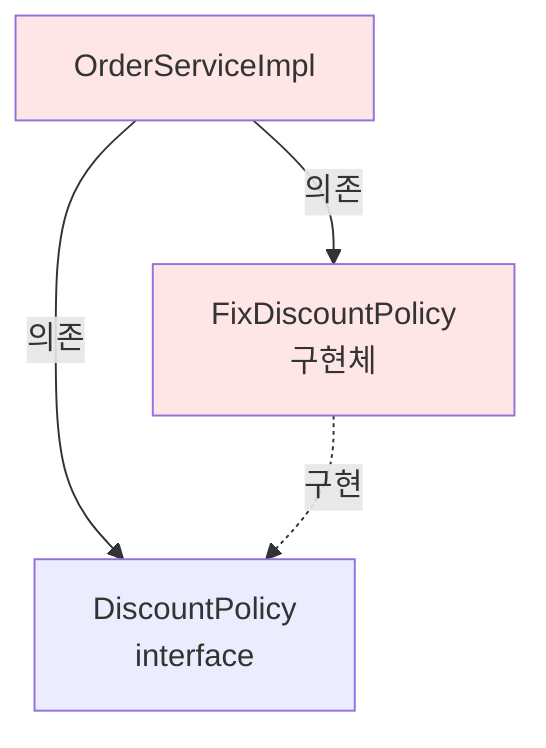
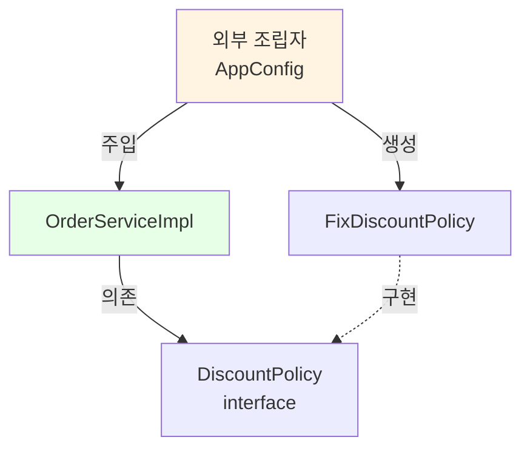

# 2-7. 주문과 할인 도메인 개발

## 학습 목표
- 할인 정책 인터페이스와 구현체를 작성한다
- 주문 엔티티와 서비스를 구현한다
- 다형성을 활용한 유연한 구조를 만든다
- 도메인 간의 협력 관계를 코드로 구현한다

## 연관 개념
- **Strategy Pattern**: 알고리즘군을 정의하고 캡슐화하여 교체 가능하게 만드는 패턴
- **다형성(Polymorphism)**: 인터페이스를 통해 여러 구현체를 동일하게 사용
- **위임(Delegation)**: 자신의 책임을 다른 객체에 맡김
- **계산 메서드**: 비즈니스 로직을 처리하는 메서드

---

## TL;DR (간단 요약)

### 구현할 컴포넌트
1. **DiscountPolicy** (인터페이스): 할인 정책 역할
2. **FixDiscountPolicy**: 고정 금액 할인 (VIP 1000원)
3. **Order** (엔티티): 주문 정보 및 최종 가격 계산
4. **OrderService** (인터페이스): 주문 생성 역할
5. **OrderServiceImpl**: 주문 서비스 구현 (회원 조회 + 할인 적용)

### 핵심 흐름
```
OrderServiceImpl.createOrder()
  → memberRepository.findById()  // 회원 조회
  → discountPolicy.discount()    // 할인 계산
  → new Order()                  // 주문 생성
```

---

## 할인 정책 구현

### DiscountPolicy - 할인 정책 인터페이스

```java
package hello.core.discount;

import hello.core.member.Member;

public interface DiscountPolicy {

    /**
     * @return 할인 대상 금액
     */
    int discount(Member member, int price);
}
```

**파일 위치**: `src/main/java/hello/core/discount/DiscountPolicy.java`

#### 인터페이스 설계
- `discount()`: 회원과 가격을 받아 할인 금액 반환
- 반환값: 할인 금액 (원가 - 할인 금액 = 최종 가격)

#### JavaDoc 주석
```java
/**
 * @return 할인 대상 금액
 */
```
- API 문서 자동 생성
- 메서드 의도 명확화

---

### FixDiscountPolicy - 고정 금액 할인 정책

```java
package hello.core.discount;

import hello.core.member.Grade;
import hello.core.member.Member;

public class FixDiscountPolicy implements DiscountPolicy {

    private int discountFixAmount = 1000;  // 1000원 할인

    @Override
    public int discount(Member member, int price) {
        if (member.getGrade() == Grade.VIP) {
            return discountFixAmount;
        } else {
            return 0;
        }
    }
}
```

**파일 위치**: `src/main/java/hello/core/discount/FixDiscountPolicy.java`

#### 구현 로직
1. VIP 회원인지 등급 확인
2. VIP면 1000원 할인
3. 아니면 할인 없음 (0원)

#### 간단한 if문 사용
```java
if (member.getGrade() == Grade.VIP) {
    return discountFixAmount;
} else {
    return 0;
}
```

---

## 심화 내용

### 1. 다양한 할인 정책 구현

#### 정률 할인 정책 (RateDiscountPolicy)
```java
package hello.core.discount;

import hello.core.member.Grade;
import hello.core.member.Member;

public class RateDiscountPolicy implements DiscountPolicy {

    private int discountPercent = 10;  // 10% 할인

    @Override
    public int discount(Member member, int price) {
        if (member.getGrade() == Grade.VIP) {
            return price * discountPercent / 100;
        } else {
            return 0;
        }
    }
}
```

**사용 예시:**
```java
Member vip = new Member(1L, "vipUser", Grade.VIP);
DiscountPolicy policy = new RateDiscountPolicy();

int discountAmount = policy.discount(vip, 10000);  // 1000원 (10%)
int discountAmount2 = policy.discount(vip, 20000);  // 2000원 (10%)
```

#### 할인 없음 정책 (NoDiscountPolicy)
```java
public class NoDiscountPolicy implements DiscountPolicy {

    @Override
    public int discount(Member member, int price) {
        return 0;  // 항상 할인 없음
    }
}
```

#### 계절별 할인 정책 (SeasonDiscountPolicy)
```java
public class SeasonDiscountPolicy implements DiscountPolicy {

    @Override
    public int discount(Member member, int price) {
        LocalDate now = LocalDate.now();
        int month = now.getMonthValue();

        // 여름 시즌 (6~8월) VIP 20% 할인
        if (month >= 6 && month <= 8 && member.getGrade() == Grade.VIP) {
            return price * 20 / 100;
        }
        // 겨울 시즌 (12~2월) VIP 15% 할인
        else if ((month == 12 || month <= 2) && member.getGrade() == Grade.VIP) {
            return price * 15 / 100;
        }
        return 0;
    }
}
```

### 2. enum을 활용한 할인 정책 관리

```java
public enum Grade {
    BASIC(0),    // 할인 없음
    VIP(1000),   // 1000원 할인
    VVIP(2000);  // 2000원 할인

    private final int discountAmount;

    Grade(int discountAmount) {
        this.discountAmount = discountAmount;
    }

    public int getDiscountAmount() {
        return discountAmount;
    }
}

public class GradeBasedDiscountPolicy implements DiscountPolicy {

    @Override
    public int discount(Member member, int price) {
        return member.getGrade().getDiscountAmount();
    }
}
```

---

## 주문 엔티티 구현

### Order - 주문 엔티티

```java
package hello.core.order;

public class Order {

    private Long memberId;
    private String itemName;
    private int itemPrice;
    private int discountPrice;

    public Order(Long memberId, String itemName, int itemPrice, int discountPrice) {
        this.memberId = memberId;
        this.itemName = itemName;
        this.itemPrice = itemPrice;
        this.discountPrice = discountPrice;
    }

    public int calculatePrice() {
        return itemPrice - discountPrice;
    }

    public Long getMemberId() {
        return memberId;
    }

    public String getItemName() {
        return itemName;
    }

    public int getItemPrice() {
        return itemPrice;
    }

    public int getDiscountPrice() {
        return discountPrice;
    }

    @Override
    public String toString() {
        return "Order{" +
                "memberId=" + memberId +
                ", itemName='" + itemName + '\'' +
                ", itemPrice=" + itemPrice +
                ", discountPrice=" + discountPrice +
                '}';
    }
}
```

**파일 위치**: `src/main/java/hello/core/order/Order.java`

#### Order 클래스 설명

**필드**
- `memberId`: 주문한 회원 ID
- `itemName`: 상품명
- `itemPrice`: 상품 원가
- `discountPrice`: 할인 금액

**비즈니스 로직**
```java
public int calculatePrice() {
    return itemPrice - discountPrice;
}
```
- 최종 가격 = 원가 - 할인 금액

**toString() 오버라이드**
```java
@Override
public String toString() {
    return "Order{" +
            "memberId=" + memberId +
            ", itemName='" + itemName + '\'' +
            ", itemPrice=" + itemPrice +
            ", discountPrice=" + discountPrice +
            '}';
}
```
- 디버깅과 로깅에 유용

---

## 주문 서비스 구현

### OrderService - 주문 서비스 인터페이스

```java
package hello.core.order;

public interface OrderService {
    Order createOrder(Long memberId, String itemName, int itemPrice);
}
```

**파일 위치**: `src/main/java/hello/core/order/OrderService.java`

#### 인터페이스 메서드
- `createOrder()`: 회원ID, 상품명, 가격을 받아 주문 생성

---

### OrderServiceImpl - 주문 서비스 구현체

```java
package hello.core.order;

import hello.core.discount.DiscountPolicy;
import hello.core.discount.FixDiscountPolicy;
import hello.core.member.Member;
import hello.core.member.MemberRepository;
import hello.core.member.MemoryMemberRepository;

public class OrderServiceImpl implements OrderService {

    private final MemberRepository memberRepository = new MemoryMemberRepository();
    private final DiscountPolicy discountPolicy = new FixDiscountPolicy();

    @Override
    public Order createOrder(Long memberId, String itemName, int itemPrice) {
        Member member = memberRepository.findById(memberId);
        int discountPrice = discountPolicy.discount(member, itemPrice);

        return new Order(memberId, itemName, itemPrice, discountPrice);
    }
}
```

**파일 위치**: `src/main/java/hello/core/order/OrderServiceImpl.java`

#### 구현 로직

**1. 회원 조회**
```java
Member member = memberRepository.findById(memberId);
```
- 할인을 위해 회원 등급 필요
- MemberRepository에 위임

**2. 할인 계산**
```java
int discountPrice = discountPolicy.discount(member, itemPrice);
```
- DiscountPolicy에 할인 계산 위임
- 단일 책임 원칙 (SRP) 준수

**3. 주문 생성**
```java
return new Order(memberId, itemName, itemPrice, discountPrice);
```
- 주문 객체 생성 및 반환

---

## 심화 내용

### 1. 설계의 우수한 점 - SRP (단일 책임 원칙)

```java
public class OrderServiceImpl implements OrderService {

    @Override
    public Order createOrder(Long memberId, String itemName, int itemPrice) {
        // 1. 회원 조회 - MemberRepository에 위임
        Member member = memberRepository.findById(memberId);

        // 2. 할인 계산 - DiscountPolicy에 위임
        int discountPrice = discountPolicy.discount(member, itemPrice);

        // 3. 주문 생성 - OrderServiceImpl의 책임
        return new Order(memberId, itemName, itemPrice, discountPrice);
    }
}
```

**책임 분리:**
- `OrderServiceImpl`: 주문 생성 로직 조율
- `MemberRepository`: 회원 데이터 관리
- `DiscountPolicy`: 할인 금액 계산

**장점:**
```
할인 정책이 변경되어도 OrderServiceImpl은 수정 불필요
→ DiscountPolicy 구현체만 교체
→ 관심사의 분리
```

### 2. 설계의 문제점 - DIP 위반

```java
private final MemberRepository memberRepository = new MemoryMemberRepository();
private final DiscountPolicy discountPolicy = new FixDiscountPolicy();
```

**문제점 분석:**
```java
// OrderServiceImpl이 의존하는 대상
1. MemberRepository (인터페이스 - 추상)
2. MemoryMemberRepository (구현체 - 구체)
3. DiscountPolicy (인터페이스 - 추상)
4. FixDiscountPolicy (구현체 - 구체)

→ DIP 위반: 추상화와 구체화 모두에 의존
```

**의존관계 다이어그램:**


**할인 정책 변경 시:**
```java
// ❌ 코드 수정 필요 (OCP 위반)
// private final DiscountPolicy discountPolicy = new FixDiscountPolicy();
private final DiscountPolicy discountPolicy = new RateDiscountPolicy();
```

### 3. 개선 방안 - 생성자 주입

```java
public class OrderServiceImpl implements OrderService {

    private final MemberRepository memberRepository;
    private final DiscountPolicy discountPolicy;

    // 생성자 주입
    public OrderServiceImpl(MemberRepository memberRepository, DiscountPolicy discountPolicy) {
        this.memberRepository = memberRepository;
        this.discountPolicy = discountPolicy;
    }

    @Override
    public Order createOrder(Long memberId, String itemName, int itemPrice) {
        Member member = memberRepository.findById(memberId);
        int discountPrice = discountPolicy.discount(member, itemPrice);
        return new Order(memberId, itemName, itemPrice, discountPrice);
    }
}
```

**사용:**
```java
// 구현체는 외부에서 결정
MemberRepository memberRepository = new MemoryMemberRepository();
DiscountPolicy discountPolicy = new FixDiscountPolicy();

OrderService orderService = new OrderServiceImpl(memberRepository, discountPolicy);
```

**개선된 의존관계:**


---

## Tip

### 패키지 구조
```
hello.core
├── member
│   ├── Grade.java
│   ├── Member.java
│   ├── MemberRepository.java
│   ├── MemoryMemberRepository.java
│   ├── MemberService.java
│   └── MemberServiceImpl.java
│
├── order
│   ├── Order.java
│   ├── OrderService.java
│   └── OrderServiceImpl.java
│
└── discount
    ├── DiscountPolicy.java
    └── FixDiscountPolicy.java
```

### 할인 금액 vs 최종 가격
```java
// 할인 금액
int discountPrice = discountPolicy.discount(member, itemPrice);

// 최종 가격
int finalPrice = order.calculatePrice();  // itemPrice - discountPrice
```

### toString() 활용
```java
Order order = new Order(1L, "itemA", 10000, 1000);
System.out.println(order);
// 출력: Order{memberId=1, itemName='itemA', itemPrice=10000, discountPrice=1000}
```

---

## 주의사항

### 1. 할인 금액이 상품 가격보다 큰 경우
```java
// ❌ 음수 가격 발생 가능
public class BadDiscountPolicy implements DiscountPolicy {
    @Override
    public int discount(Member member, int price) {
        return 15000;  // 상품 가격보다 큰 할인
    }
}

// ✅ 검증 로직 추가
public class SafeDiscountPolicy implements DiscountPolicy {
    private int discountAmount = 1000;

    @Override
    public int discount(Member member, int price) {
        if (member.getGrade() != Grade.VIP) {
            return 0;
        }

        int discount = discountAmount;
        // 할인 금액이 상품 가격을 초과하지 않도록
        if (discount > price) {
            discount = price;
        }
        return discount;
    }
}

// Order 클래스에서 검증
public class Order {
    public Order(Long memberId, String itemName, int itemPrice, int discountPrice) {
        if (discountPrice > itemPrice) {
            throw new IllegalArgumentException("할인 금액이 상품 가격보다 클 수 없습니다.");
        }
        // ...
    }
}
```

### 2. null 반환 방지
```java
// ❌ null 반환 금지
public Member findById(Long memberId) {
    return store.get(memberId);  // null 가능
}

// ✅ Optional 또는 예외 사용
public Member findById(Long memberId) {
    Member member = store.get(memberId);
    if (member == null) {
        throw new MemberNotFoundException("회원을 찾을 수 없습니다: " + memberId);
    }
    return member;
}

// 또는 Optional
public Optional<Member> findById(Long memberId) {
    return Optional.ofNullable(store.get(memberId));
}
```

### 3. 정수 나눗셈 주의
```java
// ❌ 정수 나눗셈 - 소수점 이하 버림
int discount = price * 10 / 100;  // 10% 할인

// 예: price = 9999
// discount = 9999 * 10 / 100 = 99990 / 100 = 999 (0.9원 손실)

// ✅ 반올림 처리
int discount = Math.round(price * 10f / 100f);

// 또는 BigDecimal 사용 (금융 시스템)
BigDecimal price = new BigDecimal("9999");
BigDecimal discount = price.multiply(new BigDecimal("0.1"))
                           .setScale(0, RoundingMode.HALF_UP);
```

---

## 면접 질문

### 초급 - 코드 이해

**Q1. OrderServiceImpl에서 할인 계산을 DiscountPolicy에 위임한 이유는 무엇인가요?**

A: 단일 책임 원칙(SRP)을 준수하기 위함입니다.

```java
// ❌ SRP 위반: OrderServiceImpl이 할인 계산까지 담당
public Order createOrder(Long memberId, String itemName, int itemPrice) {
    Member member = memberRepository.findById(memberId);

    // 할인 로직이 OrderServiceImpl에 직접 구현
    int discountPrice = 0;
    if (member.getGrade() == Grade.VIP) {
        discountPrice = 1000;
    }

    return new Order(memberId, itemName, itemPrice, discountPrice);
}

// ✅ SRP 준수: 할인 계산을 DiscountPolicy에 위임
public Order createOrder(Long memberId, String itemName, int itemPrice) {
    Member member = memberRepository.findById(memberId);
    int discountPrice = discountPolicy.discount(member, itemPrice);  // 위임
    return new Order(memberId, itemName, itemPrice, discountPrice);
}
```

**장점:**
1. OrderServiceImpl은 주문 생성에만 집중
2. 할인 정책 변경 시 DiscountPolicy만 수정
3. 할인 로직의 재사용 가능
4. 테스트 용이성 향상

**Q2. Order 클래스의 calculatePrice() 메서드는 어떤 역할을 하나요?**

A: 최종 가격을 계산하는 비즈니스 로직입니다.

```java
public int calculatePrice() {
    return itemPrice - discountPrice;
}
```

**역할:**
- 상품 원가에서 할인 금액을 뺀 최종 가격 계산
- 도메인 로직을 엔티티에 캡슐화
- 데이터와 행위를 함께 관리 (객체지향)

**사용 예:**
```java
Order order = new Order(1L, "itemA", 10000, 1000);
int finalPrice = order.calculatePrice();  // 9000원
```

### 중급 - 설계 원칙

**Q3. 현재 OrderServiceImpl의 설계가 DIP를 위반하는 이유와 문제점을 설명해주세요.**

A:
**DIP 위반 코드:**
```java
private final DiscountPolicy discountPolicy = new FixDiscountPolicy();
```

**위반 이유:**
OrderServiceImpl이 DiscountPolicy 인터페이스(추상)와 FixDiscountPolicy 구현체(구체) 모두에 의존합니다.
DIP는 "추상화에 의존하고, 구체화에 의존하지 말라"는 원칙이므로 위반입니다.

**문제점:**

1. **OCP 위반 - 할인 정책 변경 시 코드 수정 필요**
```java
// 정률 할인으로 변경하려면 OrderServiceImpl 수정 필요
// private final DiscountPolicy discountPolicy = new FixDiscountPolicy();
private final DiscountPolicy discountPolicy = new RateDiscountPolicy();
```

2. **테스트 어려움**
```java
// Mock 객체로 교체 불가능
@Test
void createOrder() {
    // FixDiscountPolicy가 고정되어 있어 다른 정책으로 테스트 불가
    OrderService orderService = new OrderServiceImpl();
}
```

**해결 방법: 생성자 주입**
```java
public class OrderServiceImpl implements OrderService {
    private final DiscountPolicy discountPolicy;

    // 외부에서 구현체 주입
    public OrderServiceImpl(DiscountPolicy discountPolicy) {
        this.discountPolicy = discountPolicy;
    }
}

// 사용
DiscountPolicy policy = new FixDiscountPolicy();  // 외부에서 결정
OrderService orderService = new OrderServiceImpl(policy);
```

**Q4. 할인 정책을 인터페이스로 설계함으로써 얻는 이점을 구체적인 예시와 함께 설명해주세요.**

A: 할인 정책 인터페이스는 다형성을 통한 유연성을 제공합니다.

**1. 다양한 할인 정책 적용 가능**
```java
// 시즌별로 다른 할인 정책 적용
DiscountPolicy summerPolicy = new RateDiscountPolicy(20);  // 여름 20% 할인
DiscountPolicy winterPolicy = new FixDiscountPolicy(2000); // 겨울 2000원 할인

OrderService summerService = new OrderServiceImpl(memberRepo, summerPolicy);
OrderService winterService = new OrderServiceImpl(memberRepo, winterPolicy);
```

**2. 런타임에 정책 변경**
```java
public class DynamicOrderService {
    private DiscountPolicy discountPolicy;

    public void setDiscountPolicy(DiscountPolicy discountPolicy) {
        this.discountPolicy = discountPolicy;
    }

    // 이벤트에 따라 정책 변경
    public void applySpecialEvent() {
        this.discountPolicy = new SpecialEventDiscountPolicy();
    }

    public void endSpecialEvent() {
        this.discountPolicy = new FixDiscountPolicy();
    }
}
```

**3. 복합 할인 정책**
```java
// 여러 할인 정책을 조합
public class CompositeDiscountPolicy implements DiscountPolicy {
    private List<DiscountPolicy> policies;

    public CompositeDiscountPolicy(DiscountPolicy... policies) {
        this.policies = Arrays.asList(policies);
    }

    @Override
    public int discount(Member member, int price) {
        int totalDiscount = 0;
        for (DiscountPolicy policy : policies) {
            totalDiscount += policy.discount(member, price);
        }
        return Math.min(totalDiscount, price);  // 최대 상품 가격까지만
    }
}

// 사용
DiscountPolicy policy = new CompositeDiscountPolicy(
    new FixDiscountPolicy(),      // 기본 1000원 할인
    new SeasonDiscountPolicy(),   // 계절 추가 할인
    new CouponDiscountPolicy()    // 쿠폰 할인
);
```

**4. 테스트 용이성**
```java
// Mock 할인 정책으로 테스트
@Test
void createOrderWithMockDiscount() {
    // given
    DiscountPolicy mockPolicy = (member, price) -> 500;  // 항상 500원 할인
    OrderService orderService = new OrderServiceImpl(memberRepo, mockPolicy);

    // when
    Order order = orderService.createOrder(1L, "item", 10000);

    // then
    assertThat(order.getDiscountPrice()).isEqualTo(500);
    assertThat(order.calculatePrice()).isEqualTo(9500);
}
```

### 고급 - 아키텍처 개선

**Q5. 현재 주문 도메인을 도메인 주도 설계(DDD) 관점에서 개선한다면 어떻게 하시겠습니까?**

A: 현재 설계는 빈혈 도메인 모델(Anemic Domain Model)로, 도메인 주도 설계 관점에서 여러 개선점이 있습니다.

#### 현재 문제점

**1. 빈혈 도메인 모델**
```java
// Order 엔티티가 데이터만 보관
public class Order {
    private Long memberId;
    private String itemName;
    private int itemPrice;
    private int discountPrice;

    // Getter만 존재, 비즈니스 로직은 서비스에 집중
}

// 비즈니스 로직이 서비스 계층에 분산
public class OrderServiceImpl {
    public Order createOrder(...) {
        // 할인 계산 로직이 서비스에
        int discountPrice = discountPolicy.discount(member, itemPrice);
        return new Order(memberId, itemName, itemPrice, discountPrice);
    }
}
```

#### DDD 개선 방안

**1. 풍부한 도메인 모델 (Rich Domain Model)**

```java
// 값 객체 (Value Object)
public class Money {
    private final int value;

    public Money(int value) {
        if (value < 0) {
            throw new IllegalArgumentException("금액은 0 이상이어야 합니다.");
        }
        this.value = value;
    }

    public Money minus(Money other) {
        return new Money(this.value - other.value);
    }

    public Money add(Money other) {
        return new Money(this.value + other.value);
    }

    public boolean isGreaterThan(Money other) {
        return this.value > other.value;
    }

    public int getValue() {
        return value;
    }
}

// 주문 엔티티 - 비즈니스 로직 포함
public class Order {
    private final OrderId orderId;
    private final MemberId memberId;
    private final String itemName;
    private final Money itemPrice;
    private final Money discountAmount;
    private OrderStatus status;
    private final LocalDateTime orderedAt;

    // 정적 팩토리 메서드
    public static Order createOrder(
            MemberId memberId,
            String itemName,
            Money itemPrice,
            Money discountAmount) {

        validateDiscountAmount(itemPrice, discountAmount);

        return new Order(
            OrderId.generate(),
            memberId,
            itemName,
            itemPrice,
            discountAmount,
            OrderStatus.PENDING,
            LocalDateTime.now()
        );
    }

    // 비즈니스 규칙 검증
    private static void validateDiscountAmount(Money itemPrice, Money discountAmount) {
        if (discountAmount.isGreaterThan(itemPrice)) {
            throw new InvalidDiscountException("할인 금액이 상품 가격을 초과할 수 없습니다.");
        }
    }

    // 비즈니스 로직 - 최종 가격 계산
    public Money calculateFinalPrice() {
        return itemPrice.minus(discountAmount);
    }

    // 비즈니스 로직 - 주문 확정
    public void confirm() {
        if (this.status != OrderStatus.PENDING) {
            throw new IllegalStateException("대기 상태의 주문만 확정할 수 있습니다.");
        }
        this.status = OrderStatus.CONFIRMED;
    }

    // 비즈니스 로직 - 주문 취소
    public void cancel() {
        if (this.status == OrderStatus.DELIVERED) {
            throw new IllegalStateException("배송 완료된 주문은 취소할 수 없습니다.");
        }
        this.status = OrderStatus.CANCELLED;
    }

    // Getter (Setter 없음 - 불변성 유지)
}

// 주문 상태 열거형
public enum OrderStatus {
    PENDING, CONFIRMED, SHIPPED, DELIVERED, CANCELLED
}
```

**2. 도메인 서비스**

```java
// 할인 정책을 도메인 서비스로
public class DiscountDomainService {
    private final List<DiscountRule> discountRules;

    public Money calculateDiscount(Member member, Money itemPrice) {
        return discountRules.stream()
            .map(rule -> rule.apply(member, itemPrice))
            .reduce(Money.ZERO, Money::add);
    }
}

// 할인 규칙
public interface DiscountRule {
    Money apply(Member member, Money itemPrice);
}

public class VipFixedDiscountRule implements DiscountRule {
    private static final Money DISCOUNT_AMOUNT = new Money(1000);

    @Override
    public Money apply(Member member, Money itemPrice) {
        if (member.isVip()) {
            return DISCOUNT_AMOUNT;
        }
        return Money.ZERO;
    }
}
```

**3. 애그리게이트 (Aggregate)**

```java
// 주문 애그리게이트 루트
public class OrderAggregate {
    private Order order;  // 애그리게이트 루트
    private List<OrderLineItem> lineItems;  // 주문 항목들
    private Payment payment;  // 결제 정보

    // 애그리게이트 생성
    public static OrderAggregate createOrder(
            Member member,
            List<OrderLineItem> lineItems,
            DiscountDomainService discountService) {

        // 1. 총 금액 계산
        Money totalPrice = lineItems.stream()
            .map(OrderLineItem::getPrice)
            .reduce(Money.ZERO, Money::add);

        // 2. 할인 계산
        Money discount = discountService.calculateDiscount(member, totalPrice);

        // 3. 주문 생성
        Order order = Order.createOrder(
            member.getMemberId(),
            "주문",
            totalPrice,
            discount
        );

        return new OrderAggregate(order, lineItems, null);
    }

    // 애그리게이트 메서드
    public void pay(Money amount) {
        Money finalPrice = order.calculateFinalPrice();

        if (!amount.equals(finalPrice)) {
            throw new PaymentMismatchException("결제 금액이 일치하지 않습니다.");
        }

        this.payment = Payment.create(order.getOrderId(), amount);
        this.order.confirm();
    }

    public Money getTotalPrice() {
        return order.calculateFinalPrice();
    }
}

// 주문 항목 엔티티
public class OrderLineItem {
    private final String itemName;
    private final Money price;
    private final int quantity;

    public Money getTotalPrice() {
        return new Money(price.getValue() * quantity);
    }
}
```

**4. 리포지토리 개선**

```java
// 도메인 중심 리포지토리
public interface OrderRepository {
    void save(OrderAggregate order);
    Optional<OrderAggregate> findById(OrderId orderId);
    List<OrderAggregate> findByMemberId(MemberId memberId);
    List<OrderAggregate> findByStatus(OrderStatus status);
}

// 구현체는 인프라 계층에
public class JpaOrderRepository implements OrderRepository {
    // JPA 엔티티와 도메인 객체 변환
}
```

**5. 애플리케이션 서비스**

```java
// 애플리케이션 서비스는 도메인 객체를 조율만
@Service
public class OrderApplicationService {
    private final MemberRepository memberRepository;
    private final OrderRepository orderRepository;
    private final DiscountDomainService discountService;
    private final EventPublisher eventPublisher;

    @Transactional
    public OrderId createOrder(CreateOrderCommand command) {
        // 1. 회원 조회
        Member member = memberRepository.findById(command.getMemberId())
            .orElseThrow(() -> new MemberNotFoundException());

        // 2. 주문 항목 생성
        List<OrderLineItem> lineItems = command.getItems().stream()
            .map(item -> new OrderLineItem(item.getName(), item.getPrice(), item.getQuantity()))
            .collect(Collectors.toList());

        // 3. 도메인 로직 실행 (애그리게이트에 위임)
        OrderAggregate order = OrderAggregate.createOrder(member, lineItems, discountService);

        // 4. 저장
        orderRepository.save(order);

        // 5. 이벤트 발행
        eventPublisher.publish(new OrderCreatedEvent(order.getOrderId()));

        return order.getOrderId();
    }
}
```

**6. 명령(Command) 객체**

```java
// DTO 대신 명령 객체 사용
public class CreateOrderCommand {
    private final MemberId memberId;
    private final List<OrderItemDto> items;

    // ...
}

public class OrderItemDto {
    private final String name;
    private final Money price;
    private final int quantity;

    // ...
}
```

#### DDD 적용 효과

1. **비즈니스 로직이 도메인 계층에 집중**
   - Order 엔티티가 스스로 행위 수행
   - 서비스는 조율만 담당

2. **불변성과 일관성 보장**
   - 값 객체(Money)로 안전한 금액 계산
   - 애그리게이트로 트랜잭션 경계 명확화

3. **도메인 언어 사용**
   - `confirm()`, `cancel()` 등 도메인 용어 사용
   - 비즈니스 규칙이 코드에 명확히 표현

4. **테스트 용이성**
   - 도메인 로직을 독립적으로 테스트
   - 서비스 계층 의존성 제거

---

## 전체 요약

주문과 할인 도메인 개발은 **인터페이스와 구현의 분리**를 통해 유연한 구조를 만듭니다.

### 구현한 컴포넌트
1. **DiscountPolicy**: 할인 정책 인터페이스
2. **FixDiscountPolicy**: 고정 금액 1000원 할인
3. **Order**: 주문 정보 및 최종 가격 계산
4. **OrderService**: 주문 생성 인터페이스
5. **OrderServiceImpl**: 회원 조회 + 할인 적용 + 주문 생성

### 핵심 포인트
- 할인 계산을 DiscountPolicy에 위임 (SRP)
- 인터페이스로 다형성 활용
- Order 엔티티에 비즈니스 로직 포함

### 남은 문제
- DIP 위반: 구현체를 직접 생성
- OCP 위반: 할인 정책 변경 시 코드 수정 필요
→ 다음 섹션에서 테스트로 확인 후 Spring DI로 해결 예정

---

## 학습 체크리스트
- [ ] 할인 정책 인터페이스와 구현체를 작성할 수 있다
- [ ] 주문 엔티티와 서비스를 구현할 수 있다
- [ ] 위임을 통한 책임 분리를 이해했다
- [ ] 현재 코드의 DIP, OCP 위반 문제를 인식했다
- [ ] 도메인 로직을 엔티티에 포함시키는 방법을 이해했다

---

## 다음 학습
다음 섹션에서는 작성한 주문 도메인을 **테스트 코드로 검증**합니다.
- main 메서드로 실행 테스트
- JUnit 단위 테스트 작성
- 할인 금액 검증

**[2-8. 주문과 할인 도메인 실행과 테스트](2-8-주문과할인도메인실행과테스트.md)** 에서 계속됩니다.

---

## 📚 참고자료
- [Effective Java 3/E - Joshua Bloch](http://www.yes24.com/Product/Goods/65551284) - 아이템 16: public 클래스에서는 필드가 아닌 접근자 메서드 사용
- [오브젝트 - 조영호](http://www.yes24.com/Product/Goods/74219491) - 책임 주도 설계
- [도메인 주도 설계 - 에릭 에반스](http://www.yes24.com/Product/Goods/5312881) - 도메인 모델과 설계
- [도메인 주도 설계 구현 - 반 버논](http://www.yes24.com/Product/Goods/25100510) - 애그리게이트와 도메인 서비스
- [Head First Design Patterns](http://www.yes24.com/Product/Goods/1778966) - Strategy Pattern
