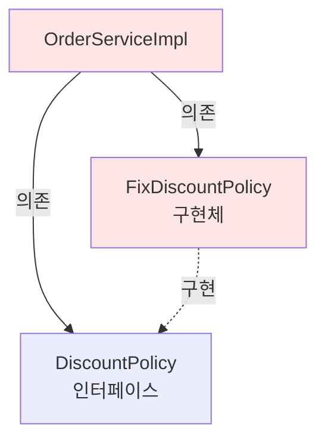

# 2-8. 주문과 할인 도메인 실행과 테스트

## 학습 목표
- 주문 도메인의 동작을 main 메서드와 JUnit으로 테스트한다
- 할인 정책이 올바르게 적용되는지 검증한다
- 테스트를 통해 현재 설계의 문제점을 발견한다
- 객체지향 설계 원칙의 위반 사례를 확인한다

## 연관 개념
- **통합 테스트**: 여러 컴포넌트를 함께 테스트
- **단위 테스트**: 개별 컴포넌트를 독립적으로 테스트
- **Given-When-Then**: BDD 스타일 테스트 작성 패턴
- **OCP/DIP 위반**: 설계 원칙을 위반하는 코드 패턴

---

## TL;DR (간단 요약)

### main 메서드 테스트
```java
OrderService orderService = new OrderServiceImpl();
Order order = orderService.createOrder(1L, "itemA", 10000);
System.out.println(order);  // 수동 확인
```

### JUnit 테스트
```java
@Test
void createOrder() {
    // given
    Member member = new Member(1L, "memberA", Grade.VIP);
    memberService.join(member);

    // when
    Order order = orderService.createOrder(1L, "itemA", 10000);

    // then
    assertThat(order.getDiscountPrice()).isEqualTo(1000);
}
```

### 핵심 발견
**현재 설계의 문제점:**
1. DIP 위반: 구현체에 직접 의존
2. OCP 위반: 할인 정책 변경 시 코드 수정 필요
→ Spring의 DI(의존성 주입)로 해결 예정

---

## 주문과 할인 정책 실행

### OrderApp - 실행 클래스

```java
package hello.core;

import hello.core.member.Grade;
import hello.core.member.Member;
import hello.core.member.MemberService;
import hello.core.member.MemberServiceImpl;
import hello.core.order.Order;
import hello.core.order.OrderService;
import hello.core.order.OrderServiceImpl;

public class OrderApp {

    public static void main(String[] args) {
        MemberService memberService = new MemberServiceImpl();
        OrderService orderService = new OrderServiceImpl();

        Long memberId = 1L;
        Member member = new Member(memberId, "memberA", Grade.VIP);
        memberService.join(member);

        Order order = orderService.createOrder(memberId, "itemA", 10000);

        System.out.println("order = " + order);
        System.out.println("order.calculatePrice = " + order.calculatePrice());
    }
}
```

**파일 위치**: `src/main/java/hello/core/OrderApp.java`

### 실행 결과
```
order = Order{memberId=1, itemName='itemA', itemPrice=10000, discountPrice=1000}
order.calculatePrice = 9000
```

### 코드 설명
1. VIP 회원 생성 및 가입
2. 10,000원짜리 상품 주문
3. VIP 할인 1,000원 적용
4. 최종 가격 9,000원 출력

---

## 주문과 할인 정책 테스트

### OrderServiceTest - JUnit 테스트

```java
package hello.core.order;

import hello.core.member.Grade;
import hello.core.member.Member;
import hello.core.member.MemberService;
import hello.core.member.MemberServiceImpl;
import org.assertj.core.api.Assertions;
import org.junit.jupiter.api.Test;

class OrderServiceTest {

    MemberService memberService = new MemberServiceImpl();
    OrderService orderService = new OrderServiceImpl();

    @Test
    void createOrder() {
        // given
        Long memberId = 1L;
        Member member = new Member(memberId, "memberA", Grade.VIP);
        memberService.join(member);

        // when
        Order order = orderService.createOrder(memberId, "itemA", 10000);

        // then
        Assertions.assertThat(order.getDiscountPrice()).isEqualTo(1000);
    }
}
```

**파일 위치**: `src/test/java/hello/core/order/OrderServiceTest.java`

### 테스트 성공 화면
```
✅ OrderServiceTest > createOrder() PASSED
```

---

## 심화 내용

### 1. 다양한 테스트 케이스

#### VIP 회원 테스트
```java
@Test
@DisplayName("VIP 회원은 1000원 할인을 받는다")
void vipMemberDiscount() {
    // given
    Member vipMember = new Member(1L, "vipUser", Grade.VIP);
    memberService.join(vipMember);

    // when
    Order order = orderService.createOrder(1L, "itemA", 10000);

    // then
    assertThat(order.getDiscountPrice()).isEqualTo(1000);
    assertThat(order.calculatePrice()).isEqualTo(9000);
}
```

#### BASIC 회원 테스트
```java
@Test
@DisplayName("BASIC 회원은 할인을 받지 못한다")
void basicMemberNoDiscount() {
    // given
    Member basicMember = new Member(2L, "basicUser", Grade.BASIC);
    memberService.join(basicMember);

    // when
    Order order = orderService.createOrder(2L, "itemB", 20000);

    // then
    assertThat(order.getDiscountPrice()).isEqualTo(0);
    assertThat(order.calculatePrice()).isEqualTo(20000);
}
```

#### 가격별 테스트 (파라미터화)
```java
@ParameterizedTest
@CsvSource({
    "1000, 1000",   // 1000원 상품 - VIP 할인 1000원
    "5000, 1000",   // 5000원 상품 - VIP 할인 1000원
    "10000, 1000",  // 10000원 상품 - VIP 할인 1000원
    "20000, 1000"   // 20000원 상품 - VIP 할인 1000원 (고정 금액)
})
@DisplayName("VIP 회원은 상품 가격과 무관하게 1000원 할인")
void vipFixedDiscount(int itemPrice, int expectedDiscount) {
    // given
    Member vipMember = new Member(1L, "vipUser", Grade.VIP);
    memberService.join(vipMember);

    // when
    Order order = orderService.createOrder(1L, "item", itemPrice);

    // then
    assertThat(order.getDiscountPrice()).isEqualTo(expectedDiscount);
    assertThat(order.calculatePrice()).isEqualTo(itemPrice - expectedDiscount);
}
```

### 2. 할인 정책 변경 테스트

#### 정률 할인으로 변경 시나리오
```java
@Test
@DisplayName("정률 할인 정책으로 변경")
void changeToRateDiscountPolicy() {
    // ❌ 문제: OrderServiceImpl 코드를 수정해야 함
    // private final DiscountPolicy discountPolicy = new FixDiscountPolicy();
    // →
    // private final DiscountPolicy discountPolicy = new RateDiscountPolicy();

    // 이는 OCP 위반!
}
```

#### 생성자 주입으로 개선한 테스트
```java
@Test
@DisplayName("생성자 주입으로 할인 정책 교체 가능")
void orderWithDifferentDiscountPolicy() {
    // given - 고정 금액 할인
    MemberRepository memberRepository = new MemoryMemberRepository();
    DiscountPolicy fixDiscountPolicy = new FixDiscountPolicy();
    OrderService fixOrderService = new OrderServiceImpl(memberRepository, fixDiscountPolicy);

    Member vipMember = new Member(1L, "vipUser", Grade.VIP);
    memberRepository.save(vipMember);

    // when
    Order order1 = fixOrderService.createOrder(1L, "item", 10000);

    // then
    assertThat(order1.getDiscountPrice()).isEqualTo(1000);

    // given - 정률 할인으로 변경
    DiscountPolicy rateDiscountPolicy = new RateDiscountPolicy();
    OrderService rateOrderService = new OrderServiceImpl(memberRepository, rateDiscountPolicy);

    // when
    Order order2 = rateOrderService.createOrder(1L, "item", 10000);

    // then
    assertThat(order2.getDiscountPrice()).isEqualTo(1000);  // 10% = 1000원

    // OrderServiceImpl 코드는 수정하지 않음!
}
```

### 3. 단위 테스트 vs 통합 테스트

#### 단위 테스트 - FixDiscountPolicy만 테스트
```java
class FixDiscountPolicyTest {

    FixDiscountPolicy discountPolicy = new FixDiscountPolicy();

    @Test
    @DisplayName("VIP는 1000원 할인")
    void vip_discount() {
        // given
        Member vipMember = new Member(1L, "vipUser", Grade.VIP);

        // when
        int discount = discountPolicy.discount(vipMember, 10000);

        // then
        assertThat(discount).isEqualTo(1000);
    }

    @Test
    @DisplayName("VIP가 아니면 할인 없음")
    void no_vip_no_discount() {
        // given
        Member basicMember = new Member(2L, "basicUser", Grade.BASIC);

        // when
        int discount = discountPolicy.discount(basicMember, 10000);

        // then
        assertThat(discount).isEqualTo(0);
    }
}
```

#### 통합 테스트 - 전체 흐름 테스트
```java
@Test
@DisplayName("통합 테스트: 회원 가입부터 주문까지")
void integrationTest() {
    // given
    MemberService memberService = new MemberServiceImpl();
    OrderService orderService = new OrderServiceImpl();

    // 1. 회원 가입
    Member member = new Member(1L, "memberA", Grade.VIP);
    memberService.join(member);

    // 2. 회원 조회 확인
    Member findMember = memberService.findMember(1L);
    assertThat(findMember).isEqualTo(member);

    // 3. 주문 생성
    Order order = orderService.createOrder(1L, "itemA", 10000);

    // 4. 할인 적용 확인
    assertThat(order.getDiscountPrice()).isEqualTo(1000);
    assertThat(order.calculatePrice()).isEqualTo(9000);
}
```

---

## 회원 도메인 설계의 문제점

### 테스트를 통해 발견한 문제들

#### 문제 1: DIP 위반
```java
public class OrderServiceImpl implements OrderService {
    // ❌ 인터페이스와 구현체 모두에 의존
    private final MemberRepository memberRepository = new MemoryMemberRepository();
    private final DiscountPolicy discountPolicy = new FixDiscountPolicy();
}
```

**의존관계 다이어그램:**


**DIP 위반:**
- 추상화(DiscountPolicy)에 의존 ✅
- 구체화(FixDiscountPolicy)에도 의존 ❌

---

#### 문제 2: OCP 위반

**할인 정책 변경 시나리오:**
```java
public class OrderServiceImpl implements OrderService {
    // ❌ 변경 전: 고정 금액 할인
    // private final DiscountPolicy discountPolicy = new FixDiscountPolicy();

    // ❌ 변경 후: 정률 할인 (코드 수정 필요!)
    private final DiscountPolicy discountPolicy = new RateDiscountPolicy();

    // OCP 위반: 기능을 확장하기 위해 클라이언트 코드를 변경해야 함
}
```

**문제점:**
1. `FixDiscountPolicy` → `RateDiscountPolicy` 변경 시 `OrderServiceImpl` 수정 필요
2. 확장에는 열려있지만, 변경에 닫혀있지 않음 (OCP 위반)

---

#### 문제 3: 클래스 의존관계 분석

```java
public class OrderServiceImpl implements OrderService {
    private final MemberRepository memberRepository = new MemoryMemberRepository();
    private final DiscountPolicy discountPolicy = new FixDiscountPolicy();
}
```

**의존 관계:**
```
OrderServiceImpl
├── MemberRepository (인터페이스) 의존
├── MemoryMemberRepository (구현체) 의존  ← DIP 위반
├── DiscountPolicy (인터페이스) 의존
└── FixDiscountPolicy (구현체) 의존  ← DIP 위반
```

**기대하는 의존관계:**
```
OrderServiceImpl
├── MemberRepository (인터페이스만) 의존
└── DiscountPolicy (인터페이스만) 의존
```

---

### 해결 방안 미리보기

#### 인터페이스에만 의존하도록 변경
```java
public class OrderServiceImpl implements OrderService {
    // 인터페이스에만 의존
    private MemberRepository memberRepository;
    private DiscountPolicy discountPolicy;

    // 문제: memberRepository와 discountPolicy가 null
    // → NullPointerException 발생!
}
```

**누가 구현 객체를 생성하고 주입해줘야 하는가?**
→ 이 문제는 다음 챕터에서 **AppConfig**와 **Spring DI**로 해결

---

## Tip

### 테스트 작성 순서
```
1. 단위 테스트 작성 (DiscountPolicy만)
2. 통합 테스트 작성 (OrderService 전체)
3. 엣지 케이스 테스트 (할인 금액 > 상품 가격 등)
```

### @BeforeEach 활용
```java
class OrderServiceTest {
    MemberService memberService;
    OrderService orderService;

    @BeforeEach
    void beforeEach() {
        MemberRepository memberRepository = new MemoryMemberRepository();
        memberService = new MemberServiceImpl(memberRepository);

        DiscountPolicy discountPolicy = new FixDiscountPolicy();
        orderService = new OrderServiceImpl(memberRepository, discountPolicy);
    }

    @Test
    void createOrder() {
        // 테스트 코드
    }
}
```

### 테스트 이름 명명 규칙
```java
// 한글 (권장)
@Test
void VIP회원은_1000원_할인받는다() { }

// 영어
@Test
void vip_member_gets_1000_won_discount() { }

// @DisplayName 사용
@Test
@DisplayName("VIP 회원은 1000원 할인을 받는다")
void test1() { }
```

---

## 주의사항

### 1. 테스트 격리
```java
// ❌ 나쁜 예: static 공유로 테스트 간 영향
class BadOrderServiceTest {
    static MemberService memberService = new MemberServiceImpl();
    static OrderService orderService = new OrderServiceImpl();

    @Test
    void test1() {
        Member member = new Member(1L, "memberA", Grade.VIP);
        memberService.join(member);
        // ...
    }

    @Test
    void test2() {
        // test1의 회원이 남아있음!
        Order order = orderService.createOrder(1L, "item", 10000);
    }
}

// ✅ 좋은 예: 각 테스트마다 새로운 인스턴스
class GoodOrderServiceTest {
    MemberService memberService;
    OrderService orderService;

    @BeforeEach
    void setup() {
        memberService = new MemberServiceImpl();
        orderService = new OrderServiceImpl();
    }

    @Test
    void test1() { }

    @Test
    void test2() { }
}
```

### 2. 할인 금액 검증
```java
@Test
void discountAmountValidation() {
    // given
    Member vipMember = new Member(1L, "vip", Grade.VIP);
    memberService.join(vipMember);

    // when
    Order order = orderService.createOrder(1L, "item", 500);

    // then
    // ⚠️ 주의: 할인 금액(1000원)이 상품 가격(500원)보다 크면?
    assertThat(order.calculatePrice()).isGreaterThanOrEqualTo(0);
}
```

### 3. 회원이 없는 경우
```java
@Test
@DisplayName("존재하지 않는 회원으로 주문 시 null 반환")
void orderWithNonExistentMember() {
    // when
    Order order = orderService.createOrder(999L, "item", 10000);

    // then - 현재는 NullPointerException 발생
    // 개선 필요: 예외 처리 또는 Optional 사용
}
```

---

## 면접 질문

### 초급 - 코드 이해

**Q1. 주문 테스트에서 회원을 먼저 가입시키는 이유는 무엇인가요?**

A: 할인 정책을 적용하려면 회원의 등급 정보가 필요하기 때문입니다.

```java
@Test
void createOrder() {
    // 1. 회원 가입 - 회원 등급 정보 저장
    Member member = new Member(1L, "memberA", Grade.VIP);
    memberService.join(member);

    // 2. 주문 생성 - 회원 등급으로 할인 계산
    Order order = orderService.createOrder(1L, "itemA", 10000);

    // 3. VIP 등급이므로 1000원 할인
    assertThat(order.getDiscountPrice()).isEqualTo(1000);
}
```

주문 서비스는 내부적으로:
1. `memberRepository.findById()`로 회원 조회
2. 조회된 회원의 등급 확인
3. `discountPolicy.discount(member, price)`로 할인 계산

따라서 회원이 먼저 저장되어 있어야 주문을 생성할 수 있습니다.

**Q2. Order 클래스의 toString() 메서드를 오버라이드한 이유는 무엇인가요?**

A: 디버깅과 로깅을 편리하게 하기 위함입니다.

```java
@Override
public String toString() {
    return "Order{" +
            "memberId=" + memberId +
            ", itemName='" + itemName + '\'' +
            ", itemPrice=" + itemPrice +
            ", discountPrice=" + discountPrice +
            '}';
}

// 사용
System.out.println(order);
// 출력: Order{memberId=1, itemName='itemA', itemPrice=10000, discountPrice=1000}
```

toString()이 없으면 `hello.core.order.Order@6d06d69c` 같은 메모리 주소만 출력되어 내용을 알 수 없습니다.

### 중급 - 설계 원칙

**Q3. 현재 OrderServiceImpl이 DIP와 OCP를 위반하는 이유와 그 문제점을 설명해주세요.**

A:
**DIP 위반:**
```java
public class OrderServiceImpl implements OrderService {
    private final DiscountPolicy discountPolicy = new FixDiscountPolicy();
    // DiscountPolicy (추상)와 FixDiscountPolicy (구체) 모두에 의존
}
```

DIP는 "추상화에 의존하고 구체화에 의존하지 말라"는 원칙입니다. 현재 코드는 DiscountPolicy 인터페이스뿐만 아니라 FixDiscountPolicy 구현체에도 직접 의존합니다.

**OCP 위반:**
```java
// 할인 정책 변경 시 OrderServiceImpl 수정 필요
// private final DiscountPolicy discountPolicy = new FixDiscountPolicy();
private final DiscountPolicy discountPolicy = new RateDiscountPolicy();
```

OCP는 "확장에는 열려있고 변경에는 닫혀있어야 한다"는 원칙입니다. 새로운 할인 정책(RateDiscountPolicy)으로 확장하려면 OrderServiceImpl의 코드를 직접 수정해야 하므로 OCP를 위반합니다.

**문제점:**
1. 할인 정책 변경 시마다 OrderServiceImpl 수정 필요
2. 테스트 시 다른 할인 정책으로 교체 불가능
3. 확장성과 유연성 부족

**Q4. 단위 테스트와 통합 테스트의 차이를 설명하고, 각각 언제 사용하는지 설명해주세요.**

A:
**단위 테스트 (Unit Test)**
```java
class FixDiscountPolicyTest {
    FixDiscountPolicy discountPolicy = new FixDiscountPolicy();

    @Test
    void vip_discount() {
        Member vipMember = new Member(1L, "vip", Grade.VIP);
        int discount = discountPolicy.discount(vipMember, 10000);
        assertThat(discount).isEqualTo(1000);
    }
}
```

**특징:**
- 하나의 컴포넌트만 독립적으로 테스트
- 의존성이 없거나 Mock으로 대체
- 빠른 실행 속도
- 문제 발생 시 원인 파악 쉬움

**통합 테스트 (Integration Test)**
```java
class OrderServiceTest {
    @Test
    void createOrder() {
        MemberService memberService = new MemberServiceImpl();
        OrderService orderService = new OrderServiceImpl();

        Member member = new Member(1L, "memberA", Grade.VIP);
        memberService.join(member);  // 여러 컴포넌트 협력

        Order order = orderService.createOrder(1L, "itemA", 10000);
        assertThat(order.getDiscountPrice()).isEqualTo(1000);
    }
}
```

**특징:**
- 여러 컴포넌트가 함께 동작하는지 테스트
- 실제 환경과 유사한 테스트
- 느린 실행 속도
- 문제 발생 시 원인 파악이 어려울 수 있음

**사용 시기:**
- 단위 테스트: 비즈니스 로직 검증, 빠른 피드백 필요 시
- 통합 테스트: 컴포넌트 간 협력 검증, 전체 시나리오 테스트

**테스트 피라미드:**
```
       /\
      /E2E\     (적음)
     /------\
    /통합테스트\  (중간)
   /----------\
  /  단위테스트  \ (많음)
 /--------------\
```

### 고급 - 문제 해결

**Q5. DIP와 OCP 위반 문제를 해결하기 위한 방법들을 제시하고, 각각의 장단점을 설명해주세요.**

A: DIP와 OCP 위반 문제를 해결하는 여러 방법이 있습니다.

#### 1. AppConfig를 이용한 수동 DI

```java
// AppConfig: 애플리케이션 설정과 구성
public class AppConfig {

    public MemberService memberService() {
        return new MemberServiceImpl(memberRepository());
    }

    public OrderService orderService() {
        return new OrderServiceImpl(memberRepository(), discountPolicy());
    }

    public MemberRepository memberRepository() {
        return new MemoryMemberRepository();
    }

    public DiscountPolicy discountPolicy() {
        // return new FixDiscountPolicy();
        return new RateDiscountPolicy();  // 여기만 변경
    }
}

// OrderServiceImpl: 인터페이스에만 의존
public class OrderServiceImpl implements OrderService {
    private final MemberRepository memberRepository;
    private final DiscountPolicy discountPolicy;

    // 생성자 주입
    public OrderServiceImpl(MemberRepository memberRepository, DiscountPolicy discountPolicy) {
        this.memberRepository = memberRepository;
        this.discountPolicy = discountPolicy;
    }
}

// 사용
AppConfig appConfig = new AppConfig();
OrderService orderService = appConfig.orderService();
```

**장점:**
- DIP 준수: OrderServiceImpl이 인터페이스에만 의존
- OCP 준수: 할인 정책 변경 시 AppConfig만 수정
- 단일 책임: OrderServiceImpl은 비즈니스 로직만, AppConfig는 구성만 담당

**단점:**
- 수동으로 의존관계 설정
- 객체 생성 코드가 복잡해질 수 있음

---

#### 2. Spring Framework의 DI 컨테이너

```java
// Spring 설정 클래스
@Configuration
public class AppConfig {

    @Bean
    public MemberService memberService() {
        return new MemberServiceImpl(memberRepository());
    }

    @Bean
    public OrderService orderService() {
        return new OrderServiceImpl(memberRepository(), discountPolicy());
    }

    @Bean
    public MemberRepository memberRepository() {
        return new MemoryMemberRepository();
    }

    @Bean
    public DiscountPolicy discountPolicy() {
        return new RateDiscountPolicy();
    }
}

// OrderServiceImpl: 동일
public class OrderServiceImpl implements OrderService {
    private final MemberRepository memberRepository;
    private final DiscountPolicy discountPolicy;

    public OrderServiceImpl(MemberRepository memberRepository, DiscountPolicy discountPolicy) {
        this.memberRepository = memberRepository;
        this.discountPolicy = discountPolicy;
    }
}

// 사용
ApplicationContext ac = new AnnotationConfigApplicationContext(AppConfig.class);
OrderService orderService = ac.getBean(OrderService.class);
```

**장점:**
- 자동 의존성 주입
- 싱글톤 관리
- AOP, 트랜잭션 등 부가 기능 제공
- 객체 생명주기 관리

**단점:**
- Spring 프레임워크 의존성 추가
- 초기 러닝커브

---

#### 3. @Autowired를 이용한 자동 주입

```java
@Component
public class OrderServiceImpl implements OrderService {
    private final MemberRepository memberRepository;
    private final DiscountPolicy discountPolicy;

    @Autowired
    public OrderServiceImpl(MemberRepository memberRepository, DiscountPolicy discountPolicy) {
        this.memberRepository = memberRepository;
        this.discountPolicy = discountPolicy;
    }
}

@Component
public class MemoryMemberRepository implements MemberRepository { }

@Component
public class RateDiscountPolicy implements DiscountPolicy { }

// Spring Boot 사용 시 설정 클래스
@SpringBootApplication
@ComponentScan(basePackages = "hello.core")
public class CoreApplication {
    public static void main(String[] args) {
        SpringApplication.run(CoreApplication.class, args);
    }
}
```

**장점:**
- 설정 코드 최소화
- 자동으로 의존관계 주입
- 타입 기반 자동 매칭

**단점:**
- 어떤 구현체가 주입되는지 코드만으로 파악 어려움
- 같은 타입의 빈이 여러 개면 충돌

---

#### 4. 팩토리 패턴 + 전략 패턴

```java
// 할인 정책 팩토리
public class DiscountPolicyFactory {
    private static final String DEFAULT_POLICY = "rate";

    public static DiscountPolicy createPolicy() {
        return createPolicy(DEFAULT_POLICY);
    }

    public static DiscountPolicy createPolicy(String policyType) {
        switch (policyType) {
            case "fix":
                return new FixDiscountPolicy();
            case "rate":
                return new RateDiscountPolicy();
            case "none":
                return new NoDiscountPolicy();
            default:
                throw new IllegalArgumentException("Unknown policy: " + policyType);
        }
    }
}

// OrderServiceImpl
public class OrderServiceImpl implements OrderService {
    private final MemberRepository memberRepository;
    private final DiscountPolicy discountPolicy;

    public OrderServiceImpl() {
        this.memberRepository = new MemoryMemberRepository();
        this.discountPolicy = DiscountPolicyFactory.createPolicy();
    }

    // 또는 외부에서 정책 타입 전달
    public OrderServiceImpl(String discountPolicyType) {
        this.memberRepository = new MemoryMemberRepository();
        this.discountPolicy = DiscountPolicyFactory.createPolicy(discountPolicyType);
    }
}
```

**장점:**
- 객체 생성 로직 캡슐화
- 런타임에 정책 변경 가능

**단점:**
- 여전히 구체 클래스(MemoryMemberRepository)에 의존
- 팩토리 클래스 관리 필요

---

#### 5. Service Locator 패턴

```java
// 서비스 레지스트리
public class ServiceLocator {
    private static final Map<Class<?>, Object> services = new HashMap<>();

    static {
        services.put(MemberRepository.class, new MemoryMemberRepository());
        services.put(DiscountPolicy.class, new RateDiscountPolicy());
    }

    @SuppressWarnings("unchecked")
    public static <T> T getService(Class<T> serviceClass) {
        return (T) services.get(serviceClass);
    }

    public static void registerService(Class<?> serviceClass, Object service) {
        services.put(serviceClass, service);
    }
}

// OrderServiceImpl
public class OrderServiceImpl implements OrderService {
    private final MemberRepository memberRepository;
    private final DiscountPolicy discountPolicy;

    public OrderServiceImpl() {
        this.memberRepository = ServiceLocator.getService(MemberRepository.class);
        this.discountPolicy = ServiceLocator.getService(DiscountPolicy.class);
    }
}
```

**장점:**
- 중앙 집중식 의존성 관리
- 런타임에 서비스 교체 가능

**단점:**
- 숨겨진 의존성 (코드만 보고 파악 어려움)
- 테스트 어려움
- 전역 상태 관리 (안티패턴으로 간주됨)

---

#### 비교 및 권장 사항

| 방법 | DIP | OCP | 복잡도 | 테스트 | 권장 |
|-----|-----|-----|--------|--------|------|
| AppConfig (순수 Java) | ✅ | ✅ | 낮음 | 쉬움 | ⭐⭐⭐ |
| Spring DI | ✅ | ✅ | 중간 | 쉬움 | ⭐⭐⭐⭐⭐ |
| @Autowired | ✅ | ✅ | 낮음 | 쉬움 | ⭐⭐⭐⭐ |
| Factory Pattern | △ | ✅ | 중간 | 보통 | ⭐⭐ |
| Service Locator | △ | ✅ | 높음 | 어려움 | ⭐ |

**권장 순서:**
1. **Spring Framework 사용 프로젝트**: Spring DI (권장)
2. **순수 Java 프로젝트**: AppConfig 패턴
3. **Spring Boot + 자동 설정**: @Autowired + @ComponentScan
4. **특수한 경우**: Factory Pattern (런타임 전략 변경 필요 시)
5. **사용 금지**: Service Locator (안티패턴)

---

## 전체 요약

주문과 할인 도메인 테스트를 통해 **설계의 문제점**을 발견했습니다.

### 테스트 결과
- VIP 회원은 1000원 할인 ✅
- BASIC 회원은 할인 없음 ✅
- 주문 생성과 가격 계산 정상 동작 ✅

### 발견한 문제점
1. **DIP 위반**: OrderServiceImpl이 구현체(FixDiscountPolicy)에 직접 의존
2. **OCP 위반**: 할인 정책 변경 시 OrderServiceImpl 코드 수정 필요
3. **유연성 부족**: 테스트 시 할인 정책 교체 불가능

### 해결 방향
```
문제: OrderServiceImpl이 구현체를 직접 생성

해결책:
1. 인터페이스에만 의존하도록 코드 변경
2. 누군가가 구현 객체를 생성하고 주입
   → AppConfig (순수 Java)
   → Spring Container (Spring Framework)
```

---

## 학습 체크리스트
- [ ] 주문 도메인을 main 메서드와 JUnit으로 테스트할 수 있다
- [ ] 할인 정책이 올바르게 적용되는지 검증할 수 있다
- [ ] 현재 설계의 DIP 위반 문제를 이해했다
- [ ] 현재 설계의 OCP 위반 문제를 이해했다
- [ ] 의존성 주입(DI)의 필요성을 이해했다

---

## 다음 학습
다음 챕터에서는 **객체 지향 원리를 적용**하여 현재 설계를 개선합니다.
- AppConfig 도입으로 관심사의 분리
- 생성자 주입을 통한 DIP 준수
- 할인 정책 변경 시 OCP 준수 확인
- Spring Container로 전환

**3. 스프링 핵심 원리 이해2 - 객체 지향 원리 적용** 에서 계속됩니다.

---

## 📚 참고자료
- [JUnit 5 User Guide](https://junit.org/junit5/docs/current/user-guide/)
- [AssertJ Core Documentation](https://assertj.github.io/doc/)
- [Clean Code - Robert C. Martin](http://www.yes24.com/Product/Goods/11681152) - 테스트 코드 작성법
- [리팩토링 2판 - 마틴 파울러](http://www.yes24.com/Product/Goods/89649360) - DIP/OCP 위반 리팩토링
- [테스트 주도 개발 - Kent Beck](http://www.yes24.com/Product/Goods/12246033)
- [오브젝트 - 조영호](http://www.yes24.com/Product/Goods/74219491) - 의존성 관리
