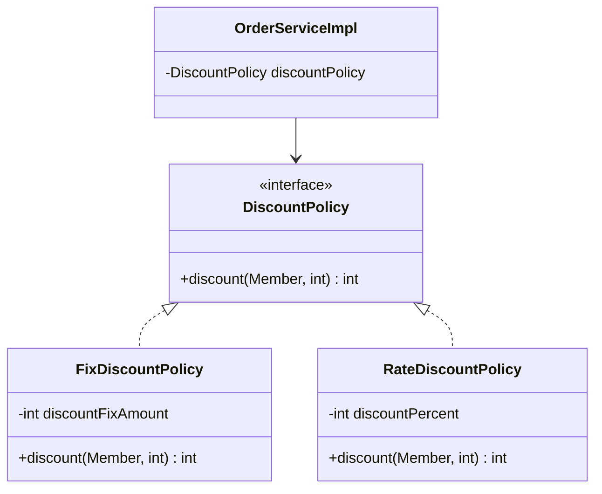

# 3-1. 새로운 할인 정책 개발

**출처**: 인프런 - 스프링 핵심 원리 기본편
**챕터**: 3. 스프링 핵심 원리 이해2 - 객체 지향 원리 적용

---

## 학습 목표

- [ ] 새로운 정률 할인 정책을 구현할 수 있다
- [ ] 테스트 주도 개발(TDD) 방식으로 코드를 작성할 수 있다
- [ ] 다형성을 활용한 정책 확장 방법을 이해한다

---

## 새로운 요구사항

### 기획 변경 사항

**악덕 기획자의 요청**:
> "서비스 오픈 직전에 할인 정책을 지금처럼 고정 금액 할인이 아니라 좀 더 합리적인 주문 금액당 할인하는 **정률% 할인**으로 변경하고 싶어요!"

**예시**:
- 기존 정책(FixDiscountPolicy): VIP가 10,000원을 주문하든 20,000원을 주문하든 항상 1,000원 할인
- 새로운 정책(RateDiscountPolicy): 10%로 지정하면 10,000원 주문 시 1,000원, 20,000원 주문 시 2,000원 할인

### 개발자와 기획자의 대화

**순진 개발자**: "제가 처음부터 고정 금액 할인은 아니라고 했잖아요."

**악덕 기획자**: "애자일 소프트웨어 개발 선언 몰라요? **'계획을 따르기보다 변화에 대응하기를'**"

**순진 개발자**: "... (하지만 난 유연한 설계가 가능하도록 객체지향 설계 원칙을 준수했지 후후)"

> 📖 **참고**: [애자일 소프트웨어 개발 선언](https://agilemanifesto.org/iso/ko/manifesto.html)

---

## RateDiscountPolicy 구현

### 클래스 다이어그램



### 코드 구현

**RateDiscountPolicy.java**:

```java
package hello.core.discount;

import hello.core.member.Grade;
import hello.core.member.Member;

public class RateDiscountPolicy implements DiscountPolicy {

    private int discountPercent = 10; // 10% 할인

    @Override
    public int discount(Member member, int price) {
        if (member.getGrade() == Grade.VIP) {
            return price * discountPercent / 100;
        } else {
            return 0;
        }
    }
}
```

**핵심 로직**:
- VIP 회원: `price * 10 / 100` (10% 할인)
- 일반 회원: `0` (할인 없음)

---

## 테스트 작성

### 테스트 코드

**RateDiscountPolicyTest.java**:

```java
package hello.core.discount;

import hello.core.member.Grade;
import hello.core.member.Member;
import org.junit.jupiter.api.DisplayName;
import org.junit.jupiter.api.Test;

import static org.assertj.core.api.Assertions.*;

class RateDiscountPolicyTest {

    RateDiscountPolicy discountPolicy = new RateDiscountPolicy();

    @Test
    @DisplayName("VIP는 10% 할인이 적용되어야 한다.")
    void vip_o() {
        // given
        Member member = new Member(1L, "memberVIP", Grade.VIP);

        // when
        int discount = discountPolicy.discount(member, 10000);

        // then
        assertThat(discount).isEqualTo(1000);
    }

    @Test
    @DisplayName("VIP가 아니면 할인이 적용되지 않아야 한다.")
    void vip_x() {
        // given
        Member member = new Member(2L, "memberBASIC", Grade.BASIC);

        // when
        int discount = discountPolicy.discount(member, 10000);

        // then
        assertThat(discount).isEqualTo(0);
    }
}
```

### 테스트 결과

✅ **테스트 통과**:
- VIP 회원 10,000원 주문 → 1,000원 할인
- 일반 회원 10,000원 주문 → 0원 할인

---

## 💡 핵심 포인트

### 다형성의 활용

**인터페이스 기반 설계의 장점**:
- ✅ 새로운 할인 정책(`RateDiscountPolicy`) 추가는 쉬움
- ✅ 기존 코드(`DiscountPolicy` 인터페이스)는 변경 없음
- ✅ 테스트 코드 작성이 간단함

### 그런데...

**정말 문제가 없을까?**
- 새로운 정책을 **실제로 적용**할 때는 어떻게 될까?
- 정말 객체지향 설계 원칙을 잘 준수한 것일까?

> ⚠️ **다음 섹션에서 문제점 발견!**

---

## 정리

### 이번 섹션에서 배운 것

1. **요구사항 변경**: 고정 금액 할인 → 정률 할인
2. **정률 할인 정책 구현**: `RateDiscountPolicy` 클래스 작성
3. **테스트 작성**: 성공/실패 케이스 모두 검증

### 다형성 덕분에...

- 새로운 할인 정책 **추가 자체**는 문제없음
- 인터페이스를 구현하기만 하면 됨
- 기존 코드는 변경할 필요 없음

### 하지만...

**실제 적용 단계에서 문제가 발생합니다!**

다음 섹션에서 어떤 문제가 있는지 확인해봅시다.

---

## 다음 학습

➡️ **[3-2. 새로운 할인 정책 적용과 문제점](./3-2-새로운할인정책적용과문제점.md)**
- 할인 정책을 실제로 적용하면서 발생하는 문제
- DIP, OCP 위반 발견
- 왜 클라이언트 코드를 변경해야 하는가?
