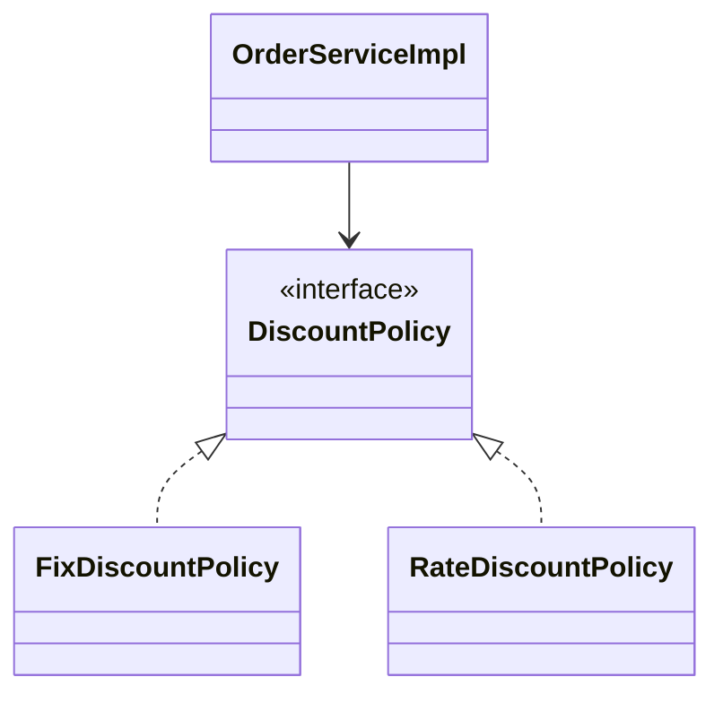
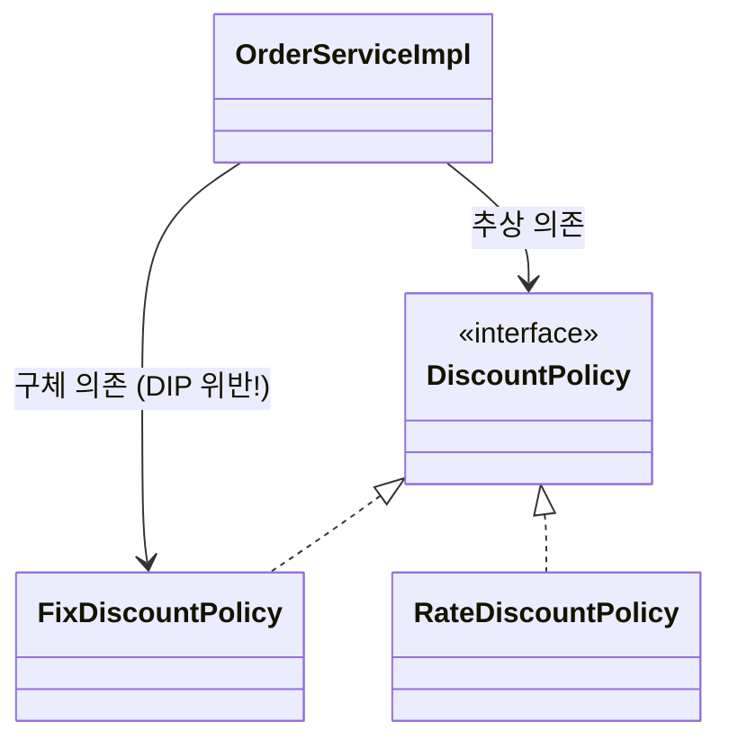
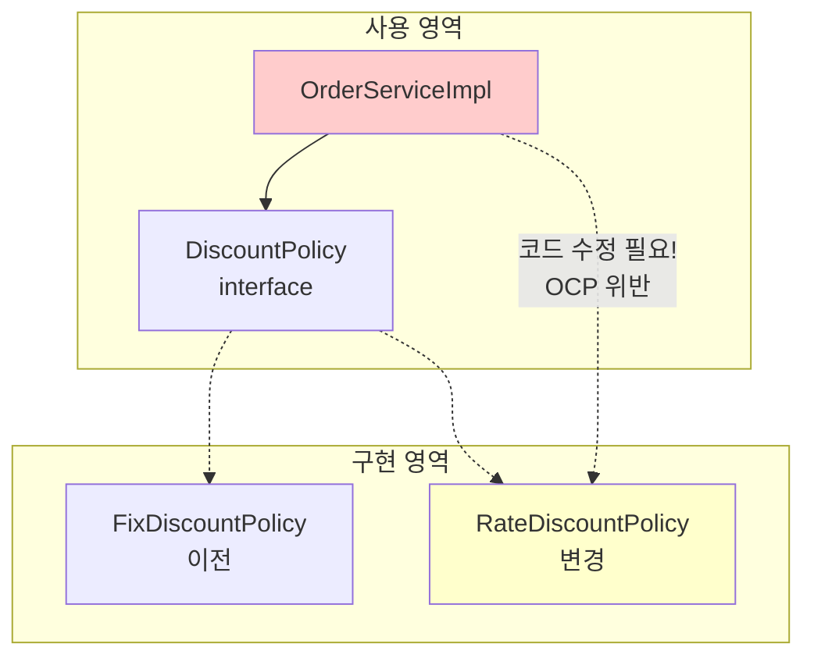
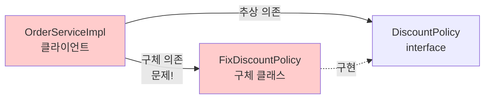
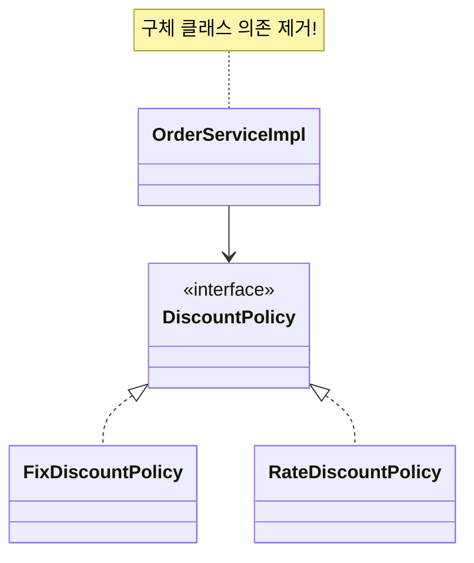

# 3-2. 새로운 할인 정책 적용과 문제점

**출처**: 인프런 - 스프링 핵심 원리 기본편
**챕터**: 3. 스프링 핵심 원리 이해2 - 객체 지향 원리 적용

---

## 학습 목표

- [ ] 할인 정책 적용 시 발생하는 문제점을 파악할 수 있다
- [ ] DIP(의존관계 역전 원칙) 위반 사례를 이해한다
- [ ] OCP(개방-폐쇄 원칙) 위반 사례를 이해한다
- [ ] 다형성만으로는 OCP, DIP를 지킬 수 없음을 깨닫는다

---

## 할인 정책 적용하기

### 기존 코드 변경

**OrderServiceImpl 수정**:

```java
public class OrderServiceImpl implements OrderService {

    // 기존: 고정 금액 할인
    // private final DiscountPolicy discountPolicy = new FixDiscountPolicy();

    // 변경: 정률 할인
    private final DiscountPolicy discountPolicy = new RateDiscountPolicy();
}
```

### 문제 발견!

**우리가 기대했던 것**:
> "역할과 구현을 충실하게 분리했으니 괜찮을 거야!"

**실제 상황**:
> ❌ 클라이언트 코드(`OrderServiceImpl`)를 변경해야 함
> ❌ SOLID 원칙을 위반하고 있었음

---

## 문제점 분석

### ✅ 잘한 것들

1. **역할과 구현 충실히 분리** ✅
   - 인터페이스(`DiscountPolicy`)와 구현 클래스 분리

2. **다형성 활용** ✅
   - 인터페이스와 구현 객체 분리

3. **OCP, DIP 같은 객체지향 설계 원칙 준수?** ❌
   - 그렇게 보이지만... **사실은 아니다!**

---

### ❌ DIP 위반 - 의존관계 역전 원칙

**DIP 원칙**:
> "프로그래머는 추상화에 의존해야지, 구체화에 의존하면 안된다."

#### 기대했던 의존관계



> "단순히 `DiscountPolicy` 인터페이스만 의존한다고 생각했다."

#### 실제 의존관계



**문제점**:
- `OrderServiceImpl`이 `DiscountPolicy` **인터페이스**에 의존 ✅
- 동시에 `FixDiscountPolicy` **구체 클래스**에도 의존 ❌

**코드로 확인**:
```java
public class OrderServiceImpl implements OrderService {

    // 추상(인터페이스) 의존: DiscountPolicy
    private final DiscountPolicy discountPolicy

    // 구체(구현) 클래스 의존: FixDiscountPolicy - DIP 위반!
        = new FixDiscountPolicy();
}
```

---

### ❌ OCP 위반 - 개방-폐쇄 원칙

**OCP 원칙**:
> "소프트웨어 요소는 확장에는 열려 있으나 변경에는 닫혀 있어야 한다."

#### 정책 변경 시나리오



**문제점**:
- 기능을 **확장**(새로운 할인 정책 추가)했을 때
- 클라이언트 코드를 **변경**해야 함
- **OCP 위반!**

**코드 변경 필요**:
```java
// 소스 코드를 직접 수정해야 함!
// private final DiscountPolicy discountPolicy = new FixDiscountPolicy();
private final DiscountPolicy discountPolicy = new RateDiscountPolicy();
```

---

## 왜 클라이언트 코드를 변경해야 할까?

### 의존관계 다이어그램으로 분석

#### 실제 의존관계



**문제의 근본 원인**:
- 클라이언트(`OrderServiceImpl`)가 인터페이스와 구현 클래스를 **동시에 의존**
- 구체 클래스를 변경할 때 클라이언트 코드도 함께 변경 필요

---

## 해결 방안 모색

### 시도 1: 인터페이스에만 의존하도록 변경

**코드 수정**:
```java
public class OrderServiceImpl implements OrderService {

    // 인터페이스에만 의존 - DIP 준수!
    private DiscountPolicy discountPolicy;
}
```

**의존관계 다이어그램**:


**인터페이스에만 의존하도록 설계 변경**:
- ✅ DIP 준수
- ✅ 구체 클래스를 전혀 모름

### 새로운 문제 발생!

**실행 결과**:
```
NullPointerException (NPE) 발생!
```

**문제점**:
- 구현체가 없으므로 코드 실행 불가
- `discountPolicy`가 `null` 상태

---

## 해결책

### 누군가가 필요하다

**문제 정의**:
> 이 문제를 해결하려면 **누군가**가 클라이언트인 `OrderServiceImpl`에게 `DiscountPolicy`의 구현 객체를 대신 생성하고 주입해주어야 한다.

**필요한 것**:
- 구현 객체를 생성하는 **외부의 누군가**
- 클라이언트에게 의존관계를 주입하는 **외부의 누군가**

> 💡 이것이 바로 다음 섹션의 **관심사의 분리**!

---

## 💡 핵심 깨달음

### 다형성만으로는 부족하다

**우리가 배운 것**:
1. ❌ 다형성만으로는 OCP, DIP를 지킬 수 없음
2. ❌ 클라이언트 코드가 구체 클래스를 직접 선택하면 DIP 위반
3. ❌ 구현 객체 변경 시 클라이언트 코드 변경 필요 = OCP 위반

### 근본적인 문제

**`OrderServiceImpl`의 책임이 너무 많음**:
1. 주문 로직 실행 (자신의 역할) ✅
2. 할인 정책 구현 객체 선택 (남의 역할) ❌
3. 할인 정책 구현 객체 생성 (남의 역할) ❌

---

## 정리

### 문제점 요약

| 원칙 | 위반 내용 | 결과 |
|------|----------|------|
| **DIP** | 추상화 + 구체화 모두 의존 | 구현체 변경 시 클라이언트 코드 수정 필요 |
| **OCP** | 확장 시 클라이언트 코드 변경 | 변경에 닫혀있지 않음 |

### 해결 방향

**필요한 것**:
- 구현 객체를 생성하고 주입해주는 **외부의 존재**
- 클라이언트는 실행에만 집중
- 이것이 바로 **관심사의 분리**

---

## 면접 질문

**Q. 다형성만 있으면 OCP, DIP를 지킬 수 있나요?**

<details>
<summary>답안 보기</summary>

**답안**: 아니오, 다형성만으로는 OCP와 DIP를 지킬 수 없습니다.

**이유**:
- 클라이언트가 구현 클래스를 직접 선택(`new FixDiscountPolicy()`)하면 구체 클래스에 의존하게 됨 (DIP 위반)
- 구현 클래스 변경 시 클라이언트 코드도 변경해야 함 (OCP 위반)

**해결책**:
- 외부에서 구현 객체를 생성하고 주입하는 **DI(의존관계 주입)** 필요
- AppConfig 같은 **구성 영역**이 필요

</details>

---

## 다음 학습

➡️ **[3-3. 관심사의 분리](./3-3-관심사의분리.md)**
- 애플리케이션을 공연에 비유
- 공연 기획자(AppConfig) 등장
- 생성자 주입을 통한 의존관계 주입
