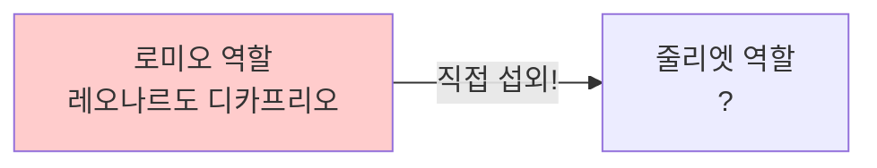
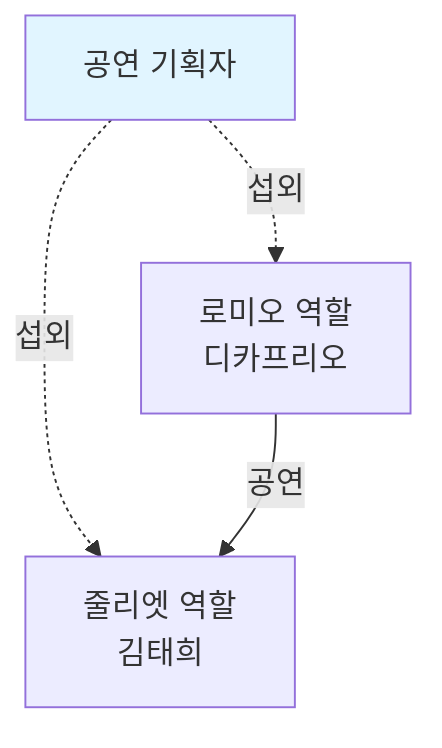
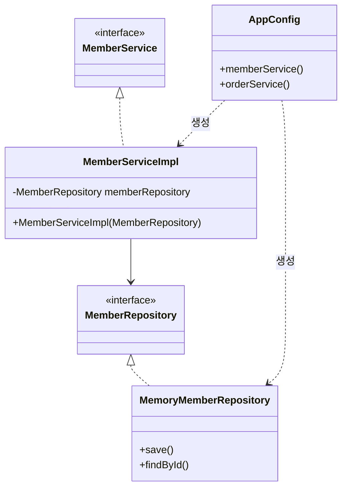

# 3-3. 관심사의 분리

**출처**: 인프런 - 스프링 핵심 원리 기본편
**챕터**: 3. 스프링 핵심 원리 이해2 - 객체 지향 원리 적용

---

## 학습 목표

- [ ] 관심사의 분리 개념을 이해한다
- [ ] AppConfig의 역할과 필요성을 설명할 수 있다
- [ ] 생성자 주입 방식을 구현할 수 있다
- [ ] DI(의존관계 주입) 개념을 이해한다

---

## 애플리케이션을 공연으로 비유하기

### 잘못된 설계 (현재 상황)

**로미오와 줄리엣 공연 예시**:



**문제점**:
- 로미오 역할(인터페이스)을 하는 디카프리오(구현체, 배우)가
- 줄리엣 역할(인터페이스)을 할 여배우(구현체, 배우)를 **직접 초빙**
- 배우가 **공연도 하고, 섭외도 하는** 다양한 책임을 가짐

### 올바른 설계 (개선 방향)

**공연 기획자의 역할**:



**개선된 점**:
- 배우는 본인의 **역할(배역)을 수행하는 것에만 집중**
- 디카프리오는 어떤 여자 주인공이 선택되더라도 **똑같이 공연 가능**
- **공연 기획자**가 담당 배우를 섭외하고, 역할에 맞는 배우를 지정

---

## 관심사 분리하기

### 필요한 것

**공연 기획자처럼**:
- 공연을 구성하고
- 담당 배우를 섭외하고
- 역할에 맞는 배우를 지정하는
- **별도의 책임을 담당하는 존재**

### AppConfig 등장

**역할**:
- 애플리케이션의 전체 동작 방식을 **구성(config)**
- **구현 객체를 생성**하고, **연결**하는 책임을 가지는 별도의 설정 클래스

---

## AppConfig 구현

### AppConfig 코드

**AppConfig.java**:

```java
package hello.core;

import hello.core.discount.FixDiscountPolicy;
import hello.core.member.MemberService;
import hello.core.member.MemberServiceImpl;
import hello.core.member.MemoryMemberRepository;
import hello.core.order.OrderService;
import hello.core.order.OrderServiceImpl;

public class AppConfig {

    public MemberService memberService() {
        return new MemberServiceImpl(new MemoryMemberRepository());
    }

    public OrderService orderService() {
        return new OrderServiceImpl(
            new MemoryMemberRepository(),
            new FixDiscountPolicy()
        );
    }
}
```

### AppConfig의 역할

**1. 구현 객체 생성**:
- `MemberServiceImpl`
- `MemoryMemberRepository`
- `OrderServiceImpl`
- `FixDiscountPolicy`

**2. 생성자를 통해 의존관계 주입(연결)**:
- `MemberServiceImpl` → `MemoryMemberRepository`
- `OrderServiceImpl` → `MemoryMemberRepository`, `FixDiscountPolicy`

---

## 생성자 주입 적용

### MemberServiceImpl 변경

**변경 전 - 직접 생성**:
```java
public class MemberServiceImpl implements MemberService {

    // 구체 클래스를 직접 생성 - DIP 위반!
    private final MemberRepository memberRepository
        = new MemoryMemberRepository();

    public void join(Member member) {
        memberRepository.save(member);
    }

    public Member findMember(Long memberId) {
        return memberRepository.findById(memberId);
    }
}
```

**변경 후 - 생성자 주입**:
```java
package hello.core.member;

public class MemberServiceImpl implements MemberService {

    // 인터페이스에만 의존 - DIP 준수!
    private final MemberRepository memberRepository;

    // 생성자를 통해 구현 객체 주입
    public MemberServiceImpl(MemberRepository memberRepository) {
        this.memberRepository = memberRepository;
    }

    public void join(Member member) {
        memberRepository.save(member);
    }

    public Member findMember(Long memberId) {
        return memberRepository.findById(memberId);
    }
}
```

**개선 효과**:
- ✅ `MemoryMemberRepository`를 의존하지 않음
- ✅ `MemberRepository` 인터페이스만 의존
- ✅ 어떤 구현 객체가 주입될지는 외부(`AppConfig`)에서 결정
- ✅ **의존관계에 대한 고민은 외부에 맡기고 실행에만 집중**

---

### OrderServiceImpl 변경

**변경 후 - 생성자 주입**:
```java
package hello.core.order;

import hello.core.discount.DiscountPolicy;
import hello.core.member.Member;
import hello.core.member.MemberRepository;

public class OrderServiceImpl implements OrderService {

    // 인터페이스에만 의존 - DIP 준수!
    private final MemberRepository memberRepository;
    private final DiscountPolicy discountPolicy;

    // 생성자를 통해 구현 객체 주입
    public OrderServiceImpl(MemberRepository memberRepository,
                           DiscountPolicy discountPolicy) {
        this.memberRepository = memberRepository;
        this.discountPolicy = discountPolicy;
    }

    @Override
    public Order createOrder(Long memberId, String itemName, int itemPrice) {
        Member member = memberRepository.findById(memberId);
        int discountPrice = discountPolicy.discount(member, itemPrice);

        return new Order(memberId, itemName, itemPrice, discountPrice);
    }
}
```

**개선 효과**:
- ✅ `FixDiscountPolicy`를 의존하지 않음
- ✅ `DiscountPolicy` 인터페이스만 의존
- ✅ 어떤 구현 객체가 주입될지는 외부에서 결정
- ✅ **실행에만 집중**

---

## 클래스 다이어그램

### 전체 구조



**역할 분리**:
- `AppConfig`: 객체 생성과 연결
- `MemberServiceImpl`: 실행 (비즈니스 로직)

---

## 객체 인스턴스 다이어그램

### 회원 객체 인스턴스

```mermaid
graph TB
    A[appConfig]
    B[memoryMemberRepository<br/>x001]
    C[memberServiceImpl]

    A -.1. 생성.-> B
    A -.2. 생성 + 주입<br/>memoryMemberRepository x001.-> C
    C --> B

    style A fill:#e1f5ff
    style B fill:#fff5e1
    style C fill:#f5e1ff
```

**흐름**:
1. `appConfig`가 `memoryMemberRepository` 객체 생성
2. `appConfig`가 `memberServiceImpl` 생성하면서 생성자로 `memoryMemberRepository` 참조값 전달
3. `memberServiceImpl` 입장에서는 의존관계를 외부에서 주입받는 것

---

## DI (Dependency Injection)

### 의존관계 주입

**클라이언트 입장에서**:
- `memberServiceImpl` 입장에서 보면
- 의존관계를 마치 **외부에서 주입해주는 것** 같음

**용어**:
- **DI (Dependency Injection)**
- 우리말로 **의존관계 주입** 또는 **의존성 주입**

---

## AppConfig 실행

### MemberApp 변경

**변경 전**:
```java
public class MemberApp {
    public static void main(String[] args) {
        MemberService memberService = new MemberServiceImpl();
        // ...
    }
}
```

**변경 후**:
```java
package hello.core;

import hello.core.member.Grade;
import hello.core.member.Member;
import hello.core.member.MemberService;

public class MemberApp {

    public static void main(String[] args) {
        // AppConfig를 통해 MemberService 조회
        AppConfig appConfig = new AppConfig();
        MemberService memberService = appConfig.memberService();

        Member member = new Member(1L, "memberA", Grade.VIP);
        memberService.join(member);

        Member findMember = memberService.findMember(1L);
        System.out.println("new member = " + member.getName());
        System.out.println("find Member = " + findMember.getName());
    }
}
```

---

### OrderApp 변경

**변경 후**:
```java
package hello.core;

import hello.core.member.Grade;
import hello.core.member.Member;
import hello.core.member.MemberService;
import hello.core.order.Order;
import hello.core.order.OrderService;

public class OrderApp {

    public static void main(String[] args) {
        // AppConfig를 통해 Service 조회
        AppConfig appConfig = new AppConfig();
        MemberService memberService = appConfig.memberService();
        OrderService orderService = appConfig.orderService();

        long memberId = 1L;
        Member member = new Member(memberId, "memberA", Grade.VIP);
        memberService.join(member);

        Order order = orderService.createOrder(memberId, "itemA", 10000);

        System.out.println("order = " + order);
    }
}
```

---

### 테스트 코드 수정

**MemberServiceTest**:
```java
class MemberServiceTest {

    MemberService memberService;

    @BeforeEach
    public void beforeEach() {
        AppConfig appConfig = new AppConfig();
        memberService = appConfig.memberService();
    }

    // 테스트 메서드...
}
```

**OrderServiceTest**:
```java
class OrderServiceTest {

    MemberService memberService;
    OrderService orderService;

    @BeforeEach
    public void beforeEach() {
        AppConfig appConfig = new AppConfig();
        memberService = appConfig.memberService();
        orderService = appConfig.orderService();
    }

    // 테스트 메서드...
}
```

**`@BeforeEach`**:
- 각 테스트를 실행하기 전에 호출됨
- AppConfig를 통해 서비스 객체 생성

---

## 💡 핵심 정리

### 관심사의 분리

**배역과 배우의 비유**:

| 역할 | 책임 | 비유 |
|------|------|------|
| **AppConfig** | - 구현 객체 생성<br/>- 의존관계 연결<br/>- 전체 구성 책임 | 공연 기획자 |
| **ServiceImpl** | - 자신의 기능 실행<br/>- 실행에만 집중 | 배우 |

### DIP 완성

**MemberServiceImpl**:
- ✅ `MemoryMemberRepository`를 의존하지 않음
- ✅ `MemberRepository` 인터페이스만 의존
- ✅ 구체 클래스를 몰라도 됨

### 관심사의 분리

**역할 분리**:
- ✅ 객체를 생성하고 연결하는 역할: `AppConfig`
- ✅ 실행하는 역할: `MemberServiceImpl`, `OrderServiceImpl`
- ✅ 관심사가 명확히 분리됨

---

## 정리

### AppConfig를 통한 개선

**Before**:
```java
// ServiceImpl이 직접 생성 - 책임 과다
private final MemberRepository memberRepository
    = new MemoryMemberRepository();
```

**After**:
```java
// AppConfig가 생성하여 주입 - 책임 분리
public MemberServiceImpl(MemberRepository memberRepository) {
    this.memberRepository = memberRepository;
}
```

### 이제 각 배우들은...

- 담당 **기능을 실행하는 책임만** 지면 됨
- `OrderServiceImpl`은 **기능을 실행하는 책임만** 지면 됨
- 어떤 구현 객체가 주입될지는 **알 필요 없음**
- **오직 외부(AppConfig)에서 결정**

---

## 다음 학습

➡️ **[3-4. AppConfig 리팩터링](./3-4-AppConfig리팩터링.md)**
- 중복 제거
- 역할과 구현 명확히 분리
- 가독성 향상
