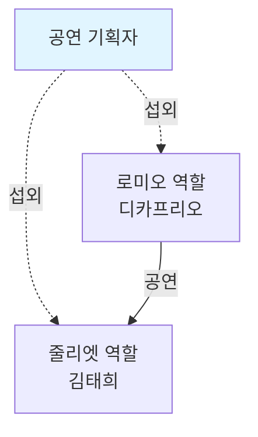
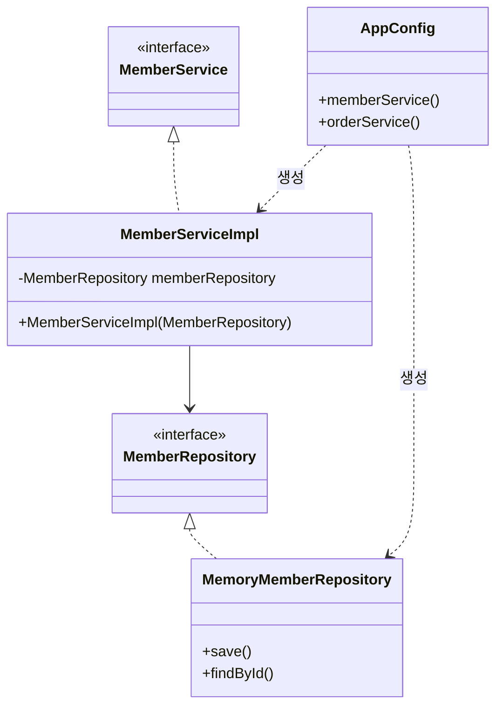
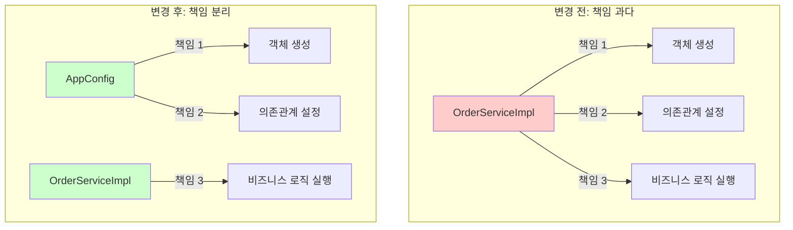
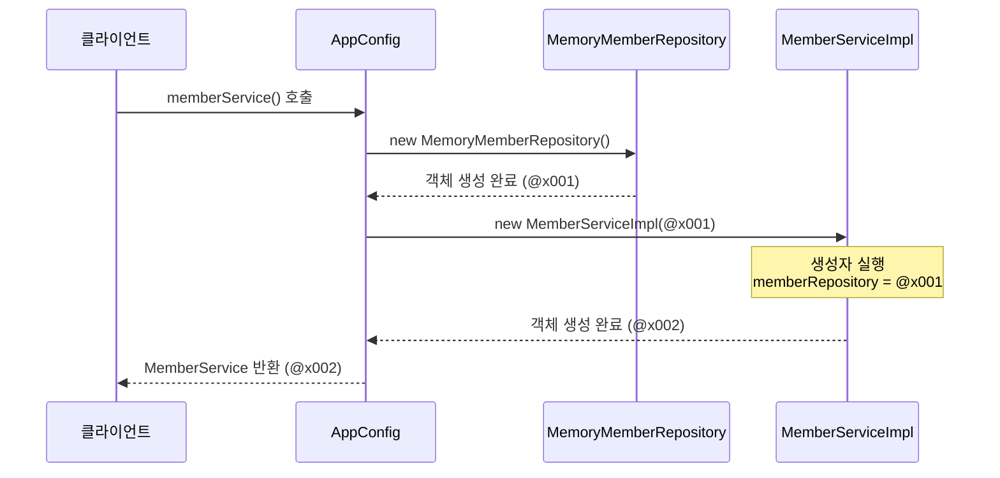
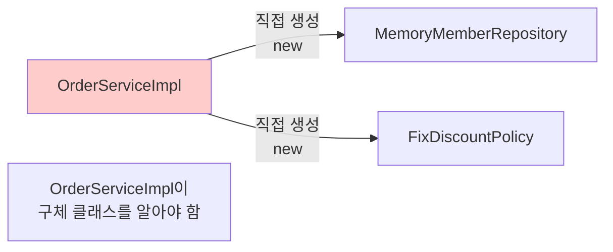
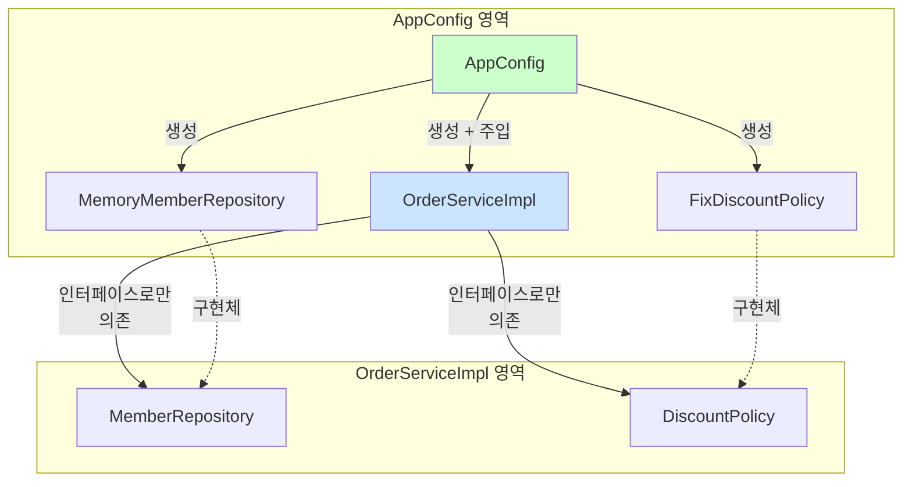
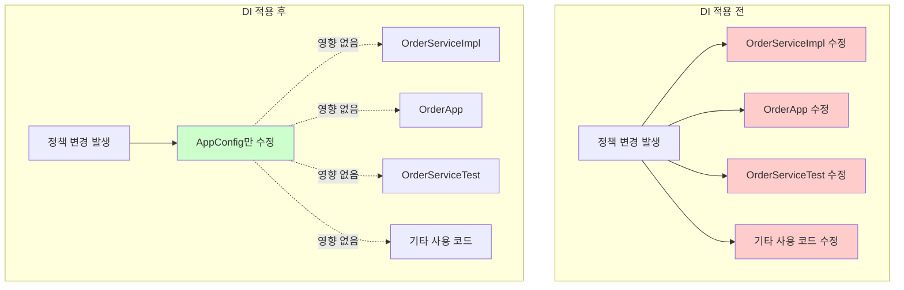
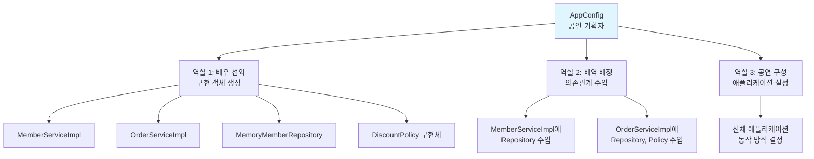

# 3-3. 관심사의 분리

**출처**: 인프런 - 스프링 핵심 원리 기본편
**챕터**: 3. 스프링 핵심 원리 이해2 - 객체 지향 원리 적용

---

## 학습 목표

- [ ] 관심사의 분리 개념을 이해한다
- [ ] AppConfig의 역할과 필요성을 설명할 수 있다
- [ ] 생성자 주입 방식을 구현할 수 있다
- [ ] DI(의존관계 주입) 개념을 이해한다

---

## 애플리케이션을 공연으로 비유하기

### 잘못된 설계 (현재 상황)

**로미오와 줄리엣 공연 예시**:


**문제점**:
- 로미오 역할(인터페이스)을 하는 디카프리오(구현체, 배우)가
- 줄리엣 역할(인터페이스)을 할 여배우(구현체, 배우)를 **직접 초빙**
- 배우가 **공연도 하고, 섭외도 하는** 다양한 책임을 가짐

### 올바른 설계 (개선 방향)

**공연 기획자의 역할**:



**개선된 점**:
- 배우는 본인의 **역할(배역)을 수행하는 것에만 집중**
- 디카프리오는 어떤 여자 주인공이 선택되더라도 **똑같이 공연 가능**
- **공연 기획자**가 담당 배우를 섭외하고, 역할에 맞는 배우를 지정

---

## 관심사 분리하기

### 필요한 것

**공연 기획자처럼**:
- 공연을 구성하고
- 담당 배우를 섭외하고
- 역할에 맞는 배우를 지정하는
- **별도의 책임을 담당하는 존재**

### AppConfig 등장

**역할**:
- 애플리케이션의 전체 동작 방식을 **구성(config)**
- **구현 객체를 생성**하고, **연결**하는 책임을 가지는 별도의 설정 클래스

---

## AppConfig 구현

### AppConfig 코드

**AppConfig.java**:

```java
package hello.core;

import hello.core.discount.FixDiscountPolicy;
import hello.core.member.MemberService;
import hello.core.member.MemberServiceImpl;
import hello.core.member.MemoryMemberRepository;
import hello.core.order.OrderService;
import hello.core.order.OrderServiceImpl;

public class AppConfig {

    public MemberService memberService() {
        return new MemberServiceImpl(new MemoryMemberRepository());
    }

    public OrderService orderService() {
        return new OrderServiceImpl(
            new MemoryMemberRepository(),
            new FixDiscountPolicy()
        );
    }
}
```

### AppConfig의 역할

**1. 구현 객체 생성**:
- `MemberServiceImpl`
- `MemoryMemberRepository`
- `OrderServiceImpl`
- `FixDiscountPolicy`

**2. 생성자를 통해 의존관계 주입(연결)**:
- `MemberServiceImpl` → `MemoryMemberRepository`
- `OrderServiceImpl` → `MemoryMemberRepository`, `FixDiscountPolicy`

---

## 생성자 주입 적용

### MemberServiceImpl 변경

**변경 전 - 직접 생성**:
```java
public class MemberServiceImpl implements MemberService {

    // 구체 클래스를 직접 생성 - DIP 위반!
    private final MemberRepository memberRepository
        = new MemoryMemberRepository();

    public void join(Member member) {
        memberRepository.save(member);
    }

    public Member findMember(Long memberId) {
        return memberRepository.findById(memberId);
    }
}
```

**변경 후 - 생성자 주입**:
```java
package hello.core.member;

public class MemberServiceImpl implements MemberService {

    // 인터페이스에만 의존 - DIP 준수!
    private final MemberRepository memberRepository;

    // 생성자를 통해 구현 객체 주입
    public MemberServiceImpl(MemberRepository memberRepository) {
        this.memberRepository = memberRepository;
    }

    public void join(Member member) {
        memberRepository.save(member);
    }

    public Member findMember(Long memberId) {
        return memberRepository.findById(memberId);
    }
}
```

**개선 효과**:
- ✅ `MemoryMemberRepository`를 의존하지 않음
- ✅ `MemberRepository` 인터페이스만 의존
- ✅ 어떤 구현 객체가 주입될지는 외부(`AppConfig`)에서 결정
- ✅ **의존관계에 대한 고민은 외부에 맡기고 실행에만 집중**

---

### OrderServiceImpl 변경

**변경 후 - 생성자 주입**:
```java
package hello.core.order;

import hello.core.discount.DiscountPolicy;
import hello.core.member.Member;
import hello.core.member.MemberRepository;

public class OrderServiceImpl implements OrderService {

    // 인터페이스에만 의존 - DIP 준수!
    private final MemberRepository memberRepository;
    private final DiscountPolicy discountPolicy;

    // 생성자를 통해 구현 객체 주입
    public OrderServiceImpl(MemberRepository memberRepository,
                           DiscountPolicy discountPolicy) {
        this.memberRepository = memberRepository;
        this.discountPolicy = discountPolicy;
    }

    @Override
    public Order createOrder(Long memberId, String itemName, int itemPrice) {
        Member member = memberRepository.findById(memberId);
        int discountPrice = discountPolicy.discount(member, itemPrice);

        return new Order(memberId, itemName, itemPrice, discountPrice);
    }
}
```

**개선 효과**:
- ✅ `FixDiscountPolicy`를 의존하지 않음
- ✅ `DiscountPolicy` 인터페이스만 의존
- ✅ 어떤 구현 객체가 주입될지는 외부에서 결정
- ✅ **실행에만 집중**

---

## 클래스 다이어그램

### 전체 구조



**역할 분리**:
- `AppConfig`: 객체 생성과 연결
- `MemberServiceImpl`: 실행 (비즈니스 로직)

---

## 객체 인스턴스 다이어그램

### 회원 객체 인스턴스

```mermaid
graph TB
    A[appConfig]
    B[memoryMemberRepository<br/>x001]
    C[memberServiceImpl]

    A -.1. 생성.-> B
    A -.2. 생성 + 주입<br/>memoryMemberRepository x001.-> C
    C --> B

    style A fill:#e1f5ff
    style B fill:#fff5e1
    style C fill:#f5e1ff
```

**흐름**:
1. `appConfig`가 `memoryMemberRepository` 객체 생성
2. `appConfig`가 `memberServiceImpl` 생성하면서 생성자로 `memoryMemberRepository` 참조값 전달
3. `memberServiceImpl` 입장에서는 의존관계를 외부에서 주입받는 것

---

## DI (Dependency Injection)

### 의존관계 주입

**클라이언트 입장에서**:
- `memberServiceImpl` 입장에서 보면
- 의존관계를 마치 **외부에서 주입해주는 것** 같음

**용어**:
- **DI (Dependency Injection)**
- 우리말로 **의존관계 주입** 또는 **의존성 주입**

---

## AppConfig 실행

### MemberApp 변경

**변경 전**:
```java
public class MemberApp {
    public static void main(String[] args) {
        MemberService memberService = new MemberServiceImpl();
        // ...
    }
}
```

**변경 후**:
```java
package hello.core;

import hello.core.member.Grade;
import hello.core.member.Member;
import hello.core.member.MemberService;

public class MemberApp {

    public static void main(String[] args) {
        // AppConfig를 통해 MemberService 조회
        AppConfig appConfig = new AppConfig();
        MemberService memberService = appConfig.memberService();

        Member member = new Member(1L, "memberA", Grade.VIP);
        memberService.join(member);

        Member findMember = memberService.findMember(1L);
        System.out.println("new member = " + member.getName());
        System.out.println("find Member = " + findMember.getName());
    }
}
```

---

### OrderApp 변경

**변경 후**:
```java
package hello.core;

import hello.core.member.Grade;
import hello.core.member.Member;
import hello.core.member.MemberService;
import hello.core.order.Order;
import hello.core.order.OrderService;

public class OrderApp {

    public static void main(String[] args) {
        // AppConfig를 통해 Service 조회
        AppConfig appConfig = new AppConfig();
        MemberService memberService = appConfig.memberService();
        OrderService orderService = appConfig.orderService();

        long memberId = 1L;
        Member member = new Member(memberId, "memberA", Grade.VIP);
        memberService.join(member);

        Order order = orderService.createOrder(memberId, "itemA", 10000);

        System.out.println("order = " + order);
    }
}
```

---

### 테스트 코드 수정

**MemberServiceTest**:
```java
class MemberServiceTest {

    MemberService memberService;

    @BeforeEach
    public void beforeEach() {
        AppConfig appConfig = new AppConfig();
        memberService = appConfig.memberService();
    }

    // 테스트 메서드...
}
```

**OrderServiceTest**:
```java
class OrderServiceTest {

    MemberService memberService;
    OrderService orderService;

    @BeforeEach
    public void beforeEach() {
        AppConfig appConfig = new AppConfig();
        memberService = appConfig.memberService();
        orderService = appConfig.orderService();
    }

    // 테스트 메서드...
}
```

**`@BeforeEach`**:
- 각 테스트를 실행하기 전에 호출됨
- AppConfig를 통해 서비스 객체 생성

---

## 💡 핵심 정리

### 관심사의 분리

**배역과 배우의 비유**:

| 역할 | 책임 | 비유 |
|------|------|------|
| **AppConfig** | - 구현 객체 생성<br/>- 의존관계 연결<br/>- 전체 구성 책임 | 공연 기획자 |
| **ServiceImpl** | - 자신의 기능 실행<br/>- 실행에만 집중 | 배우 |

### DIP 완성

**MemberServiceImpl**:
- ✅ `MemoryMemberRepository`를 의존하지 않음
- ✅ `MemberRepository` 인터페이스만 의존
- ✅ 구체 클래스를 몰라도 됨

### 관심사의 분리

**역할 분리**:
- ✅ 객체를 생성하고 연결하는 역할: `AppConfig`
- ✅ 실행하는 역할: `MemberServiceImpl`, `OrderServiceImpl`
- ✅ 관심사가 명확히 분리됨

---

## 정리

### AppConfig를 통한 개선

**Before**:
```java
// ServiceImpl이 직접 생성 - 책임 과다
private final MemberRepository memberRepository
    = new MemoryMemberRepository();
```

**After**:
```java
// AppConfig가 생성하여 주입 - 책임 분리
public MemberServiceImpl(MemberRepository memberRepository) {
    this.memberRepository = memberRepository;
}
```

### 이제 각 배우들은...

- 담당 **기능을 실행하는 책임만** 지면 됨
- `OrderServiceImpl`은 **기능을 실행하는 책임만** 지면 됨
- 어떤 구현 객체가 주입될지는 **알 필요 없음**
- **오직 외부(AppConfig)에서 결정**

---

## 📚 AppConfig 심층 분석

> **스프링의 핵심 원리를 이해하기 위한 상세 설명**

### 1. AppConfig의 탄생 배경

#### 문제 상황: 책임의 과다

**변경 전 OrderServiceImpl**:
```java
public class OrderServiceImpl implements OrderService {
    // 문제 1: 구체 클래스에 직접 의존
    private final MemberRepository memberRepository = new MemoryMemberRepository();
    private final DiscountPolicy discountPolicy = new FixDiscountPolicy();

    @Override
    public Order createOrder(Long memberId, String itemName, int itemPrice) {
        // 문제 2: 실제 비즈니스 로직 수행
        Member member = memberRepository.findById(memberId);
        int discountPrice = discountPolicy.discount(member, itemPrice);
        return new Order(memberId, itemName, itemPrice, discountPrice);
    }
}
```

**이 코드의 문제점**:

| 문제 | 설명 | SOLID 원칙 위반 |
|------|------|----------------|
| **1. 객체 생성 책임** | `new MemoryMemberRepository()`, `new FixDiscountPolicy()` 직접 생성 | SRP (단일 책임 원칙) 위반 |
| **2. 비즈니스 로직 수행** | `createOrder()` 메서드로 주문 생성 로직 실행 | - |
| **3. 구체 클래스 의존** | 인터페이스가 아닌 구현 클래스를 직접 알아야 함 | DIP (의존관계 역전 원칙) 위반 |
| **4. 변경 시 영향 범위** | 구현체 변경 시 ServiceImpl 코드 수정 필요 | OCP (개방-폐쇄 원칙) 위반 |

#### 해결 방안: 책임 분리

**핵심 아이디어**:
```
"객체를 생성하고 연결하는 책임"과 "실행하는 책임"을 분리하자!
```



---

### 2. AppConfig의 핵심 역할 상세

#### 역할 1: 구현 객체 생성

**AppConfig가 생성하는 모든 객체**:
```java
public class AppConfig {

    public MemberService memberService() {
        // 1. MemoryMemberRepository 객체 생성
        // 2. MemberServiceImpl 객체 생성
        return new MemberServiceImpl(new MemoryMemberRepository());
    }

    public OrderService orderService() {
        // 3. MemoryMemberRepository 객체 생성 (또 다른 인스턴스)
        // 4. FixDiscountPolicy 객체 생성
        // 5. OrderServiceImpl 객체 생성
        return new OrderServiceImpl(
            new MemoryMemberRepository(),
            new FixDiscountPolicy()
        );
    }
}
```

**메모리 관점에서 보기**:
```
Heap Memory:
┌─────────────────────────────────────┐
│ MemoryMemberRepository@x001         │ ← memberService용
├─────────────────────────────────────┤
│ MemberServiceImpl@x002              │
│   - memberRepository: @x001         │
├─────────────────────────────────────┤
│ MemoryMemberRepository@x003         │ ← orderService용
├─────────────────────────────────────┤
│ FixDiscountPolicy@x004              │
├─────────────────────────────────────┤
│ OrderServiceImpl@x005               │
│   - memberRepository: @x003         │
│   - discountPolicy: @x004           │
└─────────────────────────────────────┘
```

#### 역할 2: 생성자를 통한 의존관계 주입

**생성자 주입의 동작 과정**:

```java
// Step 1: AppConfig에서 시작
AppConfig appConfig = new AppConfig();

// Step 2: memberService() 호출
MemberService memberService = appConfig.memberService();

// Step 3: AppConfig 내부 동작 (실제로는 한 줄이지만 단계별 분석)
// 3-1. MemoryMemberRepository 생성
MemoryMemberRepository repository = new MemoryMemberRepository();

// 3-2. MemberServiceImpl 생성자 호출하면서 repository 전달
MemberServiceImpl serviceImpl = new MemberServiceImpl(repository);

// 3-3. MemberServiceImpl 생성자 내부
public MemberServiceImpl(MemberRepository memberRepository) {
    this.memberRepository = memberRepository;  // 참조값이 저장됨
}

// Step 4: 반환
return serviceImpl;  // MemberService 타입으로 반환
```

**의존관계 주입 상세 분석**:



---

### 3. 생성자 주입의 원리

#### 생성자 주입이란?

**정의**:
- 객체를 생성할 때 생성자를 통해 의존관계를 외부에서 주입받는 방식

**왜 생성자인가?**

```java
public class MemberServiceImpl implements MemberService {

    private final MemberRepository memberRepository;

    // 생성자: 객체 생성 시 반드시 호출됨
    public MemberServiceImpl(MemberRepository memberRepository) {
        this.memberRepository = memberRepository;
    }
}
```

**장점**:

| 장점 | 설명 | 예시 |
|------|------|------|
| **1. 불변성 (Immutability)** | `final` 키워드 사용 가능 | 런타임에 의존관계 변경 불가 |
| **2. 필수 의존관계 보장** | 생성자 호출 시 반드시 전달 필요 | 컴파일 타임에 오류 발견 |
| **3. 순환 참조 방지** | 생성자 호출 시점에 순환 참조 감지 | StackOverflowError 예방 |
| **4. 테스트 용이성** | Mock 객체 주입 간편 | 단위 테스트 작성 쉬움 |

#### Before & After 코드 비교

**Before: 직접 생성 방식**:
```java
public class MemberServiceImpl implements MemberService {

    // 문제점들:
    // 1. final 사용 불가 (생성 시점에 초기화 안 됨)
    // 2. MemoryMemberRepository 구체 클래스에 의존
    // 3. 테스트 시 다른 구현체로 교체 불가능
    // 4. DIP 위반
    private MemberRepository memberRepository = new MemoryMemberRepository();

    public void join(Member member) {
        memberRepository.save(member);
    }
}
```

**코드 분석**:
```java
MemberRepository memberRepository = new MemoryMemberRepository();
//     ↑                                      ↑
// 인터페이스 타입                        구체 클래스
// (추상에 의존)                      (구체에 의존)
//
// 결론: 추상과 구체 모두에 의존 → DIP 위반!
```

**After: 생성자 주입 방식**:
```java
public class MemberServiceImpl implements MemberService {

    // 개선점들:
    // 1. final 사용 가능 (불변성 보장)
    // 2. MemberRepository 인터페이스에만 의존
    // 3. 테스트 시 Mock 객체 주입 가능
    // 4. DIP 준수
    private final MemberRepository memberRepository;

    // 생성자를 통해 외부에서 주입
    public MemberServiceImpl(MemberRepository memberRepository) {
        this.memberRepository = memberRepository;
    }

    public void join(Member member) {
        memberRepository.save(member);
    }
}
```

**코드 분석**:
```java
private final MemberRepository memberRepository;
//            ↑
//       인터페이스 타입
//       (추상에만 의존)
//
// 생성자에서:
public MemberServiceImpl(MemberRepository memberRepository) {
//                       ↑
//                  인터페이스 타입
//
// 결론: 추상(인터페이스)에만 의존 → DIP 준수!
```

---

### 4. DI (Dependency Injection) 심층 이해

#### DI의 정의와 핵심

**Dependency Injection (의존관계 주입)**:
- **Dependency (의존관계)**: 한 객체가 다른 객체를 필요로 하는 관계
- **Injection (주입)**: 외부에서 그 객체를 넣어주는 것

**비유**:
```
📱 스마트폰(MemberServiceImpl)이 배터리(MemberRepository)가 필요함

❌ 나쁜 방식: 스마트폰 내부에서 배터리를 직접 생성
   → 배터리 교체 불가능
   → 특정 배터리에 종속적

✅ 좋은 방식: 외부에서 배터리를 끼워줌 (주입)
   → 배터리 교체 가능
   → 다양한 배터리 사용 가능
```

#### DI의 3가지 방법

**1. 생성자 주입 (Constructor Injection)** ⭐ 권장
```java
public class OrderServiceImpl implements OrderService {

    private final MemberRepository memberRepository;
    private final DiscountPolicy discountPolicy;

    // 생성자를 통해 주입
    public OrderServiceImpl(MemberRepository memberRepository,
                           DiscountPolicy discountPolicy) {
        this.memberRepository = memberRepository;
        this.discountPolicy = discountPolicy;
    }
}
```

**장점**:
- `final` 사용 가능 → 불변성 보장
- 필수 의존관계 명확히 표현
- 순환 참조 컴파일 시점에 발견
- **스프링 팀 권장 방식**

**2. Setter 주입 (Setter Injection)**
```java
public class OrderServiceImpl implements OrderService {

    private MemberRepository memberRepository;
    private DiscountPolicy discountPolicy;

    // Setter 메서드를 통해 주입
    public void setMemberRepository(MemberRepository memberRepository) {
        this.memberRepository = memberRepository;
    }

    public void setDiscountPolicy(DiscountPolicy discountPolicy) {
        this.discountPolicy = discountPolicy;
    }
}
```

**단점**:
- `final` 사용 불가 → 불변성 보장 안 됨
- 선택적 의존관계 (나중에 변경 가능)
- 런타임에 의존관계 변경 가능 (위험)

**3. 필드 주입 (Field Injection)**
```java
public class OrderServiceImpl implements OrderService {

    // 필드에 직접 주입 (스프링의 @Autowired 사용 시)
    private MemberRepository memberRepository;
    private DiscountPolicy discountPolicy;
}
```

**단점**:
- 외부에서 변경 불가능 → 테스트 어려움
- DI 프레임워크 없이는 사용 불가
- **안티패턴으로 간주됨**

#### DI 전/후 의존관계 비교

**DI 적용 전**:


**문제점**:
- `OrderServiceImpl`이 `MemoryMemberRepository`, `FixDiscountPolicy` 구체 클래스를 직접 알아야 함
- 구현체 변경 시 `OrderServiceImpl` 코드 수정 필요

**DI 적용 후**:


**개선점**:
- `OrderServiceImpl`은 인터페이스만 알면 됨
- 구현체 변경 시 `AppConfig`만 수정
- `OrderServiceImpl` 코드는 전혀 건드리지 않음

---

### 5. 제어의 역전 (IoC: Inversion of Control)

#### IoC란?

**정의**:
- 프로그램의 제어 흐름을 직접 제어하는 것이 아니라 외부에서 관리하는 것

**전통적인 프로그램 흐름**:
```java
// 개발자가 직접 제어
public class OrderServiceImpl {
    public OrderServiceImpl() {
        // 내가 필요한 객체를 내가 직접 생성
        this.memberRepository = new MemoryMemberRepository();
        this.discountPolicy = new FixDiscountPolicy();
    }
}
```

**IoC 적용 후**:
```java
// 외부(AppConfig)가 제어
public class OrderServiceImpl {
    public OrderServiceImpl(MemberRepository memberRepository,
                           DiscountPolicy discountPolicy) {
        // 누군가(AppConfig)가 만들어서 넣어줌
        this.memberRepository = memberRepository;
        this.discountPolicy = discountPolicy;
    }
}
```

#### 제어권의 이동

**Before: 구현 객체가 제어권을 가짐**:
```java
public class OrderServiceImpl implements OrderService {

    // 내가 결정: MemoryMemberRepository를 사용하겠다!
    private final MemberRepository memberRepository = new MemoryMemberRepository();

    // 내가 결정: FixDiscountPolicy를 사용하겠다!
    private final DiscountPolicy discountPolicy = new FixDiscountPolicy();

    // 내가 실행
    public Order createOrder(...) {
        // 비즈니스 로직
    }
}
```

**제어권 분석**:
- ✅ 실행 제어: `OrderServiceImpl`이 가짐
- ❌ 생성 제어: `OrderServiceImpl`이 가짐 → 문제!
- ❌ 의존관계 설정 제어: `OrderServiceImpl`이 가짐 → 문제!

**After: AppConfig가 제어권을 가짐**:
```java
// AppConfig.java - 제어권을 가진 클래스
public class AppConfig {

    // 내가 결정: MemoryMemberRepository를 사용하게 하겠다!
    // 내가 결정: FixDiscountPolicy를 사용하게 하겠다!
    public OrderService orderService() {
        return new OrderServiceImpl(
            new MemoryMemberRepository(),
            new FixDiscountPolicy()
        );
    }
}

// OrderServiceImpl.java - 제어권이 없는 클래스
public class OrderServiceImpl implements OrderService {

    private final MemberRepository memberRepository;
    private final DiscountPolicy discountPolicy;

    // 받기만 함: 누가 뭘 줄지 모름
    public OrderServiceImpl(MemberRepository memberRepository,
                           DiscountPolicy discountPolicy) {
        this.memberRepository = memberRepository;
        this.discountPolicy = discountPolicy;
    }

    // 실행만 함
    public Order createOrder(...) {
        // 비즈니스 로직
    }
}
```

**제어권 분석**:
- ✅ 생성 제어: `AppConfig`가 가짐
- ✅ 의존관계 설정 제어: `AppConfig`가 가짐
- ✅ 실행 제어: `OrderServiceImpl`이 가짐

#### IoC 컨테이너, DI 컨테이너

**AppConfig = DI 컨테이너**:
```java
public class AppConfig {
    // 이 클래스는 DI 컨테이너 역할을 함
    // - 객체를 생성하고
    // - 의존관계를 연결하고
    // - 관리함

    public MemberService memberService() { ... }
    public OrderService orderService() { ... }
}
```

**스프링 컨테이너**:
- 스프링 프레임워크는 이 `AppConfig` 역할을 더 강력하게 수행
- `@Configuration`, `@Bean` 어노테이션 사용
- 싱글톤 보장, 라이프사이클 관리 등 추가 기능 제공

---

### 6. 실전 시나리오: 정책 변경

#### 시나리오: 할인 정책 변경

**요구사항 변경**:
```
고정 할인 정책 → 정률 할인 정책으로 변경
FixDiscountPolicy → RateDiscountPolicy
```

#### DI 적용 전: 여러 곳 수정 필요

```java
// ❌ OrderServiceImpl.java 수정 필요
public class OrderServiceImpl implements OrderService {

    // 이 줄을 수정해야 함
    // private final DiscountPolicy discountPolicy = new FixDiscountPolicy();
    private final DiscountPolicy discountPolicy = new RateDiscountPolicy();
}

// ❌ OrderApp.java 수정 필요
public class OrderApp {
    public static void main(String[] args) {
        // OrderServiceImpl 내부를 수정했으므로 영향받음
        OrderService orderService = new OrderServiceImpl();
    }
}

// ❌ OrderServiceTest.java 수정 필요
class OrderServiceTest {
    OrderService orderService = new OrderServiceImpl();
    // 테스트도 영향받음
}
```

**문제점**:
- 3곳 이상 수정 필요
- OCP 위반 (변경에 닫혀있지 않음)
- 실행 코드 수정 필요 (컴파일 다시 필요)

#### DI 적용 후: 한 곳만 수정

```java
// ✅ AppConfig.java 만 수정
public class AppConfig {

    public OrderService orderService() {
        return new OrderServiceImpl(
            new MemoryMemberRepository(),
            // new FixDiscountPolicy()  // 이 줄만 수정
            new RateDiscountPolicy()    // 이렇게!
        );
    }
}

// ✅ OrderServiceImpl.java 수정 불필요
public class OrderServiceImpl implements OrderService {
    private final DiscountPolicy discountPolicy;
    // 이 코드는 전혀 건드리지 않음!
}

// ✅ OrderApp.java 수정 불필요
public class OrderApp {
    public static void main(String[] args) {
        AppConfig appConfig = new AppConfig();
        OrderService orderService = appConfig.orderService();
        // 이 코드도 전혀 건드리지 않음!
    }
}
```

**개선점**:
- 1곳만 수정 (`AppConfig.java`)
- OCP 준수 (확장에는 열려있고, 변경에는 닫혀있음)
- 클라이언트 코드 수정 불필요

#### 변경 영향 범위 비교



---

### 7. AppConfig와 스프링의 관계

#### 현재 AppConfig (순수 자바)

```java
public class AppConfig {

    public MemberService memberService() {
        return new MemberServiceImpl(new MemoryMemberRepository());
    }

    public OrderService orderService() {
        return new OrderServiceImpl(
            new MemoryMemberRepository(),
            new FixDiscountPolicy()
        );
    }
}
```

**특징**:
- 순수 자바 코드
- 스프링 없이도 동작
- DI 원리를 직접 구현
- 싱글톤 보장 안 됨 (매번 새로운 객체 생성)

#### 스프링 적용 후 AppConfig (다음 챕터 예고)

```java
@Configuration
public class AppConfig {

    @Bean
    public MemberService memberService() {
        return new MemberServiceImpl(memberRepository());
    }

    @Bean
    public MemberRepository memberRepository() {
        return new MemoryMemberRepository();
    }

    @Bean
    public OrderService orderService() {
        return new OrderServiceImpl(memberRepository(), discountPolicy());
    }

    @Bean
    public DiscountPolicy discountPolicy() {
        return new RateDiscountPolicy();
    }
}
```

**스프링이 제공하는 추가 기능**:
- **싱글톤 보장**: 같은 객체를 재사용
- **의존관계 자동 주입**: `@Autowired`
- **라이프사이클 관리**: 초기화, 소멸 콜백
- **AOP**: 부가 기능 적용
- **스프링 컨테이너**: 객체 관리

---

### 8. 핵심 원리 총정리

#### AppConfig의 역할



#### SOLID 원칙 준수

| 원칙 | AppConfig 적용 전 | AppConfig 적용 후 |
|------|------------------|------------------|
| **SRP**<br/>단일 책임 | ❌ ServiceImpl이 생성+실행 담당 | ✅ AppConfig: 생성<br/>✅ ServiceImpl: 실행 |
| **OCP**<br/>개방-폐쇄 | ❌ 변경 시 ServiceImpl 수정 | ✅ AppConfig만 수정 |
| **LSP**<br/>리스코프 치환 | ⚠️ 구현체에 의존 | ✅ 인터페이스에 의존 |
| **ISP**<br/>인터페이스 분리 | - | - |
| **DIP**<br/>의존관계 역전 | ❌ 구체 클래스에 의존 | ✅ 인터페이스에만 의존 |

#### 핵심 키워드 정리

**1. 관심사의 분리 (Separation of Concerns)**:
- 생성 관심사 → `AppConfig`
- 실행 관심사 → `ServiceImpl`

**2. 의존관계 주입 (Dependency Injection)**:
- 생성자를 통해 외부에서 주입
- 인터페이스에만 의존

**3. 제어의 역전 (Inversion of Control)**:
- 구현 객체는 실행만 담당
- 제어 흐름은 `AppConfig`가 관리

**4. DI 컨테이너**:
- `AppConfig` = 수동 DI 컨테이너
- 스프링 컨테이너 = 자동 DI 컨테이너

---

### 9. 실습 체크리스트

#### AppConfig 이해도 체크

- [ ] AppConfig가 왜 필요한지 설명할 수 있는가?
- [ ] 생성자 주입의 장점을 3가지 이상 말할 수 있는가?
- [ ] DI와 IoC의 차이를 설명할 수 있는가?
- [ ] 정책 변경 시 어느 부분만 수정하면 되는지 아는가?
- [ ] DIP 위반 코드와 준수 코드를 구분할 수 있는가?

#### 코드 작성 실습

**연습 1: 새로운 서비스 추가**
```java
// TODO: PaymentService를 AppConfig에 추가해보세요
public interface PaymentService { }
public class PaymentServiceImpl implements PaymentService {
    private final PaymentRepository paymentRepository;

    // 생성자 주입 방식으로 작성
}
```

**연습 2: 정책 변경 실습**
```java
// TODO: DiscountPolicy를 변경해보세요
// FixDiscountPolicy → RateDiscountPolicy
// 어느 파일을 수정해야 할까요?
```

**연습 3: 테스트 작성**
```java
// TODO: Mock 객체를 사용한 테스트 작성
class OrderServiceTest {
    @Test
    void createOrder() {
        // Mock Repository와 Mock Policy를 생성자에 주입
        // 단위 테스트가 가능한 이유는?
    }
}
```

---

### 10. 자주 하는 질문 (FAQ)

**Q1. AppConfig에서 매번 `new`를 하는데, 싱글톤이 아닌가요?**
```java
public MemberService memberService() {
    return new MemberServiceImpl(new MemoryMemberRepository());  // 새 객체
}

public OrderService orderService() {
    return new OrderServiceImpl(
        new MemoryMemberRepository(),  // 또 새 객체!
        new FixDiscountPolicy()
    );
}
```

A1. 맞습니다! 현재는 싱글톤이 아닙니다.
- `memberService()` 호출 시: `MemoryMemberRepository` 생성
- `orderService()` 호출 시: 또 다른 `MemoryMemberRepository` 생성
- **문제점**: 같은 Repository가 2개 생성됨
- **해결책**: 다음 챕터에서 리팩터링으로 해결 + 스프링 컨테이너 사용

**Q2. 왜 인터페이스를 꼭 써야 하나요?**

A2. 인터페이스가 없다면:
```java
// 인터페이스 없이 구체 클래스만 사용
public class OrderServiceImpl {
    private final MemoryMemberRepository memberRepository;

    // MemoryMemberRepository를 JpaMemberRepository로 변경하려면?
    // → 이 코드를 전부 수정해야 함!
}
```

인터페이스가 있다면:
```java
// 인터페이스 사용
public class OrderServiceImpl {
    private final MemberRepository memberRepository;  // 인터페이스

    // MemoryMemberRepository를 JpaMemberRepository로 변경하려면?
    // → AppConfig만 수정하면 됨!
}
```

**Q3. 생성자 주입 말고 Setter 주입을 쓰면 안 되나요?**

A3. Setter 주입의 문제점:
```java
public class OrderServiceImpl {
    private MemberRepository memberRepository;

    public void setMemberRepository(MemberRepository memberRepository) {
        this.memberRepository = memberRepository;
    }

    public Order createOrder(...) {
        // memberRepository가 null일 수 있음! (NullPointerException 위험)
        memberRepository.findById(...);
    }
}
```

생성자 주입의 장점:
```java
public class OrderServiceImpl {
    private final MemberRepository memberRepository;  // final 가능!

    public OrderServiceImpl(MemberRepository memberRepository) {
        this.memberRepository = memberRepository;  // 반드시 초기화
    }

    public Order createOrder(...) {
        // memberRepository가 null일 수 없음! (안전)
        memberRepository.findById(...);
    }
}
```

**Q4. AppConfig 없이 그냥 스프링의 `@Autowired`만 쓰면 안 되나요?**

A4. `@Autowired`도 결국 같은 원리입니다:
```java
// AppConfig 방식 (수동)
public class AppConfig {
    public OrderService orderService() {
        return new OrderServiceImpl(
            memberRepository(),
            discountPolicy()
        );
    }
}

// @Autowired 방식 (자동)
@Component
public class OrderServiceImpl {
    @Autowired  // 스프링이 자동으로 주입
    public OrderServiceImpl(MemberRepository memberRepository,
                           DiscountPolicy discountPolicy) {
        // ...
    }
}
```

- **AppConfig**: 수동으로 명시적 설정 (명확, 제어 가능)
- **@Autowired**: 자동으로 주입 (편리, 빠른 개발)
- 스프링의 `@Autowired`를 이해하려면 AppConfig 원리를 먼저 알아야 함!

---

## 다음 학습

➡️ **[3-4. AppConfig 리팩터링](./3-4-AppConfig리팩터링.md)**
- 중복 제거
- 역할과 구현 명확히 분리
- 가독성 향상
