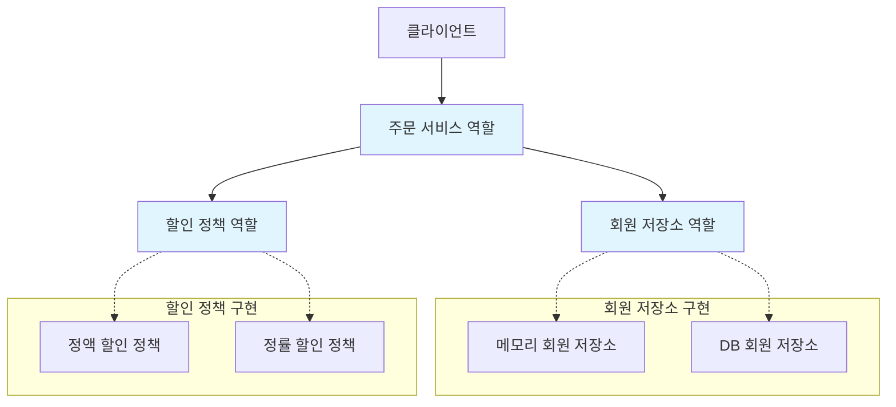
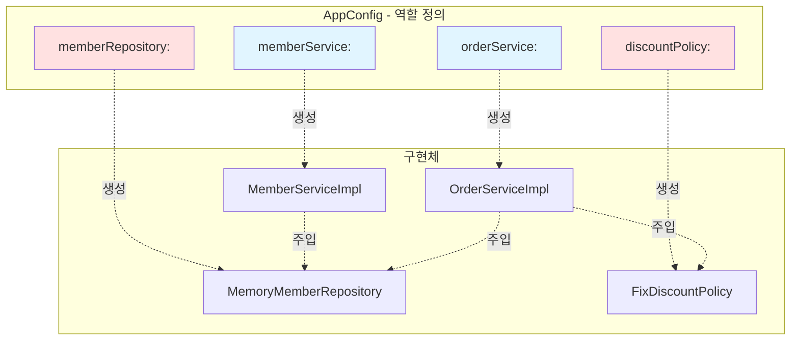

# 3-4. AppConfig 리팩터링

**출처**: 인프런 - 스프링 핵심 원리 기본편
**챕터**: 3. 스프링 핵심 원리 이해2 - 객체 지향 원리 적용

---

## 학습 목표

- [ ] 코드 중복을 제거하는 리팩터링 기법을 익힌다
- [ ] 역할과 구현을 명확히 분리하는 설계 기법을 이해한다
- [ ] 변경 지점을 최소화하는 방법을 학습한다

---

## 리팩터링 전 문제점

### 현재 AppConfig

```java
public class AppConfig {

    public MemberService memberService() {
        return new MemberServiceImpl(new MemoryMemberRepository());
    }

    public OrderService orderService() {
        return new OrderServiceImpl(
            new MemoryMemberRepository(),
            new FixDiscountPolicy()
        );
    }
}
```

### 문제점

**1. 중복**:
- `new MemoryMemberRepository()` 2번 생성
- 구현체 변경 시 여러 곳을 수정해야 함

**2. 역할이 잘 드러나지 않음**:
- 메서드 이름만 봐서는 역할을 파악하기 어려움
- 어떤 구조로 되어있는지 한눈에 들어오지 않음

---

## 기대하는 그림

### 역할과 구현 분리



**목표**:
- 역할(인터페이스)과 구현(구체 클래스)이 한눈에 보이도록
- 중복 제거
- 변경 지점 최소화

---

## 리팩터링 실행

### 리팩터링 후 AppConfig

```java
package hello.core;

import hello.core.discount.DiscountPolicy;
import hello.core.discount.FixDiscountPolicy;
import hello.core.member.MemberRepository;
import hello.core.member.MemberService;
import hello.core.member.MemberServiceImpl;
import hello.core.member.MemoryMemberRepository;
import hello.core.order.OrderService;
import hello.core.order.OrderServiceImpl;

public class AppConfig {

    // 역할: 회원 서비스
    public MemberService memberService() {
        return new MemberServiceImpl(memberRepository());
    }

    // 역할: 주문 서비스
    public OrderService orderService() {
        return new OrderServiceImpl(
            memberRepository(),
            discountPolicy()
        );
    }

    // 역할: 회원 저장소
    public MemberRepository memberRepository() {
        return new MemoryMemberRepository();
    }

    // 역할: 할인 정책
    public DiscountPolicy discountPolicy() {
        return new FixDiscountPolicy();
    }
}
```

---

## 개선 효과

### 1. 역할과 구현 분리 명확

**메서드 이름만 봐도 역할을 알 수 있음**:

```java
// 역할(인터페이스)          구현(구체 클래스)
MemberService         →    MemberServiceImpl
OrderService          →    OrderServiceImpl
MemberRepository      →    MemoryMemberRepository
DiscountPolicy        →    FixDiscountPolicy
```

**코드로 확인**:
```java
// 역할: 회원 저장소
public MemberRepository memberRepository() {
    return new MemoryMemberRepository();  // 구현
}

// 역할: 할인 정책
public DiscountPolicy discountPolicy() {
    return new FixDiscountPolicy();  // 구현
}
```

---

### 2. 중복 제거

**Before - 중복 있음**:
```java
public MemberService memberService() {
    return new MemberServiceImpl(new MemoryMemberRepository());  // 1번
}

public OrderService orderService() {
    return new OrderServiceImpl(
        new MemoryMemberRepository(),  // 2번 - 중복!
        new FixDiscountPolicy()
    );
}
```

**After - 중복 제거**:
```java
public MemberService memberService() {
    return new MemberServiceImpl(memberRepository());  // 메서드 호출
}

public OrderService orderService() {
    return new OrderServiceImpl(
        memberRepository(),  // 메서드 호출 - 중복 제거!
        discountPolicy()
    );
}

// 한 곳에서만 생성
public MemberRepository memberRepository() {
    return new MemoryMemberRepository();
}
```

---

### 3. 변경 용이

**구현체 변경 시**:
```java
// 회원 저장소를 DB로 변경하고 싶다면?
public MemberRepository memberRepository() {
    // return new MemoryMemberRepository();  // 메모리 저장소
    return new DbMemberRepository();         // DB 저장소 - 한 곳만 변경!
}
```

**할인 정책 변경 시**:
```java
// 할인 정책을 정률 할인으로 변경하고 싶다면?
public DiscountPolicy discountPolicy() {
    // return new FixDiscountPolicy();      // 정액 할인
    return new RateDiscountPolicy();        // 정률 할인 - 한 곳만 변경!
}
```

---

### 4. 한눈에 파악 가능

**애플리케이션 전체 구성을 한눈에**:
```java
public class AppConfig {

    memberService()      // 회원 서비스 역할
    orderService()       // 주문 서비스 역할
    memberRepository()   // 회원 저장소 역할
    discountPolicy()     // 할인 정책 역할
}
```

**메서드 이름만 봐도**:
- 어떤 역할(인터페이스)들이 있는지
- 애플리케이션이 어떻게 구성되어 있는지
- **빠르게 파악 가능**

---

## 리팩터링 비교

### 비교 표

| 항목 | 리팩터링 전 | 리팩터링 후 |
|------|------------|------------|
| **중복** | `MemoryMemberRepository` 2번 생성 | 1번 생성 |
| **역할 파악** | 어려움 | 쉬움 (메서드 이름) |
| **변경 지점** | 여러 곳 | 한 곳 |
| **가독성** | 낮음 | 높음 |
| **유지보수** | 어려움 | 쉬움 |

---

## 다이어그램으로 보는 개선

### 역할과 구현의 명확한 분리



**역할(메서드)**:
- 🔵 서비스 역할: `memberService()`, `orderService()`
- 🔴 저장소/정책 역할: `memberRepository()`, `discountPolicy()`

---

## 💡 리팩터링 원칙

### 좋은 설계의 특징

**1. 역할이 명확히 드러남**:
- 메서드 이름만 봐도 역할을 알 수 있음
- `memberRepository()` → 회원 저장소 역할

**2. 중복 제거 (DRY 원칙)**:
- Don't Repeat Yourself
- 같은 코드를 여러 번 작성하지 않음

**3. 변경 용이**:
- 한 곳만 수정하면 전체에 적용
- 단일 진실 공급원(Single Source of Truth)

**4. 높은 가독성**:
- 애플리케이션 전체 구조 파악 용이
- 새로운 개발자도 빠르게 이해 가능

---

## 정리

### 리팩터링 결과

**개선된 AppConfig의 장점**:
1. ✅ **역할과 구현 명확히 분리**: 메서드 이름으로 역할 표현
2. ✅ **중복 제거**: `MemoryMemberRepository` 한 번만 생성
3. ✅ **변경 지점 최소화**: 구현체 변경 시 한 곳만 수정
4. ✅ **가독성 향상**: 전체 구성을 한눈에 파악

### AppConfig는 이제...

**공연 기획자로서의 역할**:
- 어떤 역할(배역)들이 있는지 명확히 보임
- 각 역할에 어떤 배우(구현체)를 배정할지 결정
- 배우 교체는 한 줄만 수정하면 됨

---

## 면접 질문

**Q. AppConfig를 리팩터링할 때 중복 제거가 왜 중요한가요?**

<details>
<summary>답안 보기</summary>

**답안**:

**중복 제거의 중요성**:
1. **변경 지점 최소화**: 구현체 변경 시 한 곳만 수정
2. **실수 방지**: 여러 곳을 수정하다 빠뜨릴 위험 제거
3. **일관성 유지**: 모든 곳에서 동일한 구현체 사용 보장

**실무 예시**:
```java
// 중복 있을 때 - 위험!
return new MemberServiceImpl(new MemoryMemberRepository());  // 1번
return new OrderServiceImpl(new MemoryMemberRepository(), ...);  // 2번
// DB로 변경 시 두 곳을 모두 수정해야 함 → 실수 가능성

// 중복 제거 후 - 안전!
public MemberRepository memberRepository() {
    return new DbMemberRepository();  // 한 곳만 수정!
}
```

**DRY 원칙**:
- Don't Repeat Yourself
- 모든 지식은 시스템 내에서 단일하고, 명확하며, 권위있는 표현을 가져야 함

</details>

---

## 다음 학습

➡️ **[3-5. 새로운 구조와 할인 정책 적용](./3-5-새로운구조와할인정책적용.md)**
- 리팩터링된 AppConfig로 할인 정책 변경
- 사용 영역과 구성 영역의 완전한 분리
- OCP, DIP 원칙 준수 확인
