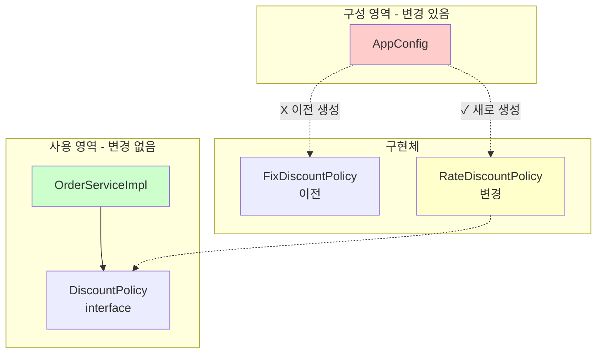
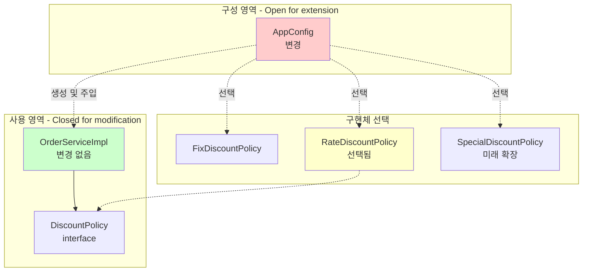
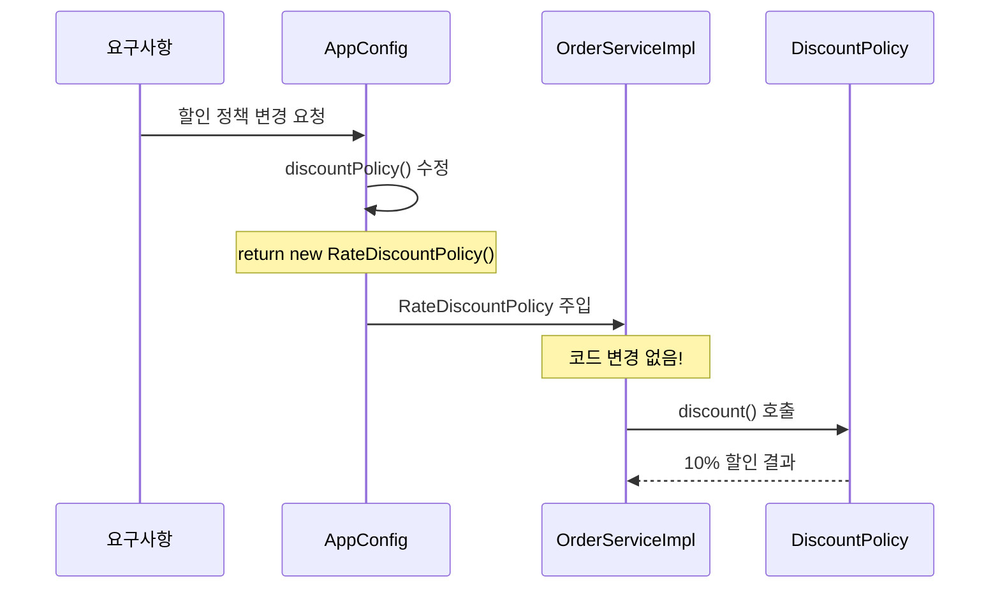

# 3-5. 새로운 구조와 할인 정책 적용

**출처**: 인프런 - 스프링 핵심 원리 기본편
**챕터**: 3. 스프링 핵심 원리 이해2 - 객체 지향 원리 적용

---

## 학습 목표

- [ ] 구성 영역과 사용 영역의 분리를 이해한다
- [ ] AppConfig만 변경하여 정책을 전환할 수 있다
- [ ] OCP, DIP 원칙이 지켜지는 것을 확인한다

---

## 할인 정책 변경하기

### 요구사항 재확인

**변경 사항**:
- `FixDiscountPolicy` (정액 할인) → `RateDiscountPolicy` (정률 할인)

**질문**:
> 어떤 부분만 변경하면 될까요?

**정답**:
> ✅ **AppConfig의 `discountPolicy()` 메서드만 변경!**

---

## 사용 영역과 구성 영역의 분리

### 애플리케이션 구조



**분리의 효과**:
- 🟢 **사용 영역**: 변경 없음 (안정적)
- 🔴 **구성 영역**: 변경 있음 (당연함, 설정 변경)

---

## 할인 정책 변경 코드

### AppConfig 수정

**변경 사항 - 딱 한 줄만!**:

```java
package hello.core;

import hello.core.discount.DiscountPolicy;
import hello.core.discount.FixDiscountPolicy;
import hello.core.discount.RateDiscountPolicy;  // 추가
import hello.core.member.MemberRepository;
import hello.core.member.MemberService;
import hello.core.member.MemberServiceImpl;
import hello.core.member.MemoryMemberRepository;
import hello.core.order.OrderService;
import hello.core.order.OrderServiceImpl;

public class AppConfig {

    public MemberService memberService() {
        return new MemberServiceImpl(memberRepository());
    }

    public OrderService orderService() {
        return new OrderServiceImpl(
            memberRepository(),
            discountPolicy()  // 변경 없음
        );
    }

    public MemberRepository memberRepository() {
        return new MemoryMemberRepository();
    }

    // 할인 정책 역할 - 구현체만 변경!
    public DiscountPolicy discountPolicy() {
        // return new FixDiscountPolicy();      // 정액 할인 (이전)
        return new RateDiscountPolicy();        // 정률 할인 (변경)
    }
}
```

**변경 지점**:
- ✅ `discountPolicy()` 메서드의 return 문 **한 줄만 변경**
- ❌ 다른 코드는 전혀 변경하지 않음

---

## 변경 영향 범위

### 영향 범위 분석

| 영역 | 변경 여부 | 변경 파일 | 설명 |
|------|----------|----------|------|
| **구성 영역** | ✅ 변경 | `AppConfig.java` | 할인 정책 구현체 변경 |
| **사용 영역** | ❌ 변경 없음 | `OrderServiceImpl.java` | 클라이언트 코드 그대로 |
| **사용 영역** | ❌ 변경 없음 | `OrderService.java` | 인터페이스 그대로 |
| **사용 영역** | ❌ 변경 없음 | 테스트 코드 | 전혀 수정 없음 |

### 변경 전후 비교

**Before (기존 구조)**:
```java
// OrderServiceImpl을 직접 수정해야 했음
public class OrderServiceImpl implements OrderService {
    // private final DiscountPolicy discountPolicy = new FixDiscountPolicy();
    private final DiscountPolicy discountPolicy = new RateDiscountPolicy();
}
```

**After (개선된 구조)**:
```java
// OrderServiceImpl은 전혀 수정하지 않음
public class OrderServiceImpl implements OrderService {
    private final DiscountPolicy discountPolicy;  // 변경 없음

    public OrderServiceImpl(DiscountPolicy discountPolicy) {
        this.discountPolicy = discountPolicy;  // 변경 없음
    }
}

// AppConfig만 수정
public DiscountPolicy discountPolicy() {
    return new RateDiscountPolicy();  // 여기만 변경!
}
```

---

## 구성 영역과 사용 영역 분리 다이어그램

### 상세 다이어그램



**핵심**:
- **사용 영역**: 변경에 닫혀있음 (Closed)
- **구성 영역**: 확장에 열려있음 (Open)

---

## 💡 핵심 포인트

### AppConfig는 공연 기획자

**공연 기획자의 역할**:
1. 배역(역할)에 맞는 배우(구현 클래스) 선택
2. 배우 교체는 기획자의 몫
3. 배우(ServiceImpl)는 자신의 역할(실행)만 집중

**코드로 비유**:
```java
// 공연 기획자
public class AppConfig {

    // 로미오 역할에 디카프리오 배정
    public OrderService orderService() {
        return new OrderServiceImpl(
            memberRepository(),
            discountPolicy()  // 배우 선택은 여기서!
        );
    }

    // 할인 정책 배역에 정률 할인 배정
    public DiscountPolicy discountPolicy() {
        return new RateDiscountPolicy();  // 배우 교체!
    }
}
```

---

### 구성 영역의 당연한 변경

**당연한 이유**:
- 구성(Configuration) 영역은 **설정을 담당**
- 정책 변경은 **설정 변경**이므로 구성 영역이 변경되는 것은 당연
- 중요한 것은 **사용 영역이 영향받지 않는 것**

**이것이 좋은 객체 지향 설계!**

---

## OCP, DIP 원칙 준수 확인

### DIP (의존관계 역전 원칙) 준수 ✅

**OrderServiceImpl**:
```java
// 인터페이스에만 의존 - DIP 준수!
private final DiscountPolicy discountPolicy;

// 구체 클래스는 모름
public OrderServiceImpl(DiscountPolicy discountPolicy) {
    this.discountPolicy = discountPolicy;
}
```

**확인**:
- ✅ `DiscountPolicy` 인터페이스에만 의존
- ✅ `RateDiscountPolicy` 구체 클래스를 전혀 모름
- ✅ DIP 완벽 준수

---

### OCP (개방-폐쇄 원칙) 준수 ✅

**확장과 변경**:
```java
// 사용 영역 - 변경에 닫혀있음 (Closed)
public class OrderServiceImpl implements OrderService {
    // 전혀 변경하지 않음!
}

// 구성 영역 - 확장에 열려있음 (Open)
public class AppConfig {
    public DiscountPolicy discountPolicy() {
        return new RateDiscountPolicy();  // 새로운 정책으로 확장
    }
}
```

**확인**:
- ✅ 소프트웨어 요소를 새롭게 확장
- ✅ 사용 영역의 변경은 닫혀 있음
- ✅ OCP 완벽 준수

---

## 정리

### 개선된 구조의 장점

**1. 책임 분리**:
- `AppConfig`: 객체 생성 및 연결
- `OrderServiceImpl`: 비즈니스 로직 실행

**2. 유연한 변경**:
- 정책 변경 시 AppConfig만 수정
- 클라이언트 코드는 전혀 수정하지 않음

**3. SOLID 원칙 준수**:
- DIP: 인터페이스에만 의존
- OCP: 확장에 열려있고 변경에 닫혀있음

---

### 변경의 흐름



**핵심**:
- `OrderServiceImpl`은 전혀 변경되지 않음
- `AppConfig`만 수정
- 의존관계 주입으로 유연한 구조 달성

---

## 다음 학습

➡️ **[3-6. 전체 흐름 정리](./3-6-전체흐름정리.md)**
- 지금까지의 과정 정리
- 각 단계별 개선 사항 요약
- Before/After 비교
