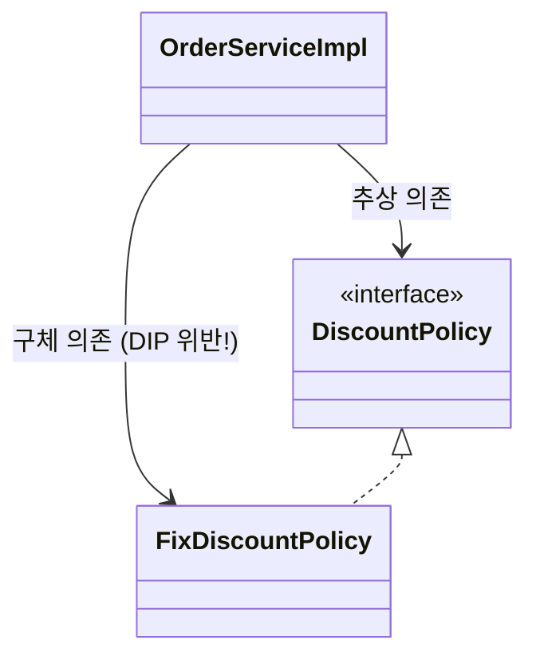
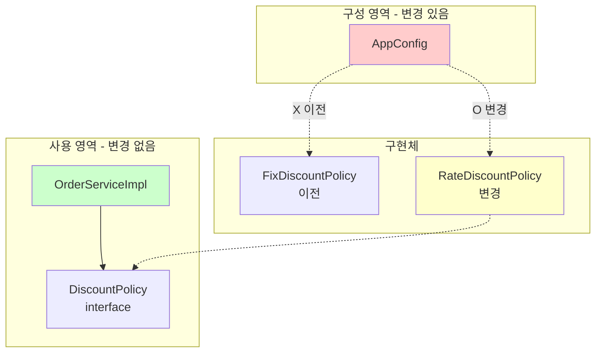
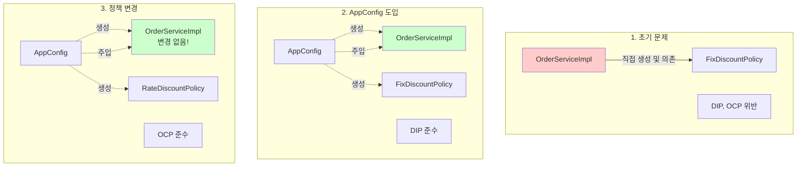
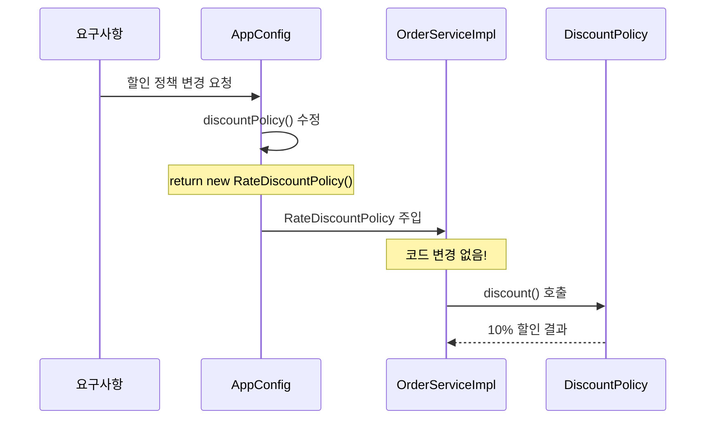

# 3-6. 전체 흐름 정리

**출처**: 인프런 - 스프링 핵심 원리 기본편
**챕터**: 3. 스프링 핵심 원리 이해2 - 객체 지향 원리 적용

---

## 학습 목표

- [ ] 지금까지의 전체 흐름을 정리할 수 있다
- [ ] 각 단계별 개선 사항을 설명할 수 있다
- [ ] Before/After 비교를 통해 개선 효과를 이해한다

---

## 지금까지의 흐름 요약

### 1단계: 새로운 할인 정책 개발

**목표**: 정률% 할인 정책 추가

**결과**:
- ✅ 다형성 덕분에 새로운 정률 할인 정책 코드를 추가로 개발하는 것 자체는 아무 문제가 없음

**구현**:
```java
public class RateDiscountPolicy implements DiscountPolicy {
    private int discountPercent = 10;

    @Override
    public int discount(Member member, int price) {
        if (member.getGrade() == Grade.VIP) {
            return price * discountPercent / 100;
        } else {
            return 0;
        }
    }
}
```

---

### 2단계: 새로운 할인 정책 적용과 문제점

**목표**: 개발한 정률 할인 정책을 실제로 적용

**문제 발견**:
- ❌ 새로 개발한 정률 할인 정책을 적용하려고 하니 **클라이언트 코드**인 주문 서비스 구현체도 함께 변경해야 함
- ❌ 주문 서비스 클라이언트가 인터페이스인 `DiscountPolicy` 뿐만 아니라, 구체 클래스인 `FixDiscountPolicy`도 함께 의존 → **DIP 위반**

**문제 코드**:
```java
public class OrderServiceImpl implements OrderService {
    // DIP 위반: 인터페이스 + 구체 클래스 의존
    private final DiscountPolicy discountPolicy = new FixDiscountPolicy();
}
```

**DIP 위반 다이어그램**:


---

### 3단계: 관심사의 분리

**목표**: DIP 위반 문제 해결

**해결 방법**:
- 애플리케이션을 하나의 **공연**으로 생각
- 기존에는 클라이언트가 의존하는 서버 구현 객체를 직접 생성하고, 실행함
- 비유를 하면 기존에는 남자 주인공 배우가 공연도 하고, 동시에 여자 주인공도 직접 초빙하는 **다양한 책임**을 가지고 있음

**공연 기획자 AppConfig 등장**:
- 공연을 구성하고, 담당 배우를 섭외하고, 지정하는 책임을 담당하는 별도의 **공연 기획자**가 나올 시점
- AppConfig는 애플리케이션의 전체 동작 방식을 **구성(config)**하기 위해, **구현 객체를 생성**하고, **연결**하는 책임
- 이제부터 클라이언트 객체는 자신의 역할을 실행하는 것만 집중, 권한이 줄어듬(**책임이 명확**해짐)

**AppConfig 코드**:
```java
public class AppConfig {
    public MemberService memberService() {
        return new MemberServiceImpl(new MemoryMemberRepository());
    }

    public OrderService orderService() {
        return new OrderServiceImpl(
            new MemoryMemberRepository(),
            new FixDiscountPolicy()
        );
    }
}
```

**생성자 주입**:
```java
public class OrderServiceImpl implements OrderService {
    // 인터페이스에만 의존 - DIP 준수!
    private final MemberRepository memberRepository;
    private final DiscountPolicy discountPolicy;

    // 생성자를 통해 외부에서 주입
    public OrderServiceImpl(MemberRepository memberRepository,
                           DiscountPolicy discountPolicy) {
        this.memberRepository = memberRepository;
        this.discountPolicy = discountPolicy;
    }
}
```

**개선 효과**:
- ✅ `OrderServiceImpl`은 `DiscountPolicy` 인터페이스에만 의존
- ✅ `OrderServiceImpl` 입장에서 생성자를 통해 어떤 구현 객체가 들어올지(주입될지)는 알 수 없음
- ✅ `OrderServiceImpl`의 생성자를 통해서 어떤 구현 객체를 주입할지는 오직 외부(`AppConfig`)에서 결정
- ✅ `OrderServiceImpl`은 이제부터 **실행에만 집중**

---

### 4단계: AppConfig 리팩터링

**목표**: 중복 제거 및 역할과 구현 명확히 분리

**문제점**:
- `new MemoryMemberRepository()`가 중복
- 역할에 따른 구현이 잘 안보임

**리팩터링 후**:
```java
public class AppConfig {
    // 역할: 회원 서비스
    public MemberService memberService() {
        return new MemberServiceImpl(memberRepository());
    }

    // 역할: 주문 서비스
    public OrderService orderService() {
        return new OrderServiceImpl(
            memberRepository(),
            discountPolicy()
        );
    }

    // 역할: 회원 저장소
    public MemberRepository memberRepository() {
        return new MemoryMemberRepository();
    }

    // 역할: 할인 정책
    public DiscountPolicy discountPolicy() {
        return new FixDiscountPolicy();
    }
}
```

**개선 효과**:
- ✅ `new MemoryMemberRepository()` 중복 제거
- ✅ `MemoryMemberRepository`를 다른 구현체로 변경할 때 **한 부분만** 변경하면 됨
- ✅ `AppConfig`를 보면 **역할**과 **구현 클래스**가 한눈에 들어옴
- ✅ 애플리케이션 전체 구성이 어떻게 되어있는지 빠르게 파악할 수 있음

---

### 5단계: 새로운 구조와 할인 정책 적용

**목표**: 정액 할인 정책 → 정률% 할인 정책으로 변경

**질문**: 어떤 부분만 변경하면 될까?

**정답**: ✅ **AppConfig의 `discountPolicy()` 메서드만 변경!**

**사용 영역과 구성 영역 분리**:


**코드 변경 - 딱 한 줄!**:
```java
public class AppConfig {
    public DiscountPolicy discountPolicy() {
        // return new FixDiscountPolicy();      // 정액 할인 (이전)
        return new RateDiscountPolicy();        // 정률 할인 (변경)
    }
}
```

**개선 효과**:
- ✅ 이제 할인 정책을 변경해도, 애플리케이션의 **구성 역할**을 담당하는 `AppConfig`만 변경하면 됨
- ✅ 클라이언트 코드인 `OrderServiceImpl`를 포함해서 **사용 영역**의 어떤 코드도 변경할 필요가 없음
- ✅ **구성 영역**은 당연히 변경됨 (구성 역할을 담당하는 AppConfig를 애플리케이션이라는 공연의 기획자로 생각하자)

---

## Before / After 비교

### Before: 문제가 있던 구조

**코드**:
```java
public class OrderServiceImpl implements OrderService {
    // DIP 위반: 구체 클래스에 의존
    private final DiscountPolicy discountPolicy = new FixDiscountPolicy();
}
```

**문제점**:
- ❌ DIP 위반: 추상화(인터페이스) + 구체화(구현 클래스) 모두 의존
- ❌ OCP 위반: 기능 확장 시 클라이언트 코드 변경 필요
- ❌ 클라이언트가 너무 많은 책임을 가짐

---

### After: 개선된 구조

**코드**:
```java
// 클라이언트: 실행에만 집중
public class OrderServiceImpl implements OrderService {
    // DIP 준수: 인터페이스에만 의존
    private final DiscountPolicy discountPolicy;

    public OrderServiceImpl(DiscountPolicy discountPolicy) {
        this.discountPolicy = discountPolicy;
    }
}

// AppConfig: 객체 생성과 연결 담당
public class AppConfig {
    public DiscountPolicy discountPolicy() {
        return new RateDiscountPolicy();  // 여기만 변경!
    }
}
```

**개선 효과**:
- ✅ DIP 준수: 인터페이스에만 의존
- ✅ OCP 준수: 확장에 열려있고 변경에 닫혀있음
- ✅ 관심사의 분리: 실행 책임 / 구성 책임 명확히 분리
- ✅ 역할과 구현 분리: 코드의 가독성 향상

---

## 전체 흐름 다이어그램



---

## 💡 핵심 정리

### AppConfig의 역할

**공연 기획자로서**:
1. 공연을 구성
2. 담당 배우를 섭외
3. 역할에 맞는 배우를 지정
4. 배우 교체는 기획자의 몫

**코드로서**:
1. 구현 객체 생성
2. 생성자를 통해 의존관계 주입(연결)
3. 전체 구성 책임

### 클라이언트(ServiceImpl)의 역할

**배우로서**:
- 자신의 역할(배역)을 수행하는 것에만 집중
- 어떤 상대역(구현체)이 선택되더라도 똑같이 공연 가능

**코드로서**:
- 담당 **기능을 실행하는 책임**만
- 어떤 구현 객체가 주입될지는 알 필요 없음
- **실행에만 집중**

---

## 변경의 흐름



---

## 정리

### 개선된 설계의 장점

**1. 단일 책임 원칙 (SRP)**:
- AppConfig: 객체 생성 및 연결
- OrderServiceImpl: 비즈니스 로직 실행

**2. 의존관계 역전 원칙 (DIP)**:
- 클라이언트 코드가 인터페이스에만 의존
- 구체 클래스는 전혀 몰라도 됨

**3. 개방-폐쇄 원칙 (OCP)**:
- 소프트웨어 요소를 새롭게 확장
- 사용 영역의 변경은 닫혀 있음

**4. 관심사의 분리**:
- 객체를 생성하고 연결하는 역할
- 실행하는 역할
- 관심사가 명확히 분리됨

---

## 다음 학습

➡️ **[3-7. 좋은 객체 지향 설계의 5가지 원칙의 적용](./3-7-좋은객체지향설계의5가지원칙의적용.md)**
- SRP, DIP, OCP 원칙 상세 분석
- 각 원칙이 어떻게 적용되었는지 확인
- SOLID 원칙의 실전 적용
