# 3-6. 전체 흐름 정리

**출처**: 인프런 - 스프링 핵심 원리 기본편
**챕터**: 3. 스프링 핵심 원리 이해2 - 객체 지향 원리 적용

---

## 학습 목표

- [ ] 지금까지의 전체 흐름을 정리할 수 있다
- [ ] 각 단계별 개선 사항을 설명할 수 있다
- [ ] Before/After 비교를 통해 개선 효과를 이해한다

---

## 지금까지의 흐름 요약

### 1단계: 새로운 할인 정책 개발

**목표**: 정률% 할인 정책 추가

**결과**:
- ✅ 다형성 덕분에 새로운 정률 할인 정책 코드를 추가로 개발하는 것 자체는 아무 문제가 없음

**구현**:
```java
public class RateDiscountPolicy implements DiscountPolicy {
    private int discountPercent = 10;

    @Override
    public int discount(Member member, int price) {
        if (member.getGrade() == Grade.VIP) {
            return price * discountPercent / 100;
        } else {
            return 0;
        }
    }
}
```

---

### 2단계: 새로운 할인 정책 적용과 문제점

**목표**: 개발한 정률 할인 정책을 실제로 적용

**문제 발견**:
- ❌ 새로 개발한 정률 할인 정책을 적용하려고 하니 **클라이언트 코드**인 주문 서비스 구현체도 함께 변경해야 함
- ❌ 주문 서비스 클라이언트가 인터페이스인 `DiscountPolicy` 뿐만 아니라, 구체 클래스인 `FixDiscountPolicy`도 함께 의존 → **DIP 위반**

**문제 코드**:
```java
public class OrderServiceImpl implements OrderService {
    // DIP 위반: 인터페이스 + 구체 클래스 의존
    private final DiscountPolicy discountPolicy = new FixDiscountPolicy();
}
```

**DIP 위반 다이어그램**:
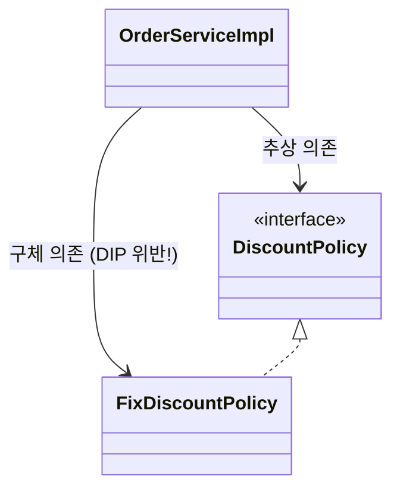

---

### 3단계: 관심사의 분리

**목표**: DIP 위반 문제 해결

**해결 방법**:
- 애플리케이션을 하나의 **공연**으로 생각
- 기존에는 클라이언트가 의존하는 서버 구현 객체를 직접 생성하고, 실행함
- 비유를 하면 기존에는 남자 주인공 배우가 공연도 하고, 동시에 여자 주인공도 직접 초빙하는 **다양한 책임**을 가지고 있음

**공연 기획자 AppConfig 등장**:
- 공연을 구성하고, 담당 배우를 섭외하고, 지정하는 책임을 담당하는 별도의 **공연 기획자**가 나올 시점
- AppConfig는 애플리케이션의 전체 동작 방식을 **구성(config)**하기 위해, **구현 객체를 생성**하고, **연결**하는 책임
- 이제부터 클라이언트 객체는 자신의 역할을 실행하는 것만 집중, 권한이 줄어듬(**책임이 명확**해짐)

**AppConfig 코드**:
```java
public class AppConfig {
    public MemberService memberService() {
        return new MemberServiceImpl(new MemoryMemberRepository());
    }

    public OrderService orderService() {
        return new OrderServiceImpl(
            new MemoryMemberRepository(),
            new FixDiscountPolicy()
        );
    }
}
```

**생성자 주입**:
```java
public class OrderServiceImpl implements OrderService {
    // 인터페이스에만 의존 - DIP 준수!
    private final MemberRepository memberRepository;
    private final DiscountPolicy discountPolicy;

    // 생성자를 통해 외부에서 주입
    public OrderServiceImpl(MemberRepository memberRepository,
                           DiscountPolicy discountPolicy) {
        this.memberRepository = memberRepository;
        this.discountPolicy = discountPolicy;
    }
}
```

**개선 효과**:
- ✅ `OrderServiceImpl`은 `DiscountPolicy` 인터페이스에만 의존
- ✅ `OrderServiceImpl` 입장에서 생성자를 통해 어떤 구현 객체가 들어올지(주입될지)는 알 수 없음
- ✅ `OrderServiceImpl`의 생성자를 통해서 어떤 구현 객체를 주입할지는 오직 외부(`AppConfig`)에서 결정
- ✅ `OrderServiceImpl`은 이제부터 **실행에만 집중**

---

### 4단계: AppConfig 리팩터링

**목표**: 중복 제거 및 역할과 구현 명확히 분리

**문제점**:
- `new MemoryMemberRepository()`가 중복
- 역할에 따른 구현이 잘 안보임

**리팩터링 후**:
```java
public class AppConfig {
    // 역할: 회원 서비스
    public MemberService memberService() {
        return new MemberServiceImpl(memberRepository());
    }

    // 역할: 주문 서비스
    public OrderService orderService() {
        return new OrderServiceImpl(
            memberRepository(),
            discountPolicy()
        );
    }

    // 역할: 회원 저장소
    public MemberRepository memberRepository() {
        return new MemoryMemberRepository();
    }

    // 역할: 할인 정책
    public DiscountPolicy discountPolicy() {
        return new FixDiscountPolicy();
    }
}
```

**개선 효과**:
- ✅ `new MemoryMemberRepository()` 중복 제거
- ✅ `MemoryMemberRepository`를 다른 구현체로 변경할 때 **한 부분만** 변경하면 됨
- ✅ `AppConfig`를 보면 **역할**과 **구현 클래스**가 한눈에 들어옴
- ✅ 애플리케이션 전체 구성이 어떻게 되어있는지 빠르게 파악할 수 있음

---

### 5단계: 새로운 구조와 할인 정책 적용

**목표**: 정액 할인 정책 → 정률% 할인 정책으로 변경

**질문**: 어떤 부분만 변경하면 될까?

**정답**: ✅ **AppConfig의 `discountPolicy()` 메서드만 변경!**

**사용 영역과 구성 영역 분리**:
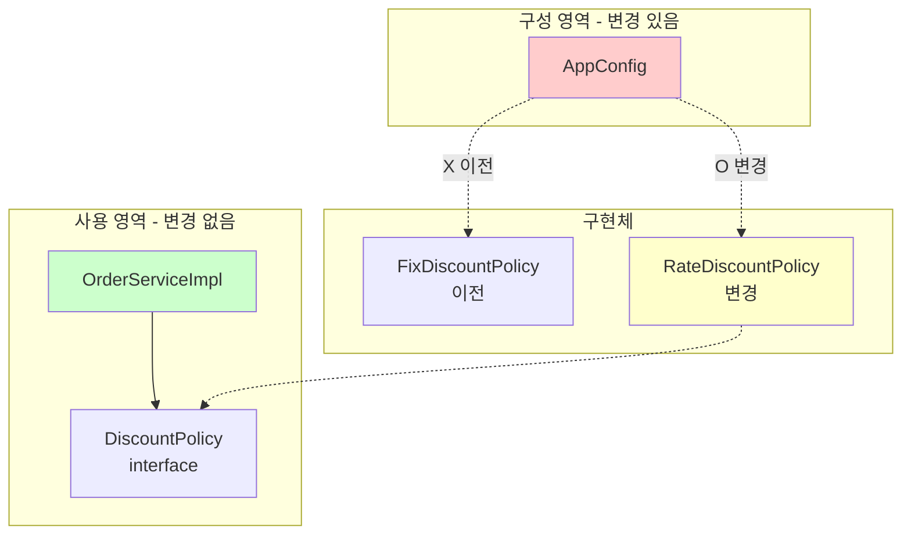

**코드 변경 - 딱 한 줄!**:
```java
public class AppConfig {
    public DiscountPolicy discountPolicy() {
        // return new FixDiscountPolicy();      // 정액 할인 (이전)
        return new RateDiscountPolicy();        // 정률 할인 (변경)
    }
}
```

**개선 효과**:
- ✅ 이제 할인 정책을 변경해도, 애플리케이션의 **구성 역할**을 담당하는 `AppConfig`만 변경하면 됨
- ✅ 클라이언트 코드인 `OrderServiceImpl`를 포함해서 **사용 영역**의 어떤 코드도 변경할 필요가 없음
- ✅ **구성 영역**은 당연히 변경됨 (구성 역할을 담당하는 AppConfig를 애플리케이션이라는 공연의 기획자로 생각하자)

---

## Before / After 비교

### Before: 문제가 있던 구조

**코드**:
```java
public class OrderServiceImpl implements OrderService {
    // DIP 위반: 구체 클래스에 의존
    private final DiscountPolicy discountPolicy = new FixDiscountPolicy();
}
```

**문제점**:
- ❌ DIP 위반: 추상화(인터페이스) + 구체화(구현 클래스) 모두 의존
- ❌ OCP 위반: 기능 확장 시 클라이언트 코드 변경 필요
- ❌ 클라이언트가 너무 많은 책임을 가짐

---

### After: 개선된 구조

**코드**:
```java
// 클라이언트: 실행에만 집중
public class OrderServiceImpl implements OrderService {
    // DIP 준수: 인터페이스에만 의존
    private final DiscountPolicy discountPolicy;

    public OrderServiceImpl(DiscountPolicy discountPolicy) {
        this.discountPolicy = discountPolicy;
    }
}

// AppConfig: 객체 생성과 연결 담당
public class AppConfig {
    public DiscountPolicy discountPolicy() {
        return new RateDiscountPolicy();  // 여기만 변경!
    }
}
```

**개선 효과**:
- ✅ DIP 준수: 인터페이스에만 의존
- ✅ OCP 준수: 확장에 열려있고 변경에 닫혀있음
- ✅ 관심사의 분리: 실행 책임 / 구성 책임 명확히 분리
- ✅ 역할과 구현 분리: 코드의 가독성 향상

---

## 전체 흐름 다이어그램

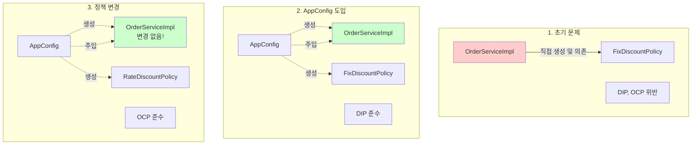

---

## 💡 핵심 정리

### AppConfig의 역할

**공연 기획자로서**:
1. 공연을 구성
2. 담당 배우를 섭외
3. 역할에 맞는 배우를 지정
4. 배우 교체는 기획자의 몫

**코드로서**:
1. 구현 객체 생성
2. 생성자를 통해 의존관계 주입(연결)
3. 전체 구성 책임

### 클라이언트(ServiceImpl)의 역할

**배우로서**:
- 자신의 역할(배역)을 수행하는 것에만 집중
- 어떤 상대역(구현체)이 선택되더라도 똑같이 공연 가능

**코드로서**:
- 담당 **기능을 실행하는 책임**만
- 어떤 구현 객체가 주입될지는 알 필요 없음
- **실행에만 집중**

---

## 변경의 흐름

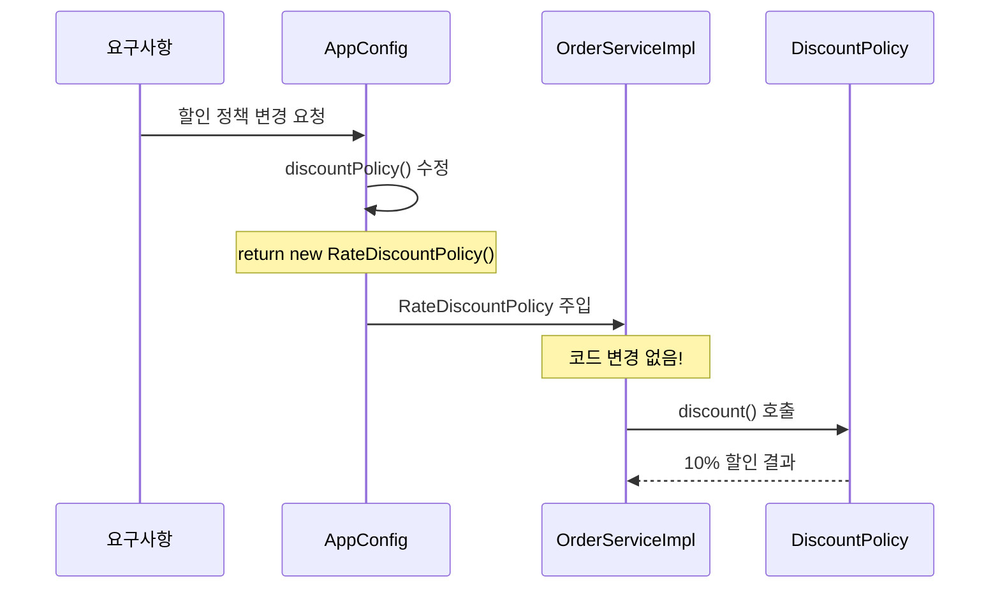

---

## 정리

### 개선된 설계의 장점

**1. 단일 책임 원칙 (SRP)**:
- AppConfig: 객체 생성 및 연결
- OrderServiceImpl: 비즈니스 로직 실행

**2. 의존관계 역전 원칙 (DIP)**:
- 클라이언트 코드가 인터페이스에만 의존
- 구체 클래스는 전혀 몰라도 됨

**3. 개방-폐쇄 원칙 (OCP)**:
- 소프트웨어 요소를 새롭게 확장
- 사용 영역의 변경은 닫혀 있음

**4. 관심사의 분리**:
- 객체를 생성하고 연결하는 역할
- 실행하는 역할
- 관심사가 명확히 분리됨

---

## 📚 전체 흐름 심층 분석

> **5단계 개선 과정을 단계별로 상세히 이해하기**

### 1단계 심층 분석: 새로운 할인 정책 개발

#### 배경과 요구사항

**비즈니스 요구사항 변경**:
```
기획팀: "고정 금액 할인은 VIP 고객에게 매력이 없어요.
        구매 금액의 10%를 할인해주는 정률 할인으로 바꿔주세요!"
```

**개발자 관점**:
- 기존: `FixDiscountPolicy` (1000원 고정 할인)
- 신규: `RateDiscountPolicy` (10% 정률 할인)

#### 다형성의 힘

**인터페이스 덕분에 새 구현체 추가 가능**:

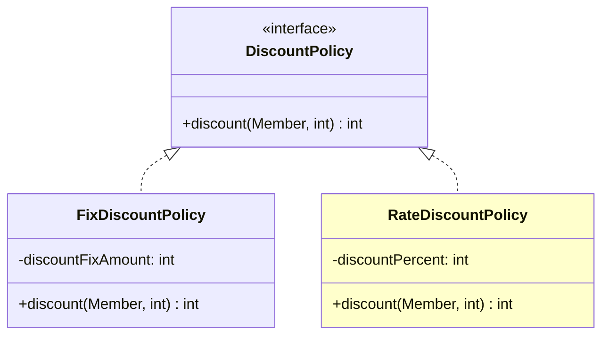

**새 구현체 추가 코드**:

```java
public class RateDiscountPolicy implements DiscountPolicy {

    private int discountPercent = 10; // 10% 할인

    @Override
    public int discount(Member member, int price) {
        if (member.getGrade() == Grade.VIP) {
            // 가격의 10%를 할인
            return price * discountPercent / 100;
        } else {
            return 0;
        }
    }
}
```

**동작 비교**:

| 상황 | FixDiscountPolicy | RateDiscountPolicy |
|------|-------------------|-------------------|
| **VIP 회원, 10,000원 구매** | 1,000원 할인 | 1,000원 할인 (10%) |
| **VIP 회원, 20,000원 구매** | 1,000원 할인 | 2,000원 할인 (10%) |
| **VIP 회원, 50,000원 구매** | 1,000원 할인 | 5,000원 할인 (10%) |
| **일반 회원, 10,000원 구매** | 0원 할인 | 0원 할인 |

**테스트 코드 작성**:

```java
class RateDiscountPolicyTest {

    RateDiscountPolicy discountPolicy = new RateDiscountPolicy();

    @Test
    @DisplayName("VIP는 10% 할인이 적용되어야 한다")
    void vip_o() {
        // given
        Member member = new Member(1L, "memberVIP", Grade.VIP);

        // when
        int discount = discountPolicy.discount(member, 10000);

        // then
        assertThat(discount).isEqualTo(1000);
    }

    @Test
    @DisplayName("VIP가 아니면 할인이 적용되지 않아야 한다")
    void vip_x() {
        // given
        Member member = new Member(2L, "memberBASIC", Grade.BASIC);

        // when
        int discount = discountPolicy.discount(member, 10000);

        // then
        assertThat(discount).isEqualTo(0);
    }
}
```

**1단계 결론**:
- ✅ 다형성 덕분에 새 구현체 추가는 문제없음
- ✅ 단위 테스트 통과
- ⚠️ **하지만 실제 적용 시 문제 발생!** → 2단계로 이어짐

---

### 2단계 심층 분석: 새로운 할인 정책 적용과 문제점

#### 실제 적용 시도

**OrderServiceImpl 변경 시도**:

```java
public class OrderServiceImpl implements OrderService {

    // 변경 전
    // private final DiscountPolicy discountPolicy = new FixDiscountPolicy();

    // 변경 후
    private final DiscountPolicy discountPolicy = new RateDiscountPolicy();

    // ...
}
```

**문제 발견**: "어? 클라이언트 코드를 수정해야 하네?"

#### 문제 분석: DIP 위반

**코드 의존관계 분석**:

```java
public class OrderServiceImpl implements OrderService {

    private final DiscountPolicy discountPolicy = new FixDiscountPolicy();
    //            ↑                                      ↑
    //       인터페이스 의존                        구체 클래스 의존
    //       (추상 의존)                           (구체 의존)
}
```

**의존관계 다이어그램**:

```mermaid
graph TB
    subgraph "OrderServiceImpl 내부"
    A[OrderServiceImpl]
    end

    subgraph "추상 레벨"
    B[DiscountPolicy<br/>interface]
    end

    subgraph "구체 레벨"
    C[FixDiscountPolicy]
    D[RateDiscountPolicy]
    end

    A -->|1. 인터페이스 의존<br/>추상 의존| B
    A -.->|2. 구체 클래스 의존<br/>DIP 위반!| C

    B <|.. C
    B <|.. D

    style A fill:#ffcccc
    style C fill:#ffcccc
```

**DIP 위반 상세 분석**:

| 원칙 | 내용 | 현재 상태 |
|------|------|----------|
| **DIP** | 프로그래머는 "추상화에 의존해야지, 구체화에 의존하면 안된다" | ❌ `DiscountPolicy` (추상) + `FixDiscountPolicy` (구체) 둘 다 의존 |
| **OCP** | 소프트웨어 요소는 확장에는 열려 있으나 변경에는 닫혀 있어야 한다 | ❌ 정책 변경 시 클라이언트 코드(`OrderServiceImpl`) 변경 필요 |

#### 문제 발생 시나리오

**시나리오 1: FixDiscountPolicy → RateDiscountPolicy 변경**

```java
// Before
private final DiscountPolicy discountPolicy = new FixDiscountPolicy();

// After
private final DiscountPolicy discountPolicy = new RateDiscountPolicy();
```

**영향받는 코드**:
- ❌ `OrderServiceImpl.java` 수정 필요
- ❌ 컴파일 다시 필요
- ❌ 배포 다시 필요
- ❌ 테스트 다시 필요

**시나리오 2: 만약 여러 곳에서 사용한다면?**

```java
// OrderServiceImpl.java
private final DiscountPolicy discountPolicy = new FixDiscountPolicy();

// OrderController.java (만약 있다면)
private final DiscountPolicy discountPolicy = new FixDiscountPolicy();

// OrderBatch.java (만약 있다면)
private final DiscountPolicy discountPolicy = new FixDiscountPolicy();

// ... 모든 곳을 수정해야 함!
```

**문제의 본질**:
```
클라이언트(OrderServiceImpl)가 너무 많은 것을 알고 있다!
- 자신이 사용할 인터페이스(DiscountPolicy)를 알고
- 어떤 구체 클래스(FixDiscountPolicy)를 사용할지도 직접 결정
→ 책임 과다!
```

#### 해결 방향

**이상적인 코드**:

```java
public class OrderServiceImpl implements OrderService {

    // 인터페이스에만 의존 - DIP 준수!
    private final DiscountPolicy discountPolicy;

    // 구체 클래스는 어디서? → 외부에서 주입받자!
}
```

**질문**: "그럼 누가 구체 클래스를 결정하고 주입해주지?"
**답**: "AppConfig 등장!" → 3단계로 이어짐

---

### 3단계 심층 분석: 관심사의 분리

#### 공연 비유 심화

**잘못된 구조 (현재)**:

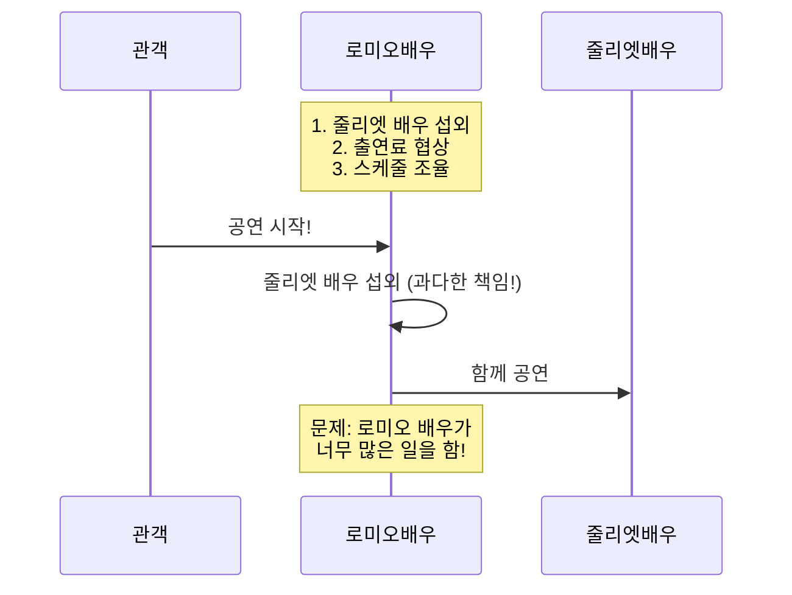

**올바른 구조 (목표)**:

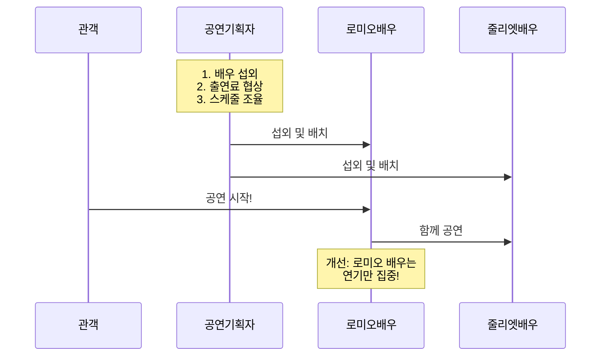

#### AppConfig 설계 원칙

**AppConfig의 책임**:

```java
/**
 * AppConfig: 애플리케이션 구성 담당
 *
 * 책임:
 * 1. 구현 객체 생성
 * 2. 의존관계 연결 (생성자 주입)
 * 3. 전체 구성 관리
 */
public class AppConfig {

    // 회원 서비스 구성
    public MemberService memberService() {
        return new MemberServiceImpl(memberRepository());
    }

    // 주문 서비스 구성
    public OrderService orderService() {
        return new OrderServiceImpl(
            memberRepository(),
            discountPolicy()
        );
    }

    // 회원 저장소 구성
    public MemberRepository memberRepository() {
        return new MemoryMemberRepository();
    }

    // 할인 정책 구성
    public DiscountPolicy discountPolicy() {
        return new FixDiscountPolicy();  // 여기만 변경하면 됨!
    }
}
```

#### 생성자 주입 상세 분석

**Before: 직접 생성**:

```java
public class OrderServiceImpl implements OrderService {

    // 내가 직접 결정
    private final MemberRepository memberRepository
        = new MemoryMemberRepository();
    private final DiscountPolicy discountPolicy
        = new FixDiscountPolicy();

    // 문제점:
    // 1. 구체 클래스에 의존 (DIP 위반)
    // 2. 변경 시 이 코드 수정 필요 (OCP 위반)
    // 3. 테스트 시 Mock 주입 불가능
}
```

**After: 생성자 주입**:

```java
public class OrderServiceImpl implements OrderService {

    // 인터페이스에만 의존
    private final MemberRepository memberRepository;
    private final DiscountPolicy discountPolicy;

    // 생성자를 통해 외부에서 주입
    public OrderServiceImpl(MemberRepository memberRepository,
                           DiscountPolicy discountPolicy) {
        this.memberRepository = memberRepository;
        this.discountPolicy = discountPolicy;
    }

    // 장점:
    // 1. 인터페이스에만 의존 (DIP 준수)
    // 2. 변경 시 이 코드 수정 불필요 (OCP 준수)
    // 3. 테스트 시 Mock 주입 가능
}
```

**실행 흐름 상세**:

```java
// 1. AppConfig 생성
AppConfig appConfig = new AppConfig();

// 2. orderService() 메서드 호출
OrderService orderService = appConfig.orderService();

// 3. AppConfig 내부 동작 (단계별 분석)

// 3-1. memberRepository() 호출
MemberRepository memberRepository = new MemoryMemberRepository();  // @x001

// 3-2. discountPolicy() 호출
DiscountPolicy discountPolicy = new FixDiscountPolicy();  // @x002

// 3-3. OrderServiceImpl 생성 및 주입
OrderServiceImpl orderServiceImpl = new OrderServiceImpl(
    memberRepository,  // @x001 참조 전달
    discountPolicy     // @x002 참조 전달
);

// 3-4. OrderServiceImpl 생성자 내부
public OrderServiceImpl(MemberRepository memberRepository,
                       DiscountPolicy discountPolicy) {
    this.memberRepository = memberRepository;  // @x001 저장
    this.discountPolicy = discountPolicy;      // @x002 저장
}

// 4. OrderService 타입으로 반환
return orderServiceImpl;  // @x003
```

**메모리 상태**:

```
Heap Memory:
┌─────────────────────────────────────────────┐
│ MemoryMemberRepository @x001                │
│   - store: Map<Long, Member>                │
├─────────────────────────────────────────────┤
│ FixDiscountPolicy @x002                     │
│   - discountFixAmount: 1000                 │
├─────────────────────────────────────────────┤
│ OrderServiceImpl @x003                      │
│   - memberRepository: @x001 ────────────┐   │
│   - discountPolicy: @x002 ──────────┐   │   │
└─────────────────────────────────────┼───┼───┘
                                      │   │
                                      ↓   ↓
                                    참조 관계
```

#### 책임 분리 효과

**Before: 책임 과다**:

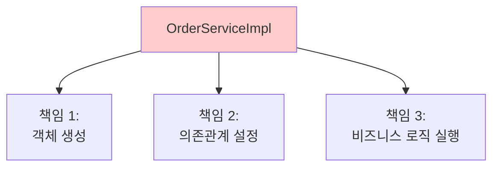

**After: 책임 분리**:

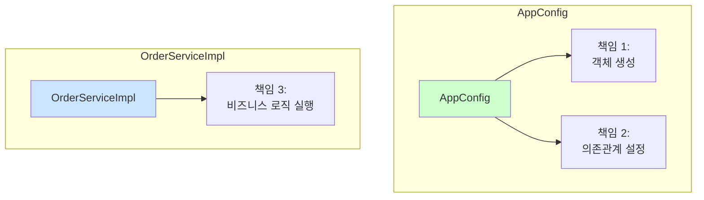

---

### 4단계 심층 분석: AppConfig 리팩터링

#### 리팩터링 전 문제점

**문제 1: 중복 코드**:

```java
public class AppConfig {

    public MemberService memberService() {
        return new MemberServiceImpl(
            new MemoryMemberRepository()  // ← 중복 1
        );
    }

    public OrderService orderService() {
        return new OrderServiceImpl(
            new MemoryMemberRepository(),  // ← 중복 2
            new FixDiscountPolicy()
        );
    }
}
```

**중복의 문제**:
- `MemoryMemberRepository`를 `JdbcMemberRepository`로 변경하려면?
- 2곳을 모두 수정해야 함
- 실수로 한 곳만 변경할 위험

**문제 2: 역할이 명확하지 않음**:

```java
// 질문: 이 코드만 보고 어떤 Repository를 사용하는지 한눈에 보이나요?
public MemberService memberService() {
    return new MemberServiceImpl(new MemoryMemberRepository());
}

// 질문: 이 코드만 보고 어떤 DiscountPolicy를 사용하는지 한눈에 보이나요?
public OrderService orderService() {
    return new OrderServiceImpl(
        new MemoryMemberRepository(),
        new FixDiscountPolicy()
    );
}
```

#### 리팩터링 과정

**Step 1: 중복 제거 - 메서드 추출**:

```java
public class AppConfig {

    public MemberService memberService() {
        return new MemberServiceImpl(memberRepository());  // 메서드 호출로 변경
    }

    public OrderService orderService() {
        return new OrderServiceImpl(
            memberRepository(),  // 메서드 호출로 변경
            discountPolicy()     // 메서드 호출로 변경
        );
    }

    // 추출: 회원 저장소 역할
    public MemberRepository memberRepository() {
        return new MemoryMemberRepository();  // 구현체는 여기만!
    }

    // 추출: 할인 정책 역할
    public DiscountPolicy discountPolicy() {
        return new FixDiscountPolicy();  // 구현체는 여기만!
    }
}
```

**Step 2: 역할과 구현 명확히 분리**:

```java
public class AppConfig {

    //========== 애플리케이션 구성 ==========//

    /**
     * 역할: 회원 서비스
     * 구현: MemberServiceImpl + MemoryMemberRepository
     */
    public MemberService memberService() {
        return new MemberServiceImpl(memberRepository());
    }

    /**
     * 역할: 주문 서비스
     * 구현: OrderServiceImpl + MemoryMemberRepository + FixDiscountPolicy
     */
    public OrderService orderService() {
        return new OrderServiceImpl(
            memberRepository(),
            discountPolicy()
        );
    }

    //========== 인프라 구성 ==========//

    /**
     * 역할: 회원 저장소
     * 구현: MemoryMemberRepository (나중에 변경 가능)
     */
    public MemberRepository memberRepository() {
        return new MemoryMemberRepository();
    }

    /**
     * 역할: 할인 정책
     * 구현: FixDiscountPolicy (나중에 변경 가능)
     */
    public DiscountPolicy discountPolicy() {
        return new FixDiscountPolicy();
    }
}
```

#### 리팩터링 효과 비교

**변경 시나리오 1: Repository 변경**

```java
// Before 리팩터링: 2곳 수정 필요
public MemberService memberService() {
    return new MemberServiceImpl(new JdbcMemberRepository());  // 수정 1
}

public OrderService orderService() {
    return new OrderServiceImpl(
        new JdbcMemberRepository(),  // 수정 2
        new FixDiscountPolicy()
    );
}

// After 리팩터링: 1곳만 수정
public MemberRepository memberRepository() {
    // return new MemoryMemberRepository();
    return new JdbcMemberRepository();  // 여기만 수정!
}
```

**변경 시나리오 2: 정책 변경**

```java
// After 리팩터링
public DiscountPolicy discountPolicy() {
    // return new FixDiscountPolicy();
    return new RateDiscountPolicy();  // 여기만 수정!
}
```

**가독성 비교**:

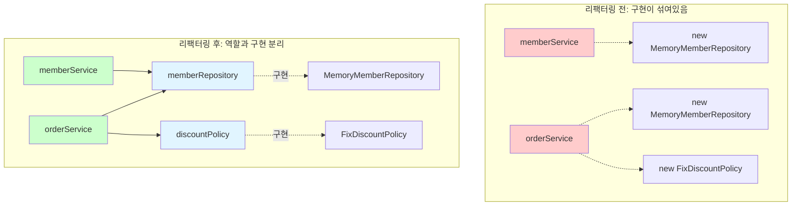

---

### 5단계 심층 분석: 새로운 구조와 할인 정책 적용

#### 사용 영역과 구성 영역의 분리

**핵심 개념**:
```
애플리케이션 = 사용 영역 + 구성 영역

사용 영역: 실제 비즈니스 로직을 수행하는 코드
구성 영역: 객체를 생성하고 연결하는 설정 코드
```

**영역 분리 다이어그램**:

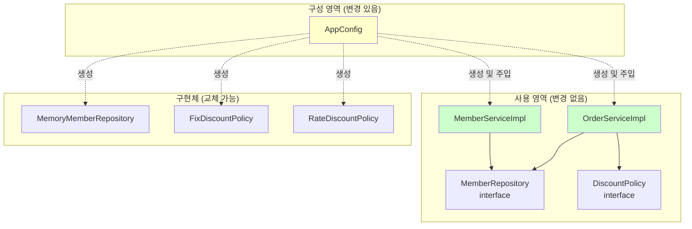

#### 정책 변경 실습

**요구사항**: 정액 할인 → 정률 할인

**변경 전 전체 코드**:

```java
// ========== 구성 영역 ==========
public class AppConfig {
    public DiscountPolicy discountPolicy() {
        return new FixDiscountPolicy();  // 정액 할인
    }
}

// ========== 사용 영역 ==========
public class OrderServiceImpl implements OrderService {
    private final DiscountPolicy discountPolicy;

    public OrderServiceImpl(DiscountPolicy discountPolicy) {
        this.discountPolicy = discountPolicy;
    }

    @Override
    public Order createOrder(Long memberId, String itemName, int itemPrice) {
        Member member = memberRepository.findById(memberId);
        int discountPrice = discountPolicy.discount(member, itemPrice);
        return new Order(memberId, itemName, itemPrice, discountPrice);
    }
}
```

**변경: 딱 한 줄만 수정!**

```java
// ========== 구성 영역 - 수정 ==========
public class AppConfig {
    public DiscountPolicy discountPolicy() {
        // return new FixDiscountPolicy();     // 정액 할인 (이전)
        return new RateDiscountPolicy();       // 정률 할인 (변경)
    }
}

// ========== 사용 영역 - 수정 없음! ==========
public class OrderServiceImpl implements OrderService {
    // 이 코드는 전혀 건드리지 않음!
    private final DiscountPolicy discountPolicy;

    public OrderServiceImpl(DiscountPolicy discountPolicy) {
        this.discountPolicy = discountPolicy;
    }

    @Override
    public Order createOrder(Long memberId, String itemName, int itemPrice) {
        Member member = memberRepository.findById(memberId);
        int discountPrice = discountPolicy.discount(member, itemPrice);  // 그대로!
        return new Order(memberId, itemName, itemPrice, discountPrice);
    }
}
```

#### 변경 영향 범위 상세 분석

**Before AppConfig (많은 파일 수정 필요)**:

```
변경 영향 범위:
├── OrderServiceImpl.java ❌ 수정 필요
├── OrderApp.java ❌ 수정 필요
├── OrderServiceTest.java ❌ 수정 필요
├── OrderController.java ❌ 수정 필요
└── ... 기타 사용하는 모든 곳 ❌ 수정 필요
```

**After AppConfig (한 파일만 수정)**:

```
변경 영향 범위:
├── AppConfig.java ✅ 수정 (1곳만!)
├── OrderServiceImpl.java ⭕ 수정 불필요
├── OrderApp.java ⭕ 수정 불필요
├── OrderServiceTest.java ⭕ 수정 불필요
├── OrderController.java ⭕ 수정 불필요
└── ... 기타 사용하는 모든 곳 ⭕ 수정 불필요
```

**실행 흐름 비교**:

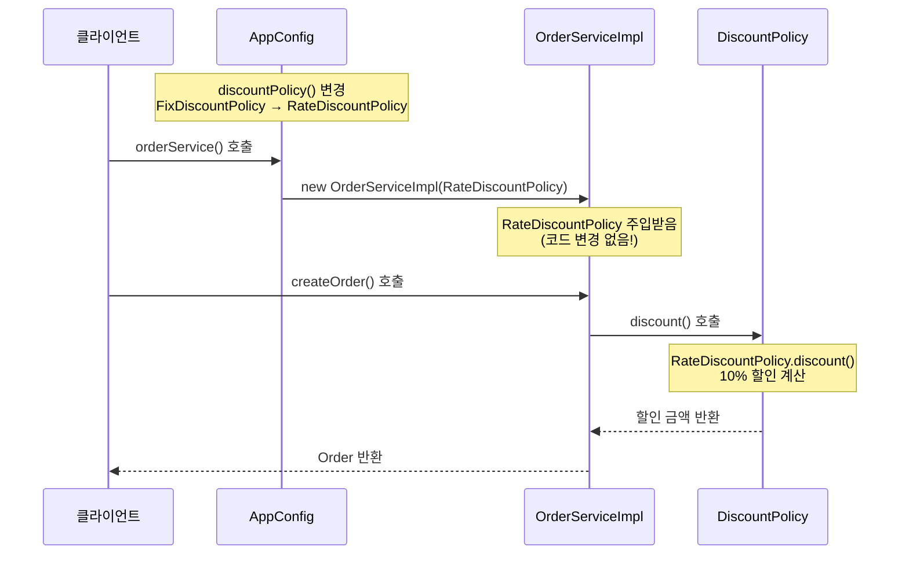

#### OCP 원칙 준수 확인

**OCP (Open-Closed Principle)**:
> 소프트웨어 요소는 확장에는 열려 있으나 변경에는 닫혀 있어야 한다

**확장에 열려있다**:
```java
// 새로운 정책을 얼마든지 추가 가능
public class SeasonDiscountPolicy implements DiscountPolicy { ... }
public class BirthdayDiscountPolicy implements DiscountPolicy { ... }
```

**변경에 닫혀있다**:
```java
// 사용 영역(OrderServiceImpl)은 전혀 수정하지 않음
public class OrderServiceImpl implements OrderService {
    private final DiscountPolicy discountPolicy;  // 그대로!
    // ...
}
```

**비교표**:

| 항목 | Before AppConfig | After AppConfig |
|------|------------------|-----------------|
| **새 정책 추가** | 가능 | 가능 ✅ |
| **사용 영역 수정** | 필요 ❌ | 불필요 ✅ |
| **구성 영역 수정** | 필요 | 필요 |
| **OCP 준수** | 위반 ❌ | 준수 ✅ |

---

## 📊 5단계 전체 흐름 한눈에 보기

### 타임라인 다이어그램

```mermaid
gantt
    title 5단계 개선 과정
    dateFormat X
    axisFormat %s

    section 1단계
    새 정책 개발 : 0, 1

    section 2단계
    문제 발견 : 1, 2

    section 3단계
    AppConfig 도입 : 2, 3

    section 4단계
    리팩터링 : 3, 4

    section 5단계
    정책 적용 : 4, 5
```

### 각 단계별 핵심 키워드

| 단계 | 핵심 키워드 | 상태 |
|------|------------|------|
| **1단계** | 다형성, 인터페이스, 새 구현체 | ✅ 개발 완료 |
| **2단계** | DIP 위반, OCP 위반, 문제 발견 | ⚠️ 문제 인식 |
| **3단계** | AppConfig, 생성자 주입, 관심사 분리 | ✅ DIP 해결 |
| **4단계** | 리팩터링, 중복 제거, 역할 분리 | ✅ 가독성 개선 |
| **5단계** | 정책 적용, 사용/구성 분리, OCP 준수 | ✅ OCP 해결 |

### 코드 진화 과정

**1단계: 새 정책 개발**
```java
✅ class RateDiscountPolicy implements DiscountPolicy { ... }
```

**2단계: 문제 발견**
```java
❌ private final DiscountPolicy discountPolicy = new FixDiscountPolicy();
   // DIP 위반! OCP 위반!
```

**3단계: AppConfig 도입**
```java
✅ class AppConfig {
    public DiscountPolicy discountPolicy() {
        return new FixDiscountPolicy();
    }
}
✅ class OrderServiceImpl {
    private final DiscountPolicy discountPolicy;  // 인터페이스만 의존!
}
```

**4단계: 리팩터링**
```java
✅ class AppConfig {
    // 역할과 구현 명확히 분리
    public DiscountPolicy discountPolicy() { return new FixDiscountPolicy(); }
    public MemberRepository memberRepository() { return new MemoryMemberRepository(); }
}
```

**5단계: 정책 적용**
```java
✅ class AppConfig {
    public DiscountPolicy discountPolicy() {
        return new RateDiscountPolicy();  // 딱 한 줄만 변경!
    }
}
```

---

## 🎯 핵심 개념 정리

### 1. 사용 영역 vs 구성 영역

**사용 영역 (Using Area)**:
- **역할**: 비즈니스 로직 실행
- **변경 빈도**: 낮음
- **예시**: `OrderServiceImpl`, `MemberServiceImpl`
- **특징**: 안정적, DIP 준수

**구성 영역 (Configuration Area)**:
- **역할**: 객체 생성 및 연결
- **변경 빈도**: 높음 (요구사항 변경 시)
- **예시**: `AppConfig`
- **특징**: 유연함, 변경 집중

### 2. 제어의 흐름

**Before**:
```
OrderServiceImpl → (직접 생성) → FixDiscountPolicy
```

**After**:
```
AppConfig → (생성 및 주입) → OrderServiceImpl
         → (생성) → RateDiscountPolicy

OrderServiceImpl → (사용만) → DiscountPolicy (인터페이스)
```

### 3. 의존관계 변화

**Before: 컴파일 의존관계 = 런타임 의존관계**
```java
// 컴파일 시점
OrderServiceImpl → DiscountPolicy (인터페이스)
                → FixDiscountPolicy (구체 클래스) ❌

// 런타임 시점
OrderServiceImpl → FixDiscountPolicy 인스턴스
```

**After: 컴파일 의존관계 ≠ 런타임 의존관계**
```java
// 컴파일 시점
OrderServiceImpl → DiscountPolicy (인터페이스만) ✅

// 런타임 시점 (AppConfig가 결정)
OrderServiceImpl → RateDiscountPolicy 인스턴스
```

---

## 📝 실습 체크리스트

### 이해도 점검

- [ ] 1단계: 새 할인 정책을 왜 쉽게 추가할 수 있었는가?
- [ ] 2단계: DIP 위반이 무엇인지 설명할 수 있는가?
- [ ] 2단계: OCP 위반이 무엇인지 설명할 수 있는가?
- [ ] 3단계: AppConfig의 역할을 설명할 수 있는가?
- [ ] 3단계: 생성자 주입의 장점을 설명할 수 있는가?
- [ ] 4단계: 왜 리팩터링이 필요했는지 설명할 수 있는가?
- [ ] 5단계: 사용 영역과 구성 영역의 차이를 설명할 수 있는가?
- [ ] 5단계: OCP가 어떻게 지켜졌는지 설명할 수 있는가?

### 코드 작성 실습

**실습 1: 새로운 정책 추가**
```java
// TODO: VIP 회원에게 생일 달에 추가 20% 할인을 제공하는 정책 추가
// 1. BirthdayDiscountPolicy 클래스 작성
// 2. AppConfig에서 적용
// 3. OrderServiceImpl은 수정하지 않고 동작하는지 확인

public class BirthdayDiscountPolicy implements DiscountPolicy {
    // TODO: 구현
}
```

**실습 2: Repository 변경**
```java
// TODO: MemoryMemberRepository를 JdbcMemberRepository로 변경
// 1. JdbcMemberRepository 클래스 작성
// 2. AppConfig의 어느 부분을 수정해야 하는가?
// 3. 몇 군데를 수정해야 하는가?

public class JdbcMemberRepository implements MemberRepository {
    // TODO: 구현
}
```

**실습 3: 다중 정책 적용**
```java
// TODO: 할인 정책을 여러 개 조합하는 기능 추가
// 예: VIP는 정률 할인 + 쿠폰 할인
// 1. CompositeDiscountPolicy 클래스 작성
// 2. AppConfig에서 적용

public class CompositeDiscountPolicy implements DiscountPolicy {
    private final List<DiscountPolicy> policies;
    // TODO: 구현
}
```

---

## ❓ 심화 FAQ

**Q1. AppConfig에서 매번 new를 하는데, 성능상 문제는 없나요?**

A1. 현재 코드의 문제:
```java
public MemberService memberService() {
    return new MemberServiceImpl(memberRepository());
}

public OrderService orderService() {
    return new OrderServiceImpl(
        memberRepository(),  // 새로운 인스턴스
        discountPolicy()
    );
}

public MemberRepository memberRepository() {
    return new MemoryMemberRepository();  // 매번 새로 생성!
}
```

**문제점**: `memberService()`와 `orderService()`를 호출할 때마다 각각 다른 `MemoryMemberRepository` 인스턴스가 생성됨

**해결책 미리보기** (다음 챕터):
```java
// 스프링 컨테이너 사용 시
@Configuration
public class AppConfig {

    @Bean
    public MemberRepository memberRepository() {
        return new MemoryMemberRepository();
    }
}
// → 스프링이 싱글톤으로 관리해줌!
```

**Q2. 생성자가 많아지면 어떻게 하나요?**

A2. 생성자 파라미터가 많을 때:
```java
// 문제: 생성자 파라미터가 너무 많음
public OrderServiceImpl(
    MemberRepository memberRepository,
    DiscountPolicy discountPolicy,
    DeliveryPolicy deliveryPolicy,
    PaymentPolicy paymentPolicy,
    NotificationService notificationService
) {
    // ...
}
```

**해결 방법**:
1. **빌더 패턴** 사용
2. **인터페이스 분리** (ISP 원칙)
3. **클래스 분리** (책임이 너무 많은 것은 아닌지 검토)

**Q3. 테스트할 때는 어떻게 하나요?**

A3. 생성자 주입 덕분에 테스트가 쉬워짐:
```java
class OrderServiceTest {

    @Test
    void createOrder() {
        // given: Mock 객체 생성
        MemberRepository mockRepository = new MockMemberRepository();
        DiscountPolicy mockPolicy = new MockDiscountPolicy();

        // when: Mock을 주입하여 테스트
        OrderService orderService = new OrderServiceImpl(
            mockRepository,
            mockPolicy
        );

        // then: 단위 테스트 수행
        Order order = orderService.createOrder(1L, "item", 10000);
        assertThat(order.getDiscountPrice()).isEqualTo(1000);
    }
}
```

**Q4. AppConfig가 커지면 어떻게 관리하나요?**

A4. 설정을 분리:
```java
// AppConfig가 커질 경우

@Configuration
public class AppConfig {
    // 메인 설정만
}

@Configuration
public class InfraConfig {
    // 인프라 관련 설정 (DB, Cache 등)
}

@Configuration
public class ServiceConfig {
    // 서비스 관련 설정
}
```

---

## 다음 학습

➡️ **[3-7. 좋은 객체 지향 설계의 5가지 원칙의 적용](./3-7-좋은객체지향설계의5가지원칙의적용.md)**
- SRP, DIP, OCP 원칙 상세 분석
- 각 원칙이 어떻게 적용되었는지 확인
- SOLID 원칙의 실전 적용
