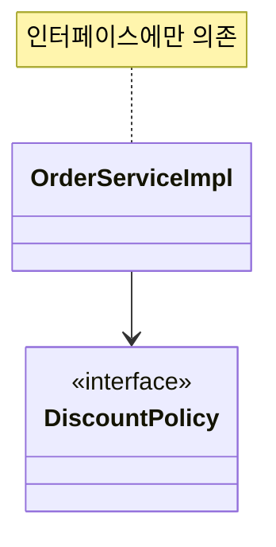
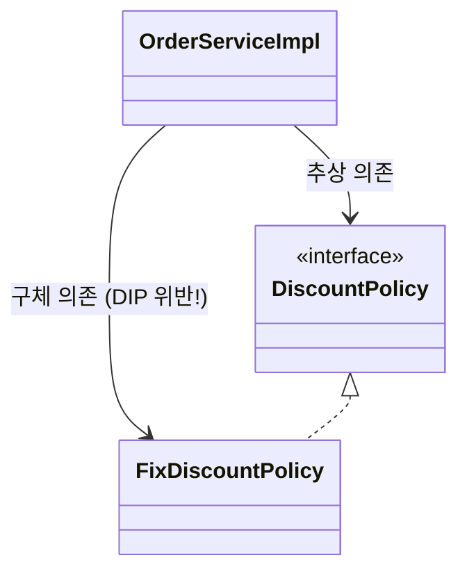
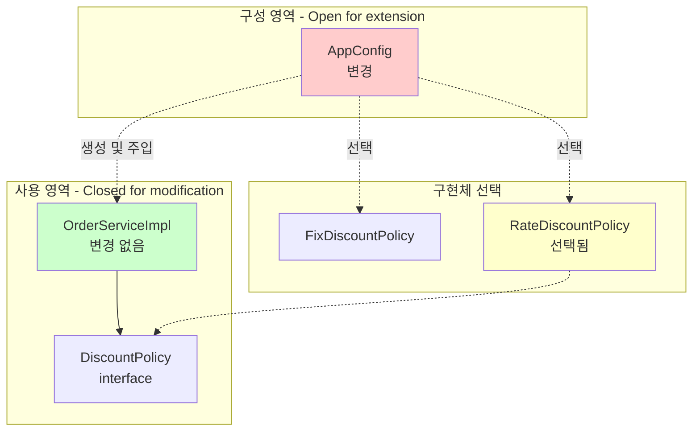
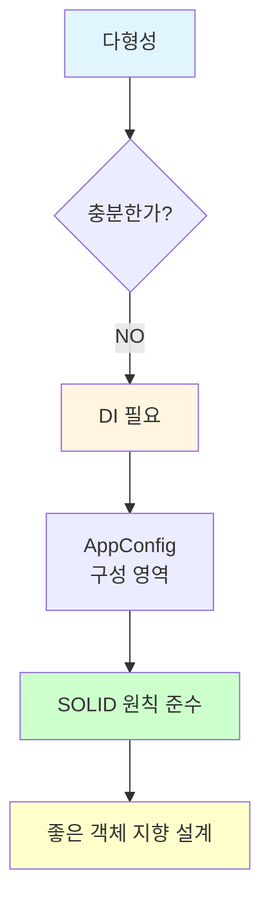

# 3-7. 좋은 객체 지향 설계의 5가지 원칙의 적용

**출처**: 인프런 - 스프링 핵심 원리 기본편
**챕터**: 3. 스프링 핵심 원리 이해2 - 객체 지향 원리 적용

---

## 학습 목표

- [ ] SOLID 원칙 중 SRP, DIP, OCP가 어떻게 적용되었는지 설명할 수 있다
- [ ] 각 원칙의 위반 사례와 준수 사례를 구분할 수 있다
- [ ] AppConfig를 통한 개선이 왜 좋은 설계인지 이해한다

---

## SOLID 원칙 복습

**SOLID**는 로버트 마틴이 정리한 객체 지향 설계의 5가지 원칙:
- **S**RP: Single Responsibility Principle (단일 책임 원칙)
- **O**CP: Open/Closed Principle (개방-폐쇄 원칙)
- **L**SP: Liskov Substitution Principle (리스코프 치환 원칙)
- **I**SP: Interface Segregation Principle (인터페이스 분리 원칙)
- **D**IP: Dependency Inversion Principle (의존관계 역전 원칙)

**이번 섹션에서는**: SRP, DIP, OCP **3가지 원칙**이 어떻게 적용되었는지 확인

---

## SRP - 단일 책임 원칙

### Single Responsibility Principle

> **한 클래스는 하나의 책임만 가져야 한다.**

### 문제 상황 (Before)

**OrderServiceImpl의 책임**:
```java
public class OrderServiceImpl implements OrderService {
    // 1. 비즈니스 로직 실행 (자신의 책임)
    // 2. 구현 객체 선택 (남의 책임)
    // 3. 구현 객체 생성 (남의 책임)
    private final DiscountPolicy discountPolicy = new FixDiscountPolicy();
}
```

**문제점**:
- ❌ 클라이언트 객체는 직접 구현 객체를 생성하고, 연결하고, 실행하는 **다양한 책임**을 가지고 있음
- ❌ **SRP 단일 책임 원칙 위반**

---

### 해결 (After)

**SRP 단일 책임 원칙을 따르면서 관심사를 분리**:

**1. AppConfig: 객체 생성 및 연결 책임**:
```java
public class AppConfig {
    // 책임: 구현 객체를 생성하고 연결
    public OrderService orderService() {
        return new OrderServiceImpl(
            memberRepository(),
            discountPolicy()
        );
    }

    public DiscountPolicy discountPolicy() {
        return new RateDiscountPolicy();
    }
}
```

**2. OrderServiceImpl: 실행 책임**:
```java
public class OrderServiceImpl implements OrderService {
    // 책임: 비즈니스 로직 실행만
    private final DiscountPolicy discountPolicy;

    public OrderServiceImpl(DiscountPolicy discountPolicy) {
        this.discountPolicy = discountPolicy;
    }

    // 실행에만 집중
    public Order createOrder(Long memberId, String itemName, int itemPrice) {
        Member member = memberRepository.findById(memberId);
        int discountPrice = discountPolicy.discount(member, itemPrice);
        return new Order(memberId, itemName, itemPrice, discountPrice);
    }
}
```

**개선 효과**:
- ✅ 구현 객체를 생성하고 연결하는 책임은 **AppConfig**가 담당
- ✅ 클라이언트 객체는 **실행하는 책임**만 담당
- ✅ **SRP 단일 책임 원칙 준수**

---

## DIP - 의존관계 역전 원칙

### Dependency Inversion Principle

> **프로그래머는 "추상화에 의존해야지, 구체화에 의존하면 안된다."**
>
> 의존성 주입은 이 원칙을 따르는 방법 중 하나다.

### 문제 상황 (Before)

**기대했던 의존관계**:


**실제 의존관계**:


**코드로 확인**:
```java
public class OrderServiceImpl implements OrderService {
    // 추상(인터페이스) 의존: DiscountPolicy
    private final DiscountPolicy discountPolicy

    // 구체(구현) 클래스 의존: FixDiscountPolicy - DIP 위반!
        = new FixDiscountPolicy();
}
```

**문제점**:
- ❌ `OrderServiceImpl`은 `DiscountPolicy` **추상화 인터페이스**에 의존하는 것 같지만
- ❌ 동시에 `FixDiscountPolicy` **구체화 구현 클래스**에도 의존
- ❌ **DIP 의존관계 역전 원칙 위반**

---

### 해결 시도 1: 인터페이스에만 의존하도록 변경

**코드 수정**:
```java
public class OrderServiceImpl implements OrderService {
    // 인터페이스에만 의존 - DIP 준수!
    private DiscountPolicy discountPolicy;
}
```

**새로운 문제 발생**:
```
NullPointerException (NPE) 발생!
```

**왜?**
- ✅ DIP는 준수
- ❌ 하지만 클라이언트 코드는 인터페이스만으로는 아무것도 실행할 수 없음
- ❌ 구현체가 없으므로 코드 실행 불가

---

### 해결 시도 2: AppConfig를 통한 의존관계 주입

**해결 방법**:
- AppConfig가 `FixDiscountPolicy` 객체 인스턴스를 클라이언트 코드 대신 생성
- 클라이언트 코드에 의존관계를 주입

**AppConfig**:
```java
public class AppConfig {
    public OrderService orderService() {
        return new OrderServiceImpl(
            memberRepository(),
            discountPolicy()  // FixDiscountPolicy 생성하여 주입
        );
    }

    public DiscountPolicy discountPolicy() {
        return new FixDiscountPolicy();
    }
}
```

**OrderServiceImpl**:
```java
public class OrderServiceImpl implements OrderService {
    // 인터페이스에만 의존 - DIP 준수!
    private final DiscountPolicy discountPolicy;

    // 생성자를 통해 외부에서 주입받음
    public OrderServiceImpl(DiscountPolicy discountPolicy) {
        this.discountPolicy = discountPolicy;
    }
}
```

**개선 효과**:
- ✅ 클라이언트 코드가 `DiscountPolicy` **추상화 인터페이스에만 의존**
- ✅ `RateDiscountPolicy` 구체 클래스를 전혀 모름
- ✅ AppConfig가 의존관계를 주입
- ✅ **DIP 완벽 준수**

---

## OCP - 개방-폐쇄 원칙

### Open/Closed Principle

> **소프트웨어 요소는 확장에는 열려 있으나 변경에는 닫혀 있어야 한다.**

### 문제 상황 (Before)

**할인 정책 변경 시**:
```java
public class OrderServiceImpl implements OrderService {
    // 기존: 정액 할인
    // private final DiscountPolicy discountPolicy = new FixDiscountPolicy();

    // 변경: 정률 할인 - 클라이언트 코드 수정 필요!
    private final DiscountPolicy discountPolicy = new RateDiscountPolicy();
}
```

**문제점**:
- ❌ 기능을 **확장**(새로운 할인 정책 추가)했을 때
- ❌ 클라이언트 코드를 **변경**해야 함
- ❌ **OCP 개방-폐쇄 원칙 위반**

---

### 해결 (After)

**다형성 사용 + DIP 준수**:

**사용 영역과 구성 영역 분리**:


**사용 영역 - 변경 없음**:
```java
public class OrderServiceImpl implements OrderService {
    // 전혀 변경하지 않음!
    private final DiscountPolicy discountPolicy;

    public OrderServiceImpl(DiscountPolicy discountPolicy) {
        this.discountPolicy = discountPolicy;
    }
}
```

**구성 영역 - 확장에 열려있음**:
```java
public class AppConfig {
    public DiscountPolicy discountPolicy() {
        // return new FixDiscountPolicy();      // 기존 정책
        return new RateDiscountPolicy();        // 새로운 정책으로 확장
    }
}
```

**개선 효과**:
- ✅ AppConfig가 의존관계를 `FixDiscountPolicy` → `RateDiscountPolicy`로 변경해서 클라이언트 코드에 주입
- ✅ 클라이언트 코드는 변경하지 않아도 됨
- ✅ **소프트웨어 요소를 새롭게 확장**해도 **사용 영역의 변경은 닫혀 있음**
- ✅ **OCP 완벽 준수**

---

## 원칙 적용 비교표

| 원칙 | Before (위반) | After (준수) |
|------|--------------|-------------|
| **SRP** | OrderServiceImpl이 여러 책임 | AppConfig: 생성/연결<br/>OrderServiceImpl: 실행 |
| **DIP** | 추상화 + 구체화 모두 의존 | 추상화에만 의존 |
| **OCP** | 확장 시 클라이언트 코드 변경 | 사용 영역은 변경에 닫혀있음 |

---

## 💡 핵심 정리

### 다형성만으로는 부족하다

**문제**:
- 다형성만으로는 OCP, DIP를 지킬 수 없음
- 클라이언트 코드가 구체 클래스를 직접 선택하면 DIP 위반
- 구현 객체 변경 시 클라이언트 코드 변경 필요 = OCP 위반

**해결**:
- 외부에서 구현 객체를 생성하고 주입하는 **DI(의존관계 주입)** 필요
- AppConfig 같은 **구성 영역**이 필요

---

### AppConfig의 역할

**1. 객체 생성과 연결 책임 (SRP)**:
- 구현 객체 생성
- 생성자를 통해 의존관계 주입

**2. 추상화에만 의존 (DIP)**:
- 클라이언트는 인터페이스에만 의존
- 구체 클래스는 AppConfig가 관리

**3. 사용 영역과 구성 영역 분리 (OCP)**:
- 사용 영역: 변경에 닫혀있음
- 구성 영역: 확장에 열려있음

---

## 객체 지향 설계의 핵심



**핵심**:
1. **다형성**은 기본
2. **DI(의존관계 주입)**이 필요
3. **AppConfig** 같은 구성 영역으로 책임 분리
4. **SOLID 원칙** 준수
5. **유연하고 변경에 강한** 객체 지향 설계 완성

---

## 실전 적용 예시

### 할인 정책 변경 시나리오

**요구사항**: 정액 할인 → 정률 할인

**Before (SOLID 위반)**:
```java
// 1. OrderServiceImpl 직접 수정 - OCP 위반
// 2. 구체 클래스에 의존 - DIP 위반
// 3. 여러 책임 - SRP 위반
public class OrderServiceImpl implements OrderService {
    // private final DiscountPolicy discountPolicy = new FixDiscountPolicy();
    private final DiscountPolicy discountPolicy = new RateDiscountPolicy();
}
```

**변경 파일**: `OrderServiceImpl.java` (사용 영역)

---

**After (SOLID 준수)**:
```java
// AppConfig만 수정 - OCP, DIP, SRP 모두 준수
public class AppConfig {
    public DiscountPolicy discountPolicy() {
        // return new FixDiscountPolicy();
        return new RateDiscountPolicy();  // 한 줄만 변경!
    }
}
```

**변경 파일**: `AppConfig.java` (구성 영역)
**영향 받지 않는 파일**: `OrderServiceImpl.java` (사용 영역)

---

## 정리

### SOLID 원칙 적용 결과

**1. SRP 단일 책임 원칙**:
- AppConfig: 객체 생성 및 연결
- ServiceImpl: 비즈니스 로직 실행

**2. DIP 의존관계 역전 원칙**:
- 클라이언트 코드: 인터페이스에만 의존
- AppConfig: 구체 클래스 관리 및 주입

**3. OCP 개방-폐쇄 원칙**:
- 사용 영역: 변경에 닫혀있음
- 구성 영역: 확장에 열려있음

### 좋은 객체 지향 설계

**핵심 3요소**:
1. **다형성 활용**
2. **의존관계 주입 (DI)**
3. **SOLID 원칙 준수**

**결과**:
- ✅ 유연한 설계
- ✅ 변경에 강한 코드
- ✅ 확장이 용이
- ✅ 유지보수가 쉬움

---

## 다음 학습

➡️ **[3-8. IoC, DI, 그리고 컨테이너](./3-8-IoC-DI-그리고-컨테이너.md)**
- IoC (제어의 역전) 개념
- DI (의존관계 주입) 상세 설명
- IoC 컨테이너와 DI 컨테이너
