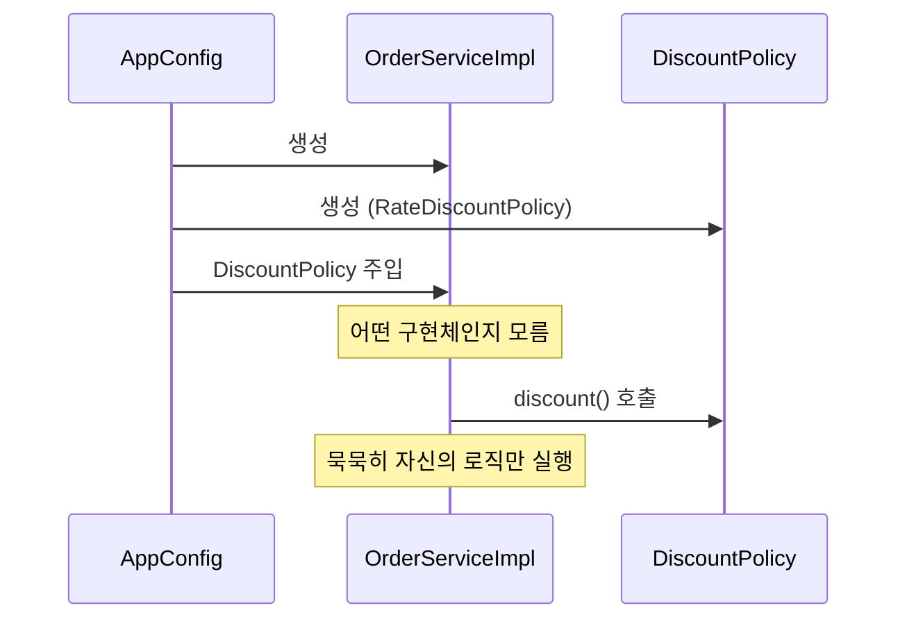
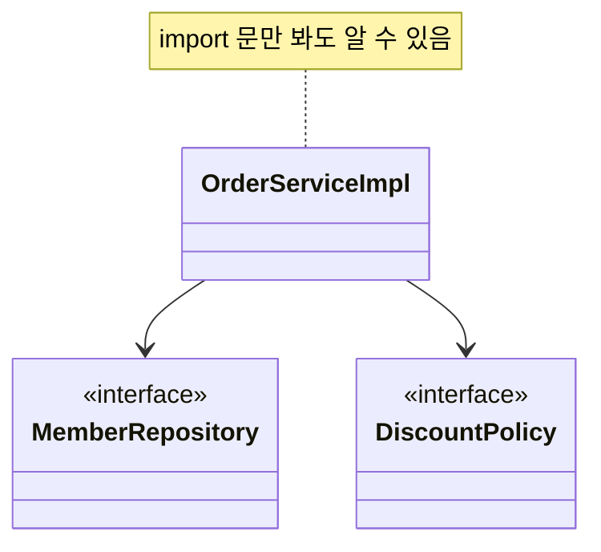
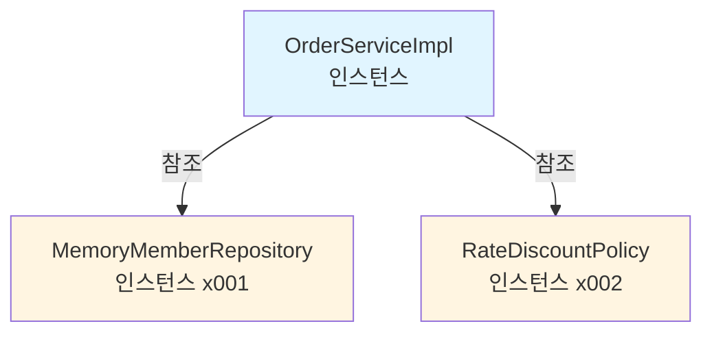
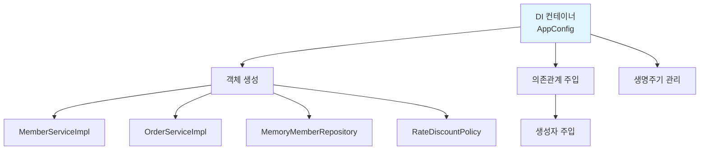
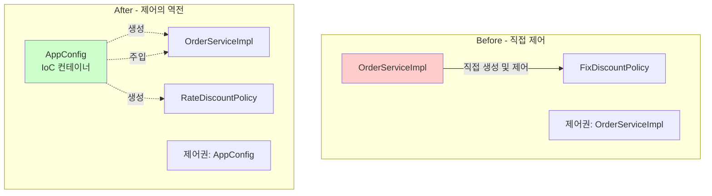

# 3-8. IoC, DI, 그리고 컨테이너

**출처**: 인프런 - 스프링 핵심 원리 기본편
**챕터**: 3. 스프링 핵심 원리 이해2 - 객체 지향 원리 적용

---

## 학습 목표

- [ ] IoC (제어의 역전) 개념을 이해한다
- [ ] DI (의존관계 주입) 개념을 이해한다
- [ ] IoC 컨테이너와 DI 컨테이너의 역할을 설명할 수 있다
- [ ] 프레임워크와 라이브러리의 차이를 이해한다

---

## IoC - 제어의 역전

### Inversion of Control (제어의 역전)

> **프로그램의 제어 흐름을 직접 제어하는 것이 아니라 외부에서 관리하는 것**

---

### 기존 프로그램 (Before)

**특징**:
- 클라이언트 구현 객체가 스스로 필요한 서버 구현 객체를 생성
- 연결하고 실행
- 한마디로 구현 객체가 프로그램의 제어 흐름을 스스로 조종
- **개발자 입장에서는 자연스러운 흐름**

**코드 예시**:
```java
public class OrderServiceImpl implements OrderService {
    // 스스로 필요한 객체를 생성
    private final MemberRepository memberRepository
        = new MemoryMemberRepository();
    private final DiscountPolicy discountPolicy
        = new FixDiscountPolicy();

    // 스스로 제어 흐름을 조종
    public Order createOrder(Long memberId, String itemName, int itemPrice) {
        Member member = memberRepository.findById(memberId);
        int discountPrice = discountPolicy.discount(member, itemPrice);
        return new Order(memberId, itemName, itemPrice, discountPrice);
    }
}
```

**문제점**:
- ❌ 구현 객체가 프로그램의 **제어 흐름**을 스스로 조종
- ❌ 개발자가 직접 객체를 생성하고 연결
- ❌ 모든 제어권이 구현 객체에 집중

---

### AppConfig 등장 후 (After)

**특징**:
- 구현 객체는 자신의 로직을 실행하는 **역할만** 담당
- 프로그램의 제어 흐름은 이제 **AppConfig**가 가져감
- `OrderServiceImpl`은 필요한 인터페이스들을 호출하지만 어떤 구현 객체들이 실행될지 모름

**흐름**:


**프로그램에 대한 제어 흐름 권한**:
- ✅ 모두 **AppConfig**가 가지고 있음
- ✅ 심지어 `OrderServiceImpl`도 AppConfig가 생성
- ✅ AppConfig는 `OrderServiceImpl`이 아닌 `OrderService` 인터페이스의 다른 구현 객체를 생성하고 실행할 수도 있음
- ✅ 그런 사실도 모른 채 `OrderServiceImpl`은 묵묵히 자신의 로직을 실행할 뿐

**IoC 정의**:
> 이렇듯 프로그램의 제어 흐름을 직접 제어하는 것이 아니라 외부에서 관리하는 것을 **제어의 역전(IoC)**이라 한다.

---

## 프레임워크 vs 라이브러리

### 차이점

**프레임워크 (Framework)**:
- **프레임워크가** 내가 작성한 코드를 제어하고, 대신 실행
- 제어권이 프레임워크에 있음
- **예시**: JUnit

```java
@Test
void test() {
    // JUnit이 이 메서드를 호출하고 실행
    // 개발자는 코드만 작성
}
```

**라이브러리 (Library)**:
- **내가 작성한 코드가** 직접 제어의 흐름을 담당
- 제어권이 개발자에게 있음
- **예시**: Java Collections, Apache Commons

```java
List<String> list = new ArrayList<>();
list.add("item");  // 내가 직접 호출하고 제어
```

---

## DI - 의존관계 주입

### Dependency Injection (의존관계 주입)

> **외부에서 의존관계를 주입해주는 것**

---

### 의존관계의 두 가지 측면

**의존관계는** 다음 두 가지로 분리해서 생각해야 함:
1. **정적인 클래스 의존관계**
2. **동적인 객체(인스턴스) 의존관계**

---

### 1. 정적인 클래스 의존관계

**특징**:
- 클래스가 사용하는 `import` 코드만 보고 의존관계를 쉽게 판단할 수 있음
- **애플리케이션을 실행하지 않아도** 분석할 수 있음

**클래스 다이어그램**:


**코드로 확인**:
```java
// import 문만 봐도 의존관계를 알 수 있음
import hello.core.member.MemberRepository;
import hello.core.discount.DiscountPolicy;

public class OrderServiceImpl implements OrderService {
    private final MemberRepository memberRepository;
    private final DiscountPolicy discountPolicy;
    // ...
}
```

**한계**:
- ✅ `OrderServiceImpl`은 `MemberRepository`, `DiscountPolicy`에 의존한다는 것을 알 수 있음
- ❌ 그런데 이러한 **클래스 의존관계만으로는** 실제 어떤 객체가 `OrderServiceImpl`에 주입될지 알 수 없음

---

### 2. 동적인 객체 인스턴스 의존관계

**특징**:
- 애플리케이션 **실행 시점(런타임)**에 실제 생성된 객체 인스턴스의 참조가 연결된 의존관계

**객체 다이어그램**:


**의존관계 주입**:
- 애플리케이션 **실행 시점(런타임)**에 외부에서 실제 구현 객체를 생성
- 클라이언트에 전달해서 클라이언트와 서버의 실제 의존관계가 연결되는 것
- 객체 인스턴스를 생성하고, 그 참조값을 전달해서 연결됨

**코드로 확인**:
```java
// AppConfig가 런타임에 의존관계 주입
public class AppConfig {
    public OrderService orderService() {
        return new OrderServiceImpl(
            new MemoryMemberRepository(),    // 실제 구현 객체 생성
            new RateDiscountPolicy()         // 실제 구현 객체 생성
        );
    }
}
```

---

### 의존관계 주입의 효과

**장점**:
- ✅ 클라이언트 코드를 변경하지 않고, 클라이언트가 호출하는 대상의 **타입 인스턴스**를 변경할 수 있음
- ✅ **정적인 클래스 의존관계를 변경하지 않고**, 동적인 객체 인스턴스 의존관계를 쉽게 변경할 수 있음

**예시**:
```java
// AppConfig만 변경 - 클라이언트 코드 변경 없음
public class AppConfig {
    public OrderService orderService() {
        return new OrderServiceImpl(
            new MemoryMemberRepository(),
            // new FixDiscountPolicy()           // 기존
            new RateDiscountPolicy()             // 변경
        );
    }
}
```

---

## IoC 컨테이너, DI 컨테이너

### 정의

**IoC 컨테이너 / DI 컨테이너**:
- AppConfig 처럼 객체를 생성하고 관리하면서 의존관계를 연결해 주는 것
- **IoC 컨테이너** 또는 **DI 컨테이너**라 함
- 의존관계 주입에 초점을 맞추어 최근에는 주로 **DI 컨테이너**라 함
- 또는 **어샘블러**, **오브젝트 팩토리** 등으로 불리기도 함

---

### AppConfig = DI 컨테이너

**역할**:


**AppConfig의 책임**:
1. **객체 생성**: 구현 객체를 생성
2. **의존관계 연결**: 생성자를 통해 의존관계 주입
3. **관리**: 생성한 객체들을 관리

---

## 💡 핵심 정리

### IoC (제어의 역전)

**Before**:
```java
// 클라이언트가 제어권을 가짐
public class OrderServiceImpl {
    private final DiscountPolicy discountPolicy
        = new FixDiscountPolicy();  // 스스로 생성
}
```

**After**:
```java
// 외부(AppConfig)가 제어권을 가짐
public class OrderServiceImpl {
    private final DiscountPolicy discountPolicy;

    public OrderServiceImpl(DiscountPolicy discountPolicy) {
        this.discountPolicy = discountPolicy;  // 외부에서 주입
    }
}
```

---

### DI (의존관계 주입)

**정적 의존관계**:
- `import` 문으로 판단
- 실행 안 해도 알 수 있음

**동적 의존관계**:
- 런타임에 결정
- 실제 객체 인스턴스 참조가 연결됨

---

### DI 컨테이너

**역할**:
- 객체 생성
- 의존관계 주입
- 생명주기 관리

**예시**:
- AppConfig
- Spring Container

---

## 비교 다이어그램

### 제어 흐름 비교



---

## 실전 예시

### JUnit 프레임워크 (IoC 예시)

```java
class OrderServiceTest {
    @Test
    void createOrder() {
        // JUnit이 이 메서드를 호출 (제어의 역전)
        // 개발자는 코드만 작성
        Order order = orderService.createOrder(1L, "itemA", 10000);
        assertThat(order.getDiscountPrice()).isEqualTo(1000);
    }
}
```

**제어 흐름**:
1. JUnit 프레임워크가 `@Test` 애노테이션을 발견
2. JUnit이 테스트 메서드를 호출
3. 개발자가 작성한 코드 실행
4. **제어권은 JUnit에 있음** (IoC)

---

## 정리

### IoC (제어의 역전)

**정의**:
- 프로그램의 제어 흐름을 외부에서 관리

**효과**:
- 클라이언트는 실행에만 집중
- 제어 흐름은 외부가 담당

---

### DI (의존관계 주입)

**정의**:
- 외부에서 의존관계를 주입

**방법**:
- 주로 생성자 주입 사용
- 런타임에 실제 구현 객체 연결

**효과**:
- 클라이언트 코드 변경 없이 구현 객체 변경 가능
- 정적 의존관계를 변경하지 않고 동적 의존관계 변경 가능

---

### IoC 컨테이너 / DI 컨테이너

**역할**:
- 객체 생성 및 관리
- 의존관계 주입
- 생명주기 관리

**예시**:
- AppConfig (순수 Java)
- Spring Container (Spring Framework)

---

## 다음 학습

➡️ **[3-9. 스프링으로 전환하기](./3-9-스프링으로전환하기.md)**
- 순수 Java 코드를 Spring으로 전환
- `@Configuration`, `@Bean` 애노테이션 사용
- `ApplicationContext` (스프링 컨테이너) 활용
