# 3-9. 스프링으로 전환하기

**출처**: 인프런 - 스프링 핵심 원리 기본편
**챕터**: 3. 스프링 핵심 원리 이해2 - 객체 지향 원리 적용

---

## 학습 목표

- [ ] 순수 Java 코드를 Spring으로 전환할 수 있다
- [ ] `@Configuration`, `@Bean` 애노테이션의 역할을 이해한다
- [ ] `ApplicationContext` (스프링 컨테이너)를 사용할 수 있다
- [ ] 스프링 컨테이너를 사용하는 이유를 설명할 수 있다

---

## 순수 Java에서 Spring으로

### Before: 순수 Java

지금까지 순수한 자바 코드만으로 DI를 적용했습니다.
이제 스프링을 사용해봅시다!

---

## AppConfig 스프링 기반으로 변경

### Before: 순수 Java AppConfig

```java
package hello.core;

import hello.core.discount.DiscountPolicy;
import hello.core.discount.RateDiscountPolicy;
import hello.core.member.MemberRepository;
import hello.core.member.MemberService;
import hello.core.member.MemberServiceImpl;
import hello.core.member.MemoryMemberRepository;
import hello.core.order.OrderService;
import hello.core.order.OrderServiceImpl;

public class AppConfig {
    public MemberService memberService() {
        return new MemberServiceImpl(memberRepository());
    }

    public OrderService orderService() {
        return new OrderServiceImpl(
            memberRepository(),
            discountPolicy()
        );
    }

    public MemberRepository memberRepository() {
        return new MemoryMemberRepository();
    }

    public DiscountPolicy discountPolicy() {
        return new RateDiscountPolicy();
    }
}
```

---

### After: 스프링 기반 AppConfig

```java
package hello.core;

import hello.core.discount.DiscountPolicy;
import hello.core.discount.RateDiscountPolicy;
import hello.core.member.MemberRepository;
import hello.core.member.MemberService;
import hello.core.member.MemberServiceImpl;
import hello.core.member.MemoryMemberRepository;
import hello.core.order.OrderService;
import hello.core.order.OrderServiceImpl;
import org.springframework.context.annotation.Bean;
import org.springframework.context.annotation.Configuration;

@Configuration
public class AppConfig {

    @Bean
    public MemberService memberService() {
        return new MemberServiceImpl(memberRepository());
    }

    @Bean
    public OrderService orderService() {
        return new OrderServiceImpl(
            memberRepository(),
            discountPolicy()
        );
    }

    @Bean
    public MemberRepository memberRepository() {
        return new MemoryMemberRepository();
    }

    @Bean
    public DiscountPolicy discountPolicy() {
        return new RateDiscountPolicy();
    }
}
```

**변경 사항**:
- ✅ `@Configuration` 추가: 설정(구성) 정보임을 표시
- ✅ `@Bean` 추가: 각 메서드에 추가하여 스프링 컨테이너에 스프링 빈으로 등록

---

## MemberApp에 스프링 컨테이너 적용

### Before: 순수 Java

```java
package hello.core;

import hello.core.member.Grade;
import hello.core.member.Member;
import hello.core.member.MemberService;

public class MemberApp {
    public static void main(String[] args) {
        AppConfig appConfig = new AppConfig();
        MemberService memberService = appConfig.memberService();

        Member member = new Member(1L, "memberA", Grade.VIP);
        memberService.join(member);

        Member findMember = memberService.findMember(1L);
        System.out.println("new member = " + member.getName());
        System.out.println("find Member = " + findMember.getName());
    }
}
```

---

### After: 스프링 컨테이너 사용

```java
package hello.core;

import hello.core.member.Grade;
import hello.core.member.Member;
import hello.core.member.MemberService;
import org.springframework.context.ApplicationContext;
import org.springframework.context.annotation.AnnotationConfigApplicationContext;

public class MemberApp {
    public static void main(String[] args) {
        // 스프링 컨테이너 생성
        ApplicationContext applicationContext =
            new AnnotationConfigApplicationContext(AppConfig.class);

        // 스프링 컨테이너에서 스프링 빈 조회
        MemberService memberService =
            applicationContext.getBean("memberService", MemberService.class);

        Member member = new Member(1L, "memberA", Grade.VIP);
        memberService.join(member);

        Member findMember = memberService.findMember(1L);
        System.out.println("new member = " + member.getName());
        System.out.println("find Member = " + findMember.getName());
    }
}
```

**변경 사항**:
- ✅ `ApplicationContext` 생성: 스프링 컨테이너
- ✅ `AnnotationConfigApplicationContext`: 애노테이션 기반 설정 정보 사용
- ✅ `getBean()`: 스프링 컨테이너에서 스프링 빈 조회

---

## OrderApp에 스프링 컨테이너 적용

### After: 스프링 컨테이너 사용

```java
package hello.core;

import hello.core.member.Grade;
import hello.core.member.Member;
import hello.core.member.MemberService;
import hello.core.order.Order;
import hello.core.order.OrderService;
import org.springframework.context.ApplicationContext;
import org.springframework.context.annotation.AnnotationConfigApplicationContext;

public class OrderApp {
    public static void main(String[] args) {
        // 스프링 컨테이너 생성
        ApplicationContext applicationContext =
            new AnnotationConfigApplicationContext(AppConfig.class);

        // 스프링 빈 조회
        MemberService memberService =
            applicationContext.getBean("memberService", MemberService.class);
        OrderService orderService =
            applicationContext.getBean("orderService", OrderService.class);

        long memberId = 1L;
        Member member = new Member(memberId, "memberA", Grade.VIP);
        memberService.join(member);

        Order order = orderService.createOrder(memberId, "itemA", 10000);

        System.out.println("order = " + order);
    }
}
```

---

## 실행 결과 및 로그

### 실행 로그 (스프링 부트 3.1 미만)

```
19:18:00.439 [main] DEBUG
org.springframework.context.annotation.AnnotationConfigApplicationContext -
Refreshing

19:18:00.508 [main] DEBUG
org.springframework.beans.factory.support.DefaultListableBeanFactory - Creating
shared instance of singleton bean 'appConfig'

19:18:00.510 [main] DEBUG
org.springframework.beans.factory.support.DefaultListableBeanFactory - Creating
shared instance of singleton bean 'memberService'

19:18:00.512 [main] DEBUG
org.springframework.beans.factory.support.DefaultListableBeanFactory - Creating
shared instance of singleton bean 'memberRepository'

19:18:00.512 [main] DEBUG
org.springframework.beans.factory.support.DefaultListableBeanFactory - Creating
shared instance of singleton bean 'orderService'

19:18:00.513 [main] DEBUG
org.springframework.beans.factory.support.DefaultListableBeanFactory - Creating
shared instance of singleton bean 'discountPolicy'

new member = memberA
find Member = memberA
```

**로그 분석**:
- 스프링 컨테이너가 `@Bean` 애노테이션이 붙은 메서드를 모두 호출
- 반환된 객체를 스프링 컨테이너에 등록
- 등록된 객체를 **스프링 빈**이라고 함

---

## 스프링 컨테이너

### ApplicationContext

**정의**:
- `ApplicationContext`를 **스프링 컨테이너**라 함
- 기존에는 개발자가 `AppConfig`를 사용해서 직접 객체를 생성하고 DI를 했음
- 이제부터는 **스프링 컨테이너를 통해서** 사용

---

### 스프링 컨테이너 동작 방식

```mermaid
graph TB
    A[ApplicationContext<br/>스프링 컨테이너]
    B[@Configuration<br/>AppConfig]
    C[@Bean<br/>memberService]
    D[@Bean<br/>orderService]
    E[@Bean<br/>memberRepository]
    F[@Bean<br/>discountPolicy]

    A -.설정 정보 읽기.-> B
    B --> C
    B --> D
    B --> E
    B --> F

    C -.등록.-> G[스프링 빈<br/>memberService]
    D -.등록.-> H[스프링 빈<br/>orderService]
    E -.등록.-> I[스프링 빈<br/>memberRepository]
    F -.등록.-> J[스프링 빈<br/>discountPolicy]

    style A fill:#e1f5ff
    style B fill:#fff5e1
```

---

### 스프링 컨테이너의 역할

**1. 설정 정보 사용**:
- `@Configuration`이 붙은 `AppConfig`를 설정(구성) 정보로 사용
- 여기서 `@Bean`이라 적힌 메서드를 모두 호출
- 반환된 객체를 스프링 컨테이너에 등록

**2. 스프링 빈 등록**:
- 스프링 컨테이너에 등록된 객체를 **스프링 빈**이라 함
- 스프링 빈은 `@Bean`이 붙은 **메서드의 명**을 스프링 빈의 이름으로 사용
  - 예: `memberService`, `orderService`

**3. 스프링 빈 조회**:
- 이전에는 개발자가 필요한 객체를 `AppConfig`를 사용해서 직접 조회
- 이제부터는 스프링 컨테이너를 통해서 필요한 스프링 빈(객체)을 찾아야 함
- `applicationContext.getBean()` 메서드를 사용해서 찾음

---

## 스프링 부트 3.1 이상 - 로그 출력 설정

### 문제

스프링 부트 3.1 이상을 사용한다면 로그가 출력되지 않습니다.

**스프링 부트 3.1 이상 실행 로그**:
```
new member = memberA
find Member = memberA
```

---

### 해결 방법

`src/main/resources/logback.xml` 파일을 만들어서 넣으면 됩니다:

```xml
<configuration>
    <appender name="STDOUT" class="ch.qos.logback.core.ConsoleAppender">
        <encoder>
            <pattern>%d{HH:mm:ss.SSS} [%thread] %-5level %logger{36} -%kvp-
%msg%n</pattern>
        </encoder>
    </appender>

    <root level="DEBUG">
        <appender-ref ref="STDOUT" />
    </root>
</configuration>
```

**설명**:
- 스프링 부트 3.1부터 기본 로그 레벨을 `INFO`로 빠르게 설정
- 이 설정으로 기본 로그 레벨을 `DEBUG`로 변경
- 강의 내용과 같이 로그를 확인할 수 있음

**참고**:
- 이 내용은 `MemberApp`과 `OrderApp` 처럼 `ApplicationContext`를 직접 생성해서 사용할 때만 적용
- 나중에 나오는 `CoreApplication` 처럼 스프링 부트를 실행할 때는 이 파일을 제거하거나
- `<root level="DEBUG">` 부분을 `<root level="INFO">`로 변경

---

## 순수 Java vs Spring 비교

### 순수 Java

```java
// AppConfig를 직접 생성
AppConfig appConfig = new AppConfig();
// 직접 메서드 호출
MemberService memberService = appConfig.memberService();
```

**특징**:
- 개발자가 직접 객체 생성
- 개발자가 직접 의존관계 주입
- 간단하지만 기능이 제한적

---

### Spring

```java
// 스프링 컨테이너 생성
ApplicationContext applicationContext =
    new AnnotationConfigApplicationContext(AppConfig.class);

// 스프링 컨테이너에서 조회
MemberService memberService =
    applicationContext.getBean("memberService", MemberService.class);
```

**특징**:
- 스프링 컨테이너가 객체 생성
- 스프링 컨테이너가 의존관계 주입
- 코드가 약간 복잡해짐
- **다양한 부가 기능 제공**

---

## 💡 핵심 정리

### 스프링 컨테이너 생성 과정

```mermaid
graph LR
    A[1. 스프링 컨테이너 생성] --> B[2. 설정 정보 읽기]
    B --> C[3. 스프링 빈 등록]
    C --> D[4. 의존관계 주입]
    D --> E[5. 초기화 완료]

    style A fill:#e1f5ff
    style E fill:#ccffcc
```



**1. 스프링 컨테이너 생성**:
```java
new AnnotationConfigApplicationContext(AppConfig.class);
```

**2. 설정 정보 읽기**:
- `@Configuration` 클래스 읽기
- `@Bean` 메서드 찾기

**3. 스프링 빈 등록**:
- `@Bean` 메서드 호출
- 반환 객체를 스프링 빈으로 등록

**4. 의존관계 주입**:
- 생성자 주입 실행

**5. 초기화 완료**:
- 스프링 컨테이너 사용 준비 완료

---

### 애노테이션 설명

**@Configuration**:
- 설정(구성) 클래스임을 표시
- 스프링 컨테이너가 이 클래스를 설정 정보로 사용

**@Bean**:
- 스프링 컨테이너에 스프링 빈으로 등록
- 메서드 이름이 스프링 빈의 이름이 됨

---

### 스프링 빈 이름

**기본 규칙**:
- `@Bean`이 붙은 메서드의 이름을 스프링 빈의 이름으로 사용

**예시**:
```java
@Bean
public MemberService memberService() {  // 빈 이름: memberService
    return new MemberServiceImpl(memberRepository());
}

@Bean
public OrderService orderService() {    // 빈 이름: orderService
    return new OrderServiceImpl(
        memberRepository(),
        discountPolicy()
    );
}
```

**빈 이름 직접 지정**:
```java
@Bean(name = "myMemberService")
public MemberService memberService() {  // 빈 이름: myMemberService
    return new MemberServiceImpl(memberRepository());
}
```

**주의**:
- ⚠️ 빈 이름은 항상 다른 이름을 부여해야 함
- ⚠️ 같은 이름을 부여하면 다른 빈이 무시되거나 기존 빈을 덮어버림

---

## 스프링 컨테이너를 사용하는 이유

### 질문

> 코드가 약간 더 복잡해진 것 같은데, 스프링 컨테이너를 사용하면 어떤 장점이 있을까?

### 답변

**지금 당장은** 복잡해 보이지만, 스프링 컨테이너는 다음과 같은 **수많은 기능**을 제공합니다:

**1. 싱글톤 컨테이너**:
- 스프링 빈을 싱글톤으로 관리
- 메모리 효율적

**2. 빈 생명주기 관리**:
- 초기화, 소멸 콜백 지원
- 적절한 시점에 필요한 작업 수행

**3. 빈 스코프 지원**:
- 싱글톤, 프로토타입, 리퀘스트 등
- 다양한 스코프 제공

**4. 후처리기 지원**:
- BeanPostProcessor
- 빈 초기화 전후로 커스텀 작업 가능

**5. AOP 지원**:
- 관점 지향 프로그래밍
- 로깅, 트랜잭션 등 부가 기능 쉽게 적용

**앞으로 학습할 내용**:
- 이러한 스프링 컨테이너의 다양한 기능들을 자세히 학습할 예정
- **수많은 장점**이 있음!

---

## 정리

### 이번 섹션에서 배운 것

**1. 스프링 전환**:
- 순수 Java → Spring
- `@Configuration`, `@Bean` 사용

**2. 스프링 컨테이너**:
- `ApplicationContext`
- 객체 생성, 관리, 의존관계 주입

**3. 스프링 빈**:
- 스프링 컨테이너에 등록된 객체
- `getBean()`으로 조회

---

### Before / After 요약

**Before (순수 Java)**:
```java
AppConfig appConfig = new AppConfig();
MemberService memberService = appConfig.memberService();
```

**After (Spring)**:
```java
ApplicationContext applicationContext =
    new AnnotationConfigApplicationContext(AppConfig.class);
MemberService memberService =
    applicationContext.getBean("memberService", MemberService.class);
```

---

### 다음 챕터에서

앞으로 스프링 컨테이너의 다양하고 강력한 기능들을 학습합니다:
- 스프링 컨테이너와 스프링 빈
- 싱글톤 컨테이너
- 컴포넌트 스캔
- 의존관계 자동 주입
- 빈 생명주기 콜백
- 빈 스코프

**기대하세요!**

---

## 다음 학습

➡️ **[4장. 스프링 컨테이너와 스프링 빈](../4-스프링컨테이너와스프링빈/)**

---

## 3장 전체 복습

### 학습한 내용 요약

**3-1. 새로운 할인 정책 개발**:
- 정률% 할인 정책 구현
- 다형성 활용

**3-2. 새로운 할인 정책 적용과 문제점**:
- DIP, OCP 위반 발견
- 문제점 분석

**3-3. 관심사의 분리**:
- AppConfig 등장
- 생성자 주입
- DI (의존관계 주입)

**3-4. AppConfig 리팩터링**:
- 중복 제거
- 역할과 구현 분리

**3-5. 새로운 구조와 할인 정책 적용**:
- 사용 영역과 구성 영역 분리
- OCP, DIP 원칙 준수 확인

**3-6. 전체 흐름 정리**:
- 각 단계별 개선 사항
- Before/After 비교

**3-7. 좋은 객체 지향 설계의 5가지 원칙의 적용**:
- SRP, DIP, OCP 적용
- SOLID 원칙 실전 적용

**3-8. IoC, DI, 그리고 컨테이너**:
- IoC (제어의 역전)
- DI (의존관계 주입)
- IoC 컨테이너, DI 컨테이너

**3-9. 스프링으로 전환하기**:
- 순수 Java → Spring
- 스프링 컨테이너 활용
- `@Configuration`, `@Bean`

---

### 핵심 키워드

- 객체 지향 원리
- SOLID (SRP, OCP, DIP)
- 다형성
- 역할과 구현 분리
- AppConfig
- 의존관계 주입 (DI)
- 제어의 역전 (IoC)
- 스프링 컨테이너
- 스프링 빈
