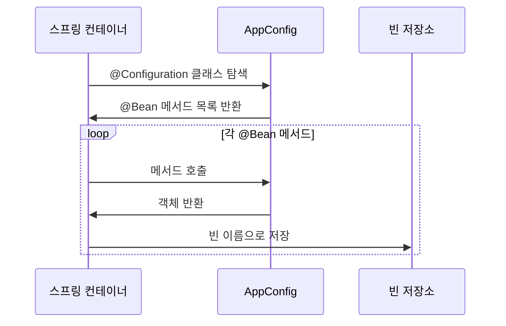
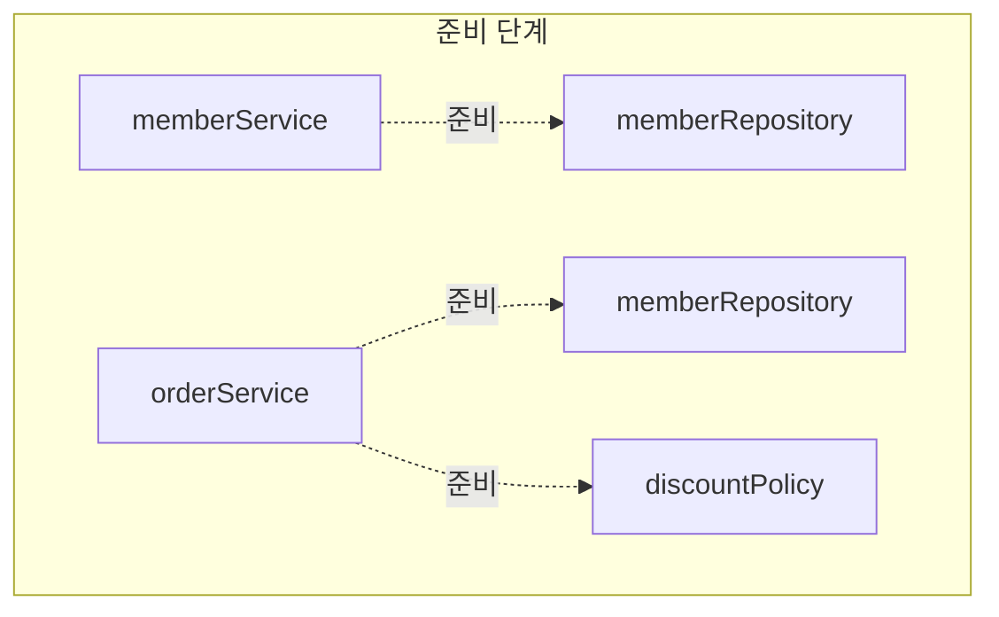
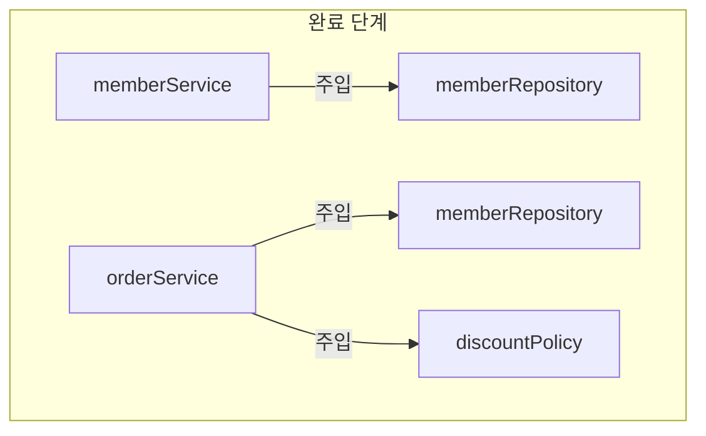
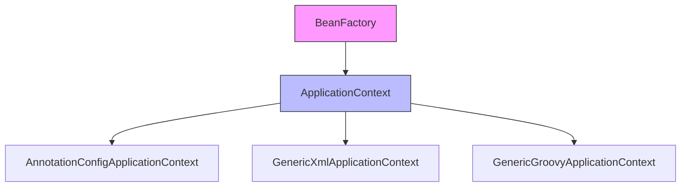
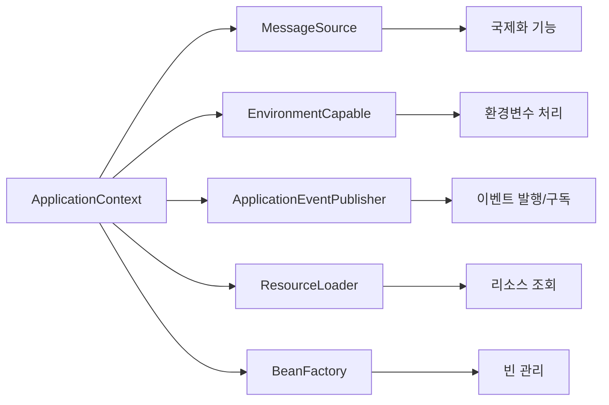
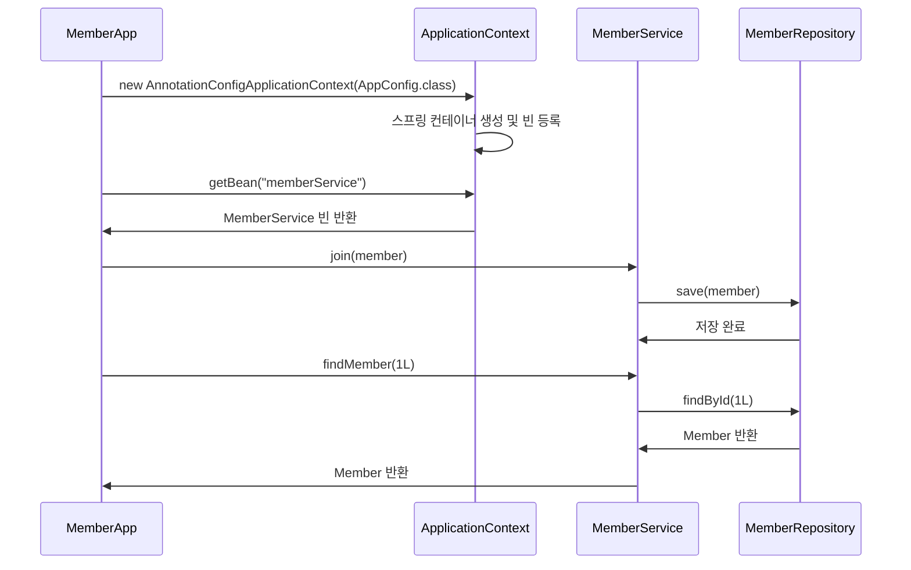
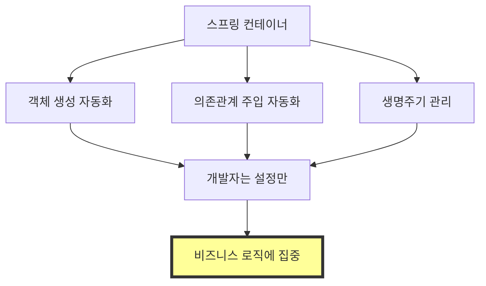

# 4-1. 스프링 컨테이너 생성

## 목차
1. [스프링 컨테이너란?](#스프링-컨테이너란)
2. [스프링 컨테이너 생성 과정](#스프링-컨테이너-생성-과정)
3. [ApplicationContext의 역할](#applicationcontext의-역할)
4. [실습 코드](#실습-코드)
5. [핵심 정리](#핵심-정리)

---

## 스프링 컨테이너란?

**스프링 컨테이너(Spring Container)**는 스프링 프레임워크의 핵심 개념으로, **객체(빈)의 생성, 관리, 의존성 주입을 자동으로 처리**해주는 컨테이너입니다.

### 스프링 컨테이너의 핵심 역할

```mermaid
graph TB
    A[스프링 컨테이너] --> B[객체 생성]
    A --> C[의존성 주입]
    A --> D[생명주기 관리]
    A --> E[설정 정보 관리]

    B --> F[AppConfig 읽기]
    C --> G[DI 수행]
    D --> H[초기화/소멸]
    E --> I[@Configuration/@Bean]
```

### 주요 특징

1. **IoC (Inversion of Control) 구현**
   - 객체 생성과 관리의 주체가 개발자 → 스프링 컨테이너로 역전
   - 개발자는 설정 정보만 제공하면 됨

2. **DI (Dependency Injection) 자동화**
   - 객체 간의 의존관계를 자동으로 주입
   - 느슨한 결합(Loose Coupling) 실현

3. **싱글톤 패턴 적용**
   - 기본적으로 빈을 싱글톤으로 관리
   - 메모리 효율성과 성능 향상

---

## 스프링 컨테이너 생성 과정

스프링 컨테이너는 다음과 같은 단계를 거쳐 생성됩니다.

### 1단계: 스프링 컨테이너 생성

```java
// 스프링 컨테이너 생성
ApplicationContext applicationContext =
    new AnnotationConfigApplicationContext(AppConfig.class);
```

**코드 설명:**
- `ApplicationContext`: 스프링 컨테이너의 인터페이스
- `AnnotationConfigApplicationContext`: Java 애노테이션 기반 설정을 사용하는 구현체
- `AppConfig.class`: 스프링 빈 설정 정보를 담고 있는 클래스


### 2단계: 스프링 빈 등록

컨테이너가 생성되면 설정 클래스(AppConfig)를 읽어서 빈을 등록합니다.

```java
@Configuration
public class AppConfig {

    @Bean
    public MemberService memberService() {
        return new MemberServiceImpl(memberRepository());
    }

    @Bean
    public MemberRepository memberRepository() {
        return new MemoryMemberRepository();
    }

    @Bean
    public OrderService orderService() {
        return new OrderServiceImpl(memberRepository(), discountPolicy());
    }

    @Bean
    public DiscountPolicy discountPolicy() {
        return new RateDiscountPolicy();
    }
}
```

**빈 등록 과정:**



**빈 저장소 구조:**

| 빈 이름 | 빈 객체 |
|---------|---------|
| memberService | MemberServiceImpl@x001 |
| memberRepository | MemoryMemberRepository@x002 |
| orderService | OrderServiceImpl@x003 |
| discountPolicy | RateDiscountPolicy@x004 |

**중요 규칙:**
- 빈 이름은 기본적으로 **메서드 이름**을 사용
- 빈 이름은 **항상 다른 이름**을 부여해야 함
- 같은 이름을 부여하면 다른 빈이 무시되거나 기존 빈을 덮어버림
- 최근 스프링에서는 같은 이름의 빈이 있으면 **오류를 발생**시킴

**빈 이름 직접 지정:**
```java
@Bean(name = "memberService2")
public MemberService memberService() {
    return new MemberServiceImpl(memberRepository());
}
```

### 3단계: 스프링 빈 의존관계 설정 - 준비



빈 객체가 생성되고, 의존관계 주입 준비가 완료됩니다.

### 4단계: 스프링 빈 의존관계 설정 - 완료



**의존관계 주입 과정:**

```java
// 스프링이 자동으로 수행하는 과정 (개념적 표현)

// 1. memberRepository 빈 생성
MemberRepository memberRepository = new MemoryMemberRepository();

// 2. memberService 빈 생성 시 의존성 주입
MemberService memberService = new MemberServiceImpl(memberRepository);

// 3. discountPolicy 빈 생성
DiscountPolicy discountPolicy = new RateDiscountPolicy();

// 4. orderService 빈 생성 시 의존성 주입
OrderService orderService = new OrderServiceImpl(memberRepository, discountPolicy);
```

**중요 포인트:**
- 스프링 컨테이너는 설정 정보를 참고해서 의존관계를 주입(DI)함
- 생성자 주입의 경우, 빈 생성과 동시에 의존관계 주입이 일어남
- Java 코드로 스프링 빈을 등록하면 생성자를 호출하면서 의존관계 주입도 한번에 처리

---

## ApplicationContext의 역할

### ApplicationContext 계층 구조



### ApplicationContext vs BeanFactory

| 구분 | BeanFactory | ApplicationContext |
|------|-------------|-------------------|
| 기능 | 스프링 컨테이너의 최상위 인터페이스 | BeanFactory 기능 + 부가기능 |
| 빈 관리 | 기본적인 빈 조회/관리 | 빈 관리 + 국제화 + 환경변수 + 이벤트 등 |
| 사용 | 거의 사용 안함 | 실무에서 주로 사용 |

### ApplicationContext가 제공하는 부가기능



---

## 실습 코드

### 스프링 컨테이너 생성 테스트

```java
package hello.core.beanfind;

import hello.core.AppConfig;
import org.junit.jupiter.api.DisplayName;
import org.junit.jupiter.api.Test;
import org.springframework.context.annotation.AnnotationConfigApplicationContext;

public class ApplicationContextInfoTest {

    AnnotationConfigApplicationContext ac =
        new AnnotationConfigApplicationContext(AppConfig.class);

    @Test
    @DisplayName("스프링 컨테이너 생성 확인")
    void createApplicationContext() {
        // 컨테이너가 정상적으로 생성되었는지 확인
        System.out.println("ac = " + ac);

        // 빈 개수 확인
        int beanDefinitionCount = ac.getBeanDefinitionCount();
        System.out.println("빈 개수 = " + beanDefinitionCount);
    }

    @Test
    @DisplayName("빈 이름 조회")
    void findBeanByName() {
        String[] beanDefinitionNames = ac.getBeanDefinitionNames();

        System.out.println("=== 등록된 모든 빈 이름 ===");
        for (String beanName : beanDefinitionNames) {
            System.out.println("빈 이름 = " + beanName);
        }
    }
}
```

**실행 결과:**
```
ac = org.springframework.context.annotation.AnnotationConfigApplicationContext@...
빈 개수 = 9

=== 등록된 모든 빈 이름 ===
빈 이름 = org.springframework.context.annotation.internalConfigurationAnnotationProcessor
빈 이름 = org.springframework.context.annotation.internalAutowiredAnnotationProcessor
빈 이름 = org.springframework.context.event.internalEventListenerProcessor
빈 이름 = org.springframework.context.event.internalEventListenerFactory
빈 이름 = appConfig
빈 이름 = memberService
빈 이름 = memberRepository
빈 이름 = orderService
빈 이름 = discountPolicy
```

### 스프링 빈 사용 예제

```java
package hello.core;

import hello.core.member.Grade;
import hello.core.member.Member;
import hello.core.member.MemberService;
import org.springframework.context.ApplicationContext;
import org.springframework.context.annotation.AnnotationConfigApplicationContext;

public class MemberApp {

    public static void main(String[] args) {
        // 스프링 컨테이너 생성
        ApplicationContext ac =
            new AnnotationConfigApplicationContext(AppConfig.class);

        // 스프링 컨테이너에서 빈 조회
        MemberService memberService =
            ac.getBean("memberService", MemberService.class);

        // 회원 가입
        Member member = new Member(1L, "memberA", Grade.VIP);
        memberService.join(member);

        // 회원 조회
        Member findMember = memberService.findMember(1L);
        System.out.println("new member = " + member.getName());
        System.out.println("find Member = " + findMember.getName());
    }
}
```

**코드 실행 흐름:**



---

## 핵심 정리

### 1. 스프링 컨테이너 생성 방식

```java
// Java 애노테이션 기반 설정
ApplicationContext ac = new AnnotationConfigApplicationContext(AppConfig.class);

// XML 기반 설정
ApplicationContext ac = new GenericXmlApplicationContext("appConfig.xml");
```

### 2. 스프링 컨테이너 생성 4단계

1. **스프링 컨테이너 생성**
   - AnnotationConfigApplicationContext 객체 생성
   - 설정 정보(AppConfig.class) 전달

2. **스프링 빈 등록**
   - @Bean이 붙은 메서드를 모두 호출
   - 반환된 객체를 빈 이름으로 빈 저장소에 등록

3. **의존관계 주입 준비**
   - 빈 객체 생성 완료
   - 의존관계 참조 준비

4. **의존관계 주입 완료**
   - 생성자를 통해 실제 의존관계 주입
   - 스프링 컨테이너 사용 준비 완료

### 3. 중요 개념

**스프링 컨테이너:**
- `ApplicationContext`를 스프링 컨테이너라 함
- 인터페이스이며, 다양한 구현체 존재
- `AnnotationConfigApplicationContext`는 Java 애노테이션 기반 구현체

**스프링 빈:**
- 스프링 컨테이너에 등록된 객체
- `@Bean` 애노테이션으로 등록
- 기본적으로 싱글톤으로 관리

**빈 이름:**
- 기본값: 메서드 이름
- 직접 지정: `@Bean(name="빈이름")`
- **반드시 유일**해야 함

### 4. 스프링의 핵심 가치



**스프링을 사용하면:**
- 객체 생성과 관리를 스프링이 대신 처리
- 개발자는 설정 정보만 제공
- 비즈니스 로직 개발에 집중 가능
- 유지보수성과 테스트 용이성 향상

### 5. 기존 방식 vs 스프링 방식

**기존 방식 (순수 Java):**
```java
public class MemberApp {
    public static void main(String[] args) {
        AppConfig appConfig = new AppConfig();
        MemberService memberService = appConfig.memberService();
        // 직접 생성하고 관리
    }
}
```

**스프링 방식:**
```java
public class MemberApp {
    public static void main(String[] args) {
        ApplicationContext ac =
            new AnnotationConfigApplicationContext(AppConfig.class);
        MemberService memberService = ac.getBean("memberService", MemberService.class);
        // 스프링 컨테이너가 생성하고 관리
    }
}
```

---

## 💡 심화 내용

<details>
<summary>더 알아보기</summary>

### 스프링 컨테이너의 내부 동작 원리

#### BeanDefinition을 통한 추상화
스프링 컨테이너는 실제로 `BeanDefinition`이라는 빈 메타정보를 기반으로 동작합니다.

```java
// 내부적으로 이렇게 동작
public class AnnotationConfigApplicationContext {
    private Map<String, BeanDefinition> beanDefinitionMap = new HashMap<>();

    public void register(Class<?> configClass) {
        // @Bean 메서드를 스캔하여 BeanDefinition 생성
        BeanDefinition bd = createBeanDefinition(configClass);
        beanDefinitionMap.put(beanName, bd);
    }
}
```

#### 싱글톤 레지스트리
스프링 컨테이너는 기본적으로 빈을 싱글톤으로 관리합니다.

```java
// 같은 빈을 여러 번 조회해도 항상 같은 인스턴스
MemberService service1 = ac.getBean("memberService", MemberService.class);
MemberService service2 = ac.getBean("memberService", MemberService.class);

System.out.println(service1 == service2); // true (싱글톤)
```

### 실무 적용 사례

#### 1. 다중 프로파일 환경 설정
```java
@Configuration
public class AppConfig {

    @Bean
    @Profile("dev")
    public DataSource devDataSource() {
        // 개발 환경용 DataSource
        return new H2DataSource();
    }

    @Bean
    @Profile("prod")
    public DataSource prodDataSource() {
        // 운영 환경용 DataSource
        return new MySQLDataSource();
    }
}
```

#### 2. 조건부 빈 등록
```java
@Configuration
public class AppConfig {

    @Bean
    @ConditionalOnProperty(name = "feature.enabled", havingValue = "true")
    public FeatureService featureService() {
        // 설정 값에 따라 조건부 등록
        return new FeatureServiceImpl();
    }
}
```

#### 3. 컨테이너 이벤트 활용
```java
@Component
public class ApplicationStartupListener {

    @EventListener(ContextRefreshedEvent.class)
    public void onApplicationStart() {
        // 컨테이너 초기화 완료 후 실행
        System.out.println("스프링 컨테이너 초기화 완료!");
    }
}
```

### 성능 최적화

#### Lazy Initialization
```java
@Configuration
public class AppConfig {

    @Bean
    @Lazy  // 실제 사용 시점에 빈 생성
    public HeavyService heavyService() {
        return new HeavyService();
    }
}
```

#### 빈 생성 순서 제어
```java
@Configuration
public class AppConfig {

    @Bean
    @DependsOn("dataSource")  // dataSource가 먼저 생성되도록 보장
    public MemberService memberService() {
        return new MemberServiceImpl();
    }
}
```

### Anti-pattern 및 주의사항

**❌ 잘못된 예: 순환 참조**
```java
@Configuration
public class AppConfig {

    @Bean
    public ServiceA serviceA() {
        return new ServiceA(serviceB());  // ServiceB 의존
    }

    @Bean
    public ServiceB serviceB() {
        return new ServiceB(serviceA());  // ServiceA 의존 → 순환 참조!
    }
}
```

**✅ 올바른 예: 제3의 객체로 분리**
```java
@Configuration
public class AppConfig {

    @Bean
    public ServiceA serviceA(CommonDependency common) {
        return new ServiceA(common);
    }

    @Bean
    public ServiceB serviceB(CommonDependency common) {
        return new ServiceB(common);
    }

    @Bean
    public CommonDependency commonDependency() {
        return new CommonDependency();
    }
}
```

</details>

---

## 면접 질문

### 초급 개발자 (Junior)

**Q1. 스프링 컨테이너란 무엇이며, 왜 필요한가요?**
<details>
<summary>답안 보기</summary>

스프링 컨테이너는 스프링 빈의 생명주기를 관리하고 의존관계를 주입해주는 객체입니다.

**필요한 이유:**
- 객체 생성과 관리를 개발자가 아닌 컨테이너가 담당 (IoC)
- 의존관계 주입을 자동으로 처리 (DI)
- 싱글톤 패턴을 통한 메모리 효율성
- 개발자는 비즈니스 로직에만 집중 가능

**예시:**
```java
// 스프링 컨테이너 없이
MemberRepository repository = new MemoryMemberRepository();
MemberService service = new MemberServiceImpl(repository);

// 스프링 컨테이너 사용
ApplicationContext ac = new AnnotationConfigApplicationContext(AppConfig.class);
MemberService service = ac.getBean("memberService", MemberService.class);
```

</details>

**Q2. ApplicationContext와 BeanFactory의 차이는 무엇인가요?**
<details>
<summary>답안 보기</summary>

**BeanFactory:**
- 스프링 컨테이너의 최상위 인터페이스
- 빈을 조회하고 관리하는 기본 기능만 제공
- 실무에서는 거의 사용하지 않음

**ApplicationContext:**
- BeanFactory를 상속받아 확장한 인터페이스
- 빈 관리 + 국제화, 환경변수, 이벤트, 리소스 조회 등 부가 기능 제공
- 실무에서 주로 사용

**관계:**
```
BeanFactory (부모)
    ↑
    | 상속
    |
ApplicationContext (자식) ← 실무에서 사용
```

</details>

**Q3. 스프링 빈이란 무엇이고, 어떻게 등록하나요?**
<details>
<summary>답안 보기</summary>

**스프링 빈:**
- 스프링 컨테이너가 관리하는 자바 객체
- IoC(제어의 역전) 원칙에 따라 스프링이 생성하고 관리

**등록 방법:**

1. **@Bean 수동 등록:**
```java
@Configuration
public class AppConfig {
    @Bean
    public MemberService memberService() {
        return new MemberServiceImpl();
    }
}
```

2. **@Component 자동 등록:**
```java
@Component
public class MemberServiceImpl implements MemberService {
    // ...
}
```

**빈 조회:**
```java
MemberService service = ac.getBean("memberService", MemberService.class);
```

</details>

### 중급 개발자 (Mid-Level)

**Q4. 스프링 컨테이너의 생성 과정을 4단계로 설명해주세요.**
<details>
<summary>답안 보기</summary>

**1단계: 스프링 컨테이너 생성**
```java
ApplicationContext ac =
    new AnnotationConfigApplicationContext(AppConfig.class);
```
- 컨테이너 객체 생성
- 빈 저장소 초기화
- 설정 정보(AppConfig.class) 로딩

**2단계: 스프링 빈 등록**
- @Configuration 클래스 스캔
- @Bean 메서드 탐색
- 반환된 객체를 빈 이름으로 빈 저장소에 등록
- 빈 이름은 기본적으로 메서드 이름 사용

**3단계: 의존관계 주입 준비**
- 모든 빈 객체 생성 완료
- 의존관계 참조 준비

**4단계: 의존관계 주입 완료**
- 생성자를 통해 실제 의존관계 주입
- Java Config의 경우 빈 생성과 동시에 DI 수행
- 스프링 컨테이너 사용 준비 완료

**중요:**
생성자 주입을 사용하면 2단계와 4단계가 동시에 일어납니다.

</details>

**Q5. 빈 이름 중복 시 어떤 일이 발생하나요? 실무에서 어떻게 대응하나요?**
<details>
<summary>답안 보기</summary>

**빈 이름 중복 시 발생하는 문제:**

1. **수동 빈 등록 중복:**
```java
@Configuration
public class AppConfig {
    @Bean
    public MemberService memberService() {
        return new MemberServiceImpl();
    }

    @Bean
    public MemberService memberService() {  // 컴파일 오류!
        return new MemberServiceImpl();
    }
}
```
→ 컴파일 단계에서 오류 발생 (같은 메서드명)

2. **자동 빈 + 수동 빈 중복:**
```java
@Component
class MemberService { }

@Configuration
class AppConfig {
    @Bean
    public MemberService memberService() { }  // 수동 빈이 우선권
}
```
→ 수동 빈이 자동 빈을 오버라이딩 (스프링 부트는 오류 발생)

**실무 대응 방법:**

1. **명확한 빈 이름 부여:**
```java
@Bean(name = "memberService")
@Bean(name = "orderService")
```

2. **@Qualifier 사용:**
```java
@Bean
@Qualifier("mainMemberService")
public MemberService memberService1() { }

@Bean
@Qualifier("subMemberService")
public MemberService memberService2() { }
```

3. **@Primary 사용:**
```java
@Bean
@Primary  // 우선순위 지정
public MemberService mainMemberService() { }
```

</details>

**Q6. 스프링 컨테이너는 싱글톤을 어떻게 보장하나요?**
<details>
<summary>답안 보기</summary>

**싱글톤 보장 방법:**

1. **싱글톤 레지스트리:**
```java
// 내부적으로 Map으로 관리
private Map<String, Object> singletonObjects = new ConcurrentHashMap<>();

public Object getBean(String name) {
    // 이미 생성된 빈이 있으면 반환
    if (singletonObjects.containsKey(name)) {
        return singletonObjects.get(name);
    }
    // 없으면 생성 후 저장
    Object bean = createBean(name);
    singletonObjects.put(name, bean);
    return bean;
}
```

2. **CGLIB 바이트코드 조작:**
```java
@Configuration
public class AppConfig {
    @Bean
    public MemberRepository memberRepository() {
        return new MemoryMemberRepository();
    }

    @Bean
    public MemberService memberService() {
        return new MemberServiceImpl(memberRepository());  // 같은 인스턴스 반환
    }

    @Bean
    public OrderService orderService() {
        return new OrderServiceImpl(memberRepository());  // 같은 인스턴스 반환
    }
}
```

스프링은 @Configuration 클래스를 CGLIB으로 프록시 객체를 생성하여 메서드 호출을 가로챕니다.

**검증:**
```java
MemberService service1 = ac.getBean("memberService", MemberService.class);
MemberService service2 = ac.getBean("memberService", MemberService.class);
System.out.println(service1 == service2);  // true
```

**장점:**
- 메모리 효율성 (객체 1개만 생성)
- 공유 객체로 일관성 유지
- 스레드 안전성 보장 (스프링이 관리)

</details>

### 고급 개발자 (Senior)

**Q7. 스프링 컨테이너의 확장 포인트(BeanPostProcessor, BeanFactoryPostProcessor)에 대해 설명하고, 실무 활용 사례를 말씀해주세요.**
<details>
<summary>답안 보기</summary>

**BeanPostProcessor:**
빈 초기화 전후에 커스텀 로직을 추가할 수 있는 확장 포인트

```java
@Component
public class CustomBeanPostProcessor implements BeanPostProcessor {

    @Override
    public Object postProcessBeforeInitialization(Object bean, String beanName) {
        // 빈 초기화 전 실행
        if (bean instanceof MemberService) {
            System.out.println("MemberService 초기화 전: " + beanName);
        }
        return bean;
    }

    @Override
    public Object postProcessAfterInitialization(Object bean, String beanName) {
        // 빈 초기화 후 실행 (프록시 생성 가능)
        if (bean instanceof MemberService) {
            return Proxy.newProxyInstance(
                bean.getClass().getClassLoader(),
                bean.getClass().getInterfaces(),
                (proxy, method, args) -> {
                    System.out.println("메서드 호출 전: " + method.getName());
                    Object result = method.invoke(bean, args);
                    System.out.println("메서드 호출 후: " + method.getName());
                    return result;
                }
            );
        }
        return bean;
    }
}
```

**BeanFactoryPostProcessor:**
빈 설정 메타정보를 변경할 수 있는 확장 포인트

```java
@Component
public class CustomBeanFactoryPostProcessor implements BeanFactoryPostProcessor {

    @Override
    public void postProcessBeanFactory(ConfigurableListableBeanFactory beanFactory) {
        // 빈 생성 전, BeanDefinition 수정 가능
        String[] beanNames = beanFactory.getBeanDefinitionNames();
        for (String beanName : beanNames) {
            BeanDefinition bd = beanFactory.getBeanDefinition(beanName);
            // 모든 빈을 지연 초기화로 변경
            bd.setLazyInit(true);
        }
    }
}
```

**실무 활용 사례:**

1. **AOP 구현:**
   - Spring AOP는 내부적으로 BeanPostProcessor 사용
   - @Transactional, @Async 등의 프록시 생성

2. **자동 설정:**
   - Spring Boot의 Auto Configuration
   - @ConfigurationProperties 바인딩

3. **보안:**
   - 특정 애노테이션이 있는 빈에 보안 검사 로직 추가
   - 민감 정보 자동 암호화/복호화

4. **모니터링:**
   - 모든 빈 호출에 로깅, 메트릭 수집
   - 성능 측정 및 알림

**실행 순서:**
```
BeanFactoryPostProcessor 실행
    ↓
빈 인스턴스 생성
    ↓
BeanPostProcessor.postProcessBeforeInitialization
    ↓
빈 초기화 (@PostConstruct 등)
    ↓
BeanPostProcessor.postProcessAfterInitialization
    ↓
빈 사용 가능
```

</details>

**Q8. 멀티 스레드 환경에서 스프링 빈의 싱글톤 패턴이 안전한 이유와, 주의해야 할 점을 설명해주세요.**
<details>
<summary>답안 보기</summary>

**스프링 싱글톤이 안전한 이유:**

1. **불변 객체 권장:**
```java
@Component
public class MemberService {
    private final MemberRepository memberRepository;  // final = 불변

    @Autowired
    public MemberService(MemberRepository memberRepository) {
        this.memberRepository = memberRepository;
    }
}
```

2. **상태를 가지지 않음 (Stateless):**
```java
@Service
public class OrderService {
    // ✅ OK: 의존성 주입된 불변 필드
    private final MemberRepository memberRepository;

    public void createOrder(Long memberId) {
        // ✅ OK: 지역 변수 (스레드마다 독립적)
        Member member = memberRepository.findById(memberId);
        Order order = new Order(member);
    }
}
```

**❌ 주의해야 할 점:**

1. **공유 필드 사용 금지:**
```java
@Service
public class OrderService {
    private int count = 0;  // ❌ 위험! 공유 필드

    public void createOrder() {
        count++;  // 멀티스레드 환경에서 동시성 문제 발생
    }
}
```

2. **해결 방법:**

**방법 1: ThreadLocal 사용**
```java
@Service
public class OrderService {
    private ThreadLocal<Integer> count = ThreadLocal.withInitial(() -> 0);

    public void createOrder() {
        count.set(count.get() + 1);  // 각 스레드마다 독립적
    }
}
```

**방법 2: 동기화**
```java
@Service
public class OrderService {
    private int count = 0;

    public synchronized void createOrder() {  // synchronized
        count++;
    }
}
```

**방법 3: Atomic 클래스**
```java
@Service
public class OrderService {
    private AtomicInteger count = new AtomicInteger(0);

    public void createOrder() {
        count.incrementAndGet();  // 원자적 연산
    }
}
```

**방법 4: 빈 스코프 변경**
```java
@Service
@Scope("prototype")  // 요청마다 새 인스턴스
public class OrderService {
    private int count = 0;  // 이제 안전
}
```

**실무 권장사항:**
```java
// ✅ 올바른 예
@Service
public class OrderService {
    // 불변 의존성
    private final MemberRepository memberRepository;
    private final DiscountPolicy discountPolicy;

    @Autowired
    public OrderService(MemberRepository memberRepository,
                       DiscountPolicy discountPolicy) {
        this.memberRepository = memberRepository;
        this.discountPolicy = discountPolicy;
    }

    public Order createOrder(Long memberId, String itemName, int itemPrice) {
        // 모든 변수는 지역 변수로 선언
        Member member = memberRepository.findById(memberId);
        int discountPrice = discountPolicy.discount(member, itemPrice);
        return new Order(memberId, itemName, itemPrice, discountPrice);
    }
}
```

**핵심 원칙:**
- 스프링 빈은 무상태(Stateless)로 설계
- 공유 필드는 읽기 전용으로만 사용
- 변경 가능한 상태는 지역 변수, 파라미터, ThreadLocal 활용

</details>

---

## 다음 학습 주제

- 컨테이너에 등록된 모든 빈 조회 방법
- 스프링 빈 조회 기본 방법
- 동일한 타입이 둘 이상일 때 처리 방법
- 상속 관계 빈 조회 방법
