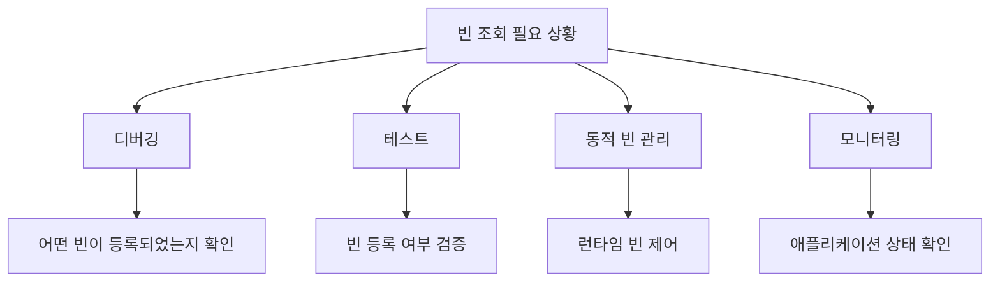
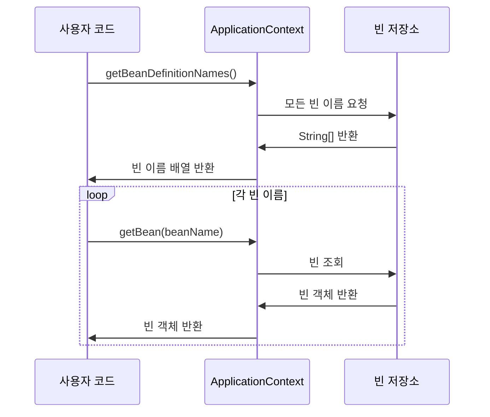
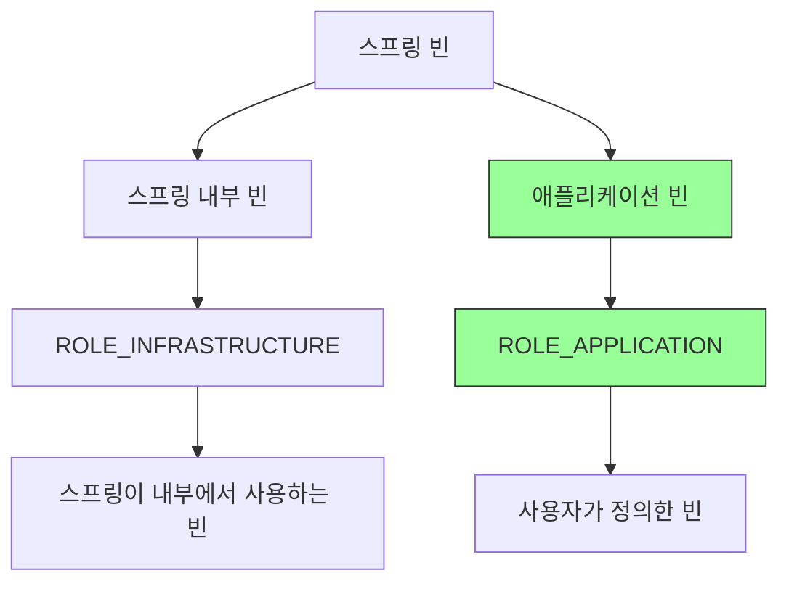
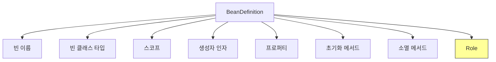
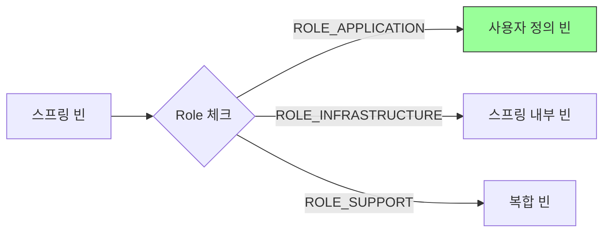
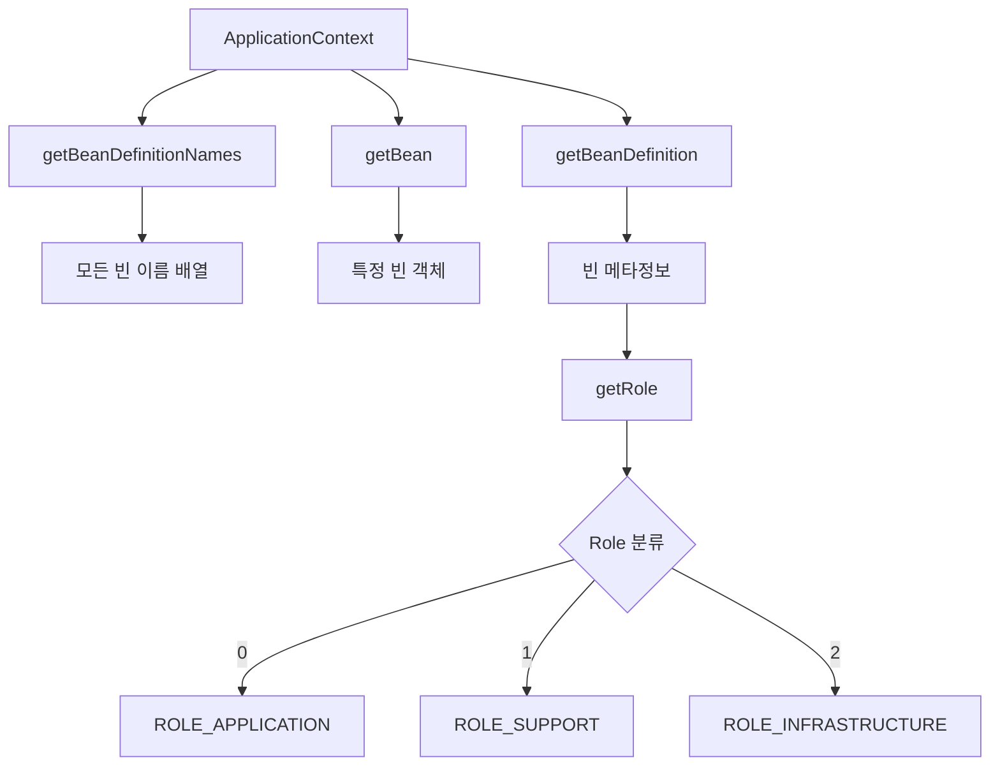

# 4-2. 컨테이너에 등록된 모든 빈 조회

## 목차
1. [빈 조회의 필요성](#빈-조회의-필요성)
2. [모든 빈 조회 방법](#모든-빈-조회-방법)
3. [애플리케이션 빈만 조회하기](#애플리케이션-빈만-조회하기)
4. [BeanDefinition의 Role](#beandefinition의-role)
5. [실습 코드](#실습-코드)
6. [핵심 정리](#핵심-정리)

---

## 빈 조회의 필요성

스프링 컨테이너에 등록된 빈을 조회하는 것은 다음과 같은 상황에서 유용합니다:

### 사용 시나리오



### 빈 조회가 필요한 이유

1. **디버깅 목적**
   - 스프링 컨테이너에 어떤 빈이 등록되었는지 확인
   - 빈 이름과 타입 정보 파악

2. **테스트 작성**
   - 특정 빈이 올바르게 등록되었는지 검증
   - 빈의 개수 확인

3. **동적 프로그래밍**
   - 런타임에 빈 목록을 조회하여 동적으로 처리
   - 특정 타입의 모든 빈 조회

4. **스프링 내부 이해**
   - 스프링이 자동으로 등록하는 빈 확인
   - 애플리케이션 빈과 스프링 내부 빈 구분

---

## 모든 빈 조회 방법

### 기본 빈 조회 메서드

```java
ApplicationContext ac = new AnnotationConfigApplicationContext(AppConfig.class);

// 1. 모든 빈 이름 조회
String[] beanDefinitionNames = ac.getBeanDefinitionNames();

// 2. 빈 이름으로 객체 조회
Object bean = ac.getBean(beanName);

// 3. 빈 정의 정보 조회
BeanDefinition beanDefinition = ac.getBeanDefinition(beanName);
```

### 빈 조회 프로세스



### 모든 빈 출력 예제

```java
package hello.core.beanfind;

import hello.core.AppConfig;
import org.junit.jupiter.api.DisplayName;
import org.junit.jupiter.api.Test;
import org.springframework.beans.factory.config.BeanDefinition;
import org.springframework.context.annotation.AnnotationConfigApplicationContext;

public class ApplicationContextInfoTest {

    AnnotationConfigApplicationContext ac =
        new AnnotationConfigApplicationContext(AppConfig.class);

    @Test
    @DisplayName("모든 빈 출력하기")
    void findAllBean() {
        String[] beanDefinitionNames = ac.getBeanDefinitionNames();

        for (String beanDefinitionName : beanDefinitionNames) {
            Object bean = ac.getBean(beanDefinitionName);
            System.out.println("name = " + beanDefinitionName +
                             ", object = " + bean);
        }
    }
}
```

**실행 결과:**
```
name = org.springframework.context.annotation.internalConfigurationAnnotationProcessor,
object = org.springframework.context.annotation.ConfigurationClassPostProcessor@...

name = org.springframework.context.annotation.internalAutowiredAnnotationProcessor,
object = org.springframework.beans.factory.annotation.AutowiredAnnotationBeanPostProcessor@...

name = org.springframework.context.event.internalEventListenerProcessor,
object = org.springframework.context.event.EventListenerMethodProcessor@...

name = org.springframework.context.event.internalEventListenerFactory,
object = org.springframework.context.event.DefaultEventListenerFactory@...

name = appConfig, object = hello.core.AppConfig$$SpringCGLIB$$0@...

name = memberService, object = hello.core.member.MemberServiceImpl@...

name = memberRepository, object = hello.core.member.MemoryMemberRepository@...

name = orderService, object = hello.core.order.OrderServiceImpl@...

name = discountPolicy, object = hello.core.discount.RateDiscountPolicy@...
```

---

## 애플리케이션 빈만 조회하기

### 빈의 종류

스프링 컨테이너에 등록되는 빈은 크게 두 가지로 분류됩니다:



### BeanDefinition의 Role

| Role | 상수 | 설명 | 예시 |
|------|------|------|------|
| **ROLE_APPLICATION** | 0 | 사용자가 정의한 빈 | memberService, orderService |
| **ROLE_SUPPORT** | 1 | 복합적인 빈의 내부 구성 빈 | - |
| **ROLE_INFRASTRUCTURE** | 2 | 스프링이 내부에서 사용하는 빈 | ConfigurationClassPostProcessor |

### 애플리케이션 빈만 필터링하기

```java
@Test
@DisplayName("애플리케이션 빈 출력하기")
void findApplicationBean() {
    String[] beanDefinitionNames = ac.getBeanDefinitionNames();

    for (String beanDefinitionName : beanDefinitionNames) {
        BeanDefinition beanDefinition =
            ac.getBeanDefinition(beanDefinitionName);

        // ROLE_APPLICATION: 일반적으로 사용자가 정의한 빈
        // ROLE_INFRASTRUCTURE: 스프링이 내부에서 사용하는 빈
        if (beanDefinition.getRole() == BeanDefinition.ROLE_APPLICATION) {
            Object bean = ac.getBean(beanDefinitionName);
            System.out.println("name = " + beanDefinitionName +
                             ", object = " + bean);
        }
    }
}
```

**실행 결과:**
```
name = appConfig, object = hello.core.AppConfig$$SpringCGLIB$$0@...
name = memberService, object = hello.core.member.MemberServiceImpl@...
name = memberRepository, object = hello.core.member.MemoryMemberRepository@...
name = orderService, object = hello.core.order.OrderServiceImpl@...
name = discountPolicy, object = hello.core.discount.RateDiscountPolicy@...
```

---

## BeanDefinition의 Role

### BeanDefinition이란?

**BeanDefinition**은 스프링 빈의 메타데이터 정보를 담고 있는 인터페이스입니다.



### Role의 활용

```java
public class BeanRoleExample {

    public static void main(String[] args) {
        AnnotationConfigApplicationContext ac =
            new AnnotationConfigApplicationContext(AppConfig.class);

        String[] beanNames = ac.getBeanDefinitionNames();

        // 카테고리별 빈 개수 세기
        int applicationBeanCount = 0;
        int infrastructureBeanCount = 0;
        int supportBeanCount = 0;

        for (String beanName : beanNames) {
            BeanDefinition bd = ac.getBeanDefinition(beanName);

            switch (bd.getRole()) {
                case BeanDefinition.ROLE_APPLICATION:
                    applicationBeanCount++;
                    break;
                case BeanDefinition.ROLE_INFRASTRUCTURE:
                    infrastructureBeanCount++;
                    break;
                case BeanDefinition.ROLE_SUPPORT:
                    supportBeanCount++;
                    break;
            }
        }

        System.out.println("애플리케이션 빈: " + applicationBeanCount);
        System.out.println("인프라 빈: " + infrastructureBeanCount);
        System.out.println("서포트 빈: " + supportBeanCount);
    }
}
```

**출력 결과:**
```
애플리케이션 빈: 5
인프라 빈: 4
서포트 빈: 0
```

---

## 실습 코드

### 완전한 테스트 클래스

```java
package hello.core.beanfind;

import hello.core.AppConfig;
import org.junit.jupiter.api.DisplayName;
import org.junit.jupiter.api.Test;
import org.springframework.beans.factory.config.BeanDefinition;
import org.springframework.context.annotation.AnnotationConfigApplicationContext;

import static org.assertj.core.api.Assertions.*;

class ApplicationContextInfoTest {

    AnnotationConfigApplicationContext ac =
        new AnnotationConfigApplicationContext(AppConfig.class);

    @Test
    @DisplayName("모든 빈 출력하기")
    void findAllBean() {
        String[] beanDefinitionNames = ac.getBeanDefinitionNames();

        System.out.println("=== 모든 빈 목록 ===");
        for (String beanDefinitionName : beanDefinitionNames) {
            Object bean = ac.getBean(beanDefinitionName);
            System.out.println("name = " + beanDefinitionName +
                             ", object = " + bean);
        }

        // 검증
        assertThat(beanDefinitionNames.length).isGreaterThan(0);
    }

    @Test
    @DisplayName("애플리케이션 빈 출력하기")
    void findApplicationBean() {
        String[] beanDefinitionNames = ac.getBeanDefinitionNames();

        System.out.println("=== 애플리케이션 빈 목록 ===");
        int count = 0;

        for (String beanDefinitionName : beanDefinitionNames) {
            BeanDefinition beanDefinition =
                ac.getBeanDefinition(beanDefinitionName);

            if (beanDefinition.getRole() == BeanDefinition.ROLE_APPLICATION) {
                Object bean = ac.getBean(beanDefinitionName);
                System.out.println("name = " + beanDefinitionName +
                                 ", object = " + bean);
                count++;
            }
        }

        System.out.println("총 애플리케이션 빈 개수: " + count);

        // 검증: AppConfig에서 정의한 빈은 5개
        assertThat(count).isEqualTo(5);
    }

    @Test
    @DisplayName("스프링 내부 빈 출력하기")
    void findInfrastructureBean() {
        String[] beanDefinitionNames = ac.getBeanDefinitionNames();

        System.out.println("=== 스프링 내부 빈 목록 ===");
        int count = 0;

        for (String beanDefinitionName : beanDefinitionNames) {
            BeanDefinition beanDefinition =
                ac.getBeanDefinition(beanDefinitionName);

            if (beanDefinition.getRole() == BeanDefinition.ROLE_INFRASTRUCTURE) {
                Object bean = ac.getBean(beanDefinitionName);
                System.out.println("name = " + beanDefinitionName +
                                 ", object = " + bean);
                count++;
            }
        }

        System.out.println("총 인프라 빈 개수: " + count);

        // 검증
        assertThat(count).isGreaterThan(0);
    }

    @Test
    @DisplayName("빈 개수 통계")
    void beanStatistics() {
        String[] beanDefinitionNames = ac.getBeanDefinitionNames();

        int totalCount = beanDefinitionNames.length;
        int appCount = 0;
        int infraCount = 0;

        for (String beanName : beanDefinitionNames) {
            BeanDefinition bd = ac.getBeanDefinition(beanName);
            if (bd.getRole() == BeanDefinition.ROLE_APPLICATION) {
                appCount++;
            } else if (bd.getRole() == BeanDefinition.ROLE_INFRASTRUCTURE) {
                infraCount++;
            }
        }

        System.out.println("=== 빈 통계 ===");
        System.out.println("전체 빈 개수: " + totalCount);
        System.out.println("애플리케이션 빈: " + appCount);
        System.out.println("인프라 빈: " + infraCount);
        System.out.println("기타: " + (totalCount - appCount - infraCount));

        // 검증
        assertThat(totalCount).isEqualTo(appCount + infraCount);
    }
}
```

### 빈 정보 상세 출력

```java
@Test
@DisplayName("빈 상세 정보 출력")
void beanDetailInfo() {
    String[] beanDefinitionNames = ac.getBeanDefinitionNames();

    for (String beanName : beanDefinitionNames) {
        BeanDefinition bd = ac.getBeanDefinition(beanName);

        if (bd.getRole() == BeanDefinition.ROLE_APPLICATION) {
            System.out.println("\n=== 빈 이름: " + beanName + " ===");
            System.out.println("클래스: " + bd.getBeanClassName());
            System.out.println("스코프: " + bd.getScope());
            System.out.println("추상 빈: " + bd.isAbstract());
            System.out.println("지연 초기화: " + bd.isLazyInit());
            System.out.println("Role: " + bd.getRole());
        }
    }
}
```

**출력 예시:**
```
=== 빈 이름: memberService ===
클래스: null
스코프:
추상 빈: false
지연 초기화: false
Role: 0

=== 빈 이름: memberRepository ===
클래스: null
스코프:
추상 빈: false
지연 초기화: false
Role: 0
```

---

## 핵심 정리

### 1. 빈 조회 핵심 메서드

```java
// 모든 빈 이름 조회
String[] beanNames = ac.getBeanDefinitionNames();

// 빈 이름으로 객체 조회
Object bean = ac.getBean("빈이름");

// 빈 정의 정보 조회
BeanDefinition bd = ac.getBeanDefinition("빈이름");

// Role 확인
int role = bd.getRole();
```

### 2. 빈 분류 기준



### 3. 실무 활용 패턴

**디버깅 시:**
```java
// 모든 빈 출력
ac.getBeanDefinitionNames();
```

**테스트 시:**
```java
// 특정 빈 존재 확인
assertThat(ac.containsBean("memberService")).isTrue();

// 빈 개수 확인
assertThat(ac.getBeanDefinitionCount()).isGreaterThan(0);
```

**동적 처리 시:**
```java
// 특정 타입의 모든 빈 조회
Map<String, MemberRepository> beans =
    ac.getBeansOfType(MemberRepository.class);
```

### 4. 주의사항

**getBeanDefinitionNames()의 특징:**
- 모든 빈의 이름을 배열로 반환
- 스프링 내부 빈도 포함
- 순서는 보장되지 않음

**Role 필터링 필요성:**
```java
// ❌ 모든 빈 처리 (비효율)
for (String name : ac.getBeanDefinitionNames()) {
    // 스프링 내부 빈도 처리됨
}

// ✅ 애플리케이션 빈만 처리 (효율적)
for (String name : ac.getBeanDefinitionNames()) {
    BeanDefinition bd = ac.getBeanDefinition(name);
    if (bd.getRole() == BeanDefinition.ROLE_APPLICATION) {
        // 애플리케이션 빈만 처리
    }
}
```

### 5. 빈 조회 체계



### 6. 실무 팁

**로깅에 활용:**
```java
@Component
public class BeanLogger {

    @PostConstruct
    public void logBeans() {
        ApplicationContext ac = ... // 주입받음

        log.info("=== 애플리케이션 빈 목록 ===");
        for (String name : ac.getBeanDefinitionNames()) {
            BeanDefinition bd = ac.getBeanDefinition(name);
            if (bd.getRole() == BeanDefinition.ROLE_APPLICATION) {
                log.info("Bean: {}", name);
            }
        }
    }
}
```

**테스트 유틸리티:**
```java
public class BeanTestUtils {

    public static int countApplicationBeans(ApplicationContext ac) {
        int count = 0;
        for (String name : ac.getBeanDefinitionNames()) {
            BeanDefinition bd = ac.getBeanDefinition(name);
            if (bd.getRole() == BeanDefinition.ROLE_APPLICATION) {
                count++;
            }
        }
        return count;
    }

    public static List<String> getApplicationBeanNames(ApplicationContext ac) {
        List<String> result = new ArrayList<>();
        for (String name : ac.getBeanDefinitionNames()) {
            BeanDefinition bd = ac.getBeanDefinition(name);
            if (bd.getRole() == BeanDefinition.ROLE_APPLICATION) {
                result.add(name);
            }
        }
        return result;
    }
}
```

---

## 💡 심화 내용

<details>
<summary>더 알아보기</summary>

### 내부 동작 원리

#### BeanDefinitionRegistry의 역할
스프링 컨테이너는 내부적으로 `BeanDefinitionRegistry`를 사용하여 빈 정의를 관리합니다.

```java
public interface BeanDefinitionRegistry {
    void registerBeanDefinition(String beanName, BeanDefinition beanDefinition);
    void removeBeanDefinition(String beanName);
    BeanDefinition getBeanDefinition(String beanName);
    boolean containsBeanDefinition(String beanName);
    String[] getBeanDefinitionNames();
    int getBeanDefinitionCount();
}
```

#### 빈 저장소 내부 구조
```java
// 실제 구현 (간략화)
public class DefaultListableBeanFactory {
    // 빈 정의 정보 저장
    private final Map<String, BeanDefinition> beanDefinitionMap =
        new ConcurrentHashMap<>(256);

    // 빈 정의 이름 목록 (등록 순서 유지)
    private volatile List<String> beanDefinitionNames =
        new ArrayList<>(256);

    // 빈 인스턴스 캐시 (싱글톤)
    private final Map<String, Object> singletonObjects =
        new ConcurrentHashMap<>(256);
}
```

### 실무 적용 사례

#### 1. 런타임 빈 조회 및 동적 처리
```java
@Component
public class DynamicBeanProcessor {

    @Autowired
    private ApplicationContext applicationContext;

    public void processAllRepositories() {
        // 모든 Repository 타입 빈 조회
        Map<String, Object> repositories =
            applicationContext.getBeansWithAnnotation(Repository.class);

        repositories.forEach((name, bean) -> {
            System.out.println("Repository: " + name);
            // 동적 처리 로직
        });
    }

    public void findServicesByPattern(String pattern) {
        String[] allBeanNames = applicationContext.getBeanDefinitionNames();

        for (String beanName : allBeanNames) {
            if (beanName.endsWith(pattern)) {
                Object bean = applicationContext.getBean(beanName);
                // 패턴에 맞는 빈 처리
            }
        }
    }
}
```

#### 2. 빈 통계 및 모니터링
```java
@Component
public class BeanMonitor {

    @Autowired
    private ApplicationContext applicationContext;

    @EventListener(ContextRefreshedEvent.class)
    public void onApplicationStart() {
        printBeanStatistics();
    }

    private void printBeanStatistics() {
        String[] beanNames = applicationContext.getBeanDefinitionNames();

        int applicationBeans = 0;
        int infrastructureBeans = 0;

        for (String beanName : beanNames) {
            BeanDefinition bd =
                ((ConfigurableApplicationContext) applicationContext)
                    .getBeanFactory()
                    .getBeanDefinition(beanName);

            if (bd.getRole() == BeanDefinition.ROLE_APPLICATION) {
                applicationBeans++;
            } else {
                infrastructureBeans++;
            }
        }

        log.info("=== Bean Statistics ===");
        log.info("Total Beans: {}", beanNames.length);
        log.info("Application Beans: {}", applicationBeans);
        log.info("Infrastructure Beans: {}", infrastructureBeans);
    }
}
```

#### 3. 커스텀 빈 스캐너
```java
@Component
public class CustomBeanScanner {

    @Autowired
    private ApplicationContext applicationContext;

    // 특정 인터페이스를 구현한 모든 빈 조회
    public <T> List<T> findBeansOfInterface(Class<T> interfaceClass) {
        Map<String, T> beans =
            applicationContext.getBeansOfType(interfaceClass);
        return new ArrayList<>(beans.values());
    }

    // 특정 애노테이션이 붙은 빈 조회
    public List<Object> findBeansWithAnnotation(
            Class<? extends Annotation> annotationType) {
        Map<String, Object> beans =
            applicationContext.getBeansWithAnnotation(annotationType);
        return new ArrayList<>(beans.values());
    }

    // 빈 이름으로 필터링
    public List<String> findBeanNamesByPrefix(String prefix) {
        String[] allBeanNames = applicationContext.getBeanDefinitionNames();
        return Arrays.stream(allBeanNames)
                .filter(name -> name.startsWith(prefix))
                .collect(Collectors.toList());
    }
}
```

### Anti-pattern 및 주의사항

**❌ 잘못된 예: 모든 빈을 순회하며 처리**
```java
// 성능 문제 발생
@Component
public class BadBeanProcessor {

    @Autowired
    private ApplicationContext applicationContext;

    public void processEveryRequest() {
        // 매 요청마다 모든 빈 조회 - 비효율적!
        String[] beanNames = applicationContext.getBeanDefinitionNames();
        for (String beanName : beanNames) {
            Object bean = applicationContext.getBean(beanName);
            // 처리 로직
        }
    }
}
```

**✅ 올바른 예: 초기화 시점에 한 번만 조회**
```java
@Component
public class GoodBeanProcessor implements InitializingBean {

    @Autowired
    private ApplicationContext applicationContext;

    private List<String> cachedBeanNames;

    @Override
    public void afterPropertiesSet() {
        // 초기화 시점에 한 번만 조회하여 캐싱
        cachedBeanNames = Arrays.asList(
            applicationContext.getBeanDefinitionNames()
        );
    }

    public void processRequest() {
        // 캐싱된 데이터 사용
        cachedBeanNames.forEach(name -> {
            // 처리 로직
        });
    }
}
```

**❌ 잘못된 예: 프로덕션에서 빈 정보 노출**
```java
// 보안 문제
@RestController
public class BeanInfoController {

    @Autowired
    private ApplicationContext applicationContext;

    @GetMapping("/beans")
    public List<String> getAllBeans() {
        // 프로덕션에서 모든 빈 정보 노출 - 위험!
        return Arrays.asList(applicationContext.getBeanDefinitionNames());
    }
}
```

**✅ 올바른 예: 개발 환경에서만 사용**
```java
@RestController
@Profile("dev")  // 개발 환경에서만 활성화
public class BeanInfoController {

    @Autowired
    private ApplicationContext applicationContext;

    @GetMapping("/actuator/beans")
    public Map<String, Object> getBeanInfo() {
        // 적절한 권한 검사 후 제공
        return Map.of(
            "count", applicationContext.getBeanDefinitionNames().length,
            "timestamp", System.currentTimeMillis()
        );
    }
}
```

</details>

---

## 면접 질문

### 초급 개발자 (Junior)

**Q1. getBeanDefinitionNames() 메서드는 어떤 빈들을 반환하나요?**
<details>
<summary>답안 보기</summary>

`getBeanDefinitionNames()` 메서드는 **스프링 컨테이너에 등록된 모든 빈의 이름**을 반환합니다.

**포함되는 빈:**
1. **사용자가 정의한 애플리케이션 빈**
   - @Bean으로 등록한 빈
   - @Component, @Service 등으로 자동 등록된 빈

2. **스프링 내부에서 사용하는 인프라 빈**
   - ConfigurationClassPostProcessor
   - AutowiredAnnotationBeanPostProcessor
   - EventListenerMethodProcessor 등

**예시:**
```java
ApplicationContext ac =
    new AnnotationConfigApplicationContext(AppConfig.class);

String[] beanNames = ac.getBeanDefinitionNames();
// 출력: ["..internalConfigurationAnnotationProcessor",
//       "appConfig", "memberService", "memberRepository", ...]
```

**특징:**
- 순서는 보장되지 않음
- 모든 빈 정의가 포함됨 (지연 초기화 빈 포함)
- 빈 객체가 아닌 빈 이름(String)만 반환

</details>

**Q2. BeanDefinition의 Role이 무엇이며, 어떤 값들이 있나요?**
<details>
<summary>답안 보기</summary>

**BeanDefinition의 Role:**
빈이 어떤 목적으로 등록되었는지를 나타내는 속성입니다.

**Role 종류:**

1. **ROLE_APPLICATION (0)**
   - 사용자가 정의한 애플리케이션 빈
   - 비즈니스 로직을 담당
   ```java
   @Bean
   public MemberService memberService() {
       return new MemberServiceImpl();
   }
   // Role: ROLE_APPLICATION
   ```

2. **ROLE_SUPPORT (1)**
   - 복합적인 빈의 내부 구성 빈
   - 거의 사용되지 않음

3. **ROLE_INFRASTRUCTURE (2)**
   - 스프링이 내부에서 사용하는 빈
   - 프레임워크 동작에 필요
   ```java
   // 예: ConfigurationClassPostProcessor
   // Role: ROLE_INFRASTRUCTURE
   ```

**활용 예시:**
```java
String[] beanNames = ac.getBeanDefinitionNames();

for (String beanName : beanNames) {
    BeanDefinition bd = ac.getBeanDefinition(beanName);

    if (bd.getRole() == BeanDefinition.ROLE_APPLICATION) {
        System.out.println("애플리케이션 빈: " + beanName);
    }
}
```

**실무 활용:**
- 애플리케이션 빈만 필터링할 때 사용
- 빈 통계 및 모니터링
- 디버깅 시 스프링 내부 빈 제외

</details>

**Q3. 스프링 내부 빈과 애플리케이션 빈을 구분하는 방법은?**
<details>
<summary>답안 보기</summary>

**구분 방법:**

BeanDefinition의 `getRole()` 메서드를 사용하여 구분합니다.

```java
@Test
void separateBeansTest() {
    ApplicationContext ac =
        new AnnotationConfigApplicationContext(AppConfig.class);

    String[] beanNames = ac.getBeanDefinitionNames();

    List<String> applicationBeans = new ArrayList<>();
    List<String> infrastructureBeans = new ArrayList<>();

    for (String beanName : beanNames) {
        BeanDefinition bd = ac.getBeanDefinition(beanName);

        if (bd.getRole() == BeanDefinition.ROLE_APPLICATION) {
            applicationBeans.add(beanName);
        } else if (bd.getRole() == BeanDefinition.ROLE_INFRASTRUCTURE) {
            infrastructureBeans.add(beanName);
        }
    }

    System.out.println("애플리케이션 빈: " + applicationBeans);
    System.out.println("인프라 빈: " + infrastructureBeans);
}
```

**애플리케이션 빈 특징:**
- 사용자가 @Bean, @Component 등으로 정의
- 비즈니스 로직 담당
- Role = 0 (ROLE_APPLICATION)

**스프링 내부 빈 특징:**
- 스프링이 자동으로 등록
- 프레임워크 동작에 필요
- Role = 2 (ROLE_INFRASTRUCTURE)
- 이름이 "internal"로 시작하는 경우가 많음

**실무 활용:**
```java
// 애플리케이션 빈만 조회하는 유틸리티
public List<String> getApplicationBeanNames(ApplicationContext ac) {
    return Arrays.stream(ac.getBeanDefinitionNames())
            .filter(name -> {
                BeanDefinition bd = ac.getBeanDefinition(name);
                return bd.getRole() == BeanDefinition.ROLE_APPLICATION;
            })
            .collect(Collectors.toList());
}
```

</details>

### 중급 개발자 (Mid-Level)

**Q4. getBeansOfType()과 getBeanDefinitionNames()의 차이점과 사용 시나리오를 설명해주세요.**
<details>
<summary>답안 보기</summary>

**주요 차이점:**

| 구분 | getBeanDefinitionNames() | getBeansOfType() |
|------|-------------------------|------------------|
| **반환 타입** | String[] (빈 이름) | Map<String, T> (이름+객체) |
| **필터링** | 모든 빈 | 특정 타입만 |
| **빈 객체** | 포함 안함 | 포함 |
| **성능** | 빈 이름만 조회 (빠름) | 빈 객체 생성 필요 (느림) |

**getBeanDefinitionNames() 사용:**
```java
// 시나리오: 빈 이름 목록만 필요한 경우
String[] beanNames = ac.getBeanDefinitionNames();

// 용도
// 1. 빈 개수 확인
System.out.println("총 빈 개수: " + beanNames.length);

// 2. 빈 이름 패턴 검색
List<String> serviceBeans = Arrays.stream(beanNames)
    .filter(name -> name.endsWith("Service"))
    .collect(Collectors.toList());

// 3. 빈 목록 로깅
Arrays.stream(beanNames).forEach(System.out::println);
```

**getBeansOfType() 사용:**
```java
// 시나리오: 특정 타입의 빈 객체가 필요한 경우
Map<String, MemberRepository> repositories =
    ac.getBeansOfType(MemberRepository.class);

// 용도
// 1. 특정 인터페이스의 모든 구현체 조회
repositories.values().forEach(repo -> {
    // 각 Repository로 작업 수행
    repo.save(member);
});

// 2. 전략 패턴 구현
public class MultiRepositoryService {
    private final Map<String, MemberRepository> repositories;

    public MultiRepositoryService(ApplicationContext ac) {
        this.repositories = ac.getBeansOfType(MemberRepository.class);
    }

    public void saveToAll(Member member) {
        repositories.values().forEach(repo -> repo.save(member));
    }
}

// 3. 플러그인 시스템
Map<String, PaymentProcessor> processors =
    ac.getBeansOfType(PaymentProcessor.class);
```

**성능 고려사항:**
```java
// ❌ 비효율적: 매번 모든 빈 객체 생성
public void processRequest() {
    Map<String, MemberRepository> repos =
        ac.getBeansOfType(MemberRepository.class);
    // 처리...
}

// ✅ 효율적: 초기화 시 한 번만 조회
@Component
public class RepositoryManager implements InitializingBean {
    private Map<String, MemberRepository> repositories;

    @Override
    public void afterPropertiesSet() {
        this.repositories = ac.getBeansOfType(MemberRepository.class);
    }
}
```

**선택 기준:**
- 빈 이름만 필요 → `getBeanDefinitionNames()`
- 빈 객체가 필요 → `getBeansOfType()`
- 전체 빈 목록 → `getBeanDefinitionNames()`
- 특정 타입만 → `getBeansOfType()`

</details>

**Q5. 빈 조회 시 발생할 수 있는 성능 이슈와 최적화 방법을 설명해주세요.**
<details>
<summary>답안 보기</summary>

**성능 이슈:**

1. **반복적인 빈 조회**
```java
// ❌ 나쁜 예: 매 요청마다 빈 조회
@RestController
public class OrderController {
    @Autowired
    private ApplicationContext ac;

    @GetMapping("/order")
    public Order createOrder() {
        // 매번 컨테이너에서 빈 조회 - 비효율적!
        MemberService memberService =
            ac.getBean("memberService", MemberService.class);
        return memberService.createOrder();
    }
}
```

2. **불필요한 전체 빈 스캔**
```java
// ❌ 나쁜 예: 특정 빈 하나만 필요한데 전체 조회
public MemberService findMemberService() {
    String[] allBeans = ac.getBeanDefinitionNames();
    for (String beanName : allBeans) {
        Object bean = ac.getBean(beanName);
        if (bean instanceof MemberService) {
            return (MemberService) bean;
        }
    }
    return null;
}
```

3. **타입 조회 시 빈 생성 오버헤드**
```java
// ❌ 나쁜 예: 지연 초기화 빈까지 모두 생성
Map<String, HeavyService> services =
    ac.getBeansOfType(HeavyService.class);
// 모든 HeavyService 빈이 즉시 생성됨
```

**최적화 방법:**

**1. 의존성 주입 활용 (가장 권장)**
```java
// ✅ 좋은 예: 생성자 주입
@RestController
public class OrderController {
    private final MemberService memberService;  // 캐싱됨

    @Autowired
    public OrderController(MemberService memberService) {
        this.memberService = memberService;
    }

    @GetMapping("/order")
    public Order createOrder() {
        return memberService.createOrder();  // 빠름!
    }
}
```

**2. 초기화 시점 캐싱**
```java
// ✅ 좋은 예: 초기화 시 한 번만 조회
@Component
public class BeanCache implements InitializingBean {
    @Autowired
    private ApplicationContext ac;

    private List<String> applicationBeanNames;
    private Map<String, MemberRepository> repositories;

    @Override
    public void afterPropertiesSet() {
        // 초기화 시 한 번만 실행
        String[] allBeans = ac.getBeanDefinitionNames();

        applicationBeanNames = Arrays.stream(allBeans)
            .filter(name -> {
                BeanDefinition bd = ac.getBeanDefinition(name);
                return bd.getRole() == BeanDefinition.ROLE_APPLICATION;
            })
            .collect(Collectors.toList());

        repositories = ac.getBeansOfType(MemberRepository.class);
    }

    public List<String> getApplicationBeanNames() {
        return applicationBeanNames;  // 캐싱된 데이터 반환
    }
}
```

**3. 지연 로딩 활용**
```java
// ✅ 좋은 예: 필요할 때만 조회
@Component
public class ServiceLocator {
    @Autowired
    private ApplicationContext ac;

    private MemberService memberService;  // 지연 로딩

    public MemberService getMemberService() {
        if (memberService == null) {
            memberService = ac.getBean(MemberService.class);
        }
        return memberService;
    }
}
```

**4. 빈 이름으로 직접 조회**
```java
// ✅ 좋은 예: 정확한 빈 이름으로 조회
MemberService service =
    ac.getBean("memberService", MemberService.class);
// 빠른 Map lookup

// ❌ 나쁜 예: 타입으로만 조회 후 필터링
Map<String, Object> allBeans = ac.getBeansOfType(Object.class);
// 느린 전체 스캔
```

**성능 측정 예시:**
```java
@Component
public class BeanQueryPerformanceTest {

    @Autowired
    private ApplicationContext ac;

    public void measurePerformance() {
        // 방법 1: getBeanDefinitionNames()
        long start1 = System.nanoTime();
        String[] beanNames = ac.getBeanDefinitionNames();
        long end1 = System.nanoTime();
        System.out.println("getBeanDefinitionNames: " +
            (end1 - start1) + "ns");

        // 방법 2: getBeansOfType()
        long start2 = System.nanoTime();
        Map<String, Object> beans = ac.getBeansOfType(Object.class);
        long end2 = System.nanoTime();
        System.out.println("getBeansOfType: " +
            (end2 - start2) + "ns");

        // getBeansOfType이 훨씬 느림 (빈 객체 생성 필요)
    }
}
```

**핵심 원칙:**
1. 가능하면 의존성 주입 사용
2. 런타임 조회는 최소화
3. 필요하면 초기화 시점에 캐싱
4. 전체 빈 스캔 지양

</details>

**Q6. 프로덕션 환경에서 빈 정보를 안전하게 모니터링하는 방법은?**
<details>
<summary>답안 보기</summary>

**프로덕션 환경의 보안 고려사항:**

**❌ 위험한 방법:**
```java
// 모든 빈 정보 노출 - 보안 위험!
@RestController
public class BeanInfoController {
    @Autowired
    private ApplicationContext ac;

    @GetMapping("/beans")
    public List<String> getAllBeans() {
        return Arrays.asList(ac.getBeanDefinitionNames());
    }
}
```

**✅ 안전한 방법:**

**1. Spring Boot Actuator 사용 (권장)**
```yaml
# application.yml
management:
  endpoints:
    web:
      exposure:
        include: beans, health, info
  endpoint:
    beans:
      enabled: true

# 보안 설정
spring:
  security:
    user:
      name: admin
      password: ${ACTUATOR_PASSWORD}

management:
  endpoints:
    web:
      base-path: /actuator
```

```java
// Actuator 접근 제어
@Configuration
public class ActuatorSecurityConfig extends WebSecurityConfigurerAdapter {

    @Override
    protected void configure(HttpSecurity http) throws Exception {
        http
            .requestMatcher(EndpointRequest.toAnyEndpoint())
            .authorizeRequests()
                .anyRequest().hasRole("ACTUATOR_ADMIN")
            .and()
            .httpBasic();
    }
}
```

**2. 프로파일별 분리**
```java
@RestController
@Profile("dev")  // 개발 환경에서만 활성화
public class BeanInfoController {

    @Autowired
    private ApplicationContext ac;

    @GetMapping("/dev/beans")
    public Map<String, Object> getBeanInfo() {
        String[] beanNames = ac.getBeanDefinitionNames();

        return Map.of(
            "totalCount", beanNames.length,
            "applicationBeans", getApplicationBeanCount(),
            "timestamp", System.currentTimeMillis()
        );
    }

    private int getApplicationBeanCount() {
        return (int) Arrays.stream(ac.getBeanDefinitionNames())
            .filter(name -> {
                BeanDefinition bd = ac.getBeanDefinition(name);
                return bd.getRole() == BeanDefinition.ROLE_APPLICATION;
            })
            .count();
    }
}
```

**3. 로깅 기반 모니터링**
```java
@Component
public class BeanMonitor {

    private static final Logger log =
        LoggerFactory.getLogger(BeanMonitor.class);

    @Autowired
    private ApplicationContext ac;

    @EventListener(ContextRefreshedEvent.class)
    public void onStartup() {
        if (log.isInfoEnabled()) {
            logBeanStatistics();
        }
    }

    private void logBeanStatistics() {
        String[] beanNames = ac.getBeanDefinitionNames();

        Map<String, Integer> stats = new HashMap<>();
        stats.put("total", beanNames.length);
        stats.put("application", countApplicationBeans());
        stats.put("infrastructure", countInfrastructureBeans());

        log.info("Bean Statistics: {}", stats);

        // 민감 정보 제외하고 로깅
        log.debug("Application Beans: {}",
            getApplicationBeanNames());
    }

    private int countApplicationBeans() {
        return (int) Arrays.stream(ac.getBeanDefinitionNames())
            .filter(name -> {
                BeanDefinition bd = ac.getBeanDefinition(name);
                return bd.getRole() == BeanDefinition.ROLE_APPLICATION;
            })
            .count();
    }
}
```

**4. 커스텀 헬스 체크**
```java
@Component
public class BeanHealthIndicator implements HealthIndicator {

    @Autowired
    private ApplicationContext ac;

    @Override
    public Health health() {
        int beanCount = ac.getBeanDefinitionCount();
        int applicationBeanCount = countApplicationBeans();

        if (applicationBeanCount == 0) {
            return Health.down()
                .withDetail("reason", "No application beans found")
                .build();
        }

        return Health.up()
            .withDetail("totalBeans", beanCount)
            .withDetail("applicationBeans", applicationBeanCount)
            .build();
    }

    private int countApplicationBeans() {
        return (int) Arrays.stream(ac.getBeanDefinitionNames())
            .filter(name -> {
                BeanDefinition bd = ac.getBeanDefinition(name);
                return bd.getRole() == BeanDefinition.ROLE_APPLICATION;
            })
            .count();
    }
}
```

**5. 메트릭 수집**
```java
@Component
public class BeanMetrics {

    @Autowired
    private MeterRegistry meterRegistry;

    @Autowired
    private ApplicationContext ac;

    @PostConstruct
    public void registerMetrics() {
        Gauge.builder("spring.beans.total", ac,
                ctx -> ctx.getBeanDefinitionCount())
            .description("Total number of Spring beans")
            .register(meterRegistry);

        Gauge.builder("spring.beans.application", this,
                BeanMetrics::countApplicationBeans)
            .description("Number of application beans")
            .register(meterRegistry);
    }

    private double countApplicationBeans(BeanMetrics self) {
        return Arrays.stream(ac.getBeanDefinitionNames())
            .filter(name -> {
                BeanDefinition bd = ac.getBeanDefinition(name);
                return bd.getRole() == BeanDefinition.ROLE_APPLICATION;
            })
            .count();
    }
}
```

**핵심 원칙:**
1. 프로덕션에서는 상세 빈 정보 노출 금지
2. 통계 정보만 제공 (개수, 타입 분포 등)
3. 적절한 인증/인가 적용
4. 프로파일로 환경 분리
5. Actuator 사용 시 엔드포인트 보안 설정

</details>

### 고급 개발자 (Senior)

**Q7. 대규모 애플리케이션에서 수천 개의 빈이 등록될 때, 빈 조회 성능을 최적화하는 전략을 설명해주세요.**
<details>
<summary>답안 보기</summary>

**대규모 애플리케이션의 빈 관리 문제:**

1. 빈 개수 증가로 인한 컨테이너 초기화 시간 증가
2. 런타임 빈 조회 오버헤드
3. 메모리 사용량 증가

**최적화 전략:**

**1. 빈 스캔 범위 최적화**
```java
// ❌ 나쁜 예: 너무 넓은 스캔 범위
@SpringBootApplication
@ComponentScan(basePackages = "com")  // 전체 패키지 스캔
public class Application {
}

// ✅ 좋은 예: 필요한 패키지만 스캔
@SpringBootApplication
@ComponentScan(basePackages = {
    "com.example.service",
    "com.example.repository",
    "com.example.controller"
})
public class Application {
}
```

**2. 지연 초기화 (Lazy Initialization)**
```java
// 스프링 부트 2.2+
spring.main.lazy-initialization=true

// 또는 개별 빈에 적용
@Configuration
public class AppConfig {

    @Bean
    @Lazy  // 실제 사용 시점에 빈 생성
    public HeavyService heavyService() {
        return new HeavyService();
    }

    @Bean  // 자주 사용하는 빈은 즉시 로딩
    public CriticalService criticalService() {
        return new CriticalService();
    }
}
```

**3. 빈 조회 캐싱 전략**
```java
@Component
public class OptimizedBeanLocator {

    @Autowired
    private ApplicationContext ac;

    // 타입별 빈 캐시
    private final ConcurrentHashMap<Class<?>, Object> beanCache =
        new ConcurrentHashMap<>();

    // 타입별 빈 목록 캐시
    private final ConcurrentHashMap<Class<?>, Map<String, ?>>
        beansOfTypeCache = new ConcurrentHashMap<>();

    @SuppressWarnings("unchecked")
    public <T> T getBean(Class<T> type) {
        return (T) beanCache.computeIfAbsent(type,
            t -> ac.getBean(t));
    }

    @SuppressWarnings("unchecked")
    public <T> Map<String, T> getBeansOfType(Class<T> type) {
        return (Map<String, T>) beansOfTypeCache.computeIfAbsent(type,
            t -> ac.getBeansOfType(type));
    }

    // 캐시 무효화 (필요 시)
    public void clearCache() {
        beanCache.clear();
        beansOfTypeCache.clear();
    }
}
```

**4. 빈 정의 인덱싱**
```java
@Component
public class BeanIndexer implements InitializingBean {

    @Autowired
    private ApplicationContext ac;

    // 타입별 인덱스
    private Map<Class<?>, List<String>> typeIndex = new HashMap<>();

    // 애노테이션별 인덱스
    private Map<Class<? extends Annotation>, List<String>>
        annotationIndex = new HashMap<>();

    @Override
    public void afterPropertiesSet() {
        buildIndexes();
    }

    private void buildIndexes() {
        String[] beanNames = ac.getBeanDefinitionNames();

        for (String beanName : beanNames) {
            BeanDefinition bd = ac.getBeanDefinition(beanName);

            if (bd.getRole() != BeanDefinition.ROLE_APPLICATION) {
                continue;
            }

            try {
                Class<?> beanType = Class.forName(bd.getBeanClassName());

                // 타입 인덱싱
                indexByType(beanName, beanType);

                // 애노테이션 인덱싱
                indexByAnnotation(beanName, beanType);

            } catch (Exception e) {
                // 처리
            }
        }
    }

    private void indexByType(String beanName, Class<?> type) {
        // 클래스와 모든 인터페이스에 대해 인덱싱
        typeIndex.computeIfAbsent(type, k -> new ArrayList<>())
            .add(beanName);

        for (Class<?> iface : type.getInterfaces()) {
            typeIndex.computeIfAbsent(iface, k -> new ArrayList<>())
                .add(beanName);
        }
    }

    private void indexByAnnotation(String beanName, Class<?> type) {
        for (Annotation annotation : type.getAnnotations()) {
            Class<? extends Annotation> annotationType =
                annotation.annotationType();
            annotationIndex.computeIfAbsent(annotationType,
                k -> new ArrayList<>())
                .add(beanName);
        }
    }

    // 빠른 조회
    public List<String> findBeanNamesByType(Class<?> type) {
        return typeIndex.getOrDefault(type, Collections.emptyList());
    }

    public List<String> findBeanNamesByAnnotation(
            Class<? extends Annotation> annotationType) {
        return annotationIndex.getOrDefault(annotationType,
            Collections.emptyList());
    }
}
```

**5. 조건부 빈 등록**
```java
@Configuration
public class ConditionalBeanConfig {

    // 특정 조건에서만 빈 등록
    @Bean
    @ConditionalOnProperty(
        name = "feature.advanced.enabled",
        havingValue = "true"
    )
    public AdvancedFeatureService advancedFeatureService() {
        return new AdvancedFeatureService();
    }

    // 특정 프로파일에서만 빈 등록
    @Bean
    @Profile("production")
    public ProductionOnlyService productionOnlyService() {
        return new ProductionOnlyService();
    }

    // 특정 클래스가 있을 때만 빈 등록
    @Bean
    @ConditionalOnClass(name = "com.example.Optional Service")
    public OptionalService optionalService() {
        return new OptionalService();
    }
}
```

**6. 빈 생명주기 최적화**
```java
@Component
public class OptimizedBean implements SmartInitializingSingleton {

    private Map<String, Service> serviceCache;

    @Override
    public void afterSingletonsInstantiated() {
        // 모든 싱글톤 빈 초기화 후 실행
        // 한 번만 실행되는 무거운 초기화 작업
        this.serviceCache = initializeServiceCache();
    }

    private Map<String, Service> initializeServiceCache() {
        // 무거운 초기화 로직
        return new HashMap<>();
    }
}
```

**7. 프로파일 기반 빈 분리**
```java
@Configuration
@Profile("!test")  // 테스트 환경 제외
public class ProductionBeanConfig {
    // 프로덕션에만 필요한 빈들

    @Bean
    public MonitoringService monitoringService() {
        return new MonitoringService();
    }
}

@Configuration
@Profile("test")
public class TestBeanConfig {
    // 테스트에만 필요한 빈들 (Mock 등)

    @Bean
    public MonitoringService monitoringService() {
        return mock(MonitoringService.class);
    }
}
```

**성능 측정:**
```java
@Component
public class BeanPerformanceMonitor {

    @Autowired
    private ApplicationContext ac;

    @EventListener(ContextRefreshedEvent.class)
    public void measureStartupPerformance() {
        long start = System.currentTimeMillis();

        String[] beanNames = ac.getBeanDefinitionNames();
        int totalBeans = beanNames.length;

        long end = System.currentTimeMillis();

        log.info("=== Bean Startup Performance ===");
        log.info("Total beans: {}", totalBeans);
        log.info("Startup time: {}ms", (end - start));
        log.info("Average per bean: {}ms",
            (end - start) / (double) totalBeans);
    }
}
```

**핵심 전략 정리:**
1. 빈 스캔 범위 최소화
2. 지연 초기화 적극 활용
3. 빈 조회 결과 캐싱
4. 빈 인덱싱으로 빠른 검색
5. 조건부 빈 등록으로 불필요한 빈 제거
6. 프로파일로 환경별 빈 분리

</details>

**Q8. BeanDefinition의 역할과 메타 프로그래밍 관점에서의 활용 방법을 설명해주세요.**
<details>
<summary>답안 보기</summary>

**BeanDefinition의 역할:**

BeanDefinition은 스프링 빈의 메타데이터를 담고 있는 추상화 계층으로, 다양한 설정 방식(Java, XML, Groovy 등)을 통일된 형식으로 표현합니다.

**기본 개념:**
```java
// BeanDefinition 구조
public interface BeanDefinition {
    String getBeanClassName();  // 빈 클래스 이름
    String getScope();          // 스코프 (singleton/prototype 등)
    boolean isLazyInit();       // 지연 초기화 여부
    String[] getDependsOn();    // 의존 빈 목록
    int getRole();              // 역할 (APPLICATION/INFRASTRUCTURE)
    String getFactoryMethodName();  // 팩토리 메서드
    // ...
}
```

**메타 프로그래밍 활용:**

**1. 동적 빈 등록**
```java
@Configuration
public class DynamicBeanRegistrar {

    @Autowired
    private ConfigurableApplicationContext context;

    public void registerBeanDynamically() {
        // BeanDefinition 생성
        BeanDefinitionRegistry registry =
            (BeanDefinitionRegistry) context.getBeanFactory();

        GenericBeanDefinition beanDefinition =
            new GenericBeanDefinition();
        beanDefinition.setBeanClass(MemberService.class);
        beanDefinition.setScope("singleton");
        beanDefinition.setLazyInit(false);

        // 생성자 인자 설정
        ConstructorArgumentValues constructorArgs =
            new ConstructorArgumentValues();
        constructorArgs.addGenericArgumentValue(
            new RuntimeBeanReference("memberRepository")
        );
        beanDefinition.setConstructorArgumentValues(constructorArgs);

        // 빈 등록
        registry.registerBeanDefinition("dynamicMemberService",
            beanDefinition);
    }
}
```

**2. 빈 정의 수정 (BeanFactoryPostProcessor)**
```java
@Component
public class CustomBeanFactoryPostProcessor
        implements BeanFactoryPostProcessor {

    @Override
    public void postProcessBeanFactory(
            ConfigurableListableBeanFactory beanFactory) {

        String[] beanNames = beanFactory.getBeanDefinitionNames();

        for (String beanName : beanNames) {
            BeanDefinition bd = beanFactory.getBeanDefinition(beanName);

            // 모든 애플리케이션 빈을 프로토타입으로 변경
            if (bd.getRole() == BeanDefinition.ROLE_APPLICATION) {
                bd.setScope("prototype");
            }

            // 특정 패턴의 빈을 지연 초기화로 변경
            if (beanName.startsWith("heavy")) {
                bd.setLazyInit(true);
            }

            // 프로퍼티 값 동적 설정
            MutablePropertyValues pvs = bd.getPropertyValues();
            if (pvs.contains("timeout")) {
                pvs.add("timeout", 5000);
            }
        }
    }
}
```

**3. 조건부 빈 등록**
```java
@Component
public class ConditionalBeanRegistrar
        implements BeanDefinitionRegistryPostProcessor {

    @Override
    public void postProcessBeanDefinitionRegistry(
            BeanDefinitionRegistry registry) {

        // 환경 변수에 따라 동적으로 빈 등록
        String environment = System.getenv("APP_ENV");

        if ("production".equals(environment)) {
            registerProductionBeans(registry);
        } else {
            registerDevelopmentBeans(registry);
        }
    }

    private void registerProductionBeans(BeanDefinitionRegistry registry) {
        GenericBeanDefinition bd = new GenericBeanDefinition();
        bd.setBeanClass(ProductionDataSource.class);
        bd.setScope("singleton");
        registry.registerBeanDefinition("dataSource", bd);
    }

    private void registerDevelopmentBeans(BeanDefinitionRegistry registry) {
        GenericBeanDefinition bd = new GenericBeanDefinition();
        bd.setBeanClass(H2DataSource.class);
        bd.setScope("singleton");
        registry.registerBeanDefinition("dataSource", bd);
    }

    @Override
    public void postProcessBeanFactory(
            ConfigurableListableBeanFactory beanFactory) {
        // 추가 처리
    }
}
```

**4. 플러그인 시스템 구현**
```java
@Component
public class PluginBeanRegistrar
        implements BeanDefinitionRegistryPostProcessor {

    private static final String PLUGIN_PACKAGE = "com.example.plugins";

    @Override
    public void postProcessBeanDefinitionRegistry(
            BeanDefinitionRegistry registry) {

        // 플러그인 클래스 스캔
        Set<Class<?>> pluginClasses = scanPluginClasses();

        for (Class<?> pluginClass : pluginClasses) {
            if (Plugin.class.isAssignableFrom(pluginClass)) {
                registerPluginBean(registry, pluginClass);
            }
        }
    }

    private void registerPluginBean(
            BeanDefinitionRegistry registry,
            Class<?> pluginClass) {

        GenericBeanDefinition bd = new GenericBeanDefinition();
        bd.setBeanClass(pluginClass);
        bd.setScope("singleton");
        bd.setLazyInit(true);  // 플러그인은 지연 로딩

        // 플러그인 메타데이터 추가
        bd.setAttribute("pluginVersion",
            pluginClass.getAnnotation(PluginInfo.class).version());

        String beanName = generatePluginBeanName(pluginClass);
        registry.registerBeanDefinition(beanName, bd);
    }

    private Set<Class<?>> scanPluginClasses() {
        // ClassPathScanningCandidateComponentProvider 사용
        ClassPathScanningCandidateComponentProvider scanner =
            new ClassPathScanningCandidateComponentProvider(false);

        scanner.addIncludeFilter(
            new AnnotationTypeFilter(PluginInfo.class)
        );

        Set<Class<?>> classes = new HashSet<>();
        for (BeanDefinition bd :
                scanner.findCandidateComponents(PLUGIN_PACKAGE)) {
            try {
                classes.add(Class.forName(bd.getBeanClassName()));
            } catch (ClassNotFoundException e) {
                // 처리
            }
        }
        return classes;
    }

    private String generatePluginBeanName(Class<?> pluginClass) {
        PluginInfo info = pluginClass.getAnnotation(PluginInfo.class);
        return "plugin_" + info.name();
    }

    @Override
    public void postProcessBeanFactory(
            ConfigurableListableBeanFactory beanFactory) {
    }
}

// 플러그인 인터페이스
public interface Plugin {
    void execute();
}

// 플러그인 메타데이터
@Retention(RetentionPolicy.RUNTIME)
@Target(ElementType.TYPE)
public @interface PluginInfo {
    String name();
    String version() default "1.0";
}

// 플러그인 구현 예시
@PluginInfo(name = "emailNotification", version = "2.0")
public class EmailNotificationPlugin implements Plugin {
    @Override
    public void execute() {
        // 이메일 발송 로직
    }
}
```

**5. 빈 메타데이터 분석**
```java
@Component
public class BeanMetadataAnalyzer implements InitializingBean {

    @Autowired
    private ApplicationContext ac;

    @Override
    public void afterPropertiesSet() {
        analyzeBeanMetadata();
    }

    private void analyzeBeanMetadata() {
        String[] beanNames = ac.getBeanDefinitionNames();

        Map<String, Integer> scopeDistribution = new HashMap<>();
        Map<String, Integer> roleDistribution = new HashMap<>();
        List<String> lazyBeans = new ArrayList<>();

        for (String beanName : beanNames) {
            BeanDefinition bd =
                ((ConfigurableApplicationContext) ac)
                    .getBeanFactory()
                    .getBeanDefinition(beanName);

            // 스코프 분석
            String scope = bd.getScope();
            scopeDistribution.merge(scope.isEmpty() ? "singleton" : scope,
                1, Integer::sum);

            // 역할 분석
            int role = bd.getRole();
            String roleName = getRoleName(role);
            roleDistribution.merge(roleName, 1, Integer::sum);

            // 지연 초기화 빈 수집
            if (bd.isLazyInit()) {
                lazyBeans.add(beanName);
            }
        }

        printAnalysisResult(scopeDistribution, roleDistribution, lazyBeans);
    }

    private String getRoleName(int role) {
        switch (role) {
            case BeanDefinition.ROLE_APPLICATION:
                return "APPLICATION";
            case BeanDefinition.ROLE_SUPPORT:
                return "SUPPORT";
            case BeanDefinition.ROLE_INFRASTRUCTURE:
                return "INFRASTRUCTURE";
            default:
                return "UNKNOWN";
        }
    }

    private void printAnalysisResult(
            Map<String, Integer> scopeDistribution,
            Map<String, Integer> roleDistribution,
            List<String> lazyBeans) {

        log.info("=== Bean Metadata Analysis ===");
        log.info("Scope Distribution: {}", scopeDistribution);
        log.info("Role Distribution: {}", roleDistribution);
        log.info("Lazy Beans Count: {}", lazyBeans.size());
        log.info("Lazy Beans: {}", lazyBeans);
    }
}
```

**실무 활용 사례:**

1. **멀티 테넌트 시스템**
   - 테넌트별 동적 빈 등록
   - 테넌트별 데이터소스 분리

2. **A/B 테스팅**
   - 실험 그룹별 다른 빈 등록
   - 동적 기능 토글

3. **플러그인 아키텍처**
   - 런타임 플러그인 로딩
   - 플러그인 메타데이터 관리

4. **자동 설정**
   - Spring Boot Auto-configuration
   - 조건부 빈 등록

**핵심:**
- BeanDefinition은 빈 메타데이터의 추상화
- 메타 프로그래밍으로 동적 빈 관리 가능
- BeanFactoryPostProcessor로 빈 정의 수정
- BeanDefinitionRegistryPostProcessor로 빈 동적 등록

</details>

---

## 다음 학습 주제

- 스프링 빈 조회 - 기본 (이름, 타입으로 조회)
- 특정 타입의 빈 조회
- 빈이 없을 때 예외 처리
