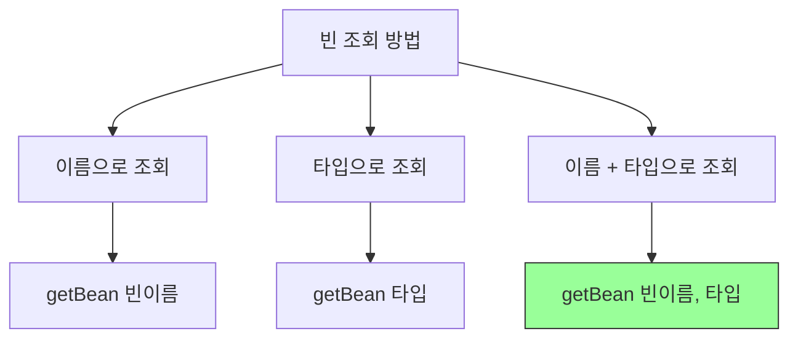
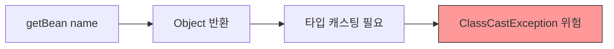
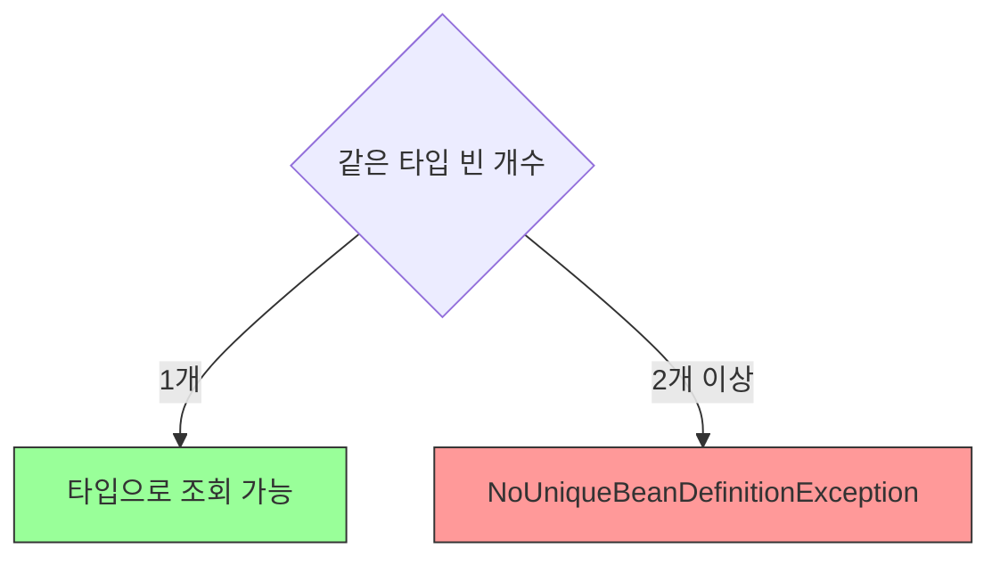
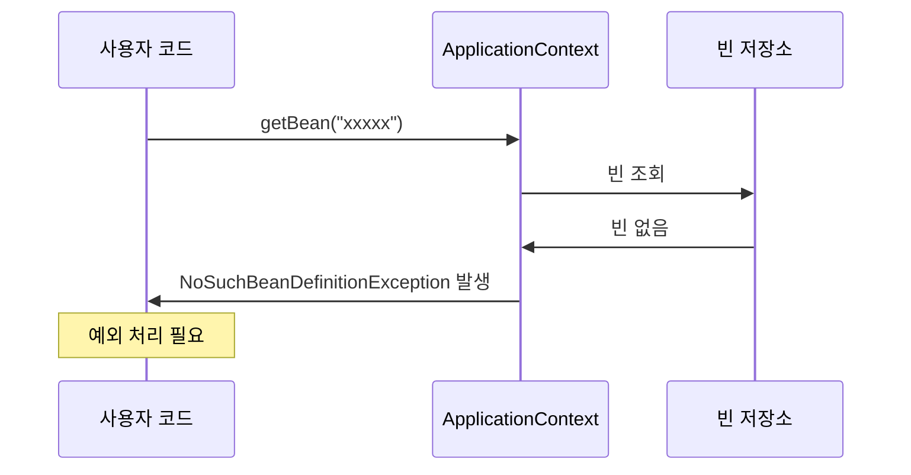
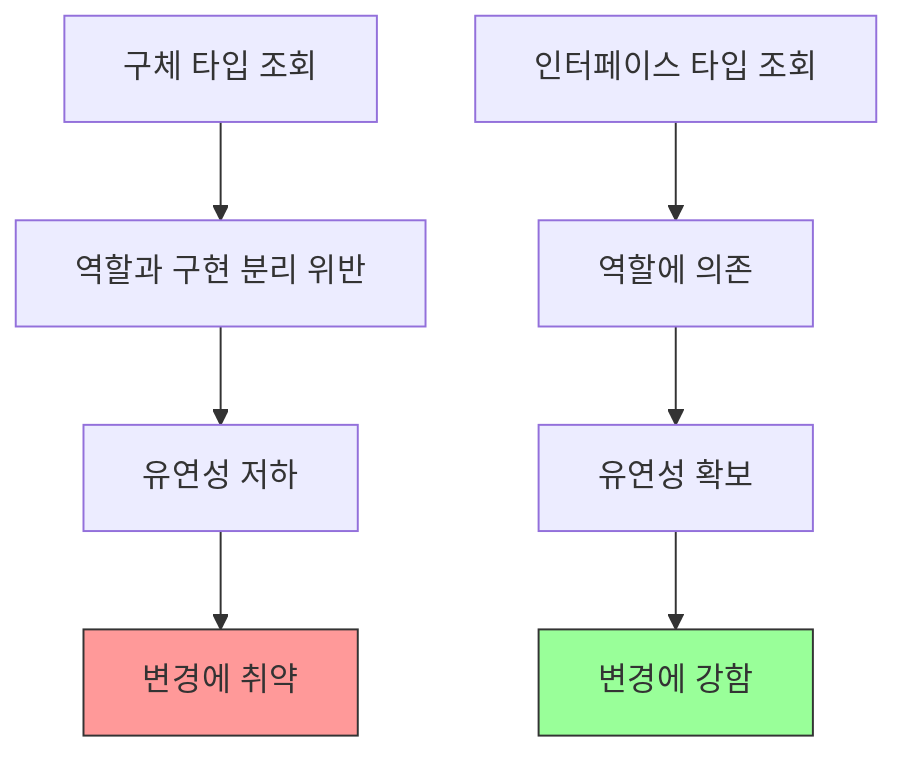
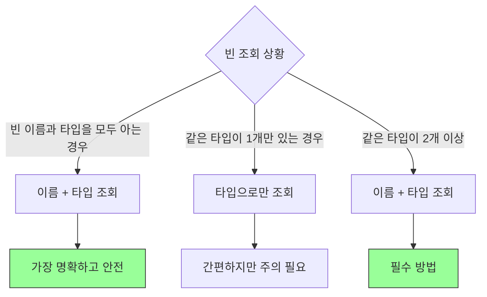
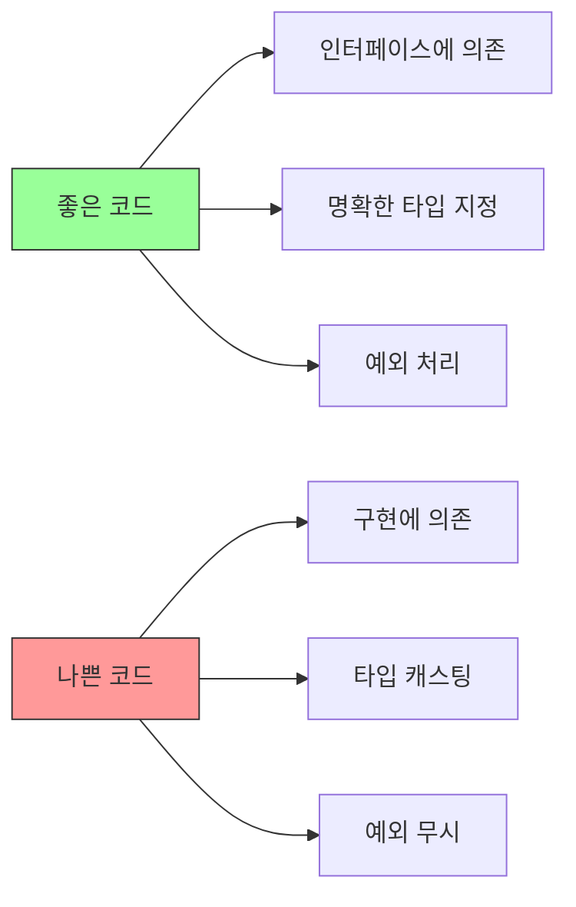

# 4-3. 스프링 빈 조회 - 기본

## 목차
1. [빈 조회 방법 개요](#빈-조회-방법-개요)
2. [빈 이름으로 조회](#빈-이름으로-조회)
3. [타입으로 조회](#타입으로-조회)
4. [빈이 없을 때 예외 처리](#빈이-없을-때-예외-처리)
5. [구체 타입으로 조회](#구체-타입으로-조회)
6. [실습 코드](#실습-코드)
7. [핵심 정리](#핵심-정리)

---

## 빈 조회 방법 개요

스프링 컨테이너에서 빈을 조회하는 가장 기본적인 방법들을 학습합니다.

### 기본 조회 메서드



### ApplicationContext의 주요 조회 메서드

```java
// 1. 빈 이름으로 조회
Object getBean(String name);

// 2. 빈 이름 + 타입으로 조회 (권장)
<T> T getBean(String name, Class<T> requiredType);

// 3. 타입으로만 조회
<T> T getBean(Class<T> requiredType);

// 4. 빈 존재 여부 확인
boolean containsBean(String name);
```

---

## 빈 이름으로 조회

### 기본 사용법

```java
ApplicationContext ac =
    new AnnotationConfigApplicationContext(AppConfig.class);

// 빈 이름으로 조회 (Object로 반환)
Object memberService = ac.getBean("memberService");

// 타입 캐스팅 필요
MemberService castedService = (MemberService) memberService;
```

### 문제점



**문제:**
- Object 타입으로 반환되어 타입 캐스팅 필요
- 컴파일 시점에 타입 체크 불가
- ClassCastException 발생 가능

---

## 타입으로 조회

### 이름 + 타입으로 조회 (권장)

```java
// 가장 안전하고 명확한 방법
MemberService memberService =
    ac.getBean("memberService", MemberService.class);
```

**장점:**


### 타입으로만 조회

```java
// 타입으로만 조회 (같은 타입이 하나만 있을 때)
MemberService memberService =
    ac.getBean(MemberService.class);
```

**사용 시나리오:**


---

## 빈이 없을 때 예외 처리

### NoSuchBeanDefinitionException

```java
// 존재하지 않는 빈 조회
assertThrows(NoSuchBeanDefinitionException.class, () -> {
    ac.getBean("xxxxx", MemberService.class);
});
```

**예외 발생 시나리오:**



### 예외 메시지 분석

```
org.springframework.beans.factory.NoSuchBeanDefinitionException:
No bean named 'xxxxx' available
```

**메시지 의미:**
- `NoSuchBeanDefinitionException`: 빈 정의를 찾을 수 없음
- `No bean named 'xxxxx' available`: 'xxxxx'라는 이름의 빈이 없음

---

## 구체 타입으로 조회

### 인터페이스 vs 구체 클래스

```java
@Configuration
class TestConfig {
    @Bean
    public MemberService memberService() {
        return new MemberServiceImpl();  // 구체 클래스 반환
    }
}
```

**조회 방법 비교:**

```java
// 1. 인터페이스 타입으로 조회 (권장)
MemberService memberService =
    ac.getBean("memberService", MemberService.class);

// 2. 구체 클래스 타입으로 조회 (비권장)
MemberServiceImpl memberServiceImpl =
    ac.getBean("memberService", MemberServiceImpl.class);
```

### 구체 타입 조회의 문제점



**비권장 이유:**
1. **역할과 구현을 분리하는 객체지향 원칙 위반**
2. **구현에 의존하게 되어 유연성 저하**
3. **구현체 변경 시 코드 수정 필요**

**예시:**
```java
// ❌ 나쁜 예: 구체 타입에 의존
MemberServiceImpl service =
    ac.getBean("memberService", MemberServiceImpl.class);
// MemberServiceImpl이 변경되면 이 코드도 수정해야 함

// ✅ 좋은 예: 인터페이스에 의존
MemberService service =
    ac.getBean("memberService", MemberService.class);
// 구현체가 바뀌어도 이 코드는 변경 불필요
```

---

## 실습 코드

### 테스트 설정 클래스

```java
package hello.core.beanfind;

import hello.core.AppConfig;
import hello.core.member.MemberService;
import hello.core.member.MemberServiceImpl;
import org.junit.jupiter.api.DisplayName;
import org.junit.jupiter.api.Test;
import org.springframework.beans.factory.NoSuchBeanDefinitionException;
import org.springframework.context.annotation.AnnotationConfigApplicationContext;

import static org.assertj.core.api.Assertions.*;
import static org.junit.jupiter.api.Assertions.*;

class ApplicationContextBasicFindTest {

    AnnotationConfigApplicationContext ac =
        new AnnotationConfigApplicationContext(AppConfig.class);

    @Test
    @DisplayName("빈 이름으로 조회")
    void findBeanByName() {
        MemberService memberService =
            ac.getBean("memberService", MemberService.class);

        System.out.println("memberService = " + memberService);
        System.out.println("memberService.getClass() = " +
                          memberService.getClass());

        // 검증
        assertThat(memberService).isInstanceOf(MemberServiceImpl.class);
    }

    @Test
    @DisplayName("이름 없이 타입으로만 조회")
    void findBeanByType() {
        MemberService memberService =
            ac.getBean(MemberService.class);

        System.out.println("memberService = " + memberService);

        // 검증
        assertThat(memberService).isInstanceOf(MemberServiceImpl.class);
    }

    @Test
    @DisplayName("구체 타입으로 조회")
    void findBeanByName2() {
        // 구체 타입으로 조회 가능하지만 권장하지 않음
        MemberServiceImpl memberService =
            ac.getBean("memberService", MemberServiceImpl.class);

        System.out.println("memberService = " + memberService);

        // 검증
        assertThat(memberService).isInstanceOf(MemberServiceImpl.class);
    }

    @Test
    @DisplayName("빈 이름으로 조회X")
    void findBeanByNameX() {
        // 예외 발생 검증
        assertThrows(NoSuchBeanDefinitionException.class, () -> {
            ac.getBean("xxxxx", MemberService.class);
        });
    }

    @Test
    @DisplayName("빈 존재 여부 확인")
    void containsBean() {
        boolean result1 = ac.containsBean("memberService");
        boolean result2 = ac.containsBean("xxxxx");

        System.out.println("memberService 존재: " + result1);
        System.out.println("xxxxx 존재: " + result2);

        // 검증
        assertThat(result1).isTrue();
        assertThat(result2).isFalse();
    }
}
```

**실행 결과:**
```
memberService = hello.core.member.MemberServiceImpl@...
memberService.getClass() = class hello.core.member.MemberServiceImpl

memberService 존재: true
xxxxx 존재: false
```

### 다양한 조회 방법 비교

```java
@Test
@DisplayName("빈 조회 방법 비교")
void compareFindMethods() {
    // 1. 이름만으로 조회 (Object 반환)
    Object bean1 = ac.getBean("memberService");
    System.out.println("1. bean1 타입: " + bean1.getClass().getSimpleName());

    // 2. 이름 + 타입으로 조회 (권장)
    MemberService bean2 =
        ac.getBean("memberService", MemberService.class);
    System.out.println("2. bean2 타입: " + bean2.getClass().getSimpleName());

    // 3. 타입으로만 조회
    MemberService bean3 = ac.getBean(MemberService.class);
    System.out.println("3. bean3 타입: " + bean3.getClass().getSimpleName());

    // 4. 구체 타입으로 조회 (비권장)
    MemberServiceImpl bean4 =
        ac.getBean("memberService", MemberServiceImpl.class);
    System.out.println("4. bean4 타입: " + bean4.getClass().getSimpleName());

    // 모두 같은 객체 (싱글톤)
    assertThat(bean1).isSameAs(bean2);
    assertThat(bean2).isSameAs(bean3);
    assertThat(bean3).isSameAs(bean4);
}
```

**실행 결과:**
```
1. bean1 타입: MemberServiceImpl
2. bean2 타입: MemberServiceImpl
3. bean3 타입: MemberServiceImpl
4. bean4 타입: MemberServiceImpl

모든 빈이 동일한 객체입니다 (싱글톤)
```

### 예외 처리 상세 테스트

```java
@Test
@DisplayName("예외 메시지 확인")
void exceptionMessage() {
    NoSuchBeanDefinitionException exception =
        assertThrows(NoSuchBeanDefinitionException.class, () -> {
            ac.getBean("notExist", MemberService.class);
        });

    String message = exception.getMessage();
    System.out.println("예외 메시지: " + message);

    // 예외 메시지에 빈 이름이 포함되어 있는지 검증
    assertThat(message).contains("notExist");
    assertThat(message).contains("No bean named");
}

@Test
@DisplayName("타입이 맞지 않을 때")
void wrongType() {
    assertThrows(Exception.class, () -> {
        // memberService는 MemberService 타입인데
        // OrderService 타입으로 조회 시도
        ac.getBean("memberService", OrderService.class);
    });
}
```

---

## 핵심 정리

### 1. 빈 조회 방법 정리

```java
// ✅ 권장: 이름 + 타입으로 조회
MemberService service = ac.getBean("memberService", MemberService.class);

// ⚠️ 주의: 타입만으로 조회 (같은 타입이 2개 이상이면 오류)
MemberService service = ac.getBean(MemberService.class);

// ❌ 비권장: 이름만으로 조회 (Object 반환)
Object service = ac.getBean("memberService");

// ❌ 비권장: 구체 타입으로 조회 (유연성 저하)
MemberServiceImpl service = ac.getBean("memberService", MemberServiceImpl.class);
```

### 2. 조회 방법 선택 가이드



### 3. 주요 예외

| 예외 | 발생 시점 | 해결 방법 |
|------|-----------|-----------|
| **NoSuchBeanDefinitionException** | 존재하지 않는 빈 조회 | 빈 이름 확인, containsBean()으로 사전 체크 |
| **NoUniqueBeanDefinitionException** | 같은 타입 빈이 2개 이상 (다음 장) | 빈 이름 명시, @Qualifier 사용 |

### 4. 실무 활용 패턴

**안전한 빈 조회:**
```java
public MemberService getMemberService(ApplicationContext ac) {
    if (ac.containsBean("memberService")) {
        return ac.getBean("memberService", MemberService.class);
    }
    throw new IllegalStateException("memberService 빈이 없습니다.");
}
```

**Optional 패턴:**
```java
public Optional<MemberService> findMemberService(ApplicationContext ac) {
    try {
        return Optional.of(ac.getBean(MemberService.class));
    } catch (NoSuchBeanDefinitionException e) {
        return Optional.empty();
    }
}
```

### 5. 조회 메서드 비교표

| 메서드 | 반환 타입 | 장점 | 단점 | 추천도 |
|--------|-----------|------|------|--------|
| `getBean(name)` | Object | 간단 | 캐스팅 필요 | ❌ |
| `getBean(name, type)` | T | 타입 안전, 명확 | 없음 | ✅ |
| `getBean(type)` | T | 간편 | 중복 시 오류 | ⚠️ |
| `getBean(name, 구체타입)` | 구체타입 | 구체 타입 명시 | 유연성 저하 | ❌ |

### 6. 코드 작성 원칙



**좋은 예:**
```java
// 인터페이스 타입 사용
MemberService service = ac.getBean("memberService", MemberService.class);

// 예외 처리
if (ac.containsBean("memberService")) {
    MemberService service =
        ac.getBean("memberService", MemberService.class);
}
```

**나쁜 예:**
```java
// 구체 타입 사용
MemberServiceImpl service =
    ac.getBean("memberService", MemberServiceImpl.class);

// 타입 캐스팅
Object obj = ac.getBean("memberService");
MemberService service = (MemberService) obj;
```

### 7. 핵심 포인트

1. **빈 조회는 `getBean(이름, 타입)`이 가장 안전하고 명확**
2. **항상 인터페이스 타입으로 조회**
3. **예외 처리를 통한 안전한 코드 작성**
4. **싱글톤 패턴: 같은 이름의 빈은 항상 같은 객체**

```java
// 핵심 원칙
MemberService service1 = ac.getBean("memberService", MemberService.class);
MemberService service2 = ac.getBean("memberService", MemberService.class);

// 항상 true (싱글톤)
assertThat(service1).isSameAs(service2);
```

---

## 다음 학습 주제

- 스프링 빈 조회 - 동일한 타입이 둘 이상
- NoUniqueBeanDefinitionException 처리
- 특정 타입의 모든 빈 조회
- @Qualifier, @Primary 활용
