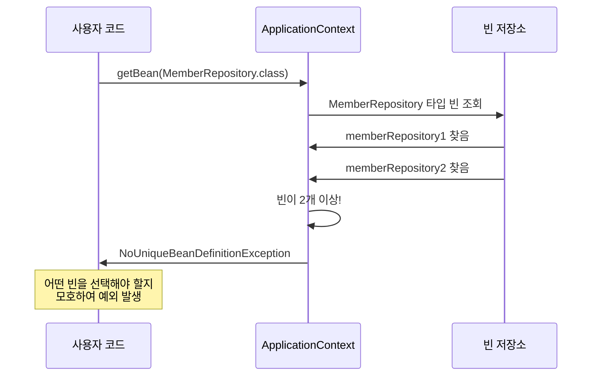
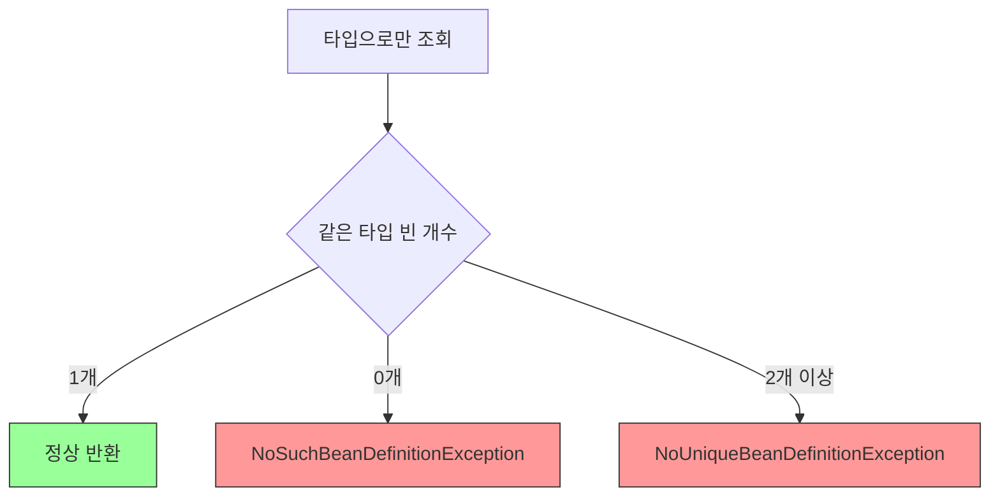
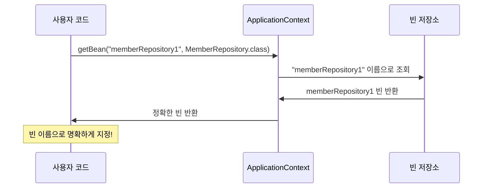
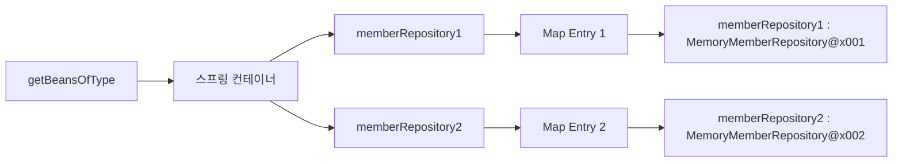
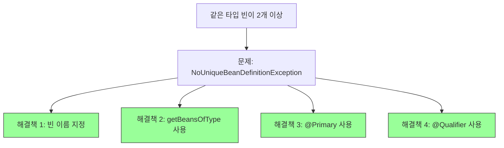

# 4-4. 스프링 빈 조회 - 동일한 타입이 둘 이상

## 목차
1. [문제 상황](#문제-상황)
2. [NoUniqueBeanDefinitionException](#nouniquebeanDefinitionexception)
3. [해결 방법 1: 빈 이름 지정](#해결-방법-1-빈-이름-지정)
4. [해결 방법 2: 특정 타입 모두 조회](#해결-방법-2-특정-타입-모두-조회)
5. [실무 패턴](#실무-패턴)
6. [실습 코드](#실습-코드)
7. [핵심 정리](#핵심-정리)

---

## 문제 상황

타입으로 조회할 때 같은 타입의 스프링 빈이 둘 이상이면 오류가 발생합니다.

### 문제 시나리오

```java
@Configuration
static class SameBeanConfig {

    @Bean
    public MemberRepository memberRepository1() {
        return new MemoryMemberRepository();
    }

    @Bean
    public MemberRepository memberRepository2() {
        return new MemoryMemberRepository();
    }
}
```

**빈 등록 상태:**
```mermaid
graph TB
    subgraph "스프링 컨테이너"
    A[memberRepository1] --> C[MemoryMemberRepository@x001]
    B[memberRepository2] --> D[MemoryMemberRepository@x002]
    end

    style C fill:#ff9,stroke:#333
    style D fill:#ff9,stroke:#333
```

### 문제 발생

```java
// 타입으로만 조회 시도
MemberRepository bean = ac.getBean(MemberRepository.class);
// ❌ NoUniqueBeanDefinitionException 발생!
```

---

## NoUniqueBeanDefinitionException

### 예외 발생 과정



### 예외 메시지 분석

```
org.springframework.beans.factory.NoUniqueBeanDefinitionException:
No qualifying bean of type 'hello.core.member.MemberRepository' available:
expected single matching bean but found 2: memberRepository1, memberRepository2
```

**메시지 구성:**
1. `NoUniqueBeanDefinitionException`: 유일하지 않은 빈 정의
2. `expected single matching bean`: 1개의 빈을 기대했는데
3. `but found 2`: 2개를 발견함
4. `memberRepository1, memberRepository2`: 발견된 빈 이름들

### 예외가 발생하는 이유



**왜 오류가 발생할까?**
- 스프링은 어떤 빈을 반환해야 할지 판단할 수 없음
- 개발자가 명확하게 지정하지 않으면 모호함(ambiguous)
- 예상치 못한 빈이 주입될 위험 방지

---

## 해결 방법 1: 빈 이름 지정

### 기본 해결책

```java
// ✅ 빈 이름을 명시하여 조회
MemberRepository memberRepository =
    ac.getBean("memberRepository1", MemberRepository.class);
```

**동작 과정:**


### 예제 코드

```java
@Test
@DisplayName("타입으로 조회시 같은 타입이 둘 이상 있으면, 빈 이름을 지정하면 된다")
void findBeanByName() {
    MemberRepository memberRepository1 =
        ac.getBean("memberRepository1", MemberRepository.class);

    MemberRepository memberRepository2 =
        ac.getBean("memberRepository2", MemberRepository.class);

    // 검증
    assertThat(memberRepository1).isInstanceOf(MemberRepository.class);
    assertThat(memberRepository2).isInstanceOf(MemberRepository.class);

    // 두 빈은 다른 객체
    assertThat(memberRepository1).isNotSameAs(memberRepository2);
}
```

---

## 해결 방법 2: 특정 타입 모두 조회

### getBeansOfType() 메서드

```java
// 특정 타입의 모든 빈을 Map으로 조회
Map<String, MemberRepository> beansOfType =
    ac.getBeansOfType(MemberRepository.class);
```

**반환값:**
- Key: 빈 이름 (String)
- Value: 빈 객체 (지정한 타입)

### 동작 방식



### 사용 예제

```java
@Test
@DisplayName("특정 타입을 모두 조회하기")
void findAllBeanByType() {
    Map<String, MemberRepository> beansOfType =
        ac.getBeansOfType(MemberRepository.class);

    // 빈 개수 확인
    System.out.println("beansOfType.size() = " + beansOfType.size());

    // 모든 빈 출력
    for (String key : beansOfType.keySet()) {
        System.out.println("key = " + key +
                         ", value = " + beansOfType.get(key));
    }

    // 검증
    assertThat(beansOfType.size()).isEqualTo(2);
    assertThat(beansOfType).containsKeys(
        "memberRepository1",
        "memberRepository2"
    );
}
```

**실행 결과:**
```
beansOfType.size() = 2
key = memberRepository1, value = hello.core.member.MemoryMemberRepository@...
key = memberRepository2, value = hello.core.member.MemoryMemberRepository@...
```

---

## 실무 패턴

### 패턴 1: 특정 빈 선택

```java
public class BeanSelector {

    private final ApplicationContext ac;

    public MemberRepository selectRepository(String repositoryName) {
        return ac.getBean(repositoryName, MemberRepository.class);
    }

    // 기본 리포지토리 선택
    public MemberRepository getDefaultRepository() {
        return ac.getBean("memberRepository1", MemberRepository.class);
    }
}
```

### 패턴 2: 모든 빈 활용

```java
public class MultiRepositoryService {

    private final List<MemberRepository> repositories;

    public MultiRepositoryService(ApplicationContext ac) {
        // 모든 MemberRepository 빈을 리스트로 수집
        Map<String, MemberRepository> beansOfType =
            ac.getBeansOfType(MemberRepository.class);
        this.repositories = new ArrayList<>(beansOfType.values());
    }

    // 모든 리포지토리에 저장
    public void saveToAll(Member member) {
        for (MemberRepository repository : repositories) {
            repository.save(member);
        }
    }

    // 모든 리포지토리에서 조회 시도
    public Member findFromAny(Long memberId) {
        for (MemberRepository repository : repositories) {
            Member member = repository.findById(memberId);
            if (member != null) {
                return member;
            }
        }
        return null;
    }
}
```

### 패턴 3: 우선순위 빈 선택

```java
@Configuration
public class RepositoryConfig {

    @Bean
    @Primary  // 우선순위 지정
    public MemberRepository primaryRepository() {
        return new MemoryMemberRepository();
    }

    @Bean
    public MemberRepository secondaryRepository() {
        return new MemoryMemberRepository();
    }
}

// 사용
MemberRepository repository = ac.getBean(MemberRepository.class);
// primaryRepository가 주입됨
```

**@Primary 동작:**
```mermaid
graph TB
    A[getBean MemberRepository.class] --> B{빈 개수 확인}
    B -->|2개 이상| C{@Primary 있나?}
    C -->|있음| D[@Primary 빈 반환]
    C -->|없음| E[NoUniqueBeanDefinitionException]

    style D fill:#9f9,stroke:#333
    style E fill:#f99,stroke:#333
```

### 패턴 4: @Qualifier 사용

```java
@Configuration
public class RepositoryConfig {

    @Bean
    @Qualifier("mainRepository")
    public MemberRepository memberRepository1() {
        return new MemoryMemberRepository();
    }

    @Bean
    @Qualifier("subRepository")
    public MemberRepository memberRepository2() {
        return new MemoryMemberRepository();
    }
}

// 사용 (의존성 주입 시)
@Service
public class MemberService {

    private final MemberRepository memberRepository;

    @Autowired
    public MemberService(@Qualifier("mainRepository")
                        MemberRepository memberRepository) {
        this.memberRepository = memberRepository;
    }
}
```

---

## 실습 코드

### 완전한 테스트 클래스

```java
package hello.core.beanfind;

import hello.core.member.MemberRepository;
import hello.core.member.MemoryMemberRepository;
import org.junit.jupiter.api.DisplayName;
import org.junit.jupiter.api.Test;
import org.springframework.beans.factory.NoUniqueBeanDefinitionException;
import org.springframework.context.annotation.AnnotationConfigApplicationContext;
import org.springframework.context.annotation.Bean;
import org.springframework.context.annotation.Configuration;

import java.util.Map;

import static org.assertj.core.api.Assertions.*;
import static org.junit.jupiter.api.Assertions.*;

class ApplicationContextSameBeanFindTest {

    AnnotationConfigApplicationContext ac =
        new AnnotationConfigApplicationContext(SameBeanConfig.class);

    @Test
    @DisplayName("타입으로 조회시 같은 타입이 둘 이상 있으면, 중복 오류가 발생한다")
    void findBeanByTypeDuplicate() {
        // 예외 발생 검증
        assertThrows(NoUniqueBeanDefinitionException.class, () -> {
            ac.getBean(MemberRepository.class);
        });
    }

    @Test
    @DisplayName("타입으로 조회시 같은 타입이 둘 이상 있으면, 빈 이름을 지정하면 된다")
    void findBeanByName() {
        MemberRepository memberRepository =
            ac.getBean("memberRepository1", MemberRepository.class);

        assertThat(memberRepository).isInstanceOf(MemberRepository.class);
    }

    @Test
    @DisplayName("특정 타입을 모두 조회하기")
    void findAllBeanByType() {
        Map<String, MemberRepository> beansOfType =
            ac.getBeansOfType(MemberRepository.class);

        System.out.println("=== MemberRepository 타입의 모든 빈 ===");
        for (String key : beansOfType.keySet()) {
            System.out.println("key = " + key +
                             ", value = " + beansOfType.get(key));
        }

        System.out.println("beansOfType = " + beansOfType);
        System.out.println("beansOfType.size() = " + beansOfType.size());

        assertThat(beansOfType.size()).isEqualTo(2);
    }

    @Test
    @DisplayName("빈 이름으로 각각 조회")
    void findEachBean() {
        MemberRepository repo1 =
            ac.getBean("memberRepository1", MemberRepository.class);
        MemberRepository repo2 =
            ac.getBean("memberRepository2", MemberRepository.class);

        System.out.println("repo1 = " + repo1);
        System.out.println("repo2 = " + repo2);

        // 다른 인스턴스 검증
        assertThat(repo1).isNotSameAs(repo2);

        // 같은 타입 검증
        assertThat(repo1).isInstanceOf(MemberRepository.class);
        assertThat(repo2).isInstanceOf(MemberRepository.class);
    }

    @Configuration
    static class SameBeanConfig {

        @Bean
        public MemberRepository memberRepository1() {
            return new MemoryMemberRepository();
        }

        @Bean
        public MemberRepository memberRepository2() {
            return new MemoryMemberRepository();
        }
    }
}
```

### Map 활용 테스트

```java
@Test
@DisplayName("Map으로 조회한 빈 활용하기")
void useBeansMap() {
    Map<String, MemberRepository> beansOfType =
        ac.getBeansOfType(MemberRepository.class);

    // 1. 빈 이름 출력
    System.out.println("=== 빈 이름 목록 ===");
    beansOfType.keySet().forEach(System.out::println);

    // 2. 빈 객체 출력
    System.out.println("\n=== 빈 객체 목록 ===");
    beansOfType.values().forEach(System.out::println);

    // 3. Entry 출력
    System.out.println("\n=== Entry 목록 ===");
    beansOfType.forEach((key, value) -> {
        System.out.println(key + " -> " + value);
    });

    // 4. 특정 빈 접근
    MemberRepository repo = beansOfType.get("memberRepository1");
    assertThat(repo).isNotNull();
}
```

---

## 핵심 정리

### 1. 문제와 해결책



### 2. 조회 방법 비교

| 상황 | 방법 | 코드 | 결과 |
|------|------|------|------|
| 빈 1개 | 타입으로 조회 | `getBean(Type.class)` | ✅ 성공 |
| 빈 2개 이상 | 타입으로 조회 | `getBean(Type.class)` | ❌ 예외 |
| 빈 2개 이상 | 이름 + 타입 | `getBean(name, Type.class)` | ✅ 성공 |
| 빈 2개 이상 | 전체 조회 | `getBeansOfType(Type.class)` | ✅ Map 반환 |

### 3. 핵심 메서드

```java
// 1. 단일 빈 조회 (빈 이름 지정)
T getBean(String name, Class<T> requiredType);

// 2. 특정 타입의 모든 빈 조회
Map<String, T> getBeansOfType(Class<T> type);

// 반환되는 Map 구조
// Key: 빈 이름
// Value: 빈 객체
```

### 4. 실무 권장사항

**✅ 권장하는 방법:**
```java
// 1. 빈 이름을 명확하게 지정
MemberRepository repo =
    ac.getBean("memberRepository1", MemberRepository.class);

// 2. @Primary로 우선순위 지정
@Bean
@Primary
public MemberRepository memberRepository() { ... }

// 3. getBeansOfType으로 모두 조회하여 원하는 것 선택
Map<String, MemberRepository> beans = ac.getBeansOfType(MemberRepository.class);
MemberRepository repo = beans.get("memberRepository1");
```

**❌ 비권장 방법:**
```java
// 타입만으로 조회 (같은 타입이 여러 개일 때)
MemberRepository repo = ac.getBean(MemberRepository.class);
// NoUniqueBeanDefinitionException 발생!
```

### 5. 의존성 주입 시 해결 방법

```java
// 방법 1: @Primary 사용
@Configuration
class Config {
    @Bean
    @Primary
    MemberRepository mainRepository() { ... }

    @Bean
    MemberRepository subRepository() { ... }
}

// 방법 2: @Qualifier 사용
@Autowired
public Service(@Qualifier("mainRepository")
               MemberRepository repository) {
    this.repository = repository;
}

// 방법 3: 빈 이름으로 매칭
@Autowired
private MemberRepository mainRepository;  // 빈 이름과 변수명 일치
```

### 6. getBeansOfType 활용 패턴

```java
// 패턴 1: 모든 빈 순회
Map<String, MemberRepository> beans = ac.getBeansOfType(MemberRepository.class);
beans.values().forEach(repo -> {
    // 각 빈에 대한 처리
});

// 패턴 2: 조건에 맞는 빈 선택
Map<String, MemberRepository> beans = ac.getBeansOfType(MemberRepository.class);
MemberRepository selected = beans.values().stream()
    .filter(repo -> /* 조건 */)
    .findFirst()
    .orElseThrow();

// 패턴 3: 빈 개수 확인
Map<String, MemberRepository> beans = ac.getBeansOfType(MemberRepository.class);
if (beans.size() > 1) {
    // 여러 개일 때 처리
}
```

### 7. 예외 처리 패턴

```java
public MemberRepository getRepository(ApplicationContext ac, String beanName) {
    try {
        // 타입으로만 조회 시도
        return ac.getBean(MemberRepository.class);
    } catch (NoUniqueBeanDefinitionException e) {
        // 여러 개일 때 빈 이름으로 조회
        return ac.getBean(beanName, MemberRepository.class);
    } catch (NoSuchBeanDefinitionException e) {
        // 빈이 없을 때 기본값 반환
        return new MemoryMemberRepository();
    }
}
```

### 8. 디버깅 팁

```java
// 같은 타입의 모든 빈 이름 출력
Map<String, MemberRepository> beans = ac.getBeansOfType(MemberRepository.class);
System.out.println("MemberRepository 타입 빈 목록:");
beans.keySet().forEach(System.out::println);

// 빈 개수 확인
System.out.println("빈 개수: " + beans.size());

// 각 빈의 클래스 타입 확인
beans.forEach((name, bean) -> {
    System.out.println(name + " : " + bean.getClass().getName());
});
```

---

## 다음 학습 주제

- 스프링 빈 조회 - 상속 관계
- 부모 타입으로 조회 시 자식 빈도 함께 조회됨
- 더 복잡한 빈 조회 시나리오
