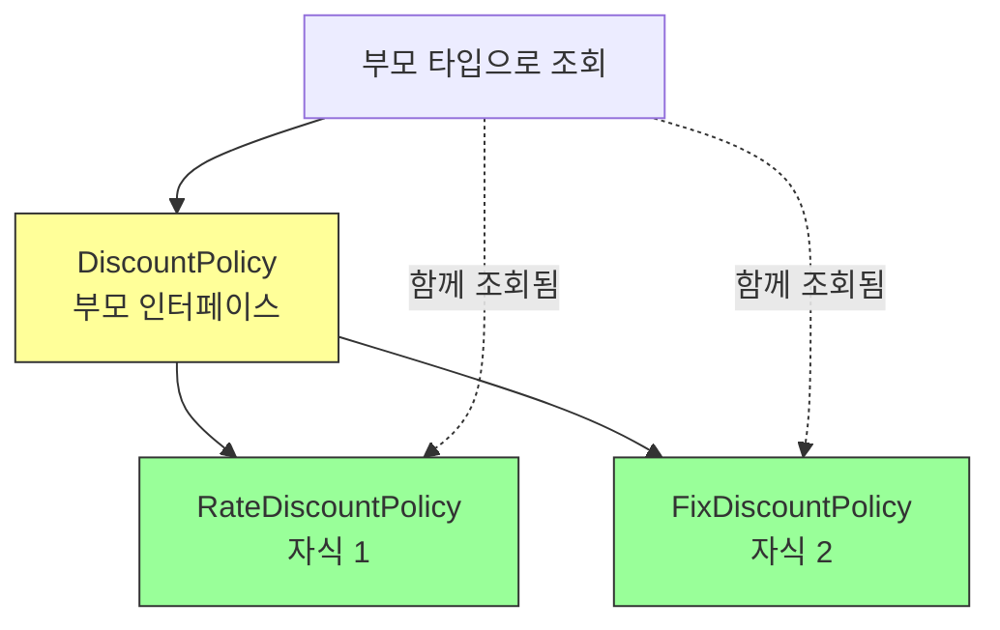
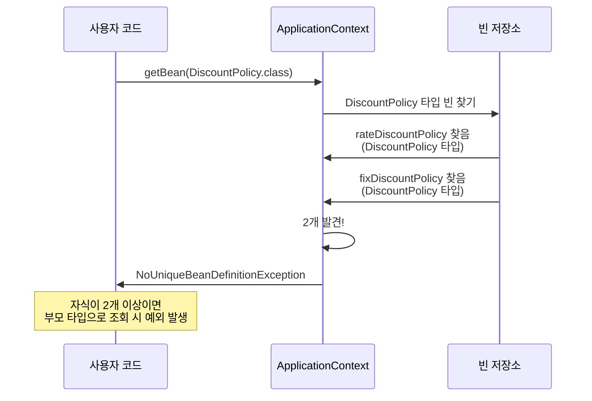
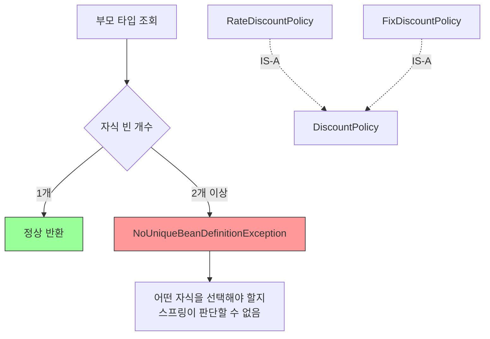
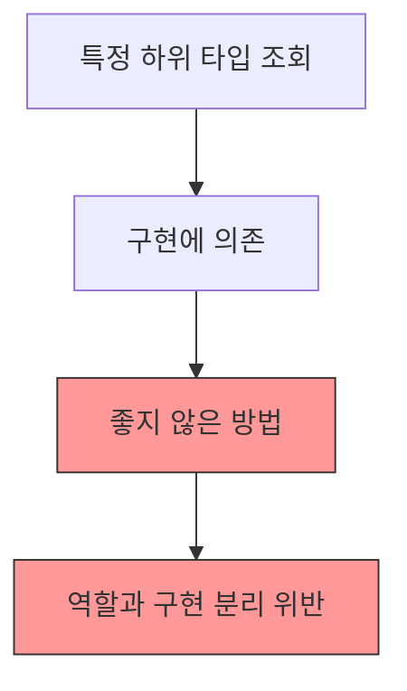
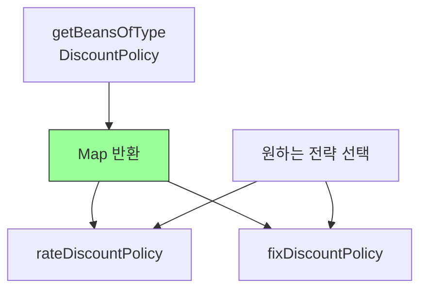
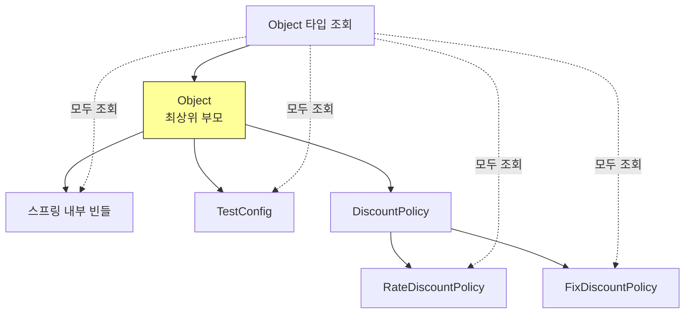
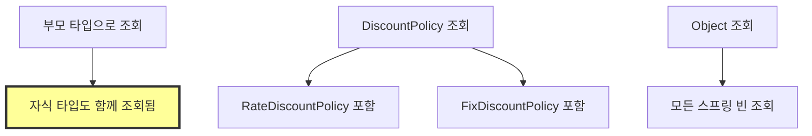
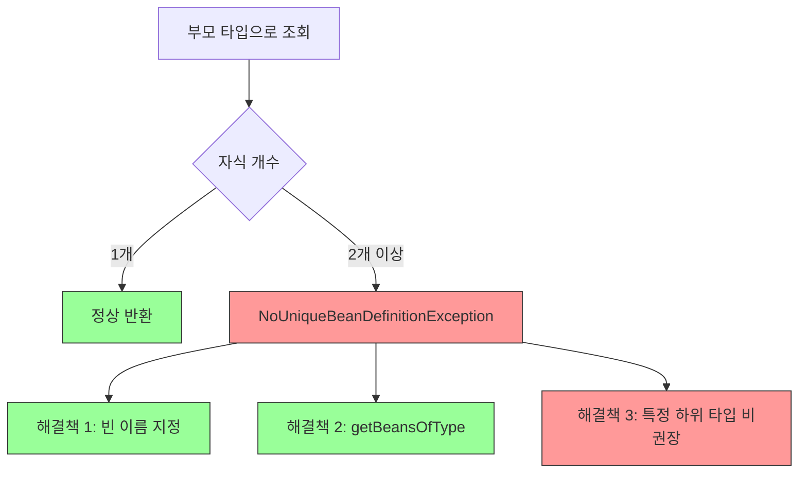
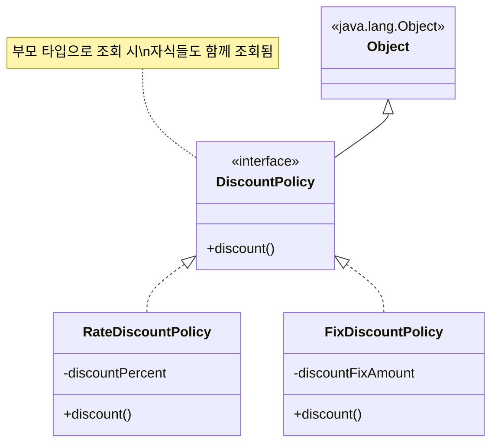
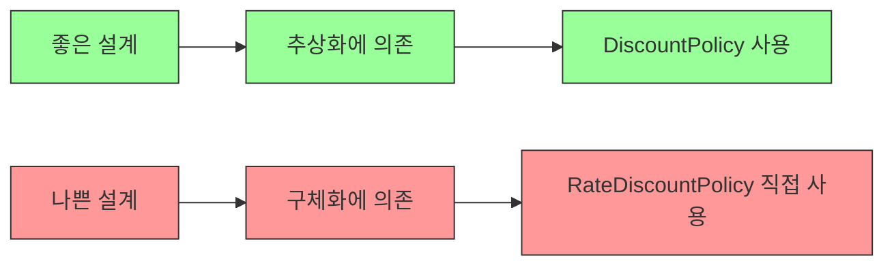

# 4-5. 스프링 빈 조회 - 상속 관계

## 목차
1. [상속 관계와 빈 조회](#상속-관계와-빈-조회)
2. [부모 타입으로 조회 시 동작](#부모-타입으로-조회-시-동작)
3. [자식이 둘 이상일 때 문제](#자식이-둘-이상일-때-문제)
4. [해결 방법](#해결-방법)
5. [Object 타입으로 조회](#object-타입으로-조회)
6. [실습 코드](#실습-코드)
7. [핵심 정리](#핵심-정리)

---

## 상속 관계와 빈 조회

### 핵심 원칙

**부모 타입으로 조회하면, 자식 타입도 함께 조회된다.**



### 왜 이런 동작을 할까?

```java
// 다형성의 원리
DiscountPolicy policy1 = new RateDiscountPolicy();   // 가능
DiscountPolicy policy2 = new FixDiscountPolicy();    // 가능

// 스프링도 동일한 원리 적용
// DiscountPolicy 타입으로 조회 시
// RateDiscountPolicy, FixDiscountPolicy 모두 해당됨
```

**객체지향 원칙:**
- 자식 클래스는 부모 클래스의 타입을 가짐
- IS-A 관계: RateDiscountPolicy IS A DiscountPolicy
- 스프링은 이를 존중하여 빈 조회에도 적용

---

## 부모 타입으로 조회 시 동작

### 테스트 설정

```java
@Configuration
static class TestConfig {

    @Bean
    public DiscountPolicy rateDiscountPolicy() {
        return new RateDiscountPolicy();
    }

    @Bean
    public DiscountPolicy fixDiscountPolicy() {
        return new FixDiscountPolicy();
    }
}
```

**빈 등록 상태:**
```mermaid
graph TB
    subgraph "스프링 컨테이너"
    A[rateDiscountPolicy<br/>빈 이름] --> B[RateDiscountPolicy@x001<br/>실제 객체]
    C[fixDiscountPolicy<br/>빈 이름] --> D[FixDiscountPolicy@x002<br/>실제 객체]
    end

    B -.타입.-> E[DiscountPolicy]
    D -.타입.-> E

    style E fill:#ff9,stroke:#333
```

### 조회 과정



---

## 자식이 둘 이상일 때 문제

### 예외 발생 시나리오

```java
@Test
@DisplayName("부모 타입으로 조회시, 자식이 둘 이상 있으면, 중복 오류가 발생한다")
void findBeanByParentTypeDuplicate() {
    assertThrows(NoUniqueBeanDefinitionException.class, () -> {
        ac.getBean(DiscountPolicy.class);
    });
}
```

**왜 오류가 발생할까?**



### 상속 구조 예시

```java
// 인터페이스 (부모)
public interface DiscountPolicy {
    int discount(Member member, int price);
}

// 구현체 1 (자식)
public class RateDiscountPolicy implements DiscountPolicy {
    private int discountPercent = 10;

    @Override
    public int discount(Member member, int price) {
        if (member.getGrade() == Grade.VIP) {
            return price * discountPercent / 100;
        }
        return 0;
    }
}

// 구현체 2 (자식)
public class FixDiscountPolicy implements DiscountPolicy {
    private int discountFixAmount = 1000;

    @Override
    public int discount(Member member, int price) {
        if (member.getGrade() == Grade.VIP) {
            return discountFixAmount;
        }
        return 0;
    }
}
```

---

## 해결 방법

### 방법 1: 빈 이름 지정

```java
@Test
@DisplayName("부모 타입으로 조회시, 자식이 둘 이상 있으면, 빈 이름을 지정하면 된다")
void findBeanByParentTypeBeanName() {
    DiscountPolicy rateDiscountPolicy =
        ac.getBean("rateDiscountPolicy", DiscountPolicy.class);

    assertThat(rateDiscountPolicy).isInstanceOf(RateDiscountPolicy.class);
}
```

**동작 방식:**


### 방법 2: 특정 하위 타입으로 조회

```java
@Test
@DisplayName("특정 하위 타입으로 조회")
void findBeanBySubType() {
    RateDiscountPolicy bean =
        ac.getBean(RateDiscountPolicy.class);

    assertThat(bean).isInstanceOf(RateDiscountPolicy.class);
}
```

**주의사항:**


**비권장 이유:**
- DIP(Dependency Inversion Principle) 위반
- 추상화에 의존해야지, 구체화에 의존하면 안됨
- 유연성 저하

### 방법 3: 부모 타입으로 모두 조회

```java
@Test
@DisplayName("부모 타입으로 모두 조회하기")
void findAllBeanByParentType() {
    Map<String, DiscountPolicy> beansOfType =
        ac.getBeansOfType(DiscountPolicy.class);

    assertThat(beansOfType.size()).isEqualTo(2);

    for (String key : beansOfType.keySet()) {
        System.out.println("key = " + key +
                         ", value = " + beansOfType.get(key));
    }
}
```

**실행 결과:**
```
key = rateDiscountPolicy, value = hello.core.discount.RateDiscountPolicy@...
key = fixDiscountPolicy, value = hello.core.discount.FixDiscountPolicy@...
```

**활용 시나리오:**


---

## Object 타입으로 조회

### 최상위 타입 조회

모든 자바 객체의 부모는 `Object`이므로, Object 타입으로 조회하면 **모든 스프링 빈**을 조회할 수 있습니다.

```java
@Test
@DisplayName("부모 타입으로 모두 조회하기 - Object")
void findAllBeanByObjectType() {
    Map<String, Object> beansOfType = ac.getBeansOfType(Object.class);

    for (String key : beansOfType.keySet()) {
        System.out.println("key = " + key +
                         ", value = " + beansOfType.get(key));
    }

    System.out.println("총 빈 개수: " + beansOfType.size());
}
```

**실행 결과:**
```
key = org.springframework.context.annotation.internalConfigurationAnnotationProcessor,
value = org.springframework.context.annotation.ConfigurationClassPostProcessor@...

key = org.springframework.context.annotation.internalAutowiredAnnotationProcessor,
value = org.springframework.beans.factory.annotation.AutowiredAnnotationBeanPostProcessor@...

key = org.springframework.context.event.internalEventListenerProcessor,
value = org.springframework.context.event.EventListenerMethodProcessor@...

key = org.springframework.context.event.internalEventListenerFactory,
value = org.springframework.context.event.DefaultEventListenerFactory@...

key = testConfig, value = hello.core.beanfind...TestConfig$$SpringCGLIB$$...

key = rateDiscountPolicy, value = hello.core.discount.RateDiscountPolicy@...

key = fixDiscountPolicy, value = hello.core.discount.FixDiscountPolicy@...

총 빈 개수: 7
```

### 상속 계층 구조



**Object 조회의 의미:**
- 모든 자바 객체는 Object를 상속
- 스프링 빈도 예외가 아님
- Object 타입으로 조회 = 모든 빈 조회

---

## 실습 코드

### 완전한 테스트 클래스

```java
package hello.core.beanfind;

import hello.core.discount.DiscountPolicy;
import hello.core.discount.FixDiscountPolicy;
import hello.core.discount.RateDiscountPolicy;
import org.junit.jupiter.api.DisplayName;
import org.junit.jupiter.api.Test;
import org.springframework.beans.factory.NoUniqueBeanDefinitionException;
import org.springframework.context.annotation.AnnotationConfigApplicationContext;
import org.springframework.context.annotation.Bean;
import org.springframework.context.annotation.Configuration;

import java.util.Map;

import static org.assertj.core.api.Assertions.*;
import static org.junit.jupiter.api.Assertions.*;

class ApplicationContextExtendsFindTest {

    AnnotationConfigApplicationContext ac =
        new AnnotationConfigApplicationContext(TestConfig.class);

    @Test
    @DisplayName("부모 타입으로 조회시, 자식이 둘 이상 있으면, 중복 오류가 발생한다")
    void findBeanByParentTypeDuplicate() {
        // DiscountPolicy 타입으로 조회
        assertThrows(NoUniqueBeanDefinitionException.class, () -> {
            DiscountPolicy bean = ac.getBean(DiscountPolicy.class);
        });
    }

    @Test
    @DisplayName("부모 타입으로 조회시, 자식이 둘 이상 있으면, 빈 이름을 지정하면 된다")
    void findBeanByParentTypeBeanName() {
        DiscountPolicy rateDiscountPolicy =
            ac.getBean("rateDiscountPolicy", DiscountPolicy.class);

        assertThat(rateDiscountPolicy).isInstanceOf(RateDiscountPolicy.class);
    }

    @Test
    @DisplayName("특정 하위 타입으로 조회")
    void findBeanBySubType() {
        RateDiscountPolicy bean = ac.getBean(RateDiscountPolicy.class);

        assertThat(bean).isInstanceOf(RateDiscountPolicy.class);
    }

    @Test
    @DisplayName("부모 타입으로 모두 조회하기")
    void findAllBeanByParentType() {
        Map<String, DiscountPolicy> beansOfType =
            ac.getBeansOfType(DiscountPolicy.class);

        assertThat(beansOfType.size()).isEqualTo(2);

        System.out.println("=== DiscountPolicy 타입의 모든 빈 ===");
        for (String key : beansOfType.keySet()) {
            System.out.println("key = " + key +
                             ", value = " + beansOfType.get(key));
        }
    }

    @Test
    @DisplayName("부모 타입으로 모두 조회하기 - Object")
    void findAllBeanByObjectType() {
        Map<String, Object> beansOfType = ac.getBeansOfType(Object.class);

        System.out.println("=== 모든 빈 (Object 타입 조회) ===");
        for (String key : beansOfType.keySet()) {
            System.out.println("key = " + key +
                             ", value = " + beansOfType.get(key));
        }

        System.out.println("총 빈 개수: " + beansOfType.size());
    }

    @Test
    @DisplayName("빈 이름으로 각각 조회")
    void findEachBean() {
        DiscountPolicy rate =
            ac.getBean("rateDiscountPolicy", DiscountPolicy.class);
        DiscountPolicy fix =
            ac.getBean("fixDiscountPolicy", DiscountPolicy.class);

        assertThat(rate).isInstanceOf(RateDiscountPolicy.class);
        assertThat(fix).isInstanceOf(FixDiscountPolicy.class);

        // 다른 객체 검증
        assertThat(rate).isNotSameAs(fix);
    }

    @Configuration
    static class TestConfig {

        @Bean
        public DiscountPolicy rateDiscountPolicy() {
            return new RateDiscountPolicy();
        }

        @Bean
        public DiscountPolicy fixDiscountPolicy() {
            return new FixDiscountPolicy();
        }
    }
}
```

### 상속 관계 시각화 테스트

```java
@Test
@DisplayName("빈의 타입 계층 구조 출력")
void printBeanTypeHierarchy() {
    Map<String, DiscountPolicy> beansOfType =
        ac.getBeansOfType(DiscountPolicy.class);

    System.out.println("=== 타입 계층 구조 ===");
    for (String key : beansOfType.keySet()) {
        Object bean = beansOfType.get(key);
        Class<?> beanClass = bean.getClass();

        System.out.println("\n빈 이름: " + key);
        System.out.println("  클래스: " + beanClass.getSimpleName());
        System.out.println("  인터페이스: " +
            Arrays.toString(beanClass.getInterfaces()));
        System.out.println("  슈퍼 클래스: " +
            beanClass.getSuperclass().getSimpleName());
    }
}
```

**실행 결과:**
```
=== 타입 계층 구조 ===

빈 이름: rateDiscountPolicy
  클래스: RateDiscountPolicy
  인터페이스: [interface hello.core.discount.DiscountPolicy]
  슈퍼 클래스: Object

빈 이름: fixDiscountPolicy
  클래스: FixDiscountPolicy
  인터페이스: [interface hello.core.discount.DiscountPolicy]
  슈퍼 클래스: Object
```

---

## 핵심 정리

### 1. 상속 관계의 핵심 원칙



**핵심:**
- 부모 타입으로 조회하면 자식 타입도 함께 조회된다
- 자바의 다형성이 스프링 빈 조회에도 적용됨
- Object로 조회하면 모든 빈이 조회됨

### 2. 조회 결과 비교

| 조회 타입 | 결과 | 비고 |
|-----------|------|------|
| RateDiscountPolicy | RateDiscountPolicy만 | 구체 타입 |
| FixDiscountPolicy | FixDiscountPolicy만 | 구체 타입 |
| DiscountPolicy | 둘 다 조회됨 | 부모 타입 |
| Object | 모든 빈 조회됨 | 최상위 타입 |

### 3. 문제 상황과 해결책



### 4. 권장 조회 방법

**✅ 권장:**
```java
// 1. 빈 이름 + 부모 타입 (가장 명확)
DiscountPolicy policy =
    ac.getBean("rateDiscountPolicy", DiscountPolicy.class);

// 2. 부모 타입으로 모두 조회 후 선택
Map<String, DiscountPolicy> beans =
    ac.getBeansOfType(DiscountPolicy.class);
DiscountPolicy policy = beans.get("rateDiscountPolicy");
```

**❌ 비권장:**
```java
// 구체 타입으로 조회 (구현에 의존)
RateDiscountPolicy policy = ac.getBean(RateDiscountPolicy.class);
```

### 5. 실무 활용 패턴

**패턴 1: 전략 패턴 구현**
```java
public class DiscountService {

    private final Map<String, DiscountPolicy> policyMap;

    public DiscountService(ApplicationContext ac) {
        this.policyMap = ac.getBeansOfType(DiscountPolicy.class);
    }

    public int discount(String policyName, Member member, int price) {
        DiscountPolicy policy = policyMap.get(policyName);
        return policy.discount(member, price);
    }
}
```

**패턴 2: 조건부 빈 선택**
```java
public DiscountPolicy selectPolicy(ApplicationContext ac, boolean useRate) {
    if (useRate) {
        return ac.getBean("rateDiscountPolicy", DiscountPolicy.class);
    } else {
        return ac.getBean("fixDiscountPolicy", DiscountPolicy.class);
    }
}
```

**패턴 3: 모든 구현체 적용**
```java
public int applyAllDiscounts(ApplicationContext ac,
                             Member member, int price) {
    Map<String, DiscountPolicy> policies =
        ac.getBeansOfType(DiscountPolicy.class);

    int totalDiscount = 0;
    for (DiscountPolicy policy : policies.values()) {
        totalDiscount += policy.discount(member, price);
    }
    return totalDiscount;
}
```

### 6. 상속 구조 이해



### 7. 주요 메서드 정리

```java
// 1. 단일 빈 조회 (부모 타입)
DiscountPolicy bean = ac.getBean(DiscountPolicy.class);
// 자식이 2개 이상이면 예외

// 2. 단일 빈 조회 (빈 이름 + 부모 타입)
DiscountPolicy bean =
    ac.getBean("rateDiscountPolicy", DiscountPolicy.class);
// 명확하게 지정

// 3. 특정 타입의 모든 빈 조회
Map<String, DiscountPolicy> beans =
    ac.getBeansOfType(DiscountPolicy.class);
// 부모 타입의 모든 자식 빈 조회

// 4. 모든 빈 조회
Map<String, Object> allBeans = ac.getBeansOfType(Object.class);
// 스프링 컨테이너의 모든 빈 조회
```

### 8. 객체지향 원칙



**DIP (Dependency Inversion Principle):**
- 고수준 모듈은 저수준 모듈에 의존하면 안됨
- 둘 다 추상화에 의존해야 함
- 인터페이스(DiscountPolicy)에 의존하는 것이 올바름

### 9. 디버깅 팁

```java
// 상속 관계 확인
@Test
void checkInheritance() {
    RateDiscountPolicy rate = new RateDiscountPolicy();
    FixDiscountPolicy fix = new FixDiscountPolicy();

    // 타입 체크
    System.out.println(rate instanceof DiscountPolicy);  // true
    System.out.println(fix instanceof DiscountPolicy);   // true
    System.out.println(rate instanceof Object);          // true

    // 부모 타입으로 조회 가능 확인
    Map<String, DiscountPolicy> beans =
        ac.getBeansOfType(DiscountPolicy.class);
    System.out.println("DiscountPolicy 타입 빈: " + beans.size());
}
```

---

## 다음 학습 주제

- BeanFactory와 ApplicationContext
- 스프링 컨테이너의 계층 구조
- ApplicationContext의 부가 기능
