# 4-6. BeanFactory와 ApplicationContext

## 목차
1. [BeanFactory란?](#beanfactory란)
2. [ApplicationContext란?](#applicationcontext란)
3. [계층 구조](#계층-구조)
4. [ApplicationContext의 부가 기능](#applicationcontext의-부가-기능)
5. [BeanFactory vs ApplicationContext](#beanfactory-vs-applicationcontext)
6. [실무에서의 선택](#실무에서의-선택)
7. [핵심 정리](#핵심-정리)

---

## BeanFactory란?

### 개념

**BeanFactory**는 스프링 컨테이너의 최상위 인터페이스입니다.

```java
public interface BeanFactory {
    Object getBean(String name) throws BeansException;
    <T> T getBean(String name, Class<T> requiredType) throws BeansException;
    <T> T getBean(Class<T> requiredType) throws BeansException;
    // ... 기타 빈 조회 메서드
}
```

### 주요 역할

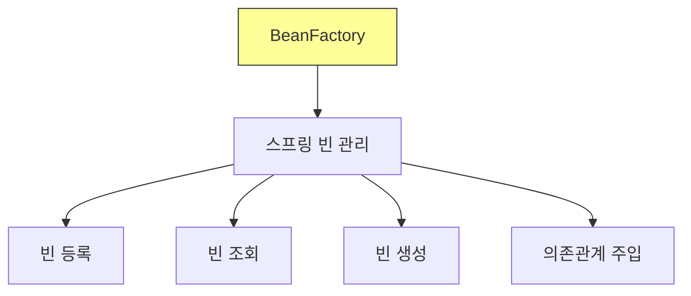

**핵심 기능:**
1. **빈 조회**: getBean() 메서드 제공
2. **빈 관리**: 빈의 생명주기 관리
3. **의존성 주입**: DI 기능 제공

### BeanFactory의 특징

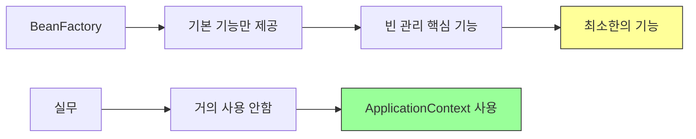

---

## ApplicationContext란?

### 개념

**ApplicationContext**는 BeanFactory의 기능을 모두 상속받아 제공하며, 수많은 부가 기능을 추가로 제공합니다.

```java
public interface ApplicationContext extends EnvironmentCapable,
                                            ListableBeanFactory,
                                            HierarchicalBeanFactory,
                                            MessageSource,
                                            ApplicationEventPublisher,
                                            ResourcePatternResolver {
    // BeanFactory의 모든 기능 + 부가 기능
}
```

### 역할

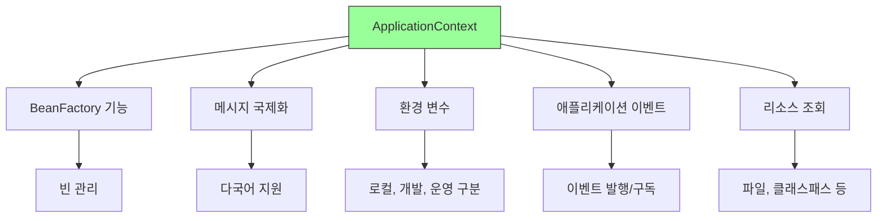

---

## 계층 구조

### 인터페이스 상속 구조

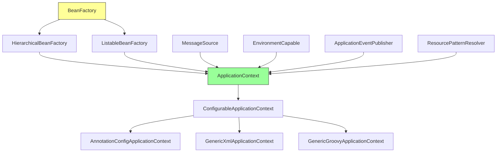

### 각 인터페이스의 역할

| 인터페이스 | 역할 | 주요 기능 |
|-----------|------|-----------|
| **BeanFactory** | 스프링 컨테이너 최상위 인터페이스 | 빈 조회, 관리 |
| **ListableBeanFactory** | 빈 목록 조회 | getBeanDefinitionNames() |
| **HierarchicalBeanFactory** | 계층 구조 지원 | 부모-자식 컨테이너 |
| **MessageSource** | 국제화 기능 | 메시지 다국어 처리 |
| **EnvironmentCapable** | 환경 변수 처리 | 로컬/개발/운영 환경 구분 |
| **ApplicationEventPublisher** | 이벤트 발행/구독 | 이벤트 기반 아키텍처 |
| **ResourcePatternResolver** | 리소스 조회 | 파일, 클래스패스 등 |

---

## ApplicationContext의 부가 기능

### 1. 메시지 소스를 활용한 국제화 기능 (MessageSource)

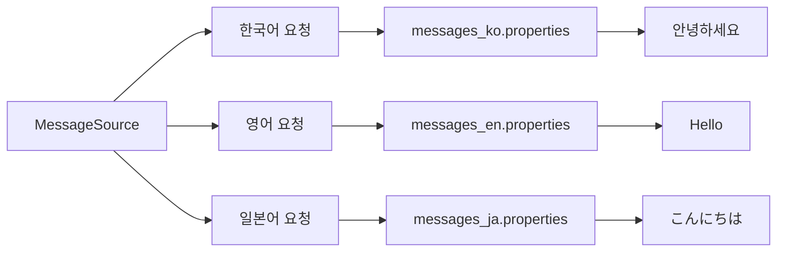

**사용 예시:**
```java
// messages.properties
greeting=안녕하세요
farewell=안녕히 가세요

// messages_en.properties
greeting=Hello
farewell=Goodbye

// 사용
public class MessageService {

    @Autowired
    private MessageSource messageSource;

    public void printMessage(Locale locale) {
        String greeting = messageSource.getMessage(
            "greeting", null, locale
        );
        System.out.println(greeting);
    }
}

// 출력
messageService.printMessage(Locale.KOREA);  // 안녕하세요
messageService.printMessage(Locale.ENGLISH); // Hello
```

### 2. 환경 변수 (EnvironmentCapable)

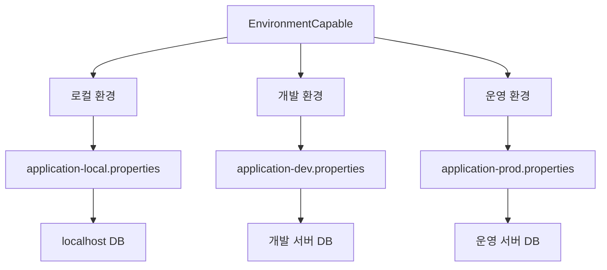

**사용 예시:**
```java
public class EnvironmentService {

    @Autowired
    private Environment env;

    public void printProfile() {
        String[] profiles = env.getActiveProfiles();
        System.out.println("Active profiles: " +
            Arrays.toString(profiles));

        // 환경별 설정 조회
        String dbUrl = env.getProperty("db.url");
        System.out.println("DB URL: " + dbUrl);
    }
}

// application-local.properties
db.url=jdbc:h2:mem:testdb

// application-prod.properties
db.url=jdbc:mysql://prod-server:3306/mydb
```

### 3. 애플리케이션 이벤트 (ApplicationEventPublisher)

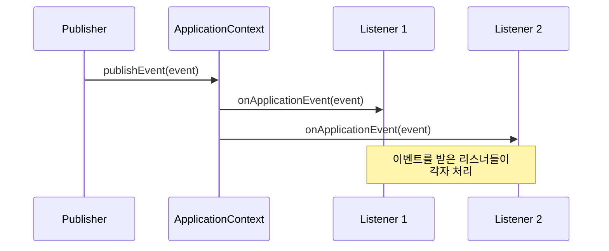

**사용 예시:**
```java
// 1. 이벤트 정의
public class MemberJoinEvent extends ApplicationEvent {
    private final Member member;

    public MemberJoinEvent(Object source, Member member) {
        super(source);
        this.member = member;
    }

    public Member getMember() {
        return member;
    }
}

// 2. 이벤트 발행
@Service
public class MemberService {

    @Autowired
    private ApplicationEventPublisher eventPublisher;

    public void join(Member member) {
        // 회원 가입 처리
        memberRepository.save(member);

        // 이벤트 발행
        eventPublisher.publishEvent(
            new MemberJoinEvent(this, member)
        );
    }
}

// 3. 이벤트 리스너
@Component
public class EmailListener {

    @EventListener
    public void handleMemberJoin(MemberJoinEvent event) {
        Member member = event.getMember();
        // 가입 환영 이메일 발송
        sendWelcomeEmail(member);
    }
}

@Component
public class PointListener {

    @EventListener
    public void handleMemberJoin(MemberJoinEvent event) {
        Member member = event.getMember();
        // 가입 축하 포인트 지급
        giveWelcomePoint(member);
    }
}
```

**이벤트 활용의 장점:**
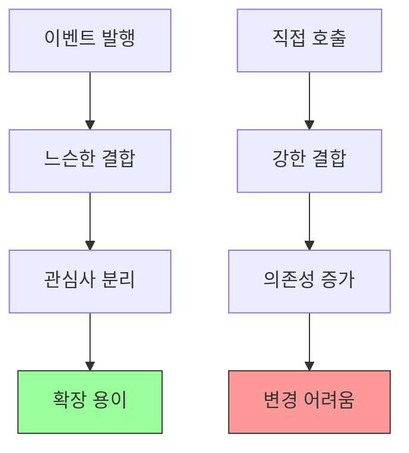

### 4. 편리한 리소스 조회 (ResourceLoader)

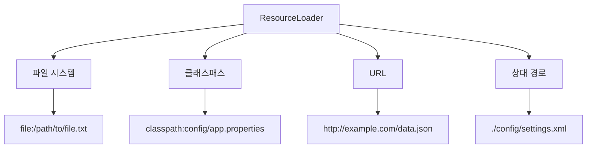

**사용 예시:**
```java
@Service
public class ResourceService {

    @Autowired
    private ResourceLoader resourceLoader;

    public void loadResource() throws IOException {
        // 1. 클래스패스 리소스
        Resource resource1 =
            resourceLoader.getResource("classpath:config.properties");

        // 2. 파일 시스템 리소스
        Resource resource2 =
            resourceLoader.getResource("file:/data/settings.xml");

        // 3. URL 리소스
        Resource resource3 =
            resourceLoader.getResource("http://example.com/api");

        // 리소스 읽기
        InputStream is = resource1.getInputStream();
        // ... 처리
    }
}

// 간편한 사용
@Value("classpath:data.txt")
private Resource dataFile;

public void processData() throws IOException {
    String content = new String(
        Files.readAllBytes(dataFile.getFile().toPath())
    );
    System.out.println(content);
}
```

---

## BeanFactory vs ApplicationContext

### 기능 비교

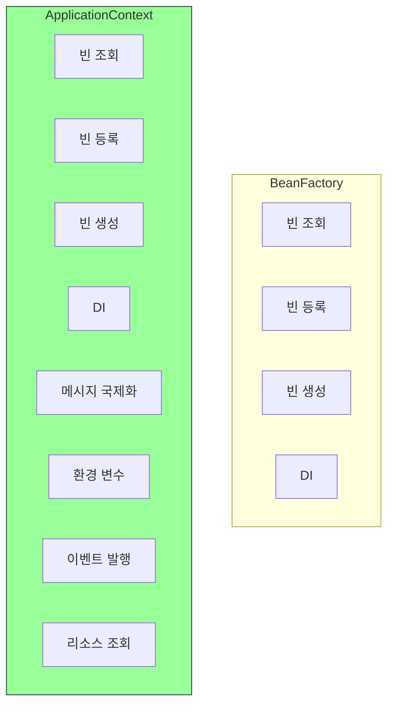

### 상세 비교표

| 구분 | BeanFactory | ApplicationContext |
|------|-------------|-------------------|
| **빈 관리** | ✅ 지원 | ✅ 지원 |
| **DI** | ✅ 지원 | ✅ 지원 |
| **메시지 국제화** | ❌ 미지원 | ✅ MessageSource |
| **환경 변수** | ❌ 미지원 | ✅ Environment |
| **이벤트** | ❌ 미지원 | ✅ ApplicationEventPublisher |
| **리소스 조회** | ❌ 미지원 | ✅ ResourceLoader |
| **빈 후처리** | 제한적 | ✅ BeanPostProcessor 자동 등록 |
| **사용 여부** | ❌ 거의 사용 안함 | ✅ 실무에서 사용 |

### 코드 비교

```java
// BeanFactory 사용 (비권장)
BeanFactory beanFactory =
    new XmlBeanFactory(new ClassPathResource("config.xml"));
MemberService service = beanFactory.getBean(MemberService.class);
// 기본적인 빈 조회만 가능

// ApplicationContext 사용 (권장)
ApplicationContext ac =
    new AnnotationConfigApplicationContext(AppConfig.class);
MemberService service = ac.getBean(MemberService.class);
// 빈 조회 + 국제화, 이벤트, 환경변수 등 모든 기능 사용 가능
```

---

## 실무에서의 선택

### 선택 기준

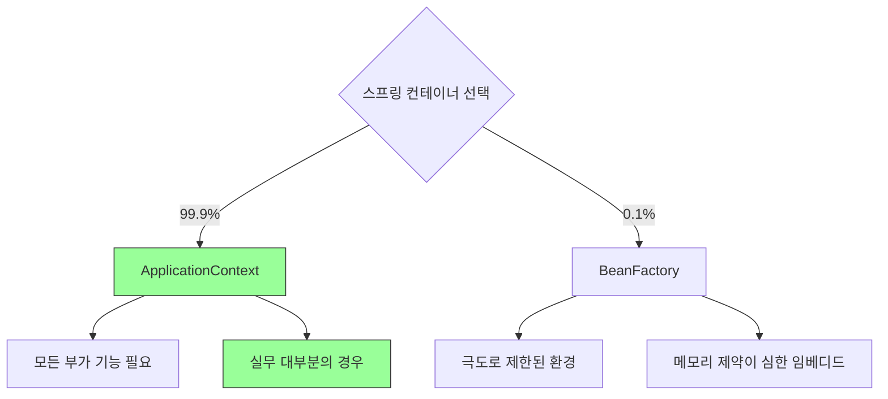

### 실무 권장사항

**✅ ApplicationContext를 사용해야 하는 이유:**

1. **부가 기능이 필수적**
   ```java
   // 국제화, 환경변수, 이벤트 등은 현대 애플리케이션의 필수 기능
   @Autowired
   private MessageSource messageSource;

   @Autowired
   private Environment environment;

   @Autowired
   private ApplicationEventPublisher eventPublisher;
   ```

2. **BeanFactory는 너무 로우 레벨**
   - 직접 사용할 일이 거의 없음
   - ApplicationContext가 더 편리하고 강력

3. **성능 차이 미미**
   - ApplicationContext의 부가 기능으로 인한 오버헤드는 매우 작음
   - 현대 서버 환경에서는 무시할 수 있는 수준

### 구현체 선택

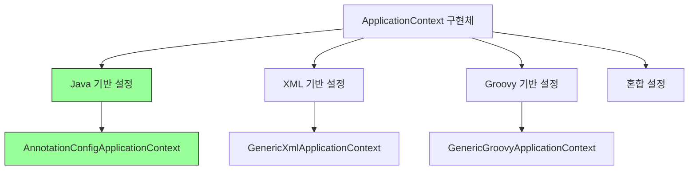

**권장 구현체:**
```java
// ✅ 가장 많이 사용 (Java 기반 설정)
ApplicationContext ac =
    new AnnotationConfigApplicationContext(AppConfig.class);

// ⚠️ 레거시 (XML 기반 설정)
ApplicationContext ac =
    new GenericXmlApplicationContext("appConfig.xml");

// ❌ 거의 사용 안함 (Groovy)
ApplicationContext ac =
    new GenericGroovyApplicationContext("appConfig.groovy");
```

---

## 핵심 정리

### 1. 관계 요약

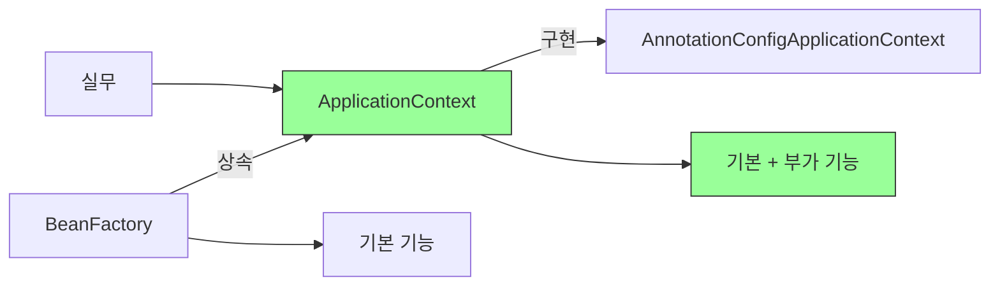

### 2. 핵심 개념

**BeanFactory:**
- 스프링 컨테이너의 최상위 인터페이스
- 빈 관리의 핵심 기능만 제공
- 실무에서는 거의 직접 사용하지 않음

**ApplicationContext:**
- BeanFactory를 상속받아 확장
- 빈 관리 + 수많은 부가 기능 제공
- 실무에서는 항상 ApplicationContext를 사용

### 3. ApplicationContext의 부가 기능

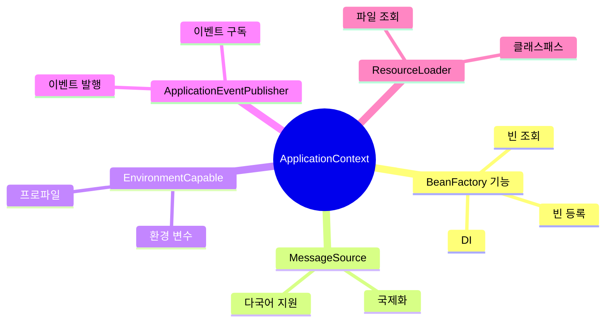

### 4. 실무 선택 가이드

| 상황 | 선택 | 이유 |
|------|------|------|
| 일반 애플리케이션 | ApplicationContext | 모든 기능 필요 |
| 웹 애플리케이션 | ApplicationContext | 필수 |
| 마이크로서비스 | ApplicationContext | 필수 |
| 극도로 제한된 환경 | BeanFactory | 메모리 최소화 |

### 5. 중요 포인트

**"ApplicationContext는 BeanFactory의 기능을 모두 상속받아서 제공한다."**

```java
// ApplicationContext는 BeanFactory의 자식
public interface ApplicationContext extends ...
                                            ListableBeanFactory,  // BeanFactory 계열
                                            HierarchicalBeanFactory, // BeanFactory 계열
                                            ... {
}

// 따라서 BeanFactory의 모든 메서드 사용 가능
ApplicationContext ac = ...;
Object bean = ac.getBean("beanName");  // BeanFactory의 메서드
```

### 6. 부가 기능 활용 예시

```java
@Service
public class ComprehensiveService {

    // 1. 빈 조회 (BeanFactory 기능)
    @Autowired
    private MemberRepository memberRepository;

    // 2. 국제화 (MessageSource)
    @Autowired
    private MessageSource messageSource;

    // 3. 환경 변수 (Environment)
    @Autowired
    private Environment environment;

    // 4. 이벤트 발행 (ApplicationEventPublisher)
    @Autowired
    private ApplicationEventPublisher eventPublisher;

    // 5. 리소스 조회 (ResourceLoader)
    @Value("classpath:data.txt")
    private Resource dataFile;

    public void doSomething() {
        // BeanFactory 기능
        Member member = memberRepository.findById(1L);

        // 국제화
        String message = messageSource.getMessage(
            "greeting", null, Locale.KOREA
        );

        // 환경 변수
        String profile = environment.getActiveProfiles()[0];

        // 이벤트 발행
        eventPublisher.publishEvent(new CustomEvent(this));

        // 리소스 읽기
        // ... dataFile 처리
    }
}
```

### 7. 정리

**핵심 원칙:**
```
BeanFactory < ApplicationContext

기본 기능 < 기본 + 부가 기능

실무에서는 ApplicationContext만 사용!
```

**이유:**
- ApplicationContext는 BeanFactory의 모든 기능 포함
- 국제화, 환경변수, 이벤트 등 현대 애플리케이션 필수 기능 제공
- 성능 오버헤드 거의 없음
- 더 편리하고 강력함

---

## 다음 학습 주제

- 다양한 설정 형식 지원 (Java, XML, Groovy)
- AnnotationConfigApplicationContext 상세
- GenericXmlApplicationContext 상세
- 설정 형식의 장단점
