# 4-7. 다양한 설정 형식 지원 - 자바 코드, XML

## 목차
1. [스프링의 설정 형식](#스프링의-설정-형식)
2. [애노테이션 기반 자바 코드 설정](#애노테이션-기반-자바-코드-설정)
3. [XML 기반 설정](#xml-기반-설정)
4. [두 방식 비교](#두-방식-비교)
5. [실습 코드](#실습-코드)
6. [핵심 정리](#핵심-정리)

---

## 스프링의 설정 형식

### 다양한 설정 방식 지원

스프링 컨테이너는 다양한 형식의 설정 정보를 받아들일 수 있습니다.

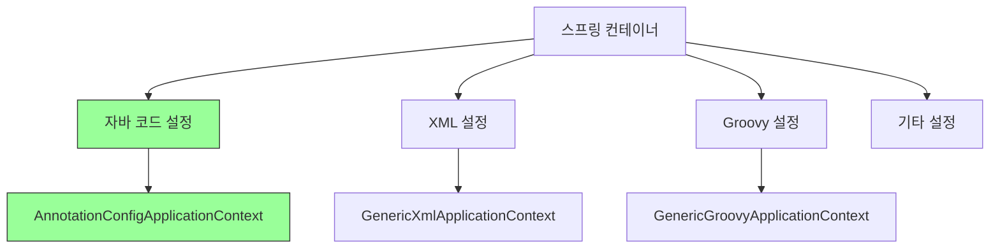

### BeanDefinition 추상화

스프링이 다양한 설정 형식을 지원할 수 있는 이유는 **BeanDefinition**이라는 추상화 덕분입니다.

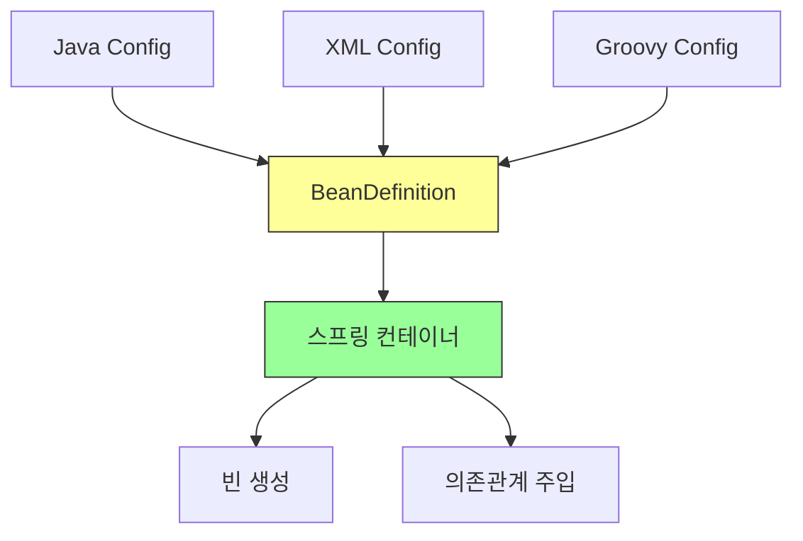

**핵심 원리:**
- 스프링 컨테이너는 BeanDefinition만 알면 됨
- 설정이 Java든 XML이든 상관없이 BeanDefinition으로 변환
- 역할과 구현을 나눈 좋은 예시

---

## 애노테이션 기반 자바 코드 설정

### 개념

**가장 최신이고 권장되는 방식**으로, Java 코드로 스프링 빈을 설정합니다.

### 기본 구조

```java
@Configuration
public class AppConfig {

    @Bean
    public MemberService memberService() {
        return new MemberServiceImpl(memberRepository());
    }

    @Bean
    public MemberRepository memberRepository() {
        return new MemoryMemberRepository();
    }

    @Bean
    public OrderService orderService() {
        return new OrderServiceImpl(
            memberRepository(),
            discountPolicy()
        );
    }

    @Bean
    public DiscountPolicy discountPolicy() {
        return new RateDiscountPolicy();
    }
}
```

### 컨테이너 생성

```java
ApplicationContext ac =
    new AnnotationConfigApplicationContext(AppConfig.class);
```

### 동작 원리

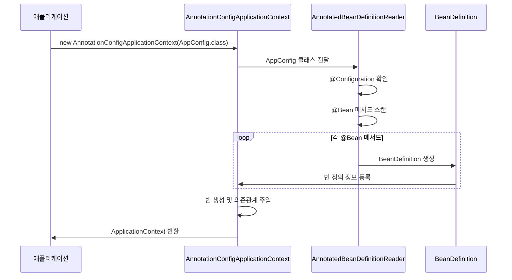

### 장점

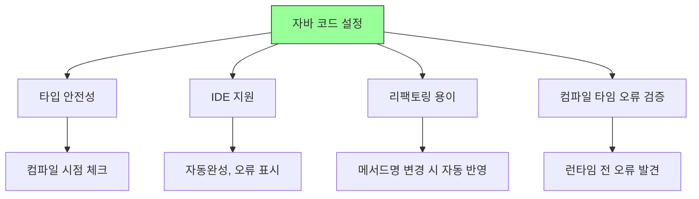

---

## XML 기반 설정

### 개념

**레거시 방식**으로, XML 파일로 스프링 빈을 설정합니다. 과거에 많이 사용되었으나 현재는 거의 사용하지 않습니다.

### 기본 구조

```xml
<?xml version="1.0" encoding="UTF-8"?>
<beans xmlns="http://www.springframework.org/schema/beans"
       xmlns:xsi="http://www.w3.org/2001/XMLSchema-instance"
       xsi:schemaLocation="http://www.springframework.org/schema/beans
           http://www.springframework.org/schema/beans/spring-beans.xsd">

    <!-- MemberService 빈 등록 -->
    <bean id="memberService" class="hello.core.member.MemberServiceImpl">
        <constructor-arg name="memberRepository" ref="memberRepository" />
    </bean>

    <!-- MemberRepository 빈 등록 -->
    <bean id="memberRepository" class="hello.core.member.MemoryMemberRepository" />

    <!-- OrderService 빈 등록 -->
    <bean id="orderService" class="hello.core.order.OrderServiceImpl">
        <constructor-arg name="memberRepository" ref="memberRepository" />
        <constructor-arg name="discountPolicy" ref="discountPolicy" />
    </bean>

    <!-- DiscountPolicy 빈 등록 -->
    <bean id="discountPolicy" class="hello.core.discount.RateDiscountPolicy" />

</beans>
```

### 컨테이너 생성

```java
ApplicationContext ac =
    new GenericXmlApplicationContext("appConfig.xml");
```

### XML 구조 설명

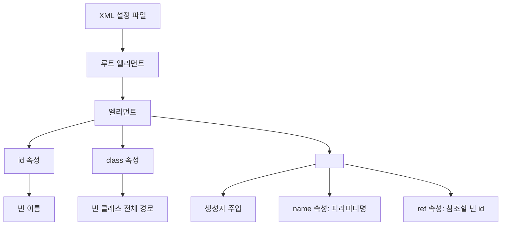

### XML 태그 설명

| 태그/속성 | 설명 | 예시 |
|-----------|------|------|
| `<beans>` | 루트 엘리먼트 | 모든 빈 정의를 포함 |
| `<bean>` | 빈 정의 | 하나의 스프링 빈 |
| `id` | 빈 이름 | `id="memberService"` |
| `class` | 빈 클래스 | `class="hello.core.member.MemberServiceImpl"` |
| `<constructor-arg>` | 생성자 인자 | 의존성 주입 |
| `name` | 파라미터 이름 | `name="memberRepository"` |
| `ref` | 참조할 빈 | `ref="memberRepository"` |

### 동작 원리

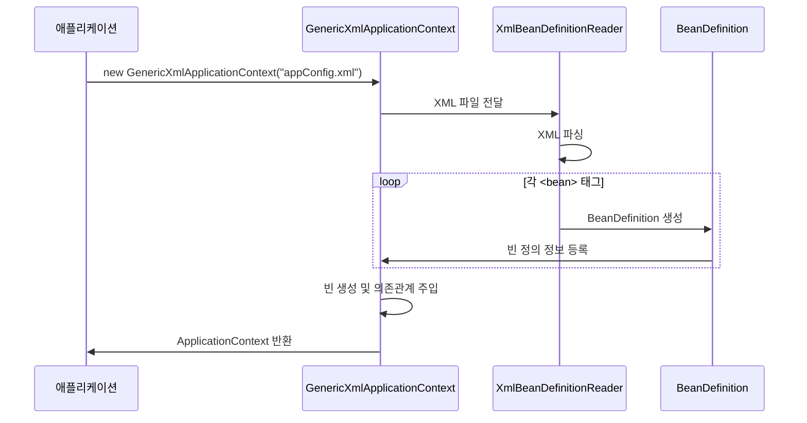

---

## 두 방식 비교

### Java Config vs XML

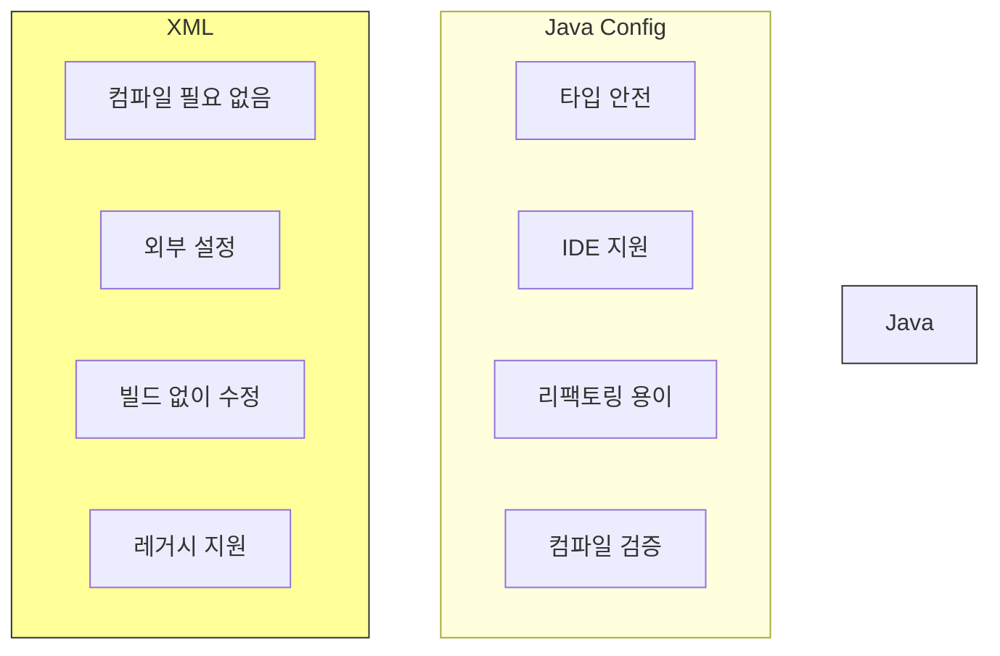

### 상세 비교표

| 항목 | Java Config | XML Config |
|------|-------------|------------|
| **타입 안전성** | ✅ 컴파일 타임 체크 | ❌ 런타임에 오류 발견 |
| **IDE 지원** | ✅ 자동완성, 리팩토링 | ⚠️ 제한적 |
| **가독성** | ✅ 자바 코드라 익숙 | ⚠️ XML 문법 필요 |
| **컴파일 필요** | ✅ 필요 (장점!) | ❌ 불필요 |
| **외부 설정** | ⚠️ 재컴파일 필요 | ✅ 즉시 변경 가능 |
| **최신성** | ✅ 스프링 최신 방식 | ❌ 레거시 방식 |
| **실무 사용** | ✅ 거의 모든 프로젝트 | ❌ 레거시 유지보수만 |

### 같은 설정 비교

**Java Config:**
```java
@Configuration
public class AppConfig {

    @Bean
    public MemberService memberService() {
        return new MemberServiceImpl(memberRepository());
    }

    @Bean
    public MemberRepository memberRepository() {
        return new MemoryMemberRepository();
    }
}
```

**XML Config:**
```xml
<beans>
    <bean id="memberService" class="hello.core.member.MemberServiceImpl">
        <constructor-arg name="memberRepository" ref="memberRepository" />
    </bean>

    <bean id="memberRepository"
          class="hello.core.member.MemoryMemberRepository" />
</beans>
```

**의미는 동일하지만 표현 방식이 다름!**

---

## 실습 코드

### Java Config 테스트

```java
package hello.core.xml;

import hello.core.member.MemberService;
import org.junit.jupiter.api.Test;
import org.springframework.context.ApplicationContext;
import org.springframework.context.annotation.AnnotationConfigApplicationContext;

import static org.assertj.core.api.Assertions.*;

public class JavaConfigTest {

    @Test
    void javaConfig() {
        ApplicationContext ac =
            new AnnotationConfigApplicationContext(AppConfig.class);

        MemberService memberService =
            ac.getBean("memberService", MemberService.class);

        assertThat(memberService).isInstanceOf(MemberService.class);
        System.out.println("memberService = " + memberService);
    }
}
```

### XML Config 테스트

**appConfig.xml:**
```xml
<?xml version="1.0" encoding="UTF-8"?>
<beans xmlns="http://www.springframework.org/schema/beans"
       xmlns:xsi="http://www.w3.org/2001/XMLSchema-instance"
       xsi:schemaLocation="http://www.springframework.org/schema/beans
           http://www.springframework.org/schema/beans/spring-beans.xsd">

    <bean id="memberService" class="hello.core.member.MemberServiceImpl">
        <constructor-arg name="memberRepository" ref="memberRepository" />
    </bean>

    <bean id="memberRepository"
          class="hello.core.member.MemoryMemberRepository" />

    <bean id="orderService" class="hello.core.order.OrderServiceImpl">
        <constructor-arg name="memberRepository" ref="memberRepository" />
        <constructor-arg name="discountPolicy" ref="discountPolicy" />
    </bean>

    <bean id="discountPolicy"
          class="hello.core.discount.RateDiscountPolicy" />

</beans>
```

**XmlAppContextTest.java:**
```java
package hello.core.xml;

import hello.core.member.MemberService;
import org.junit.jupiter.api.Test;
import org.springframework.context.ApplicationContext;
import org.springframework.context.support.GenericXmlApplicationContext;

import static org.assertj.core.api.Assertions.*;

public class XmlAppContextTest {

    @Test
    void xmlAppContext() {
        ApplicationContext ac =
            new GenericXmlApplicationContext("appConfig.xml");

        MemberService memberService =
            ac.getBean("memberService", MemberService.class);

        assertThat(memberService).isInstanceOf(MemberService.class);
        System.out.println("memberService = " + memberService);
    }
}
```

### 두 방식 비교 테스트

```java
@Test
@DisplayName("Java Config와 XML Config 결과 비교")
void compareConfigs() {
    // Java Config
    ApplicationContext javaAc =
        new AnnotationConfigApplicationContext(AppConfig.class);
    MemberService javaService =
        javaAc.getBean("memberService", MemberService.class);

    // XML Config
    ApplicationContext xmlAc =
        new GenericXmlApplicationContext("appConfig.xml");
    MemberService xmlService =
        xmlAc.getBean("memberService", MemberService.class);

    // 다른 컨테이너에서 생성된 다른 인스턴스
    assertThat(javaService).isNotSameAs(xmlService);

    // 하지만 같은 타입
    assertThat(javaService).isInstanceOf(MemberService.class);
    assertThat(xmlService).isInstanceOf(MemberService.class);

    System.out.println("Java Service: " + javaService);
    System.out.println("XML Service: " + xmlService);
}
```

### XML 다양한 주입 방식

```xml
<beans>
    <!-- 1. 생성자 주입 (constructor-arg) -->
    <bean id="memberService" class="hello.core.member.MemberServiceImpl">
        <constructor-arg name="memberRepository" ref="memberRepository" />
    </bean>

    <!-- 2. Setter 주입 (property) -->
    <bean id="orderService" class="hello.core.order.OrderServiceImpl">
        <property name="memberRepository" ref="memberRepository" />
        <property name="discountPolicy" ref="discountPolicy" />
    </bean>

    <!-- 3. 기본 타입 값 주입 -->
    <bean id="discountPolicy" class="hello.core.discount.RateDiscountPolicy">
        <constructor-arg name="discountPercent" value="10" />
    </bean>

    <!-- 4. 인덱스로 생성자 주입 -->
    <bean id="example" class="hello.core.Example">
        <constructor-arg index="0" ref="memberRepository" />
        <constructor-arg index="1" value="100" />
    </bean>
</beans>
```

---

## 핵심 정리

### 1. 설정 방식 선택

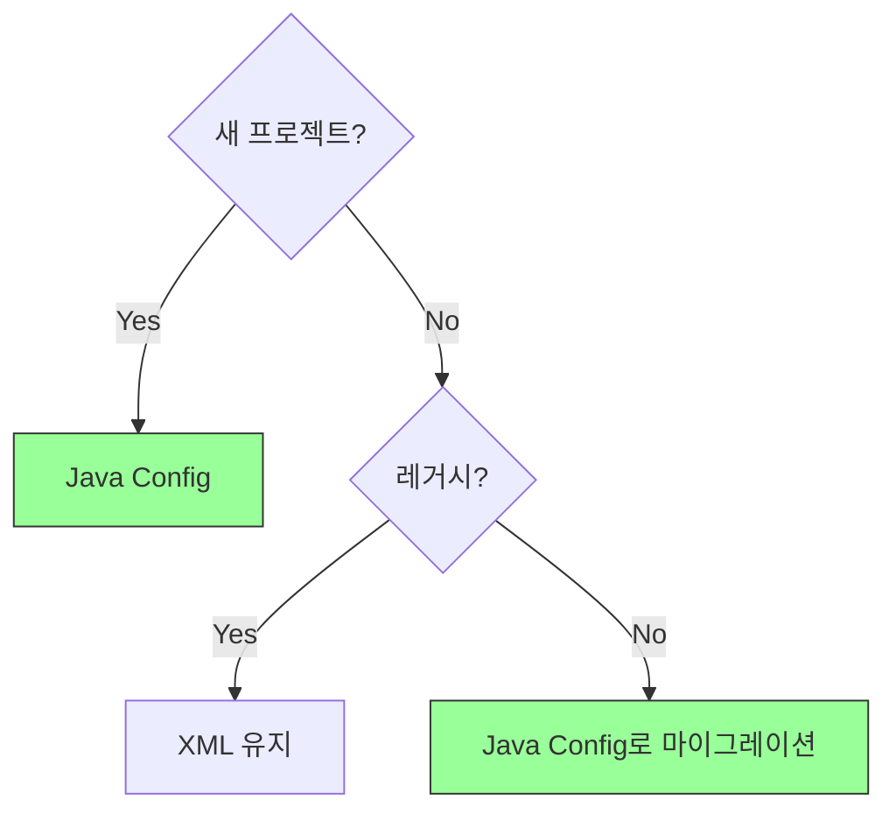

### 2. 핵심 차이점

**Java Config (권장):**
```java
@Configuration
public class AppConfig {
    @Bean
    public MemberService memberService() {
        return new MemberServiceImpl(memberRepository());
    }
}

// 사용
ApplicationContext ac =
    new AnnotationConfigApplicationContext(AppConfig.class);
```

**XML Config (레거시):**
```xml
<beans>
    <bean id="memberService" class="...MemberServiceImpl">
        <constructor-arg name="memberRepository" ref="memberRepository" />
    </bean>
</beans>

// 사용
ApplicationContext ac =
    new GenericXmlApplicationContext("appConfig.xml");
```

### 3. 왜 Java Config를 사용해야 하는가?

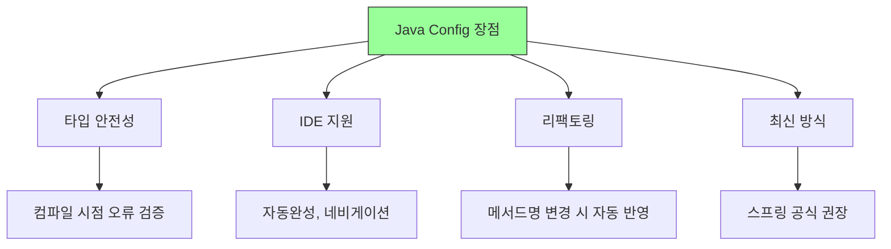

**구체적 예시:**

1. **타입 안전성:**
   ```java
   // ✅ Java: 컴파일 시점 체크
   @Bean
   public MemberService memberService() {
       return new MemberServiceImpl(memberRepository());
       // 타입이 맞지 않으면 컴파일 오류
   }

   // ❌ XML: 런타임에 오류 발견
   <bean id="memberService" class="hello.core.member.MemberServiceImpl">
       <constructor-arg name="memberRepository" ref="wrongBean" />
       <!-- 실행해봐야 오류 발견 -->
   </bean>
   ```

2. **IDE 지원:**
   ```java
   // ✅ Java: Ctrl+클릭으로 이동 가능
   return new MemberServiceImpl(memberRepository());

   // ❌ XML: 문자열이라 이동 불가
   <constructor-arg name="memberRepository" ref="memberRepository" />
   ```

3. **리팩토링:**
   ```java
   // ✅ Java: 메서드명 변경 시 자동 반영
   @Bean
   public MemberRepository memberRepository() { ... }
   // Refactor > Rename 시 모든 참조 자동 변경

   // ❌ XML: 수동으로 찾아서 변경해야 함
   <bean id="memberRepository" ... />
   <constructor-arg ref="memberRepository" />
   ```

### 4. BeanDefinition 추상화

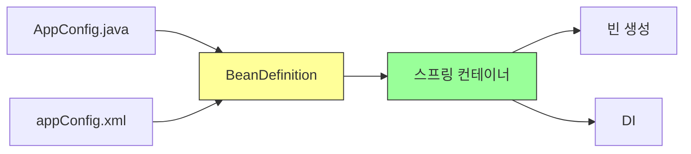

**핵심:**
- 스프링은 BeanDefinition만 알면 됨
- 설정 형식(Java, XML 등)과 무관
- 역할과 구현의 분리

### 5. 실무 권장사항

**✅ 권장:**
```java
// 최신 방식: Java Config + 애노테이션
@Configuration
public class AppConfig {
    @Bean
    public MemberService memberService() {
        return new MemberServiceImpl(memberRepository());
    }
}
```

**⚠️ 레거시 유지보수:**
```xml
<!-- 기존 프로젝트가 XML을 사용 중이라면 유지 -->
<beans>
    <bean id="memberService" class="...">
        ...
    </bean>
</beans>
```

**❌ 비권장:**
```java
// 새 프로젝트에서 XML 사용하지 말 것
```

### 6. 마이그레이션 전략

레거시 XML 프로젝트를 Java Config로 전환하는 방법:

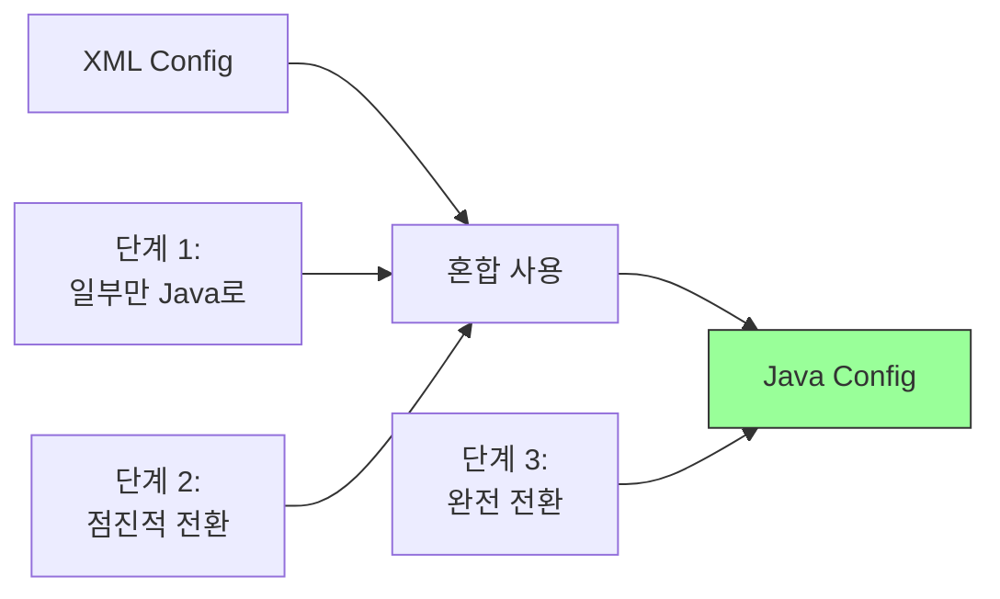

**혼합 사용 예시:**
```java
@Configuration
@ImportResource("classpath:appConfig.xml")  // XML도 함께 사용
public class AppConfig {

    @Bean
    public MemberService memberService() {
        return new MemberServiceImpl(memberRepository());
    }

    // XML에 정의된 빈도 사용 가능
}
```

### 7. 정리

| 구분 | Java Config | XML Config |
|------|-------------|------------|
| **권장도** | ✅ 강력 권장 | ❌ 비권장 (레거시만) |
| **사용 시점** | 새 프로젝트, 최신 프로젝트 | 레거시 유지보수 |
| **장점** | 타입 안전, IDE 지원, 리팩토링 | 외부 설정, 컴파일 불필요 |
| **단점** | 재컴파일 필요 | 타입 체크 없음, IDE 지원 약함 |

**결론:**
```
새 프로젝트 = Java Config
레거시 = XML 유지 or 점진적 마이그레이션
```

---

## 다음 학습 주제

- 스프링 빈 설정 메타 정보 - BeanDefinition
- BeanDefinition의 역할과 구조
- 설정 형식과 무관하게 동작하는 원리
