# 4-8. 스프링 빈 설정 메타 정보 - BeanDefinition

## 목차
1. [BeanDefinition이란?](#beandefinition이란)
2. [역할과 구현의 분리](#역할과-구현의-분리)
3. [BeanDefinition 정보](#beandefinition-정보)
4. [생성 과정](#생성-과정)
5. [실습 코드](#실습-코드)
6. [핵심 정리](#핵심-정리)

---

## BeanDefinition이란?

### 개념

**BeanDefinition**은 스프링 빈의 설정 메타데이터를 추상화한 인터페이스입니다.

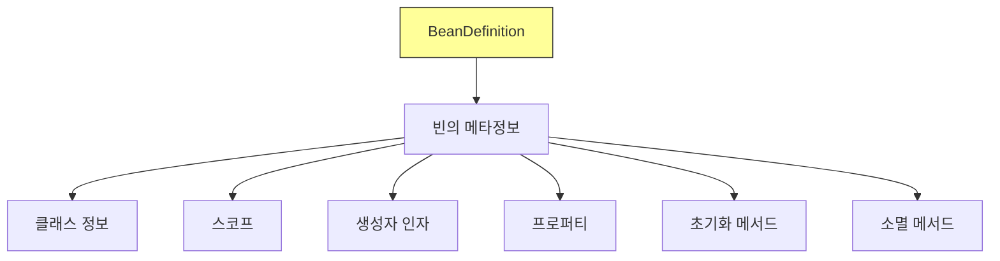

### 왜 필요한가?

스프링이 다양한 설정 형식(Java, XML, Groovy 등)을 지원할 수 있는 비밀이 바로 **BeanDefinition**입니다.

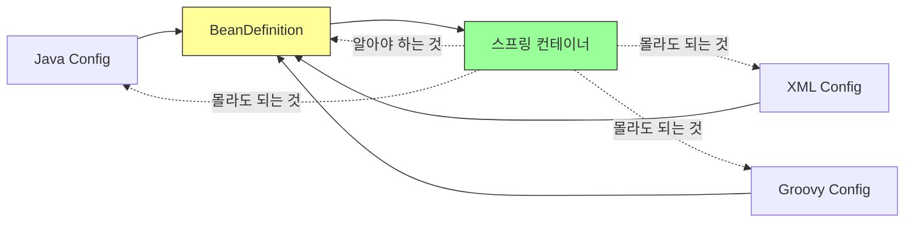

**핵심 원리:**
- 스프링 컨테이너는 **BeanDefinition만 의존**
- 설정 형식(Java, XML 등)은 **몰라도 됨**
- 각 설정 형식은 BeanDefinition으로 변환됨

---

## 역할과 구현의 분리

### 추상화의 이점

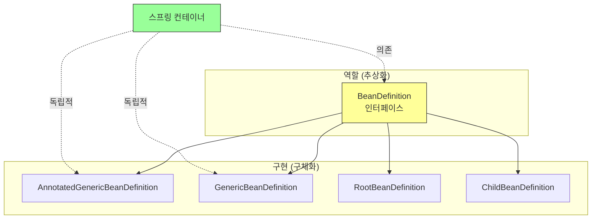

### OCP (개방-폐쇄 원칙) 적용

```java
// 스프링 컨테이너는 BeanDefinition만 알면 됨
public class SpringContainer {

    private Map<String, BeanDefinition> beanDefinitionMap;

    public void registerBeanDefinition(String name, BeanDefinition bd) {
        // BeanDefinition 인터페이스만 의존
        // 어떤 구현체가 들어와도 상관없음
        beanDefinitionMap.put(name, bd);
    }

    public Object createBean(String name) {
        BeanDefinition bd = beanDefinitionMap.get(name);
        // BeanDefinition 정보를 바탕으로 빈 생성
        return createInstance(bd);
    }
}
```

**장점:**


### 설정 형식별 BeanDefinition 생성

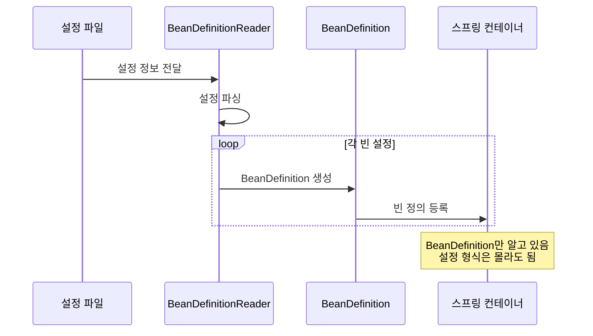

**구체적 예시:**

1. **Java Config:**
```java
// AnnotationConfigApplicationContext
AnnotatedBeanDefinitionReader reader;

@Configuration
public class AppConfig {
    @Bean
    public MemberService memberService() {
        return new MemberServiceImpl();
    }
}

// AnnotatedBeanDefinitionReader가
// @Bean 메서드를 읽어서 BeanDefinition 생성
```

2. **XML Config:**
```xml
<!-- appConfig.xml -->
<bean id="memberService" class="...MemberServiceImpl">
    <constructor-arg ref="memberRepository" />
</bean>

<!-- XmlBeanDefinitionReader가
     <bean> 태그를 읽어서 BeanDefinition 생성 -->
```

---

## BeanDefinition 정보

### 주요 메타데이터

| 속성 | 설명 | 예시 |
|------|------|------|
| **BeanClassName** | 빈의 클래스 이름 | hello.core.member.MemberServiceImpl |
| **factoryBeanName** | 팩토리 역할의 빈을 사용할 경우 이름 | appConfig |
| **factoryMethodName** | 빈을 생성할 팩토리 메서드 지정 | memberService |
| **Scope** | 싱글톤, 프로토타입 등 | singleton (기본값) |
| **lazyInit** | 지연 초기화 여부 | false (기본값) |
| **InitMethodName** | 빈 생성 후 초기화 메서드 | init |
| **DestroyMethodName** | 빈 소멸 전 호출 메서드 | close |
| **Constructor arguments** | 생성자 인자 (의존관계 주입) | memberRepository |
| **Properties** | setter 주입용 프로퍼티 | - |
| **Autowire mode** | 자동 의존관계 주입 모드 | no, byName, byType |

### BeanDefinition 구조

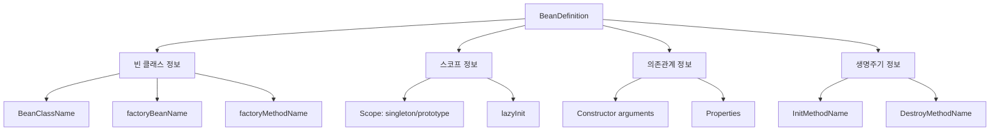

### Java Config의 특수성

Java Config를 사용하면 **팩토리 메서드 방식**으로 BeanDefinition이 생성됩니다.

```java
@Configuration
public class AppConfig {

    @Bean
    public MemberService memberService() {
        return new MemberServiceImpl(memberRepository());
    }
}
```

**생성되는 BeanDefinition:**
```
BeanDefinition 정보:
- beanClassName: null (직접 지정 안함)
- factoryBeanName: appConfig (팩토리 역할 빈)
- factoryMethodName: memberService (팩토리 메서드)
```

**동작 원리:**
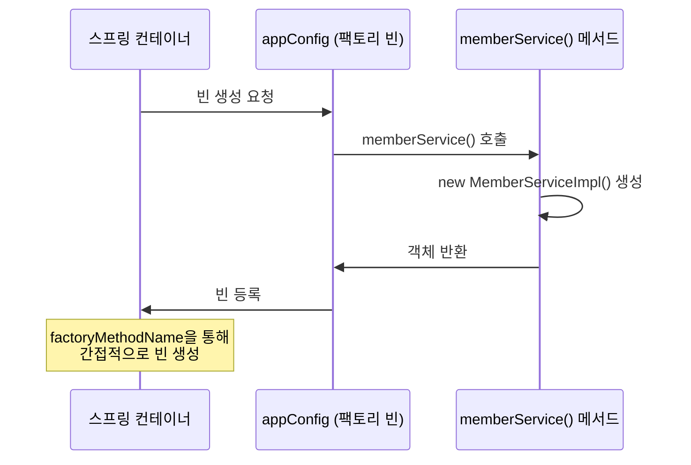

---

## 생성 과정

### 전체 프로세스

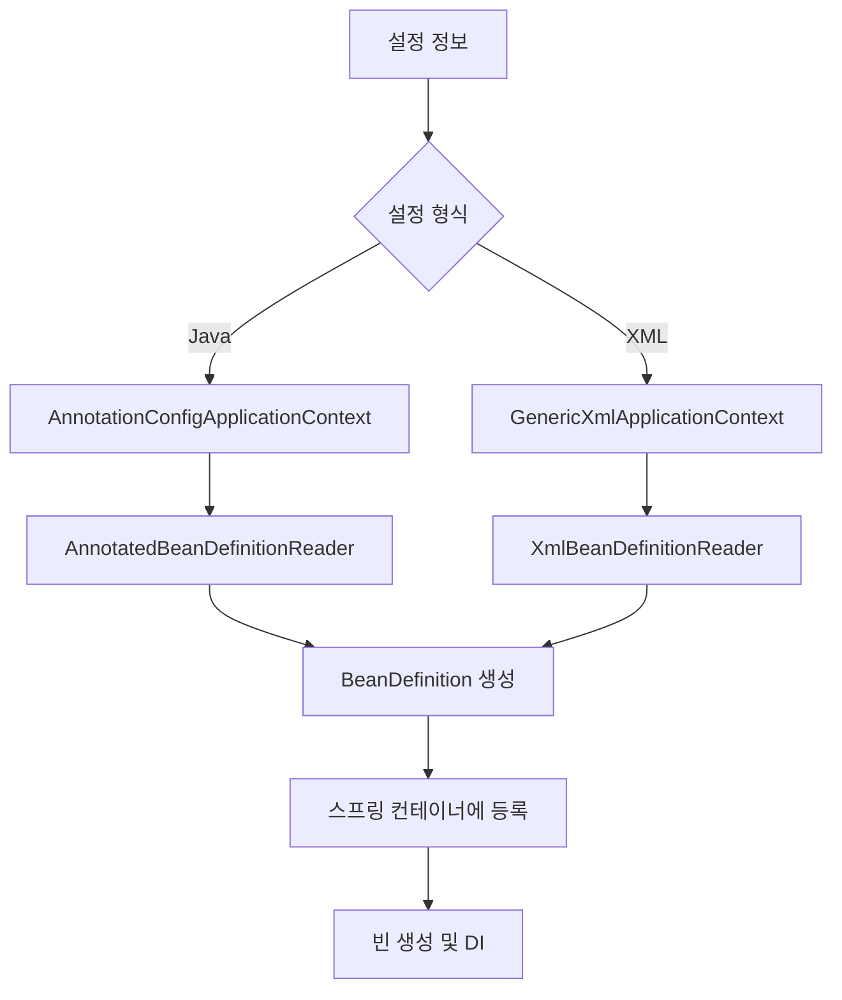

### Java Config 상세 과정

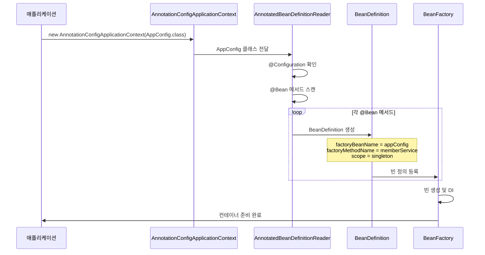

### XML Config 상세 과정

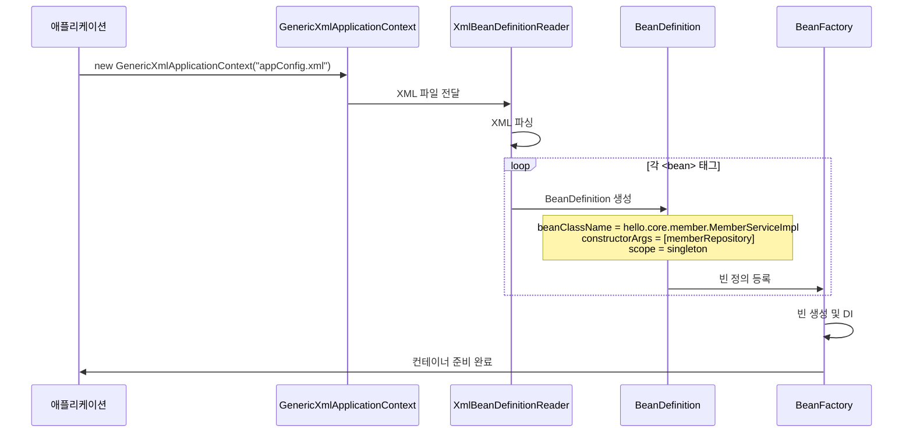

---

## 실습 코드

### BeanDefinition 조회 테스트

```java
package hello.core.beandefinition;

import hello.core.AppConfig;
import org.junit.jupiter.api.DisplayName;
import org.junit.jupiter.api.Test;
import org.springframework.beans.factory.config.BeanDefinition;
import org.springframework.context.annotation.AnnotationConfigApplicationContext;
import org.springframework.context.support.GenericXmlApplicationContext;

public class BeanDefinitionTest {

    @Test
    @DisplayName("빈 설정 메타정보 확인 - Java Config")
    void findApplicationBeanJava() {
        AnnotationConfigApplicationContext ac =
            new AnnotationConfigApplicationContext(AppConfig.class);

        String[] beanDefinitionNames = ac.getBeanDefinitionNames();

        for (String beanDefinitionName : beanDefinitionNames) {
            BeanDefinition beanDefinition =
                ac.getBeanDefinition(beanDefinitionName);

            if (beanDefinition.getRole() == BeanDefinition.ROLE_APPLICATION) {
                System.out.println("\nbeanDefinitionName = " + beanDefinitionName);
                System.out.println("beanDefinition = " + beanDefinition);
            }
        }
    }

    @Test
    @DisplayName("빈 설정 메타정보 확인 - XML")
    void findApplicationBeanXml() {
        GenericXmlApplicationContext ac =
            new GenericXmlApplicationContext("appConfig.xml");

        String[] beanDefinitionNames = ac.getBeanDefinitionNames();

        for (String beanDefinitionName : beanDefinitionNames) {
            BeanDefinition beanDefinition =
                ac.getBeanDefinition(beanDefinitionName);

            if (beanDefinition.getRole() == BeanDefinition.ROLE_APPLICATION) {
                System.out.println("\nbeanDefinitionName = " + beanDefinitionName);
                System.out.println("beanDefinition = " + beanDefinition);
            }
        }
    }
}
```

**Java Config 실행 결과:**
```
beanDefinitionName = appConfig
beanDefinition = Generic bean: class [hello.core.AppConfig$$SpringCGLIB$$0];
scope=singleton; abstract=false; lazyInit=null; autowireMode=0; dependencyCheck=0;
autowireCandidate=true; primary=false; factoryBeanName=null;
factoryMethodName=null; initMethodNames=null; destroyMethodNames=null

beanDefinitionName = memberService
beanDefinition = Root bean: class [null]; scope=; abstract=false; lazyInit=null;
autowireMode=3; dependencyCheck=0; autowireCandidate=true; primary=false;
factoryBeanName=appConfig; factoryMethodName=memberService;
initMethodNames=null; destroyMethodNames=[(inferred)]; defined in hello.core.AppConfig

beanDefinitionName = memberRepository
beanDefinition = Root bean: class [null]; scope=; abstract=false; lazyInit=null;
autowireMode=3; dependencyCheck=0; autowireCandidate=true; primary=false;
factoryBeanName=appConfig; factoryMethodName=memberRepository;
initMethodNames=null; destroyMethodNames=[(inferred)]; defined in hello.core.AppConfig
```

**XML Config 실행 결과:**
```
beanDefinitionName = memberService
beanDefinition = Generic bean: class [hello.core.member.MemberServiceImpl];
scope=; abstract=false; lazyInit=false; autowireMode=0; dependencyCheck=0;
autowireCandidate=true; primary=false; factoryBeanName=null;
factoryMethodName=null; initMethodNames=null; destroyMethodNames=null;
defined in class path resource [appConfig.xml]

beanDefinitionName = memberRepository
beanDefinition = Generic bean: class [hello.core.member.MemoryMemberRepository];
scope=; abstract=false; lazyInit=false; autowireMode=0; dependencyCheck=0;
autowireCandidate=true; primary=false; factoryBeanName=null;
factoryMethodName=null; initMethodNames=null; destroyMethodNames=null;
defined in class path resource [appConfig.xml]
```

### 상세 정보 출력 테스트

```java
@Test
@DisplayName("BeanDefinition 상세 정보 출력")
void printBeanDefinitionDetails() {
    AnnotationConfigApplicationContext ac =
        new AnnotationConfigApplicationContext(AppConfig.class);

    BeanDefinition bd = ac.getBeanDefinition("memberService");

    System.out.println("=== memberService BeanDefinition 상세 ===");
    System.out.println("BeanClassName: " + bd.getBeanClassName());
    System.out.println("FactoryBeanName: " + bd.getFactoryBeanName());
    System.out.println("FactoryMethodName: " + bd.getFactoryMethodName());
    System.out.println("Scope: " + bd.getScope());
    System.out.println("lazyInit: " + bd.isLazyInit());
    System.out.println("Abstract: " + bd.isAbstract());
    System.out.println("Role: " + bd.getRole());
    System.out.println("Description: " + bd.getDescription());
}
```

**실행 결과:**
```
=== memberService BeanDefinition 상세 ===
BeanClassName: null
FactoryBeanName: appConfig
FactoryMethodName: memberService
Scope:
lazyInit: null
Abstract: false
Role: 0
Description: null
```

### Java Config vs XML Config 비교

```java
@Test
@DisplayName("Java Config와 XML Config의 BeanDefinition 비교")
void compareBeanDefinitions() {
    // Java Config
    AnnotationConfigApplicationContext javaAc =
        new AnnotationConfigApplicationContext(AppConfig.class);
    BeanDefinition javaBd = javaAc.getBeanDefinition("memberService");

    // XML Config
    GenericXmlApplicationContext xmlAc =
        new GenericXmlApplicationContext("appConfig.xml");
    BeanDefinition xmlBd = xmlAc.getBeanDefinition("memberService");

    System.out.println("=== Java Config ===");
    System.out.println("BeanClassName: " + javaBd.getBeanClassName());
    System.out.println("FactoryBeanName: " + javaBd.getFactoryBeanName());
    System.out.println("FactoryMethodName: " + javaBd.getFactoryMethodName());

    System.out.println("\n=== XML Config ===");
    System.out.println("BeanClassName: " + xmlBd.getBeanClassName());
    System.out.println("FactoryBeanName: " + xmlBd.getFactoryBeanName());
    System.out.println("FactoryMethodName: " + xmlBd.getFactoryMethodName());
}
```

**실행 결과:**
```
=== Java Config ===
BeanClassName: null
FactoryBeanName: appConfig
FactoryMethodName: memberService

=== XML Config ===
BeanClassName: hello.core.member.MemberServiceImpl
FactoryBeanName: null
FactoryMethodName: null
```

**차이점:**
- Java Config: 팩토리 메서드 방식 (factoryMethodName 사용)
- XML Config: 직접 빈 클래스 지정 (BeanClassName 사용)

---

## 핵심 정리

### 1. BeanDefinition의 역할

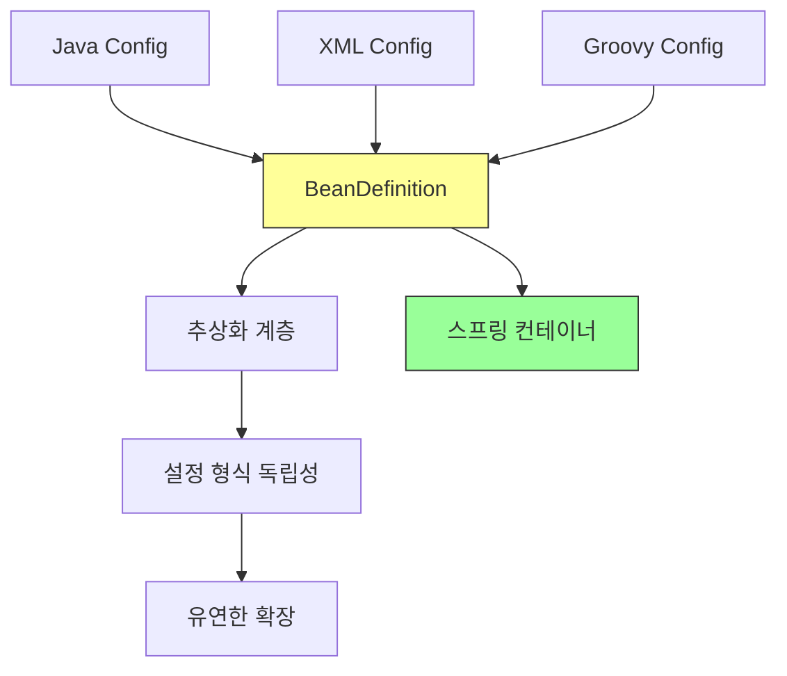

**핵심:**
- BeanDefinition은 **빈의 메타데이터**
- 설정 형식과 무관하게 **통일된 인터페이스** 제공
- 스프링 컨테이너는 **BeanDefinition만 의존**

### 2. 역할과 구현의 분리

```
역할: BeanDefinition (추상화)
구현: AnnotatedGenericBeanDefinition, GenericBeanDefinition 등

스프링 컨테이너는 역할(BeanDefinition)에만 의존
구현(설정 형식)은 자유롭게 변경 가능
```

**OCP 원칙 적용:**


### 3. Java Config vs XML Config

| 구분 | Java Config | XML Config |
|------|-------------|------------|
| **BeanClassName** | null | 클래스 전체 경로 |
| **factoryBeanName** | appConfig | null |
| **factoryMethodName** | 메서드명 | null |
| **생성 방식** | 팩토리 메서드 | 직접 생성 |

### 4. 팩토리 메서드 방식

Java Config는 **팩토리 메서드 패턴**을 사용합니다.

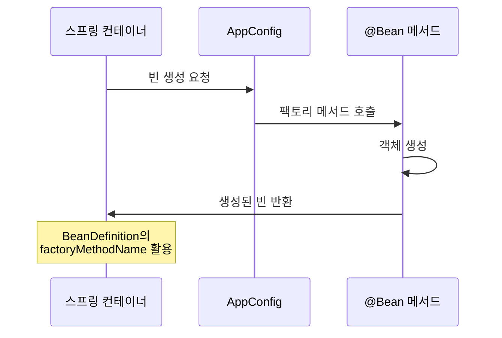

### 5. 실무 활용

**BeanDefinition을 직접 사용하는 경우는 거의 없음**

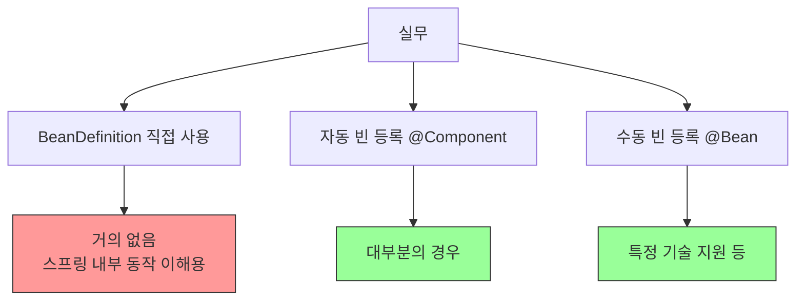

**언제 알아야 하는가?**
- 스프링 내부 동작 원리 이해
- 커스텀 설정 형식 개발 (매우 드묾)
- 디버깅 및 문제 해결

### 6. 핵심 개념 정리

```java
// 1. 스프링 컨테이너는 BeanDefinition에 의존
public class SpringContainer {
    private Map<String, BeanDefinition> beanDefinitionMap;
    // BeanDefinition만 알면 됨
}

// 2. 설정 형식은 BeanDefinition으로 변환
Java Config → AnnotatedBeanDefinitionReader → BeanDefinition
XML Config → XmlBeanDefinitionReader → BeanDefinition

// 3. BeanDefinition으로 빈 생성
BeanDefinition bd = getBeanDefinition("memberService");
Object bean = createBean(bd);  // BeanDefinition 정보로 빈 생성
```

### 7. BeanDefinition의 가치

**유연성:**
```
새로운 설정 형식 추가 시
→ BeanDefinitionReader만 구현
→ 스프링 컨테이너 코드는 변경 불필요
```

**확장성:**
```
YAML, JSON 등 다양한 형식 지원 가능
→ 각각의 Reader만 구현하면 됨
```

**일관성:**
```
설정 형식이 달라도
→ BeanDefinition이라는 통일된 형식
→ 스프링 컨테이너는 일관되게 동작
```

### 8. 정리

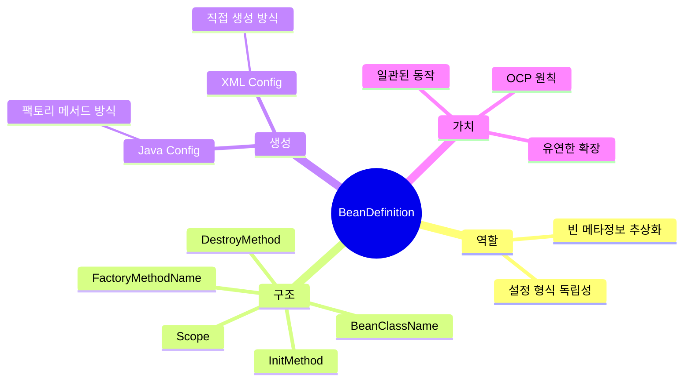

**최종 정리:**

1. **BeanDefinition = 빈의 설정 메타정보**
2. **스프링은 BeanDefinition만 알면 빈 생성 가능**
3. **설정 형식(Java, XML 등)은 BeanDefinition으로 변환**
4. **역할과 구현의 분리 = OCP 원칙 적용**
5. **실무에서는 직접 사용 거의 없음 (내부 동작 이해용)**

---

## 학습 마무리

**4장 '스프링 컨테이너와 스프링 빈' 완료!**

학습한 내용:
1. ✅ 스프링 컨테이너 생성
2. ✅ 컨테이너에 등록된 모든 빈 조회
3. ✅ 스프링 빈 조회 - 기본
4. ✅ 스프링 빈 조회 - 동일한 타입이 둘 이상
5. ✅ 스프링 빈 조회 - 상속 관계
6. ✅ BeanFactory와 ApplicationContext
7. ✅ 다양한 설정 형식 지원
8. ✅ 스프링 빈 설정 메타 정보 - BeanDefinition

**다음 학습:**
- 싱글톤 컨테이너
- 컴포넌트 스캔
- 의존관계 자동 주입
- 빈 생명주기 콜백
- 빈 스코프
