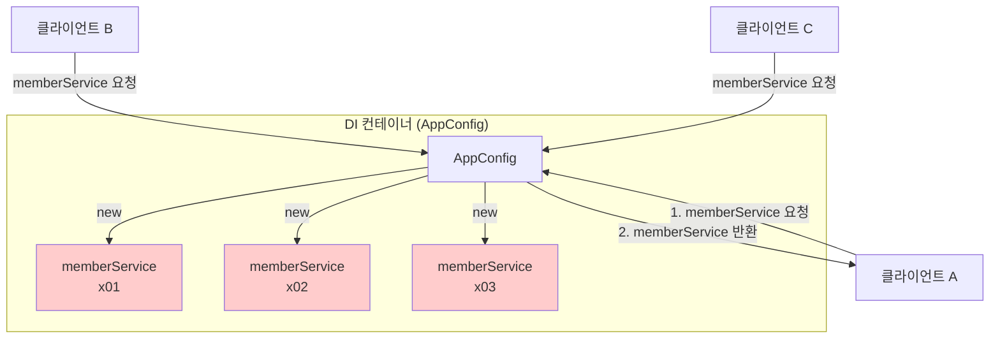
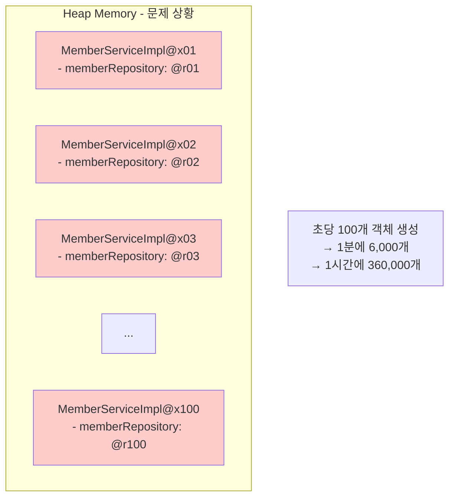
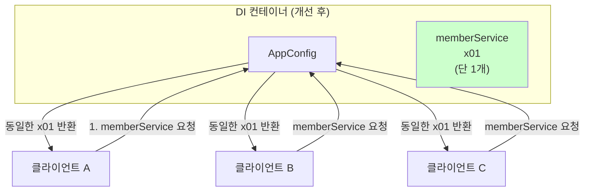
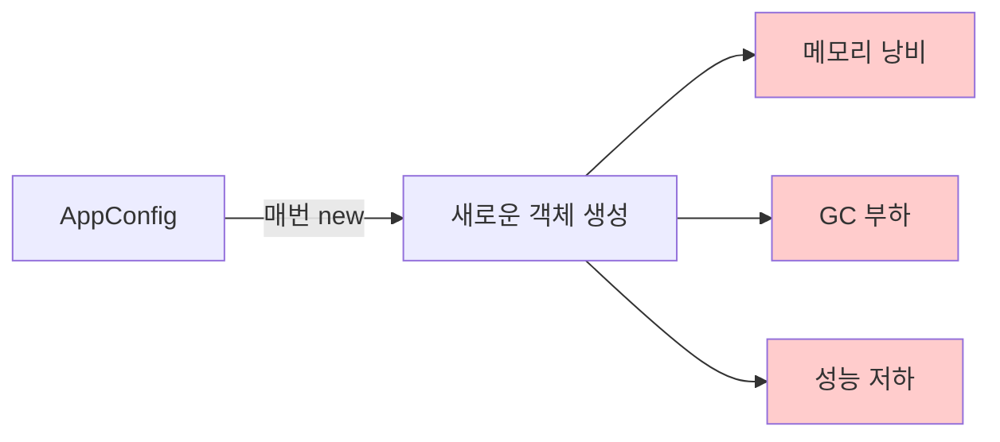

# 5-1. 웹 애플리케이션과 싱글톤

**출처**: 인프런 - 스프링 핵심 원리 기본편
**챕터**: 5. 싱글톤 컨테이너

---

## 학습 목표

- [ ] 웹 애플리케이션에서 싱글톤이 필요한 이유를 이해한다
- [ ] 스프링 없는 순수한 DI 컨테이너의 문제점을 파악한다
- [ ] 객체 인스턴스 생성의 메모리 낭비 문제를 설명할 수 있다

---

## 스프링의 탄생 배경

### 스프링은 웹을 위해 태어났다

**핵심 포인트**:
- 스프링은 **기업용 온라인 서비스 기술**을 지원하기 위해 탄생
- 대부분의 스프링 애플리케이션은 **웹 애플리케이션**
- 물론 웹이 아닌 애플리케이션 개발도 가능 (배치, 데몬 등)

### 웹 애플리케이션의 특징

**동시 요청 처리**:
```
웹 애플리케이션은 보통 여러 고객이 동시에 요청을 한다.
```

---

## 문제 상황: 순수한 DI 컨테이너

### 스프링 없는 순수한 DI 컨테이너

**현재 상황 분석**:



**문제점**:
- 요청할 때마다 **새로운 객체를 생성**
- 고객 3명이 요청하면 **3개의 객체**가 생성됨
- 각각 **다른 인스턴스** (x01, x02, x03)

---

## 테스트 코드로 확인하기

### SingletonTest.java

```java
package hello.core.singleton;

import hello.core.AppConfig;
import hello.core.member.MemberService;
import org.junit.jupiter.api.DisplayName;
import org.junit.jupiter.api.Test;

import static org.assertj.core.api.Assertions.*;

public class SingletonTest {

    @Test
    @DisplayName("스프링 없는 순수한 DI 컨테이너")
    void pureContainer() {
        AppConfig appConfig = new AppConfig();

        //1. 조회: 호출할 때 마다 객체를 생성
        MemberService memberService1 = appConfig.memberService();

        //2. 조회: 호출할 때 마다 객체를 생성
        MemberService memberService2 = appConfig.memberService();

        //참조값이 다른 것을 확인
        System.out.println("memberService1 = " + memberService1);
        System.out.println("memberService2 = " + memberService2);

        //memberService1 != memberService2
        assertThat(memberService1).isNotSameAs(memberService2);
    }
}
```

### 테스트 실행 결과

```
memberService1 = hello.core.member.MemberServiceImpl@3b22cdd0
memberService2 = hello.core.member.MemberServiceImpl@1f010bf0
```

**결과 분석**:
- `@3b22cdd0` ≠ `@1f010bf0`
- 두 객체의 **참조값(주소)이 다름**
- 즉, **서로 다른 객체**가 생성되었음

---

## 메모리 낭비 문제

### 트래픽에 따른 객체 생성

**시나리오 분석**:

| 트래픽 | 객체 생성 수 | 문제점 |
|--------|------------|--------|
| 초당 100 요청 | 초당 100개 생성 | 메모리 낭비 |
| 초당 1,000 요청 | 초당 1,000개 생성 | 심각한 메모리 낭비 |
| 초당 10,000 요청 | 초당 10,000개 생성 | 서버 다운 위험 |

### 메모리 관점 상세 분석



**심각한 문제들**:
1. **메모리 낭비**: 동일한 기능을 하는 객체가 수없이 생성
2. **GC 부하**: 생성된 객체는 곧 사용 후 버려짐 → GC 대상
3. **성능 저하**: 객체 생성/소멸 반복 → CPU, 메모리 자원 낭비
4. **응답 지연**: 요청마다 객체를 생성하는 시간 발생

---

## 해결 방안: 싱글톤

### 싱글톤의 핵심 아이디어

```
해결방안은 해당 객체가 딱 1개만 생성되고, 공유하도록 설계하면 된다.
→ 싱글톤 패턴
```

### 싱글톤 적용 후 개선된 모습



**개선 효과**:
- 객체를 **딱 1개만 생성**
- 모든 클라이언트가 **같은 객체를 공유**
- 메모리 절약, 성능 향상

---

## 핵심 정리

### 스프링 없는 순수한 DI 컨테이너의 문제



### 문제점 요약

| 문제 | 설명 |
|------|------|
| **객체 중복 생성** | 요청마다 새로운 객체 생성 |
| **메모리 낭비** | 같은 기능의 객체가 다수 존재 |
| **GC 부하 증가** | 짧은 생명주기 객체 다수 발생 |
| **응답 지연** | 객체 생성 시간만큼 응답 지연 |

### 해결 방안

| 방안 | 설명 |
|------|------|
| **싱글톤 패턴** | 객체를 딱 1개만 생성하여 공유 |
| **스프링 컨테이너** | 싱글톤 패턴의 문제점을 해결하면서 싱글톤 제공 |

---

## 다음 학습

➡️ **[5-2. 싱글톤 패턴](./5-2-싱글톤패턴.md)**
- 싱글톤 패턴의 구현 방법
- 싱글톤 패턴의 장점과 단점
- 왜 직접 싱글톤 패턴을 사용하면 안 되는지
