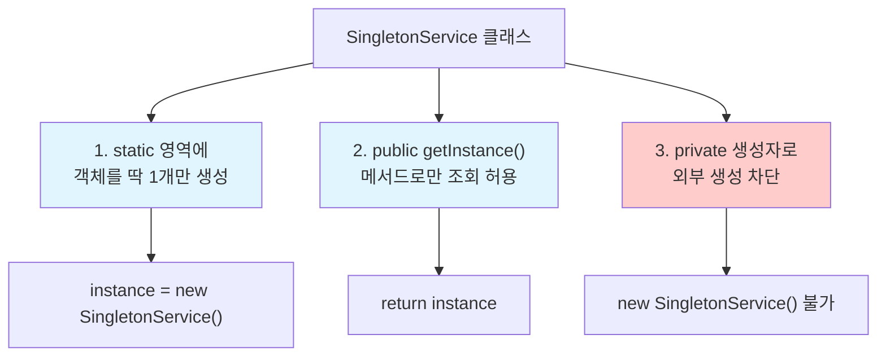
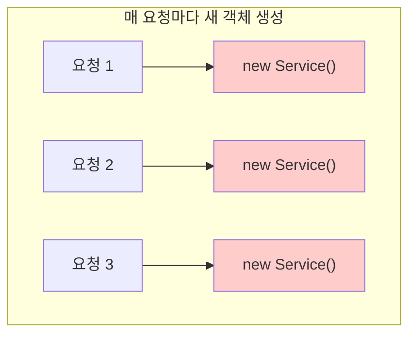
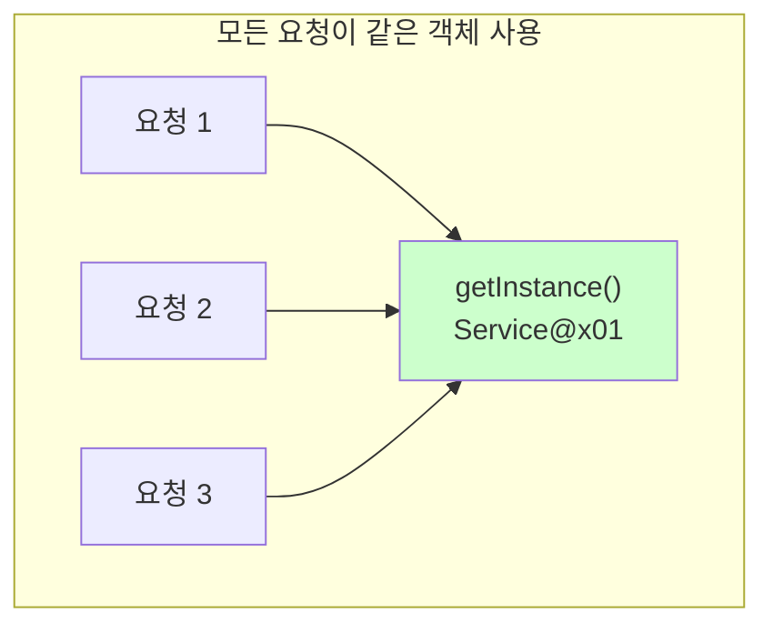
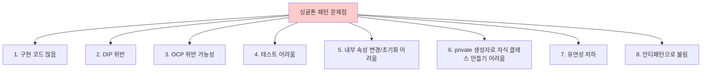

# 5-2. 싱글톤 패턴

**출처**: 인프런 - 스프링 핵심 원리 기본편
**챕터**: 5. 싱글톤 컨테이너

---

## 학습 목표

- [ ] 싱글톤 패턴의 정의와 구현 방법을 이해한다
- [ ] private 생성자를 사용하는 이유를 설명할 수 있다
- [ ] 싱글톤 패턴의 문제점을 파악한다

---

## 싱글톤 패턴이란?

### 정의

**싱글톤 패턴 (Singleton Pattern)**:
- 클래스의 인스턴스가 **딱 1개만 생성**되는 것을 보장하는 디자인 패턴
- 객체 인스턴스를 **2개 이상 생성하지 못하도록** 막아야 함
- **private 생성자**를 사용해서 외부에서 임의로 `new` 키워드를 사용하지 못하도록 막음

### 핵심 아이디어



---

## 싱글톤 패턴 구현

### SingletonService.java

**위치**: test 폴더에 생성

```java
package hello.core.singleton;

public class SingletonService {

    //1. static 영역에 객체를 딱 1개만 생성해둔다.
    private static final SingletonService instance = new SingletonService();

    //2. public으로 열어서 객체 인스턴스가 필요하면 이 static 메서드를 통해서만 조회하도록 허용한다.
    public static SingletonService getInstance() {
        return instance;
    }

    //3. 생성자를 private으로 선언해서 외부에서 new 키워드를 사용한 객체 생성을 못하게 막는다.
    private SingletonService() {
    }

    public void logic() {
        System.out.println("싱글톤 객체 로직 호출");
    }
}
```

### 코드 상세 분석

#### 1단계: static 영역에 객체 생성

```java
private static final SingletonService instance = new SingletonService();
```

| 키워드 | 의미 |
|--------|------|
| `private` | 외부에서 직접 접근 불가 |
| `static` | 클래스 레벨에 1개만 존재 |
| `final` | 한 번 할당 후 변경 불가 |

**동작**:
- 클래스가 로딩될 때 **딱 1번** 실행
- JVM의 **static 영역**에 객체가 생성됨
- 애플리케이션이 종료될 때까지 유지

#### 2단계: getInstance() 메서드

```java
public static SingletonService getInstance() {
    return instance;
}
```

**동작**:
- 외부에서 **유일하게 객체를 조회**할 수 있는 방법
- 항상 **같은 인스턴스**를 반환
- `static` 메서드이므로 클래스명으로 호출 가능

#### 3단계: private 생성자

```java
private SingletonService() {
}
```

**동작**:
- 외부에서 `new SingletonService()` 불가능
- 컴파일 오류 발생
- 오직 **클래스 내부에서만** 생성 가능

---

## 싱글톤 패턴 테스트

### 테스트 코드

```java
@Test
@DisplayName("싱글톤 패턴을 적용한 객체 사용")
public void singletonServiceTest() {

    //private으로 생성자를 막아두었다. 컴파일 오류가 발생한다.
    //new SingletonService();

    //1. 조회: 호출할 때 마다 같은 객체를 반환
    SingletonService singletonService1 = SingletonService.getInstance();

    //2. 조회: 호출할 때 마다 같은 객체를 반환
    SingletonService singletonService2 = SingletonService.getInstance();

    //참조값이 같은 것을 확인
    System.out.println("singletonService1 = " + singletonService1);
    System.out.println("singletonService2 = " + singletonService2);

    // singletonService1 == singletonService2
    assertThat(singletonService1).isSameAs(singletonService2);

    singletonService1.logic();
}
```

### 테스트 결과

```
singletonService1 = hello.core.singleton.SingletonService@3b22cdd0
singletonService2 = hello.core.singleton.SingletonService@3b22cdd0
싱글톤 객체 로직 호출
```

**결과 분석**:
- `@3b22cdd0` == `@3b22cdd0`
- 두 객체의 **참조값(주소)이 동일**
- **같은 객체**임이 확인됨

### isSameAs vs isEqualTo

| 메서드 | 비교 방식 | 사용 예 |
|--------|---------|---------|
| `isSameAs()` | `==` (참조 비교) | 같은 인스턴스인지 확인 |
| `isEqualTo()` | `equals()` (값 비교) | 값이 같은지 확인 |

---

## 싱글톤 패턴의 효과

### Before: 순수한 DI 컨테이너



### After: 싱글톤 패턴 적용



**효과**:
- 고객의 요청이 올 때마다 **객체를 생성하지 않음**
- 이미 만들어진 객체를 **공유해서 효율적으로 사용**
- 메모리 절약, 성능 향상

---

## 싱글톤 패턴 구현 방법들

> 참고: 싱글톤 패턴을 구현하는 방법은 여러 가지가 있다.
> 여기서는 객체를 미리 생성해두는 **가장 단순하고 안전한 방법**을 선택했다.

### 다양한 구현 방법

| 방법 | 특징 | 스레드 안전 |
|------|------|-----------|
| **Eager Initialization** | 클래스 로딩 시 생성 (위 예제) | O |
| Lazy Initialization | 처음 호출 시 생성 | X |
| Synchronized | synchronized 키워드 사용 | O (느림) |
| Double-Checked Locking | volatile + synchronized | O |
| **Holder 패턴** | 내부 클래스 사용 | O (권장) |
| **Enum** | enum 사용 | O (권장) |

### Holder 패턴 예시 (참고)

```java
public class SingletonService {

    private SingletonService() {}

    // 내부 클래스 - 클래스 로딩 시점에 생성
    private static class SingletonHolder {
        private static final SingletonService INSTANCE = new SingletonService();
    }

    public static SingletonService getInstance() {
        return SingletonHolder.INSTANCE;
    }
}
```

---

## 싱글톤 패턴의 문제점

### 문제점 목록



### 문제점 상세 설명

#### 1. 싱글톤 패턴 구현 코드가 많이 들어간다

```java
// 싱글톤 적용을 위해 추가되는 코드들
private static final SingletonService instance = new SingletonService();

public static SingletonService getInstance() {
    return instance;
}

private SingletonService() {
}
```

**문제**: 모든 싱글톤 클래스에 이 코드를 반복해야 함

#### 2. DIP 위반 - 구체 클래스에 의존

```java
// 클라이언트 코드
public class OrderServiceImpl implements OrderService {

    // 구체 클래스에 의존!
    private final MemberRepository memberRepository =
        MemberRepositoryImpl.getInstance();  // ← 구체 클래스!

    // MemberRepository 인터페이스가 아닌
    // MemberRepositoryImpl 구체 클래스를 알아야 함
}
```

**문제**: 클라이언트가 `구체클래스.getInstance()`를 호출해야 함

#### 3. OCP 위반 가능성이 높다

```java
// 정책 변경 시 클라이언트 코드 수정 필요
public class OrderServiceImpl implements OrderService {

    // 변경 전
    // private final DiscountPolicy discountPolicy = FixDiscountPolicy.getInstance();

    // 변경 후 - 클라이언트 코드 수정!
    private final DiscountPolicy discountPolicy = RateDiscountPolicy.getInstance();
}
```

**문제**: 구현체 변경 시 클라이언트 코드 수정 필요

#### 4. 테스트하기 어렵다

```java
// 테스트 코드
@Test
void test() {
    // Mock 객체로 교체하기 어려움!
    MemberRepository repository = MemberRepositoryImpl.getInstance();

    // 항상 같은 인스턴스가 반환되어
    // 테스트 간 격리가 어려움
}
```

**문제**: Mock 객체 주입 불가, 테스트 격리 어려움

#### 5. 내부 속성을 변경하거나 초기화하기 어렵다

```java
public class SingletonService {
    private static final SingletonService instance = new SingletonService();

    private String data;  // 상태

    public void setData(String data) {
        this.data = data;
    }
}

// 테스트 A에서
SingletonService.getInstance().setData("testA");

// 테스트 B에서 - 이전 테스트의 상태가 남아있음!
SingletonService.getInstance().getData();  // "testA" ← 오염됨!
```

**문제**: 싱글톤 인스턴스의 상태가 테스트 간 공유됨

#### 6. private 생성자로 자식 클래스 만들기 어렵다

```java
public class SingletonService {
    private SingletonService() {}  // private 생성자
}

// 상속 불가!
public class ChildService extends SingletonService {
    public ChildService() {
        super();  // 컴파일 오류! private 생성자 호출 불가
    }
}
```

**문제**: 다형성 활용 불가

#### 7. 결론적으로 유연성이 떨어진다

```
싱글톤 패턴은:
- 객체지향의 장점인 다형성을 활용하기 어려움
- 의존관계를 유연하게 변경하기 어려움
- 테스트 코드 작성이 어려움
```

#### 8. 안티패턴으로 불리기도 한다

> "싱글톤 패턴은 안티패턴(Anti-pattern)으로 불리기도 한다."
> - 객체지향 설계 원칙에 위배되는 부분이 많기 때문

---

## 핵심 정리

### 싱글톤 패턴의 장단점

| 구분 | 내용 |
|------|------|
| **장점** | 인스턴스 1개만 생성 → 메모리 절약 |
| **단점** | 구현 코드 많음, DIP/OCP 위반, 테스트 어려움, 유연성 저하 |

### 싱글톤 패턴 구현의 핵심 3요소

```java
public class Singleton {
    // 1. static 영역에 유일한 인스턴스 생성
    private static final Singleton instance = new Singleton();

    // 2. getInstance()로만 접근 허용
    public static Singleton getInstance() {
        return instance;
    }

    // 3. private 생성자로 외부 생성 차단
    private Singleton() {}
}
```

### 스프링의 해결책

```
스프링 컨테이너는 싱글톤 패턴의 문제점을 해결하면서,
객체 인스턴스를 싱글톤으로 관리한다.
→ 다음 강의: 싱글톤 컨테이너
```

---

## 다음 학습

➡️ **[5-3. 싱글톤 컨테이너](./5-3-싱글톤컨테이너.md)**
- 스프링 컨테이너가 싱글톤 패턴의 문제점을 어떻게 해결하는지
- 싱글톤 레지스트리란 무엇인지
- 스프링 빈이 싱글톤으로 관리되는 방법
