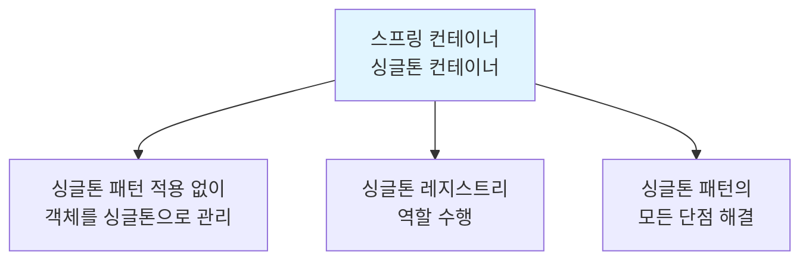
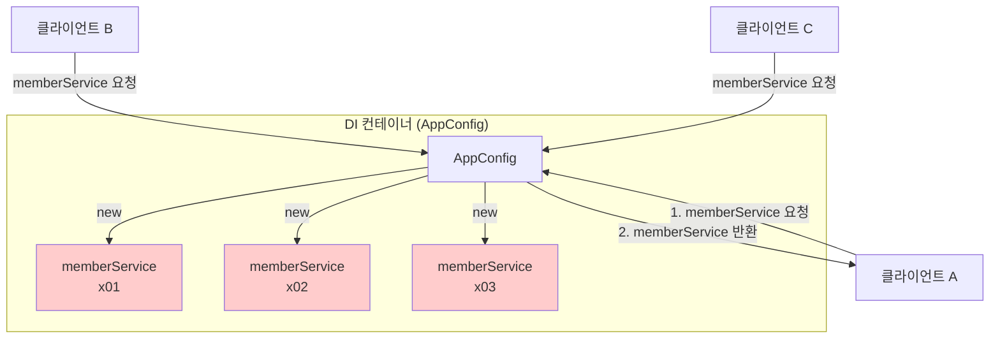
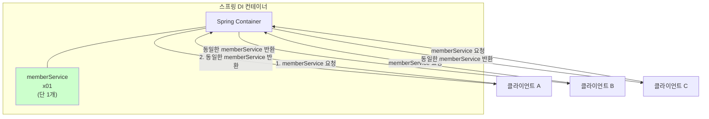

# 5-3. 싱글톤 컨테이너

**출처**: 인프런 - 스프링 핵심 원리 기본편
**챕터**: 5. 싱글톤 컨테이너

---

## 학습 목표

- [ ] 스프링 컨테이너가 싱글톤 패턴의 문제점을 해결하는 방법을 이해한다
- [ ] 싱글톤 레지스트리의 개념을 설명할 수 있다
- [ ] 스프링 빈이 싱글톤으로 관리되는 것을 테스트로 확인할 수 있다

---

## 스프링 컨테이너의 역할

### 싱글톤 패턴 문제점 해결

```
스프링 컨테이너는 싱글톤 패턴의 문제점을 해결하면서,
객체 인스턴스를 싱글톤(1개만 생성)으로 관리한다.
```

**핵심**:
- 지금까지 학습한 **스프링 빈**이 바로 싱글톤으로 관리되는 빈
- 스프링 컨테이너 = **싱글톤 컨테이너**

---

## 싱글톤 컨테이너

### 스프링 컨테이너의 특징



### 싱글톤 레지스트리

**정의**:
- 싱글톤 객체를 **생성하고 관리**하는 기능
- 스프링 컨테이너가 이 역할을 담당

### 스프링 컨테이너가 해결한 문제점

| 싱글톤 패턴 문제 | 스프링 컨테이너 해결 |
|----------------|-------------------|
| 지저분한 코드 필요 | ✅ 코드 불필요 |
| DIP 위반 | ✅ DIP 준수 |
| OCP 위반 가능성 | ✅ OCP 준수 |
| 테스트 어려움 | ✅ 테스트 용이 |
| private 생성자 제약 | ✅ 자유로운 상속 |
| 유연성 저하 | ✅ 유연성 확보 |

---

## 스프링 컨테이너 테스트

### 테스트 코드

```java
@Test
@DisplayName("스프링 컨테이너와 싱글톤")
void springContainer() {

    ApplicationContext ac = new AnnotationConfigApplicationContext(AppConfig.class);

    //1. 조회: 호출할 때 마다 같은 객체를 반환
    MemberService memberService1 = ac.getBean("memberService", MemberService.class);

    //2. 조회: 호출할 때 마다 같은 객체를 반환
    MemberService memberService2 = ac.getBean("memberService", MemberService.class);

    //참조값이 같은 것을 확인
    System.out.println("memberService1 = " + memberService1);
    System.out.println("memberService2 = " + memberService2);

    //memberService1 == memberService2
    assertThat(memberService1).isSameAs(memberService2);
}
```

### 테스트 결과

```
memberService1 = hello.core.member.MemberServiceImpl@3b22cdd0
memberService2 = hello.core.member.MemberServiceImpl@3b22cdd0
```

**결과 분석**:
- 두 객체의 **참조값이 동일** (`@3b22cdd0`)
- `getBean()`을 여러 번 호출해도 **같은 인스턴스** 반환
- 스프링 컨테이너가 **싱글톤으로 관리**하고 있음

---

## 싱글톤 컨테이너 적용 전후 비교

### Before: 순수한 DI 컨테이너



**문제**:
- 요청마다 **새로운 객체 생성**
- 메모리 낭비

### After: 스프링 DI 컨테이너



**효과**:
- 스프링 컨테이너 덕분에 고객의 요청이 올 때마다 **객체를 생성하지 않음**
- 이미 만들어진 객체를 **공유해서 효율적으로 재사용**

---

## 스프링의 빈 스코프

> **참고**
> 스프링의 기본 빈 등록 방식은 **싱글톤**이지만,
> 싱글톤 방식만 지원하는 것은 아니다.
> 요청할 때마다 새로운 객체를 생성해서 반환하는 기능도 제공한다.
> 자세한 내용은 뒤에 **빈 스코프**에서 설명한다.

### 빈 스코프 종류 (미리보기)

| 스코프 | 설명 |
|--------|------|
| **singleton** | 기본값, 하나의 인스턴스만 생성 |
| prototype | 요청마다 새로운 인스턴스 생성 |
| request | HTTP 요청마다 새로운 인스턴스 생성 |
| session | HTTP 세션마다 새로운 인스턴스 생성 |
| application | 서블릿 컨텍스트마다 새로운 인스턴스 생성 |

---

## 코드 비교

### 싱글톤 패턴 직접 구현 vs 스프링 컨테이너

**싱글톤 패턴 직접 구현**:
```java
public class MemberServiceImpl implements MemberService {

    // 지저분한 싱글톤 코드
    private static final MemberServiceImpl instance = new MemberServiceImpl();

    public static MemberServiceImpl getInstance() {
        return instance;
    }

    private MemberServiceImpl() {
        // private 생성자
    }

    // ... 비즈니스 로직
}

// 클라이언트 코드
MemberService memberService = MemberServiceImpl.getInstance();  // 구체 클래스에 의존!
```

**스프링 컨테이너 사용**:
```java
@Component
public class MemberServiceImpl implements MemberService {

    // 싱글톤 관련 코드 전혀 없음!

    // ... 비즈니스 로직만 있음
}

// 클라이언트 코드
MemberService memberService = ac.getBean("memberService", MemberService.class);  // 인터페이스에 의존!
```

---

## 핵심 정리

### 스프링 컨테이너의 싱글톤 관리


### 스프링 컨테이너가 제공하는 가치

| 항목 | 설명 |
|------|------|
| **싱글톤 보장** | 별도 코드 없이 싱글톤 보장 |
| **DIP 준수** | 인터페이스에만 의존 가능 |
| **OCP 준수** | 구현체 변경 시 클라이언트 코드 수정 불필요 |
| **테스트 용이** | Mock 객체 주입 가능 |
| **유연성** | 다양한 스코프 지원 |

### 기억할 것

```
스프링 컨테이너 = 싱글톤 컨테이너

스프링 빈 = 기본적으로 싱글톤으로 관리되는 객체

싱글톤 레지스트리 = 싱글톤 객체를 생성하고 관리하는 기능
```

---

## 다음 학습

➡️ **[5-4. 싱글톤 방식의 주의점](./5-4-싱글톤방식의주의점.md)**
- 싱글톤 방식에서 주의해야 할 점
- 무상태(stateless) 설계
- 공유 필드의 위험성
