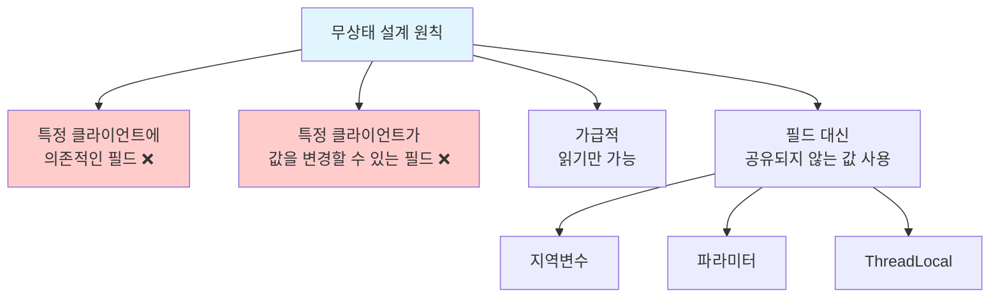
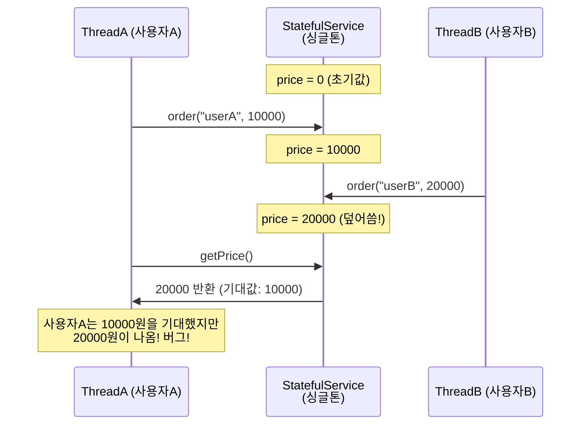
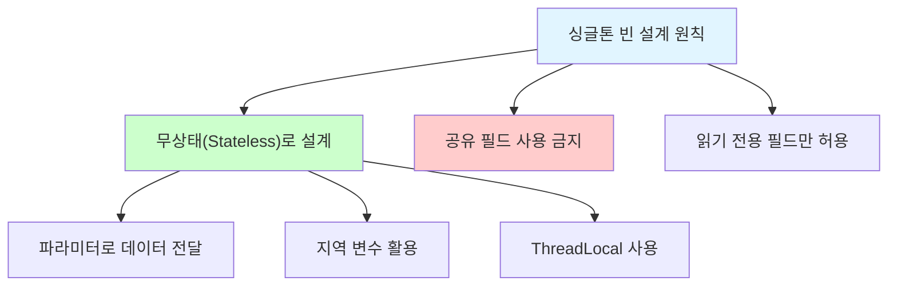

# 5-4. 싱글톤 방식의 주의점

**출처**: 인프런 - 스프링 핵심 원리 기본편
**챕터**: 5. 싱글톤 컨테이너

---

## 학습 목표

- [ ] 싱글톤 방식에서 상태를 유지하면 안 되는 이유를 이해한다
- [ ] 무상태(stateless) 설계의 중요성을 설명할 수 있다
- [ ] 공유 필드로 인한 동시성 문제를 이해한다

---

## 싱글톤 방식의 핵심 주의점

### 무상태(Stateless)로 설계해야 한다!

```
싱글톤 패턴이든, 스프링 같은 싱글톤 컨테이너를 사용하든,
객체 인스턴스를 하나만 생성해서 공유하는 싱글톤 방식은
여러 클라이언트가 하나의 같은 객체 인스턴스를 공유하기 때문에
싱글톤 객체는 상태를 유지(stateful)하게 설계하면 안된다.
```

### 무상태 설계 원칙



---

## 상태를 유지할 경우 발생하는 문제

### 문제 시나리오



### 문제가 되는 코드

**StatefulService.java** (상태를 유지하는 문제 코드):

```java
package hello.core.singleton;

public class StatefulService {

    private int price; //상태를 유지하는 필드

    public void order(String name, int price) {
        System.out.println("name = " + name + " price = " + price);
        this.price = price; //여기가 문제!
    }

    public int getPrice() {
        return price;
    }
}
```

**문제점 분석**:
```java
private int price; //상태를 유지하는 필드 ← 공유 필드!

this.price = price; //여기가 문제! ← 값을 변경함!
```

### 문제 재현 테스트 코드

**StatefulServiceTest.java**:

```java
package hello.core.singleton;

import org.assertj.core.api.Assertions;
import org.junit.jupiter.api.Test;
import org.springframework.context.ApplicationContext;
import org.springframework.context.annotation.AnnotationConfigApplicationContext;
import org.springframework.context.annotation.Bean;

public class StatefulServiceTest {

    @Test
    void statefulServiceSingleton() {
        ApplicationContext ac = new AnnotationConfigApplicationContext(TestConfig.class);

        StatefulService statefulService1 = ac.getBean("statefulService", StatefulService.class);
        StatefulService statefulService2 = ac.getBean("statefulService", StatefulService.class);

        //ThreadA: A사용자 10000원 주문
        statefulService1.order("userA", 10000);

        //ThreadB: B사용자 20000원 주문
        statefulService2.order("userB", 20000);

        //ThreadA: 사용자A 주문 금액 조회
        int price = statefulService1.getPrice();

        //ThreadA: 사용자A는 10000원을 기대했지만, 기대와 다르게 20000원 출력
        System.out.println("price = " + price);

        Assertions.assertThat(statefulService1.getPrice()).isEqualTo(20000);
    }

    static class TestConfig {

        @Bean
        public StatefulService statefulService() {
            return new StatefulService();
        }
    }
}
```

### 테스트 결과 분석

```
name = userA price = 10000
name = userB price = 20000
price = 20000
```

**문제 발생 과정**:

| 순서 | 행동 | price 값 |
|------|------|---------|
| 1 | 사용자A 10000원 주문 | 10000 |
| 2 | 사용자B 20000원 주문 | **20000** (덮어씀) |
| 3 | 사용자A 금액 조회 | **20000** (기대값: 10000) |

**핵심 문제**:
- `statefulService1`과 `statefulService2`는 **같은 인스턴스**
- 싱글톤이므로 `price` 필드가 **공유**됨
- 사용자B가 변경한 값이 사용자A에게 영향

---

## 실무에서 발생하는 문제

### 실무 사례

> "실무에서 이런 경우를 종종 보는데,
> 이로인해 정말 해결하기 어려운 큰 문제들이 터진다.
> (몇년에 한번씩 꼭 만난다.)"

### 실제 장애 시나리오

**결제 시스템 예시**:
```java
@Service
public class PaymentService {

    private String currentUserId;  // ❌ 공유 필드!

    public void processPayment(String userId, int amount) {
        this.currentUserId = userId;  // ❌ 상태 변경!

        // ... 결제 처리 로직 ...

        savePaymentLog(currentUserId, amount);  // 다른 사용자의 ID가 사용될 수 있음!
    }
}
```

**장애 시나리오**:
1. 사용자A가 결제 요청 → `currentUserId = "userA"`
2. 사용자B가 결제 요청 → `currentUserId = "userB"` (덮어씀)
3. 사용자A의 결제 로그에 `"userB"`가 저장됨!
4. **개인정보 유출 + 결제 내역 오류**

---

## 올바른 해결 방법

### 무상태(Stateless) 설계

**수정된 StatefulService.java**:

```java
package hello.core.singleton;

public class StatelessService {

    // private int price;  // ❌ 상태 필드 제거!

    public int order(String name, int price) {
        System.out.println("name = " + name + " price = " + price);
        // this.price = price;  // ❌ 상태 변경 제거!
        return price;  // ✅ 값을 반환!
    }

    // public int getPrice() {  // ❌ 상태 조회 제거!
    //     return price;
    // }
}
```

### 개선된 테스트 코드

```java
@Test
void statelessServiceSingleton() {
    ApplicationContext ac = new AnnotationConfigApplicationContext(TestConfig.class);

    StatelessService service1 = ac.getBean("statelessService", StatelessService.class);
    StatelessService service2 = ac.getBean("statelessService", StatelessService.class);

    //ThreadA: A사용자 10000원 주문 → 바로 반환
    int priceA = service1.order("userA", 10000);

    //ThreadB: B사용자 20000원 주문 → 바로 반환
    int priceB = service2.order("userB", 20000);

    //각자의 값을 가지고 있음
    System.out.println("priceA = " + priceA);  // 10000
    System.out.println("priceB = " + priceB);  // 20000

    assertThat(priceA).isEqualTo(10000);  // ✅ 성공!
    assertThat(priceB).isEqualTo(20000);  // ✅ 성공!
}
```

---

## 무상태 설계 패턴

### 1. 지역 변수 사용

```java
@Service
public class OrderService {

    public Order createOrder(Long memberId, String itemName, int itemPrice) {
        // ✅ 지역 변수 사용 - 스레드마다 독립적
        int discountPrice = calculateDiscount(itemPrice);
        Order order = new Order(memberId, itemName, itemPrice, discountPrice);
        return order;
    }
}
```

### 2. 파라미터 사용

```java
@Service
public class PaymentService {

    // ❌ 잘못된 예
    // private String userId;

    // ✅ 올바른 예 - 파라미터로 전달
    public PaymentResult processPayment(String userId, int amount) {
        // userId를 파라미터로 받아서 사용
        return new PaymentResult(userId, amount);
    }
}
```

### 3. ThreadLocal 사용

```java
@Service
public class UserContextService {

    // ✅ ThreadLocal - 스레드마다 독립적인 저장 공간
    private ThreadLocal<String> userIdHolder = new ThreadLocal<>();

    public void setUserId(String userId) {
        userIdHolder.set(userId);  // 현재 스레드에만 저장
    }

    public String getUserId() {
        return userIdHolder.get();  // 현재 스레드의 값만 조회
    }

    public void clear() {
        userIdHolder.remove();  // 사용 후 반드시 제거!
    }
}
```

---

## 핵심 정리

### 싱글톤 빈 설계 원칙



### 상태 유지 vs 무상태 비교

| 구분 | 상태 유지 (Stateful) | 무상태 (Stateless) |
|------|---------------------|-------------------|
| **공유 필드** | 있음 (위험) | 없음 (안전) |
| **값 변경** | 가능 (위험) | 불가능 (안전) |
| **동시성 문제** | 발생 가능 | 발생 안 함 |
| **스레드 안전** | 안전하지 않음 | 안전함 |

### 기억할 것

```
⚠️ 스프링 빈의 필드에 공유 값을 설정하면 정말 큰 장애가 발생할 수 있다!!!

✅ 진짜 공유필드는 조심해야 한다!

✅ 스프링 빈은 항상 무상태(stateless)로 설계하자.
```

---

## 💡 심화 내용

<details>
<summary>더 알아보기</summary>

### ThreadLocal 사용 시 주의사항

```java
@Service
public class UserContextService {

    private ThreadLocal<String> userIdHolder = new ThreadLocal<>();

    public void processRequest(String userId) {
        try {
            userIdHolder.set(userId);
            // 비즈니스 로직 수행
        } finally {
            // ⚠️ 중요! 반드시 제거해야 함
            // 스레드 풀을 사용하면 스레드가 재사용되므로
            // 이전 요청의 데이터가 남아있을 수 있음
            userIdHolder.remove();
        }
    }
}
```

### 스프링에서 제공하는 스코프

상태가 필요한 경우 싱글톤 대신 다른 스코프 사용:

```java
@Component
@Scope("request")  // HTTP 요청마다 새 인스턴스
public class MyRequestScopedBean {
    private String data;  // 요청별로 독립적
}

@Component
@Scope("prototype")  // 조회할 때마다 새 인스턴스
public class MyPrototypeBean {
    private String data;  // 인스턴스별로 독립적
}
```

</details>

---

## 면접 질문

### 초급 개발자 (Junior)

**Q1. 스프링 빈을 왜 무상태로 설계해야 하나요?**
<details>
<summary>답안 보기</summary>

스프링 빈은 기본적으로 싱글톤으로 관리되어 여러 클라이언트가 하나의 인스턴스를 공유합니다.
만약 상태(공유 필드)가 있다면:

1. **동시성 문제**: 여러 스레드가 동시에 같은 필드를 수정할 수 있음
2. **데이터 오염**: 다른 사용자의 데이터가 섞일 수 있음
3. **버그 재현 어려움**: 멀티스레드 환경에서만 발생하는 버그

따라서 스프링 빈은 무상태로 설계하고, 필요한 데이터는 파라미터, 지역변수, ThreadLocal 등을 사용해야 합니다.

</details>

**Q2. 무상태 설계에서 데이터를 어떻게 전달하나요?**
<details>
<summary>답안 보기</summary>

1. **파라미터**: 메서드 호출 시 필요한 데이터를 인자로 전달
2. **지역 변수**: 메서드 내에서 선언하여 사용 (스레드마다 독립적)
3. **반환 값**: 처리 결과를 객체로 반환
4. **ThreadLocal**: 스레드별로 독립적인 저장 공간 (단, 사용 후 반드시 제거)

```java
// 예시
public Order createOrder(Long memberId, String itemName, int price) {
    int discount = calculateDiscount(price);  // 지역 변수
    return new Order(memberId, itemName, price, discount);  // 반환 값
}
```

</details>

### 중급 개발자 (Mid-Level)

**Q3. 싱글톤 빈에서 상태를 유지하면 발생할 수 있는 실무 장애 사례를 설명해주세요.**
<details>
<summary>답안 보기</summary>

**결제 시스템 장애 사례**:
```java
@Service
public class PaymentService {
    private String currentUserId;  // 공유 필드!

    public void pay(String userId, int amount) {
        this.currentUserId = userId;
        // ... 결제 처리
        log.info("결제 완료: {}, {}원", currentUserId, amount);
    }
}
```

1. 사용자A 결제 요청 → `currentUserId = "A"`
2. 사용자B 결제 요청 → `currentUserId = "B"` (덮어씀)
3. 사용자A 결제 로그에 "B"가 기록됨

**결과**:
- 개인정보 유출 (사용자B의 결제가 사용자A에게 노출)
- 결제 내역 불일치
- 정산 오류

**해결책**:
```java
@Service
public class PaymentService {
    public PaymentResult pay(String userId, int amount) {
        // userId를 파라미터로만 사용
        return new PaymentResult(userId, amount);
    }
}
```

</details>

</details>

---

## 다음 학습

➡️ **[5-5. @Configuration과 싱글톤](./5-5-Configuration과싱글톤.md)**
- @Configuration이 싱글톤을 어떻게 보장하는지
- 같은 메서드를 여러 번 호출해도 같은 인스턴스가 반환되는 이유
