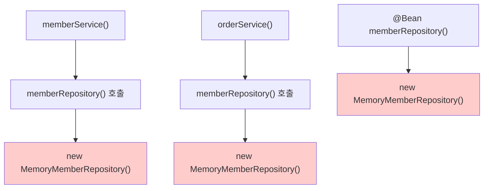
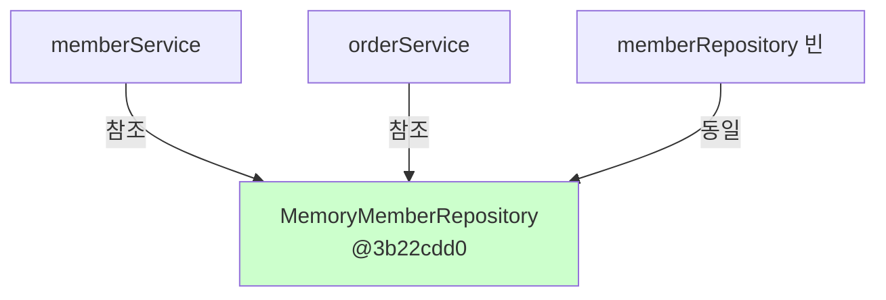
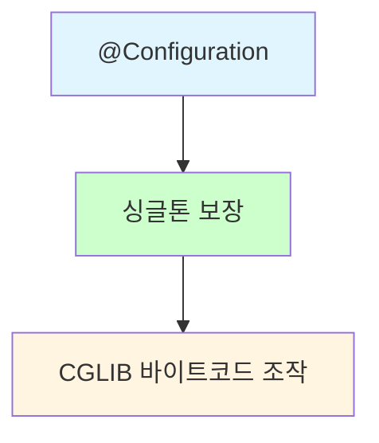

# 5-5. @Configuration과 싱글톤

**출처**: 인프런 - 스프링 핵심 원리 기본편
**챕터**: 5. 싱글톤 컨테이너

---

## 학습 목표

- [ ] @Configuration에서 싱글톤이 보장되는 원리를 이해한다
- [ ] 같은 메서드를 여러 번 호출해도 같은 인스턴스가 반환되는 이유를 설명할 수 있다
- [ ] memberRepository()가 여러 번 호출되어도 1번만 호출되는 이유를 이해한다

---

## 이상한 점 발견

### AppConfig 코드를 다시 보자

```java
@Configuration
public class AppConfig {

    @Bean
    public MemberService memberService() {
        return new MemberServiceImpl(memberRepository());
    }

    @Bean
    public OrderService orderService() {
        return new OrderServiceImpl(
            memberRepository(),
            discountPolicy());
    }

    @Bean
    public MemberRepository memberRepository() {
        return new MemoryMemberRepository();
    }

    ...
}
```

### 의문점



**문제 상황**:
1. `memberService` 빈을 만드는 코드를 보면 `memberRepository()`를 호출
   - → `new MemoryMemberRepository()` 호출
2. `orderService` 빈을 만드는 코드도 `memberRepository()`를 호출
   - → `new MemoryMemberRepository()` 호출

**예상 결과**:
- 각각 다른 2개의 `MemoryMemberRepository`가 생성되면서 **싱글톤이 깨지는 것처럼 보인다!**

### 질문

```
스프링 컨테이너는 이 문제를 어떻게 해결할까?
```

---

## 직접 테스트 해보자

### 검증 용도의 코드 추가

**MemberServiceImpl.java**:
```java
public class MemberServiceImpl implements MemberService {

    private final MemberRepository memberRepository;

    //테스트 용도
    public MemberRepository getMemberRepository() {
        return memberRepository;
    }
}
```

**OrderServiceImpl.java**:
```java
public class OrderServiceImpl implements OrderService {

    private final MemberRepository memberRepository;

    //테스트 용도
    public MemberRepository getMemberRepository() {
        return memberRepository;
    }
}
```

> 테스트를 위해 MemberRepository를 조회할 수 있는 기능을 추가한다.
> 기능 검증을 위해 잠깐 사용하는 것이니 인터페이스에 조회기능까지 추가하지는 말자.

---

### 테스트 코드

**ConfigurationSingletonTest.java**:

```java
package hello.core.singleton;

import hello.core.AppConfig;
import hello.core.member.MemberRepository;
import hello.core.member.MemberServiceImpl;
import hello.core.order.OrderServiceImpl;
import org.junit.jupiter.api.Test;
import org.springframework.context.ApplicationContext;
import org.springframework.context.annotation.AnnotationConfigApplicationContext;

import static org.assertj.core.api.Assertions.*;

public class ConfigurationSingletonTest {

    @Test
    void configurationTest() {
        ApplicationContext ac = new AnnotationConfigApplicationContext(AppConfig.class);

        MemberServiceImpl memberService = ac.getBean("memberService", MemberServiceImpl.class);
        OrderServiceImpl orderService = ac.getBean("orderService", OrderServiceImpl.class);
        MemberRepository memberRepository = ac.getBean("memberRepository", MemberRepository.class);

        //모두 같은 인스턴스를 참고하고 있다.
        System.out.println("memberService -> memberRepository = " +
                memberService.getMemberRepository());
        System.out.println("orderService -> memberRepository = " +
                orderService.getMemberRepository());
        System.out.println("memberRepository = " + memberRepository);

        //모두 같은 인스턴스를 참고하고 있다.
        assertThat(memberService.getMemberRepository()).isSameAs(memberRepository);
        assertThat(orderService.getMemberRepository()).isSameAs(memberRepository);
    }
}
```

### 테스트 결과

```
memberService -> memberRepository = hello.core.member.MemoryMemberRepository@3b22cdd0
orderService -> memberRepository = hello.core.member.MemoryMemberRepository@3b22cdd0
memberRepository = hello.core.member.MemoryMemberRepository@3b22cdd0
```

**결과 분석**:



- **모두 같은 인스턴스** (`@3b22cdd0`)를 참조!
- `memberRepository` 인스턴스는 **모두 같은 인스턴스가 공유**되어 사용됨

---

## 어떻게 된 일일까?

### 예상되는 호출 순서

AppConfig의 자바 코드를 보면 분명히 각각 2번 `new MemoryMemberRepository()`를 호출해서 **다른 인스턴스가 생성되어야 하는데?**

```java
// 예상되는 호출
1. @Bean memberService() → memberRepository() 호출 → new MemoryMemberRepository()
2. @Bean orderService() → memberRepository() 호출 → new MemoryMemberRepository()
3. @Bean memberRepository() → new MemoryMemberRepository()

// 예상: 3개의 다른 인스턴스 생성
```

### 실험: 호출 로그 남기기

**AppConfig에 호출 로그 추가**:

```java
package hello.core;

import hello.core.discount.DiscountPolicy;
import hello.core.discount.RateDiscountPolicy;
import hello.core.member.MemberRepository;
import hello.core.member.MemberService;
import hello.core.member.MemberServiceImpl;
import hello.core.member.MemoryMemberRepository;
import hello.core.order.OrderService;
import hello.core.order.OrderServiceImpl;
import org.springframework.context.annotation.Bean;
import org.springframework.context.annotation.Configuration;

@Configuration
public class AppConfig {

    @Bean
    public MemberService memberService() {
        //1번
        System.out.println("call AppConfig.memberService");
        return new MemberServiceImpl(memberRepository());
    }

    @Bean
    public OrderService orderService() {
        //1번
        System.out.println("call AppConfig.orderService");
        return new OrderServiceImpl(
            memberRepository(),
            discountPolicy());
    }

    @Bean
    public MemberRepository memberRepository() {
        //2번? 3번?
        System.out.println("call AppConfig.memberRepository");
        return new MemoryMemberRepository();
    }

    @Bean
    public DiscountPolicy discountPolicy() {
        return new RateDiscountPolicy();
    }
}
```

### 예상되는 출력

스프링 컨테이너가 각각 `@Bean`을 호출해서 스프링 빈을 생성한다면, `memberRepository()`는 다음과 같이 **총 3번이 호출**되어야 하는 것 아닐까?

```
1. 스프링 컨테이너가 스프링 빈에 등록하기 위해 @Bean이 붙어있는 memberRepository() 호출
2. memberService() 로직에서 memberRepository() 호출
3. orderService() 로직에서 memberRepository() 호출
```

**예상 출력**:
```
call AppConfig.memberService
call AppConfig.memberRepository
call AppConfig.memberRepository  // ← 2번째
call AppConfig.orderService
call AppConfig.memberRepository  // ← 3번째
```

### 실제 출력 결과

```
call AppConfig.memberService
call AppConfig.memberRepository
call AppConfig.orderService
```

**놀라운 결과**:
- `memberRepository()`가 **1번만 호출**됨!
- 분명히 3번 호출되어야 하는데?

---

## 결론

### 스프링의 마법



- `@Configuration`이 붙은 클래스에서
- `@Bean` 메서드들은 **특별한 방식으로 처리**됨
- 이미 빈이 등록되어 있으면 **기존 빈을 반환**
- 스프링이 **바이트코드를 조작**하여 이를 가능하게 함

### 다음 학습에서 알아볼 것

```
@Configuration과 바이트코드 조작의 마법
→ CGLIB 라이브러리를 사용한 프록시 생성
→ 싱글톤을 보장하는 내부 동작 원리
```

---

## 핵심 정리

### 테스트 결과 정리

| 항목 | 예상 | 실제 |
|------|------|------|
| memberRepository() 호출 횟수 | 3번 | **1번** |
| MemberRepository 인스턴스 | 3개 | **1개** |
| 싱글톤 보장 | ❌ 깨짐 | ✅ **보장됨** |

### 확인된 사실

1. `memberService`, `orderService`, `memberRepository` 빈이 모두 **같은 MemberRepository 인스턴스**를 참조
2. `memberRepository()`가 **1번만 호출**됨
3. `@Configuration`이 **싱글톤을 보장**함

---

## 다음 학습

➡️ **[5-6. @Configuration과 바이트코드 조작의 마법](./5-6-Configuration과바이트코드조작의마법.md)**
- CGLIB 라이브러리를 사용한 프록시 생성
- AppConfig@CGLIB의 동작 원리
- @Configuration 없이 @Bean만 사용하면 어떻게 되는지
