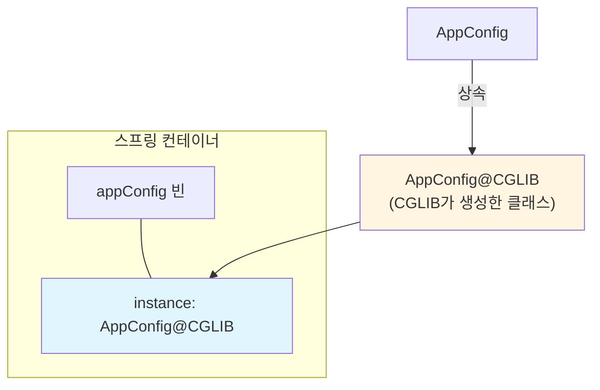
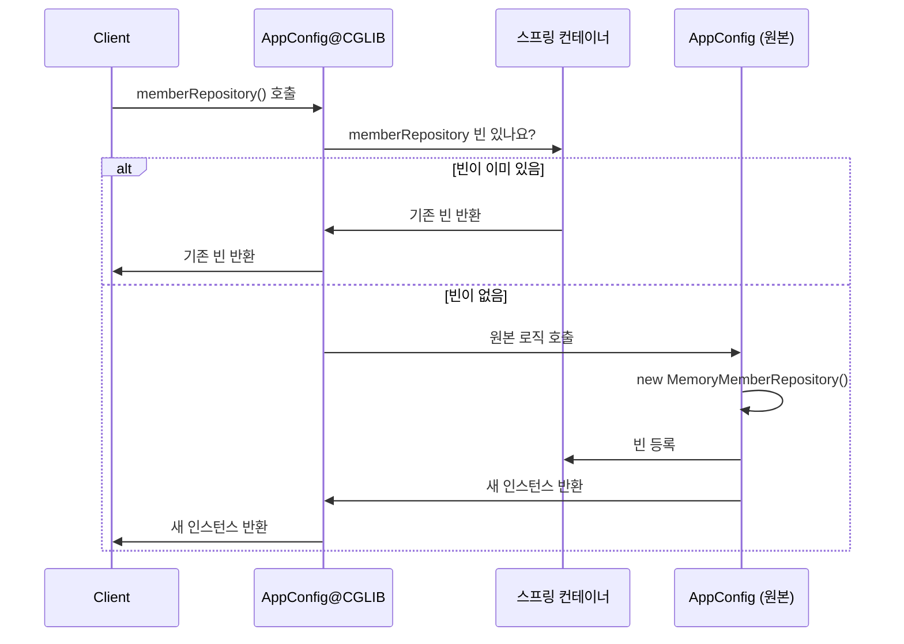
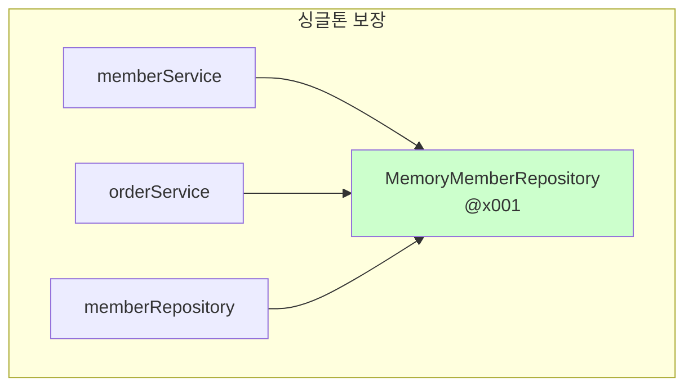
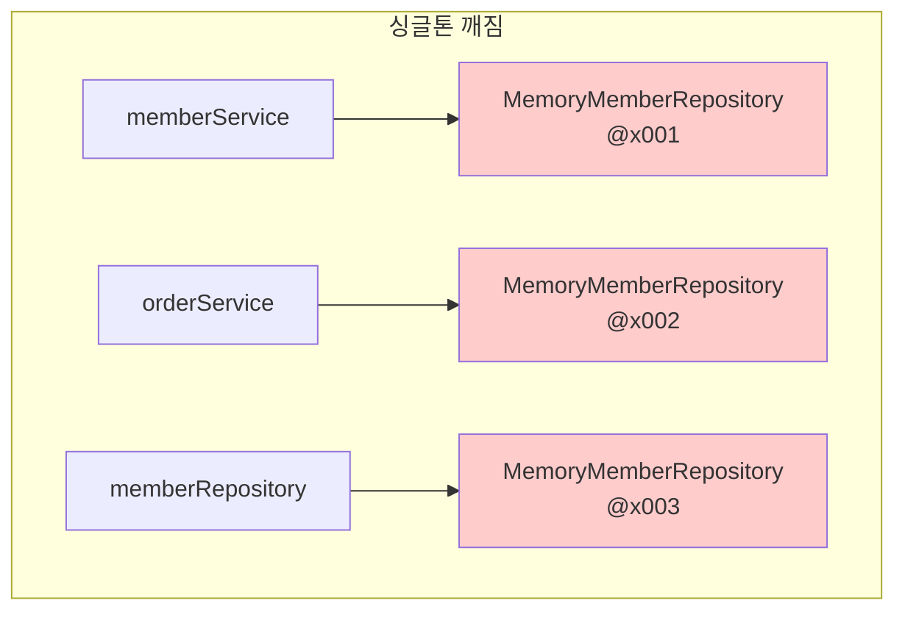
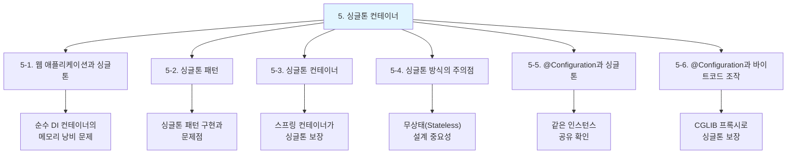

# 5-6. @Configuration과 바이트코드 조작의 마법

**출처**: 인프런 - 스프링 핵심 원리 기본편
**챕터**: 5. 싱글톤 컨테이너

---

## 학습 목표

- [ ] CGLIB를 사용한 바이트코드 조작 방식을 이해한다
- [ ] AppConfig@CGLIB의 동작 원리를 설명할 수 있다
- [ ] @Configuration 없이 @Bean만 사용하면 어떻게 되는지 이해한다

---

## 스프링 컨테이너의 비밀

### 싱글톤 보장의 핵심

```
스프링 컨테이너는 싱글톤 레지스트리다.
따라서 스프링 빈이 싱글톤이 되도록 보장해주어야 한다.
그런데 스프링이 자바 코드까지 어떻게 하기는 어렵다.
저 자바 코드를 보면 분명 3번 호출되어야 하는 것이 맞다.
```

### 해결책: 바이트코드 조작

```
그래서 스프링은 클래스의 바이트코드를 조작하는 라이브러리를 사용한다.
모든 비밀은 @Configuration을 적용한 AppConfig에 있다.
```

---

## CGLIB 확인하기

### 테스트 코드

```java
@Test
void configurationDeep() {
    ApplicationContext ac = new AnnotationConfigApplicationContext(AppConfig.class);

    //AppConfig도 스프링 빈으로 등록된다.
    AppConfig bean = ac.getBean(AppConfig.class);

    System.out.println("bean = " + bean.getClass());
    //출력: bean = class hello.core.AppConfig$$EnhancerBySpringCGLIB$$bd479d70
}
```

### 출력 결과

```
bean = class hello.core.AppConfig$$EnhancerBySpringCGLIB$$bd479d70
```

### 결과 분석

**순수한 클래스라면**:
```
class hello.core.AppConfig
```

**실제 출력**:
```
class hello.core.AppConfig$$EnhancerBySpringCGLIB$$bd479d70
```

**의미**:
- `xxxCGLIB`가 붙으면서 상당히 복잡해진 것을 볼 수 있음
- 이것은 **내가 만든 클래스가 아님!**
- 스프링이 **CGLIB라는 바이트코드 조작 라이브러리**를 사용
- **AppConfig 클래스를 상속받은 임의의 다른 클래스**를 만듦
- 그 다른 클래스를 **스프링 빈으로 등록**한 것!

---

## CGLIB의 동작 원리

### 클래스 상속 구조



### AppConfig@CGLIB 예상 코드

**실제로는 CGLIB의 내부 기술을 사용하는데 매우 복잡하다. 아마도 다음과 같이 동작할 것이다:**

```java
@Bean
public MemberRepository memberRepository() {

    if (memoryMemberRepository가 이미 스프링 컨테이너에 등록되어 있으면?) {
        return 스프링 컨테이너에서 찾아서 반환;
    } else { //스프링 컨테이너에 없으면
        기존 로직을 호출해서 MemoryMemberRepository를 생성하고 스프링 컨테이너에 등록
        return 반환
    }
}
```

### 동작 흐름 다이어그램



### 핵심 동작

1. `@Bean`이 붙은 메서드마다 **이미 스프링 빈이 존재하면** 존재하는 빈을 반환
2. 스프링 빈이 **없으면** 생성해서 스프링 빈으로 등록하고 반환
3. **덕분에 싱글톤이 보장**되는 것!

---

## @Configuration이 없으면?

### @Configuration을 붙이면

```
바이트코드를 조작하는 CGLIB 기술을 사용해서 싱글톤을 보장한다.
```

### @Configuration 없이 @Bean만 적용하면?

```java
//@Configuration 삭제
public class AppConfig {

}
```

### 테스트 결과

**빈 클래스 출력**:
```
bean = class hello.core.AppConfig
```

- `AppConfig`가 **CGLIB 기술 없이** 순수한 AppConfig로 스프링 빈에 등록됨

**호출 로그**:
```
call AppConfig.memberService
call AppConfig.memberRepository
call AppConfig.orderService
call AppConfig.memberRepository
call AppConfig.memberRepository
```

- `MemberRepository`가 **총 3번 호출**됨!
- 1번은 `@Bean`에 의해 스프링 컨테이너에 등록하기 위해서
- 2번은 각각 `memberRepository()`를 호출하면서 발생한 코드

### 인스턴스 비교 결과

```
memberService -> memberRepository = hello.core.member.MemoryMemberRepository@6239aba6
orderService -> memberRepository = hello.core.member.MemoryMemberRepository@3e6104fc
memberRepository = hello.core.member.MemoryMemberRepository@12359a82
```

- **각각 다른 MemoryMemberRepository 인스턴스**를 가지고 있음!
- 인스턴스가 같은지 테스트하는 코드도 **실패**
- **싱글톤이 보장되지 않음!**

---

## @Configuration 유무 비교

### 비교표

| 항목 | @Configuration 있음 | @Configuration 없음 |
|------|-------------------|-------------------|
| **빈 클래스** | AppConfig$$CGLIB | AppConfig |
| **memberRepository() 호출** | 1번 | 3번 |
| **인스턴스 개수** | 1개 | 3개 |
| **싱글톤 보장** | ✅ | ❌ |

### 시각적 비교

**@Configuration 있을 때**:


**@Configuration 없을 때**:


---

## 정리

### @Bean만 사용하면

- 스프링 빈으로 **등록은 됨**
- 하지만 **싱글톤을 보장하지 않음**
- `memberRepository()`처럼 의존관계 주입이 필요해서 메서드를 직접 호출할 때 **싱글톤을 보장하지 않음**

### 결론

```
크게 고민할 것이 없다.
스프링 설정 정보는 항상 @Configuration을 사용하자.
```

---

## 핵심 정리

### @Configuration의 역할


### CGLIB 프록시의 동작

```java
// CGLIB가 생성한 프록시의 동작 (개념적)
public class AppConfig$$CGLIB extends AppConfig {

    @Override
    public MemberRepository memberRepository() {
        // 1. 스프링 컨테이너에서 빈 확인
        if (beanFactory.containsBean("memberRepository")) {
            return beanFactory.getBean("memberRepository");
        }
        // 2. 없으면 원본 메서드 호출하여 생성
        return super.memberRepository();
    }
}
```

### 중요 포인트

| 포인트 | 설명 |
|--------|------|
| **AppConfig@CGLIB** | AppConfig를 상속받은 CGLIB 프록시 클래스 |
| **싱글톤 보장** | 이미 등록된 빈이 있으면 그것을 반환 |
| **@Configuration 필수** | 설정 정보에는 항상 @Configuration 사용 |

### 참고사항

> **참고**
> `AppConfig@CGLIB`는 `AppConfig`의 자식 타입이므로,
> `AppConfig` 타입으로 조회할 수 있다.

---

## 💡 심화 내용

<details>
<summary>더 알아보기</summary>

### CGLIB (Code Generation Library)

- 바이트코드를 조작해서 동적으로 클래스를 생성하는 라이브러리
- 스프링이 내부적으로 사용
- **인터페이스 없이도** 프록시 생성 가능
- JDK 동적 프록시는 인터페이스가 필수지만, CGLIB는 클래스 상속으로 프록시 생성

### CGLIB vs JDK 동적 프록시

| 구분 | CGLIB | JDK 동적 프록시 |
|------|-------|---------------|
| **인터페이스** | 불필요 | 필수 |
| **방식** | 상속 | 인터페이스 구현 |
| **속도** | 상대적으로 빠름 | 상대적으로 느림 |
| **final 클래스** | 프록시 생성 불가 | 해당 없음 |

### Spring Boot의 기본 설정

```properties
# application.properties
# Spring Boot 2.0 이후 기본값: true
spring.aop.proxy-target-class=true
```

- Spring Boot 2.0부터 **CGLIB를 기본으로 사용**
- 인터페이스가 있어도 CGLIB 프록시 생성

### @Configuration의 proxyBeanMethods

```java
@Configuration(proxyBeanMethods = false)  // CGLIB 프록시 사용 안 함
public class AppConfig {
    // 싱글톤 보장 안 됨!
    // 빈 메서드 간 호출 시 새 인스턴스 생성
}
```

- `proxyBeanMethods = false`로 설정하면 CGLIB 프록시를 사용하지 않음
- 성능 최적화가 필요할 때 사용 (빈 메서드 간 호출이 없는 경우)
- **주의**: 싱글톤이 보장되지 않으므로 빈 메서드 간 호출 금지

</details>

---

## 면접 질문

### 초급 개발자 (Junior)

**Q1. @Configuration 어노테이션의 역할은 무엇인가요?**
<details>
<summary>답안 보기</summary>

`@Configuration`은 스프링 설정 클래스임을 나타내는 어노테이션입니다.

**주요 역할**:
1. 해당 클래스가 빈 정의의 소스임을 나타냄
2. **CGLIB 프록시**를 통해 **싱글톤을 보장**
3. `@Bean` 메서드의 호출을 가로채서 이미 생성된 빈이 있으면 그것을 반환

**예시**:
```java
@Configuration
public class AppConfig {
    @Bean
    public MemberService memberService() {
        return new MemberServiceImpl(memberRepository());
    }

    @Bean
    public MemberRepository memberRepository() {
        return new MemoryMemberRepository();
    }
}
```

`memberService()`에서 `memberRepository()`를 호출해도 새 인스턴스가 생성되지 않고, 스프링 컨테이너에 등록된 기존 빈이 반환됩니다.

</details>

**Q2. @Configuration 없이 @Bean만 사용하면 어떻게 되나요?**
<details>
<summary>답안 보기</summary>

**차이점**:

| 항목 | @Configuration + @Bean | @Bean만 |
|------|----------------------|---------|
| 빈 등록 | O | O |
| CGLIB 프록시 | O | X |
| 싱글톤 보장 | O | **X** |

**문제 상황**:
```java
public class AppConfig {  // @Configuration 없음
    @Bean
    public MemberService memberService() {
        return new MemberServiceImpl(memberRepository());
    }

    @Bean
    public MemberRepository memberRepository() {
        return new MemoryMemberRepository();
    }
}
```

- `memberService()`에서 `memberRepository()` 호출 시 **새 인스턴스 생성**
- `@Bean memberRepository()`도 **새 인스턴스 생성**
- 결과적으로 **서로 다른 인스턴스**가 주입됨

따라서 설정 클래스에는 **항상 @Configuration을 사용**해야 합니다.

</details>

### 중급 개발자 (Mid-Level)

**Q3. CGLIB를 사용한 싱글톤 보장 원리를 설명해주세요.**
<details>
<summary>답안 보기</summary>

**CGLIB 동작 원리**:

1. **프록시 클래스 생성**: `@Configuration` 클래스를 상속받는 프록시 클래스 생성
2. **메서드 오버라이드**: `@Bean` 메서드를 오버라이드
3. **빈 존재 확인**: 메서드 호출 시 스프링 컨테이너에서 빈 존재 여부 확인
4. **조건부 반환**: 있으면 기존 빈 반환, 없으면 원본 메서드 호출 후 등록

**의사 코드**:
```java
public class AppConfig$$CGLIB extends AppConfig {

    private BeanFactory beanFactory;

    @Override
    public MemberRepository memberRepository() {
        if (beanFactory.containsBean("memberRepository")) {
            // 이미 존재하면 기존 빈 반환
            return beanFactory.getBean("memberRepository", MemberRepository.class);
        }
        // 없으면 원본 호출 후 등록
        MemberRepository bean = super.memberRepository();
        beanFactory.registerSingleton("memberRepository", bean);
        return bean;
    }
}
```

**검증**:
```java
AppConfig config = ac.getBean(AppConfig.class);
System.out.println(config.getClass());
// 출력: class hello.core.AppConfig$$EnhancerBySpringCGLIB$$...
```

</details>

### 고급 개발자 (Senior)

**Q4. @Configuration(proxyBeanMethods = false)는 언제 사용하나요?**
<details>
<summary>답안 보기</summary>

**proxyBeanMethods = false 사용 시기**:

1. **빈 메서드 간 호출이 없을 때**: 빈 메서드가 서로 호출하지 않으면 CGLIB 불필요
2. **성능 최적화**: 프록시 생성 비용 절감
3. **Spring Boot 3.0+ 자동 설정 클래스**: 많은 자동 설정 클래스가 이 방식 사용

**예시**:
```java
@Configuration(proxyBeanMethods = false)
public class MyAutoConfiguration {

    @Bean
    public ServiceA serviceA() {
        return new ServiceA();
    }

    @Bean
    public ServiceB serviceB() {
        return new ServiceB();  // serviceA()를 호출하지 않음
    }
}
```

**주의사항**:
```java
@Configuration(proxyBeanMethods = false)
public class BadConfig {

    @Bean
    public ServiceA serviceA() {
        return new ServiceA(serviceB());  // 주의! 새 인스턴스 생성됨
    }

    @Bean
    public ServiceB serviceB() {
        return new ServiceB();
    }
}
```

이 경우 `serviceA()`에서 호출한 `serviceB()`는 스프링 빈이 아닌 **새 인스턴스**입니다.

**올바른 방법** (proxyBeanMethods = false 사용 시):
```java
@Configuration(proxyBeanMethods = false)
public class GoodConfig {

    @Bean
    public ServiceA serviceA(ServiceB serviceB) {  // 파라미터로 주입
        return new ServiceA(serviceB);
    }

    @Bean
    public ServiceB serviceB() {
        return new ServiceB();
    }
}
```

</details>

---

## 전체 챕터 요약

### 5. 싱글톤 컨테이너 핵심 정리



### 핵심 메시지

| 주제 | 핵심 내용 |
|------|----------|
| **싱글톤 필요성** | 웹 애플리케이션에서 메모리 효율을 위해 필수 |
| **스프링 컨테이너** | 싱글톤 레지스트리 역할, 싱글톤 보장 |
| **무상태 설계** | 공유 필드 금지, ThreadLocal/파라미터 사용 |
| **@Configuration** | CGLIB 프록시로 싱글톤 보장, 항상 사용할 것 |

### 기억할 것

```
1. 스프링 빈은 기본적으로 싱글톤으로 관리된다.

2. 싱글톤 빈은 무상태(Stateless)로 설계해야 한다.

3. 스프링 설정 정보는 항상 @Configuration을 사용하자.
```

---

## 다음 학습 주제

➡️ **6. 컴포넌트 스캔**
- @ComponentScan 사용 방법
- @Component, @Service, @Repository, @Controller
- 컴포넌트 스캔과 의존관계 자동 주입
